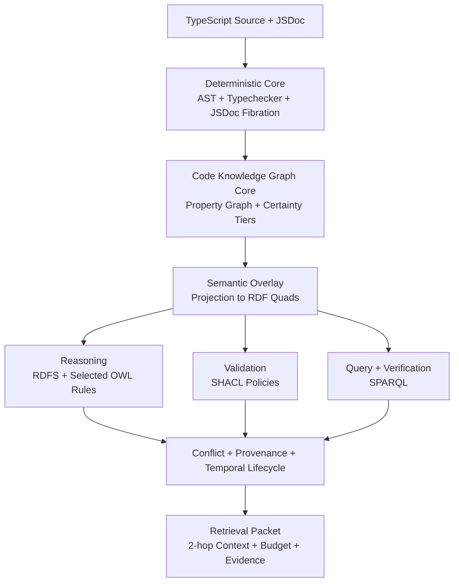
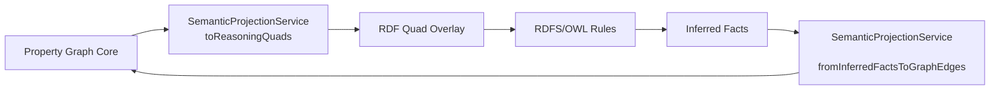
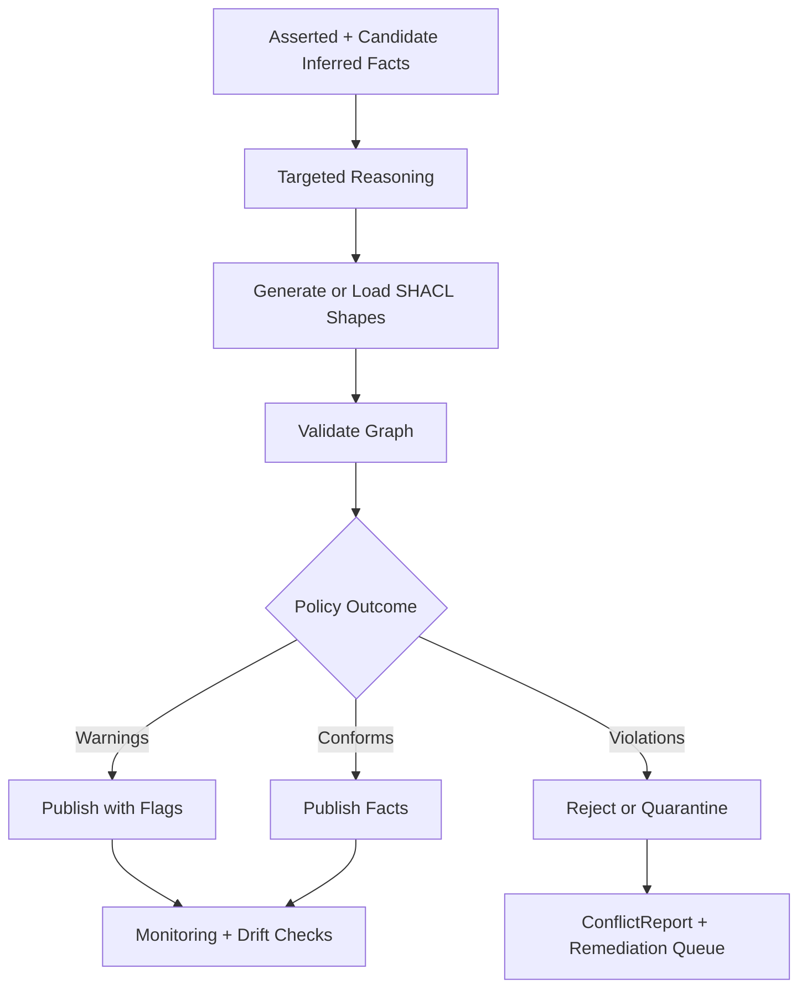
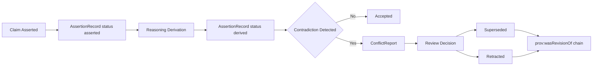

# OVERVIEW Semantic KG Integration Explained

## 1. Why This Document Exists
This document is a human-first semantic architecture companion for the codegraph effort. It explains how `PROV-O`, `OWL2`, `RDFS`, `SHACL`, `SPARQL`, bounded reasoning, and entity extraction fit into the envisioned TypeScript code knowledge graph enriched with JSDoc fibrational metadata.

Major claims:
- `Specified (Current Architecture)`: The current design already positions deterministic extraction, JSDoc fibration, NLP enrichment, and optional reasoning as one system.
- `Current Implemented (Verified)`: The JSDoc fibrational foundation exists in current `repo-utils` models.
- `Legacy Implemented (Verified)`: A prior Effect runtime implemented concrete reasoning, SHACL validation, SPARQL execution, provenance emission, and extraction pipelines that can inform integration seams.
- `Exploratory Opportunity (Recommended Default)`: Use legacy semantic patterns as reference architecture for the new greenfield spec without treating old code as migration target.

Source trail:
- `initiatives/repo-codegraph-jsdoc/SPEC.md`
- `tooling/repo-utils/src/JSDoc/models/JSDocTagDefinition.model.ts`
- `.repos/beep-effect/packages/knowledge/server/src/Reasoning/ReasonerService.ts`
- `.repos/beep-effect/packages/knowledge/server/src/Validation/ShaclService.ts`

## 2. How to Read This (Senior TS Mental Model)
Read this in two passes.

Pass 1: architecture shape
- Sections 3-7 give the complete mental model from source code and JSDoc to trusted retrieval output.

Pass 2: semantic mechanics
- Sections 8-14 explain each semantic layer (`entity extraction`, `ontology`, `reasoning`, `validation`, `query`, `provenance`, `conflict lifecycle`) using explicit TS service seams.

Pass 3: planning handoff
- Sections 15-20 map this model to P0-P7, candidate contracts, defaults, guardrails, concrete scenarios, and a spec-seeding checklist.

Evidence tag usage:
- `Current Implemented (Verified)`: only for currently verifiable code in this repo.
- `Legacy Implemented (Verified)`: only for verifiable code in `.repos/beep-effect`.
- `Specified (Current Architecture)`: documented architecture intent in current spec docs.
- `Exploratory Opportunity (Recommended Default)`: suggested integration default for next spec.

Source trail:
- `initiatives/repo-codegraph-jsdoc/SPEC.md`
- `initiatives/repo-codegraph-jsdoc/research/legacy-knowledge-integration-explained.md`

## 3. System in One Picture: Deterministic Core + Semantic Overlay
Major claims:
- `Specified (Current Architecture)`: Deterministic-first extraction is the core trust surface.
- `Specified (Current Architecture)`: Reasoning is an augmentation layer, not source of truth replacement.
- `Exploratory Opportunity (Recommended Default)`: Keep property graph primary; project into RDF/quads for inference and validation workflows.



What matters operationally:
- deterministic facts remain authoritative for writes.
- inference adds explainable, bounded enrichment.
- validation and contradiction logic protect trust boundaries.

Source trail:
- `initiatives/repo-codegraph-jsdoc/SPEC.md`
- `initiatives/repo-codegraph-jsdoc/history/outputs/JSDOC_FIBRATION_ARCHITECTURE.md`
- `.repos/beep-effect/packages/knowledge/_docs/ontology_research/REASONING_RECOMMENDATIONS.md`

## 4. Semantic Stack Primer: PROV-O, OWL2, RDFS, SHACL, SPARQL (in code terms)
Major claims:
- `Legacy Implemented (Verified)`: legacy runtime had concrete modules mapping to these semantic technologies.
- `Specified (Current Architecture)`: current architecture already anticipates these as integration layers.
- `Exploratory Opportunity (Recommended Default)`: treat each technology as a specific pipeline responsibility, not a generic "semantic web add-on."

Practical TS framing:
- `RDFS`: lightweight inference rules for type/domain/range/subclass/subproperty closure.
- `OWL2` (selected profile behavior): identity and property semantics (`sameAs`, `inverseOf`, transitive/symmetric properties) with strict guardrails.
- `SHACL`: graph-quality gate with policy-driven reject/warn/ignore behavior.
- `SPARQL`: deterministic verification and diagnostics query surface.
- `PROV-O`: typed provenance graph for activity/entity/agent lineage plus temporal metadata.

Separation of concerns:
- infer with RDFS/OWL rules.
- validate with SHACL constraints.
- query with SPARQL.
- explain with PROV-O and conflict lifecycle metadata.

Source trail:
- `.repos/beep-effect/packages/knowledge/server/src/Reasoning/RdfsRules.ts`
- `.repos/beep-effect/packages/knowledge/server/src/Reasoning/OwlRules.ts`
- `.repos/beep-effect/packages/knowledge/server/src/Validation/ShaclService.ts`
- `.repos/beep-effect/packages/knowledge/server/src/Sparql/SparqlService.ts`
- `.repos/beep-effect/packages/knowledge/server/src/Rdf/ProvOConstants.ts`

## 5. Current Architecture Anchors (JSDoc Fibration + NLP + Codegraph)
Major claims:
- `Current Implemented (Verified)`: JSDoc fibration is already concretely represented in current code.
- `Specified (Current Architecture)`: NLP service boundaries and code-aware claim decomposition are defined.
- `Specified (Current Architecture)`: property graph primary with optional reasoning overlay is explicitly documented.

Anchor 1: JSDoc fibrational metadata
- `Current Implemented (Verified)`: `make()` in `JSDocTagDefinition` factors tag metadata into schema annotation (`jsDocTagMetadata`) and leaves occurrence payload in `value` fiber.
- `Current Implemented (Verified)`: `getJSDocTagMetadata` provides runtime projection of annotation metadata from schema.

Anchor 2: NLP decomposition
- `Specified (Current Architecture)`: six-module NLP service model covers sentence protection zones, token estimation, claim decomposition, code-aware chunking, context budgeting, and identifier normalization.

Anchor 3: codegraph core
- `Specified (Current Architecture)`: deterministic-first certainty model and phase-based rollout (P0-P7).
- `Specified (Current Architecture)`: reasoning and contradiction handling are first-class design targets for next spec.

Source trail:
- `tooling/repo-utils/src/JSDoc/models/JSDocTagDefinition.model.ts`
- `tooling/repo-utils/src/JSDoc/models/JSDocTagAnnotation.model.ts`
- `initiatives/repo-codegraph-jsdoc/history/outputs/JSDOC_FIBRATION_ARCHITECTURE.md`
- `initiatives/repo-codegraph-jsdoc/history/outputs/Building a code-aware NLP service in TypeScript.md`
- `initiatives/repo-codegraph-jsdoc/SPEC.md`

## 6. Legacy Runtime Reality Check (What Actually Existed)
Major claims:
- `Legacy Implemented (Verified)`: a bounded forward-chaining reasoner with RDFS/OWL rule sets and provenance existed.
- `Legacy Implemented (Verified)`: SHACL service with shape generation from ontology and policy enforcement existed.
- `Legacy Implemented (Verified)`: SPARQL service with typed query forms and safety boundaries existed.
- `Legacy Implemented (Verified)`: extraction pipeline emitted provenance quads and integrated mention/entity/relation stages.
- `Legacy Implemented (Verified)`: GraphRAG citation validation used SPARQL + reasoning and generated reasoning traces.

Implication for current design:
- these are proven interface seams, not just theory.
- they reduce risk for next-spec contract drafting.
- they should still be considered historical reference, not migration lock-in.

Source trail:
- `.repos/beep-effect/packages/knowledge/server/src/Reasoning/ForwardChainer.ts`
- `.repos/beep-effect/packages/knowledge/server/src/Reasoning/ReasonerService.ts`
- `.repos/beep-effect/packages/knowledge/server/src/Validation/ShaclService.ts`
- `.repos/beep-effect/packages/knowledge/server/src/Sparql/SparqlService.ts`
- `.repos/beep-effect/packages/knowledge/server/src/Rdf/ProvenanceEmitter.ts`
- `.repos/beep-effect/packages/knowledge/server/src/Extraction/ExtractionPipeline.ts`
- `.repos/beep-effect/packages/knowledge/server/src/GraphRAG/CitationValidator.ts`

## 7. End-to-End Flow: Source Code/JSDoc to Trustworthy Knowledge
Major claims:
- `Specified (Current Architecture)`: end-to-end flow is deterministic extraction first, then enrichment/validation, then retrieval.
- `Legacy Implemented (Verified)`: extraction + provenance + validation + query/verification were already separable runtime phases.
- `Exploratory Opportunity (Recommended Default)`: insert semantic projection and bounded reasoning between graph assembly and retrieval packet creation.


Definitive benefits:
- stronger claim verification with deterministic and semantic evidence combination.
- explainable inference and contradiction handling instead of silent data drift.

Potential opportunities:
- incremental validation and external reasoner thresholds for large-scale batches.

Source trail:
- `initiatives/repo-codegraph-jsdoc/SPEC.md`
- `initiatives/repo-codegraph-jsdoc/history/outputs/Building a code-aware NLP service in TypeScript.md`
- `.repos/beep-effect/packages/knowledge/server/src/Extraction/ExtractionPipeline.ts`
- `.repos/beep-effect/packages/knowledge/_docs/ontology_research/rdf_shacl_reasoning_research.md`

## 8. Entity Extraction: Where Semantics Enter the System
### What
Entity extraction is the semantic ingress point. It converts code-adjacent text and JSDoc-derived context into typed mentions, classified entities, and relation candidates, then binds each output to evidence spans and confidence. In TS service terms, this is the stage where free text becomes graph-addressable facts.

### Where
- `Specified (Current Architecture)`: aligns with P2-P4 (`deterministic extraction`, `enrichment`, `claim decomposition`).
- `Legacy Implemented (Verified)`: concrete flow exists in extraction pipeline and entity extractor services.

### How
Recommended seam:
- `Exploratory Opportunity (Recommended Default)`: `EntityExtractionService` with methods `extractMentions`, `classifyEntities`, `extractRelations`, `emitEvidence`.
- Output should include `ClaimRecord` candidates and `VerificationEvidence` pointers where possible.
- Relation and mention evidence should be normalized at claim granularity, not only edge granularity.

### Failure Modes
- ontology mismatch causes invalid type assignments.
- mention spans become unstable across document revisions.
- relation extraction over-generates low-trust edges without evidence normalization.
- confidence-only gating without deterministic checks introduces silent hallucination risk.

### Why It Matters
Without a strong semantic ingress layer, later reasoning and validation either underperform or become noisy. Good extraction contracts make every downstream semantic stage cheaper and more reliable.

Source trail:
- `.repos/beep-effect/packages/knowledge/server/src/Extraction/EntityExtractor.ts`
- `.repos/beep-effect/packages/knowledge/server/src/Extraction/ExtractionPipeline.ts`
- `.repos/beep-effect/packages/knowledge/domain/src/entities/RelationEvidence/RelationEvidence.model.ts`
- `.repos/beep-effect/packages/knowledge/domain/src/entities/MentionRecord/MentionRecord.model.ts`
- `initiatives/repo-codegraph-jsdoc/history/outputs/Building a code-aware NLP service in TypeScript.md`

## 9. Ontology Layer: OWL2/RDFS Role in a Code Knowledge Graph
### What
The ontology layer defines type and property semantics used by extraction, inference, and validation. For this system, `RDFS` provides practical closure operations, while selected `OWL2` behavior is used only where it delivers direct graph utility.

### Where
- `Specified (Current Architecture)`: belongs to schema and enrichment boundaries in P1-P4 and to reasoning integration in P5.
- `Legacy Implemented (Verified)`: ontology entities, property/class definitions, and ontology registry services existed.

### How
Recommended default:
- keep ontology usage profile-light: `RDFS` core + selective `OWL` property rules.
- avoid full OWL DL assumptions for this pipeline.
- treat ontology as contract source for shape generation and reasoning profile selection.



### Failure Modes
- over-broad OWL semantics can produce identity explosion and noisy closures.
- ontology/version drift can break extraction and validation alignment.
- missing class/property definitions force weak fallback typing.

### Why It Matters
Ontology discipline prevents the semantic stack from turning into ad-hoc enrichment. It provides shared vocabulary for extraction, reasoning, validation, and retrieval.

Source trail:
- `.repos/beep-effect/packages/knowledge/domain/src/entities/Ontology/Ontology.model.ts`
- `.repos/beep-effect/packages/knowledge/domain/src/entities/ClassDefinition/ClassDefinition.model.ts`
- `.repos/beep-effect/packages/knowledge/domain/src/entities/PropertyDefinition/PropertyDefinition.model.ts`
- `.repos/beep-effect/packages/knowledge/server/src/Service/OntologyRegistry.ts`
- `.repos/beep-effect/packages/knowledge/_docs/ontology_research/REASONING_RECOMMENDATIONS.md`

## 10. Reasoning Layer: Bounded Forward Chaining and Profiles
### What
Reasoning is a bounded forward-chaining stage that derives additional facts from asserted quads using profile-selected rule families. It is not an unbounded truth engine; it is a constrained augmentation service with explicit provenance.

### Where
- `Specified (Current Architecture)`: maps to reasoning augmentation and contradiction workflows in `OVERVIEW` Sections 8, 10, 11, 13, 14.
- `Legacy Implemented (Verified)`: forward chainer, profile taxonomy, and service APIs existed.

### How
Recommended default:
- `ReasoningService.inferSubgraph` for request path (non-materialized by default).
- `ReasoningService.inferAndMaterialize` for controlled background paths.
- enforce `maxDepth` and `maxInferences` hard limits.
- start rollout with `rdfs-subclass` and `rdfs-domain-range`; gate `owl-full` behind explicit feature flags.

Legacy-verified profile examples:
- `rdfs-subclass`
- `rdfs-domain-range`
- `owl-sameas`
- `owl-full`
- `custom`

### Failure Modes
- inference blow-up from unconstrained profiles.
- `owl:sameAs` over-linking and graph pollution.
- inferred fact precedence errors if deterministic facts are not protected.
- missing provenance prevents traceable remediation.

### Why It Matters
Bounded reasoning improves semantic completeness and verification fidelity while preserving deterministic trust boundaries.

Source trail:
- `.repos/beep-effect/packages/knowledge/server/src/Reasoning/ForwardChainer.ts`
- `.repos/beep-effect/packages/knowledge/server/src/Reasoning/RdfsRules.ts`
- `.repos/beep-effect/packages/knowledge/server/src/Reasoning/OwlRules.ts`
- `.repos/beep-effect/packages/knowledge/server/src/Reasoning/ReasonerService.ts`
- `.repos/beep-effect/packages/knowledge/domain/src/values/reasoning/ReasoningProfile.value.ts`
- `initiatives/repo-codegraph-jsdoc/SPEC.md`

## 11. Validation Layer: SHACL as Quality Gate
### What
SHACL is the closed-world quality gate. It enforces structural and semantic constraints over asserted plus selected inferred facts using explicit severity policies.

### Where
- `Specified (Current Architecture)`: validation and de-hallucinator loops in `OVERVIEW`.
- `Legacy Implemented (Verified)`: SHACL service generated shapes from ontology and produced typed reports with policy enforcement.

### How
Recommended default:
- pipeline sequence `materializeInferences -> validateShapes -> publishFacts`.
- use severity policy contract (`ignore`, `warn`, `reject`) per level (`Info`, `Warning`, `Violation`).
- apply targeted reasoning before SHACL for relevant subgraphs only.



### Failure Modes
- SHACL-only stubs that do not enforce policy in runtime workflow.
- validating without needed entailments misses meaningful constraint failures.
- shape drift from ontology drift causes false positives/negatives.

### Why It Matters
SHACL is the practical trust gate that converts semantic modeling into enforceable data quality behavior.

Source trail:
- `.repos/beep-effect/packages/knowledge/server/src/Validation/ShaclService.ts`
- `.repos/beep-effect/packages/knowledge/server/src/Validation/ShapeGenerator.ts`
- `.repos/beep-effect/packages/knowledge/domain/src/values/ShaclPolicy.value.ts`
- `.repos/beep-effect/packages/knowledge/domain/src/values/ValidationReport.value.ts`
- `.repos/beep-effect/packages/knowledge/_docs/ontology_research/rdf_shacl_reasoning_research.md`

## 12. Query Layer: SPARQL for Verification, Diagnostics, and Retrieval
### What
SPARQL is the deterministic semantic query layer for verification and diagnostics. It is not only retrieval syntax; it is a runtime instrument for trust checks (`ASK`), trace extraction (`CONSTRUCT`), and analytical inspection (`SELECT`/`DESCRIBE`).

### Where
- `Specified (Current Architecture)`: verification, contradiction analysis, and retrieval packet assembly.
- `Legacy Implemented (Verified)`: typed SPARQL service existed with explicit query-type boundaries.

### How
Recommended default:
- introduce `SparqlVerificationService` with `ask`, `select`, `construct`, `describe`.
- use `ASK` first for low-latency existence checks.
- use `CONSTRUCT` for explanation packets and projection views.
- keep write/query generation safety boundaries explicit.

### Failure Modes
- query generation drifts into unsupported operations.
- timeout-heavy query surfaces degrade request path.
- retrieval path becomes opaque without query-level diagnostics.

### Why It Matters
SPARQL gives deterministic observability and verification at semantic graph level, which is critical when LLM-derived and inferred facts coexist.

Source trail:
- `.repos/beep-effect/packages/knowledge/server/src/Sparql/SparqlService.ts`
- `.repos/beep-effect/packages/knowledge/server/src/Sparql/SparqlGenerator.ts`
- `.repos/beep-effect/packages/knowledge/domain/src/values/sparql/SparqlQuery.value.ts`
- `.repos/beep-effect/packages/knowledge/server/src/GraphRAG/CitationValidator.ts`

## 13. Provenance Layer: PROV-O + Temporal Dimensions
### What
The provenance layer records how facts entered or changed in the system using `PROV-O` semantics (`Activity`, `Entity`, `Agent`, `used`, `wasGeneratedBy`, `startedAtTime`, `endedAtTime`) plus temporal dimensions needed for audit and correction workflows.

### Where
- `Specified (Current Architecture)`: provenance-aware inference facts and contradiction reporting in current overview.
- `Legacy Implemented (Verified)`: dedicated provenance constants/vocabulary and quad emission existed.
- `Exploratory Opportunity (Recommended Default)`: expand temporal model to `publishedAt`, `ingestedAt`, `assertedAt`, `derivedAt`, and optional `eventTime`.

### How
Recommended default:
- use named provenance graph for extraction/inference activity quads.
- represent claim lifecycle transitions with temporal provenance fields.
- keep provenance references on both asserted and inferred facts.

### Failure Modes
- missing provenance graph links makes contradiction resolution non-actionable.
- single timestamp model cannot answer timeline/audit questions.
- provenance disconnected from claims/evidence prevents explainability.

### Why It Matters
Provenance is not optional metadata; it is the debugging and trust backbone for a semantic codegraph in production.

Source trail:
- `.repos/beep-effect/packages/knowledge/server/src/Rdf/ProvOConstants.ts`
- `.repos/beep-effect/packages/knowledge/server/src/Rdf/ProvenanceEmitter.ts`
- `.repos/beep-effect/packages/knowledge/domain/src/values/rdf/ProvenanceVocabulary.value.ts`
- `.repos/beep-effect/packages/knowledge/_docs/audits/2025-12-18-medium-severity-modeling-audit.md`

## 14. Conflict and Contradiction Lifecycle
### What
Conflict lifecycle is the typed process for handling contradictions between deterministic facts, inferred facts, and extracted claims over time. It defines status transitions (`asserted`, `derived`, `superseded`, `retracted`) and revision lineage.

### Where
- `Specified (Current Architecture)`: contradiction handling and conflict reports are required in `OVERVIEW`.
- `Legacy Implemented (Verified)`: reasoning traces and citation validation showed an existing pattern for explanation paths.
- `Exploratory Opportunity (Recommended Default)`: add explicit `ConflictLifecycleService` + claim revision links.

### How
Recommended default:
- deterministic facts win conflicts by default.
- inferred/extracted conflicts produce `ConflictReport` with remediation action.
- corrections create revision chain instead of destructive overwrite.



### Failure Modes
- no lifecycle states means unresolved contradictions silently persist.
- overwrite-only updates destroy forensic explainability.
- absence of revision links breaks historical trust analysis.

### Why It Matters
Contradiction handling is the difference between a graph that looks rich and a graph that can be trusted under change.

Source trail:
- `initiatives/repo-codegraph-jsdoc/SPEC.md`
- `.repos/beep-effect/packages/knowledge/server/src/GraphRAG/CitationValidator.ts`
- `.repos/beep-effect/packages/knowledge/server/src/GraphRAG/ReasoningTraceFormatter.ts`
- `.repos/beep-effect/packages/knowledge/_docs/ontology_research/temporal_conflicting_claims_research.md`

## 15. How This Fits P0–P7 in OVERVIEW
Major claims:
- `Specified (Current Architecture)`: P0-P7 remains authoritative delivery frame.
- `Exploratory Opportunity (Recommended Default)`: semantic layers map cleanly into phases without changing canonical lock defaults.

| Semantic Technology | Primary P0-P7 Placement | Responsibility by Phase |
|---|---|---|
| Entity Extraction | P2, P4 | deterministic mention/entity/relation extraction; claim decomposition enrichment |
| OWL2/RDFS Ontology Semantics | P1, P4, P5 | ontology contracts, targeted inference profile definitions, projection semantics |
| Reasoning Engine | P5, P6 | bounded infer/infer+materialize, contradiction pre-checks, drift auditing |
| SHACL Validation | P4, P6, P7 | shape enforcement policy, fail-closed validation gates, release validation reports |
| SPARQL Verification | P5, P6 | semantic existence checks, diagnostics, explainable verification packets |
| PROV-O + Temporal | P3, P6, P7 | lineage emission, lifecycle auditability, correction traceability |
| Conflict Lifecycle | P6, P7 | contradiction classification, remediation queues, operational governance |

Cross-reference map into `OVERVIEW`:
- Reasoning: Sections 8, 10, 11, 13, 14
- Validation: Sections 11, 14, 15, 16
- Retrieval/context: Sections 12, 13
- Phase remap baseline: Section 5

Source trail:
- `initiatives/repo-codegraph-jsdoc/SPEC.md`

## 16. Candidate TypeScript Service Contracts (Exploratory)
### What
These are conceptual contract seams for the next greenfield spec. They describe integration shape, not implementation commitment.

### Where
- `Specified (Current Architecture)`: contract inventory aligns to existing `OVERVIEW` interface direction.
- `Exploratory Opportunity (Recommended Default)`: contract set expands semantic coverage to provenance, conflict lifecycle, and retrieval packet guarantees.

### How
```ts
export type ReasoningProfile =
  | "rdfs-subclass"
  | "rdfs-domain-range"
  | "owl-sameas"
  | "owl-full"
  | "custom";

export interface EntityExtractionService {
  extractMentions(input: { text: string; contextNodeId?: string }): Promise<ReadonlyArray<{ mention: string; span: [number, number] }>>;
  classifyEntities(input: { mentions: ReadonlyArray<string>; ontologyId: string }): Promise<ReadonlyArray<{ entityId: string; typeIri: string; confidence: number }>>;
  extractRelations(input: { entities: ReadonlyArray<string>; text: string; ontologyId: string }): Promise<ReadonlyArray<{ subjectId: string; predicate: string; objectIdOrLiteral: string }>>;
  emitEvidence(input: { relationOrClaimId: string; spans: ReadonlyArray<{ documentId: string; start: number; end: number }> }): Promise<void>;
}

export interface SemanticProjectionService {
  toReasoningQuads(input: { graphNodeIds: ReadonlyArray<string> }): Promise<ReadonlyArray<{ s: string; p: string; o: string; g?: string }>>;
  fromInferredFactsToGraphEdges(input: { inferredFacts: ReadonlyArray<InferenceFact> }): Promise<ReadonlyArray<{ edgeId: string }>>;
}

export interface ReasoningService {
  inferSubgraph(input: {
    nodeIds: ReadonlyArray<string>;
    profile: ReasoningProfile;
    maxDepth: number;
    maxInferences: number;
  }): Promise<{ facts: ReadonlyArray<InferenceFact>; truncated: boolean }>;

  inferAndMaterialize(input: {
    nodeIds: ReadonlyArray<string>;
    profile: ReasoningProfile;
    maxDepth: number;
    maxInferences: number;
    materialize: boolean;
  }): Promise<{ facts: ReadonlyArray<InferenceFact>; materializedCount: number; truncated: boolean }>;
}

export interface ShaclValidationService {
  generateShapes(input: { ontologyId: string }): Promise<{ shapeCount: number }>;
  validateGraph(input: { graphRef: string; policy: ShaclPolicy }): Promise<ValidationReport>;
  enforcePolicy(input: { report: ValidationReport; policy: ShaclPolicy }): Promise<{ accepted: boolean; rejectedFindings: number }>;
}

export interface SparqlVerificationService {
  ask(input: { query: string }): Promise<boolean>;
  select(input: { query: string }): Promise<ReadonlyArray<Record<string, string>>>;
  construct(input: { query: string }): Promise<ReadonlyArray<{ s: string; p: string; o: string; g?: string }>>;
  describe(input: { query: string }): Promise<ReadonlyArray<{ s: string; p: string; o: string; g?: string }>>;
}

export interface ProvenanceService {
  emitActivity(input: { activityId: string; startedAt: string; endedAt: string; agentId: string }): Promise<void>;
  linkGeneratedEntity(input: { entityId: string; activityId: string }): Promise<void>;
  linkUsage(input: { activityId: string; sourceEntityId: string }): Promise<void>;
}

export interface ConflictLifecycleService {
  detect(input: { deterministicFactId: string; candidateFactId: string }): Promise<{ conflict: boolean; severity: "low" | "medium" | "high" }>;
  transition(input: { assertionId: string; status: "accepted" | "superseded" | "retracted"; reason: string }): Promise<void>;
}

export interface TemporalProvenance {
  publishedAt: string;
  ingestedAt: string;
  assertedAt: string;
  derivedAt: string;
  eventTime?: string;
}

export interface ClaimRecord {
  claimId: string;
  claim: string;
  claimType: string;
  sourceSpan: string;
  targetNodeId: string;
  temporal: TemporalProvenance;
}

export interface AssertionRecord {
  assertionId: string;
  claimId: string;
  status: "asserted" | "derived" | "superseded" | "retracted";
  provenanceRefId: string;
}

export interface EntityAlias {
  entityId: string;
  originalIdentifier: string;
  normalizedTokens: ReadonlyArray<string>;
  canonicalEntityId: string;
  sameAsLinks?: ReadonlyArray<string>;
}

export interface VerificationEvidence {
  claimId: string;
  astEvidencePointers: ReadonlyArray<string>;
  semanticEvidencePointers: ReadonlyArray<string>;
  verdict: "pass" | "fail" | "needs_review";
}

export type GraphSerializationTier = 0 | 1 | 2 | 3 | 4;

export interface RetrievalPacket {
  query: string;
  focalNodeId: string;
  includedNodeIds: ReadonlyArray<string>;
  selectedTierByNode: Record<string, GraphSerializationTier>;
  tokenUsage: { promptTokens: number; budget: number; truncated: boolean };
  evidenceRefs: ReadonlyArray<string>;
}

export interface InferenceFact {
  factId: string;
  subjectId: string;
  predicate: string;
  objectIdOrLiteral: string;
  certaintyTier: 2 | 3;
  provenance: { ruleId: string; sourceFactIds: ReadonlyArray<string> };
  conflictStatus: "none" | "warning" | "contradiction";
}
```

Contract inventory with recommended defaults:

| Contract | Purpose | Inputs | Outputs | Failure behavior | Recommended default |
|---|---|---|---|---|---|
| `EntityExtractionService` | semantic ingress and evidence emission | text, mentions, ontology context | entities, relations, evidence links | malformed extraction payloads go to dead-letter + retry window | evidence mandatory for non-deterministic relation writes |
| `SemanticProjectionService` | bridge graph core and reasoning overlay | graph ids or inferred facts | quads or graph edge updates | projection mismatch blocks materialization | property graph primary, quads as projection |
| `ReasoningService` | bounded inference with optional materialization | node ids, profile, bounds | inferred facts + truncation signals | hard fail on bounds exceeded unless partial mode enabled | non-materialized by default on request path |
| `ShaclValidationService` | quality gate and policy enforcement | graph reference + policy | typed validation report | reject on violations by default | `Violation -> reject`, `Warning -> warn` |
| `SparqlVerificationService` | deterministic semantic checks | read-only query | result set / boolean / quads | timeout and unsupported query typed errors | `ASK` first, then `SELECT`/`CONSTRUCT` |
| `ProvenanceService` | PROV-O lineage links | activity/entity/agent ids, times | provenance quads/links | missing provenance blocks publish in strict mode | provenance emission required before publish |
| `ConflictLifecycleService` | contradiction lifecycle and status transitions | fact pairs, assertion status actions | conflict report + updated status | unresolved high-severity conflicts block release path | deterministic fact precedence |
| `TemporalProvenance` | multi-time semantics | timestamp fields | normalized temporal model | missing required dimensions flags audit warnings | require `assertedAt` + `derivedAt` when applicable |
| `ClaimRecord`/`AssertionRecord` | explainable claim lifecycle | claim payload + lifecycle state | claim/assertion stores | invalid lifecycle transitions rejected | separate claim and assertion models |
| `EntityAlias` | identity normalization and alias governance | identifiers, canonical id | alias record | ambiguous canonicalization routes to review queue | controlled `sameAs` links to canonical id only |
| `VerificationEvidence` | claim-level proof attachments | claim + evidence pointers | pass/fail verdict | missing evidence => `needs_review` | AST evidence required for deterministic claims |
| `RetrievalPacket` | bounded context payload for LLM use | query + subgraph + budgets | tiered packet + diagnostics | overflow triggers tier downgrades/truncation flag | reserve budget for response and system prompt |

### Failure Modes
- interface drift between extraction, reasoning, validation, and retrieval layers.
- overloading one service with multiple concerns reduces observability and control.
- missing typed error taxonomy hides operational risk.

### Why It Matters
A typed seam map prevents semantic architecture from collapsing into implicit coupling and enables reliable multi-agent spec and implementation work.

Source trail:
- `initiatives/repo-codegraph-jsdoc/SPEC.md`
- `.repos/beep-effect/packages/knowledge/server/src/Extraction/ExtractionPipeline.ts`
- `.repos/beep-effect/packages/knowledge/server/src/Reasoning/ReasonerService.ts`
- `.repos/beep-effect/packages/knowledge/server/src/Validation/ShaclService.ts`
- `.repos/beep-effect/packages/knowledge/server/src/Sparql/SparqlService.ts`
- `.repos/beep-effect/packages/knowledge/server/src/Rdf/ProvenanceEmitter.ts`

## 17. Recommended Defaults vs Alternatives
### What
This section captures exploratory decisions with explicit defaults so the next spec is directional without being prematurely rigid.

### Where
- `Specified (Current Architecture)`: aligns with existing open-decision sections in current overview.
- `Exploratory Opportunity (Recommended Default)`: proposes safe-first defaults for initial rollout.

### How
| Decision Area | Recommended Default | Alternative | Definitive benefit | Potential opportunity | Tradeoff |
|---|---|---|---|---|---|
| Reasoning profile rollout | start with `rdfs-subclass` + `rdfs-domain-range` | early `owl-full` | predictable inference bounds | richer inferred graph sooner | slower path to full semantic richness |
| sameAs strategy | canonical one-way links only | symmetric/transitive closure | avoids N² identity explosion | automated identity closure | potential manual review burden |
| Materialization mode | infer on demand, materialize in background | always materialize | lower request-path risk | faster repeated semantic queries | complexity in dual-path cache coherence |
| SHACL enforcement | fail on `Violation`, warn on `Warning` | warn-only pipeline | trust gate remains enforceable | lower false reject risk during early rollout | stricter data handling early on |
| Provenance granularity | activity+fact level with temporal fields | graph-level only | actionable audit/debug trails | simpler model | higher write/storage overhead |
| SPARQL usage | verification-first (`ASK`/`SELECT`) | retrieval-only usage | deterministic confidence checks | simpler stack | leaves diagnostic gaps |
| Claim lifecycle modeling | separate `ClaimRecord`/`AssertionRecord` | edge-only storage | better explainability and revision trace | simpler schema footprint | additional model complexity |
| Validation sequencing | targeted reasoning before SHACL | SHACL-only without entailments | catches implicit constraint issues | lower runtime cost | may miss semantic violations |

### Failure Modes
- defaults omitted in next spec create unbounded design debate.
- choosing high-complexity alternatives too early inflates operational risk.

### Why It Matters
Clear defaults accelerate implementation planning while preserving explicit ADR space for later evolution.

Source trail:
- `initiatives/repo-codegraph-jsdoc/SPEC.md`
- `.repos/beep-effect/packages/knowledge/_docs/ontology_research/REASONING_RECOMMENDATIONS.md`
- `.repos/beep-effect/packages/knowledge/_docs/ontology_research/owl_reasoning_validation_production.md`
- `.repos/beep-effect/packages/knowledge/_docs/ontology_research/entity_resolution_clustering_research.md`

## 18. Operational Guardrails and Failure Modes
### What
Operational guardrails are measurable limits and fallback policies that keep semantic services predictable in production.

### Where
- `Specified (Current Architecture)`: extends current SLO and failure-policy direction in `OVERVIEW`.
- `Exploratory Opportunity (Recommended Default)`: introduces semantic-specific limit policies.

### How
Recommended guardrails:
- reasoning bounds: `maxDepth` and `maxInferences` hard caps.
- latency budgets: SPARQL and reasoning request path budgets with timeout classes.
- deterministic precedence: inferred/extracted facts cannot overwrite deterministic facts.
- fallback switches: disable selected OWL profiles, keep RDFS-only mode.
- quality gates: SHACL violations block publish path.
- packet budgeting: context tier downgrades before truncation.

Suggested SLO-style targets for next spec draft:
- `inferSubgraph p95 <= 150ms` at default bounds.
- `SHACL validate p95 <= 300ms` for request-scoped subgraphs.
- `SPARQL ASK p95 <= 80ms` for existence checks.
- `high-severity unresolved conflicts = 0` at release gate.

### Failure Modes
- semantic stack saturation under large fan-out inferences.
- policy drift where enforcement differs between batch and request paths.
- hidden partial-result semantics leading to silent trust regressions.

### Why It Matters
Without explicit limits and fallback behavior, semantic correctness features become availability and cost liabilities.

Source trail:
- `initiatives/repo-codegraph-jsdoc/SPEC.md`
- `.repos/beep-effect/packages/knowledge/server/src/Reasoning/ForwardChainer.ts`
- `.repos/beep-effect/packages/knowledge/server/src/LlmControl/StageTimeout.ts`
- `.repos/beep-effect/packages/knowledge/server/src/LlmControl/TokenBudget.ts`
- `.repos/beep-effect/packages/knowledge/_docs/LLM_CONTROL_STRATEGY_SUMMARY.md`

## 19. Narrative Walkthroughs (Concrete Scenarios)
### Scenario 1: JSDoc return-type claim validation
Goal:
- verify claim: "Function returns `Promise<UserProfile>`".

Flow:
1. deterministic extraction reads signature and JSDoc payload.
2. claim decomposition emits `ClaimRecord` with `return_type` claimType.
3. `VerificationEvidence` attaches AST pointer to return type node.
4. SHACL policy checks required relation/evidence fields.
5. claim published as deterministic-backed assertion.

Expected outcome:
- high-confidence acceptance with direct AST proof.

Source trail:
- `tooling/repo-utils/src/JSDoc/models/tag-values/StructuralTagValues.ts`
- `initiatives/repo-codegraph-jsdoc/history/outputs/Building a code-aware NLP service in TypeScript.md`

### Scenario 2: Entity alias canonicalization without sameAs explosion
Goal:
- reconcile `UserRepo`, `UserRepository`, `IUserRepository` references.

Flow:
1. extraction creates alias candidates and normalized tokens.
2. canonical selector chooses one canonical entity id.
3. one-way alias links created to canonical id.
4. optional `sameAs` links are controlled and non-transitive by default.
5. conflict queue handles ambiguous matches.

Expected outcome:
- deduplicated identity graph without transitive identity blow-up.

Source trail:
- `.repos/beep-effect/packages/knowledge/server/src/EntityResolution/EntityResolutionService.ts`
- `.repos/beep-effect/packages/knowledge/domain/src/entities/SameAsLink/SameAsLink.model.ts`
- `.repos/beep-effect/packages/knowledge/_docs/ontology_research/entity_resolution_clustering_research.md`

### Scenario 3: Inferred relation contradicted by deterministic AST fact
Goal:
- inferred relation says module A depends on B, deterministic AST import graph says no.

Flow:
1. reasoning produces `InferenceFact` with provenance.
2. contradiction detector compares inferred edge with deterministic edge set.
3. `ConflictReport` created with severity `high`.
4. lifecycle transition marks inferred assertion as `superseded` or `retracted`.
5. deterministic fact retained; inferred materialization blocked.

Expected outcome:
- no deterministic truth regression, full audit trail preserved.

Source trail:
- `initiatives/repo-codegraph-jsdoc/SPEC.md`
- `.repos/beep-effect/packages/knowledge/server/src/GraphRAG/CitationValidator.ts`
- `.repos/beep-effect/packages/knowledge/server/src/GraphRAG/ReasoningTraceFormatter.ts`

### Scenario 4: Correction chain with PROV-O timestamps and conflict status
Goal:
- previous assertion corrected by newer evidence.

Flow:
1. old assertion has `assertedAt` and provenance links.
2. new extraction generates revised claim and evidence.
3. lifecycle service marks old assertion `superseded` and links new assertion as revision.
4. provenance records activity start/end and source usage.
5. timeline query can show accepted current assertion and historical correction chain.

Expected outcome:
- transparent historical evolution instead of destructive overwrite.

Source trail:
- `.repos/beep-effect/packages/knowledge/server/src/Rdf/ProvenanceEmitter.ts`
- `.repos/beep-effect/packages/knowledge/domain/src/values/rdf/ProvenanceVocabulary.value.ts`
- `.repos/beep-effect/packages/knowledge/_docs/ontology_research/temporal_conflicting_claims_research.md`

## 20. Spec-Seeding Checklist + Source Appendix
Spec-seeding checklist:
- [ ] Freeze contract boundaries for extraction, projection, reasoning, validation, query, provenance, and conflict lifecycle.
- [ ] Define `ReasoningProfile` rollout flags and bounds per environment.
- [ ] Define SHACL policy table for each phase and route (`request`, `batch`, `release`).
- [ ] Define deterministic precedence and contradiction remediation policy.
- [ ] Define claim/evidence schema including AST pointer requirements.
- [ ] Define provenance + temporal minimal required fields for publish.
- [ ] Define retrieval packet tiering and token budget diagnostics contract.
- [ ] Define acceptance metrics for semantic quality, latency, and conflict closure.

Quality test checklist (for this document):
- [ ] dedicated sections exist for `PROV-O`, `OWL2`, `RDFS`, `SHACL`, `SPARQL`, reasoning, entity extraction.
- [ ] each major section has evidence tags and explicit source trail.
- [ ] no implemented claim is uncited.
- [ ] each semantic layer maps to at least one P0-P7 phase.
- [ ] all requested candidate contracts are documented with purpose/I/O/failure and defaults.

Compact source appendix:
- Current architecture
  - `initiatives/repo-codegraph-jsdoc/SPEC.md`
  - `initiatives/repo-codegraph-jsdoc/history/outputs/JSDOC_FIBRATION_ARCHITECTURE.md`
  - `initiatives/repo-codegraph-jsdoc/history/outputs/Building a code-aware NLP service in TypeScript.md`
  - `tooling/repo-utils/src/JSDoc/**`
- Legacy runtime verification
  - `.repos/beep-effect/packages/knowledge/server/src/Extraction/**`
  - `.repos/beep-effect/packages/knowledge/server/src/Reasoning/**`
  - `.repos/beep-effect/packages/knowledge/server/src/Validation/**`
  - `.repos/beep-effect/packages/knowledge/server/src/Sparql/**`
  - `.repos/beep-effect/packages/knowledge/server/src/Rdf/**`
  - `.repos/beep-effect/packages/knowledge/server/src/GraphRAG/**`
  - `.repos/beep-effect/packages/knowledge/domain/src/values/**`
  - `.repos/beep-effect/packages/knowledge/domain/src/entities/**`
- Legacy research corpus
  - `.repos/beep-effect/packages/knowledge/_docs/ontology_research/REASONING_RECOMMENDATIONS.md`
  - `.repos/beep-effect/packages/knowledge/_docs/ontology_research/owl_reasoning_validation_production.md`
  - `.repos/beep-effect/packages/knowledge/_docs/ontology_research/rdf_shacl_reasoning_research.md`
  - `.repos/beep-effect/packages/knowledge/_docs/ontology_research/prod_owl_rdf_pipelines.md`
  - `.repos/beep-effect/packages/knowledge/_docs/ontology_research/entity_resolution_clustering_research.md`
  - `.repos/beep-effect/packages/knowledge/_docs/ontology_research/temporal_conflicting_claims_research.md`
  - `.repos/beep-effect/packages/knowledge/_docs/audits/2025-12-18-medium-severity-modeling-audit.md`
