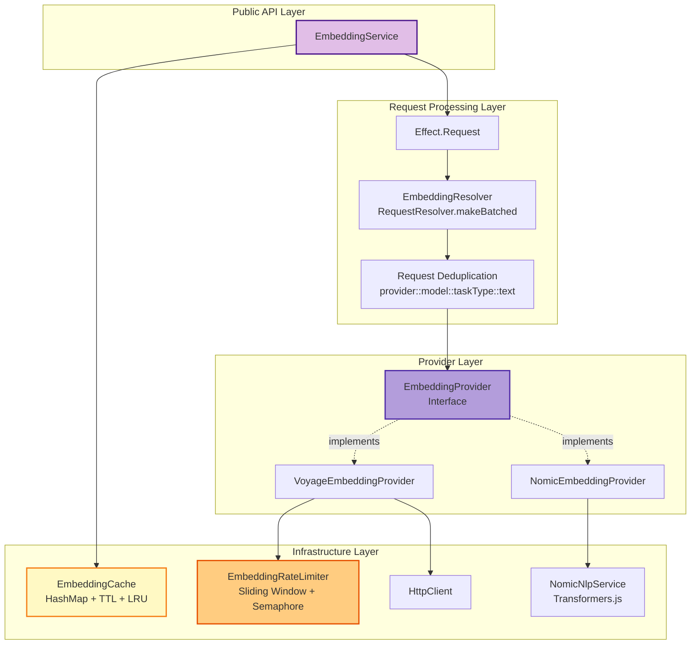
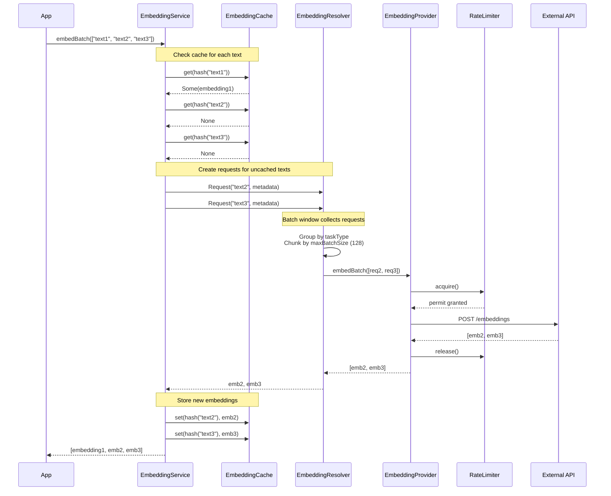
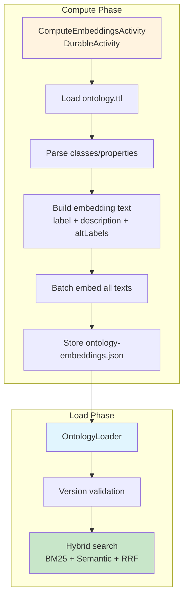

# Embedding Architecture

> **Version**: 2.0.0
> **Last Updated**: December 2025
> **Status**: Provider-Agnostic Infrastructure with Request API Batching

## Table of Contents

1. [Overview](#overview)
2. [Core Architecture](#core-architecture)
3. [Provider Interface](#provider-interface)
4. [Request API Batching](#request-api-batching)
5. [Cache Key Versioning](#cache-key-versioning)
6. [Rate Limiting](#rate-limiting)
7. [Provider Implementations](#provider-implementations)
8. [Ontology Embeddings Precomputation](#ontology-embeddings-precomputation)
9. [Configuration](#configuration)
10. [Layer Composition](#layer-composition)
11. [Testing Patterns](#testing-patterns)
12. [Performance Considerations](#performance-considerations)

---

## Overview

The embedding infrastructure provides provider-agnostic vector embeddings with automatic batching, caching, and rate limiting. It supports both local inference (Nomic via Transformers.js) and API providers (Voyage AI), enabling seamless switching through configuration without code changes.

### Key Design Goals

1. **Provider Abstraction**: Switch embedding providers via configuration
2. **Automatic Batching**: Group multiple requests for efficient API calls using Effect Request API
3. **Deduplication**: Same text+taskType returns same instance within batch window
4. **Versioned Caching**: Cache keys include provider/model/dimension to prevent staleness
5. **Rate Limiting**: Respect API provider limits (RPM, concurrency)
6. **Multi-Dimension Support**: Different providers support different embedding dimensions
7. **Effect-Native**: Fully integrated with Effect's type system and patterns

### Supported Providers

| Provider | Type | Model | Dimension | Rate Limit |
|----------|------|-------|-----------|------------|
| **Nomic** | Local (Transformers.js) | nomic-embed-text-v1.5 | 64-768 | Unlimited (CPU-bound) |
| **Voyage** | API | voyage-3, voyage-3-lite | 512-1024 | 100 RPM, 10 concurrent |

---

## Core Architecture

### Component Diagram



### Data Flow



---

## Provider Interface

### EmbeddingProvider

The `EmbeddingProvider` interface abstracts over different embedding backends:

```typescript
/**
 * Provider metadata for cache key generation and configuration
 */
export interface ProviderMetadata {
  /** Provider identifier (nomic, voyage, openai) */
  readonly providerId: "nomic" | "voyage" | "openai"

  /** Model identifier (e.g., "voyage-3-lite", "nomic-embed-text-v1.5") */
  readonly modelId: string

  /** Native embedding dimension (e.g., 512, 768, 1024) */
  readonly dimension: number
}

/**
 * EmbeddingProvider service interface
 */
export interface EmbeddingProviderMethods {
  /** Get provider metadata (used for cache key generation) */
  readonly metadata: ProviderMetadata

  /**
   * Embed a batch of texts
   *
   * Providers should implement efficient batching internally.
   * Results must be returned in the same order as inputs.
   */
  readonly embedBatch: (
    requests: ReadonlyArray<EmbeddingRequest>
  ) => Effect.Effect<ReadonlyArray<Embedding>, AnyEmbeddingError>

  /** Compute cosine similarity between two vectors */
  readonly cosineSimilarity: (a: Embedding, b: Embedding) => number
}
```

### Task Types

Embedding requests specify a task type for optimization:

```typescript
export type EmbeddingTaskType =
  | "search_query"      // For query text (optimized for search)
  | "search_document"   // For document text (optimized for indexing)
  | "clustering"        // For clustering tasks
  | "classification"    // For classification tasks
```

These task types are compatible with Voyage AI's API. Nomic accepts them but doesn't differentiate behavior.

---

## Request API Batching

### Effect Request API

The system uses Effect's Request API for automatic batching and deduplication:

```typescript
/**
 * Request to embed a single text
 *
 * Uses Request.tagged for automatic batching via RequestResolver.
 * Requests with the same properties are deduplicated automatically.
 */
export interface EmbedTextRequest extends Request.Request<Embedding, AnyEmbeddingError> {
  readonly _tag: "EmbedTextRequest"
  readonly text: string
  readonly taskType: EmbeddingTaskType
  readonly metadata: ProviderMetadata
}

export const EmbedTextRequest = Request.tagged<EmbedTextRequest>("EmbedTextRequest")
```

### Request Deduplication

Requests are deduplicated by hash within a batch window:

```typescript
/**
 * Generate a unique hash for an embedding request
 *
 * Format: providerId::modelId::taskType::text
 */
export const embedRequestHash = (req: EmbedTextRequest): string =>
  `${req.metadata.providerId}::${req.metadata.modelId}::${req.taskType}::${req.text}`
```

### Batching Resolver

The `EmbeddingResolver` collects requests into batches:

```typescript
/**
 * Create a batched resolver for embedding requests
 *
 * Features:
 * - Groups requests by taskType for optimal batching
 * - Chunks into maxBatchSize to respect API limits (128 for Voyage)
 * - Completes each request with corresponding result
 * - Propagates errors to all requests in failed batch
 */
export const makeEmbeddingResolver = (
  provider: EmbeddingProviderMethods,
  maxBatchSize: number = 128
): RequestResolver.RequestResolver<EmbedTextRequest, never> =>
  RequestResolver.makeBatched((requests: ReadonlyArray<EmbedTextRequest>) =>
    Effect.gen(function* () {
      if (requests.length === 0) return

      // Group by taskType (Voyage requires same input_type per batch)
      const grouped = Array.groupBy(requests, (r) => r.taskType)

      for (const [_taskType, batch] of Object.entries(grouped)) {
        // Chunk into maxBatchSize (Voyage limit: 128 texts)
        const chunks = Array.chunksOf(batch, maxBatchSize)

        for (const chunk of chunks) {
          if (chunk.length === 0) continue
          yield* processChunk(provider, chunk)
        }
      }
    })
  ).pipe(RequestResolver.batchN(maxBatchSize))
```

### Batch Window Configuration

Effect's Request API uses a default batch window of **10ms**. Requests arriving within this window are collected and sent as a single batch.

---

## Cache Key Versioning

### Versioned Cache Keys

Cache keys include provider, model, and dimension to prevent cross-contamination when switching models:

```typescript
/**
 * Hash embedding cache key with version information
 *
 * Format: sha256(provider:model:dimension:taskType:text)
 *
 * This ensures that changing the model invalidates the cache automatically.
 */
export const hashVersionedEmbeddingKey = (
  text: string,
  taskType: EmbeddingTaskType,
  metadata: ProviderMetadata
): Effect.Effect<string> =>
  Effect.gen(function* () {
    const versionedKey = `${metadata.providerId}:${metadata.modelId}:${metadata.dimension}:${taskType}:${text}`
    return yield* sha256(versionedKey)
  })
```

### Cache Invalidation Strategy

When you change the embedding model, the cache is automatically invalidated because:

1. Model ID changes → cache key changes → cache miss
2. Dimension changes → cache key changes → cache miss
3. Provider changes → cache key changes → cache miss

This prevents using stale embeddings from a different model.

### Cache Architecture

```typescript
interface CacheEntry {
  readonly embedding: Embedding
  readonly createdAt: number
  readonly lastAccessedAt: number  // For LRU eviction
}

interface EmbeddingCacheConfig {
  readonly ttlMs: number           // Time-to-live (default: 1 hour)
  readonly maxEntries: number      // Max cache size (default: 10,000)
}
```

### TTL and LRU Eviction

The cache uses two eviction strategies:

1. **TTL (Time-To-Live)**: Entries older than `ttlMs` are evicted on access
2. **LRU (Least Recently Used)**: When cache reaches `maxEntries`, least recently accessed entry is evicted

---

## Rate Limiting

### Sliding Window Algorithm

The rate limiter uses a sliding window to enforce RPM (requests per minute) limits:

```typescript
interface RateLimiterState {
  /** Number of requests in current window */
  readonly count: number
  /** Timestamp when window resets (ms since epoch) */
  readonly resetAt: number
}

const maybeResetWindow = Effect.gen(function* () {
  const currentTime = yield* Clock.currentTimeMillis
  yield* Ref.update(stateRef, (state) =>
    currentTime >= state.resetAt
      ? { count: 0, resetAt: currentTime + 60_000 }
      : state
  )
})
```

### Concurrency Control

A semaphore limits concurrent requests:

```typescript
const semaphore = yield* Effect.makeSemaphore(config.maxConcurrent)

// Acquire
yield* semaphore.take(1)

// Release (in Effect.ensuring for guaranteed cleanup)
yield* semaphore.release(1)
```

### Rate Limit Configurations

```typescript
/** Voyage AI (100 RPM, 10 concurrent) */
export const VOYAGE_RATE_LIMITS: EmbeddingRateLimiterConfig = {
  provider: "voyage",
  requestsPerMinute: 100,
  maxConcurrent: 10
}

/** Local models (effectively unlimited) */
export const LOCAL_RATE_LIMITS: EmbeddingRateLimiterConfig = {
  provider: "nomic",
  requestsPerMinute: 10000,
  maxConcurrent: 50
}
```

### Error Handling

When rate limit is exceeded:

```typescript
if (state.count >= config.requestsPerMinute) {
  return Effect.fail(
    new EmbeddingRateLimitError({
      message: `Rate limit exceeded: ${config.requestsPerMinute} RPM`,
      provider: config.provider,
      retryAfterMs: state.resetAt - currentTime
    })
  )
}
```

---

## Provider Implementations

### Nomic (Local Transformers.js)

```typescript
export const NomicEmbeddingProviderLive: Layer.Layer<
  EmbeddingProvider,
  never,
  NomicNlpService | ConfigService
> = Layer.effect(
  EmbeddingProvider,
  Effect.gen(function* () {
    const nomic = yield* NomicNlpService
    const config = yield* ConfigService

    const metadata: ProviderMetadata = {
      providerId: "nomic",
      modelId: config.embedding.transformersModelId,
      dimension: config.embedding.dimension
    }

    return {
      metadata,
      embedBatch: (requests) =>
        Effect.gen(function* () {
          if (requests.length === 0) return []

          const taskType = mapTaskType(requests[0].taskType)
          const texts = requests.map((r) => r.text)

          const embeddings = yield* nomic.embedBatch(
            texts,
            taskType,
            config.embedding.dimension
          )

          return embeddings
        }),
      cosineSimilarity
    }
  })
)
```

**Features:**
- Local inference via Transformers.js
- No API calls or network latency
- CPU-bound, no rate limits
- Supports dimensions: 64, 128, 256, 512, 768

### Voyage AI (API)

```typescript
export const VoyageEmbeddingProviderLive: Layer.Layer<
  EmbeddingProvider,
  never,
  ConfigService | EmbeddingRateLimiter | HttpClient
> = Layer.effect(
  EmbeddingProvider,
  Effect.gen(function* () {
    const config = yield* ConfigService
    const rateLimiter = yield* EmbeddingRateLimiter
    const httpClient = yield* HttpClient.HttpClient

    const metadata: ProviderMetadata = {
      providerId: "voyage",
      modelId: config.embedding.voyageModel,
      dimension: VOYAGE_MODELS[config.embedding.voyageModel]
    }

    return {
      metadata,
      embedBatch: (requests) =>
        Effect.gen(function* () {
          if (requests.length === 0) return []

          // Acquire rate limit permit
          yield* rateLimiter.acquire()

          // Make API request
          const response = yield* HttpClientRequest.post(VOYAGE_API_URL).pipe(
            HttpClientRequest.setHeader("Authorization", `Bearer ${apiKey}`),
            HttpClientRequest.jsonBody({
              input: requests.map((r) => r.text),
              model: metadata.modelId,
              input_type: requests[0].taskType
            }),
            Effect.flatMap(httpClient.execute),
            Effect.flatMap(HttpClientResponse.schemaBodyJson(VoyageResponseSchema)),
            Effect.timeout(Duration.millis(30_000)),
            Effect.ensuring(rateLimiter.release())
          )

          // Extract embeddings in order
          return response.data
            .sort((a, b) => a.index - b.index)
            .map((d) => d.embedding)
        }),
      cosineSimilarity
    }
  })
)
```

**Features:**
- API-based with automatic rate limiting
- Models: voyage-3, voyage-3-lite, voyage-code-3, voyage-law-2
- Dimensions: 512 (lite), 1024 (full)
- Rate limits: 100 RPM, 10 concurrent

---

## Ontology Embeddings Precomputation

### Overview

Ontology embeddings are pre-computed and stored alongside the ontology file to enable fast semantic search without on-demand computation. This is critical for serverless deployments where cold-start latency matters.

### Architecture



### OntologyEmbeddings Schema

**Location**: `Domain/Model/OntologyEmbeddings.ts`

```typescript
export const OntologyEmbeddings = Schema.Struct({
  ontologyUri: Schema.String,        // "gs://bucket/ontologies/football/ontology.ttl"
  version: Schema.String,            // SHA-256 hash of ontology content (16 chars)
  model: Schema.String,              // "nomic-embed-text-v1.5"
  dimension: Schema.Number,          // 768
  createdAt: Schema.DateTimeUtc,     // When embeddings were computed
  classes: Schema.Array(ElementEmbedding),
  properties: Schema.Array(ElementEmbedding)
})

export const ElementEmbedding = Schema.Struct({
  iri: Schema.String,       // "http://example.org/football#Player"
  text: Schema.String,      // "Player. A football player. Also known as: athlete"
  embedding: Schema.Array(Schema.Number)
})
```

### ComputeOntologyEmbeddings Activity

**Location**: `Workflow/DurableActivities.ts`

Durable activity that pre-computes embeddings for an ontology.

**Pipeline:**
1. Load ontology content from storage
2. Compute version hash (SHA-256)
3. Parse ontology to extract classes and properties
4. Build embedding text for each element (label + description + altLabels)
5. Embed all texts using `EmbeddingService.embedBatch()`
6. Create `OntologyEmbeddings` blob
7. Store blob to GCS alongside ontology

### Storage Layout

```
gs://effect-ontology-{env}/
└── ontologies/
    └── {namespace}/
        └── {name}/
            ├── ontology.ttl              # Source OWL ontology
            └── ontology-embeddings.json  # Pre-computed embeddings blob
```

### Version Validation

Embeddings are invalidated when ontology content changes:

1. **Compute Phase**: SHA-256 hash of ontology content → `version` field
2. **Load Phase**: Compare stored version with computed version
3. **Mismatch**: Fail with `EmbeddingsVersionMismatch` error

### Hybrid Search with RRF

**Location**: `Service/OntologyLoader.ts`

Combines BM25 lexical search with semantic embedding search using Reciprocal Rank Fusion:

```typescript
searchClassesWithEmbeddings: (
  query: string,
  ontologyContext: OntologyContext,
  ontologyEmbeddings: OntologyEmbeddings,
  limit: number = 100
) => Effect.gen(function*() {
  // 1. Embed query (search_query task type)
  const queryEmbedding = yield* embedding.embed(query, "search_query")

  // 2. Compute semantic similarity scores
  const semanticScores = ontologyEmbeddings.classes.map(cls => ({
    id: cls.iri,
    similarity: embedding.cosineSimilarity(queryEmbedding, cls.embedding)
  }))

  // 3. Get BM25 scores
  const bm25Results = yield* getBm25Index(ontologyContext).search(query)

  // 4. Fuse with RRF
  const fused = rrfFusion([
    semanticScores.sort((a, b) => b.similarity - a.similarity),
    bm25Results
  ])

  return fused.slice(0, limit)
})
```

---

## Configuration

### Environment Variables

| Variable | Description | Default |
|----------|-------------|---------|
| **Provider Selection** |||
| `EMBEDDING_PROVIDER` | Provider to use (nomic \| voyage) | `nomic` |
| **Voyage Configuration** |||
| `VOYAGE_API_KEY` | Voyage AI API key | - |
| `VOYAGE_MODEL` | Voyage model (voyage-3 \| voyage-3-lite) | `voyage-3-lite` |
| **Nomic Configuration** |||
| `EMBEDDING_DIMENSION` | Embedding dimension (64-768 for Nomic) | `768` |
| `TRANSFORMERS_MODEL_ID` | Transformers.js model ID | `nomic-ai/nomic-embed-text-v1.5` |
| **Cache Configuration** |||
| `EMBEDDING_CACHE_TTL_HOURS` | Cache TTL in hours | `1` |
| `EMBEDDING_CACHE_MAX_ENTRIES` | Max cache entries | `10000` |
| `EMBEDDING_CACHE_PATH` | GCS path for persistent cache (optional) | - |

### Config Schema

```typescript
const EmbeddingConfig = Schema.Struct({
  provider: Schema.Literal("nomic", "voyage"),
  dimension: Schema.Number,

  // Nomic
  transformersModelId: Schema.String,

  // Voyage
  voyageApiKey: Schema.optional(Schema.Redacted(Schema.String)),
  voyageModel: Schema.String,

  // Cache
  cacheTtlHours: Schema.Number,
  cacheMaxEntries: Schema.Number,
  cachePath: Schema.optional(Schema.String)
})
```

---

## Layer Composition

### Dynamic Provider Selection

```typescript
/**
 * Dynamic provider selection based on EMBEDDING_PROVIDER config
 */
export const EmbeddingProviderFromConfig: Layer.Layer<
  EmbeddingProvider,
  never,
  ConfigService | NomicNlpService | EmbeddingRateLimiter | HttpClient
> = Layer.unwrapEffect(
  Effect.gen(function* () {
    const config = yield* ConfigService

    return (config.embedding.provider === "voyage"
      ? VoyageEmbeddingProviderLive
      : NomicEmbeddingProviderLive) as Layer.Layer<
      EmbeddingProvider,
      never,
      ConfigService | NomicNlpService | EmbeddingRateLimiter | HttpClient
    >
  })
)
```

### Complete Infrastructure

```typescript
/**
 * Config-driven embedding infrastructure
 *
 * Automatically selects provider based on EMBEDDING_PROVIDER config.
 */
export const EmbeddingInfrastructure: Layer.Layer<
  EmbeddingProvider | EmbeddingRateLimiter | EmbeddingCache,
  never,
  ConfigService
> = Layer.mergeAll(
  EmbeddingProviderFromConfig.pipe(
    Layer.provide(FetchHttpClient.layer),
    Layer.provide(NomicNlpServiceLive),
    Layer.provide(EmbeddingRateLimiterFromConfig)
  ),
  EmbeddingRateLimiterFromConfig,
  EmbeddingCache.Default
)
```

### Provider-Specific Bundles

```typescript
/** Force Nomic (local) - for development */
export const NomicEmbeddingInfrastructure = Layer.mergeAll(
  NomicEmbeddingProviderDefault,
  EmbeddingRateLimiterLocal,
  EmbeddingCache.Default
)

/** Force Voyage (API) - for production */
export const VoyageEmbeddingInfrastructure = Layer.mergeAll(
  VoyageEmbeddingProviderDefault,
  EmbeddingRateLimiterVoyage,
  EmbeddingCache.Default
)
```

---

## Testing Patterns

### Mock Provider

```typescript
const MockEmbeddingProvider = Layer.succeed(EmbeddingProvider, {
  metadata: {
    providerId: "mock",
    modelId: "mock-v1",
    dimension: 768
  },
  embedBatch: (requests) =>
    Effect.succeed(
      requests.map(() => Array(768).fill(0.1))
    ),
  cosineSimilarity: (a, b) => 0.9
})
```

### Deterministic Embeddings

```typescript
const DeterministicProvider = Layer.succeed(EmbeddingProvider, {
  metadata: { providerId: "test", modelId: "test", dimension: 3 },
  embedBatch: (requests) =>
    Effect.succeed(
      requests.map((req) => {
        // Hash text to deterministic vector
        const hash = hashCode(req.text)
        return [Math.sin(hash), Math.cos(hash), Math.sin(hash * 2)]
      })
    ),
  cosineSimilarity
})
```

### Integration Test Example

```typescript
import { it } from "@effect/vitest"
import { Effect } from "effect"
import { EmbeddingService } from "./Embedding.js"

it.effect("embedBatch deduplicates requests", () =>
  Effect.gen(function* () {
    const embeddings = yield* EmbeddingService

    // Request same text twice
    const result = yield* embeddings.embedBatch([
      "Hello world",
      "Hello world",
      "Different text"
    ])

    expect(result).toHaveLength(3)
    expect(result[0]).toBe(result[1])  // Deduplicated
  }).pipe(
    Effect.provide(EmbeddingService.Default),
    Effect.provide(MockEmbeddingProvider)
  )
)
```

---

## Performance Considerations

### Batching Trade-offs

| Batch Size | Latency | Throughput | Memory | API Cost |
|------------|---------|------------|--------|----------|
| 1 (no batching) | Low | Low | Low | High |
| 10-50 | Medium | Medium | Medium | Medium |
| 100-128 (Voyage max) | High | High | High | Low |

**Recommendation**: Use default batch window (10ms) for most use cases.

### Cache Hit Rate

Typical cache hit rates:

- **Entity resolution**: 60-80% (many repeated entity names)
- **Ontology search**: 90-95% (pre-computed embeddings)
- **Document classification**: 30-50% (moderate duplication)
- **One-off queries**: 5-15% (low duplication)

### Rate Limiting Impact

With Voyage AI limits (100 RPM, 10 concurrent):

- **Max throughput**: ~1,280 texts/minute (128 per batch × 10 concurrent)
- **Actual throughput**: ~800-1,000 texts/minute (accounting for latency)

Use local Nomic provider for high-throughput scenarios.

### Memory Usage

| Component | Typical Usage |
|-----------|---------------|
| Cache (10k entries @ 768 dim) | ~60 MB |
| Cache (10k entries @ 512 dim) | ~40 MB |
| Nomic model | ~400 MB |
| Request resolver batch | <1 MB |

**Total memory**: ~500 MB for Nomic, ~100 MB for Voyage (no local model).

---

## File Reference

| Path | Purpose |
|------|---------|
| `src/Service/Embedding.ts` | Main embedding service with cache-through pattern |
| `src/Service/EmbeddingProvider.ts` | Provider interface and types |
| `src/Service/EmbeddingRequest.ts` | Request types for batching |
| `src/Service/EmbeddingResolver.ts` | Request API batching resolver |
| `src/Service/EmbeddingCache.ts` | Versioned cache with TTL and LRU |
| `src/Service/EmbeddingRateLimiter.ts` | RPM and concurrency rate limiting |
| `src/Service/NomicEmbeddingProvider.ts` | Local Transformers.js provider |
| `src/Service/VoyageEmbeddingProvider.ts` | Voyage AI API provider |
| `src/Runtime/EmbeddingLayers.ts` | Layer composition and provider selection |
| `src/Domain/Error/Embedding.ts` | Embedding error types |
| `src/Domain/Model/OntologyEmbeddings.ts` | Ontology embeddings schema |
| `src/Utils/Hash.ts` | Versioned cache key hashing |
| `test/Service/Embedding.test.ts` | Embedding service tests |

---

## See Also

- [System Architecture](./system-architecture.md) - Overall system design
- [Effect Patterns Guide](./effect-patterns-guide.md) - Effect service patterns
- [GraphRAG Architecture](./system-architecture.md#graphrag-knowledge-graph-querying) - Uses embeddings for entity retrieval
