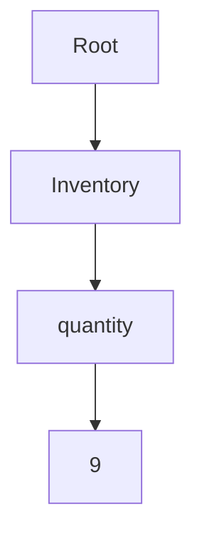
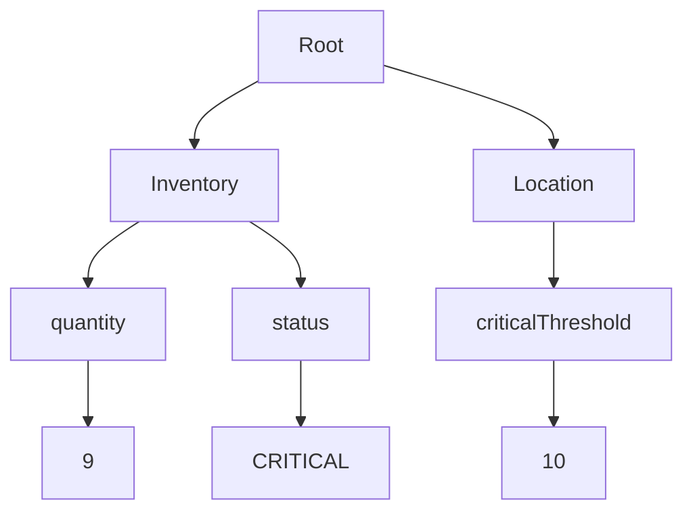
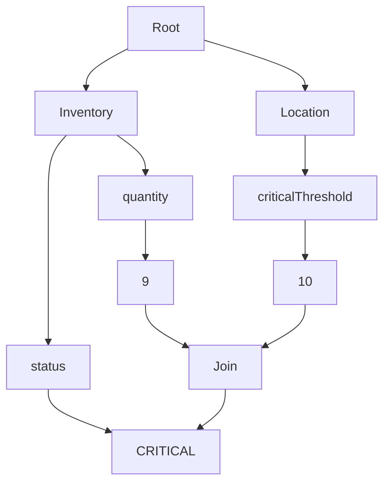

```ts
type ThresholdRuleSchema = {
  criticalThreshold: number;
  locationId: string;
  quantity: number;
  status: "CRITICAL" | "GOOD";
}

// Sessions contain facts and rules
const session = beep<ThresholdRuleSchema>();

session.rule(
// Rules can have descriptive names
"Update status based on inventory threshold levels",
// Schema should be destructured so we can use the names easily
({ criticalThreshold, quantity }) =>
	({
	  // Prefixing an $ to an id means "all ids that have these attributes", a join.
	  $location: {
	    criticalThreshold,
	  },
	  $inventory: {
	  // $inventory will match only if the `locationId` value matches the $location id
	    locationId: { join: '$location' },
	    quantity,
	    status: { then: false }
	  }
	})
).enact({
  then: ({ $location, $inventory }) => {
    let newStatus = "GOOD" | "WARNING" | "CRITICAL" = "GOOD";
    if ($inventory.quantity <= $location.criticalThreshold) {
      newStatus = "CRITICAL"
    }
    session.insert({
      [$inventory.id]: {
        status: newStatus
      }
    })
  }
})
```

## How does it work?
The algorithm utilizes symbols to create an internal representation of the world. Each element in the real world is converted into a triple known as a "Fact" or more commonly referred to as a "Working Memory Element" or (WME), represented as `[Entity, attribute, attributeValue]`.

The world is represented through Facts and Rules. A rule consists of two parts: The *"given"* (right side) and the *"then"* (left side).
Each rule created using `session.rule` generates a [[Directed Graph]] starting from a generic Root node, which branches out to form leaf nodes. The branches from the Root node correspond to the initial part of the fact `Entity`, representing the working memory elements. For instance, given we have an Entity `Inventory` with a property of `quantity` and a value of `9` we would represent (encode) this as `[Inventory, quantity, 9]`.

With the Rete Algorithm this data structure would appear as:


## Example Number 1: Basic Fact Representation

Now, let's examine the graph, which consists of four nodes in the following order:
1. The Root Node
	- This node serves as the root for all type nodes, such as `Inventory` and other root nodes that might be in the network
2. The `Inventory` node
	- Also known as the Type node, it stores each known "type" of entity recognized by the algorithm
3. The `quantity` node
	- Referred to as a Select node, it represents the attribute name of the entity being described.
4. The `9` node
	- Known as a Test node. this indicates that the value of `Inventory.quantity` is checked against 9 as an integer.

- **Alpha Network:**
    - Consists of the Root node, Inventory node, and Quantity node.
    - Efficiently filters WMEs based on their attributes before any joins occur.
- **Fact Propagation:**
    - When the fact `[Inventory, quantity, 9]` is asserted:
        - It passes through the Inventory node (since `Entity == Inventory`).
        - Then through the Quantity node (since `attribute == quantity`).
        - Finally, it reaches the Value node for `9` (since `attributeValue == 9`).

By expanding this network, we can continue mapping various aspects of the real world using any desired triple. Let's consider the entity representing a `Location`, specifically its `criticalThreshold`. We can represent this as `[Location, criticalThreshold, 10]` to signify a location with a critical threshold of 10. Now let's incorporate this into our network and observe the resulting graph:


- **Expansion of the Alpha Network:**
    
    - The network now includes nodes for the `Location` entity and its `criticalThreshold` attribute.
    - This allows the Rete network to process facts about both `Inventory` and `Location`.
- **Parallel Fact Processing:**
    
    - Facts about `Inventory` and `Location` are processed in parallel through their respective branches.
## Example Number 2

Now we begin to observe the modeling of more complex scenarios. Let's consider the addition of our first inference to the network, which involves introducing our first rule.

The rule we want to encode states that when the Inventories quantity is less than the Locations critical threshold, we should change the status of the inventory at the location to be "CRITICAL".

Let's examine how our network will appear after incorporating this rule.



- **Beta Network (Join Node):**
    
    - Combines WMEs that have passed through the alpha nodes.
    - Evaluates conditions involving multiple WMEs (e.g., comparing `Inventory.quantity` with `Location.criticalThreshold`).
- **Rule Activation:**
    
    - If the condition `9 <= 10` is true, the rule's action is triggered.
    - The `Inventory.status` is updated in the working memory.
- **Fact Propagation and Update:**
    
    - The new fact `[Inventory, status, "CRITICAL"]` is asserted into the network.
    - This may further propagate through the network if other rules depend on `Inventory.status`.`

## **Interpreting the Graph Step by Step**

1. **Root Node:**
    
    - The starting point for all facts and rules.
2. **First Level Entities:**
    
    - **Inventory Node:** Branches to `quantity` and `status`.
    - **Location Node:** Branches to `criticalThreshold`.
3. **Second Level Attributes and Values:**
    
    - **Inventory.quantity (`9`):** Passes through to the Join node.
    - **Location.criticalThreshold (`10`):** Passes through to the Join node.
4. **Join Node Evaluation:**
    
    - Receives inputs from both `Inventory.quantity` and `Location.criticalThreshold`.
    - Evaluates the condition `9 <= 10`.
    - Since the condition is true, it proceeds to trigger the action.
5. **Action Execution:**
    
    - The `status` of the `Inventory` is set to `"CRITICAL"`.
    - This is represented by the edge from the Join node to the `status` value node (`4200000000`).
6. **Update in Working Memory:**
    
    - The new fact `[Inventory, status, "CRITICAL"]` is added to the working memory.
    - This update can activate other parts of the network if applicable.

