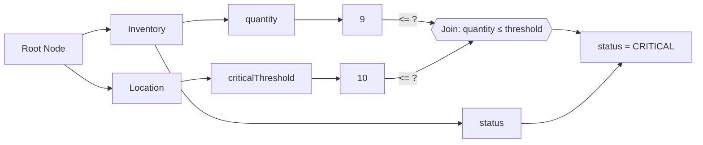

# What is a Rete Network?

The **Rete algorithm** is an efficient pattern-matching algorithm used in rule engines and expert systems. It was designed by Dr. Charles L. Forgy at Carnegie Mellon University in the late 1970s (the name "Rete" is Latin for "net," reflecting its network-like structure). Rete is widely used in production rule systems (for example, CLIPS, Drools, and many others) to quickly match a large number of facts against many rules. Understanding how the Rete network works will help you write more efficient rules and grasp what happens under the hood of a rules engine.

---

## Rules, Facts, and the Need for Rete

- **Fact** = `[Entity, attribute, value]` (also called a WME – Working Memory Element).  
  Example: `[Person, age, 65]`.

- **Rule** = IF (conditions) THEN (actions).  
  Example: *If a person’s age is greater than 60, then mark that person’s status as "Senior Citizen."*

- **Problem:** Naive rule engines re-check all rules against all facts every time facts change → inefficient.  

- **Rete solution:** Cache results and only compute changes for new/retracted facts.

---

## Rete Algorithm Overview

The algorithm organizes rules into a graph of nodes:
- **Root Node:** Entry point for all facts.
- **Alpha Network:** Tests single-fact conditions (like filtering attributes).
- **Beta Network:** Joins multiple facts together when rules reference shared variables.
- **Leaf Nodes (Productions):** Represent complete rules; if reached, a rule is ready to fire.

**Inference Cycle:**
1. **Match:** Facts flow through the network to match rules.
2. **Select:** Conflict resolution strategy picks which rule to fire.
3. **Act:** Rule executes → may add, update, or remove facts → cycle repeats.

---

## Alpha Network: Single Fact Filtering

Example: Insert `[Inventory, quantity, 9]`.

```mermaid
flowchart LR
    Root[Root Node] --> InventoryType[Inventory]
    InventoryType --> QuantityAttr[quantity]
    QuantityAttr --> Val9[9]
````

* Fact enters Root.
* Goes to `Inventory` branch.
* Passes `quantity` attribute node.
* Stores value `9`.

Now insert `[Location, criticalThreshold, 10]`:

```mermaid
flowchart LR
    Root[Root Node] --> InventoryType[Inventory]
    Root --> LocationType[Location]
    InventoryType --> QuantityAttr[quantity]
    QuantityAttr --> Val9[9]
    LocationType --> ThresholdAttr[criticalThreshold]
    ThresholdAttr --> Val10[10]
```

---

## Beta Network: Joining Facts

We want a rule:
**If Inventory.quantity <= Location.criticalThreshold then Inventory.status = "CRITICAL".**

Join node compares Inventory.quantity with Location.criticalThreshold.



* `9 <= 10` succeeds.
* Rule fires, inserting `[Inventory, status, "CRITICAL"]`.

---

## Code Example (`@beep/rete`)

```ts
interface ThresholdRuleSchema {
  criticalThreshold: number;
  locationId: string;
  quantity: number;
  status: "GOOD" | "CRITICAL";
}

const session = beep<ThresholdRuleSchema>();

session.rule(
  "Update status based on inventory threshold levels",
  ({ criticalThreshold, quantity, status }) => ({
    $location: { criticalThreshold },
    $inventory: {
      locationId: { join: '$location' },
      quantity,
      status: { then: false }
    }
  })
).enact({
  then: ({ $location, $inventory }) => {
    let newStatus: "GOOD" | "CRITICAL" = "GOOD";
    if ($inventory.quantity <= $location.criticalThreshold) {
      newStatus = "CRITICAL";
    }
    session.insert({
      [$inventory.id]: { status: newStatus }
    });
  }
});
```

---

## Advantages

* **Fast:** Avoids re-checking unchanged facts.
* **Shared nodes:** Similar rule patterns only evaluated once.
* **Incremental:** Only process new/changed facts.

## Disadvantages

* **Memory Intensive:** Stores partial matches in alpha/beta memories. Worst-case complexity \~ O(Rules × Facts × Patterns).
* **Bad rules slow it down:** If conditions overlap poorly, memory is wasted.

---

## Conclusion

The Rete algorithm **trades memory for speed**. It makes large-scale, forward-chaining rule systems efficient by caching matches and reusing computation. In `@beep/rete`, you focus on writing rules, while the engine builds and maintains the Rete network to optimize matching behind the scenes.

---

## References

* Patrick Henry Winston, *Artificial Intelligence*, 3rd Edition.
* Dan W. Patterson, *Introduction to AI and Expert Systems*, PHI.
* Stuart Russell & Peter Norvig, *Artificial Intelligence: A Modern Approach*.
* Neil Madden & Eryk Lagun, *Optimizing Rete for Low-Memory Multi-Agent Systems*.

```
