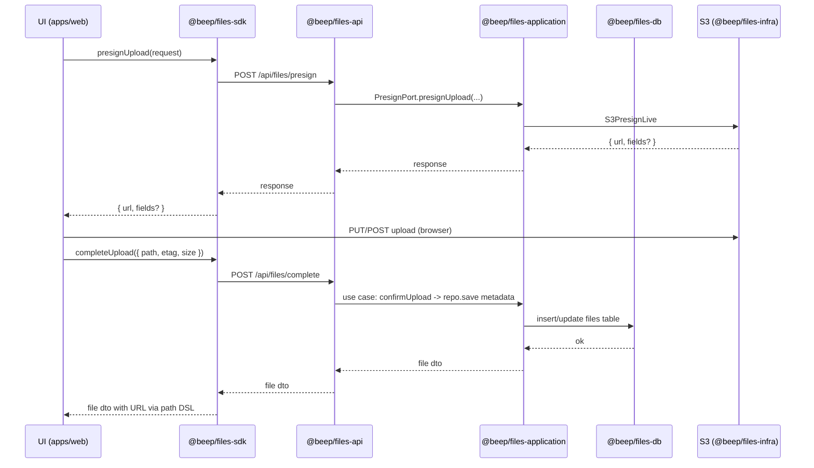

# Files Architecture — Design & Research

Last updated: 2025-09-12

## Table of Contents

- [TL;DR](#tldr)
- [1. Package map (Files slice)](#1-package-map-files-slice)
- [2. Application ports (in @beep/files-application)](#2-application-ports-in-beep-files-application)
  - [FilesStoragePort](#filesstorageport)
  - [PresignPort](#presignport)
  - [ImageTransformPort](#imagetransformport)
  - [TranscodePort](#transcodeport)
  - [TypeScript stubs (Effect 3 idioms; imports show boundaries)](#typescript-stubs-effect-3-idioms-imports-show-boundaries)
  - [Live adapters placement](#live-adapters-placement)
- [3. SDK design (@beep/files-sdk)](#3-sdk-design-beep-files-sdk)
  - [Goals](#goals)
  - [Client stub](#client-stub)
  - [Usage in UI (apps/web)](#usage-in-ui-appsweb)
- [4. Runtime plan (@beep/runtime)](#4-runtime-plan-beep-runtime)
  - [Provide central composable Layers for](#provide-central-composable-layers-for)
  - [Composition examples](#composition-examples)
  - [Layer composition example](#layer-composition-example)
- [5. S3 key strategy & typed path DSL](#5-s3-key-strategy--typed-path-dsl)
  - [Conventions](#conventions)
  - [Builder API (pure)](#builder-api-pure)
  - [Evolution from current UploadPath](#evolution-from-current-uploadpath)
- [6. Security & performance checklist](#6-security--performance-checklist)
  - [CORS (bucket CORS JSON)](#cors-bucket-cors-json)
  - [Presigned URL defaults](#presigned-url-defaults)
  - [Integrity & checksums](#integrity--checksums)
  - [IAM/bucket policies](#iambucket-policies)
  - [Performance](#performance)
- [7. Lifecycle policies](#7-lifecycle-policies)
  - [Lifecycle JSON snippet](#lifecycle-json-snippet)
- [8. Browser media pipeline](#8-browser-media-pipeline)
  - [When to do client-side vs server-side](#when-to-do-client-side-vs-server-side)
  - [Minimal PoC (image → webp, browser)](#minimal-poc-image--webp-browser)
  - [Minimal PoC (mp4 → webm, browser with ffmpeg.wasm)](#minimal-poc-mp4--webm-browser-with-ffmpegwasm)
  - [Cropping UI](#cropping-ui)
- [9. Mermaid diagrams](#9-mermaid-diagrams)
  - [Ports/Adapters overview](#portsadapters-overview)
  - [Request flow “UI → Files SDK → API → Application → DB/S3”](#request-flow-ui--files-sdk--api--application--dbs3)
- [10. Migrations plan](#10-migrations-plan)
  - [Current state](#current-state)
  - [Target](#target)
  - [Stages (PRs)](#stages-prs)
  - [Boundary enforcement](#boundary-enforcement)
- [11. Acceptance tests (contracts + e2e)](#11-acceptance-tests-contracts--e2e)
  - [Contract tests (vitest)](#contract-tests-vitest)
  - [Adapter contract tests](#adapter-contract-tests)
  - [Path DSL tests](#path-dsl-tests)
  - [E2E happy path (apps/web)](#e2e-happy-path-appsweb)
- [Configuration snippets](#configuration-snippets)
  - [Effect layer wiring (server)](#effect-layer-wiring-server)
  - [Security notes (bucket policy — example sketch, scope to prefix)](#security-notes-bucket-policy--example-sketch-scope-to-prefix)
- [Where to place key components (explicit)](#where-to-place-key-components-explicit)
- [Additional details and rationale](#additional-details-and-rationale)
- [Risks & tradeoffs](#risks--tradeoffs)
- [Phased adoption plan](#phased-adoption-plan)
  - [Phase 0 (infra + ports)](#phase-0-infra--ports)
  - [Phase 1 (sdk--api)](#phase-1-sdk--api)
  - [Phase 2 (media + performance)](#phase-2-media--performance)
- [References (accessed 2025-09-12)](#references-accessed-2025-09-12)

## TL;DR

* Files becomes a first-class vertical slice with clean ports in application and AWS S3 adapters in infra; UI talks only to a typed SDK built on @effect/platform HttpClient.
* Move SignedUrlService to a PresignPort interface in files-application; implement S3 adapters in @beep/files-infra; keep domain pure.
* Add a pure, typed S3 key DSL (filePaths) that unifies org/user/content addressing and variants; adapters translate these to bucket/key.
* WASM-first media pipeline (ffmpeg.wasm or mediabunny) in browser with server fallback for heavy/unsupported cases.
* Security/performance baked in: strict CORS, checksum headers, TTLs, multipart acceleration, least-privilege IAM, lifecycle rules (expire tmp, abort incomplete MPU).
* Centralize cross-cutting layers (config, logging, tracing, HttpClient, DB) in @beep/runtime; compose per app.
* Enforce module boundaries via tags (Nx-style) and Turbo Boundaries, aligned to your slice layering rules.

<details>
  <summary><strong>Summary</strong></summary>

  - Clean, layered Files slice with application ports and S3 adapters in infra.
  - Typed path DSL for consistent S3 keys and variants (domain-pure, adapter-friendly).
  - Browser-first transforms (ffmpeg.wasm/mediabunny), server fallback for heavy cases.
  - Strong posture: tight CORS, checksums, short TTL presigns, MPU with abort, least-privilege IAM.
  - Central runtime layers; typed SDK for UI; enforce module boundaries across the monorepo.

</details>

## 1. Package map (Files slice)

- @beep/files-domain
  - Purpose: Pure domain entities/VOs/events for files; re-export the canonical path DSL from shared.
  - Rationale: Domain remains pure; no IO.

- @beep/files-application
  - Purpose: Use cases and ports (FilesStoragePort, PresignPort, ImageTransformPort, TranscodePort).
  - Rationale: Orchestration layer; infra-agnostic.

- @beep/files-infra
  - Purpose: 
    - S3 adapters implementing PresignPort and FilesStoragePort; metadata/head; multipart helpers; live Layers; optional CDN URL mapping.
    - Persistence adapters via drizzle-orm + @effect/sql-postgres/@effect/sql-drizzle; references slice tables or shared files table.
    - HTTP controllers/handlers; wiring to application facades; endpoint schemas; no direct DB imports.
  - Rationale: 
    - AWS specifics isolated; easy to mock/swap.
    - DB-specific code isolated.
    - Adapter wiring thin and separate.

- @beep/files-sdk
  - Purpose: Typed client facade to files-api over @effect/platform HttpClient; cross-platform via FetchHttpClient.layer.
  - Rationale: Single stable facade for apps; no UI components.

- @beep/files-workers (optional)
  - Purpose: Background pipelines (variant regeneration, cold migration, cleanup); queue/event adapters.
  - Rationale: Offload heavy/async work.

Related cross-cutting:

- @beep/runtime
  - Purpose: Composable Layers for Config, Logger/Tracing, HttpClient defaults, DB clients, telemetry exporters.
  - Rationale: Central runtime; apps compose with slice adapters.

- Shared infra (as decided):
  - @beep/shared/tables: files table
  - @beep/shared/domain: File entity + filePaths canonical builder (pure)
  - @beep/common/schema: file validation/EXIF

## 2. Application ports (in @beep/files-application)

### FilesStoragePort

- Responsibilities:
  - put/get/urlFor/list/delete/head/copy
  - multipart helpers: createMultipart, presignPart, completeMultipart, abortUpload

### PresignPort

- Responsibilities:
  - presignUpload (PUT and POST)
  - presignDownload
  - TTL
  - content-type/size/checksum hints

### ImageTransformPort

- Responsibilities:
  - image resize/format, quality, cropping

### TranscodePort

- Responsibilities:
  - video transcode/segments (e.g., HLS), bitrate/size settings
  - Support for various codecs and containers
  - Optional: support for audio-only or video-only transcodes

### TypeScript stubs (Effect 3 idioms; imports show boundaries)

```ts
// @beep/files-application/src/ports/FilesStoragePort.ts
import { Effect } from 'effect';

export type StorageKey = { bucket: string; key: string };

export type MultipartInit = {
  uploadId: string;
  key: StorageKey;
  partSize: number; // bytes
  maxParts: number;
};

export type PartToSign = { partNumber: number; contentLength: number; checksumSha256?: string };

export class FilesStoragePort extends Effect.Service<FilesStoragePort>()('files/FilesStoragePort', {
  accessors: true,
  // pure interface; implementation lives in @beep/files-infra
  succeed: {} as {
    put: (key: StorageKey, body: Uint8Array, opts?: { contentType?: string; checksumSha256?: string; sseKmsKeyId?: string }) => Effect.Effect<{ etag: string }>;
    get: (key: StorageKey) => Effect.Effect<{ body: Uint8Array; contentType?: string; etag?: string }>;
    head: (key: StorageKey) => Effect.Effect<{ contentLength: number; contentType?: string; etag?: string; checksumSha256?: string }>;
    delete: (key: StorageKey) => Effect.Effect<void>;
    copy: (src: StorageKey, dest: StorageKey) => Effect.Effect<void>;
    urlFor: (key: StorageKey, opts?: { cdnBaseUrl?: string }) => string;

    // Multipart
    createMultipart: (key: StorageKey, opts: { contentType?: string; partSize?: number }) => Effect.Effect<MultipartInit>;
    presignPart: (init: MultipartInit, part: PartToSign, ttlSeconds: number) => Effect.Effect<{ url: string }>;
    completeMultipart: (init: MultipartInit, etags: Array<{ partNumber: number; etag: string }>) => Effect.Effect<{ etag: string }>;
    abortMultipart: (init: MultipartInit) => Effect.Effect<void>;
  },
}) {}
```

```ts
// @beep/files-application/src/ports/PresignPort.ts
import { Effect } from 'effect';
import { StorageKey } from './FilesStoragePort';

export type PresignUploadInput = {
  key: StorageKey;
  method: 'PUT' | 'POST';
  ttlSeconds: number;
  contentType?: string;
  contentLength?: number;
  checksumSha256?: string; // prefer modern checksum header
  sseKmsKeyId?: string;
  acl?: 'private' | 'public-read';
};

export type PresignDownloadInput = {
  key: StorageKey;
  ttlSeconds: number;
  responseContentType?: string;
  asAttachmentFilename?: string;
};

export class PresignPort extends Effect.Service<PresignPort>()('files/PresignPort', {
  accessors: true,
  succeed: {} as {
    presignUpload: (input: PresignUploadInput) => Effect.Effect<{ url: string; fields?: Record<string, string> }>;
    presignDownload: (input: PresignDownloadInput) => Effect.Effect<{ url: string }>;
  },
}) {}
```
```ts
// @beep/files-application/src/ports/ImageTransformPort.ts
import { Effect } from 'effect';

export type ImageVariantSpec = {
  format: 'webp' | 'jpeg' | 'png' | 'avif';
  width?: number;
  height?: number;
  quality?: number; // 1-100
  crop?: { x: number; y: number; width: number; height: number };
};

export class ImageTransformPort extends Effect.Service<ImageTransformPort>()('files/ImageTransformPort', {
  accessors: true,
  succeed: {} as {
    transform: (input: Uint8Array, spec: ImageVariantSpec) => Effect.Effect<Uint8Array>;
  },
}) {}
```

```ts
// @beep/files-application/src/ports/TranscodePort.ts
import { Effect } from 'effect';

export type VideoTranscodeSpec = {
  format: 'webm' | 'mp4' | 'hls';
  videoBitrateKbps?: number;
  audioBitrateKbps?: number;
  width?: number;
  height?: number;
  hlsSegmentSeconds?: number;
};

export class TranscodePort extends Effect.Service<TranscodePort>()('files/TranscodePort', {
  accessors: true,
  succeed: {} as {
    transcode: (input: Uint8Array, spec: VideoTranscodeSpec) => Effect.Effect<Uint8Array | { manifest: Uint8Array; segments: ReadonlyArray<{ path: string; data: Uint8Array }> }>;
  },
}) {}
```
### Live adapters placement

- Storage and presigns:
  - Implement `FilesStoragePort` and `PresignPort` in `@beep/files-infra` using `@effect-aws/client-s3` adapters.
  - Build live Layers like `S3FilesStorageLive` and `S3PresignLive` that translate `StorageKey` and options to S3 APIs.
- Media transforms:
  - Browser: `apps/web` adapter using ffmpeg.wasm or mediabunny; provide a Layer for the browser runtime.
  - Server: `@beep/files-workers` or `@beep/files-api` Node adapter using system ffmpeg, and sharp for images as needed (fallback for heavy/unsupported cases).

## 3. SDK design (@beep/files-sdk)

### Goals

Provide a typed client facade to files-api routes; works in Node and browser.
Built on @effect/platform HttpClient with FetchHttpClient.layer. Docs: FetchHttpClient.layer and HttpApi client example (accessed 2025-09-12).
### Client stub

```ts
// @beep/files-sdk/src/FilesApiClient.ts
import { Effect } from 'effect';
import { HttpClient, FetchHttpClient } from '@effect/platform';

export type PresignUploadRequest = {
  path: string; // canonical path DSL output .key.key or url-safe key
  method: 'PUT' | 'POST';
  contentType?: string;
  contentLength?: number;
  checksumSha256?: string;
};
export type PresignUploadResponse = { url: string; fields?: Record<string, string>; ttlSeconds: number };

export class FilesApiClient extends Effect.Service<FilesApiClient>()('files/FilesApiClient', {
  accessors: true,
  effect: Effect.gen(function* () {
    const http = yield* HttpClient.HttpClient;

    const presignUpload = (req: PresignUploadRequest) =>
      http
        .post('/api/files/presign', {
          body: JSON.stringify(req),
          headers: { 'content-type': 'application/json' },
        })
        .pipe(
          HttpClient.mapResponseJson as any, // use HttpClient helpers to decode; swap for schema if defined
          Effect.map((json) => json as PresignUploadResponse),
        );

    const completeUpload = (body: { path: string; etag: string; size: number; contentType?: string }) =>
      http
        .post('/api/files/complete', {
          body: JSON.stringify(body),
          headers: { 'content-type': 'application/json' },
        })
        .pipe(HttpClient.mapResponseJson as any);

    const getFileById = (id: string) =>
      http.get(`/api/files/${id}`).pipe(HttpClient.mapResponseJson as any);

    return { presignUpload, completeUpload, getFileById } as const;
  }),
  // Consumer can provide platform-specific HttpClient (browser: FetchHttpClient.layer; Node can also use FetchHttpClient)
  dependencies: [FetchHttpClient.layer],
}) {}
```

### Usage in UI (apps/web)

```ts
import { Effect } from 'effect';
import { FilesApiClient } from '@beep/files-sdk';
import { filePaths } from '@beep/shared-domain/File/paths'; // canonical DSL

const program = Effect.gen(function* () {
  const files = yield* FilesApiClient;
  const avatar = filePaths.users.avatar('user_123'); // typed builder
  const presigned = yield* files.presignUpload({
    path: avatar.original.key, // or avatar.s3Key
    method: 'PUT',
    contentType: 'image/webp',
    contentLength: 120_000,
    checksumSha256: '...',
  });

  await fetch(presigned.url, { method: 'PUT', body: /* Blob */ } as any);
});
```
## 4. Runtime plan (@beep/runtime)

### Provide central composable Layers for

- Config (Effect Config): parse env for S3 buckets, region, CDN base URL, KMS key, presign TTL defaults, DB URL.
- Logging and Tracing: Effect Logger + @effect/opentelemetry Node/Web layers (console exporter locally; OTLP in prod).
- HttpClient defaults: `FetchHttpClient.layer` with sane timeouts and retries.
- DB client: `@effect/sql-postgres` + `@effect/sql-drizzle` layers for pooled connections.
#### Composition examples
apps/server: provide Node runtime bundle (ConfigLive -> Logger/Tracing -> HttpClient -> DB -> adapters (S3FilesStorageLive, S3PresignLive) -> files-api routes layer)
apps/web: provide FetchHttpClient.layer and browser ImageTransformPort Live (ffmpeg.wasm) to SDK-driven flows.
#### Layer composition example

```ts
// @beep/runtime/src/layers.ts
import { Layer, Effect } from 'effect';
import { FetchHttpClient } from '@effect/platform';
import { NodeSdk } from '@effect/opentelemetry';
import { FilesStoragePort } from '@beep/files-application';
import { S3FilesStorageLive, S3PresignLive } from '@beep/files-infra';
// plus ConfigLive, LoggerLive, DbLive you define

export const HttpClientLive = FetchHttpClient.layer;

export const TracingLive = NodeSdk.layer(() => ({
  resource: { serviceName: 'beep-server' },
  // configure span processor/exporters per env
}));

export const FilesAdaptersLive = Layer.merge(S3FilesStorageLive, S3PresignLive);

export const ServerRuntime = Layer.mergeAll(
  /* ConfigLive, */ /* LoggerLive, */ TracingLive,
  HttpClientLive,
  /* DbLive, */
  FilesAdaptersLive,
);
```
## 5. S3 key strategy & typed path DSL

### Conventions

Multi-tenant segregation (per org): bucket/general-purpose with prefix: org/{orgId}/...
Per-domain ownership: users, items, org logos, etc.
Temp staging: tmp/{orgId}/{yyyy}/{mm}/{dd}/{uuid}.{ext}
Content-addressing: include a content hash in the original path to enable caching/dedupe (e.g., …/original/{sha256}/file.ext)
Variants: store under variants/{name}/; e.g., users/{userId}/avatar/original/file.webp and users/{userId}/avatar/variants/256.webp
Performance notes: S3 scales by prefixes; parallelization across multiple prefixes can scale request rates dramatically (see S3 performance guidelines and patterns, 2025-09-12). No need to randomize entire key; do distribute by high-cardinality prefixes when necessary.

### Builder API (pure)

```ts
// @beep/shared-domain/src/File/paths.ts
export type PathParts = { bucket: string; key: string; cdn?: string };

export const filePaths = {
  users: {
    avatar: (userId: string) => {
      const base = `users/${userId}/avatar`;
      return {
        original: {
          key: `${base}/original/file.webp`,
        },
        variant: (size: 64 | 128 | 256 | 512) => ({
          key: `${base}/variants/${size}.webp`,
        }),
        // presentational URL composition (adapters can override via cdn)
        url: (cdnBase?: string) => (cdnBase ? `${cdnBase}/${base}/original/file.webp` : `/${base}/original/file.webp`),
      };
    },
  },
  tmp: (orgId: string, date: Date, uuid: string, ext: string) => ({
    key: `tmp/${orgId}/${date.getUTCFullYear()}/${date.getUTCMonth() + 1}/${date.getUTCDate()}/${uuid}.${ext}`,
  }),
} as const;
```

### Evolution from current UploadPath

Keep current packages/shared/domain/src/File/schemas/UploadPath.ts as the low-level parser/validator.
Introduce paths.ts as the ergonomic builder facade; implement tests similar to UploadPath.test.ts to round-trip builder → validator.
Re-export builder in @beep/files-domain for discoverability without cross-slice imports.
## 6. Security & performance checklist

### CORS (bucket CORS JSON)

AllowedOrigins: only your web/app origins (local + prod).
AllowedMethods: GET, HEAD, PUT, POST.
AllowedHeaders: Content-Type, Content-MD5, x-amz-content-sha256, x-amz-server-side-encryption, x-amz-checksum-sha256, x-amz-meta-*, authorization if POST policy used.
ExposeHeaders: ETag, x-amz-version-id, x-amz-checksum-sha256.
MaxAgeSeconds: 300–600 to reduce preflights.
Example (tighten origins to your domains)

```json
[
  {
    "AllowedOrigins": ["https://app.localhost:3000", "https://*.yourdomain.com"],
    "AllowedMethods": ["GET", "HEAD", "PUT", "POST"],
    "AllowedHeaders": ["*"],
    "ExposeHeaders": ["ETag", "x-amz-version-id", "x-amz-checksum-sha256"],
    "MaxAgeSeconds": 600
  }
]
```
### Presigned URL defaults

TTL: 5–15 minutes default; configurable per route.
Use PUT for simple single-part uploads; POST policy for strict field constraints (content-type/length).
Validate content-type, size, and checksum server-side before presigning; embed conditions in POST policies when applicable.
### Integrity & checksums
S3 supports CRC32/CRC32C/CRC64NVME/SHA1/SHA256/MD5. Prefer modern checksums:

For PUT: require x-amz-checksum-sha256 header in presign and client upload; verify in Complete step.
For MPU: consider part-level checksums; or compute final checksum post-complete if needed.
### IAM/bucket policies

Principle of least privilege for the role generating presigns: s3:PutObject, s3:AbortMultipartUpload, s3:ListBucketMultipartUploads (constrained to prefixes), s3:GetObject for download presigns.
Public access blocked at bucket; use presigns or CDN signed URLs; use SSE-KMS for encryption (CMK if needed).
If using Transfer Acceleration, ensure IAM allows accelerate endpoints.
### Performance

Use multipart for > 16–32 MB; set partSize 8–64 MB; parallelize 4–16 parts.
For global users, enable S3 Transfer Acceleration; use accelerate endpoint.
Distribute hot keys across prefixes if needed; S3 auto-scales but prefix parallelization increases throughput.
Retry with backoff for 503 Slow Down responses; monitor 503 rate.
## 7. Lifecycle policies

- Expire temp objects:
  - Prefix `tmp/`: expire after 7 days.
- Transition cold assets:
  - `original/` after 90 days → Standard-IA; or Intelligent-Tiering for unknown access patterns.
- Abort incomplete multipart uploads:
  - `AbortIncompleteMultipartUpload` `DaysAfterInitiation: 1`.
### Lifecycle JSON snippet

```json
{
  "Rules": [
    {
      "ID": "expire-tmp",
      "Filter": { "Prefix": "tmp/" },
      "Status": "Enabled",
      "Expiration": { "Days": 7 }
    },
    {
      "ID": "abort-incomplete-mpu",
      "Status": "Enabled",
      "AbortIncompleteMultipartUpload": { "DaysAfterInitiation": 1 }
    },
    {
      "ID": "transition-originals",
      "Filter": { "Prefix": "users/" },
      "Status": "Enabled",
      "Transitions": [{ "Days": 90, "StorageClass": "STANDARD_IA" }]
    }
  ]
}
```
## 8. Browser media pipeline

### When to do client-side vs server-side

Client-side (default):
Small/medium images (avatar, thumbnails): canvas or ffmpeg.wasm/mediabunny.
Short video clips and basic format changes; give instant UX and reduce server cost.
Server-side (fallback/heavy):
Large videos, HLS packaging, multi-variant ladders, high memory/CPU operations, or unsupported browsers.
### Minimal PoC (image → webp, browser)

```ts
// simple: canvas to webp for images (fast, no wasm)
export async function toWebp(blob: Blob, quality = 0.9): Promise<Blob> {
  const bitmap = await createImageBitmap(blob);
  const canvas = new OffscreenCanvas(bitmap.width, bitmap.height);
  const ctx = canvas.getContext('2d')!;
  ctx.drawImage(bitmap, 0, 0);
  const webp = await canvas.convertToBlob({ type: 'image/webp', quality });
  return webp;
}
```

### Minimal PoC (mp4 → webm, browser with ffmpeg.wasm)

See ffmpeg.wasm repo (2025-09-12). Note: bundle size and CPU; run in a worker.
```ts
import { createFFmpeg, fetchFile } from '@ffmpeg/ffmpeg';

export async function mp4ToWebm(file: File): Promise<Uint8Array> {
  const ffmpeg = createFFmpeg({ log: true });
  await ffmpeg.load();
  ffmpeg.FS('writeFile', 'input.mp4', await fetchFile(file));
  await ffmpeg.run('-i', 'input.mp4', '-c:v', 'libvpx-vp9', '-b:v', '1M', '-c:a', 'libopus', 'out.webm');
  return ffmpeg.FS('readFile', 'out.webm');
}
```

Alternative: mediabunny (pure TS toolkit; npm readme 2025-09-12). Use where it fits your constraints.

### Cropping UI

react-easy-crop and react-image-crop are well-maintained choices (GitHub READMEs accessed 2025-09-12). Use client-side crop box to generate exact crop spec fed to ImageTransformPort.
## 9. Mermaid diagrams

### Ports/Adapters overview
```mermaid
flowchart LR
  subgraph Domain[@beep/files-domain]
    D1[Entities/VOs]
    D2[filePaths facade]
  end

  subgraph Application[@beep/files-application]
    A1[Use Cases]
    A2[FilesStoragePort]
    A3[PresignPort]
    A4[ImageTransformPort]
    A5[TranscodePort]
  end

  subgraph Infra[@beep/files-infra]
    I1[S3FilesStorageLive]
    I2[S3PresignLive]
  end

  subgraph API[@beep/files-api]
    H1[HTTP Routes/Controllers]
  end

  subgraph SDK[@beep/files-sdk]
    C1[FilesApiClient]
  end

  subgraph DB[@beep/files-db]
    R1[Repositories via drizzle/sql-postgres]
  end

  D1 --> A1
  D2 --> A1
  A2 --> I1
  A3 --> I2
  H1 --> A1
  C1 --> H1
  A1 --> R1
```

### Request flow “UI → Files SDK → API → Application → DB/S3”


## 10. Migrations plan

### Current state

SignedUrlService is in @beep/files-application.
### Target

Define PresignPort in @beep/files-application (above).
Move AWS implementation to @beep/files-infra as S3PresignLive.
Keep an application-level facade that re-exports PresignPort for imports; deprecate direct SignedUrlService symbol.
### Stages (PRs)

PR1: Introduce PresignPort interface + adapters skeleton (no behavior change). Keep old SignedUrlService and implement PresignPort via delegating to it. Add lint rule to forbid importing infra from application.
PR2: Move implementation to @beep/files-infra; wire @beep/runtime ServerRuntime to provide S3PresignLive; update @beep/files-api to depend on PresignPort only.
PR3: Remove old SignedUrlService and codemod imports to PresignPort; add Biome/ESLint boundaries (Nx-style enforce-module-boundaries equivalent; Turborepo Boundaries) to prevent regressions.
PR4: Introduce SDK usage in apps/web; refactor upload POC to use FilesApiClient.
### Boundary enforcement

Nx enforce-module-boundaries pattern (docs 2025-09-12): use tags per package to restrict imports.
Turborepo Boundaries (docs reference): tag packages (slice, layer) and declare allowed-from/allowed-to; wire in turbo.json or package config.
## 11. Acceptance tests (contracts + e2e)

### Contract tests (vitest)

In @beep/files-application/test:
Mock Ports (using Effect layers): FilesStoragePortTest, PresignPortTest.
Verify use cases orchestrate: presign → upload (simulated) → confirmUpload persists metadata with path DSL.
### Adapter contract tests

In @beep/files-infra/test:
Spin against LocalStack or real S3 (guarded). Test:
presign PUT and POST; upload Blob; head shows size/contentType; checksums where configured; multipart happy path; abort incomplete; delete.
### Path DSL tests

In @beep/shared-domain/test/File/paths.test.ts:
filePaths.users.avatar(userId) shapes keys as expected; round-trip with UploadPath validator.
### E2E happy path (apps/web)

Flow: pick avatar → SDK.presignUpload → PUT → SDK.completeUpload → assert DB metadata persisted → path DSL returns CDN URL → transform client-side to 256.webp and upload → lifecycle policies confirm tmp/ cleared.
## Configuration snippets

### Effect layer wiring (server)

```ts
// apps/server/src/main.ts
import { Layer, Effect } from 'effect';
import { ServerRuntime } from '@beep/runtime';
import { FilesRoutesLive } from '@beep/files-api';

const AppLive = Layer.mergeAll(ServerRuntime, FilesRoutesLive);

Effect.runFork(Layer.launch(AppLive));
```
S3 CORS JSON and Lifecycle JSON are provided above.

### Security notes (bucket policy — example sketch, scope to prefix)

```json
{
  "Version": "2012-10-17",
  "Statement": [
    {
      "Sid": "AppRoleWriteOnlyToOrgPrefix",
      "Effect": "Allow",
      "Principal": { "AWS": "arn:aws:iam::123456789012:role/BeepAppRole" },
      "Action": ["s3:PutObject", "s3:AbortMultipartUpload", "s3:ListBucketMultipartUploads"],
      "Resource": ["arn:aws:s3:::beep-bucket/org/*"]
    }
  ]
}
```
## Where to place key components (explicit)

- PresignPort (port): `@beep/files-application/src/ports/PresignPort.ts`
- SignedUrlService (AWS impl): `@beep/files-infra/src/S3PresignLive.ts`
- FilesStoragePort (port): `@beep/files-application/src/ports/FilesStoragePort.ts`
- S3 files storage adapter: `@beep/files-infra/src/S3FilesStorageLive.ts`
- FilesApiClient: `@beep/files-sdk/src/FilesApiClient.ts`
- FetchHttpClient.layer usage: provided by `@beep/runtime` `HttpClientLive`; browser apps provide directly.
- Observability/Logging/Tracing/Config/DB: `@beep/runtime/src/*` (ConfigLive, LoggerLive, TracingLive, HttpClientLive, DbLive).
- Path DSL: `@beep/shared-domain/src/File/paths.ts`; re-export from `@beep/files-domain/src/index.ts` for convenience.
## Additional details and rationale

- Effect Layers/Context keep ports pure (no requirement leakage) and wire dependencies only in layers.
- `FetchHttpClient.layer` works in both Node and browser per `@effect/platform` docs.
- Presigned URLs provide time-limited access; ensure bucket CORS allows your browser flows.
- Use POST policies to constrain content-type/size when needed.
- Multipart specifics: set part size and concurrency; use lifecycle rule to abort incomplete MPUs after 1 day.
- Consider S3 Transfer Acceleration for globally distributed users.
- Prefer modern checksums (e.g., `x-amz-checksum-sha256`) over legacy MD5.
## Risks & tradeoffs

- ffmpeg.wasm bundle size/CPU: heavy for low-end devices; mitigate via lazy-loaded workers and provide a server fallback.
- mediabunny maturity: promising but newer; keep transform behind a port to switch to ffmpeg/sharp if needed.
- Transfer Acceleration adds cost; enable only where global latency warrants it.
- Content-addressing and variant proliferation can increase object count; manage with lifecycle rules and a single source of truth in DB.
- Strict CORS can block early flows; stage and validate in lower environments before tightening.
## Phased adoption plan

### Phase 0 (infra + ports)
Add ports in @beep/files-application and S3 adapters in @beep/files-infra.
Introduce @beep/runtime Layers (Config/HttpClient/Tracing).
Keep current upload POC working via compatibility wrappers.
### Phase 1 (SDK + API)
Implement @beep/files-api routes and @beep/files-sdk. Switch apps/web upload flow to SDK.
Add path DSL and tests; codemod usage from UploadPath to filePaths.
Enable CORS JSON, lifecycle rules (expire tmp, abort MPU), and checksum headers.
### Phase 2 (media + performance)
Add browser transforms (image/webp; basic video/webm) + server fallback workers.
Turn on multipart for larger uploads, parallelization, and optional Transfer Acceleration.
Add acceptance tests, contract tests, and boundary lint rules (Nx-style tags with Biome/ESLint; Turbo Boundaries).

## References (accessed 2025-09-12)

- Effect Platform — HttpClient and FetchHttpClient.layer: https://effect.website/docs/guides/platform/introduction
- Effect — Managing Layers: https://effect.website/docs/requirements-management/layers
- Effect — Managing Services (Effect.Service): https://effect.website/docs/requirements-management/services
- Effect — Config: https://effect.website/docs/schema/data-types#config
- Effect — Tracing: https://effect.website/docs/observability/tracing

- AWS S3 — Download and upload objects with presigned URLs: https://docs.aws.amazon.com/AmazonS3/latest/userguide/using-presigned-url.html
- AWS S3 — Uploading objects with presigned URLs: https://docs.aws.amazon.com/AmazonS3/latest/userguide/PresignedUrlUploadObject.html
- AWS S3 — CORS Elements: https://docs.aws.amazon.com/AmazonS3/latest/userguide/ManageCorsUsing.html
- AWS S3 — CORS Examples: https://docs.aws.amazon.com/AmazonS3/latest/userguide/enabling-cors-examples.html
- AWS S3 — Multipart upload overview: https://docs.aws.amazon.com/AmazonS3/latest/userguide/mpuoverview.html
- AWS S3 — Abort incomplete multipart uploads (lifecycle): https://docs.aws.amazon.com/AmazonS3/latest/userguide/mpu-abort-incomplete-mpu-lifecycle-config.html
- AWS S3 — Optimizing performance (design patterns): https://docs.aws.amazon.com/AmazonS3/latest/userguide/optimizing-performance.html
- AWS S3 — Transfer Acceleration: https://docs.aws.amazon.com/AmazonS3/latest/userguide/transfer-acceleration.html
- AWS S3 — Checking object integrity (checksums): https://docs.aws.amazon.com/AmazonS3/latest/userguide/checking-object-integrity.html

- Nx — Enforce Module Boundaries: https://nx.dev/features/enforce-module-boundaries
- Turborepo — Boundaries: https://turbo.build/repo/docs/reference/boundaries

- ffmpeg.wasm (GitHub): https://github.com/ffmpegwasm/ffmpeg.wasm
- mediabunny (npm): https://www.npmjs.com/package/mediabunny
- react-easy-crop (GitHub): https://github.com/ValentinH/react-easy-crop
- react-image-crop (GitHub): https://github.com/DominicTobias/react-image-crop

---

## Document provenance

- Generated by Cascade on: 2025-09-12T01:30:24-05:00
- Source prompt reference: `prompt.md` (spec-driven upload pipeline)
- Follows the repo’s Spec-Driven Development and slice layering rules