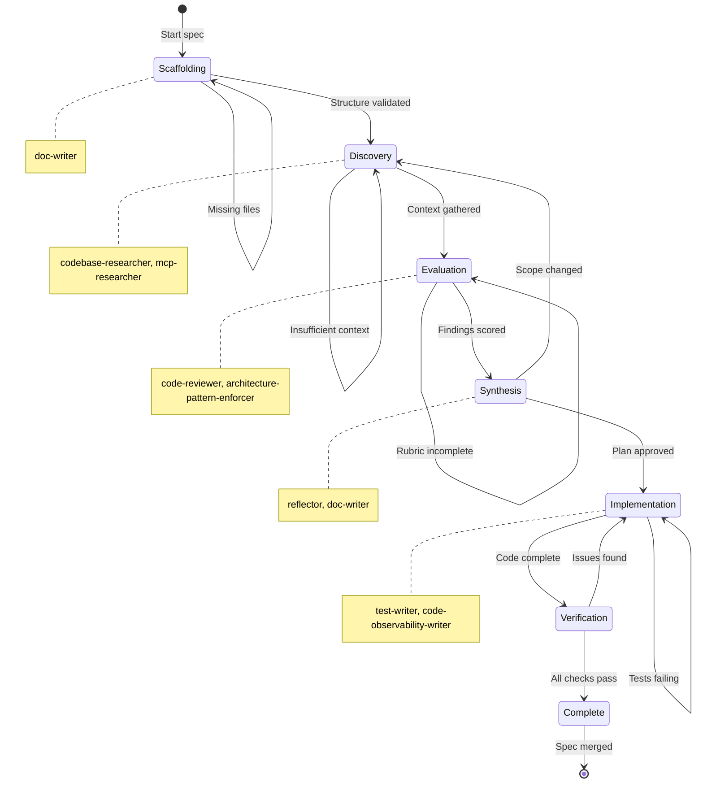

# Spec Creation Guide

> Agent-assisted workflow for creating and maintaining self-improving specifications.

---

## Overview

This guide describes how to create specifications using the specialized agents in `.claude/agents/`. Each phase of spec creation is enhanced by purpose-built agents that handle research, validation, documentation, and continuous improvement.

**Key Principle**: Specs are living documents. The specialized agents form a continuous improvement loop where each execution refines both the deliverable AND the methodology.

---

## Agent-Phase Mapping

> **Reference**: See `.claude/agents-manifest.yaml` for complete agent capabilities.

### Agent Capability Legend

| Capability        | Meaning                                     | Example Agents                          |
|-------------------|---------------------------------------------|-----------------------------------------|
| **read-only**     | Informs orchestrator, produces NO artifacts | `codebase-researcher`, `mcp-researcher` |
| **write-reports** | Produces markdown reports in `outputs/`     | `code-reviewer`, `reflector`            |
| **write-files**   | Creates/modifies source files               | `doc-writer`, `test-writer`             |

### Phase-Agent Matrix

| Phase              | Agent                           | Capability      | Output                                 |
|--------------------|---------------------------------|-----------------|----------------------------------------|
| **0: Scaffolding** | `doc-writer`                    | **write-files** | Creates README.md, structure files     |
| **0: Scaffolding** | `architecture-pattern-enforcer` | write-reports   | `outputs/structure-review.md`          |
| **1: Discovery**   | `codebase-researcher`           | read-only       | *Informs orchestrator only*            |
| **1: Discovery**   | `mcp-researcher`                | read-only       | *Informs orchestrator only*            |
| **1: Discovery**   | `web-researcher`                | read-only       | *Informs orchestrator only*            |
| **2: Evaluation**  | `code-reviewer`                 | write-reports   | `outputs/guideline-review.md`          |
| **2: Evaluation**  | `architecture-pattern-enforcer` | write-reports   | `outputs/architecture-review.md`       |
| **2: Evaluation**  | `spec-reviewer`                 | write-reports   | `outputs/spec-review.md`               |
| **3: Synthesis**   | `reflector`                     | write-reports   | `outputs/meta-reflection-*.md`         |
| **3: Synthesis**   | `doc-writer`                    | **write-files** | Creates MASTER_ORCHESTRATION.md, plans |
| **4+: Iteration**  | `test-writer`                   | **write-files** | Creates `*.test.ts` files              |
| **4+: Iteration**  | `code-observability-writer`     | **write-files** | Modifies source with logging/tracing   |
| **4+: Iteration**  | `package-error-fixer`           | **write-files** | Fixes type/build/lint errors           |

### Quick Selection Guide

**Need a report/artifact?** Use agents with `write-reports` or `write-files` capability:
- Reports: `code-reviewer`, `architecture-pattern-enforcer`, `reflector`, `spec-reviewer`
- Documentation: `doc-writer`, `agents-md-updater`, `readme-updater`
- Code/Tests: `test-writer`, `code-observability-writer`, `jsdoc-fixer`

**Need information only?** Use `read-only` agents:
- Codebase: `codebase-researcher`
- Effect docs: `mcp-researcher`, `effect-schema-expert`
- External: `web-researcher`

---

## Orchestrator Delegation Rules

> **CRITICAL**: Orchestrators coordinate, they do NOT execute. All substantive work MUST be delegated to specialized sub-agents.

### Mandatory Delegation Matrix

| Task Type | Delegate To | Never Do Directly |
|-----------|-------------|-------------------|
| Code exploration (>3 files) | `codebase-researcher` | Sequential Glob/Read |
| Effect documentation lookup | `mcp-researcher` | Manual doc searching |
| Source code implementation | `effect-code-writer` | Writing .ts files |
| Test implementation | `test-writer` | Writing .test.ts files |
| Architecture validation | `architecture-pattern-enforcer` | Layer checks |
| Documentation writing | `doc-writer` | README/AGENTS.md files |
| Error fixing | `package-error-fixer` | Manual error resolution |

### Delegation Trigger Rules

An orchestrator MUST delegate when ANY of these conditions are met:
- Task requires reading more than 3 files
- Task requires more than 5 sequential tool calls
- Task involves generating source code
- Task involves generating test code
- Task requires broad codebase search

### Orchestrator Allowed Actions

Orchestrators MAY directly:
- Read 1-3 small files for quick context
- Make 1-5 tool calls for coordination
- Synthesize sub-agent outputs
- Create handoff documents
- Update REFLECTION_LOG.md

---

## Phase State Machine

Specifications progress through a state machine with defined transitions and guards.

### Visualization



### Transition Table

| From | To | Condition | Guard Expression |
|------|-----|-----------|------------------|
| Scaffolding | Discovery | Structure validated | `files.required.every(f => exists(f))` |
| Discovery | Evaluation | Context gathered | `outputs.codebase_context != null` |
| Evaluation | Synthesis | Findings scored | `findings.every(f => f.score != null)` |
| Synthesis | Implementation | Plan approved | `user.approved == true && handoff.created` |
| Implementation | Verification | Code complete | `tests.passing && lint.clean` |
| Verification | Complete | All checks pass | `check.errors == 0` |

### Transition Types

- **Forward arrows**: Normal progression when phase criteria met
- **Self-loops**: Retry/remediation paths when criteria not met
- **Backward arrows**: Re-scoping when significant changes discovered

---

## Phase 0: Scaffolding

### Purpose
Create the specification framework with proper structure.

### Agent Tasks

#### Task 0.1: Generate Spec Structure (doc-writer)

```
Use the doc-writer agent to create initial spec structure.

Target: specs/[SPEC_NAME]/
Required files:
- README.md (100-150 lines) - Entry point
- REFLECTION_LOG.md - Empty, ready for learnings
- templates/ directory - If output templates needed
- outputs/ directory - For phase artifacts

Follow META_SPEC_TEMPLATE structure from specs/ai-friendliness-audit/META_SPEC_TEMPLATE.md
```

#### Task 0.2: Validate Structure (architecture-pattern-enforcer)

```
Use the architecture-pattern-enforcer agent to validate spec structure.

Check:
- README.md exists and follows template
- REFLECTION_LOG.md exists
- Directory structure matches META_SPEC_TEMPLATE
- No orphaned files outside standard structure
```

### Output Checklist
- [ ] `specs/[SPEC_NAME]/README.md` created
- [ ] `specs/[SPEC_NAME]/REFLECTION_LOG.md` created
- [ ] Directory structure validated

---

## Slice-Targeting Specs

If your spec targets `packages/[SLICE_NAME]/*`, check if packages already exist:

```bash
ls packages/[SLICE_NAME]/  # Exists? → Bootstrapped. Empty/missing? → Greenfield.
```

**Bootstrapped slices** require "Extend" language (not "Create") and a "Current State" section.

See [patterns/bootstrapped-slice-specs.md](patterns/bootstrapped-slice-specs.md) for the full pattern.

---

## Phase 1: Discovery

### Purpose
Gather context and map the problem space. **Read-only analysis.**

### Agent Tasks

#### Task 1.1: Codebase Exploration (codebase-researcher)

```
Use the codebase-researcher agent to systematically explore relevant code.

Research questions:
1. What existing patterns relate to this spec?
2. What files/packages will be affected?
3. What dependencies exist?
4. What test patterns are in place?

Output: outputs/codebase-context.md
```

#### Task 1.2: Effect Documentation Research (mcp-researcher)

For specs involving Effect patterns:

```
Use the mcp-researcher agent to research Effect documentation.

Search topics based on spec domain:
- Effect patterns relevant to the spec
- Schema definitions needed
- Layer composition approaches
- Error handling patterns

Output: outputs/effect-research.md
```

#### Task 1.3: External Research (web-researcher)

For specs requiring external context:

```
Use the web-researcher agent to research external sources.

Research topics:
- Best practices for [domain]
- Prior art and implementations
- Common pitfalls to avoid

Output: outputs/external-research.md
```

### Self-Reflection Checkpoint

After Phase 1, answer:
- What detection methods worked? Which failed?
- What codebase-specific patterns emerged?
- What research gaps remain?

Log to `REFLECTION_LOG.md`.

### Output Checklist
- [ ] `outputs/codebase-context.md` generated
- [ ] `outputs/effect-research.md` generated (if applicable)
- [ ] `outputs/external-research.md` generated (if applicable)
- [ ] `REFLECTION_LOG.md` updated with Phase 1 learnings

---

## Pre-flight Verification & Dry Runs

For complex phases, validate spec structure before full execution.

**When to validate:**
- Wrapping external APIs (Better Auth, Stripe, etc.)
- Phases with 3+ parallel sub-agent tasks
- First-time use of new patterns
- High-risk changes where rollback is expensive

**Quick Reference:**
- Pre-flight: LSP hover → official docs → runtime sample
- Dry runs: Select 2-3 representative tasks → spawn validation agents → synthesize → proceed/revise

See [patterns/validation-dry-runs.md](patterns/validation-dry-runs.md) for complete protocols.

---

## Phase 2: Evaluation

### Purpose
Apply rubrics and generate scored findings.

### Agent Tasks

#### Task 2.1: Guideline Review (code-reviewer)

```
Use the code-reviewer agent to evaluate against repository guidelines.

Check against:
- Effect patterns (.claude/rules/effect-patterns.md)
- Architecture boundaries (.claude/rules/general.md)
- Code quality standards

Output: outputs/guideline-review.md
```

#### Task 2.2: Structure Validation (architecture-pattern-enforcer)

```
Use the architecture-pattern-enforcer agent to validate architecture.

Validate:
- Layer dependency order (domain -> tables -> server -> client -> ui)
- Cross-slice import restrictions
- Path alias usage (@beep/*)
- Module organization

Output: outputs/architecture-review.md
```

### Self-Reflection Checkpoint

After Phase 2, answer:
- Were rubric thresholds appropriate?
- Did sampling provide representative data?
- What evidence verification techniques worked?

Log to `REFLECTION_LOG.md`.

### Output Checklist
- [ ] `outputs/guideline-review.md` generated
- [ ] `outputs/architecture-review.md` generated
- [ ] Scored evaluation complete
- [ ] `REFLECTION_LOG.md` updated with Phase 2 learnings

---

## Phase 3: Synthesis

### Purpose
Generate actionable plans and improve methodology.

### Agent Tasks

#### Task 3.1: Prompt Improvement (reflector)

```
Use the reflector agent to analyze REFLECTION_LOG and improve prompts.

Input: REFLECTION_LOG.md entries from Phase 1-2
Output:
- Pattern analysis
- Prompt refinements
- Anti-pattern warnings
- Methodology improvements

Apply improvements to:
- README.md (if prompts need refinement)
- AGENT_PROMPTS.md (if using sub-agents)
- Handoff templates
```

#### Task 3.2: Documentation Generation (doc-writer)

```
Use the doc-writer agent to generate final documentation.

Generate:
- MASTER_ORCHESTRATION.md (for complex specs)
- AGENT_PROMPTS.md (if multiple sub-agents)
- RUBRICS.md (if evaluation criteria needed)
- templates/*.template.md (output templates)

Ensure all documentation follows:
- Effect patterns in code examples
- Namespace imports (import * as)
- No async/await
```

#### Task 3.3: Create Remediation Plan

Based on Phase 2 evaluation, generate:
- `outputs/remediation-plan.md` - Prioritized actions
- `HANDOFF_P1.md` - First iteration handoff

### Output Checklist
- [ ] Prompts improved based on reflector analysis
- [ ] Documentation generated by doc-writer
- [ ] `outputs/remediation-plan.md` created
- [ ] `handoffs/HANDOFF_P1.md` created (context document)
- [ ] `handoffs/P1_ORCHESTRATOR_PROMPT.md` created (copy-paste prompt)
- [ ] `REFLECTION_LOG.md` updated with Phase 3 learnings

---

## Phase 4+: Iterative Execution

### Purpose
Execute plan in phases, continuously improving.

### Agent Tasks

#### Task 4.1: Execute Phase Tasks

Use appropriate agents based on task type:
- **Code changes**: Manual or with test-writer for tests
- **Documentation**: doc-writer
- **Observability**: code-observability-writer

#### Task 4.2: Validate Changes (test-writer)

```
Use the test-writer agent to create validation tests.

For each significant change:
- Unit tests for new functions
- Integration tests for new layers
- Property-based tests for schemas

Follow @beep/testkit patterns (effect, layer, scoped helpers).
```

#### Task 4.3: Add Observability (code-observability-writer)

For production code:

```
Use the code-observability-writer agent to add instrumentation.

Add:
- Effect.log* calls with structured objects
- Schema.TaggedError for error types
- Span annotations for tracing

Follow patterns in documentation/EFFECT_PATTERNS.md.
```

#### Task 4.4: Reflect and Handoff

**CRITICAL**: At the end of EVERY phase, you MUST create TWO handoff documents:

1. **`HANDOFF_P[N+1].md`** - Context document for the next phase
2. **`P[N+1]_ORCHESTRATOR_PROMPT.md`** - Copy-paste ready prompt to start the next phase

**Do NOT consider a phase complete until BOTH files exist.**

##### Create Handoff Document (HANDOFF_P[N+1].md)

```
Document what was accomplished and provide context for next phase.

Contents:
- Phase [N] Summary (what was accomplished)
- Key Learnings Applied (specific improvements made)
- Methods/Tasks to Implement (detailed specifications)
- Schema Shapes (verified response structures)
- Implementation Order (sequence and rationale)
- Verification Steps (commands to run)
- Known Issues & Gotchas (what to avoid)
- Success Criteria (completion checklist)
```

##### Create Orchestrator Prompt (P[N+1]_ORCHESTRATOR_PROMPT.md)

```
Create a copy-paste ready prompt that can launch the next phase.

Template:
# Phase [N+1] Orchestrator Prompt

Copy-paste this prompt to start Phase [N+1] implementation.

---

## Prompt

You are implementing Phase [N+1] of the [SPEC_NAME] spec.

### Context

[What was completed in previous phases]

### Your Mission

[Specific tasks for this phase]

### Critical Patterns

[Key patterns and gotchas with code examples]

### Reference Files

[Files to consult during implementation]

### Verification

[Commands to run after each step]

### Success Criteria

- [ ] [Completion checklist items]

### Handoff Document

Read full context in: `specs/[SPEC_NAME]/handoffs/HANDOFF_P[N+1].md`
```

See [HANDOFF_STANDARDS.md](HANDOFF_STANDARDS.md) for complete handoff requirements.

### Iteration Loop

```
┌──────────────────────────────────────────────────────────────────┐
│                       ITERATION LOOP                             │
├──────────────────────────────────────────────────────────────────┤
│  1. Execute tasks from P[N]_ORCHESTRATOR_PROMPT.md               │
│  2. Run tests (test-writer validates)                            │
│  3. Update REFLECTION_LOG.md with phase learnings                │
│  4. Create HANDOFF_P[N+1].md (context document)                  │
│  5. Create P[N+1]_ORCHESTRATOR_PROMPT.md (copy-paste prompt)     │
│  6. If work remains, go to step 1 with P[N+1]                    │
│                                                                   │
│  CRITICAL: Phase [N] is NOT complete until BOTH handoff files    │
│  exist (HANDOFF_P[N+1].md AND P[N+1]_ORCHESTRATOR_PROMPT.md)     │
└──────────────────────────────────────────────────────────────────┘
```

---

## Quick Reference: Agent Summaries

> **Critical**: Agents are categorized by OUTPUT CAPABILITY. Choose based on what you need produced.

### Read-Only Agents (No Output Files)

These agents INFORM the orchestrator but produce NO persistent artifacts.
Use when you need information to make decisions, not reports.

| Agent                       | Primary Use                      | Key Tools                          |
|-----------------------------|----------------------------------|------------------------------------|
| **codebase-researcher**     | Systematic code exploration      | Glob, Grep, Read                   |
| **mcp-researcher**          | Effect documentation lookup      | effect_docs_search, get_effect_doc |
| **web-researcher**          | External best practices research | WebSearch, WebFetch                |
| **effect-schema-expert**    | Schema pattern guidance          | Glob, Grep, Read, effect_docs      |
| **effect-predicate-master** | Predicate utilities              | Glob, Grep, Read, effect_docs      |

### Report-Producing Agents (Write to outputs/)

These agents PRODUCE markdown reports in `outputs/` directories.
Use when you need documented findings, audits, or reviews.

| Agent                             | Primary Use                         | Output Location                  |
|-----------------------------------|-------------------------------------|----------------------------------|
| **reflector**                     | Meta-reflection, pattern extraction | `outputs/meta-reflection-*.md`   |
| **code-reviewer**                 | Guideline violation reports         | `outputs/guideline-review.md`    |
| **architecture-pattern-enforcer** | Architecture audit reports          | `outputs/architecture-review.md` |
| **spec-reviewer**                 | Spec quality assessment             | `outputs/spec-review.md`         |
| **tsconfig-auditor**              | TypeScript config audit             | `outputs/tsconfig-audit.md`      |

### File-Modifying Agents (Write Source Files)

These agents CREATE or MODIFY source files (code, docs, tests).
Use when you need actual file changes, not just reports.

| Agent                         | Primary Use                           | Output Type            |
|-------------------------------|---------------------------------------|------------------------|
| **doc-writer**                | README, AGENTS.md, JSDoc              | Documentation files    |
| **test-writer**               | Effect-first tests with @beep/testkit | `*.test.ts` files      |
| **code-observability-writer** | Logging, tracing, metrics             | Source modifications   |
| **jsdoc-fixer**               | JSDoc comment compliance              | Source modifications   |
| **package-error-fixer**       | Type/build/lint error fixes           | Source modifications   |
| **agents-md-updater**         | AGENTS.md maintenance                 | Documentation files    |
| **readme-updater**            | README.md maintenance                 | Documentation files    |
| **prompt-refiner**            | Agent prompt improvements             | Agent definition files |

---

## Standard Spec Structure

```
specs/[SPEC_NAME]/
├── README.md                    # Entry point (100-150 lines)
├── REFLECTION_LOG.md            # Cumulative learnings (required)
├── QUICK_START.md               # 5-min getting started (optional)
├── MASTER_ORCHESTRATION.md      # Full workflow (complex specs)
├── AGENT_PROMPTS.md             # Sub-agent prompts (complex specs)
├── RUBRICS.md                   # Evaluation criteria (if applicable)
├── templates/                   # Output templates
│   ├── context.template.md
│   ├── evaluation.template.md
│   └── plan.template.md
├── outputs/                     # Phase artifacts
│   ├── codebase-context.md
│   ├── evaluation.md
│   └── remediation-plan.md
└── handoffs/                    # Phase transition documents
    ├── HANDOFF_P1.md            # Full context for Phase 1
    ├── P1_ORCHESTRATOR_PROMPT.md # Copy-paste prompt to start Phase 1
    ├── HANDOFF_P2.md            # Full context for Phase 2
    ├── P2_ORCHESTRATOR_PROMPT.md # Copy-paste prompt to start Phase 2
    └── ...                      # Continue for all phases

CRITICAL: Each phase requires BOTH handoff files:
- HANDOFF_P[N].md - Complete context, verification tables, detailed specs
- P[N]_ORCHESTRATOR_PROMPT.md - Concise, copy-paste ready prompt
```

---

## Phase Sizing Constraints

### Hard Limits

| Metric | Maximum | Recommended |
|--------|---------|-------------|
| Work items per phase | 7 | 5-6 |
| Sub-agent delegations per phase | 10 | 6-8 |
| Direct orchestrator tool calls | 20 | 10-15 |
| Sessions per phase | 2 | 1 |

### Phase Split Triggers

A phase MUST be split into sub-phases (P[N]a, P[N]b) when:
- Phase has 8+ work items
- Phase has 3+ "Large" work items (6+ tool calls each)
- Estimated duration exceeds 2 sessions

---

## Context Budget Guidelines

### Token Budget by Memory Type

Based on context engineering research (arXiv:2512.13564), handoff documents should enforce token limits to prevent context rot (50%+ performance degradation at 32K tokens).

| Memory Type | Token Budget | Content Type |
|-------------|--------------|--------------|
| **Working** | ≤2,000 | Current tasks, success criteria, blocking issues |
| **Episodic** | ≤1,000 | Previous phase summaries, key decisions |
| **Semantic** | ≤500 | Project constants, tech stack (only if non-obvious) |
| **Procedural** | Links only | Documentation references (no inline content) |
| **Total per handoff** | **≤4,000** | Well under degradation threshold |

### Content Placement Strategy

Models recall beginning and end content better than middle content ("lost in middle" effect).

| Document Position | Priority | Content |
|-------------------|----------|---------|
| **First 25%** | Critical | Success criteria, blocking issues, constraints |
| **Middle 50%** | Supporting | Episodic history, background context |
| **Last 25%** | Actionable | Next steps, verification commands, links |

### Budget Enforcement Protocol

**Before creating a handoff:**

1. Estimate token count per section
2. If any section exceeds budget:
   - **Working**: Split into "must-have" vs "nice-to-have"
   - **Episodic**: Compress with extractive summarization
   - **Semantic**: Move to procedural links
   - **Procedural**: Convert inline examples to file references

**Quick estimation heuristic**: ~4 tokens per word, ~100 tokens per typical paragraph.

### Context Compression Strategies

When content exceeds budget, apply these techniques (from most to least safe):

| Strategy | Use When | Risk |
|----------|----------|------|
| **Extractive** | Removing redundant phrases | Low - preserves original meaning |
| **Summarization** | Condensing paragraphs to bullets | Medium - may lose nuance |
| **Linking** | Replacing inline with doc references | Low - defers rather than loses |
| **Abstractive** | Synthesizing new summaries | High - may introduce errors |

**Recommended approach**: Use extractive compression for Working/Episodic, linking for Procedural.

---

## Reflection & Quality Scoring

The reflection system enables pattern extraction and skill promotion from spec execution.

**Key Components:**
- **Reflection Schema**: Structured JSON format for REFLECTION_LOG entries
- **Quality Rubric**: 8-category scoring system (102 points max)
- **Skill Promotion**: Workflow for extracting patterns to registry/skills

**Promotion Thresholds:**

| Score | Status | Destination |
|-------|--------|-------------|
| 90-102 | Production-ready | `.claude/skills/` |
| 75-89 | Validated | `specs/PATTERN_REGISTRY.md` |
| 50-74 | Promising | Spec-local REFLECTION_LOG |
| 0-49 | Needs work | Iterate in spec |

**Phase Completion Checklist:**
- [ ] REFLECTION_LOG.md updated with phase entry
- [ ] Pattern candidates identified and scored
- [ ] Patterns scoring 75+ promoted appropriately
- [ ] Handoff documents created

See [patterns/reflection-system.md](patterns/reflection-system.md) for complete schema, scoring guidelines, and promotion workflow.

---

## Creating a New Spec

### Complexity Calculator

Before creating a spec, estimate its complexity to choose the right structure.

#### Factor/Weight Table

| Factor | Weight | Scale | Description |
|--------|--------|-------|-------------|
| Phase Count | 2 | 1-10 | Estimated number of phases |
| Agent Diversity | 3 | 1-5 | Unique agents required |
| Cross-Package | 4 | 0-5 | Packages outside spec domain |
| External Dependencies | 3 | 0-5 | External APIs, services |
| Uncertainty | 5 | 1-5 | Unknown requirements, novel patterns |
| Research Required | 2 | 0-5 | External research intensity |

#### Calculation Formula

```
Complexity = (Phases × 2) + (Agents × 3) + (CrossPkg × 4) + (ExtDeps × 3) + (Uncertainty × 5) + (Research × 2)
```

#### Threshold Classification

| Score | Complexity | Structure | Checkpoint Frequency |
|-------|------------|-----------|---------------------|
| 0-20 | Simple | README + REFLECTION_LOG | Per-phase |
| 21-40 | Medium | + QUICK_START, outputs/, handoffs/ | Per-phase + mid-phase |
| 41-60 | High | + MASTER_ORCHESTRATION, AGENT_PROMPTS | Per-task |
| 61+ | Critical | + RUBRICS, extensive templates | Continuous |

#### Example Calculation

**Spec**: `spec-creation-improvements`

```
Phase Count:       6 phases    × 2 = 12
Agent Diversity:   5 agents    × 3 = 15
Cross-Package:     1 (specs/)  × 4 =  4
External Deps:     0           × 3 =  0
Uncertainty:       3 (medium)  × 5 = 15
Research Required: 4 (heavy)   × 2 =  8
────────────────────────────────────────
Total Score:                       54 → High Complexity
```

**Recommendation**: Use complex structure with MASTER_ORCHESTRATION.md and per-task checkpoints.

### Option 1: CLI Command (Recommended)

The fastest way to create a new spec is using the `bootstrap-spec` CLI command:

```bash
# Create medium-complexity spec (default)
bun run beep bootstrap-spec -n my-feature -d "Feature description"

# Create simple spec (README + REFLECTION_LOG only)
bun run beep bootstrap-spec -n quick-fix -d "Bug fix" -c simple

# Create complex spec (full orchestration structure)
bun run beep bootstrap-spec -n major-refactor -d "API redesign" -c complex

# Preview changes without creating files
bun run beep bootstrap-spec -n my-feature -d "Feature description" --dry-run
```

**Complexity Levels:**

| Level     | Files Created                                                                  | Use Case                       |
|-----------|--------------------------------------------------------------------------------|--------------------------------|
| `simple`  | README.md, REFLECTION_LOG.md                                                   | Quick fixes, 1 session         |
| `medium`  | + QUICK_START.md, outputs/, handoffs/                                          | Standard specs, 2-3 sessions   |
| `complex` | + MASTER_ORCHESTRATION.md, AGENT_PROMPTS.md, RUBRICS.md, templates/, handoffs/ | Major initiatives, 4+ sessions |

**Note**: Handoff documents (`handoffs/`) are recommended for any multi-session work (medium and complex specs) to preserve context between sessions. Single-session (simple) specs do not require handoffs.

### Option 2: Manual Initialization

For more control, initialize structure manually:

```bash
# Create directories
mkdir -p specs/[SPEC_NAME]/{templates,outputs,handoffs}

# Create required files
touch specs/[SPEC_NAME]/README.md
touch specs/[SPEC_NAME]/REFLECTION_LOG.md
```

### Step 2: Scaffold with doc-writer

```
Launch doc-writer agent:

"Create initial README.md for specs/[SPEC_NAME]/ following META_SPEC_TEMPLATE.
Include:
- Purpose and scope
- Success criteria
- Expected outputs
- Phase overview"
```

### Step 3: Validate with architecture-pattern-enforcer

```
Launch architecture-pattern-enforcer agent:

"Validate specs/[SPEC_NAME]/ structure against META_SPEC_TEMPLATE.
Check all required files exist and follow conventions."
```

### Step 4: Execute Phases

Follow Phase 1-4+ workflow above, using appropriate agents at each phase.

---

## Auditing Existing Specs

### Audit Task (codebase-researcher)

```
Launch codebase-researcher agent:

"Audit all spec folders in specs/ directory.
For each spec:
1. List current files
2. Check for required README.md and REFLECTION_LOG.md
3. Identify missing standard files
4. Classify complexity: Simple / Medium / Complex

Output: specs/outputs/SPEC_AUDIT_REPORT.md"
```

### Remediation Task (doc-writer)

For specs missing required files:

```
Launch doc-writer agent:

"Create missing files for specs/[SPEC_NAME]/:
- README.md if missing (use META_SPEC_TEMPLATE)
- REFLECTION_LOG.md if missing (empty template)
- QUICK_START.md if medium+ complexity"
```

---

## Success Criteria

A spec is complete when:

- [ ] README.md exists and follows template
- [ ] REFLECTION_LOG.md exists (even if minimal)
- [ ] All code examples use Effect patterns
- [ ] Complex specs have handoff mechanism
- [ ] Agents have been used for each applicable phase
- [ ] Final reflector pass has improved prompts

**Multi-Session Spec Phase Completion Criteria:**

Each phase of a multi-session spec is complete ONLY when:

- [ ] Phase work is implemented and verified
- [ ] REFLECTION_LOG.md updated with phase learnings
- [ ] `handoffs/HANDOFF_P[N+1].md` created (full context document)
- [ ] `handoffs/P[N+1]_ORCHESTRATOR_PROMPT.md` created (copy-paste prompt)
- [ ] Both handoff files pass verification checklist in [HANDOFF_STANDARDS.md](HANDOFF_STANDARDS.md)

**Critical**: Do NOT move to the next phase until BOTH handoff files exist. The orchestrator prompt is not optional - it's the primary mechanism for starting the next session.

---

## Anti-Patterns

14 common mistakes to avoid when creating and executing specifications:

| Category | Anti-Patterns |
|----------|---------------|
| **Agent Misuse** | Manual Everything, Agent Overload, Orchestrator Research |
| **Process Gaps** | Skipping Reflection, Static Prompts, No Validation |
| **Architecture** | CLI vs Skill Confusion, Effect Pattern Violations |
| **Documentation** | Template Variables, Missing Decision Frameworks, Missing Prompts |
| **Context Management** | Unbounded Phases, Late Checkpoints, Context Hoarding |

**Most Critical:**
- **#10**: Always create BOTH `HANDOFF_P[N+1].md` AND `P[N+1]_ORCHESTRATOR_PROMPT.md`
- **#11**: Orchestrators delegate research; they don't do sequential Glob/Read/Grep
- **#12**: Phases have max 7 work items; split into sub-phases if larger

See [patterns/anti-patterns.md](patterns/anti-patterns.md) for all 14 anti-patterns with examples.

---

## Related Documentation

### Core References
- [HANDOFF_STANDARDS](HANDOFF_STANDARDS.md) - Context transfer standards
- [EFFECT_PATTERNS](../../documentation/EFFECT_PATTERNS.md) - Code patterns
- [Agent Specifications](agents/README.md) - All specialized agents

### Pattern Library
- [patterns/reflection-system.md](patterns/reflection-system.md) - Reflection schema, scoring, skill promotion
- [patterns/validation-dry-runs.md](patterns/validation-dry-runs.md) - Pre-flight verification, dry run protocols
- [patterns/anti-patterns.md](patterns/anti-patterns.md) - 14 anti-patterns to avoid
- [patterns/bootstrapped-slice-specs.md](patterns/bootstrapped-slice-specs.md) - Extending existing slices
