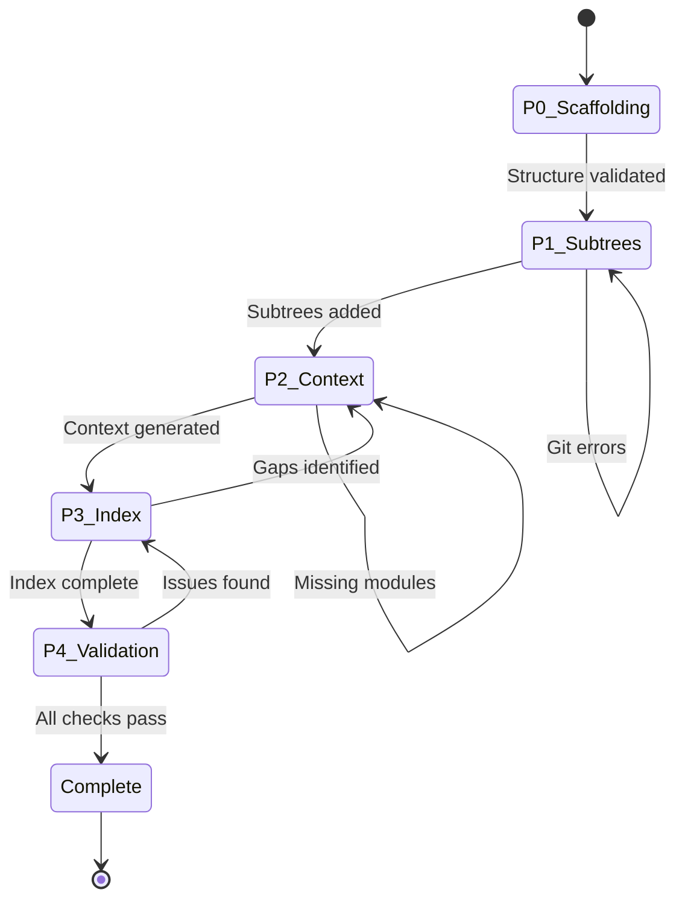

# Master Orchestration — Agent Context Optimization

> Complete workflow for implementing Arnaldi's agent context recommendations.

---

## Orchestrator Identity

```
self := Architect ∧ Coordinator ∧ Delegator

-- You ARE:
--   • An architect who designs the context system
--   • A coordinator who delegates implementation
--   • A reviewer who validates outputs

-- You MUST delegate:
--   • Code exploration (>3 files) → codebase-researcher
--   • Documentation writing → doc-writer
--   • Effect lookups → mcp-researcher
```

---

## Phase State Machine



---

## Phase 0: Scaffolding

### Purpose
Validate spec structure and prepare for implementation.

### Tasks

| ID | Task | Agent | Output |
|----|------|-------|--------|
| 0.1 | Validate spec structure | architecture-pattern-enforcer | `outputs/structure-review.md` |
| 0.2 | Audit existing AGENTS.md files | codebase-researcher | Informed orchestrator |

### Verification

```bash
# Structure validation
ls specs/agent-context-optimization/
# Expected: README.md, REFLECTION_LOG.md, QUICK_START.md, MASTER_ORCHESTRATION.md, outputs/, handoffs/, templates/

# No build impact
bun run check
```

### Exit Criteria
- [ ] All spec files created
- [ ] Structure validated by architecture-pattern-enforcer
- [ ] Existing AGENTS.md patterns documented
- [ ] REFLECTION_LOG.md updated

### Handoff
Create `handoffs/HANDOFF_P1.md` and `handoffs/P1_ORCHESTRATOR_PROMPT.md`

---

## Phase 1: Git Subtree Setup

### Purpose
Add library source repositories as git subtrees for agent reference.

### Background

Git subtrees allow embedding external repositories while maintaining a single repo workflow. Unlike submodules, subtrees don't require special commands for clone/pull.

### Tasks

| ID | Task | Agent | Output |
|----|------|-------|--------|
| 1.1 | Research subtree best practices | web-researcher | Informed orchestrator |
| 1.2 | Add Effect subtree | Bash (direct) | `.repos/effect/` |
| 1.3 | Add @effect/platform subtree | Bash (direct) | `.repos/effect-platform/` |
| 1.4 | Add @effect/ai subtree | Bash (direct) | `.repos/effect-ai/` |
| 1.5 | Configure .gitignore | Bash (direct) | Updated `.gitignore` |
| 1.6 | Document update workflow | doc-writer | `documentation/subtree-workflow.md` |

### Implementation Details

#### Task 1.2-1.4: Add Subtrees

```bash
# Effect core
git subtree add --prefix=.repos/effect https://github.com/Effect-TS/effect.git main --squash

# Note: effect-platform and effect-ai are in the same monorepo
# They share the same subtree, just reference different packages
```

**CRITICAL**: The Effect repo is a monorepo containing:
- `packages/effect/` - Core Effect
- `packages/platform/` - @effect/platform
- `packages/platform-bun/` - Bun implementation
- `packages/ai/` - @effect/ai

So we only need ONE subtree for all Effect packages.

#### Task 1.5: Configure .gitignore

```gitignore
# .repos subtrees - exclude from searches but keep in git
# (No exclusion needed - subtrees should be searchable)
```

### Verification

```bash
# Verify subtree added
ls .repos/effect/packages/effect/src/Effect.ts

# Verify no build impact
bun run check

# Verify subtree is searchable
grep -r "Effect.gen" .repos/effect/packages/effect/src/ | head -5
```

### Exit Criteria
- [ ] `.repos/effect/` contains Effect source
- [ ] Subtree workflow documented
- [ ] `bun run check` passes
- [ ] REFLECTION_LOG.md updated

### Handoff
Create `handoffs/HANDOFF_P2.md` and `handoffs/P2_ORCHESTRATOR_PROMPT.md`

---

## Phase 2: Module Context Generation

### Purpose
Generate best practices documentation for heavily-used Effect modules.

### Module Priority

Based on codebase usage analysis (to be performed by codebase-researcher):

**Tier 1 (Critical)** — Generate first:
- `effect/Effect` — Core effect composition
- `effect/Schema` — Data validation
- `effect/Layer` — Dependency injection
- `effect/Context` — Service access

**Tier 2 (Important)** — Generate second:
- `effect/Stream` — Streaming data
- `effect/Array` — Array utilities
- `effect/Option` — Optional values
- `effect/Either` — Error handling
- `effect/Match` — Pattern matching

**Tier 3 (Common)** — Generate third:
- `effect/DateTime` — Date/time handling
- `effect/String` — String utilities
- `effect/Struct` — Object utilities
- `effect/Record` — Record utilities
- `effect/Predicate` — Type guards

**Platform Modules**:
- `platform/FileSystem` — File I/O
- `platform/HttpClient` — HTTP requests
- `platform/Command` — Process spawning

### Tasks

| ID | Task | Agent | Output |
|----|------|-------|--------|
| 2.1 | Analyze module usage in codebase | codebase-researcher | Usage frequency data |
| 2.2 | Generate Tier 1 context files | doc-writer | `context/effect/Effect.md`, etc. |
| 2.3 | Generate Tier 2 context files | doc-writer | `context/effect/Stream.md`, etc. |
| 2.4 | Generate Tier 3 context files | doc-writer | `context/effect/DateTime.md`, etc. |
| 2.5 | Generate Platform context files | doc-writer | `context/platform/*.md` |
| 2.6 | Create master index | doc-writer | `context/INDEX.md` |

### Context File Template

Each context file should follow this structure:

```markdown
# [Module Name] — Agent Context

> Best practices for using `effect/[Module]` in this codebase.

## Quick Reference

[Commonly used functions with examples]

## Codebase Patterns

[How this module is used in beep-effect]

## Anti-Patterns

[What NOT to do]

## Related Modules

[Links to related context files]

## Source Reference

[Link to .repos/effect/packages/effect/src/[Module].ts]
```

### Verification

```bash
# Verify context files created
ls context/effect/
# Expected: Effect.md, Schema.md, Layer.md, Context.md, ...

# Verify index created
cat context/INDEX.md

# Verify no build impact
bun run check
```

### Exit Criteria
- [ ] 20+ context files created
- [ ] Master index links all files
- [ ] Files follow template structure
- [ ] `bun run check` passes
- [ ] REFLECTION_LOG.md updated

### Handoff
Create `handoffs/HANDOFF_P3.md` and `handoffs/P3_ORCHESTRATOR_PROMPT.md`

---

## Phase 3: Index Enhancement

### Purpose
Enhance root AGENTS.md with comprehensive navigation to all agent resources.

### Tasks

| ID | Task | Agent | Output |
|----|------|-------|--------|
| 3.1 | Audit current AGENTS.md | codebase-researcher | Gap analysis |
| 3.2 | Design index structure | Orchestrator (direct) | Structure proposal |
| 3.3 | Update AGENTS.md | doc-writer | Enhanced `AGENTS.md` |
| 3.4 | Update package AGENTS.md files | agents-md-updater | Cross-references added |

### Index Structure Design

```markdown
## Context Navigation

### Library Reference
| Library | Subtree | Key Modules |
|---------|---------|-------------|
| Effect | `.repos/effect/` | [Effect](context/effect/Effect.md), [Schema](context/effect/Schema.md), ... |
| Platform | `.repos/effect/` | [FileSystem](context/platform/FileSystem.md), ... |

### Skills by Category
| Category | Skills | When to Use |
|----------|--------|-------------|
| Domain Modeling | domain-modeling, pattern-matching | Creating entities, ADTs |
| Services | service-implementation, layer-design | Building services |
| Testing | effect-concurrency-testing | Writing tests |

### Specs by Status
| Status | Specs |
|--------|-------|
| Active | [agent-context-optimization](specs/agent-context-optimization/) |
| Complete | [knowledge-architecture-foundation](specs/knowledge-architecture-foundation/) |
```

### Verification

```bash
# Verify AGENTS.md updated
grep "Context Navigation" AGENTS.md

# Verify links work
# (Manual verification of markdown links)

# Verify no build impact
bun run check
```

### Exit Criteria
- [ ] AGENTS.md has Context Navigation section
- [ ] All context files linked
- [ ] Skills linked by category
- [ ] Specs linked by status
- [ ] `bun run check` passes
- [ ] REFLECTION_LOG.md updated

### Handoff
Create `handoffs/HANDOFF_P4.md` and `handoffs/P4_ORCHESTRATOR_PROMPT.md`

---

## Phase 4: Validation & Refinement

### Purpose
Validate the complete system and refine based on testing.

### Tasks

| ID | Task | Agent | Output |
|----|------|-------|--------|
| 4.1 | Test agent with new context | Manual testing | Test results |
| 4.2 | Identify missing context | codebase-researcher | Gap list |
| 4.3 | Generate missing context | doc-writer | Additional context files |
| 4.4 | Final AGENTS.md review | spec-reviewer | `outputs/final-review.md` |
| 4.5 | Document maintenance | doc-writer | `documentation/context-maintenance.md` |

### Validation Protocol

1. **Subtree Validation**
   ```bash
   # Verify subtree accessible
   ls .repos/effect/packages/effect/src/Effect.ts

   # Verify searchable
   grep -l "flatMap" .repos/effect/packages/effect/src/Effect.ts
   ```

2. **Context Validation**
   ```bash
   # Verify all context files exist
   find context/ -name "*.md" | wc -l
   # Expected: 20+

   # Verify index links all files
   grep -c "context/" context/INDEX.md
   ```

3. **Index Validation**
   ```bash
   # Verify AGENTS.md has navigation
   grep -A 20 "Context Navigation" AGENTS.md
   ```

4. **Build Validation**
   ```bash
   bun run check
   bun run test
   ```

### Exit Criteria
- [ ] All subtrees accessible and searchable
- [ ] All context files linked and accurate
- [ ] AGENTS.md navigation complete
- [ ] Maintenance workflow documented
- [ ] `bun run check` passes
- [ ] `bun run test` passes
- [ ] REFLECTION_LOG.md finalized

---

## Appendix: Agent Prompts

### For codebase-researcher

```
Analyze Effect module usage across the codebase.

Questions to answer:
1. Which Effect modules are imported most frequently?
2. What patterns are used for each module?
3. Are there inconsistencies in module usage?

Output: Frequency data and pattern summary to inform orchestrator.
Do NOT produce output files.
```

### For doc-writer (Context Generation)

```
Generate a context file for effect/[MODULE] following the template:

1. Read .repos/effect/packages/effect/src/[MODULE].ts
2. Analyze usage patterns in packages/*/src/
3. Extract best practices from .claude/rules/effect-patterns.md
4. Generate context/effect/[MODULE].md

Follow the context file template structure.
Include concrete examples from this codebase.
```

### For doc-writer (Index Enhancement)

```
Enhance AGENTS.md with comprehensive navigation.

Add a "Context Navigation" section that links:
1. All context/*.md files
2. All .claude/skills/*/SKILL.md files
3. All active specs in specs/*/README.md

Maintain existing content.
Use tables for organization.
```

---

## Appendix: Maintenance Workflow

After spec completion, context should be refreshed periodically:

### Subtree Updates

```bash
# Update Effect subtree (quarterly recommended)
git subtree pull --prefix=.repos/effect https://github.com/Effect-TS/effect.git main --squash
```

### Context Refresh

```bash
# Re-analyze module usage
# Delegate to codebase-researcher

# Regenerate stale context files
# Delegate to doc-writer
```

### Index Maintenance

```bash
# When adding new skills or specs
# Update AGENTS.md Context Navigation section
```
