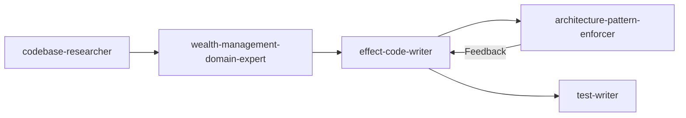

# Wealth Management Domain Expert Agent Specification

## Purpose

Create an AI agent with specialized knowledge of the **wealth management domain** for ultra-high-net-worth individuals (UHNWI - $30M+ net worth). This agent synthesizes information into ontologies enabling:

- **Evidence Linking**: Every fact traces to source text (compliance critical)
- **GraphRAG**: Intelligent context assembly for agents
- **Ontology-Guided Extraction**: Constrain LLM outputs to valid domain concepts
- **Entity Resolution**: Unify identities across integration sources

## Target Market

Small to medium-sized wealth management firms serving UHNWI clients, similar to:
- [Advice Period](https://www.adviceperiod.com/) - Evidence-based wealth management
- Multi-family offices (MFOs)
- Registered Investment Advisors (RIAs)
- Trust companies

## Success Criteria

### Phase 0: Ontology Foundation
- [ ] Core entity schemas defined (Client, Account, Investment, Trust, Document)
- [ ] Relationship types modeled with cardinality constraints
- [ ] Evidence linking patterns established for compliance

### Phase 1: Domain Model Implementation
- [ ] Effect Schema models for all wealth management entities
- [ ] Integration with `@beep/knowledge-domain` structure
- [ ] Validation constraints for regulatory compliance

### Phase 2: Extraction Pipeline
- [ ] Ontology-guided prompts for entity extraction
- [ ] Property scoping by entity type
- [ ] Grounding service for hallucination filtering

### Phase 3: Entity Resolution
- [ ] Cross-source entity matching (custodian feeds, CRM, documents)
- [ ] Canonical entity selection per cluster
- [ ] `owl:sameAs` link maintenance for provenance

### Phase 4: GraphRAG Context Assembly
- [ ] k-NN entity search with pgvector
- [ ] N-hop subgraph traversal for context
- [ ] RRF scoring for relevance ranking

### Phase 5: Agent Integration
- [ ] Domain expert agent prompt definition
- [ ] Tool definitions for wealth management queries
- [ ] Evidence citation in responses

## Architecture Overview

```
┌─────────────────────────────────────────────────────────────────┐
│                    Wealth Management Domain                     │
├─────────────────────────────────────────────────────────────────┤
│  Ontology Layer                                                 │
│  ┌─────────────┐  ┌─────────────┐  ┌─────────────┐              │
│  │   Client    │  │   Account   │  │ Investment  │              │
│  │  Household  │  │   Trust     │  │   Entity    │              │
│  │ Beneficiary │  │  Document   │  │  Relation   │              │
│  └─────────────┘  └─────────────┘  └─────────────┘              │
├─────────────────────────────────────────────────────────────────┤
│  Knowledge Graph Layer (from specs/knowledge-graph-integration) │
│  ┌─────────────┐  ┌─────────────┐  ┌─────────────┐              │
│  │   Entity    │  │  Relation   │  │  Mention    │              │
│  │ EvidenceSpan│  │ Extraction  │  │  Ontology   │              │
│  └─────────────┘  └─────────────┘  └─────────────┘              │
├─────────────────────────────────────────────────────────────────┤
│  Integration Layer                                              │
│  ┌─────────────┐  ┌─────────────┐  ┌─────────────┐              │
│  │  Custodian  │  │    CRM      │  │  Document   │              │
│  │   Feeds     │  │  Systems    │  │ Management  │              │
│  │ Schwab/Fido │  │ Salesforce  │  │ Laserfiche  │              │
│  └─────────────┘  └─────────────┘  └─────────────┘              │
└─────────────────────────────────────────────────────────────────┘
```

## Key Documents

| Document                             | Purpose                               |
|--------------------------------------|---------------------------------------|
| `README.md`                          | This file - entry point and overview  |
| `QUICK_START.md`                     | 5-minute triage guide                 |
| `MASTER_ORCHESTRATION.md`            | 6-phase implementation workflow       |
| `REFLECTION_LOG.md`                  | Cumulative learnings from each phase  |
| `RUBRICS.md`                         | Output quality scoring criteria       |
| `handoffs/HANDOFF_P0.md`             | Phase 0 detailed implementation guide |
| `handoffs/P0_ORCHESTRATOR_PROMPT.md` | Copy-paste prompt to start Phase 0    |

---

## Multi-Session Handoff Protocol

This spec uses a **two-file handoff system** for multi-session orchestration:

| File Type | Purpose | When to Use |
|-----------|---------|-------------|
| `HANDOFF_P[N].md` | Context summary with verified file references | Read at session start |
| `P[N]_ORCHESTRATOR_PROMPT.md` | Copy-paste ready prompt | Paste to start phase |

**Why multi-session?** Each phase (0-5) may require significant implementation work. Handoffs preserve context between Claude Code sessions, ensuring continuity without context window exhaustion.

**Session workflow:**
1. Copy prompt from `P[N]_ORCHESTRATOR_PROMPT.md`
2. Paste into new Claude Code session
3. Reference `HANDOFF_P[N].md` for detailed context
4. Complete phase deliverables
5. Update `REFLECTION_LOG.md` with learnings
6. Create `HANDOFF_P[N+1].md` and `P[N+1]_ORCHESTRATOR_PROMPT.md`

---

## Success Criteria

### Measurable Pass/Fail Criteria by Phase

| Phase | Criterion | Pass Condition | Verification Command |
|-------|-----------|----------------|----------------------|
| P0 | Ontology syntax | 0 parse errors via N3.js | `bun run scripts/validate-ontology.ts outputs/wealth-management.ttl` |
| P0 | Class count | `grep -c "owl:Class"` returns ≥8 | `grep -c "owl:Class" outputs/wealth-management.ttl` |
| P0 | Object properties | `grep -c "owl:ObjectProperty"` returns ≥9 | `grep -c "owl:ObjectProperty" outputs/wealth-management.ttl` |
| P0 | Datatype properties | `grep -c "owl:DatatypeProperty"` returns ≥6 | `grep -c "owl:DatatypeProperty" outputs/wealth-management.ttl` |
| P0 | Evidence linking | 6 facts in Evidence Linking section | Manual review of `outputs/property-inventory.md` |
| P0 | Resolution keys | 4 entity types with primary + fuzzy keys | Manual review of `outputs/entity-resolution-keys.md` |
| P1 | Effect Schema | 0 TypeScript interfaces, all use `S.Class` | `grep -c "interface.*{" packages/knowledge/domain/src/**/*.ts` returns 0 |
| P1 | Multi-tenant | 100% models have organizationId | `grep -L "organizationId" packages/knowledge/domain/src/entities/**/*.ts` returns empty |
| P1 | Pattern compliance | 0 forbidden patterns | `grep -c "any\|@ts-ignore" packages/knowledge/domain/src/**/*.ts` returns 0 |
| P1 | Type check | 0 type errors | `bun run check --filter @beep/knowledge-domain` exits 0 |
| P2 | Evidence preservation | startChar/endChar in all extraction outputs | Unit test coverage for character offset preservation |
| P2 | Grounding threshold | 0.8 enforced in grounding service | `grep "0.8" packages/knowledge/server/src/services/Grounder.ts` |
| P3 | Entity matching | Test coverage for primary + fuzzy matching | `bun run test --filter @beep/knowledge-server` passes |
| P4 | Context assembly | k-NN search returns relevant results | Integration test with sample queries |
| P5 | Agent citations | Responses include evidence spans with confidence | Manual review of agent output format |

### Quantitative Acceptance Thresholds

| Metric | Threshold | Measurement | Target Number |
|--------|-----------|-------------|---------------|
| Ontology classes | ≥8 | `grep -c "owl:Class" outputs/wealth-management.ttl` | 8 Priority 0 + 4 Priority 1 = 12 |
| Object properties | ≥9 | `grep -c "owl:ObjectProperty" outputs/wealth-management.ttl` | 9 defined |
| Datatype properties | ≥6 | `grep -c "owl:DatatypeProperty" outputs/wealth-management.ttl` | 6 defined |
| Ontology completeness | ≥80% | (12 + 15) actual / (12 + 15) required × 100 | 100% (27/27) |
| Schema pattern compliance | 100% | `grep -c "any\|@ts-ignore"` returns 0 | 0 violations |
| Domain model count | 4 | `ls packages/knowledge/domain/src/entities/Wm*/ | wc -l` | Client, Account, Trust, Ownership |
| Test coverage (domain) | ≥80% | `bun run test:coverage --filter @beep/knowledge-domain` | 80%+ lines |
| Test coverage (server) | ≥70% | `bun run test:coverage --filter @beep/knowledge-server` | 70%+ lines |
| Grounding accuracy | ≥90% | Manual validation on 50-item test corpus | 45/50 correct |
| Entity resolution precision | ≥85% | Precision on labeled 100-item test set | 85/100 correct |
| Evidence span coverage | 100% | All 6 compliance-critical facts have EvidenceSpan | 6/6 documented |
| Entity resolution keys | 100% | 4 entity types with primary + fuzzy keys | 4/4 defined |

### Minimum Acceptance

- Phase 0 (ontology): ≥80% rubric score
- Phases 1-5: ≥70% rubric score each
- No dimension below 50%
- All verification commands pass

See `RUBRICS.md` for detailed scoring criteria.

---

## Verification Commands

```bash
# Ontology syntax validation
grep -c "owl:Class" specs/agents/wealth-management-domain-expert/outputs/wealth-management.ttl
grep -c "owl:ObjectProperty" specs/agents/wealth-management-domain-expert/outputs/wealth-management.ttl
grep -c "owl:DatatypeProperty" specs/agents/wealth-management-domain-expert/outputs/wealth-management.ttl

# Type-check domain models
bun run check --filter @beep/knowledge-domain

# Pattern compliance check
grep -r "import \* as" packages/knowledge/domain/src/*.ts | head -20

# Forbidden pattern check (should return empty)
grep -r "any\|@ts-ignore" packages/knowledge/domain/src/*.ts

# Test suite
bun run test --filter @beep/knowledge-domain
```

---

## Integration Patterns

### With `codebase-researcher` Agent

Use `codebase-researcher` **before** implementing new models:

```
1. Query existing patterns in @beep/knowledge-domain
2. Identify Effect Schema conventions used
3. Feed findings to this spec for consistent implementation
```

### With `architecture-pattern-enforcer` Agent

Use `architecture-pattern-enforcer` **after** implementation:

```
1. Generate entities/models per this spec
2. Run architecture audit for pattern compliance
3. Refine based on enforcer feedback
```

### With `effect-schema-expert` Agent

Use `effect-schema-expert` for complex schema questions:

```
1. Design ontology property → Effect Schema mapping
2. Consult expert for validation constraint patterns
3. Apply recommendations to domain models
```

### Multi-Agent Workflow Example



## Reference Materials

### Knowledge Graph Integration
- `specs/knowledge-graph-integration/` - Core ontology patterns
- `specs/knowledge-graph-integration/outputs/effect-ontology-analysis.md` - Reference implementation

### Existing Domain Models
- `packages/knowledge/domain/src/entities/` - Entity, Relation, Mention, Extraction
- `packages/knowledge/domain/src/value-objects/EvidenceSpan.ts` - Evidence linking

### Compliance Resources
- SEC Investment Advisers Act
- FINRA Know Your Customer Rule (2090)
- FinCEN Customer Due Diligence Rule

## Phase Overview

| Phase | Focus               | Agents                                                | Deliverables                            |
|-------|---------------------|-------------------------------------------------------|-----------------------------------------|
| P0    | Ontology Design     | `codebase-researcher`, `effect-schema-expert`         | Ontology schema, class definitions      |
| P1    | Domain Models       | `effect-code-writer`, `code-reviewer`                 | Effect Schema implementations           |
| P2    | Extraction Pipeline | `effect-code-writer`, `test-writer`                   | Extraction stages, prompts              |
| P3    | Entity Resolution   | `effect-code-writer`, `test-writer`                   | Clustering, matching algorithms         |
| P4    | GraphRAG Context    | `effect-code-writer`, `architecture-pattern-enforcer` | Search, traversal, ranking              |
| P5    | Agent Integration   | `doc-writer`, `test-writer`                           | Agent prompt, tools, evidence citations |

## Getting Started

1. Read `MASTER_ORCHESTRATION.md` for complete workflow
2. Copy prompt from `handoffs/P0_ORCHESTRATOR_PROMPT.md`
3. Paste into new Claude Code session
4. Follow Phase 0 instructions
5. Create handoff documents before ending session

---

## Metadata

| Field | Value |
|-------|-------|
| Created | 2026-01-18 |
| Last Updated | 2026-01-18 |
| Version | 1.0.0 |
| Status | Ready for Phase 0 |
| Maintainer | AI-assisted |
