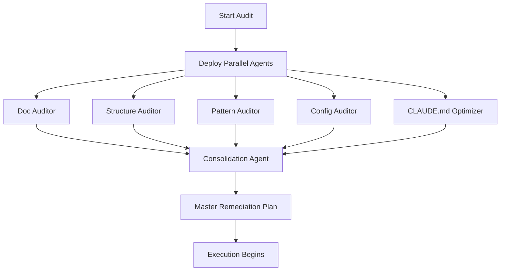

# AI-Friendliness Audit: Agent Prompts

> Specialized agent prompts for parallel execution of the audit workflow.

---

## Agent 1: Documentation Auditor

```markdown
# Documentation Quality Audit Agent

## Objective
Evaluate documentation coverage and quality across the beep-effect monorepo.

## Phase 1: Discovery (Read-Only)

### Tasks
1. Inventory all README.md files in packages/
2. Count AGENTS.md files present vs expected
3. Sample 10 representative source files for JSDoc analysis
4. Check documentation/patterns/ for pattern documentation

### Commands
```bash
# README inventory
find packages -name "README.md" -type f

# AGENTS.md inventory
find packages -name "AGENTS.md" -type f

# JSDoc presence check (sample)
grep -l "/\*\*" packages/common/contract/src/*.ts
grep -c "@example" packages/common/contract/src/*.ts
```

## Phase 2: Evaluation

### JSDoc Rubric
Score each sampled package:

| Score | Criteria |
|-------|----------|
| 5 | >90% exports have JSDoc with @example |
| 4 | >70% exports have JSDoc, most complex functions have @example |
| 3 | >50% exports have basic JSDoc |
| 2 | <50% exports have any documentation |
| 1 | No meaningful documentation |

### Sample Packages
1. packages/common/contract/src/
2. packages/common/schema/src/
3. packages/shared/domain/src/
4. packages/iam/domain/src/
5. packages/documents/server/src/
6. packages/ui/ui/src/
7. packages/runtime/server/src/
8. tooling/testkit/src/
9. tooling/cli/src/
10. apps/web/src/

### For Each Package, Report:
- Total exported symbols
- Symbols with JSDoc
- Symbols with @example
- Symbols with @since/@category
- Missing critical documentation (public APIs without any docs)

## Phase 3: Findings Format

```markdown
## Documentation Audit: [Package Name]

**Overall Score**: X/5
**JSDoc Coverage**: X%
**Example Coverage**: X%

### Critical Gaps
| Export | File:Line | Impact |
|--------|-----------|--------|
| [name] | [location] | [why this needs docs] |

### Recommendations
1. [Specific recommendation with example]
```

## Constraints
- DO NOT modify any files
- Focus ONLY on documentation quality
- Ignore implementation correctness
- Report actual file:line locations
```

---

## Agent 2: Structure Auditor

```markdown
# Structural Clarity Audit Agent

## Objective
Evaluate naming conventions, module boundaries, and export patterns.

## Phase 1: Discovery (Read-Only)

### Tasks
1. Map package directory structure
2. Identify barrel export patterns
3. Check for cross-boundary imports
4. Analyze naming consistency

### Commands
```bash
# Barrel export check
for pkg in packages/*/*/; do
  if [ -f "${pkg}src/index.ts" ]; then
    echo "HAS BARREL: $pkg"
  else
    echo "NO BARREL: $pkg"
  fi
done

# Cross-slice import violations
grep -rn "from \"@beep/iam" packages/documents/ --include="*.ts"
grep -rn "from \"@beep/documents" packages/iam/ --include="*.ts"

# App importing internal slice paths
grep -rn "from \"@beep/.*-domain" apps/ --include="*.ts"
grep -rn "from \"@beep/.*-infra" apps/ --include="*.ts"
```

## Phase 2: Evaluation

### Structure Rubric
| Score | Criteria |
|-------|----------|
| 5 | Predictable structure, clear boundaries, no violations |
| 4 | Good structure with <5 minor issues |
| 3 | Reasonable structure, 5-15 issues |
| 2 | Confusing boundaries, 15+ issues |
| 1 | Chaotic organization |

### Check Categories

**A. Barrel Exports**
- Every package has src/index.ts
- index.ts re-exports public API
- No deep imports bypassing barrels

**B. Naming Conventions**
- Files: kebab-case (except React components: PascalCase)
- Directories: lowercase with hyphens
- Types: PascalCase
- Functions: camelCase
- Constants: SCREAMING_SNAKE_CASE or camelCase

**C. Module Boundaries**
- Apps only import from @beep/* packages
- Slices don't import from each other directly
- Shared packages don't import from feature slices

**D. Directory Structure**
- domain/src/entities/, value-objects/
- server/src/db/, repos/
- tables/src/tables/, relations.ts
- sdk/src/ with Contract definitions
- ui/src/components/

## Phase 3: Findings Format

```markdown
## Structure Audit: [Area]

**Overall Score**: X/5

### Boundary Violations
| From | To | File:Line | Fix |
|------|-----|-----------|-----|
| [source pkg] | [target pkg] | [location] | [how to fix] |

### Naming Inconsistencies
| File | Current | Expected | Convention |
|------|---------|----------|------------|
| [path] | [name] | [fix] | [rule] |

### Missing Barrels
- [package path without index.ts]
```

## Constraints
- DO NOT modify any files
- Focus ONLY on structure, not implementation
- Ignore runtime behavior
- Report exact file locations
```

---

## Agent 3: Pattern Auditor

```markdown
# Effect Pattern Compliance Audit Agent

## Objective
Verify adherence to Effect-first patterns defined in CLAUDE.md.

## Phase 1: Discovery (Read-Only)

### Read CLAUDE.md Critical Rules
Focus on these forbidden patterns:
1. Native array methods (.map, .filter, .forEach)
2. Native string methods on primitives
3. Native Date() constructor
4. Switch statements (use Match.value)
5. async/await (use Effect.gen)
6. Bare Promises
7. any types
8. @ts-ignore

### Commands
```bash
# Native array violations
grep -rn "\.map\(" packages/*/src/**/*.ts | grep -v "A\.map" | grep -v "HashMap" | head -50
grep -rn "\.filter\(" packages/*/src/**/*.ts | grep -v "A\.filter" | head -50
grep -rn "\.forEach\(" packages/*/src/**/*.ts | grep -v "A\.forEach" | head -30
grep -rn "Array\.from" packages/*/src/**/*.ts | head -20

# Native string violations
grep -rn "\.toUpperCase\(\)" packages/*/src/**/*.ts | grep -v "Str\." | head -30
grep -rn "\.toLowerCase\(\)" packages/*/src/**/*.ts | grep -v "Str\." | head -30
grep -rn "\.split\(" packages/*/src/**/*.ts | grep -v "Str\." | head -30

# Date violations
grep -rn "new Date\(\)" packages/*/src/**/*.ts | head -30
grep -rn "Date\.now\(\)" packages/*/src/**/*.ts | head -20

# Switch violations
grep -rn "switch\s*\(" packages/*/src/**/*.ts | head -30

# async/await violations
grep -rn "async\s" packages/*/src/**/*.ts | head -30
grep -rn "\bawait\b" packages/*/src/**/*.ts | grep -v "Effect" | head -30

# Type safety violations
grep -rn ": any\b" packages/*/src/**/*.ts | head -30
grep -rn "as any" packages/*/src/**/*.ts | head -30
grep -rn "@ts-ignore" packages/*/src/**/*.ts | head -20
```

## Phase 2: Evaluation

### Pattern Compliance Rubric
| Score | Criteria |
|-------|----------|
| 5 | 100% Effect idioms, no violations |
| 4 | <10 minor violations |
| 3 | 10-30 violations, mostly in legacy code |
| 2 | 30-100 violations |
| 1 | Pervasive violations |

### For Each Violation, Classify:

**Severity Levels**
- CRITICAL: any types, @ts-ignore, async/await in core code
- HIGH: Native array/string methods in domain logic
- MEDIUM: Switch statements, Date usage
- LOW: Minor idiom deviations

## Phase 3: Findings Format

```markdown
## Pattern Audit: Effect Compliance

**Overall Score**: X/5
**Total Violations**: X

### Critical Violations
| Pattern | File:Line | Current Code | Fix |
|---------|-----------|--------------|-----|
| any type | [loc] | `const x: any` | `const x: S.Schema.Type<typeof MySchema>` |

### High Priority
| Pattern | Count | Top Locations |
|---------|-------|---------------|
| Native .map() | X | [file1], [file2] |
| Native Date | X | [file1], [file2] |

### Before/After Examples
```typescript
// BEFORE (packages/foo/src/bar.ts:42)
items.map(item => item.name)

// AFTER
F.pipe(items, A.map(item => item.name))
```
```

## Constraints
- DO NOT modify any files
- Focus ONLY on Effect pattern compliance
- Ignore business logic correctness
- Provide exact line numbers
- Include concrete fix examples
```

---

## Agent 4: Configuration Auditor

```markdown
# Configuration and Tooling Audit Agent

## Objective
Evaluate TypeScript, linting, and build configuration for AI comprehension.

## Phase 1: Discovery (Read-Only)

### Tasks
1. Analyze tsconfig hierarchy
2. Review Biome configuration
3. Check Turbo pipeline
4. Evaluate test infrastructure

### Commands
```bash
# TypeScript config
cat tsconfig.base.jsonc
ls tsconfig.slices/
head -100 packages/iam/domain/tsconfig.json

# Biome config
cat biome.jsonc | head -100

# Turbo config
cat turbo.json | head -100

# Package manager
cat package.json | grep -A5 "packageManager"
```

## Phase 2: Evaluation

### Tooling Rubric
| Score | Criteria |
|-------|----------|
| 5 | Strict types, comprehensive linting, full CI |
| 4 | Good tooling with minor gaps |
| 3 | Basic tooling, some manual steps |
| 2 | Minimal tooling |
| 1 | No tooling |

### Check Categories

**A. TypeScript Strictness**
- strict: true
- noUncheckedIndexedAccess: true
- exactOptionalPropertyTypes: true
- noImplicitOverride: true

**B. Biome Rules**
- Enabled rules coverage
- Disabled rules with justification
- Import organization

**C. Turbo Pipeline**
- Build dependencies correct
- Cache configuration optimal
- Development workflow efficient

**D. Path Aliases**
- @beep/* aliases configured
- No relative path escaping
- Consistent across packages

## Phase 3: Findings Format

```markdown
## Configuration Audit

**TypeScript Score**: X/5
**Linting Score**: X/5
**Build Score**: X/5

### TypeScript Gaps
| Setting | Current | Recommended | Impact |
|---------|---------|-------------|--------|
| [option] | [value] | [value] | [why] |

### Biome Recommendations
| Rule | Status | Recommendation |
|------|--------|----------------|
| [rule] | disabled | Enable because [reason] |

### Path Alias Issues
| Package | Issue | Fix |
|---------|-------|-----|
| [pkg] | [problem] | [solution] |
```

## Constraints
- DO NOT modify any configuration files
- Focus ONLY on configuration quality
- Report specific settings that could improve
- Consider AI comprehension impact
```

---

## Agent 5: CLAUDE.md Optimizer

```markdown
# CLAUDE.md Optimization Agent

## Objective
Analyze and optimize root CLAUDE.md for maximum AI effectiveness.

## Research Findings

From Arize AI research:
- LLMs follow ~150-200 instructions consistently
- Claude Code system prompt uses ~50 instructions
- Target: <300 lines total, ideally <60 lines for root

Current CLAUDE.md: ~400 lines (needs reduction)

## Phase 1: Analysis

### Count Current Instructions
```bash
# Line count
wc -l CLAUDE.md

# Count MUST/NEVER/ALWAYS
grep -c "MUST\|NEVER\|ALWAYS" CLAUDE.md

# Count code examples
grep -c "```" CLAUDE.md
```

### Categorize Content

| Category | Purpose | Keep in Root? |
|----------|---------|---------------|
| Commands | Essential workflows | YES |
| File locations | Where to find things | YES |
| Code style | How to write code | EXTRACT |
| Testing | How to test | EXTRACT |
| Patterns | Effect idioms | EXTRACT |
| Examples | Code samples | EXTRACT TO SKILLS |

## Phase 2: Optimization Strategy

### Keep in Root CLAUDE.md (~60 lines)
```markdown
# AGENTS.md (Root)

## Commands
- bun install, bun run dev, bun run build
- bun run check, bun run lint:fix
- bun run test
- bun run db:* commands

## Project Structure
apps/, packages/, tooling/

## Critical Rules (Top 5 Only)
1. Use Effect patterns (import * as A from "effect/Array")
2. No native Date (use DateTime)
3. No any or @ts-ignore
4. Effect.gen, not async/await
5. Verify code before suggesting

## Package Navigation
- AGENTS.md in each package for specifics
```

### Extract to Package AGENTS.md
- Domain-specific patterns
- Package-specific commands
- Local file conventions

### Convert to Claude Skills
- Code example patterns
- Complex idiom explanations
- Multi-step workflows

## Phase 3: Output

### Deliverables
1. `optimized-claude-md.md` - Suggested root CLAUDE.md
2. `extracted-rules.md` - Rules to distribute to packages
3. `skills-candidates.md` - Content for Claude Skills

### Validation
After optimization:
- Root CLAUDE.md < 100 lines
- Each AGENTS.md < 50 lines
- No lost critical instructions
- All packages have AGENTS.md

## Constraints
- DO NOT delete any rules entirely
- Preserve all critical safety instructions
- Maintain Effect pattern enforcement
- Keep commands accessible at root
```

---

## Consolidation Agent

```markdown
# Findings Consolidation Agent

## Objective
Merge parallel agent outputs into unified remediation plan.

## Inputs
- doc-audit.md from Documentation Auditor
- structure-audit.md from Structure Auditor
- pattern-audit.md from Pattern Auditor
- config-audit.md from Configuration Auditor
- optimization-plan.md from CLAUDE.md Optimizer

## Process

### 1. De-duplicate Findings
Same issue may appear in multiple audits:
- Pattern violation in poorly documented function
- Structure issue causing pattern confusion

### 2. Assign Final Priorities

| Impact | Effort | Priority |
|--------|--------|----------|
| High | Low | P1 - Fix immediately |
| High | High | P2 - Plan carefully |
| Low | Low | P3 - Quick wins |
| Low | High | P4 - Defer |

### 3. Generate Master Remediation Plan

```markdown
# AI-Friendliness Remediation Plan

## P1: Immediate Fixes
1. [Issue] - [file:line] - [1-line fix description]
2. ...

## P2: Sprint Planning
1. [Issue] - [scope] - [effort estimate]
2. ...

## P3: Quick Wins
...

## P4: Backlog
...
```

### 4. Create Tracking Checklist

```markdown
## Remediation Checklist

### Documentation
- [ ] Add JSDoc to [package] public APIs
- [ ] Create README for [package]
- [ ] Add AGENTS.md to [package]

### Structure
- [ ] Add barrel export to [package]
- [ ] Fix import in [file]
- [ ] Rename [file] to follow convention

### Patterns
- [ ] Replace .map() in [file]
- [ ] Fix Date usage in [file]
- [ ] Remove any in [file]

### Configuration
- [ ] Enable [tsconfig option]
- [ ] Add Biome rule [rule]
```

## Output
- remediation-plan.md
- remediation-checklist.md
- summary-report.md
```

---

## Execution Order



---

## Quality Gates

Before merging agent outputs:

1. **File References Valid**: Every file:line reference exists
2. **No Duplication**: Each issue listed once
3. **Priorities Justified**: Impact/effort rationale provided
4. **Examples Included**: Top 10 issues have before/after
5. **Scope Respected**: Agents stayed in their lanes
