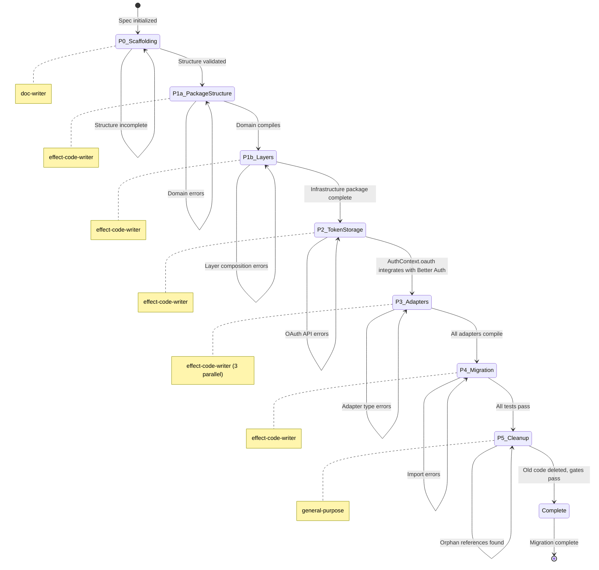

# Master Orchestration: Integration Architecture Migration

> Complete workflow for migrating third-party integrations from `packages/shared/integrations` to three-tier architecture: shared infrastructure, IAM-owned token storage, and slice-specific adapters.

---

## Overview

This specification orchestrates the migration of Google Workspace integrations from a monolithic shared package to a layered architecture that separates concerns:

1. **Infrastructure Layer**: `packages/integrations/google-workspace/*` - Reusable Google API clients and auth primitives
2. **Auth Context Layer**: `@beep/shared-domain/Policy` - OAuth API methods via `AuthContext.oauth` (leverages Better Auth's built-in token management)
3. **Adapter Layer**: `packages/{calendar,comms,knowledge}/server/adapters/*` - Slice-specific integration adapters

### Workflow Diagram

```mermaid
flowchart TD
    subgraph Phase1a["Phase 1a: Package Structure + Domain"]
        P1A1[Create Directory Structure] --> P1A2[Domain: Error Types]
        P1A2 --> P1A3[Domain: Scope Constants]
        P1A3 --> P1A4[Domain: Token Models]
    end

    subgraph Phase1b["Phase 1b: Client + Server Layers"]
        P1B1[Client: GoogleAuthClient Tag] --> P1B2[Client: GoogleApiClient Tag]
        P1B2 --> P1B3[Server: GoogleAuthService]
        P1B3 --> P1B4[Server: Layer Composition]
        P1B4 --> P1B5[tsconfig References]
        P1B5 --> P1B6[Verification]
    end

    subgraph Phase2["Phase 2: AuthContext OAuth API"]
        P2A[Extend AuthContext with OAuth API] --> P2B[getAccessToken via Better Auth]
        P2B --> P2C[getProviderAccount for scope validation]
        P2C --> P2D[Scope Expansion Support]
    end

    subgraph Phase3["Phase 3: Slice Adapters"]
        P3A[GoogleCalendarAdapter]
        P3B[GmailAdapter]
        P3C[GmailExtractionAdapter]
    end

    subgraph Phase4["Phase 4: Migration"]
        P4A[Move Reusable Code] --> P4B[Update Imports]
        P4B --> P4C[Wire Layers]
    end

    subgraph Phase5["Phase 5: Cleanup"]
        P5A[Delete Old Package] --> P5B[Update tsconfig]
        P5B --> P5C[Final Verification]
    end

    Phase1a --> Phase1b
    Phase1b --> Phase2
    Phase2 --> Phase3
    Phase3 --> Phase4
    Phase4 --> Phase5

    subgraph Dependencies["Existing Services"]
        D1[@beep/shared-domain EntityIds]
        D2[Better Auth Account Model]
        D3[Effect Platform HttpClient]
    end

    Phase1a -.->|uses| D1
    Phase1b -.->|uses| D3
    Phase2 -.->|uses| D1
    Phase2 -.->|uses| D2
```

## Phase-Agent-Output Matrix

| Phase | Agent | Primary Output | Key Files |
|-------|-------|----------------|-----------|
| P0 | doc-writer | Spec scaffolding | README.md, MASTER_ORCHESTRATION.md |
| P1a | effect-code-writer | Domain package | packages/integrations/google-workspace/domain/src/* |
| P1b | effect-code-writer | Client/Server packages | packages/integrations/google-workspace/{client,server}/src/* |
| P2 | effect-code-writer | AuthContext OAuth API | packages/shared/domain/src/Policy.ts, packages/runtime/server/src/AuthContext.layer.ts |
| P3 | effect-code-writer ×3 | Slice adapters | packages/{calendar,comms,knowledge}/server/src/adapters/* |
| P4 | effect-code-writer | Migrated code | Updated imports, layer composition |
| P5 | general-purpose | Cleanup | Deleted packages/shared/integrations |
| P6 | package-error-fixer | Verification | Test results, documentation |

### State Machine



---

## Architecture Overview

### Current State

```
packages/shared/integrations/
└── src/
    └── google/
        ├── gmail/
        │   ├── client.ts         # Gmail API client
        │   └── types.ts          # Gmail-specific types
        └── auth.ts               # Google OAuth logic
```

**Problems**:
- Token storage mixed with API logic
- No clear ownership of credentials
- Difficult to extend for slice-specific needs
- Violates slice boundary rules (shared accessing IAM concerns)

### Target State

```
packages/integrations/google-workspace/
├── domain/
│   └── src/
│       ├── errors.ts            # GoogleApiError, TokenError
│       └── scopes.ts            # Scope constants
├── client/
│   └── src/
│       ├── GoogleAuthClient.ts  # Context.Tag interface
│       ├── GoogleHttpClient.ts  # Retry/backoff HTTP client
│       └── contracts.ts         # OAuth response schemas
└── server/
    └── src/
        ├── GoogleAuthService.ts # Service implementation
        └── index.ts             # Layer exports

packages/shared/domain/
└── src/
    └── Policy.ts                # AuthContext extended with OAuth API

packages/runtime/server/
└── src/
    └── AuthContext.layer.ts     # OAuth API implementation via Better Auth

packages/calendar/server/
└── src/adapters/
    └── GoogleCalendarAdapter.ts # Calendar-specific ACL translation

packages/comms/server/
└── src/adapters/
    └── GmailAdapter.ts          # Gmail-specific ACL translation

packages/knowledge/server/
└── src/adapters/
    └── GmailExtractionAdapter.ts # Gmail extraction specifics
```

**Benefits**:
- Clear separation: infra vs. auth context vs. slice logic
- Better Auth owns token storage (leverages existing encrypted account table)
- AuthContext provides OAuth API without cross-slice dependencies
- Each slice declares required scopes
- Reusable infrastructure across integrations
- Testable layers with clear boundaries

---

## Phase 0: Scaffolding

**Duration**: 1 session (COMPLETE)
**Status**: ✅ Complete
**Agents**: `doc-writer`

### Completed Items

- [x] Created spec folder structure
- [x] README.md with purpose and scope
- [x] REFLECTION_LOG.md template
- [x] MASTER_ORCHESTRATION.md (this file)
- [x] AGENT_PROMPTS.md for sub-agents
- [x] QUICK_START.md for onboarding
- [x] RUBRICS.md for quality gates

### Outputs

- `specs/integration-architecture-migration/README.md`
- `specs/integration-architecture-migration/REFLECTION_LOG.md`
- `specs/integration-architecture-migration/MASTER_ORCHESTRATION.md`
- `specs/integration-architecture-migration/AGENT_PROMPTS.md`
- `specs/integration-architecture-migration/QUICK_START.md`
- `specs/integration-architecture-migration/RUBRICS.md`
- `specs/integration-architecture-migration/handoffs/` (directory)
- `specs/integration-architecture-migration/outputs/` (directory)
- `specs/integration-architecture-migration/templates/` (directory)

---

## Phase 1a: Package Structure + Domain Layer

**Duration**: 1 session
**Status**: ✅ Complete
**Agents**: `effect-code-writer`

### Objectives

Create the foundational package structure and domain layer for `packages/integrations/google-workspace`:
1. Initialize package directories and configuration
2. Implement domain layer: Error types and scope constants
3. Implement token models

### Tasks

#### Task 1a.1: Create Package Structure

**Agent**: `effect-code-writer`

Create the package directories:

```bash
mkdir -p packages/integrations/google-workspace/{domain,client,server}/{src,test}
```

**Files to Create**:
- `packages/integrations/google-workspace/package.json`
- `packages/integrations/google-workspace/tsconfig.json`
- `packages/integrations/google-workspace/domain/package.json`

**package.json Template**:
```json
{
  "name": "@beep/integrations-google-workspace",
  "version": "0.1.0",
  "private": true,
  "type": "module",
  "exports": {
    "./domain": "./domain/src/index.ts",
    "./client": "./client/src/index.ts",
    "./server": "./server/src/index.ts"
  },
  "dependencies": {
    "@beep/shared-domain": "workspace:*",
    "@effect/platform": "^0.68.0",
    "effect": "^3.10.0"
  }
}
```

#### Task 1a.2: Domain Layer - Error Types

**Agent**: `effect-code-writer`

Create tagged error types following Effect patterns:

```typescript
// packages/integrations/google-workspace/domain/src/errors.ts
import * as S from "effect/Schema";

export class GoogleApiError extends S.TaggedError<GoogleApiError>()(
  "GoogleApiError",
  {
    message: S.String,
    statusCode: S.Number,
    method: S.String,
    endpoint: S.String,
  }
) {}

export class RateLimitError extends S.TaggedError<RateLimitError>()(
  "RateLimitError",
  {
    message: S.String,
    retryAfterMs: S.Number,
    quotaLimit: S.String,
  }
) {}

export class TokenError extends S.TaggedError<TokenError>()(
  "TokenError",
  {
    message: S.String,
    reason: S.Literal("expired", "invalid", "missing", "insufficient_scope"),
  }
) {}

export class ScopeExpansionRequiredError extends S.TaggedError<ScopeExpansionRequiredError>()(
  "ScopeExpansionRequiredError",
  {
    message: S.String,
    currentScopes: S.Array(S.String),
    requiredScopes: S.Array(S.String),
    missingScopes: S.Array(S.String),
  }
) {}
```

**Pattern**: Use `S.TaggedError` for type-safe error handling with Effect's `catchTag`.

#### Task 1a.3: Domain Layer - Scope Constants

**Agent**: `effect-code-writer`

```typescript
// packages/integrations/google-workspace/domain/src/scopes.ts

export const GoogleScopes = {
  Gmail: {
    ReadOnly: "https://www.googleapis.com/auth/gmail.readonly" as const,
    Modify: "https://www.googleapis.com/auth/gmail.modify" as const,
    Send: "https://www.googleapis.com/auth/gmail.send" as const,
    Compose: "https://www.googleapis.com/auth/gmail.compose" as const,
  },
  Calendar: {
    ReadOnly: "https://www.googleapis.com/auth/calendar.readonly" as const,
    Events: "https://www.googleapis.com/auth/calendar.events" as const,
    Full: "https://www.googleapis.com/auth/calendar" as const,
  },
  Drive: {
    ReadOnly: "https://www.googleapis.com/auth/drive.readonly" as const,
    File: "https://www.googleapis.com/auth/drive.file" as const,
    Full: "https://www.googleapis.com/auth/drive" as const,
  },
} as const;

export type GoogleScope =
  | typeof GoogleScopes.Gmail[keyof typeof GoogleScopes.Gmail]
  | typeof GoogleScopes.Calendar[keyof typeof GoogleScopes.Calendar]
  | typeof GoogleScopes.Drive[keyof typeof GoogleScopes.Drive];
```

**Pattern**: Use `as const` for compile-time scope validation.

#### Task 1a.4: Domain Layer - Token Models

**Agent**: `effect-code-writer`

```typescript
// packages/integrations/google-workspace/domain/src/models.ts
import * as S from "effect/Schema";

export class AccessToken extends S.Class<AccessToken>("AccessToken")({
  token: S.String,
  expiresAt: S.Date,
  scopes: S.Array(S.String),
}) {}
```

**Pattern**: Use `S.Class` for structured domain models.

### Success Criteria

- [ ] Package structure created (`domain`, `client`, `server` directories)
- [ ] Domain layer exports error types
- [ ] Domain layer exports scope constants
- [ ] Domain layer exports token models
- [ ] `bun run check --filter @beep/integrations-google-workspace` passes
- [ ] REFLECTION_LOG.md updated
- [ ] HANDOFF_P1b.md created
- [ ] P1b_ORCHESTRATOR_PROMPT.md created

### Checkpoint

Before proceeding to Phase 1b:
- [ ] All error types compile and export correctly
- [ ] Scope constants are well-typed
- [ ] Token models compile
- [ ] No compilation errors in domain package

### Handoff

Create `handoffs/HANDOFF_P1b.md` with:
- Package structure decisions
- Error type patterns used
- Scope constant structure
- Token model design
- Phase 1b requirements (client/server layers)

---

## Phase 1b: Client + Server Layers

**Duration**: 1-2 sessions
**Status**: ✅ Complete
**Agents**: `effect-code-writer`, `codebase-researcher`

### Objectives

Complete the infrastructure package by implementing:
1. Client layer: Service interfaces (Context.Tags) for dependency injection
2. Client layer: GoogleApiClient with retry logic
3. Server layer: Service implementations
4. Server layer: Layer composition

### Tasks

#### Task 1b.1: Client Layer - GoogleAuthClient Interface

**Agent**: `effect-code-writer`

**Files to Create**:
- `packages/integrations/google-workspace/client/package.json`

```typescript
// packages/integrations/google-workspace/client/src/GoogleAuthClient.ts
import * as Context from "effect/Context";
import * as Effect from "effect/Effect";
import type { TokenError, ScopeExpansionRequiredError, AccessToken } from "@beep/integrations-google-workspace/domain";

export class GoogleAuthClient extends Context.Tag("GoogleAuthClient")<
  GoogleAuthClient,
  {
    readonly getValidToken: (
      scopes: ReadonlyArray<string>
    ) => Effect.Effect<AccessToken, TokenError | ScopeExpansionRequiredError>;

    readonly refreshToken: (
      refreshToken: string
    ) => Effect.Effect<AccessToken, TokenError>;
  }
>() {}
```

**Pattern**: Use `Context.Tag` for dependency injection with Effect Layers.

#### Task 1b.2: Client Layer - GoogleApiClient

**Agent**: `effect-code-writer`

```typescript
// packages/integrations/google-workspace/client/src/GoogleApiClient.ts
import * as Context from "effect/Context";
import * as Effect from "effect/Effect";
import * as Layer from "effect/Layer";
import * as Schedule from "effect/Schedule";
import * as Duration from "effect/Duration";
import { HttpClient } from "@effect/platform";
import { GoogleApiError, RateLimitError } from "@beep/integrations-google-workspace/domain";

export class GoogleApiClient extends Context.Tag("GoogleApiClient")<
  GoogleApiClient,
  HttpClient.HttpClient.Service
>() {}

export const GoogleApiClientLive = Layer.effect(
  GoogleApiClient,
  HttpClient.HttpClient.pipe(
    Effect.map((client) =>
      client.pipe(
        HttpClient.filterStatusOk,
        HttpClient.retry({
          schedule: Schedule.exponential(Duration.seconds(1)).pipe(
            Schedule.compose(Schedule.recurs(3))
          ),
          while: (error) => error.status === 429 || error.status >= 500,
        }),
        HttpClient.mapError((error) => {
          if (error.status === 429) {
            const retryAfter = error.headers["retry-after"];
            const retryAfterMs = retryAfter
              ? Number.parseInt(retryAfter, 10) * 1000
              : 60000;

            return new RateLimitError({
              message: "Google API rate limit exceeded",
              retryAfterMs,
              quotaLimit: error.headers["x-rate-limit-limit"] ?? "unknown",
            });
          }

          return new GoogleApiError({
            message: error.message,
            statusCode: error.status,
            method: error.method,
            endpoint: error.url,
          });
        })
      )
    )
  )
);
```

**Pattern**: Wrap HttpClient in a Context.Tag for retry/backoff behavior.

#### Task 1b.3: Client Layer - OAuth Contract Schemas

**Agent**: `effect-code-writer`

```typescript
// packages/integrations/google-workspace/client/src/contracts.ts
import * as S from "effect/Schema";
import { BS } from "@beep/schema";

export class OAuthTokenResponse extends S.Class<OAuthTokenResponse>("OAuthTokenResponse")({
  access_token: S.String,
  refresh_token: BS.FieldOptionOmittable(S.String),
  expires_in: S.Number,
  scope: S.String,
  token_type: S.Literal("Bearer"),
}) {}

export class OAuthRefreshResponse extends S.Class<OAuthRefreshResponse>("OAuthRefreshResponse")({
  access_token: S.String,
  expires_in: S.Number,
  scope: S.String,
  token_type: S.Literal("Bearer"),
}) {}

export class OAuthErrorResponse extends S.Class<OAuthErrorResponse>("OAuthErrorResponse")({
  error: S.String,
  error_description: BS.FieldOptionOmittable(S.String),
}) {}
```

**Pattern**: Use `BS.FieldOptionOmittable` for optional fields that should be omitted when undefined.

#### Task 1b.4: Server Layer - GoogleAuthService Implementation

**Files to Create**:
- `packages/integrations/google-workspace/server/package.json`

**Agent**: `effect-code-writer`

```typescript
// packages/integrations/google-workspace/server/src/GoogleAuthService.ts
import * as Effect from "effect/Effect";
import * as Layer from "effect/Layer";
import * as DateTime from "effect/DateTime";
import * as Duration from "effect/Duration";
import * as A from "effect/Array";
import { HttpClient } from "@effect/platform";
import { GoogleAuthClient, OAuthRefreshResponse } from "@beep/integrations-google-workspace/client";
import { TokenError, ScopeExpansionRequiredError } from "@beep/integrations-google-workspace/domain";
import type { IntegrationTokenStore } from "@beep/iam-server"; // Forward reference

export const GoogleAuthServiceLive = Layer.effect(
  GoogleAuthClient,
  Effect.gen(function* () {
    const http = yield* HttpClient.HttpClient;
    const tokenStore = yield* IntegrationTokenStore;
    const clientId = yield* Effect.config("GOOGLE_CLIENT_ID");
    const clientSecret = yield* Effect.config("GOOGLE_CLIENT_SECRET");

    const refreshAccessToken = (refreshToken: string) =>
      Effect.gen(function* () {
        const response = yield* http.post("https://oauth2.googleapis.com/token", {
          body: {
            client_id: clientId,
            client_secret: clientSecret,
            refresh_token: refreshToken,
            grant_type: "refresh_token",
          },
        }).pipe(
          Effect.flatMap((res) => res.json),
          Effect.flatMap(S.decode(OAuthRefreshResponse))
        );

        const expiresAt = yield* DateTime.now.pipe(
          Effect.map((now) => DateTime.add(now, Duration.seconds(response.expires_in)))
        );

        return {
          token: response.access_token,
          expiresAt: DateTime.toDate(expiresAt),
          scopes: response.scope.split(" "),
        };
      }).pipe(
        Effect.catchAll((error) =>
          Effect.fail(
            new TokenError({
              message: `Failed to refresh token: ${error.message}`,
              reason: "invalid",
            })
          )
        )
      );

    const getValidToken = (requiredScopes: ReadonlyArray<string>) =>
      Effect.gen(function* () {
        const stored = yield* tokenStore.getToken("google");

        // Check scope sufficiency
        const hasAllScopes = A.every(requiredScopes, (scope) =>
          A.contains(stored.scopes, scope)
        );

        if (!hasAllScopes) {
          const missingScopes = A.difference(requiredScopes, stored.scopes);
          return yield* Effect.fail(
            new ScopeExpansionRequiredError({
              message: "Token missing required scopes",
              currentScopes: stored.scopes,
              requiredScopes,
              missingScopes,
            })
          );
        }

        // Check expiration
        const now = yield* DateTime.now;
        const expiresAt = DateTime.fromDate(stored.expiresAt);
        const isExpired = DateTime.greaterThan(now, expiresAt);

        if (isExpired) {
          const refreshed = yield* refreshAccessToken(stored.refreshToken);
          yield* tokenStore.updateToken("google", {
            accessToken: refreshed.token,
            expiresAt: refreshed.expiresAt,
          });
          return refreshed;
        }

        return {
          token: stored.accessToken,
          expiresAt: stored.expiresAt,
          scopes: stored.scopes,
        };
      });

    return GoogleAuthClient.of({
      getValidToken,
      refreshToken: refreshAccessToken,
    });
  })
);
```

**Pattern**: Use `Effect.config` for environment variables, `DateTime` for time operations.

#### Task 1b.5: Server Layer - Layer Exports

**Agent**: `effect-code-writer`

```typescript
// packages/integrations/google-workspace/server/src/index.ts
export { GoogleAuthServiceLive } from "./GoogleAuthService.js";

// Re-export client types for convenience
export type { AccessToken } from "@beep/integrations-google-workspace/domain";
export { GoogleAuthClient } from "@beep/integrations-google-workspace/client";
```

#### Task 1b.6: Update tsconfig References

**Agent**: `effect-code-writer`

Update `tsconfig.base.jsonc` to include path aliases:

```jsonc
{
  "compilerOptions": {
    "paths": {
      "@beep/integrations-google-workspace/domain": ["packages/integrations/google-workspace/domain/src/index.ts"],
      "@beep/integrations-google-workspace/client": ["packages/integrations/google-workspace/client/src/index.ts"],
      "@beep/integrations-google-workspace/server": ["packages/integrations/google-workspace/server/src/index.ts"]
    }
  }
}
```

### Success Criteria

- [ ] Client layer package created
- [ ] Server layer package created
- [ ] GoogleAuthClient interface defined
- [ ] GoogleApiClient with retry logic implemented
- [ ] GoogleAuthService implementation complete
- [ ] OAuth contract schemas defined
- [ ] tsconfig references updated
- [ ] `bun run check --filter @beep/integrations-google-workspace` passes
- [ ] REFLECTION_LOG.md updated
- [ ] HANDOFF_P2.md created
- [ ] P2_ORCHESTRATOR_PROMPT.md created

### Checkpoint

Before proceeding to Phase 2:
- [ ] All error types compile and export correctly
- [ ] GoogleAuthClient interface is well-typed
- [ ] GoogleApiClient exports correctly
- [ ] Layer composition compiles (even with forward IntegrationTokenStore reference)
- [ ] No circular dependencies
- [ ] tsconfig paths resolve correctly

### Handoff

Create `handoffs/HANDOFF_P2.md` with:
- Client layer design patterns
- GoogleApiClient retry strategy
- OAuth contract schema structure
- Forward reference handling for IntegrationTokenStore
- Phase 2 task refinements

---

## Phase 2: Extend AuthContext with OAuth API

**Duration**: 2 sessions
**Status**: ✅ Complete
**Agents**: `effect-code-writer`, `codebase-researcher`

### Objectives

Extend the `AuthContext` Tag in `@beep/shared-domain/Policy` with OAuth API methods that:
1. Leverage Better Auth's built-in encrypted token storage in the account table
2. Provide Effect-wrapped access to OAuth tokens without cross-slice dependencies
3. Support scope validation for incremental OAuth flows

### Architectural Decision: AuthContext OAuth API vs IntegrationTokenStore

The original spec planned to create a separate `IntegrationTokenStore` service in `@beep/iam-server`. During implementation, we pivoted to extending `AuthContext` instead because:

1. **Better Auth Already Handles Token Storage**: Better Auth stores OAuth tokens in the `account` table with built-in encryption and automatic refresh
2. **Avoids Cross-Slice Dependencies**: Integration packages shouldn't import from `@beep/iam-server` - that violates slice scoping
3. **Simpler Architecture**: No need for a separate token storage layer when Better Auth provides it
4. **AuthContext is Already Available**: Any code with user context already has AuthContext

### Tasks

#### Task 2.1: Define OAuth API Types

**Agent**: `effect-code-writer`

Add typed Error schemas and OAuth API types to Policy.ts:

```typescript
// packages/shared/domain/src/Policy.ts
import * as Schema from "effect/Schema";
import * as O from "effect/Option";

export class OAuthTokenError extends Schema.TaggedError<OAuthTokenError>()("OAuthTokenError", {
  message: Schema.String,
  providerId: Schema.String,
}) {}

export class OAuthAccountsError extends Schema.TaggedError<OAuthAccountsError>()("OAuthAccountsError", {
  message: Schema.String,
}) {}

export type OAuthTokenResult = {
  readonly accessToken: string;
};

export type OAuthAccount = {
  readonly id: string;
  readonly providerId: string;
  readonly accountId: string;
  readonly userId: string;
  readonly scope: O.Option<string>;
  readonly accessTokenExpiresAt: O.Option<Date>;
  readonly refreshToken: O.Option<string>;
};

export type OAuthApi = {
  readonly getAccessToken: (params: {
    providerId: string;
    userId: string;
  }) => Effect.Effect<O.Option<OAuthTokenResult>, OAuthTokenError>;

  readonly getProviderAccount: (params: {
    providerId: string;
    userId: string;
  }) => Effect.Effect<O.Option<OAuthAccount>, OAuthAccountsError>;
};

export type AuthContextShape = {
  readonly user: typeof User.Model.Type;
  readonly session: typeof Session.Model.Type;
  readonly organization: typeof Organization.Model.Type;
  readonly oauth: OAuthApi;
};

export class AuthContext extends Context.Tag("AuthContext")<AuthContext, AuthContextShape>() {}
```

#### Task 2.2: Implement OAuth API in AuthContext.layer.ts

**Agent**: `effect-code-writer`

Implement the OAuth API methods using Better Auth's APIs:

```typescript
// packages/runtime/server/src/AuthContext.layer.ts
// Inside the Layer implementation:

const oauth: OAuthApi = {
  getAccessToken: ({ providerId, userId }) =>
    Effect.tryPromise({
      try: async () => {
        const result = await betterAuth.api.getAccessToken({
          body: { providerId, userId },
        });
        if (!result) return O.none();
        return O.some({ accessToken: result.accessToken });
      },
      catch: (error) =>
        new OAuthTokenError({
          message: error instanceof Error ? error.message : "Failed to get access token",
          providerId,
        }),
    }),

  getProviderAccount: ({ providerId, userId }) =>
    Effect.tryPromise({
      try: async () => {
        // Query account table directly for provider account
        const account = await db.query.accountTable.findFirst({
          where: (t, { and, eq }) =>
            and(eq(t.userId, userId), eq(t.providerId, providerId)),
        });
        if (!account) return O.none();
        return O.some({
          id: account.id,
          providerId: account.providerId,
          accountId: account.accountId,
          userId: account.userId,
          scope: O.fromNullable(account.scope),
          accessTokenExpiresAt: O.fromNullable(account.accessTokenExpiresAt),
          refreshToken: O.fromNullable(account.refreshToken),
        });
      },
      catch: (error) =>
        new OAuthAccountsError({
          message: error instanceof Error ? error.message : "Failed to get provider account",
        }),
    }),
};
```

#### Task 2.3: Update GoogleAuthClientLive to Use AuthContext.oauth

**Agent**: `effect-code-writer`

Refactor GoogleAuthClientLive to depend only on AuthContext:

```typescript
// packages/integrations/google-workspace/server/src/layers/GoogleAuthClientLive.ts
export type GoogleAuthClientDeps = AuthContext;

export const GoogleAuthClientLive: Layer.Layer<GoogleAuthClient, never, GoogleAuthClientDeps> = Layer.effect(
  GoogleAuthClient,
  Effect.gen(function* () {
    // Capture AuthContext at layer construction time
    const { user, oauth } = yield* AuthContext;

    return GoogleAuthClient.of({
      getValidToken: Effect.fn(function* (requiredScopes) {
        // Use Better Auth's getAccessToken (handles refresh automatically)
        const tokenResult = yield* oauth.getAccessToken({
          providerId: "google",
          userId: user.id,
        }).pipe(Effect.mapError((e) => new GoogleAuthenticationError({...})));

        // Get account for scope validation
        const accountResult = yield* oauth.getProviderAccount({
          providerId: "google",
          userId: user.id,
        });

        // Validate scopes for incremental OAuth
        // ...
      }, Effect.withSpan("GoogleAuthClient.getValidToken")),
    });
  })
);
```

### Success Criteria

- [x] OAuthApi types defined in `@beep/shared-domain/Policy`
- [x] OAuth API implemented in `packages/runtime/server/src/AuthContext.layer.ts`
- [x] GoogleAuthClientLive refactored to use AuthContext.oauth
- [x] No cross-slice dependencies from integration packages to IAM server
- [x] `bun run check --filter @beep/google-workspace-server` passes
- [x] REFLECTION_LOG.md updated
- [x] HANDOFF_P3.md created

### Checkpoint

Before proceeding to Phase 3:
- [x] AuthContext.oauth methods work correctly
- [x] Better Auth token refresh is leveraged automatically
- [x] Scope validation works for incremental OAuth
- [x] Integration packages have clean dependency graph

### Handoff

Create `handoffs/HANDOFF_P3.md` with:
- AuthContext OAuth API design decisions
- Scope validation approach
- Phase 3 adapter requirements

---

## Phase 3: Create Slice-Specific Adapters

**Duration**: 2-3 sessions
**Status**: Pending
**Agents**: `effect-code-writer` (3 parallel tasks), `codebase-researcher`

### Objectives

Create adapters in each slice that:
1. Declare required OAuth scopes for their functionality
2. Implement ACL (Access Control Layer) translation between domain models and Google API formats
3. Use GoogleAuthClient from infrastructure package
4. Coordinate with IntegrationTokenStore for token management

### Tasks (Parallel Execution)

#### Task 3.1: GoogleCalendarAdapter

**Agent**: `effect-code-writer`

```typescript
// packages/calendar/server/src/adapters/GoogleCalendarAdapter.ts
import * as Context from "effect/Context";
import * as Effect from "effect/Effect";
import * as DateTime from "effect/DateTime";
import { HttpClient } from "@effect/platform";
import { GoogleAuthClient } from "@beep/integrations-google-workspace/client";
import { GoogleScopes } from "@beep/integrations-google-workspace/domain";
import type { CalendarEvent } from "@beep/calendar-domain";

export const REQUIRED_SCOPES = [
  GoogleScopes.Calendar.Events,
] as const;

export interface GoogleCalendarEvent {
  readonly id: string;
  readonly summary: string;
  readonly description?: string;
  readonly start: { dateTime: string; timeZone: string };
  readonly end: { dateTime: string; timeZone: string };
  readonly attendees?: ReadonlyArray<{ email: string }>;
}

export class GoogleCalendarAdapter extends Context.Tag("GoogleCalendarAdapter")<
  GoogleCalendarAdapter,
  {
    readonly listEvents: (
      calendarId: string,
      timeMin: Date,
      timeMax: Date
    ) => Effect.Effect<ReadonlyArray<CalendarEvent>>;

    readonly createEvent: (
      calendarId: string,
      event: CalendarEvent
    ) => Effect.Effect<CalendarEvent>;

    readonly updateEvent: (
      calendarId: string,
      eventId: string,
      updates: Partial<CalendarEvent>
    ) => Effect.Effect<CalendarEvent>;

    readonly deleteEvent: (
      calendarId: string,
      eventId: string
    ) => Effect.Effect<void>;
  }
>() {}

export const GoogleCalendarAdapterLive = Layer.effect(
  GoogleCalendarAdapter,
  Effect.gen(function* () {
    const http = yield* HttpClient.HttpClient;
    const auth = yield* GoogleAuthClient;

    const translateToGoogleFormat = (event: CalendarEvent): GoogleCalendarEvent => ({
      id: event.id,
      summary: event.title,
      description: event.description ?? undefined,
      start: {
        dateTime: DateTime.formatIso(event.startTime),
        timeZone: event.timeZone,
      },
      end: {
        dateTime: DateTime.formatIso(event.endTime),
        timeZone: event.timeZone,
      },
      attendees: event.attendees?.map((email) => ({ email })),
    });

    const translateFromGoogleFormat = (googleEvent: GoogleCalendarEvent): CalendarEvent => ({
      id: googleEvent.id,
      title: googleEvent.summary,
      description: googleEvent.description,
      startTime: DateTime.unsafeFromString(googleEvent.start.dateTime),
      endTime: DateTime.unsafeFromString(googleEvent.end.dateTime),
      timeZone: googleEvent.start.timeZone,
      attendees: googleEvent.attendees?.map((a) => a.email),
    });

    const listEvents = (calendarId: string, timeMin: Date, timeMax: Date) =>
      Effect.gen(function* () {
        const token = yield* auth.getValidToken(REQUIRED_SCOPES);

        const response = yield* http.get(
          `https://www.googleapis.com/calendar/v3/calendars/${calendarId}/events`,
          {
            headers: {
              Authorization: `Bearer ${token.token}`,
            },
            query: {
              timeMin: DateTime.formatIso(DateTime.fromDate(timeMin)),
              timeMax: DateTime.formatIso(DateTime.fromDate(timeMax)),
              singleEvents: "true",
              orderBy: "startTime",
            },
          }
        ).pipe(
          Effect.flatMap((res) => res.json)
        );

        return A.map(response.items, translateFromGoogleFormat);
      });

    const createEvent = (calendarId: string, event: CalendarEvent) =>
      Effect.gen(function* () {
        const token = yield* auth.getValidToken(REQUIRED_SCOPES);
        const googleEvent = translateToGoogleFormat(event);

        const response = yield* http.post(
          `https://www.googleapis.com/calendar/v3/calendars/${calendarId}/events`,
          {
            headers: {
              Authorization: `Bearer ${token.token}`,
            },
            body: googleEvent,
          }
        ).pipe(
          Effect.flatMap((res) => res.json)
        );

        return translateFromGoogleFormat(response);
      });

    // ... updateEvent, deleteEvent implementations

    return GoogleCalendarAdapter.of({
      listEvents,
      createEvent,
      updateEvent: (calendarId, eventId, updates) => {
        // Implementation
      },
      deleteEvent: (calendarId, eventId) => {
        // Implementation
      },
    });
  })
);
```

**Pattern**: ACL translation functions separate from API calls, declare scopes as constants.

#### Task 3.2: GmailAdapter (Comms)

**Agent**: `effect-code-writer`

```typescript
// packages/comms/server/src/adapters/GmailAdapter.ts
import * as Context from "effect/Context";
import * as Effect from "effect/Effect";
import * as A from "effect/Array";
import { HttpClient } from "@effect/platform";
import { GoogleAuthClient } from "@beep/integrations-google-workspace/client";
import { GoogleScopes } from "@beep/integrations-google-workspace/domain";
import type { Email, EmailThread } from "@beep/comms-domain";

export const REQUIRED_SCOPES = [
  GoogleScopes.Gmail.ReadOnly,
  GoogleScopes.Gmail.Send,
] as const;

export interface GmailMessage {
  readonly id: string;
  readonly threadId: string;
  readonly labelIds: ReadonlyArray<string>;
  readonly snippet: string;
  readonly payload: {
    readonly headers: ReadonlyArray<{ name: string; value: string }>;
    readonly body: { data?: string };
  };
}

export class GmailAdapter extends Context.Tag("GmailAdapter")<
  GmailAdapter,
  {
    readonly listMessages: (
      query: string,
      maxResults: number
    ) => Effect.Effect<ReadonlyArray<Email>>;

    readonly sendMessage: (
      to: ReadonlyArray<string>,
      subject: string,
      body: string
    ) => Effect.Effect<Email>;

    readonly getThread: (
      threadId: string
    ) => Effect.Effect<EmailThread>;
  }
>() {}

export const GmailAdapterLive = Layer.effect(
  GmailAdapter,
  Effect.gen(function* () {
    const http = yield* HttpClient.HttpClient;
    const auth = yield* GoogleAuthClient;

    const translateFromGmailFormat = (message: GmailMessage): Email => {
      const headers = message.payload.headers;
      const from = A.findFirst(headers, (h) => h.name === "From")?.value ?? "";
      const to = A.findFirst(headers, (h) => h.name === "To")?.value ?? "";
      const subject = A.findFirst(headers, (h) => h.name === "Subject")?.value ?? "";
      const date = A.findFirst(headers, (h) => h.name === "Date")?.value ?? "";

      return {
        id: message.id,
        threadId: message.threadId,
        from,
        to: to.split(",").map((s) => s.trim()),
        subject,
        snippet: message.snippet,
        receivedAt: new Date(date),
      };
    };

    const listMessages = (query: string, maxResults: number) =>
      Effect.gen(function* () {
        const token = yield* auth.getValidToken(REQUIRED_SCOPES);

        const response = yield* http.get(
          "https://gmail.googleapis.com/gmail/v1/users/me/messages",
          {
            headers: {
              Authorization: `Bearer ${token.token}`,
            },
            query: {
              q: query,
              maxResults: maxResults.toString(),
            },
          }
        ).pipe(
          Effect.flatMap((res) => res.json)
        );

        // Fetch full messages in parallel
        const messages = yield* Effect.all(
          A.map(response.messages, (m) =>
            http.get(
              `https://gmail.googleapis.com/gmail/v1/users/me/messages/${m.id}`,
              {
                headers: {
                  Authorization: `Bearer ${token.token}`,
                },
              }
            ).pipe(
              Effect.flatMap((res) => res.json),
              Effect.map(translateFromGmailFormat)
            )
          ),
          { concurrency: 5 }
        );

        return messages;
      });

    // ... sendMessage, getThread implementations

    return GmailAdapter.of({
      listMessages,
      sendMessage: (to, subject, body) => {
        // Implementation
      },
      getThread: (threadId) => {
        // Implementation
      },
    });
  })
);
```

#### Task 3.3: GmailExtractionAdapter (Knowledge)

**Agent**: `effect-code-writer`

```typescript
// packages/knowledge/server/src/adapters/GmailExtractionAdapter.ts
import * as Context from "effect/Context";
import * as Effect from "effect/Effect";
import { HttpClient } from "@effect/platform";
import { GoogleAuthClient } from "@beep/integrations-google-workspace/client";
import { GoogleScopes } from "@beep/integrations-google-workspace/domain";
import type { DocumentContent } from "@beep/documents-domain";

export const REQUIRED_SCOPES = [
  GoogleScopes.Gmail.ReadOnly,
] as const;

export class GmailExtractionAdapter extends Context.Tag("GmailExtractionAdapter")<
  GmailExtractionAdapter,
  {
    readonly extractEmailsForKnowledgeGraph: (
      query: string,
      maxResults: number
    ) => Effect.Effect<ReadonlyArray<DocumentContent>>;

    readonly extractThreadContext: (
      threadId: string
    ) => Effect.Effect<DocumentContent>;
  }
>() {}

export const GmailExtractionAdapterLive = Layer.effect(
  GmailExtractionAdapter,
  Effect.gen(function* () {
    const http = yield* HttpClient.HttpClient;
    const auth = yield* GoogleAuthClient;

    const extractEmailsForKnowledgeGraph = (query: string, maxResults: number) =>
      Effect.gen(function* () {
        const token = yield* auth.getValidToken(REQUIRED_SCOPES);

        // Similar to GmailAdapter but returns DocumentContent for extraction pipeline
        // ... implementation
      });

    const extractThreadContext = (threadId: string) =>
      Effect.gen(function* () {
        const token = yield* auth.getValidToken(REQUIRED_SCOPES);

        // Fetch entire thread and assemble into single DocumentContent
        // ... implementation
      });

    return GmailExtractionAdapter.of({
      extractEmailsForKnowledgeGraph,
      extractThreadContext,
    });
  })
);
```

### Success Criteria

- [ ] GoogleCalendarAdapter compiles and exports Layer
- [ ] GmailAdapter compiles and exports Layer
- [ ] GmailExtractionAdapter compiles and exports Layer
- [ ] All adapters declare REQUIRED_SCOPES constants
- [ ] ACL translation functions implemented for each adapter
- [ ] `bun run check --filter @beep/calendar-server` passes
- [ ] `bun run check --filter @beep/comms-server` passes
- [ ] `bun run check --filter @beep/knowledge-server` passes
- [ ] REFLECTION_LOG.md updated
- [ ] HANDOFF_P4.md created
- [ ] P4_ORCHESTRATOR_PROMPT.md created

### Checkpoint

Before proceeding to Phase 4:
- [ ] All three adapters compile without errors
- [ ] Scope declarations are correct
- [ ] ACL translation preserves data integrity
- [ ] Services integrate with GoogleAuthClient

### Handoff

Create `handoffs/HANDOFF_P4.md` with:
- ACL translation patterns used
- Scope declaration conventions
- Adapter integration approach
- Migration strategy for existing code

---

## Phase 4: Migrate Existing Code

**Duration**: 2 sessions
**Status**: Pending
**Agents**: `effect-code-writer`, `codebase-researcher`

### Objectives

1. Move reusable code from `packages/shared/integrations/src/google/` to new structure
2. Update all imports across the codebase
3. Wire up new Layers in runtime composition
4. Verify existing functionality preserved

### Tasks

#### Task 4.1: Audit Existing Gmail Code

**Agent**: `codebase-researcher`

Research what exists in current integration package:
- Identify all exports from `packages/shared/integrations/src/google/gmail/`
- Find all consumers of these exports
- Categorize code into: infrastructure, slice-specific, obsolete

**Output**: `outputs/P4-existing-code-audit.md`

#### Task 4.2: Move Reusable Infrastructure Code

**Agent**: `effect-code-writer`

For any code in `packages/shared/integrations` that belongs in infrastructure:
1. Move to `packages/integrations/google-workspace/`
2. Update imports to use new package paths
3. Ensure no slice-specific logic remains

**Example**:
```typescript
// Old: packages/shared/integrations/src/google/gmail/client.ts
// New: packages/integrations/google-workspace/client/src/GmailClient.ts
```

#### Task 4.3: Update Import Paths

**Agent**: `effect-code-writer`

Search and replace old imports:

```bash
# Find all imports from old package
grep -r "from \"@beep/shared-integrations" packages/

# Update each import
# Old: import { GmailClient } from "@beep/shared-integrations/google/gmail"
# New: import { GmailAdapter } from "@beep/comms-server/adapters"
```

#### Task 4.4: Wire Up Layers in Runtime

**Agent**: `effect-code-writer`

Update runtime Layer composition to include new services:

```typescript
// packages/runtime/server/src/layers/MainLive.ts
import { GoogleAuthServiceLive } from "@beep/integrations-google-workspace/server";
import { IntegrationTokenStoreLive } from "@beep/iam-server";
import { GoogleCalendarAdapterLive } from "@beep/calendar-server/adapters";
import { GmailAdapterLive } from "@beep/comms-server/adapters";
import { GmailExtractionAdapterLive } from "@beep/knowledge-server/adapters";

export const MainLive = Layer.mergeAll(
  // ... existing layers
  IntegrationTokenStoreLive,
  GoogleAuthServiceLive,
  GoogleCalendarAdapterLive,
  GmailAdapterLive,
  GmailExtractionAdapterLive,
);
```

#### Task 4.5: Run Integration Tests

**Agent**: `test-writer`

Create or update integration tests:

```typescript
// packages/calendar/server/test/adapters/GoogleCalendarAdapter.test.ts
import { layer } from "@beep/testkit";
import * as Effect from "effect/Effect";
import { GoogleCalendarAdapter, GoogleCalendarAdapterLive } from "../../src/adapters/GoogleCalendarAdapter.js";

layer(GoogleCalendarAdapterLive)("GoogleCalendarAdapter", (it) => {
  it.effect("lists events successfully", () =>
    Effect.gen(function* () {
      const adapter = yield* GoogleCalendarAdapter;
      const events = yield* adapter.listEvents(
        "primary",
        new Date("2026-01-01"),
        new Date("2026-01-31")
      );

      // Assertions
    })
  );
});
```

### Success Criteria

- [ ] All reusable code moved to infrastructure package
- [ ] All imports updated to new paths
- [ ] Runtime Layer composition includes new services
- [ ] Integration tests pass
- [ ] `bun run check` passes (full monorepo)
- [ ] `bun run test --filter @beep/calendar-server` passes
- [ ] `bun run test --filter @beep/comms-server` passes
- [ ] `bun run test --filter @beep/knowledge-server` passes
- [ ] REFLECTION_LOG.md updated
- [ ] HANDOFF_P5.md created
- [ ] P5_ORCHESTRATOR_PROMPT.md created

### Checkpoint

Before proceeding to Phase 5:
- [ ] No orphan references to old package
- [ ] All tests pass
- [ ] Runtime starts without Layer composition errors
- [ ] Existing functionality verified via manual testing

### Handoff

Create `handoffs/HANDOFF_P5.md` with:
- Import migration patterns
- Layer composition approach
- Test coverage summary
- Cleanup checklist for Phase 5

---

## Phase 5: Delete Old Code & Cleanup

**Duration**: 1 session
**Status**: Pending
**Agents**: `general-purpose`, `package-error-fixer`

### Objectives

1. Delete `packages/shared/integrations/` directory
2. Remove from tsconfig references
3. Update any remaining imports
4. Clean up package.json dependencies
5. Final verification

### Tasks

#### Task 5.1: Delete Old Package Directory

**Agent**: `general-purpose`

```bash
# Remove old package
rm -rf packages/shared/integrations/

# Verify no orphan references
grep -r "@beep/shared-integrations" packages/ || echo "Clean!"
```

#### Task 5.2: Update TypeScript Configuration

**Agent**: `general-purpose`

Remove from `tsconfig.base.jsonc`:

```jsonc
{
  "compilerOptions": {
    "paths": {
      // Remove this line:
      "@beep/shared-integrations/*": ["packages/shared/integrations/src/*"],

      // Add new paths if not already present:
      "@beep/integrations-google-workspace/domain": ["packages/integrations/google-workspace/domain/src/index.ts"],
      "@beep/integrations-google-workspace/client": ["packages/integrations/google-workspace/client/src/index.ts"],
      "@beep/integrations-google-workspace/server": ["packages/integrations/google-workspace/server/src/index.ts"],
    }
  }
}
```

#### Task 5.3: Update package.json Dependencies

**Agent**: `general-purpose`

Search for any `package.json` files referencing old package:

```bash
grep -r "@beep/shared-integrations" packages/*/package.json

# Remove these dependencies
```

#### Task 5.4: Final Verification

**Agent**: `package-error-fixer`

Run full verification suite:

```bash
# Clean build
bun install
bun run clean
bun run build

# Type check all packages
bun run check

# Run all tests
bun run test

# Lint
bun run lint
```

Fix any errors found.

#### Task 5.5: Update Documentation

**Agent**: `general-purpose`

Update relevant documentation:
- `packages/integrations/google-workspace/README.md`
- `packages/integrations/google-workspace/AGENTS.md`
- `packages/iam/server/README.md` (document IntegrationTokenStore)
- Root `README.md` (update architecture diagram if present)

### Success Criteria

- [ ] `packages/shared/integrations/` deleted
- [ ] No references to `@beep/shared-integrations` remain
- [ ] `tsconfig.base.jsonc` updated
- [ ] `package.json` files cleaned
- [ ] `bun run check` passes (full monorepo)
- [ ] `bun run test` passes (full monorepo)
- [ ] `bun run lint` passes
- [ ] Documentation updated
- [ ] REFLECTION_LOG.md updated with final learnings
- [ ] Migration complete

### Checkpoint

Migration is complete when:
- [ ] Old package completely removed
- [ ] All type checks pass
- [ ] All tests pass
- [ ] No lint errors
- [ ] Documentation reflects new architecture

---

## Cross-Phase Considerations

### Effect Patterns (Mandatory)

All code must follow `.claude/rules/effect-patterns.md`:

```typescript
// REQUIRED: Namespace imports
import * as Effect from "effect/Effect";
import * as S from "effect/Schema";
import * as A from "effect/Array";
import * as Context from "effect/Context";
import * as Layer from "effect/Layer";

// REQUIRED: Effect.gen for async operations
const result = Effect.gen(function* () {
  const token = yield* auth.getValidToken(scopes);
  return token;
});

// REQUIRED: Effect utilities for collections
const mapped = A.map(events, translateFromGoogleFormat);
const filtered = A.filter(tokens, (t) => t.expiresAt > now);

// REQUIRED: Tagged errors
export class TokenError extends S.TaggedError<TokenError>()(
  "TokenError",
  { message: S.String, reason: S.Literal("expired", "invalid") }
) {}
```

### EntityId Usage

All ID fields must use branded EntityIds:

```typescript
import { SharedEntityIds, IamEntityIds } from "@beep/shared-domain";

// User IDs
userId: SharedEntityIds.UserId

// Account IDs
accountId: IamEntityIds.AccountId
```

### Layer Composition

Follow Effect's Layer composition patterns:

```typescript
// Service depends on other services
export const MyServiceLive = Layer.effect(
  MyService,
  Effect.gen(function* () {
    const dep1 = yield* Dependency1;
    const dep2 = yield* Dependency2;

    return MyService.of({
      method: () => Effect.gen(function* () {
        // implementation
      })
    });
  })
);

// Provide dependencies
const RuntimeLayer = Layer.mergeAll(
  Dependency1Live,
  Dependency2Live,
  MyServiceLive,
);
```

### Testing Requirements

Each phase must include tests using `@beep/testkit`:

```typescript
import { effect, layer, strictEqual } from "@beep/testkit";
import * as Effect from "effect/Effect";

// Unit test
effect("validates token expiration", () =>
  Effect.gen(function* () {
    const isExpired = yield* checkTokenExpired(pastDate);
    strictEqual(isExpired, true);
  })
);

// Integration test with Layer
layer(GoogleAuthServiceLive)("GoogleAuthService", (it) => {
  it.effect("refreshes expired token", () =>
    Effect.gen(function* () {
      const auth = yield* GoogleAuthClient;
      const token = yield* auth.refreshToken(refreshToken);
      strictEqual(token.token.length > 0, true);
    })
  );
});
```

---

## Error Recovery Procedures

### If Phase 1 Infrastructure Package Fails to Compile

1. Check namespace imports are used (`import * as Effect from "effect/Effect"`)
2. Verify Effect Schema syntax (`S.TaggedError`, `S.Class`)
3. Check Layer composition follows Effect patterns
4. Verify Context.Tag interface definitions
5. Run `bun run check --filter @beep/integrations-google-workspace`

### If Phase 2 Token Storage Fails

1. Verify Account table extension matches existing schema patterns
2. Check Better Auth encryption is active
3. Verify SQL queries use `@effect/sql` patterns
4. Check migration can be applied to test database
5. Run `bun run db:migrate --filter @beep/iam-tables`

### If Phase 3 Adapters Fail

1. Verify ACL translation preserves all required fields
2. Check scope constants match Google's documentation
3. Verify GoogleAuthClient integration works
4. Check HTTP client configuration
5. Run isolated adapter tests

### If Phase 4 Migration Breaks Existing Functionality

1. Verify import paths updated correctly
2. Check Layer composition includes all dependencies
3. Verify ACL translation didn't lose data
4. Run full integration test suite
5. Manual test critical flows (send email, create event)

### If Phase 5 Cleanup Leaves Orphan References

1. Search entire monorepo: `grep -r "@beep/shared-integrations"`
2. Check `node_modules/.cache` for stale references
3. Run `bun install --force` to refresh dependencies
4. Verify `tsconfig.base.jsonc` paths are updated
5. Clear build cache: `bun run clean`

---

## Iteration Protocol

After each phase:

1. **Verify** - Run `bun run check --filter [relevant-package]`
2. **Test** - Run `bun run test --filter [relevant-package]`
3. **Lint** - Run `bun run lint:fix --filter [relevant-package]`
4. **Reflect** - Update REFLECTION_LOG.md with learnings
5. **Handoff** - Create HANDOFF_P[N+1].md AND P[N+1]_ORCHESTRATOR_PROMPT.md
6. **Review** - Run `architecture-pattern-enforcer` if structure changed

---

## Complexity Assessment

Using the spec guide complexity calculator:

```
Phase Count:       6 phases (P1a, P1b, P2, P3, P4, P5) × 2 = 12
Agent Diversity:   3 agents    × 3 =  9
Cross-Package:     5 packages  × 4 = 20
External Deps:     2 (Better Auth, Google API) × 3 = 6
Uncertainty:       3 (medium)  × 5 = 15
Research Required: 2 (moderate) × 2 = 4
────────────────────────────────────────
Total Score:                       66 → Critical Complexity
```

**Recommendation**: Use full orchestration structure with per-task checkpoints and continuous verification. Phase 1 split into P1a/P1b keeps individual phase complexity manageable.

---

## File Manifest

### New Packages Created

| Phase | Package | Purpose |
|-------|---------|---------|
| P1 | `@beep/integrations-google-workspace/domain` | Error types, scope constants |
| P1 | `@beep/integrations-google-workspace/client` | Service interfaces, contracts |
| P1 | `@beep/integrations-google-workspace/server` | Service implementations, Layers |

### New Files Created

| Phase | File | Purpose |
|-------|------|---------|
| P1 | `packages/integrations/google-workspace/domain/src/errors.ts` | Tagged error types |
| P1 | `packages/integrations/google-workspace/domain/src/scopes.ts` | OAuth scope constants |
| P1 | `packages/integrations/google-workspace/client/src/GoogleAuthClient.ts` | Auth service interface |
| P1 | `packages/integrations/google-workspace/client/src/GoogleHttpClient.ts` | HTTP client with retry |
| P1 | `packages/integrations/google-workspace/client/src/contracts.ts` | OAuth response schemas |
| P1 | `packages/integrations/google-workspace/server/src/GoogleAuthService.ts` | Auth service implementation |
| P2 | `packages/iam/server/src/services/IntegrationTokenStore.ts` | Token storage service |
| P2 | `packages/iam/tables/migrations/YYYYMMDDHHMMSS_add_integration_tokens.sql` | Database migration |
| P3 | `packages/calendar/server/src/adapters/GoogleCalendarAdapter.ts` | Calendar adapter |
| P3 | `packages/comms/server/src/adapters/GmailAdapter.ts` | Gmail adapter for comms |
| P3 | `packages/knowledge/server/src/adapters/GmailExtractionAdapter.ts` | Gmail adapter for knowledge |

### Existing Files Modified

| Phase | File | Modification |
|-------|------|--------------|
| P2 | `packages/iam/tables/src/tables/account.table.ts` | Add token columns |
| P4 | `packages/runtime/server/src/layers/MainLive.ts` | Wire new Layers |
| P5 | `tsconfig.base.jsonc` | Update path aliases |

### Files Deleted

| Phase | File | Reason |
|-------|------|--------|
| P5 | `packages/shared/integrations/` | Replaced by new architecture |

---

## Success Metrics

### Functional Requirements

| Requirement | Phase | Verification |
|-------------|-------|--------------|
| Infrastructure package compiles | P1 | Type check passes |
| Token storage persists tokens | P2 | Integration test |
| Token refresh works | P2 | Integration test |
| Calendar adapter lists events | P3 | Integration test |
| Gmail adapter sends messages | P3 | Integration test |
| Extraction adapter processes emails | P3 | Integration test |
| Existing functionality preserved | P4 | Full test suite |
| Old package deleted | P5 | Directory doesn't exist |

### Non-Functional Requirements

| Requirement | Target | Phase |
|-------------|--------|-------|
| Type safety | 100% (no `any`) | All |
| Test coverage | >80% for new code | P3-P4 |
| Build time impact | <10% increase | P5 |
| Layer composition overhead | <50ms | P4 |

---

## Related Documentation

- [Effect Patterns](.claude/rules/effect-patterns.md) - Required patterns
- [Database Patterns](documentation/patterns/database-patterns.md) - Migration patterns
- [Spec Guide](specs/_guide/README.md) - Spec creation workflow
- [Handoff Standards](specs/_guide/HANDOFF_STANDARDS.md) - Context transfer standards

---

## Origin

This specification addresses the technical debt of monolithic integration code in `packages/shared/integrations` by implementing a three-tier architecture that:
1. Separates infrastructure concerns from business logic
2. Establishes IAM as the single source of truth for credentials
3. Enables slice-specific customization without violating boundaries
4. Provides a scalable pattern for future integrations
