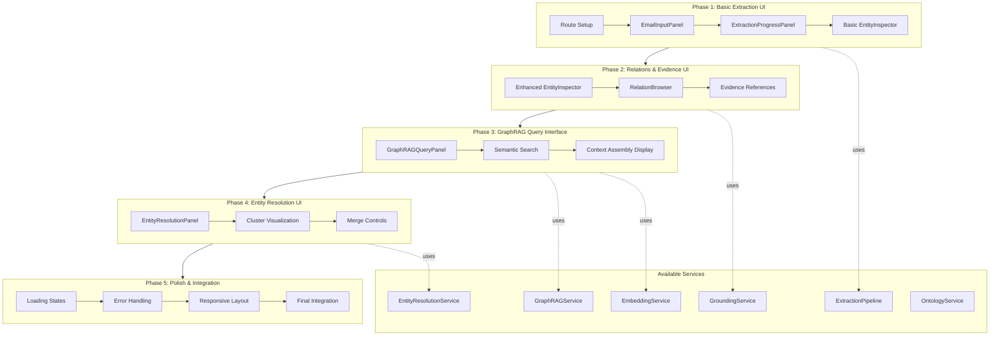
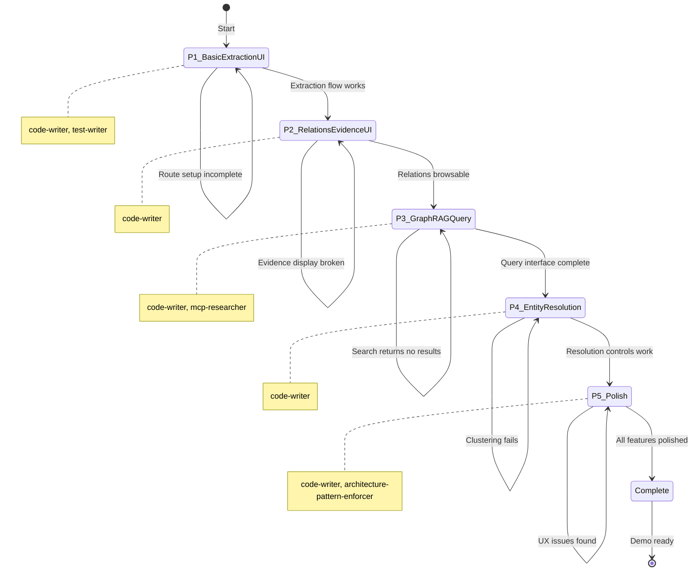
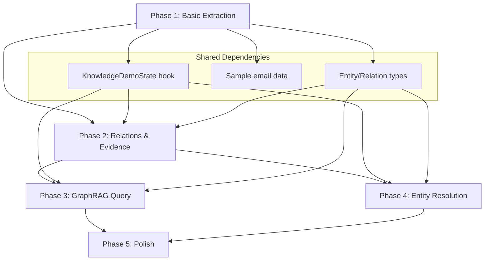

# Master Orchestration: Knowledge Graph POC Demo

> Complete phase workflows, checkpoints, and handoff protocols for demonstrating knowledge graph capabilities through a POC UI in the todox app.

---

## Overview

This specification orchestrates the development of a proof-of-concept demonstration of knowledge graph capabilities at `/knowledge-demo` in the todox app. The demo extracts entities from sample emails, visualizes the resulting knowledge graph, and showcases GraphRAG and entity resolution features.

### Workflow Diagram



### State Machine



---

## Sample Data

The demo uses 5 pre-defined emails with overlapping entities to demonstrate entity resolution:

| Email | Sender | Subject | Entities |
|-------|--------|---------|----------|
| 1 | John Smith | Q4 Planning | John Smith, Sarah Chen, Acme Corp |
| 2 | Sarah Chen | Follow-up | J. Smith, Sarah Chen, Mike Wilson |
| 3 | Mike Wilson | Budget Review | Mike Wilson, John, Alex Rodriguez |
| 4 | Alex Rodriguez | Team Update | Alex Rodriguez, Lisa Park, Acme Corp |
| 5 | Lisa Park | Project Status | Lisa Park, John Smith, Sarah Chen |

**Entity Resolution Targets**:
- "John Smith" / "J. Smith" / "John" should cluster together
- "Acme Corp" appears twice and should deduplicate

---

## Phase 1: Basic Extraction UI

**Duration**: 2-3 sessions
**Status**: Pending
**Agents**: `code-writer`, `test-writer`, `codebase-researcher`

### Objectives

1. Create the `/knowledge-demo` route in todox app
2. Implement EmailInputPanel for sample email selection/input
3. Build ExtractionProgressPanel showing pipeline stages
4. Create basic EntityInspector for viewing extracted entities

### Tasks

#### Task 1.1: Route Setup

**Agent**: `code-writer`

Create the demo route structure following existing todox patterns:

```typescript
// apps/todox/src/app/knowledge-demo/page.tsx
"use client";

import * as React from "react";
import { KnowledgeDemoLayout } from "./components/KnowledgeDemoLayout";

export default function KnowledgeDemoPage() {
  return <KnowledgeDemoLayout />;
}
```

**Files to Create**:
- `apps/todox/src/app/knowledge-demo/page.tsx`
- `apps/todox/src/app/knowledge-demo/layout.tsx`
- `apps/todox/src/app/knowledge-demo/components/KnowledgeDemoLayout.tsx`

#### Task 1.2: EmailInputPanel

**Agent**: `code-writer`

```typescript
// apps/todox/src/app/knowledge-demo/components/EmailInputPanel.tsx
import * as React from "react";
import { Card, CardHeader, CardTitle, CardContent } from "@beep/ui/card";
import { Button } from "@beep/ui/button";
import { Textarea } from "@beep/ui/textarea";
import { Select } from "@beep/ui/select";

interface EmailInputPanelProps {
  onExtract: (emailContent: string) => void;
  isExtracting: boolean;
}

export function EmailInputPanel({ onExtract, isExtracting }: EmailInputPanelProps) {
  const [selectedSample, setSelectedSample] = React.useState<string | null>(null);
  const [customEmail, setCustomEmail] = React.useState("");

  // Sample emails data
  const sampleEmails = SAMPLE_EMAILS;

  return (
    <Card>
      <CardHeader>
        <CardTitle>Email Input</CardTitle>
      </CardHeader>
      <CardContent>
        {/* Sample selector dropdown */}
        {/* Custom email textarea */}
        {/* Extract button */}
      </CardContent>
    </Card>
  );
}
```

**Features**:
- Dropdown to select from 5 sample emails
- Textarea for custom email input
- "Extract Entities" button with loading state
- Preview of selected email content

#### Task 1.3: ExtractionProgressPanel

**Agent**: `code-writer`

```typescript
// apps/todox/src/app/knowledge-demo/components/ExtractionProgressPanel.tsx
import * as React from "react";
import { Card, CardHeader, CardTitle, CardContent } from "@beep/ui/card";
import { Progress } from "@beep/ui/progress";

interface ExtractionStage {
  name: string;
  status: "pending" | "in_progress" | "completed" | "error";
  entityCount?: number;
  relationCount?: number;
}

interface ExtractionProgressPanelProps {
  stages: ReadonlyArray<ExtractionStage>;
  currentStage: number;
  overallProgress: number;
}

const PIPELINE_STAGES = [
  "Chunking",
  "Mention Detection",
  "Entity Extraction",
  "Entity Grounding",
  "Relation Extraction",
  "Relation Grounding",
];
```

**Features**:
- Visual progress indicator for 6 pipeline stages
- Current stage highlighting
- Entity/relation count updates as extraction proceeds
- Error state display if stage fails

#### Task 1.4: Basic EntityInspector

**Agent**: `code-writer`

```typescript
// apps/todox/src/app/knowledge-demo/components/EntityInspector.tsx
import * as React from "react";
import { Card, CardHeader, CardTitle, CardContent } from "@beep/ui/card";
import { Badge } from "@beep/ui/badge";
import { ScrollArea } from "@beep/ui/scroll-area";

interface Entity {
  id: string;
  mention: string;
  types: ReadonlyArray<string>;
  groundingConfidence: number;
}

interface EntityInspectorProps {
  entities: ReadonlyArray<Entity>;
  selectedEntity: Entity | null;
  onSelectEntity: (entity: Entity) => void;
}
```

**Features**:
- List view of extracted entities
- Type badges (Person, Organization, etc.)
- Confidence score display
- Click to select for detail view
- Search/filter functionality

#### Task 1.5: State Management Hook

**Agent**: `code-writer`

```typescript
// apps/todox/src/app/knowledge-demo/hooks/useKnowledgeDemo.ts
import * as React from "react";
import * as Effect from "effect/Effect";

export interface KnowledgeDemoState {
  // Input state
  selectedEmail: string | null;
  customEmailContent: string;

  // Extraction state
  isExtracting: boolean;
  extractionStages: ReadonlyArray<ExtractionStage>;
  currentStage: number;

  // Result state
  entities: ReadonlyArray<Entity>;
  relations: ReadonlyArray<Relation>;
  selectedEntity: Entity | null;

  // Error state
  error: Error | null;
}

export function useKnowledgeDemo() {
  // Implementation using Effect for async operations
}
```

### Success Criteria

- [ ] Route `/knowledge-demo` accessible in browser
- [ ] EmailInputPanel renders with sample dropdown
- [ ] Sample email selection populates content
- [ ] ExtractionProgressPanel shows all 6 stages
- [ ] EntityInspector displays extracted entities
- [ ] Entity selection updates detail view
- [ ] `bun run check --filter @beep/todox` passes
- [ ] `bun run test --filter @beep/todox` passes
- [ ] REFLECTION_LOG.md updated
- [ ] HANDOFF_P2.md created
- [ ] P2_ORCHESTRATOR_PROMPT.md created

### Checkpoint

Before proceeding to Phase 2:
- [ ] Demo page loads without errors
- [ ] Sample emails render correctly
- [ ] Extraction triggers (mocked or real service)
- [ ] Progress panel animates through stages
- [ ] Entity list populates after extraction
- [ ] Basic entity selection works

### Handoff

Create `handoffs/HANDOFF_P2.md` with:
- Component structure decisions
- State management patterns used
- Service integration approach
- Phase 2 task refinements

---

## Phase 2: Relations & Evidence UI

**Duration**: 2 sessions
**Status**: Pending
**Agents**: `code-writer`, `codebase-researcher`

### Objectives

1. Enhance EntityInspector with evidence spans
2. Implement RelationBrowser for exploring entity relationships
3. Add evidence reference highlighting in source text

### Tasks

#### Task 2.1: Enhanced EntityInspector

**Agent**: `code-writer`

Add to existing EntityInspector:

```typescript
interface EvidenceSpan {
  text: string;
  startOffset: number;
  endOffset: number;
  sourceEmailIndex: number;
  confidence: number;
}

interface EnhancedEntity extends Entity {
  mentions: ReadonlyArray<EvidenceSpan>;
  attributes: Record<string, unknown>;
}
```

**Features**:
- Evidence spans list with source references
- Attribute key-value display
- "Show in Source" button to highlight mention
- Confidence breakdown by mention

#### Task 2.2: RelationBrowser

**Agent**: `code-writer`

```typescript
// apps/todox/src/app/knowledge-demo/components/RelationBrowser.tsx
import * as React from "react";
import { Card, CardHeader, CardTitle, CardContent } from "@beep/ui/card";
import { Table, TableHeader, TableRow, TableCell } from "@beep/ui/table";

interface Relation {
  id: string;
  subjectId: string;
  predicate: string;
  objectId: string | null;
  objectLiteral: string | null;
  evidence: ReadonlyArray<EvidenceSpan>;
  confidence: number;
}

interface RelationBrowserProps {
  relations: ReadonlyArray<Relation>;
  entities: ReadonlyArray<Entity>;
  selectedEntity: Entity | null;
  onSelectRelation: (relation: Relation) => void;
}
```

**Features**:
- Table view: Subject | Predicate | Object
- Filter by selected entity (show as subject or object)
- Predicate grouping/filtering
- Confidence threshold slider
- Click to view evidence

#### Task 2.3: Evidence Highlighting

**Agent**: `code-writer`

```typescript
// apps/todox/src/app/knowledge-demo/components/SourceTextViewer.tsx
import * as React from "react";

interface SourceTextViewerProps {
  emailContent: string;
  highlightSpans: ReadonlyArray<{
    start: number;
    end: number;
    type: "entity" | "relation" | "evidence";
    color?: string;
  }>;
  onSpanClick: (span: HighlightSpan) => void;
}
```

**Features**:
- Original email text display
- Highlight spans with different colors by type
- Click span to select entity/relation
- Scroll to highlighted span on selection
- Multiple overlapping highlights support

### Success Criteria

- [ ] EntityInspector shows evidence spans
- [ ] Evidence "Show in Source" scrolls to highlight
- [ ] RelationBrowser displays all relations
- [ ] Relation filtering by entity works
- [ ] Confidence slider filters relations
- [ ] Source text highlights on selection
- [ ] `bun run check --filter @beep/todox` passes
- [ ] REFLECTION_LOG.md updated
- [ ] HANDOFF_P3.md created
- [ ] P3_ORCHESTRATOR_PROMPT.md created

### Checkpoint

Before proceeding to Phase 3:
- [ ] Entity evidence displays correctly
- [ ] Relations render in table format
- [ ] Filtering by entity works
- [ ] Source highlighting works bidirectionally

### Handoff

Create `handoffs/HANDOFF_P3.md` with:
- Evidence span rendering approach
- Highlight coordination between components
- Performance considerations for large graphs
- Phase 3 task refinements

---

## Phase 3: GraphRAG Query Interface

**Duration**: 2-3 sessions
**Status**: Pending
**Agents**: `code-writer`, `mcp-researcher`, `test-writer`

### Objectives

1. Implement GraphRAGQueryPanel for semantic search
2. Display retrieved context assembly
3. Show relevance scoring and ranking

### Tasks

#### Task 3.1: GraphRAGQueryPanel

**Agent**: `code-writer`

```typescript
// apps/todox/src/app/knowledge-demo/components/GraphRAGQueryPanel.tsx
import * as React from "react";
import { Card, CardHeader, CardTitle, CardContent } from "@beep/ui/card";
import { Input } from "@beep/ui/input";
import { Button } from "@beep/ui/button";

interface GraphRAGQueryPanelProps {
  onQuery: (query: string, options: QueryOptions) => void;
  isQuerying: boolean;
  results: QueryResults | null;
}

interface QueryOptions {
  maxEntities: number;
  maxHops: number;
  minRelevance: number;
}

interface QueryResults {
  entities: ReadonlyArray<ScoredEntity>;
  subgraph: ReadonlyArray<Relation>;
  contextText: string;
  totalTokens: number;
}
```

**Features**:
- Natural language query input
- Configuration options (max entities, hops, relevance threshold)
- Execute query button with loading state
- Results summary display

#### Task 3.2: Semantic Search Results

**Agent**: `code-writer`

```typescript
// apps/todox/src/app/knowledge-demo/components/SearchResultsList.tsx
import * as React from "react";

interface ScoredEntity {
  entity: Entity;
  relevanceScore: number;  // RRF combined score
  semanticScore: number;   // Embedding similarity
  graphScore: number;      // Graph proximity
  hopsFromQuery: number;
}

interface SearchResultsListProps {
  results: ReadonlyArray<ScoredEntity>;
  onSelectEntity: (entity: Entity) => void;
}
```

**Features**:
- Ranked list of relevant entities
- Score breakdown (semantic, graph, combined)
- Hop distance visualization
- Click to expand subgraph

#### Task 3.3: Context Assembly Display

**Agent**: `code-writer`

```typescript
// apps/todox/src/app/knowledge-demo/components/ContextAssemblyPanel.tsx
import * as React from "react";
import { Card, CardHeader, CardTitle, CardContent } from "@beep/ui/card";
import { Textarea } from "@beep/ui/textarea";

interface ContextAssemblyPanelProps {
  contextText: string;
  totalTokens: number;
  includedEntities: ReadonlyArray<Entity>;
  includedRelations: ReadonlyArray<Relation>;
}
```

**Features**:
- Generated context text preview
- Token count display
- Entity/relation contribution breakdown
- Copy context button for LLM use

### Success Criteria

- [ ] Query input accepts natural language
- [ ] Configuration options work correctly
- [ ] Search returns ranked entities
- [ ] Relevance scores display with breakdown
- [ ] Context assembly generates readable text
- [ ] Token count accurate
- [ ] Copy to clipboard works
- [ ] `bun run check --filter @beep/todox` passes
- [ ] REFLECTION_LOG.md updated
- [ ] HANDOFF_P4.md created
- [ ] P4_ORCHESTRATOR_PROMPT.md created

### Checkpoint

Before proceeding to Phase 4:
- [ ] Query execution returns results
- [ ] Scoring breakdown displays correctly
- [ ] Context assembly is coherent
- [ ] Performance acceptable (<2s for queries)

### Handoff

Create `handoffs/HANDOFF_P4.md` with:
- Query execution flow
- Scoring algorithm parameters used
- Context formatting decisions
- Phase 4 task refinements

---

## Phase 4: Entity Resolution UI

**Duration**: 2 sessions
**Status**: Pending
**Agents**: `code-writer`, `codebase-researcher`

### Objectives

1. Implement EntityResolutionPanel showing clusters
2. Visualize entity similarity clusters
3. Add manual merge/split controls

### Tasks

#### Task 4.1: EntityResolutionPanel

**Agent**: `code-writer`

```typescript
// apps/todox/src/app/knowledge-demo/components/EntityResolutionPanel.tsx
import * as React from "react";
import { Card, CardHeader, CardTitle, CardContent } from "@beep/ui/card";
import { Tabs, TabsList, TabsTrigger, TabsContent } from "@beep/ui/tabs";

interface EntityCluster {
  id: string;
  canonicalEntity: Entity;
  members: ReadonlyArray<Entity>;
  sameAsLinks: ReadonlyArray<SameAsLink>;
  averageSimilarity: number;
}

interface SameAsLink {
  sourceId: string;
  targetId: string;
  similarity: number;
  isManual: boolean;
}

interface EntityResolutionPanelProps {
  clusters: ReadonlyArray<EntityCluster>;
  onMerge: (entityIds: ReadonlyArray<string>) => void;
  onSplit: (clusterId: string, entityId: string) => void;
  onSetCanonical: (clusterId: string, entityId: string) => void;
}
```

**Features**:
- Tab view: All Entities | Clusters | Unresolved
- Cluster card showing canonical + members
- Similarity score per cluster
- Expand to see all members

#### Task 4.2: Cluster Visualization

**Agent**: `code-writer`

```typescript
// apps/todox/src/app/knowledge-demo/components/ClusterVisualization.tsx
import * as React from "react";

interface ClusterVisualizationProps {
  cluster: EntityCluster;
  onSelectEntity: (entity: Entity) => void;
}
```

**Features**:
- Visual cluster diagram (circular layout)
- Similarity edges between members
- Canonical entity highlighted
- Hover to see similarity score
- Click to select entity

#### Task 4.3: Merge Controls

**Agent**: `code-writer`

```typescript
// apps/todox/src/app/knowledge-demo/components/MergeControls.tsx
import * as React from "react";
import { Button } from "@beep/ui/button";
import { Dialog, DialogContent, DialogHeader } from "@beep/ui/dialog";

interface MergeControlsProps {
  selectedEntities: ReadonlyArray<Entity>;
  onMerge: (canonicalId: string) => void;
  onCancel: () => void;
}
```

**Features**:
- Multi-select entities for merge
- Preview merged entity
- Select canonical mention
- Confirm/cancel dialog
- Undo recent merge option

### Success Criteria

- [ ] Clusters display correctly
- [ ] Sample data shows "John" variants clustered
- [ ] Similarity scores accurate
- [ ] Manual merge creates new cluster
- [ ] Split removes entity from cluster
- [ ] Set canonical updates display
- [ ] `bun run check --filter @beep/todox` passes
- [ ] REFLECTION_LOG.md updated
- [ ] HANDOFF_P5.md created
- [ ] P5_ORCHESTRATOR_PROMPT.md created

### Checkpoint

Before proceeding to Phase 5:
- [ ] Automatic clustering visible for sample data
- [ ] Merge workflow completes without errors
- [ ] Split workflow preserves other cluster members
- [ ] owl:sameAs links tracked

### Handoff

Create `handoffs/HANDOFF_P5.md` with:
- Clustering algorithm parameters
- Merge/split state management
- SameAsLink persistence approach
- Phase 5 polish priorities

---

## Phase 5: Polish & Integration

**Duration**: 1-2 sessions
**Status**: Pending
**Agents**: `code-writer`, `architecture-pattern-enforcer`

### Objectives

1. Add comprehensive loading states
2. Implement error handling and recovery
3. Polish responsive layout
4. Final integration testing

### Tasks

#### Task 5.1: Loading States

**Agent**: `code-writer`

```typescript
// apps/todox/src/app/knowledge-demo/components/LoadingStates.tsx

// Skeleton components for each panel
export function EmailInputSkeleton() { ... }
export function ExtractionProgressSkeleton() { ... }
export function EntityInspectorSkeleton() { ... }
export function RelationBrowserSkeleton() { ... }
export function GraphRAGQuerySkeleton() { ... }
export function EntityResolutionSkeleton() { ... }
```

**Features**:
- Skeleton loaders for each panel
- Graceful degradation during loading
- Minimum loading time to prevent flicker
- Loading overlay for long operations

#### Task 5.2: Error Handling

**Agent**: `code-writer`

```typescript
// apps/todox/src/app/knowledge-demo/components/ErrorBoundary.tsx
import * as React from "react";
import { Alert, AlertTitle, AlertDescription } from "@beep/ui/alert";
import { Button } from "@beep/ui/button";

interface ErrorDisplayProps {
  error: Error;
  context: string;
  onRetry: () => void;
  onDismiss: () => void;
}
```

**Features**:
- Error boundary wrapping each panel
- Contextual error messages
- Retry button where applicable
- Error toast for non-blocking errors
- Recovery suggestions

#### Task 5.3: Responsive Layout

**Agent**: `code-writer`

```typescript
// apps/todox/src/app/knowledge-demo/components/KnowledgeDemoLayout.tsx

// Responsive grid layout
// Desktop: 3-column layout
// Tablet: 2-column layout
// Mobile: Single column with collapsible panels
```

**Features**:
- CSS grid with breakpoints
- Collapsible panels on mobile
- Tab-based navigation for small screens
- Preserve state across layout changes

#### Task 5.4: Final Integration

**Agent**: `architecture-pattern-enforcer`

Verify integration:
- [ ] All components follow Effect patterns
- [ ] Proper error types used (no native Error)
- [ ] Effect utilities for collections
- [ ] Service dependencies properly layered
- [ ] No console.log (use Effect.log)

### Success Criteria

- [ ] All loading states display appropriately
- [ ] Errors show contextual messages
- [ ] Retry recovers from transient errors
- [ ] Mobile layout usable
- [ ] Tablet layout usable
- [ ] Desktop layout polished
- [ ] No TypeScript errors
- [ ] No lint errors
- [ ] `bun run check --filter @beep/todox` passes
- [ ] `bun run test --filter @beep/todox` passes
- [ ] Manual testing of full workflow passes
- [ ] REFLECTION_LOG.md updated with final learnings

### Checkpoint

Demo is complete when:
- [ ] Full extraction workflow works end-to-end
- [ ] All 5 sample emails process correctly
- [ ] Entity resolution clusters "John" variants
- [ ] GraphRAG queries return relevant results
- [ ] UI is polished and responsive
- [ ] Error handling is comprehensive

---

## Inter-Phase Dependencies



### Dependency Matrix

| Phase | Depends On | Outputs Used By |
|-------|------------|-----------------|
| P1 | - | P2, P3, P4, P5 |
| P2 | P1 (entities, base components) | P3, P5 |
| P3 | P2 (relations, evidence spans) | P5 |
| P4 | P2 (entities, relations) | P5 |
| P5 | P1, P2, P3, P4 (all components) | - |

### Shared Types

All phases share these core types defined in Phase 1:

```typescript
// apps/todox/src/app/knowledge-demo/types.ts
export interface Entity { ... }
export interface Relation { ... }
export interface EvidenceSpan { ... }
export interface ExtractionStage { ... }
export interface EntityCluster { ... }
export interface QueryResults { ... }
```

---

## Error Recovery Procedures

### If Extraction Fails

1. Check service availability (ExtractionPipeline layer)
2. Verify sample email format matches expected schema
3. Check for timeout issues on LLM calls
4. Review ExtractionProgressPanel for failed stage
5. Retry with smaller chunk size if chunking fails

### If GraphRAG Returns Empty Results

1. Verify entities were extracted successfully
2. Check embedding service is generating vectors
3. Confirm pgvector index exists and populated
4. Lower relevance threshold in query options
5. Test with broader query terms

### If Entity Resolution Clusters Incorrectly

1. Review similarity threshold setting
2. Check embedding quality for entity mentions
3. Verify entity types are consistent
4. Manually adjust clusters using merge/split controls
5. Check for edge cases in sample data

### If UI Fails to Render

1. Check browser console for React errors
2. Verify all components export correctly
3. Check for missing shadcn/ui components
4. Verify state management hook provides data
5. Check for async loading race conditions

---

## Cross-Phase Considerations

### Effect Patterns (Mandatory)

All code must follow `.claude/rules/effect-patterns.md`:

```typescript
// REQUIRED: Namespace imports
import * as Effect from "effect/Effect";
import * as S from "effect/Schema";
import * as A from "effect/Array";
import * as O from "effect/Option";

// REQUIRED: Effect.gen for async operations
const result = yield* Effect.gen(function* () {
  const data = yield* someEffect;
  return data;
});

// REQUIRED: Effect utilities for collections
const mapped = A.map(entities, (e) => e.id);  // NOT entities.map()
const filtered = A.filter(relations, (r) => r.confidence > 0.8);
```

### UI Component Patterns

Follow shadcn/ui patterns from `@beep/ui`:

```typescript
// Use existing components
import { Card, CardHeader, CardTitle, CardContent } from "@beep/ui/card";
import { Button } from "@beep/ui/button";
import { Badge } from "@beep/ui/badge";
import { ScrollArea } from "@beep/ui/scroll-area";
import { Progress } from "@beep/ui/progress";
```

### Testing Requirements

Each phase must include tests:

```typescript
import { effect, strictEqual } from "@beep/testkit";
import * as Effect from "effect/Effect";

effect("extracts entities from email", () =>
  Effect.gen(function* () {
    const result = yield* extractEntities(sampleEmail);
    strictEqual(result.entities.length > 0, true);
  })
);
```

### Documentation Requirements

Each phase updates:
- `REFLECTION_LOG.md` with learnings
- `handoffs/HANDOFF_P[N+1].md` for next phase
- `handoffs/P[N+1]_ORCHESTRATOR_PROMPT.md` for next phase

---

## Iteration Protocol

After each phase:

1. **Verify** - Run `bun run check --filter @beep/todox`
2. **Test** - Run `bun run test --filter @beep/todox`
3. **Manual Test** - Load `/knowledge-demo` in browser
4. **Reflect** - Update REFLECTION_LOG.md
5. **Handoff** - Create HANDOFF_P[N+1].md AND P[N+1]_ORCHESTRATOR_PROMPT.md
6. **Review** - Run `architecture-pattern-enforcer` if structure changed

---

## Complexity Assessment

Using the spec guide complexity calculator:

```
Phase Count:       5 phases    x 2 = 10
Agent Diversity:   4 agents    x 3 = 12
Cross-Package:     2 (@beep/ui, services) x 4 = 8
External Deps:     1 (knowledge services) x 3 = 3
Uncertainty:       2 (medium-low) x 5 = 10
Research Required: 2 (moderate) x 2 = 4
────────────────────────────────────────
Total Score:                       47 -> High Complexity
```

**Recommendation**: Use full orchestration structure with per-task checkpoints.

---

## File Manifest

### New Files Created

| Phase | File | Purpose |
|-------|------|---------|
| P1 | `apps/todox/src/app/knowledge-demo/page.tsx` | Route entry point |
| P1 | `apps/todox/src/app/knowledge-demo/layout.tsx` | Layout wrapper |
| P1 | `apps/todox/src/app/knowledge-demo/components/KnowledgeDemoLayout.tsx` | Main layout |
| P1 | `apps/todox/src/app/knowledge-demo/components/EmailInputPanel.tsx` | Email input |
| P1 | `apps/todox/src/app/knowledge-demo/components/ExtractionProgressPanel.tsx` | Progress display |
| P1 | `apps/todox/src/app/knowledge-demo/components/EntityInspector.tsx` | Entity list/detail |
| P1 | `apps/todox/src/app/knowledge-demo/hooks/useKnowledgeDemo.ts` | State management |
| P1 | `apps/todox/src/app/knowledge-demo/data/sampleEmails.ts` | Sample data |
| P1 | `apps/todox/src/app/knowledge-demo/types.ts` | Shared types |
| P2 | `apps/todox/src/app/knowledge-demo/components/RelationBrowser.tsx` | Relation explorer |
| P2 | `apps/todox/src/app/knowledge-demo/components/SourceTextViewer.tsx` | Evidence highlight |
| P3 | `apps/todox/src/app/knowledge-demo/components/GraphRAGQueryPanel.tsx` | Query interface |
| P3 | `apps/todox/src/app/knowledge-demo/components/SearchResultsList.tsx` | Search results |
| P3 | `apps/todox/src/app/knowledge-demo/components/ContextAssemblyPanel.tsx` | Context display |
| P4 | `apps/todox/src/app/knowledge-demo/components/EntityResolutionPanel.tsx` | Resolution UI |
| P4 | `apps/todox/src/app/knowledge-demo/components/ClusterVisualization.tsx` | Cluster viz |
| P4 | `apps/todox/src/app/knowledge-demo/components/MergeControls.tsx` | Merge/split |
| P5 | `apps/todox/src/app/knowledge-demo/components/LoadingStates.tsx` | Skeletons |
| P5 | `apps/todox/src/app/knowledge-demo/components/ErrorBoundary.tsx` | Error handling |

### Existing Files Modified

| Phase | File | Modification |
|-------|------|--------------|
| P1 | `apps/todox/src/app/layout.tsx` | Add knowledge-demo route to navigation (if needed) |

---

## Success Metrics

### Functional Requirements

| Requirement | Phase | Verification |
|-------------|-------|--------------|
| Extract entities from email | P1 | Entity list populated |
| Show extraction progress | P1 | All 6 stages visible |
| Display entity details | P1 | Click entity shows detail |
| Browse relations | P2 | Table shows subject-predicate-object |
| Highlight evidence | P2 | Click shows source highlight |
| Query knowledge graph | P3 | Search returns ranked results |
| Display context assembly | P3 | Context text generated |
| Show entity clusters | P4 | Similar entities grouped |
| Merge/split entities | P4 | Manual resolution works |
| Responsive layout | P5 | Works on mobile/tablet/desktop |

### Non-Functional Requirements

| Requirement | Target | Phase |
|-------------|--------|-------|
| Extraction time | <10s for sample emails | P1 |
| Query response time | <2s | P3 |
| Initial page load | <3s | P5 |
| Mobile usability | All features accessible | P5 |
