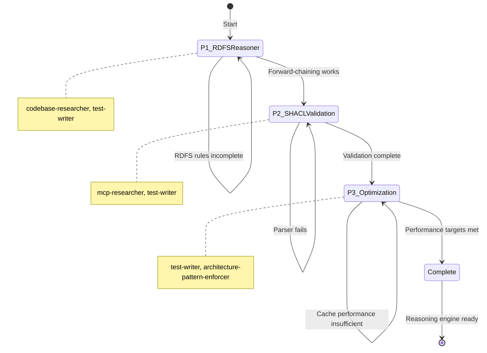
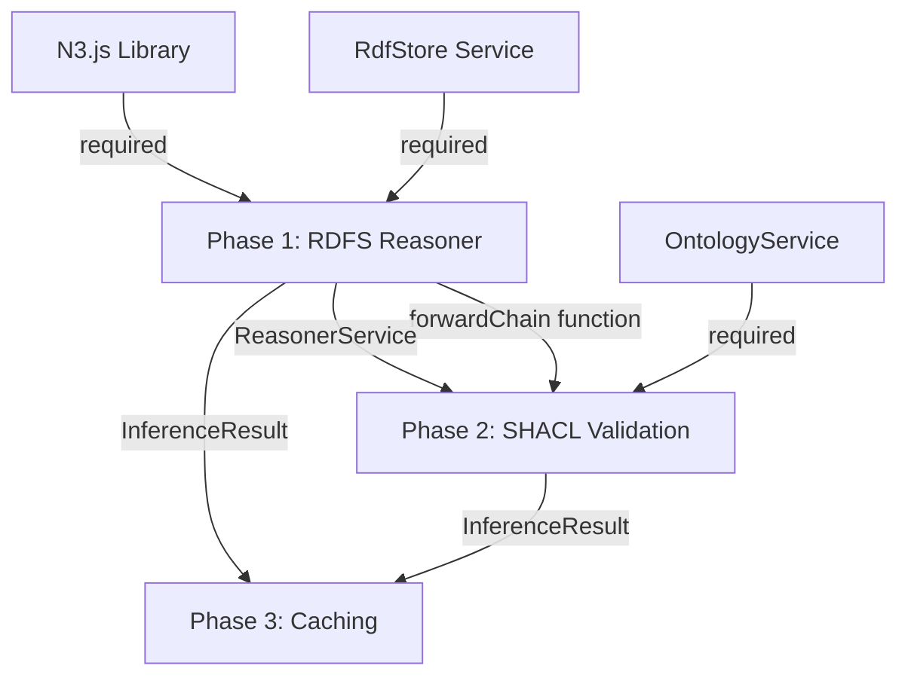

# Master Orchestration: Knowledge Reasoning Engine

> Complete phase workflows, agent delegation patterns, checkpoints, and recovery procedures for RDFS reasoning and SHACL validation implementation.

---

## Overview

This specification orchestrates the development of RDFS forward-chaining reasoning and SHACL validation services for semantic knowledge graph inference. The reasoning engine derives implicit facts using RDFS semantics and validates graph structure against shape constraints without full materialization.

### Workflow Diagram

```mermaid
flowchart TD
    subgraph Phase1["Phase 1: RDFS Reasoner"]
        P1A[Domain Models] --> P1B[RDFS Rules]
        P1B --> P1C[Forward-Chaining Engine]
        P1C --> P1D[ReasonerService Layer]
        P1D --> P1E[Unit Tests]
    end

    subgraph Phase2["Phase 2: SHACL Validation"]
        P2A[ValidationReport Model] --> P2B[SHACL Parser]
        P2B --> P2C[Re-SHACL Validator]
        P2C --> P2D[Integration with Reasoner]
        P2D --> P2E[Validation Tests]
    end

    subgraph Phase3["Phase 3: Optimization"]
        P3A[Cache Key Strategy] --> P3B[InferenceCache Service]
        P3B --> P3C[Cache Invalidation]
        P3C --> P3D[Performance Benchmarks]
        P3D --> P3E[N3 Rules Engine (Optional)]
    end

    Phase1 --> Phase2
    Phase2 --> Phase3

    subgraph Dependencies["Dependencies"]
        D1[RdfStore]
        D2[N3.js]
        D3[OntologyService]
    end

    Phase1 -.->|requires| D1
    Phase1 -.->|uses| D2
    Phase2 -.->|requires| Phase1
    Phase2 -.->|uses| D3
    Phase3 -.->|requires| Phase2
```

### State Machine



---

## Phase Overview Table

| Phase | Duration | Sessions | Primary Agents | Completion Criteria |
|-------|----------|----------|----------------|---------------------|
| **P1: RDFS Reasoner** | 3-4 days | 2-3 | codebase-researcher, test-writer | RDFS rules pass tests, <1s for 10K triples |
| **P2: SHACL Validation** | 3-4 days | 2-3 | mcp-researcher, test-writer | ValidationReport correct, Re-SHACL avoids full materialization |
| **P3: Optimization** | 2-3 days | 1-2 | test-writer, architecture-pattern-enforcer | Cache hit rate ≥70%, N3 engine optional |

---

## Phase 1: RDFS Forward-Chaining Reasoner

**Goal**: Implement RDFS reasoning to derive implicit facts from explicit triples.

**Duration**: 3-4 days
**Status**: Pending
**Agents**: `codebase-researcher`, `test-writer`, `mcp-researcher`

### Objectives

1. Create domain models for reasoning configuration and results
2. Implement RDFS rule set (rdfs2, rdfs3, rdfs5, rdfs7, rdfs9, rdfs11)
3. Build forward-chaining inference engine with fixed-point detection
4. Create ReasonerService interface and Layer
5. Add depth and inference limits to prevent infinite loops
6. Write comprehensive unit tests with sample ontologies

### Task Breakdown

#### Task 1.1: Research Existing Patterns (codebase-researcher)

**Delegation Prompt**:

```markdown
Research the knowledge package structure to understand:
1. How RdfStore service is used for triple storage
2. Where domain models should be placed (value-objects/reasoning/)
3. Existing service patterns (Layer composition, Context.Tag usage)
4. Test patterns used in knowledge-server package

Output: outputs/codebase-context-reasoning.md
```

**Expected Output**: Markdown report with code snippets showing:
- RdfStore service usage examples
- Domain model placement conventions
- Layer composition patterns
- Test structure examples

**Verification**: Read output file before proceeding to implementation

#### Task 1.2: Create Domain Models

**Files to Create**:

1. `packages/knowledge/domain/src/value-objects/reasoning/ReasoningConfig.ts`
   - Schema class with maxDepth, maxInferences, profile fields
   - Default values: maxDepth=10, maxInferences=10000, profile="RDFS"

2. `packages/knowledge/domain/src/value-objects/reasoning/InferenceResult.ts`
   - Schema class with derivedTriples, provenance, stats fields
   - Provenance maps triple IDs to rule IDs and source triple IDs

3. `packages/knowledge/domain/src/value-objects/reasoning/ReasoningProfile.ts`
   - Literal schema: "RDFS" | "OWL_RL" | "CUSTOM"

4. `packages/knowledge/domain/src/value-objects/reasoning/index.ts`
   - Barrel export

**Pattern Example**:

```typescript
// ReasoningConfig.ts
import * as S from "effect/Schema";

export class ReasoningConfig extends S.Class<ReasoningConfig>("ReasoningConfig")(
  {
    maxDepth: S.Number.pipe(S.positive(), S.int()).pipe(
      S.propertySignature,
      S.withConstructorDefault(() => 10)
    ),
    maxInferences: S.Number.pipe(S.positive(), S.int()).pipe(
      S.propertySignature,
      S.withConstructorDefault(() => 10_000)
    ),
    profile: S.Literal("RDFS", "OWL_RL", "CUSTOM").pipe(
      S.propertySignature,
      S.withConstructorDefault(() => "RDFS" as const)
    ),
  }
) {}
```

**Verification**: `bun run check --filter @beep/knowledge-domain`

#### Task 1.3: Implement RDFS Rules

**File to Create**: `packages/knowledge/server/src/Reasoning/RdfsRules.ts`

**Rules to Implement**:

| Rule | Description | Pattern |
|------|-------------|---------|
| rdfs2 | Domain constraint | `(?x ?p ?y), (?p rdfs:domain ?c) => (?x rdf:type ?c)` |
| rdfs3 | Range constraint | `(?x ?p ?y), (?p rdfs:range ?c) => (?y rdf:type ?c)` |
| rdfs5 | Subproperty transitivity | `(?p rdfs:subPropertyOf ?q), (?q rdfs:subPropertyOf ?r) => (?p rdfs:subPropertyOf ?r)` |
| rdfs7 | Subproperty entailment | `(?x ?p ?y), (?p rdfs:subPropertyOf ?q) => (?x ?q ?y)` |
| rdfs9 | Subclass entailment | `(?x rdf:type ?c), (?c rdfs:subClassOf ?d) => (?x rdf:type ?d)` |
| rdfs11 | Subclass transitivity | `(?c rdfs:subClassOf ?d), (?d rdfs:subClassOf ?e) => (?c rdfs:subClassOf ?e)` |

**Interface**:

```typescript
export interface RdfsRule {
  readonly id: string;
  readonly description: string;
  readonly apply: (
    triples: ReadonlyArray<Triple>
  ) => Effect.Effect<ReadonlyArray<{ triple: Triple; sources: ReadonlyArray<string> }>>;
}
```

**Critical Pattern**: Use `F.pipe` and `A.filter` instead of native methods:

```typescript
const domainTriples = F.pipe(
  triples,
  A.filter((t) => t.predicate === "rdfs:domain")
);
```

**Verification**: `bun run check --filter @beep/knowledge-server`

#### Task 1.4: Build Forward-Chaining Engine

**File to Create**: `packages/knowledge/server/src/Reasoning/ForwardChainer.ts`

**Algorithm**:
1. Initialize known triples set (MutableHashSet) with input triples
2. Loop while iterations < maxDepth:
   - Record current set size
   - Apply all RDFS rules
   - Add new inferred triples to set
   - Track provenance for each inference
   - If set size unchanged (fixed-point), break
3. If iterations == maxDepth, fail with MaxDepthExceededError
4. Return derivedTriples, provenance, stats

**Critical Patterns**:
- Use `MutableHashSet` for efficient triple deduplication
- Use `Map` for provenance tracking
- Use `Effect.fail` for tagged errors
- Use `DateTime.now` for timing (NOT `Date.now()`)

**Verification**: `bun run check --filter @beep/knowledge-server`

#### Task 1.5: Create ReasonerService

**Files to Create**:

1. `packages/knowledge/server/src/Reasoning/ReasonerService.ts`
   - Context.Tag interface
   - `infer` method signature

2. `packages/knowledge/server/src/Reasoning/ReasonerServiceLive.ts`
   - Layer.effect implementation
   - Depends on RdfStore service

3. `packages/knowledge/server/src/Reasoning/errors.ts`
   - MaxDepthExceededError tagged error
   - MaxInferencesExceededError tagged error

4. `packages/knowledge/server/src/Reasoning/index.ts`
   - Barrel export

**Layer Pattern**:

```typescript
export const ReasonerServiceLive = Layer.effect(
  ReasonerService,
  Effect.gen(function* () {
    const rdfStore = yield* RdfStore;

    return ReasonerService.of({
      infer: (config = new ReasoningConfig()) =>
        Effect.gen(function* () {
          const triples = yield* rdfStore.match(undefined, undefined, undefined);
          return yield* forwardChain(triples, config);
        }),
    });
  })
);
```

**Verification**: `bun run check --filter @beep/knowledge-server`

#### Task 1.6: Write Unit Tests (test-writer)

**Delegation Prompt**:

```markdown
Create comprehensive unit tests for the RDFS reasoner:

Files to create:
1. packages/knowledge/server/test/Reasoning/RdfsRules.test.ts
   - Test each rule (rdfs2, rdfs3, rdfs5, rdfs7, rdfs9, rdfs11) individually
   - Use sample ontology and data triples
   - Assert correct inferences produced

2. packages/knowledge/server/test/Reasoning/ForwardChainer.test.ts
   - Test fixed-point convergence
   - Test depth limit enforcement (should fail with MaxDepthExceededError)
   - Test max inferences limit
   - Test provenance tracking

3. packages/knowledge/server/test/Reasoning/ReasonerService.test.ts
   - Integration test with full Layer composition
   - Test with sample ontology from handoff

Use @beep/testkit patterns:
- effect() for unit tests
- layer() for integration tests with shared TestLayer
- strictEqual() for assertions

Sample test structure:
import { effect, layer, strictEqual } from "@beep/testkit";
import * as Effect from "effect/Effect";

effect("rdfs2 infers domain type", () =>
  Effect.gen(function* () {
    const result = yield* rdfs2.apply(sampleTriples);
    strictEqual(result.length, 1);
    strictEqual(result[0].triple.predicate, "rdf:type");
  })
);
```

**Expected Output**: 3 test files with ≥80% coverage

**Verification**: `bun run test --filter @beep/knowledge-server`

### Phase 1 Checkpoints

| Checkpoint | Verification Command | Expected Outcome |
|------------|---------------------|------------------|
| Domain models created | `bun run check --filter @beep/knowledge-domain` | Exit code 0 |
| RDFS rules implemented | `bun run check --filter @beep/knowledge-server` | Exit code 0 |
| Forward-chaining works | `bun run test --filter @beep/knowledge-server` | All tests pass |
| Performance target | Benchmark test | <1s for 10K triples |

### Phase 1 Success Criteria

- [ ] All RDFS rules (rdfs2, rdfs3, rdfs5, rdfs7, rdfs9, rdfs11) implemented
- [ ] Forward-chaining converges to fixed-point
- [ ] Depth limit prevents infinite loops (MaxDepthExceededError)
- [ ] Max inferences limit enforced (MaxInferencesExceededError)
- [ ] Provenance tracked for each inferred triple
- [ ] Test coverage ≥80%
- [ ] Performance: <1s for 10K triples
- [ ] All verification commands pass
- [ ] REFLECTION_LOG.md updated with learnings
- [ ] HANDOFF_P2.md created
- [ ] P2_ORCHESTRATOR_PROMPT.md created

---

## Phase 2: SHACL Validation Service

**Goal**: Validate RDF graphs against SHACL shape constraints without full materialization.

**Duration**: 3-4 days
**Status**: Pending (starts after Phase 1 complete)
**Agents**: `mcp-researcher`, `test-writer`, `codebase-researcher`

### Objectives

1. Research SHACL specification and Re-SHACL pattern
2. Create ValidationReport domain model
3. Implement SHACL parser for Turtle shape definitions
4. Build Re-SHACL validator with selective materialization
5. Integrate with ReasonerService for constraint checking
6. Write validation tests with sample shapes

### Task Breakdown

#### Task 2.1: Research SHACL Patterns (mcp-researcher)

**Delegation Prompt**:

```markdown
Research SHACL validation patterns in Effect:

Search topics:
1. SHACL specification core concepts (NodeShape, PropertyShape, constraints)
2. Re-SHACL pattern (selective materialization vs full materialization)
3. Effect patterns for parser implementation (ParseResult, Schema.transformOrFail)
4. Validation error reporting patterns

Output: outputs/shacl-research.md
```

**Expected Output**: Markdown report with:
- SHACL core concepts summary
- Re-SHACL algorithm explanation
- Effect parser patterns
- Validation report structures

**Verification**: Read output before implementation

#### Task 2.2: Create ValidationReport Model

**File to Create**: `packages/knowledge/domain/src/value-objects/validation/ValidationReport.ts`

**Schema Structure**:

```typescript
import * as S from "effect/Schema";

export class ValidationViolation extends S.Class<ValidationViolation>("ValidationViolation")({
  focusNode: S.String,
  resultPath: S.optional(S.String),
  value: S.optional(S.String),
  message: S.String,
  severity: S.Literal("Violation", "Warning", "Info"),
  sourceConstraint: S.String,
  sourceShape: S.String,
}) {}

export class ValidationReport extends S.Class<ValidationReport>("ValidationReport")({
  conforms: S.Boolean,
  violations: S.Array(ValidationViolation),
  shapesGraph: S.String, // URI of shapes graph
  dataGraph: S.String,   // URI of data graph
  timestamp: S.DateFromString,
}) {}
```

**Verification**: `bun run check --filter @beep/knowledge-domain`

#### Task 2.3: Implement SHACL Parser

**File to Create**: `packages/knowledge/server/src/Validation/ShaclParser.ts`

**Supported Shapes**:
- NodeShape (sh:NodeShape)
- PropertyShape (sh:PropertyShape)
- Cardinality constraints (sh:minCount, sh:maxCount)
- Datatype constraints (sh:datatype)
- Class constraints (sh:class)

**Pattern**: Use N3.js Store to parse Turtle shapes

**Verification**: `bun run check --filter @beep/knowledge-server`

#### Task 2.4: Build Re-SHACL Validator

**File to Create**: `packages/knowledge/server/src/Validation/ReShaclValidator.ts`

**Algorithm**:
1. Parse SHACL shapes to identify required predicates
2. Run targeted inference (only RDFS rules needed for those predicates)
3. Validate focus nodes against shape constraints
4. Report violations without storing full materialization
5. Return ValidationReport

**Trade-off**: Lower memory than full materialization, but more complex implementation

**Verification**: `bun run check --filter @beep/knowledge-server`

#### Task 2.5: Create ShaclService Layer

**Files to Create**:

1. `packages/knowledge/server/src/Validation/ShaclService.ts`
   - Context.Tag interface
   - `validate` method signature

2. `packages/knowledge/server/src/Validation/ShaclServiceLive.ts`
   - Layer.effect implementation
   - Depends on ReasonerService for targeted inference

3. `packages/knowledge/server/src/Validation/errors.ts`
   - ShapeParseError tagged error
   - ValidationError tagged error

4. `packages/knowledge/server/src/Validation/index.ts`
   - Barrel export

**Verification**: `bun run check --filter @beep/knowledge-server`

#### Task 2.6: Write Validation Tests (test-writer)

**Delegation Prompt**:

```markdown
Create validation tests for SHACL service:

Files to create:
1. packages/knowledge/server/test/Validation/ShaclParser.test.ts
   - Parse NodeShape definitions
   - Parse PropertyShape definitions
   - Parse constraint types (cardinality, datatype, class)

2. packages/knowledge/server/test/Validation/ReShaclValidator.test.ts
   - Test validation against sample shapes
   - Test violation detection (cardinality, datatype, class violations)
   - Test Re-SHACL selective materialization

3. packages/knowledge/server/test/Validation/ShaclService.test.ts
   - Integration test with ReasonerService
   - Test with sample shapes from W3C spec

Use @beep/testkit patterns and assert:
- Conforms=true for valid graphs
- Conforms=false with violation details for invalid graphs
- ValidationReport structure correctness
```

**Expected Output**: 3 test files with ≥80% coverage

**Verification**: `bun run test --filter @beep/knowledge-server`

### Phase 2 Checkpoints

| Checkpoint | Verification Command | Expected Outcome |
|------------|---------------------|------------------|
| ValidationReport created | `bun run check --filter @beep/knowledge-domain` | Exit code 0 |
| SHACL parser works | `bun run test --filter @beep/knowledge-server` | Parser tests pass |
| Re-SHACL validation | `bun run test --filter @beep/knowledge-server` | Validation tests pass |
| Integration complete | `bun run check --filter @beep/knowledge-*` | Exit code 0 |

### Phase 2 Success Criteria

- [ ] SHACL parser handles NodeShape, PropertyShape, constraints
- [ ] Validation detects constraint violations correctly
- [ ] ValidationReport provides actionable error messages
- [ ] Re-SHACL avoids full materialization overhead
- [ ] Test coverage ≥80%
- [ ] All verification commands pass
- [ ] REFLECTION_LOG.md updated with learnings
- [ ] HANDOFF_P3.md created
- [ ] P3_ORCHESTRATOR_PROMPT.md created

---

## Phase 3: Caching and Optimization

**Goal**: Optimize inference performance through result caching.

**Duration**: 2-3 days
**Status**: Pending (starts after Phase 2 complete)
**Agents**: `test-writer`, `architecture-pattern-enforcer`

### Objectives

1. Design cache key strategy (ontology hash + data hash)
2. Implement InferenceCache service with TTL
3. Add cache invalidation on data updates
4. Benchmark performance improvements
5. Document cache configuration
6. Optionally implement N3 rules engine

### Task Breakdown

#### Task 3.1: Design Cache Key Strategy

**File to Create**: `packages/knowledge/server/src/Reasoning/CacheKeyStrategy.ts`

**Cache Key Components**:
- Ontology hash (hash of ontology triples)
- Data hash (hash of input triples)
- Reasoning profile (RDFS, OWL_RL, CUSTOM)

**Pattern**: Use Effect Hash for content hashing

**Verification**: `bun run check --filter @beep/knowledge-server`

#### Task 3.2: Implement InferenceCache

**File to Create**: `packages/knowledge/server/src/Reasoning/InferenceCache.ts`

**Features**:
- TTL-based expiration (default 3600s)
- LRU eviction policy
- Thread-safe access (Effect Ref)
- Cache hit/miss metrics

**Pattern**: Use Effect Cache from @effect/cache (if available) or implement with Ref

**Verification**: `bun run check --filter @beep/knowledge-server`

#### Task 3.3: Add Cache Invalidation

**Integration Points**:
- RdfStore.add → invalidate cache on triple insertion
- RdfStore.remove → invalidate cache on triple deletion
- OntologyService.update → invalidate cache on ontology changes

**Pattern**: Use Effect Ref for cache state management

**Verification**: `bun run test --filter @beep/knowledge-server`

#### Task 3.4: Performance Benchmarks

**File to Create**: `packages/knowledge/server/test/Reasoning/performance.test.ts`

**Benchmarks**:
- Cold cache inference time (10K triples)
- Warm cache inference time (10K triples)
- Cache hit rate measurement
- Memory usage profiling

**Targets**:
- Cache hit rate ≥70% on repeated queries
- Inference latency reduced ≥50% with warm cache

**Verification**: `bun run test --filter @beep/knowledge-server`

#### Task 3.5: N3 Rules Engine (Optional)

**File to Create**: `packages/knowledge/server/src/Reasoning/N3RulesEngine.ts`

**Features**:
- Parse N3 rules syntax
- Apply custom rules beyond RDFS
- Integrate with forward-chaining engine

**Status**: Optional P3 extension, defer if time-constrained

### Phase 3 Checkpoints

| Checkpoint | Verification Command | Expected Outcome |
|------------|---------------------|------------------|
| Cache key strategy | `bun run check --filter @beep/knowledge-server` | Exit code 0 |
| Cache service works | `bun run test --filter @beep/knowledge-server` | Cache tests pass |
| Invalidation works | `bun run test --filter @beep/knowledge-server` | Invalidation tests pass |
| Performance target | Benchmark test | Cache hit rate ≥70% |

### Phase 3 Success Criteria

- [ ] Cache key strategy implemented
- [ ] InferenceCache service with TTL
- [ ] Cache invalidation on updates
- [ ] Cache hit rate ≥70% on repeated queries
- [ ] Inference latency reduced ≥50% with warm cache
- [ ] Memory usage within acceptable bounds
- [ ] All verification commands pass
- [ ] REFLECTION_LOG.md updated with final learnings

---

## Agent Delegation Matrix

| Task Type | Agent | Capability | Output |
|-----------|-------|------------|--------|
| Codebase exploration | `codebase-researcher` | read-only | Informs orchestrator |
| Effect documentation | `mcp-researcher` | read-only | Research reports |
| SHACL research | `web-researcher` | read-only | External context |
| Source code writing | Manual (orchestrator) | write-files | `.ts` source files |
| Test writing | `test-writer` | write-files | `*.test.ts` files |
| Architecture review | `architecture-pattern-enforcer` | write-reports | `outputs/architecture-review.md` |

### Delegation Decision Tree

```
Task requires:
├─ Reading >3 files? → Delegate to codebase-researcher
├─ Effect docs lookup? → Delegate to mcp-researcher
├─ External research? → Delegate to web-researcher
├─ Writing tests? → Delegate to test-writer
├─ Architecture validation? → Delegate to architecture-pattern-enforcer
└─ Writing <3 implementation files? → Orchestrator handles directly
```

---

## Inter-Phase Dependencies



**Critical Path**: RdfStore → Phase 1 → Phase 2 → Phase 3

**Blocking Dependencies**:
- Phase 1 CANNOT start without RdfStore service (from Phase 0)
- Phase 2 CANNOT start until Phase 1 ReasonerService works
- Phase 3 CANNOT start until Phase 2 validation works

---

## Checkpoint Protocols

### Phase Transition Gates

Before transitioning from Phase N to Phase N+1:

1. **Quality Gates**:
   - All verification commands pass
   - Test coverage ≥80%
   - No blocking type errors
   - Performance targets met

2. **Documentation Gates**:
   - REFLECTION_LOG.md updated with phase learnings
   - HANDOFF_P[N+1].md created (full context document)
   - P[N+1]_ORCHESTRATOR_PROMPT.md created (copy-paste prompt)

3. **Validation Gates**:
   - Manual smoke test of phase deliverables
   - Integration test with upstream dependencies
   - Review by architecture-pattern-enforcer

### Mid-Phase Checkpoints

Run these commands after each task completion:

```bash
# Type check
bun run check --filter @beep/knowledge-domain
bun run check --filter @beep/knowledge-server

# Lint
bun run lint --filter @beep/knowledge-*

# Tests
bun run test --filter @beep/knowledge-server

# Coverage
bun run test --coverage --filter @beep/knowledge-server
```

**Checkpoint Frequency**: After every 2-3 tasks or before multi-hour breaks

---

## Recovery Procedures

### Type Errors During Implementation

**Symptom**: `bun run check` fails with type mismatches

**Recovery**:
1. Isolate error to specific file
2. Check EntityId usage (branded vs plain strings)
3. Verify Schema imports (S.String not string)
4. Check Effect namespace imports (import * as Effect)
5. Run `bun run lint:fix` to auto-fix formatting

**Escalation**: If >5 type errors persist, delegate to `package-error-fixer` agent

### Test Failures During Development

**Symptom**: `bun run test` fails

**Recovery**:
1. Check test uses @beep/testkit (effect, layer, scoped)
2. Verify test Layer composition
3. Check assertions use strictEqual (not native ===)
4. Verify Effect.gen usage (no async/await)
5. Run isolated test: `bun test path/to/test.ts`

**Escalation**: If >3 tests fail, review test patterns with test-writer agent

### Performance Target Miss

**Symptom**: Benchmark shows >1s for 10K triples

**Recovery**:
1. Profile with Effect Tracer
2. Check for N+1 queries in rule application
3. Verify MutableHashSet usage (not native Set)
3. Consider optimizing hot paths with parallel rule application
4. Add early termination conditions

**Escalation**: If optimization attempts fail, document in REFLECTION_LOG and proceed

### Infinite Loop During Forward-Chaining

**Symptom**: forwardChain never terminates

**Recovery**:
1. Verify maxDepth limit enforced
2. Check fixed-point detection logic
3. Add logging to track iteration count
4. Test with smaller sample graph
5. Verify MutableHashSet.size check

**Escalation**: Review algorithm with mcp-researcher agent for Effect-specific patterns

---

## Risk Mitigation

### High-Risk Areas

| Risk | Impact | Mitigation |
|------|--------|------------|
| **N3.js integration complexity** | Phase 1 blocked | Early spike with codebase-researcher, fallback to simple triple matching |
| **Forward-chaining performance** | Performance target miss | Profile early, optimize hot paths, add depth limits |
| **SHACL parser complexity** | Phase 2 delayed | Start with core shapes only, defer advanced constraints |
| **Re-SHACL algorithm unfamiliar** | Phase 2 blocked | Research with mcp-researcher before implementation |
| **Cache invalidation bugs** | Phase 3 correctness issues | Comprehensive cache tests, manual verification |

### Mitigation Actions

**Before Phase 1**:
- Spike N3.js Store interface with codebase-researcher
- Validate RdfStore service availability

**Before Phase 2**:
- Research SHACL core specification
- Review W3C test suite for validation scenarios

**Before Phase 3**:
- Benchmark Phase 1 performance baseline
- Document cache invalidation edge cases

---

## Success Metrics Summary

### Must-Have Targets

| Metric | Target | Verification | Pass/Fail |
|--------|--------|--------------|-----------|
| **RDFS Correctness** | 100% of test cases pass | Unit tests with known inferences | All pass = PASS |
| **SHACL Coverage** | NodeShape, PropertyShape, cardinality, datatype | Integration tests | All shapes validated = PASS |
| **Performance** | Inference <1s for 10K triples | Benchmark test | <1s = PASS |
| **Depth Limit** | Prevents infinite loops | Test with cyclic hierarchy | Terminates = PASS |
| **TypeScript** | 0 type errors | `bun run check --filter @beep/knowledge-*` | Exit code 0 = PASS |
| **Lint** | 0 lint errors | `bun run lint --filter @beep/knowledge-*` | Exit code 0 = PASS |
| **Test Coverage** | ≥80% line coverage | `bun run test --coverage` | ≥80% = PASS |

### Nice-to-Have Targets

| Metric | Target | Verification | Notes |
|--------|--------|--------------|-------|
| **Cache Hit Rate** | ≥70% on repeated queries | Performance monitoring | Requires Phase 3 |
| **Memory Efficiency** | <100MB for 50K triples | Profiling | Re-SHACL pattern |
| **N3 Rules Support** | Custom rules via N3 syntax | Optional P3 feature | Not required for MVP |

---

## Reference Documentation

- [RDFS Semantics (W3C)](https://www.w3.org/TR/rdf-schema/)
- [SHACL Specification (W3C)](https://www.w3.org/TR/shacl/)
- [N3.js Documentation](https://github.com/rdfjs/N3.js)
- [Effect Patterns](../../.claude/rules/effect-patterns.md)
- [Testing Patterns](../../.claude/commands/patterns/effect-testing-patterns.md)
- [Spec Creation Guide](../_guide/README.md)
