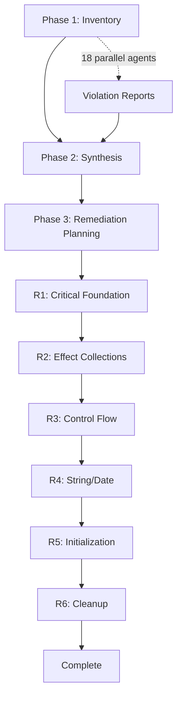

# Master Orchestration

> Complete workflow for the Knowledge Slice Code Quality Audit.

---

## Execution Overview



---

## Phase 1: Inventory

### Objective

Deploy 18 parallel sub-agents to inventory ALL violations by category in `packages/knowledge/*`.

### Sub-Agent Configuration

**Agent Type**: Custom Effect Pattern Enforcer agents defined in `AGENT_PROMPTS.md`

Each sub-agent enforces rules from `.claude/rules/effect-patterns.md` and project conventions. The agents use Glob, Grep, and Read tools to systematically identify violations.

**Source of Truth**: `.claude/rules/effect-patterns.md`

**CRITICAL**: Launch ALL 18 agents in a SINGLE message using multiple Task tool calls. Each agent prompt is defined in `AGENT_PROMPTS.md` section for its violation category.

### Agent Deployment Pattern

```typescript
// Deploy all 18 violation inventory agents in parallel
Task({ subagent_type: "general-purpose", prompt: AGENT_PROMPTS.V01 })
Task({ subagent_type: "general-purpose", prompt: AGENT_PROMPTS.V02 })
// ... through V18
```

Each agent:
1. Reads `.claude/rules/effect-patterns.md` for canonical patterns
2. Searches `packages/knowledge/**/src/**/*.ts` for violations
3. Records exact file:line references with current vs correct code
4. Writes report to `outputs/violations/V[XX]-[category].md`

### Agent Categories

| Agent ID | Category | Search Pattern | Output |
|----------|----------|----------------|--------|
| V01 | EntityId Table Typing | `pg.text.*notNull\(\)` without `.$type<` | V01-entityid-tables.md |
| V02 | Duplicate Code | `extractLocalName` function definitions | V02-duplicate-code.md |
| V03 | Native String Methods | `.lastIndexOf\(`, `.slice\(` | V03-native-string.md |
| V04 | Error Construction | `{ _tag:.*Error` (object literal errors) | V04-error-construction.md |
| V05 | Array Emptiness | `.length === 0`, `.length == 0` | V05-array-emptiness.md |
| V06 | Native Error | `new Error\(`, `Effect.die\(new Error` | V06-native-error.md |
| V07 | Switch Statements | `switch \(` | V07-switch-statements.md |
| V08 | Object.entries | `Object.entries\(` | V08-object-entries.md |
| V09 | Native Set | `new Set\(`, `= new Set<` | V09-native-set.md |
| V10 | Native Array.map | `\.map\(` on arrays | V10-native-array-map.md |
| V11 | Non-null Assertions | `!` postfix (non-null assertion) | V11-non-null-assertions.md |
| V12 | Native Map | `new Map\(`, `= new Map<` | V12-native-map.md |
| V13 | Native Array.sort | `\.sort\(` on arrays | V13-native-array-sort.md |
| V14 | EntityId Creation | `crypto.randomUUID()` for IDs | V14-entityid-creation.md |
| V15 | String.toLowerCase | `\.toLowerCase\(\)` | V15-string-tolowercase.md |
| V16 | Native Date | `new Date\(`, `Date.now\(\)` | V16-native-date.md |
| V17 | Array vs Chunk | Array patterns where Chunk is better | V17-array-vs-chunk.md |
| V18 | Empty Array Init | `= \[\]`, `: Array<.*> = \[\]` | V18-empty-array-init.md |

### Output Format

Each violation report MUST include:

```markdown
# V[XX]: [Category Name]

## Summary
- **Total Violations**: N
- **Files Affected**: M
- **Severity**: High/Medium/Low

## Violations

### [filename.ts]

| Line | Violation | Current Code | Correct Pattern |
|------|-----------|--------------|-----------------|
| 42   | [desc]    | `code`       | `correct code`  |

## Remediation Notes
[Any special considerations for fixing these violations]
```

### Success Criteria

- [ ] All 18 sub-agents completed
- [ ] All 18 violation reports created in `outputs/violations/`
- [ ] Each report has exact file:line references
- [ ] No false positives in reports

---

## Phase 2: Synthesis

### Objective

Synthesize all 18 violation reports into a master document.

### Tasks

1. **Aggregate Counts**: Total violations per category
2. **Severity Weighting**: Calculate priority scores
3. **Cross-File Analysis**: Identify files with multiple violation types
4. **Dependency Analysis**: Determine remediation order based on imports

### Output: MASTER_VIOLATIONS.md

```markdown
# Master Violations Summary

## Overview
- **Total Violations**: N
- **High Severity**: X
- **Medium Severity**: Y
- **Low Severity**: Z

## By Category (Sorted by Priority)

| Rank | Category | Count | Severity | Priority Score |
|------|----------|-------|----------|----------------|
| 1    | V06      | 5     | High     | 50             |
| ...  | ...      | ...   | ...      | ...            |

## Cross-File Analysis

| File | Violation Categories | Total Violations |
|------|---------------------|------------------|
| CanonicalSelector.ts | V06, V07, V08, V09, V10 | 12 |
| ...  | ...                 | ...              |

## Remediation Order

Based on dependency analysis:
1. V01 (tables) - No dependencies
2. V06 (errors) - Foundational
3. ...
```

### Success Criteria

- [ ] MASTER_VIOLATIONS.md created
- [ ] All 18 categories represented
- [ ] Priority scores calculated
- [ ] Remediation order determined

---

## Phase 3: Remediation Planning

### Objective

Create phased remediation plan with verification gates.

### Remediation Phases

| Phase | Categories | Rationale | Est. Violations |
|-------|------------|-----------|-----------------|
| R1 | V01, V06, V04 | Foundation: Types & Errors | High |
| R2 | V09, V10, V12, V13 | Effect Collections | Medium |
| R3 | V07, V11 | Control Flow | Medium |
| R4 | V03, V15, V16 | String/Date Utilities | Medium |
| R5 | V05, V17, V18 | Initialization Patterns | Low |
| R6 | V02, V08, V14 | Cleanup & Deduplication | Medium |

### Verification Gates

After EACH remediation phase:

```bash
# Type check
bun run check --filter @beep/knowledge-domain
bun run check --filter @beep/knowledge-tables
bun run check --filter @beep/knowledge-server

# Tests
bun run test --filter @beep/knowledge-*

# Lint
bun run lint:fix
```

**CRITICAL**: Do NOT proceed to next phase if any gate fails.

### Output: REMEDIATION_PLAN.md

```markdown
# Remediation Plan

## Phase R1: Critical Foundation

### Categories
- V01: EntityId Table Typing (X violations)
- V06: Native Error (Y violations)
- V04: Error Construction (Z violations)

### Files to Modify
1. packages/knowledge/tables/src/tables/*.table.ts
2. packages/knowledge/server/src/**/*.ts

### Specific Fixes

#### V01 Fixes
| File | Line | From | To |
|------|------|------|-----|
| class-definition.table.ts | 28 | `pg.text("ontology_id").notNull()` | `pg.text("ontology_id").notNull().$type<KnowledgeEntityIds.OntologyId.Type>()` |

### Verification Gate
```bash
bun run check --filter @beep/knowledge-tables
bun run check --filter @beep/knowledge-server
bun run test --filter @beep/knowledge-*
```

### Rollback Strategy
```bash
git checkout -- packages/knowledge/
```
```

### Success Criteria

- [ ] REMEDIATION_PLAN.md created
- [ ] All remediation phases defined
- [ ] Specific fixes documented per category
- [ ] Verification commands included
- [ ] Rollback strategies documented

---

## Phase 4-9: Remediation Execution

### Execution Pattern

For each remediation phase (R1-R6):

1. **Read handoff**: `handoffs/HANDOFF_R[N].md`
2. **Execute fixes**: Follow specific fix instructions
3. **Run verification**: Execute verification gate commands
4. **Document issues**: Update REFLECTION_LOG.md
5. **Create handoff**: `handoffs/HANDOFF_R[N+1].md`

### Phase R1: Critical Foundation

**Categories**: V01, V06, V04

**Focus**:
- Add `.$type<EntityId.Type>()` to all table columns referencing entity IDs
- Replace `new Error()` with dedicated `S.TaggedError` classes
- Replace error object literals with `new ErrorClass({})` construction

### Phase R2: Effect Collections

**Categories**: V09, V10, V12, V13

**Focus**:
- Replace `new Set()` with `MutableHashSet.make()`
- Replace `.map()` with `A.map()`
- Replace `new Map()` with `MutableHashMap.make()`
- Replace `.sort()` with `A.sort()` using `effect/Order`

### Phase R3: Control Flow

**Categories**: V07, V11

**Focus**:
- Replace `switch` statements with `Match.type()` / `Match.value()`
- Replace non-null assertions with proper `Option` handling

### Phase R4: String/Date Utilities

**Categories**: V03, V15, V16

**Focus**:
- Replace `.lastIndexOf()`, `.slice()` with `Str.*` utilities
- Replace `.toLowerCase()` with `Str.toLowerCase()`
- Replace `new Date()` / `Date.now()` with `DateTime.*`

### Phase R5: Initialization Patterns

**Categories**: V05, V17, V18

**Focus**:
- Replace `.length === 0` with `A.isEmptyReadonlyArray()`
- Evaluate Array vs Chunk usage (document but may not change all)
- Replace `= []` with `A.empty<T>()`

### Phase R6: Cleanup & Deduplication

**Categories**: V02, V08, V14

**Focus**:
- Extract `extractLocalName` to shared utility
- Replace `Object.entries()` with `Struct.entries()`
- Replace `crypto.randomUUID()` with branded EntityId factories

---

## Orchestrator Rules

### Mandatory Delegation

| Task | Delegate To | Reference |
|------|-------------|-----------|
| Violation inventory | Custom Effect Pattern Enforcer (18 parallel) | `AGENT_PROMPTS.md` |
| Report synthesis | `doc-writer` | `.claude/agents/doc-writer.md` |
| Code fixes | `effect-code-writer` | `.claude/agents/effect-code-writer.md` |
| Error fixing | `package-error-fixer` | `.claude/agents/package-error-fixer.md` |
| Test validation | `test-writer` | `.claude/agents/test-writer.md` |

**CRITICAL**:
- Each violation inventory agent uses `subagent_type="general-purpose"` with the full prompt from `AGENT_PROMPTS.md`
- All agents reference `.claude/rules/effect-patterns.md` as the source of truth for correct patterns
- Agents output structured violation reports to `outputs/violations/`

### Context Budget

| Metric | Maximum |
|--------|---------|
| Direct tool calls | 15 |
| Large file reads | 4 |
| Sub-agent delegations | 10 per phase |

### Checkpoint Triggers

Create checkpoint when:
- Direct tool calls reach 12
- 3+ sub-agents completed
- Entering Yellow Zone

---

## Success Criteria

Spec is complete when:

- [ ] All 18 violation categories inventoried
- [ ] MASTER_VIOLATIONS.md created
- [ ] REMEDIATION_PLAN.md created
- [ ] All 6 remediation phases completed
- [ ] All verification gates passed
- [ ] Zero violations remain (or documented exceptions)
- [ ] `bun run check` passes for all knowledge packages
- [ ] `bun run test` passes for all knowledge packages
- [ ] REFLECTION_LOG.md updated with learnings
