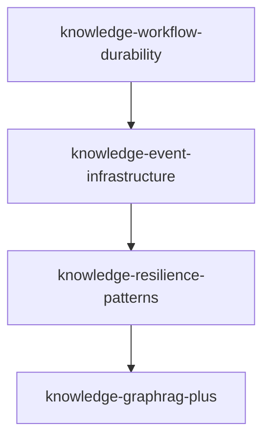

# Agent Prompts: Knowledge vs Effect-Ontology Audit

> Copy-paste prompts for specialized sub-agents.

---

## Prompt Index

| Phase | Agent | Section |
|-------|-------|---------|
| 1 | codebase-researcher | [Phase 1: Source Inventory](#phase-1-source-inventory) |
| 2 | doc-writer | [Phase 2: Capability Categorization](#phase-2-capability-categorization) |
| 3 | codebase-researcher | [Phase 3: Gap Analysis](#phase-3-gap-analysis) |
| 4 | mcp-researcher | [Phase 4: Technology Alignment](#phase-4-technology-alignment) |
| 5 | doc-writer | [Phase 5: Pattern Documentation](#phase-5-pattern-documentation) |
| 6 | doc-writer | [Phase 6: Spec Roadmap Generation](#phase-6-spec-roadmap-generation) |

---

## Phase 1: Source Inventory

**Agent**: `codebase-researcher`

### Prompt

```
You are performing Phase 1 of the knowledge-effect-ontology-audit spec: Source Inventory.

### Objective

Catalog every TypeScript source file in `.repos/effect-ontology/packages/@core-v2/src/` with:
- File path
- Purpose (1-2 sentences)
- Effect packages imported
- Internal dependencies
- Key exports

### Scope

All `.ts` files in:
```
.repos/effect-ontology/packages/@core-v2/src/
├── Cluster/
├── Contract/
├── Domain/ (Error/, Model/, Rdf/, Schema/)
├── Prompt/
├── Runtime/ (Persistence/)
├── Schema/
├── Service/ (LlmControl/)
├── Telemetry/
├── Utils/
└── Workflow/
```

### Output Format

Write to `specs/knowledge-effect-ontology-audit/outputs/EFFECT_ONTOLOGY_INVENTORY.md`:

```markdown
# Effect-Ontology Source Inventory

## Summary Statistics
- Total files: [count]
- By directory: [breakdown]

## Directory: Cluster/

| File | Purpose | Effect Packages | Internal Deps | Key Exports |
|------|---------|-----------------|---------------|-------------|
| BackpressureHandler.ts | Handles stream backpressure for entity processing | Stream, Effect, Chunk | Domain/Model/* | BackpressureHandler |
| ... | ... | ... | ... | ... |

## Directory: Contract/
[Continue for all directories]
```

### Critical Instructions

1. **DO NOT skip any files** - Every `.ts` file must appear in inventory
2. **Read actual file content** - Don't guess from filenames
3. **Document all imports** - Both Effect packages and internal dependencies
4. **Note unique patterns** - If a file uses an interesting Effect pattern, note it

### Verification

After completion:
- Count files: Should be 100+ entries
- Check coverage: All directories should have entries
- No placeholders: Every field should have actual content

### Checkpoint Strategy

If you reach 50 files, create a checkpoint noting progress before continuing.
```

---

## Phase 2: Capability Categorization

**Agent**: `doc-writer`

### Prompt

```
You are performing Phase 2 of the knowledge-effect-ontology-audit spec: Capability Categorization.

### Objective

Using the inventory from Phase 1, group all capabilities into 11 functional categories.

### Input

Read: `specs/knowledge-effect-ontology-audit/outputs/EFFECT_ONTOLOGY_INVENTORY.md`

### Categories

1. **Core Domain** - Models, schemas, errors, value objects
2. **Extraction Pipeline** - Text processing, LLM extraction, grounding
3. **Entity Resolution** - Clustering, similarity, deduplication
4. **RDF/Reasoning** - RDF store, SPARQL, RDFS inference
5. **Durability** - Workflows, activities, persistence
6. **Events** - Event bus, broadcasting, streaming, logging
7. **Resilience** - Circuit breaker, rate limiting, backpressure
8. **Runtime** - Layer composition, cluster, activity runners
9. **Contracts** - RPC definitions, progress streaming, SSE
10. **Telemetry** - Tracing, metrics, cost calculation
11. **Utilities** - IRI handling, text processing, similarity scoring

### Output Format

Write to `specs/knowledge-effect-ontology-audit/outputs/CAPABILITY_CATEGORIES.md`:

```markdown
# Effect-Ontology Capability Categories

## Category 1: Core Domain

### Description
Models, schemas, errors, and value objects that form the foundation of the domain layer.

### Why It Matters
Provides type-safe data structures for all other components.

### Files in Category
| File | Purpose | Key Exports |
|------|---------|-------------|
| Domain/Model/Entity.ts | Entity definition | Entity, EntityType |
| ... | ... | ... |

### Key Services/Classes
- Entity
- Ontology
- Relation
- ...

### Integration Points
- Used by: Extraction Pipeline, Entity Resolution
- Uses: Nothing (foundation layer)

---

## Category 2: Extraction Pipeline
[Continue for all 11 categories]
```

### Critical Instructions

1. **Every file must be categorized** - No files left out
2. **Some files may fit multiple categories** - Choose primary, note secondary
3. **Document integration points** - How categories connect
4. **Preserve detail from inventory** - Don't lose information

### Verification

- 11 categories documented
- Every file from inventory appears in exactly one category
- Integration points form coherent dependency graph
```

---

## Phase 3: Gap Analysis

**Agent**: `codebase-researcher`

### Prompt

```
You are performing Phase 3 of the knowledge-effect-ontology-audit spec: Gap Analysis.

### Objective

Compare each capability from effect-ontology against beep-effect knowledge slice.

### Inputs

1. Categories: `specs/knowledge-effect-ontology-audit/outputs/CAPABILITY_CATEGORIES.md`
2. beep-effect knowledge: `packages/knowledge/{domain,tables,server,client}/src/`

### Gap Types

- **None** - Feature parity achieved
- **Partial** - Functionality exists but incomplete
- **Missing** - No equivalent implementation
- **Different** - Different approach, evaluate alignment

### Priority Levels

- **P0** - Critical (blocks core functionality)
- **P1** - High (required for production)
- **P2** - Medium (nice to have)
- **P3** - Low (future consideration)

### Output Format

Write to `specs/knowledge-effect-ontology-audit/outputs/GAP_ANALYSIS.md`:

```markdown
# Gap Analysis: Effect-Ontology vs Beep-Effect Knowledge

## Summary

| Gap Type | Count |
|----------|-------|
| None | X |
| Partial | Y |
| Missing | Z |
| Different | W |

## Category 1: Core Domain

| Capability | effect-ontology | beep-effect | Gap Type | Priority | Notes |
|------------|-----------------|-------------|----------|----------|-------|
| Entity Model | ✓ Full (Domain/Model/Entity.ts) | ✓ Full (domain/src/entities/) | None | - | Aligned |
| Ontology Schema | ✓ Full | ✓ Partial | Partial | P1 | Missing version field |
| ... | ... | ... | ... | ... | ... |

## Category 2: Extraction Pipeline
[Continue for all 11 categories]
```

### Domain-Specific Assessment

For each capability, consider wealth management requirements:

| Capability | Wealth Management Requirement |
|------------|------------------------------|
| Entity Resolution | Cross-system identity linking (Salesforce, Schwab, Gmail) |
| Provenance | FINRA/SEC audit trails, fiduciary documentation |
| Events | Real-time advisor dashboards, compliance logging |
| Durability | Long-running client onboarding (days/weeks) |
| GraphRAG | Relationship-aware retrieval for AI advisors |

### Critical Instructions

1. **Search thoroughly** - Use Glob and Grep to find equivalents
2. **Compare implementations** - Don't just match names
3. **No "Unknown" entries** - Every capability must have assessment
4. **Document evidence** - File paths for both sides

### Verification

- Every capability from categories has assessment
- No "Unknown" gap types
- All priorities assigned (P0-P3)
```

---

## Phase 4: Technology Alignment

**Agent**: `mcp-researcher`

### Prompt

```
You are performing Phase 4 of the knowledge-effect-ontology-audit spec: Technology Alignment.

### Objective

Document all Effect ecosystem packages used in effect-ontology and verify alignment with beep-effect.

### Packages to Check

```typescript
// Core Effect
effect                    // Runtime, data types, services
@effect/platform          // Cross-platform I/O
@effect/platform-bun      // Bun runtime
@effect/sql               // Database abstraction
@effect/sql-pg            // PostgreSQL client
@effect/sql-drizzle       // Drizzle ORM integration

// AI/LLM
@effect/ai                // Language model abstraction
@effect/ai-anthropic      // Anthropic provider
@effect/ai-openai         // OpenAI provider

// Durability
@effect/workflow          // Durable workflows
@effect/cluster           // Distributed execution

// Experimental
@effect/experimental      // EventLog, EventJournal

// Observability
@effect/opentelemetry     // Tracing/metrics
```

### Output Format

Write to `specs/knowledge-effect-ontology-audit/outputs/TECHNOLOGY_ALIGNMENT.md`:

```markdown
# Technology Alignment: Effect Packages

## Summary

| Package | effect-ontology | beep-effect | Status |
|---------|-----------------|-------------|--------|
| effect | 3.x | 3.x | Aligned |
| @effect/ai | ✓ Used | ✓ Used | Aligned |
| @effect/workflow | ✓ Used | ✗ Missing | Action Required |
| ... | ... | ... | ... |

## Package Details

### effect

**effect-ontology Usage**:
- Services: Effect.Service pattern throughout
- Streams: Used for extraction pipeline
- Errors: Data.TaggedError pattern

**beep-effect Usage**:
- Services: Effect.Service pattern throughout
- Streams: Used for extraction pipeline
- Errors: Data.TaggedError pattern

**Status**: Aligned

**Required Changes**: None

---

### @effect/workflow
[Continue for all packages]
```

### Critical Instructions

1. **Check package.json files** - Verify installed packages
2. **Check imports in source** - Verify actual usage
3. **Note API usage patterns** - What modules/functions are used
4. **Document version requirements** - Any version constraints
```

---

## Phase 5: Pattern Documentation

**Agent**: `doc-writer`

### Prompt

```
You are performing Phase 5 of the knowledge-effect-ontology-audit spec: Pattern Documentation.

### Objective

Extract reusable Effect patterns from effect-ontology for adoption in beep-effect.

### Input

1. Inventory: `specs/knowledge-effect-ontology-audit/outputs/EFFECT_ONTOLOGY_INVENTORY.md`
2. Categories: `specs/knowledge-effect-ontology-audit/outputs/CAPABILITY_CATEGORIES.md`

### Pattern Categories

1. **Service Definition** - Effect.Service with accessors
2. **Layer Composition** - Dependency ordering, merging
3. **Error Handling** - Tagged errors, recovery strategies
4. **Stream Processing** - Backpressure, cancellation
5. **State Management** - Ref, Deferred, FiberMap
6. **Event Patterns** - PubSub, EventJournal, broadcasting
7. **Testing Patterns** - Layer sharing, mocking
8. **Configuration** - Environment-based config

### Output Format

Write to `specs/knowledge-effect-ontology-audit/outputs/PATTERN_CATALOG.md`:

```markdown
# Effect Pattern Catalog

## Pattern 1: Service Definition with Accessors

### Problem
Define a service with type-safe access and dependency injection.

### Effect-Ontology Example

**File**: `Service/EntityExtractor.ts`

```typescript
export class EntityExtractor extends Effect.Service<EntityExtractor>()(
  "@effect-ontology/EntityExtractor",
  {
    accessors: true,
    effect: Effect.gen(function* () {
      const llm = yield* LanguageModel
      return {
        extract: (text: string) => Effect.gen(function* () {
          // implementation
        }).pipe(Effect.withSpan("EntityExtractor.extract"))
      }
    })
  }
) {}
```

### Applicability to beep-effect
Direct adoption. Same pattern should be used for all knowledge services.

---

## Pattern 2: Layer Composition
[Continue for all 8 pattern categories]
```

### Critical Instructions

1. **Include actual code examples** - Not just descriptions
2. **Note file paths** - Where pattern is used
3. **Assess applicability** - How it applies to beep-effect
4. **Document variations** - Multiple examples if pattern varies
```

---

## Phase 6: Spec Roadmap Generation

**Agent**: `doc-writer`

### Prompt

```
You are performing Phase 6 of the knowledge-effect-ontology-audit spec: Spec Roadmap Generation.

### Objective

Synthesize audit findings into actionable spec definitions.

### Inputs

1. Gap Analysis: `specs/knowledge-effect-ontology-audit/outputs/GAP_ANALYSIS.md`
2. Pattern Catalog: `specs/knowledge-effect-ontology-audit/outputs/PATTERN_CATALOG.md`
3. Technology Alignment: `specs/knowledge-effect-ontology-audit/outputs/TECHNOLOGY_ALIGNMENT.md`

### Deliverables

1. **SPEC_ROADMAP.md** - Ordered list with dependencies
2. **SPEC_DEFINITIONS.md** - Detailed scope per spec
3. **SPEC_GENERATOR_PROMPT.md** - Prompt for spec creation
4. **DOMAIN_ADAPTATION_GUIDE.md** - Wealth management guidance

### Output: SPEC_ROADMAP.md

```markdown
# Spec Roadmap

## Dependency Graph



## Ordered Spec List

| Order | Spec Name | Priority | Depends On | Phases | Effort |
|-------|-----------|----------|------------|--------|--------|
| 1 | knowledge-workflow-durability | P0 | None | 4 | L |
| 2 | knowledge-event-infrastructure | P1 | #1 | 3 | M |
| ... | ... | ... | ... | ... | ... |
```

### Output: SPEC_DEFINITIONS.md

```markdown
# Spec Definitions

## Spec: knowledge-workflow-durability

### Purpose
Integrate @effect/workflow for durable extraction pipeline.

### Scope
- @effect/workflow integration
- @effect/cluster persistence
- Activity definitions for extraction stages

### Files to Create/Modify
- packages/knowledge/server/src/Workflow/
- packages/knowledge/server/src/Runtime/

### Success Criteria
- [ ] Workflows survive server restart
- [ ] Progress tracking across activities
- [ ] Checkpoint/resume capability

### Reference Files (effect-ontology)
- Workflow/ExtractionWorkflow.ts
- Runtime/ClusterRuntime.ts
- ...

---

## Spec: knowledge-event-infrastructure
[Continue for all specs]
```

### Output: DOMAIN_ADAPTATION_GUIDE.md

```markdown
# Domain Adaptation Guide: Wealth Management

## Entity Type Mappings

| effect-ontology | todox (Wealth) | Notes |
|-----------------|----------------|-------|
| GenericEntity | Client, Account, Holding | Domain-specific |
| Relation | owns, beneficiary_of, advises | Financial predicates |
| ... | ... | ... |

## Compliance Requirements

### FINRA/SEC Audit Trails
- Every extraction must have complete provenance
- Timestamp, source document, confidence scores

### Fiduciary Documentation
- Suitability evidence chains
- Client communication tracking

## Multi-Source Integration

### Cross-System Identity Linking
- owl:sameAs relationships
- Confidence scoring for matches

## Household Relationship Modeling
[Continue with all domain adaptations]
```

### Critical Instructions

1. **Group related gaps into specs** - Don't create too many small specs
2. **Establish clear dependencies** - What must be done first
3. **Include domain requirements** - Wealth management specifics
4. **Make specs actionable** - Clear scope, success criteria
```

---

## Prompt Adaptation Guidelines

### After Each Phase

Update prompts based on learnings:

1. **Add discoveries** - New patterns or gotchas found
2. **Refine scope** - Better understanding of boundaries
3. **Update references** - File paths that changed
4. **Note anti-patterns** - What to avoid

### Prompt Template for Updates

```markdown
### Prompt Update Log

**Date**: [Date]
**Phase**: [N]
**Change**: [What changed in prompt]
**Reason**: [Why it changed]
```

---

## Agent Selection Rationale

| Agent | When to Use | Strengths |
|-------|-------------|-----------|
| codebase-researcher | Large-scale file reading | Efficient exploration, parallel reads |
| doc-writer | Document generation | Structured output, template following |
| mcp-researcher | Package/API research | External documentation access |
| reflector | Post-phase analysis | Pattern extraction, learning synthesis |
