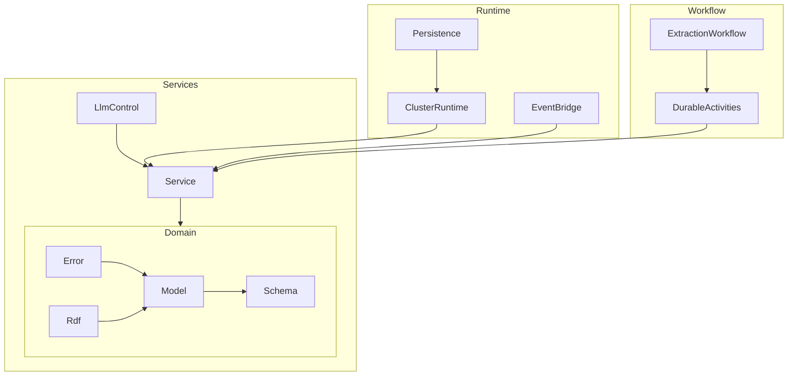

# Effect-Ontology Complete Source Inventory

> File-by-file catalog of `.repos/effect-ontology/packages/@core-v2/src/`

---

## Inventory Statistics

| Metric | Count |
|--------|-------|
| Total Files | ___ |
| Services | ___ |
| Schemas | ___ |
| Errors | ___ |
| Utilities | ___ |

---

## Directory: Cluster/

### Cluster/BackpressureHandler.ts

**Purpose**: Intelligent stream flow control that prioritizes critical events and samples non-critical events under load.

**Effect Packages**:
- `effect/Effect`
- `effect/Stream`
- `effect/Queue`
- `effect/Fiber`

**Internal Dependencies**:
- `Domain/Schema/ProgressEvent`

**Key Exports**:
- `withBackpressure(config): (stream) => Stream<ProgressEvent>`
- `withBackpressureMetered(config): (stream) => Stream<ProgressEvent>`
- `BackpressureConfig` (interface)

**Notable Patterns**:
- Critical event classification (never dropped)
- Load-factor based sampling
- Scoped resource management

---

### Cluster/ExtractionEntityHandler.ts

**Purpose**: ___

**Effect Packages**:
- ___

**Internal Dependencies**:
- ___

**Key Exports**:
- ___

**Notable Patterns**:
- ___

---

## Directory: Contract/

### Contract/ProgressStreaming.ts

**Purpose**: ___

**Effect Packages**:
- ___

**Internal Dependencies**:
- ___

**Key Exports**:
- ___

**Notable Patterns**:
- ___

---

## Directory: Domain/

### Domain/Error/*.ts

| File | Error Type | Fields | Recovery Strategy |
|------|------------|--------|-------------------|
| ___.ts | ___ | ___ | ___ |

### Domain/Model/*.ts

| File | Model | Key Fields | Relationships |
|------|-------|------------|---------------|
| ___.ts | ___ | ___ | ___ |

### Domain/Rdf/*.ts

| File | Purpose | Exports |
|------|---------|---------|
| ___.ts | ___ | ___ |

### Domain/Schema/*.ts

| File | Schema | Validation Rules |
|------|--------|------------------|
| ___.ts | ___ | ___ |

---

## Directory: Prompt/

### Prompt/*.ts

| File | Purpose | Template Type |
|------|---------|---------------|
| ___.ts | ___ | ___ |

---

## Directory: Runtime/

### Runtime/ActivityRunner.ts

**Purpose**: ___

**Effect Packages**:
- ___

**Internal Dependencies**:
- ___

**Key Exports**:
- ___

**Notable Patterns**:
- ___

---

### Runtime/CircuitBreaker.ts

**Purpose**: ___

**Effect Packages**:
- ___

**Internal Dependencies**:
- ___

**Key Exports**:
- ___

**Notable Patterns**:
- ___

---

### Runtime/ClusterRuntime.ts

**Purpose**: ___

**Effect Packages**:
- ___

**Internal Dependencies**:
- ___

**Key Exports**:
- ___

**Notable Patterns**:
- ___

---

### Runtime/EventBridge.ts

**Purpose**: ___

**Effect Packages**:
- ___

**Internal Dependencies**:
- ___

**Key Exports**:
- ___

**Notable Patterns**:
- ___

---

### Runtime/EventBroadcastRouter.ts

**Purpose**: ___

**Effect Packages**:
- ___

**Internal Dependencies**:
- ___

**Key Exports**:
- ___

**Notable Patterns**:
- ___

---

### Runtime/EventStreamRouter.ts

**Purpose**: ___

**Effect Packages**:
- ___

**Internal Dependencies**:
- ___

**Key Exports**:
- ___

**Notable Patterns**:
- ___

---

### Runtime/InferenceRouter.ts

**Purpose**: ___

**Effect Packages**:
- ___

**Internal Dependencies**:
- ___

**Key Exports**:
- ___

**Notable Patterns**:
- ___

---

### Runtime/Persistence/*.ts

| File | Purpose | Tables Created |
|------|---------|----------------|
| ___.ts | ___ | ___ |

---

## Directory: Schema/

### Schema/*.ts

| File | Purpose | Key Schemas |
|------|---------|-------------|
| ___.ts | ___ | ___ |

---

## Directory: Service/

### Service/*.ts (Top-Level)

| File | Service Name | Purpose | Dependencies |
|------|--------------|---------|--------------|
| ___.ts | ___ | ___ | ___ |

### Service/LlmControl/*.ts

| File | Service Name | Purpose | Dependencies |
|------|--------------|---------|--------------|
| ___.ts | ___ | ___ | ___ |

---

## Directory: Telemetry/

### Telemetry/*.ts

| File | Purpose | Metrics/Spans |
|------|---------|---------------|
| ___.ts | ___ | ___ |

---

## Directory: Utils/

### Utils/*.ts

| File | Purpose | Key Functions |
|------|---------|---------------|
| ___.ts | ___ | ___ |

---

## Directory: Workflow/

### Workflow/*.ts

| File | Purpose | Workflow/Activity |
|------|---------|-------------------|
| ___.ts | ___ | ___ |

---

## Dependency Graph

---

## Cross-References

### Services by Dependency Count

| Service | Dependents | Dependencies |
|---------|------------|--------------|
| ___ | ___ | ___ |

### Most-Used Effect Packages

| Package | Import Count | Primary Usage |
|---------|--------------|---------------|
| effect/Effect | ___ | ___ |
| effect/Stream | ___ | ___ |
| ___ | ___ | ___ |
