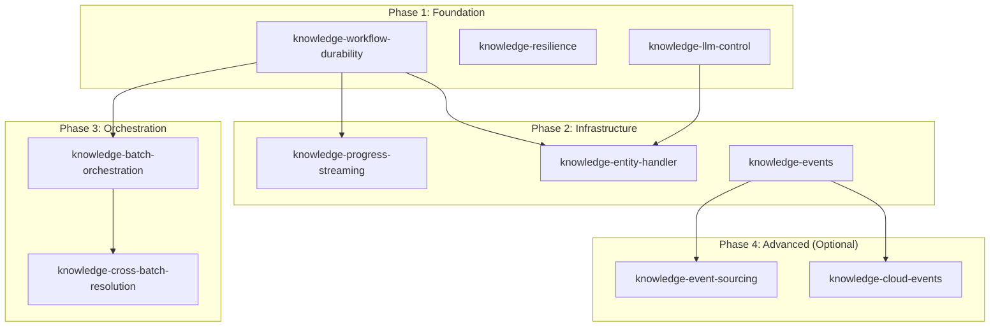

# Spec Roadmap: Knowledge Slice Feature Parity

> Ordered specification list for achieving complete feature parity with effect-ontology.

---

## Roadmap Overview

---

## Phase 1: Foundation (Weeks 1-4)

### 1.1 knowledge-workflow-durability

**Priority**: P0 (Critical)
**Effort**: Large (4 phases)
**Dependencies**: None

**Purpose**: Integrate `@effect/workflow` and `@effect/cluster` for durable extraction pipelines.

**Key Deliverables**:
- [ ] PostgresLayer.ts - SqlMessageStorage + SqlRunnerStorage
- [ ] ClusterRuntime.ts - SingleRunner layer composition
- [ ] ExtractionWorkflow.ts - Workflow.make definition
- [ ] DurableActivities.ts - Activity.make for each stage
- [ ] WorkflowOrchestrator.ts - execute/poll/interrupt/resume API

**Reference Files**:
- `.repos/effect-ontology/packages/@core-v2/src/Runtime/Persistence/PostgresLayer.ts`
- `.repos/effect-ontology/packages/@core-v2/src/Runtime/ClusterRuntime.ts`
- `.repos/effect-ontology/packages/@core-v2/src/Service/WorkflowOrchestrator.ts`
- `.repos/effect-ontology/packages/@core-v2/src/Workflow/DurableActivities.ts`

**Success Criteria**:
- Server starts and auto-creates cluster tables
- Extraction can be started, interrupted, and resumed
- Kill server mid-extraction → restart → extraction resumes

---

### 1.2 knowledge-resilience

**Priority**: P1 (High)
**Effort**: Medium (2 phases)
**Dependencies**: None (can run parallel with 1.1)

**Purpose**: Add resilience patterns for LLM API protection.

**Key Deliverables**:
- [ ] CircuitBreaker.ts - 3-state machine (Closed/Open/Half-Open)
- [ ] Integration with LLM calls
- [ ] Backpressure handler for streams

**Reference Files**:
- `.repos/effect-ontology/packages/@core-v2/src/Runtime/CircuitBreaker.ts`
- `.repos/effect-ontology/packages/@core-v2/src/Cluster/BackpressureHandler.ts`

**Success Criteria**:
- 5 consecutive LLM failures → circuit opens
- After timeout → circuit enters half-open for testing
- 2 successes in half-open → circuit closes

---

### 1.3 knowledge-llm-control

**Priority**: P1 (High)
**Effort**: Medium (2 phases)
**Dependencies**: None (can run parallel with 1.1)

**Purpose**: Add LLM control services for token budgeting, timeouts, and rate limiting.

**Key Deliverables**:
- [ ] TokenBudgetService.ts - Per-stage token allocation
- [ ] StageTimeoutService.ts - Per-stage timeout enforcement
- [ ] LlmSemaphore.ts - Concurrency control

**Reference Files**:
- `.repos/effect-ontology/packages/@core-v2/src/Service/LlmControl/TokenBudgetService.ts`
- `.repos/effect-ontology/packages/@core-v2/src/Service/LlmControl/StageTimeoutService.ts`

**Success Criteria**:
- Extraction respects token budget per stage
- Stages timeout gracefully with partial results
- Concurrent LLM calls limited

---

## Phase 2: Infrastructure (Weeks 5-8)

### 2.1 knowledge-progress-streaming

**Priority**: P1 (High)
**Effort**: Medium (2 phases)
**Dependencies**: knowledge-workflow-durability

**Purpose**: Implement SSE progress streaming for real-time extraction updates.

**Key Deliverables**:
- [ ] ProgressEvent schema (20+ event types)
- [ ] SSE endpoint in HTTP router
- [ ] Activity → ProgressEvent emission
- [ ] Backpressure integration

**Reference Files**:
- `.repos/effect-ontology/packages/@core-v2/src/Contract/ProgressStreaming.ts`
- `.repos/effect-ontology/packages/@core-v2/src/Domain/Schema/EventSchema.ts`

**Success Criteria**:
- Client receives real-time progress events
- Critical events never dropped
- Non-critical events sampled under load

---

### 2.2 knowledge-entity-handler

**Priority**: P1 (High)
**Effort**: Large (3 phases)
**Dependencies**: knowledge-workflow-durability, knowledge-llm-control

**Purpose**: Implement distributed actor pattern for extraction with full LLM control.

**Key Deliverables**:
- [ ] ExtractionEntity.ts - Entity.make with RPC definitions
- [ ] ExtractionEntityHandler.ts - 5-stage streaming pipeline
- [ ] Cancellation registry (Deferred-based)
- [ ] Cache lookup support

**Reference Files**:
- `.repos/effect-ontology/packages/@core-v2/src/Cluster/ExtractionEntity.ts`
- `.repos/effect-ontology/packages/@core-v2/src/Cluster/ExtractionEntityHandler.ts`

**Success Criteria**:
- Extractions routed by idempotency key
- Cancel request interrupts running extraction
- Cached results returned without re-extraction

---

### 2.3 knowledge-events

**Priority**: P2 (Medium)
**Effort**: Large (3 phases)
**Dependencies**: None

**Purpose**: Implement event infrastructure for internal pub/sub and broadcasting.

**Key Deliverables**:
- [ ] EventBusService.ts - Event publication and subscription
- [ ] EventBridge.ts - EventBus → WebSocket bridge
- [ ] EventBroadcastHub.ts - Multi-client broadcast
- [ ] EventSchema.ts - Typed event definitions

**Reference Files**:
- `.repos/effect-ontology/packages/@core-v2/src/Service/EventBus.ts`
- `.repos/effect-ontology/packages/@core-v2/src/Runtime/EventBridge.ts`
- `.repos/effect-ontology/packages/@core-v2/src/Runtime/EventBroadcastRouter.ts`
- `.repos/effect-ontology/packages/@core-v2/src/Domain/Schema/EventSchema.ts`

**Success Criteria**:
- Events published to EventBus
- WebSocket clients receive broadcasts
- Multiple clients can subscribe per ontology

---

## Phase 3: Orchestration (Weeks 9-12)

### 3.1 knowledge-batch-orchestration

**Priority**: P2 (Medium)
**Effort**: Medium (2 phases)
**Dependencies**: knowledge-workflow-durability

**Purpose**: Implement batch state machine for multi-document processing.

**Key Deliverables**:
- [ ] BatchState.ts - State machine (Pending | Preprocessing | Extracting | ...)
- [ ] BatchWorkflow.ts - Workflow for batch coordination
- [ ] State transition logic
- [ ] Batch retry and recovery

**Reference Files**:
- `.repos/effect-ontology/packages/@core-v2/src/Domain/Model/BatchWorkflow.ts`
- `.repos/effect-ontology/packages/@core-v2/src/Workflow/BatchExtractionWorkflow.ts`

**Success Criteria**:
- Batch progresses through states correctly
- Failed documents retried within batch
- Batch completes even if some documents fail

---

### 3.2 knowledge-cross-batch-resolution

**Priority**: P2 (Medium)
**Effort**: Medium (2 phases)
**Dependencies**: knowledge-batch-orchestration

**Purpose**: Coordinate entity resolution across multiple batches.

**Key Deliverables**:
- [ ] Cross-batch entity resolution activity
- [ ] Deduplication across documents
- [ ] Canonical entity selection

**Reference Files**:
- `.repos/effect-ontology/packages/@core-v2/src/Workflow/EntityResolutionWorkflow.ts`

**Success Criteria**:
- Entities from different batches merged correctly
- Canonical representatives selected
- SameAs links created for duplicates

---

## Phase 4: Advanced (Optional, Weeks 13+)

### 4.1 knowledge-event-sourcing

**Priority**: P3 (Low)
**Effort**: Large (3 phases)
**Dependencies**: knowledge-events

**Purpose**: Full event sourcing with CQRS pattern.

**Key Deliverables**:
- [ ] EventLogStorage.ts - Encrypted event persistence
- [ ] EventStreamRouter.ts - Bidirectional sync
- [ ] Audit trail support

**Reference Files**:
- `.repos/effect-ontology/packages/@core-v2/src/Runtime/Persistence/EventLogStorage.ts`
- `.repos/effect-ontology/packages/@core-v2/src/Runtime/EventStreamRouter.ts`

---

### 4.2 knowledge-cloud-events

**Priority**: P3 (Low)
**Effort**: Medium (2 phases)
**Dependencies**: knowledge-events

**Purpose**: Cloud Pub/Sub integration for horizontal scaling.

**Key Deliverables**:
- [ ] PubSubClient.ts - Google Cloud Pub/Sub wrapper
- [ ] EventBusPubSubBridge.ts - EventJournal → Pub/Sub
- [ ] Multi-instance event distribution

**Reference Files**:
- `.repos/effect-ontology/packages/@core-v2/src/Service/PubSubClient.ts`

---

## Dependency Matrix

| Spec | Depends On | Enables |
|------|------------|---------|
| knowledge-workflow-durability | - | progress-streaming, entity-handler, batch-orchestration |
| knowledge-resilience | - | - |
| knowledge-llm-control | - | entity-handler |
| knowledge-progress-streaming | workflow-durability | - |
| knowledge-entity-handler | workflow-durability, llm-control | - |
| knowledge-events | - | event-sourcing, cloud-events |
| knowledge-batch-orchestration | workflow-durability | cross-batch-resolution |
| knowledge-cross-batch-resolution | batch-orchestration | - |
| knowledge-event-sourcing | events | - |
| knowledge-cloud-events | events | - |

---

## Effort Summary

| Spec | Size | Phases | Weeks |
|------|------|--------|-------|
| knowledge-workflow-durability | L | 4 | 3-4 |
| knowledge-resilience | M | 2 | 1-2 |
| knowledge-llm-control | M | 2 | 1-2 |
| knowledge-progress-streaming | M | 2 | 1-2 |
| knowledge-entity-handler | L | 3 | 2-3 |
| knowledge-events | L | 3 | 2-3 |
| knowledge-batch-orchestration | M | 2 | 1-2 |
| knowledge-cross-batch-resolution | M | 2 | 1-2 |
| knowledge-event-sourcing | L | 3 | 2-3 |
| knowledge-cloud-events | M | 2 | 1-2 |

**Total (P0-P2)**: ~12-16 weeks
**Total (including P3)**: ~16-20 weeks

---

## Recommended Execution Order

### Sprint 1-2: Foundation
1. knowledge-workflow-durability (start)
2. knowledge-resilience (parallel)
3. knowledge-llm-control (parallel)

### Sprint 3-4: Foundation Completion + Infrastructure Start
4. knowledge-workflow-durability (complete)
5. knowledge-progress-streaming (start)
6. knowledge-entity-handler (start)

### Sprint 5-6: Infrastructure
7. knowledge-progress-streaming (complete)
8. knowledge-entity-handler (complete)
9. knowledge-events (start)

### Sprint 7-8: Orchestration
10. knowledge-events (complete)
11. knowledge-batch-orchestration
12. knowledge-cross-batch-resolution

### Sprint 9+: Advanced (if needed)
13. knowledge-event-sourcing
14. knowledge-cloud-events

---

## Notes

_Additional observations, scheduling considerations, and resource requirements go here._
