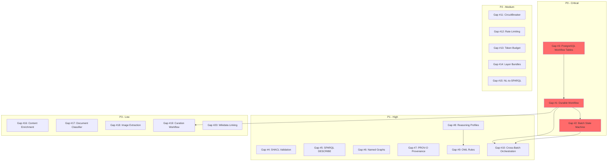

# Gap Analysis (Corrected)

## Executive Summary

The knowledge-slice in beep-effect has achieved substantial parity with the effect-ontology reference implementation across semantic infrastructure, entity resolution, and GraphRAG capabilities. Since the initial gap analysis, **10 major gaps have been closed**, including SPARQL query support, forward-chaining reasoning, triple store, RDF serialization, grounded answer generation, citation validation, reasoning traces, cross-batch entity resolution via EntityRegistry with BloomFilter, cumulative entity registry, and the immutable evidence layer (MentionRecord).

The remaining gaps concentrate in two areas: **durable workflow execution** (no crash recovery, no batch state machine, no cross-batch orchestration) and **semantic validation/enrichment** (no SHACL validation, no PROV-O provenance, incomplete RDFS rule coverage). The workflow gaps represent the most significant production-readiness risk, while the semantic gaps limit data quality enforcement and interoperability.

**Key Statistics:**
- Original capability gaps identified: 40
- Gaps now closed: 10
- Remaining actionable gaps: 20
- P0 (Critical): 3
- P1 (High): 7
- P2 (Medium): 5
- P3 (Low): 5

**Estimated total implementation effort for remaining gaps:** 10-16 weeks

---

## Closed Gaps (Previously Listed, Now Implemented)

The following capabilities have been implemented in the knowledge-slice and are no longer gaps. They are documented here for traceability.

| # | Previously Listed Gap | Implementation | Key Files |
|---|----------------------|----------------|-----------|
| C1 | SPARQL Query Support | SparqlService with SELECT, CONSTRUCT, ASK via sparqljs parser + custom QueryExecutor | `packages/knowledge/server/src/Sparql/SparqlService.ts`, `QueryExecutor.ts`, `SparqlParser.ts`, `FilterEvaluator.ts` |
| C2 | Forward-Chaining Reasoner | ForwardChainer with iterative fixed-point inference + ReasonerService wrapper | `packages/knowledge/server/src/Reasoning/ForwardChainer.ts`, `ReasonerService.ts` |
| C3 | Triple Store | RdfStoreService wrapping N3.Store with addQuads, match, remove operations | `packages/knowledge/server/src/Rdf/RdfStoreService.ts` |
| C4 | RDF Serialization | Serializer supporting Turtle and N-Triples via N3.Writer, plus Turtle parsing | `packages/knowledge/server/src/Rdf/Serializer.ts` |
| C5 | Grounded Answer Generation | GroundedAnswerGenerator using @effect/ai LanguageModel with citation-aware prompting | `packages/knowledge/server/src/GraphRAG/GroundedAnswerGenerator.ts`, `PromptTemplates.ts` |
| C6 | Citation Validation | CitationValidator using SPARQL ASK queries + reasoning-based inference verification | `packages/knowledge/server/src/GraphRAG/CitationValidator.ts` |
| C7 | Reasoning Trace | ReasoningTraceFormatter producing step-by-step inference chains with depth calculation | `packages/knowledge/server/src/GraphRAG/ReasoningTraceFormatter.ts` |
| C8 | Cross-Batch Entity Resolution | EntityRegistry with BloomFilter for probabilistic pre-screening + embedding similarity ranking | `packages/knowledge/server/src/EntityResolution/EntityRegistry.ts`, `BloomFilter.ts` |
| C9 | Cumulative Entity Registry | EntityRegistry persists across batches via EntityRepo with bloom filter + embedding lookup | `packages/knowledge/server/src/EntityResolution/EntityRegistry.ts` |
| C10 | Immutable Evidence Layer | MentionRecord entity with model, table, and repository -- separate from mutable Entity | `packages/knowledge/domain/src/entities/MentionRecord/MentionRecord.model.ts`, `packages/knowledge/tables/src/tables/mention-record.table.ts`, `packages/knowledge/server/src/db/repos/MentionRecord.repo.ts` |

---

## Priority Scale

| Priority | Definition | Example |
|----------|-----------|---------|
| P0 | Critical - Blocks core functionality, causes data loss, or prevents production deployment | No durable workflow execution |
| P1 | High - Significant feature gap affecting production readiness or data quality | No SHACL validation |
| P2 | Medium - Enhancement opportunity improving quality, UX, or operational efficiency | No PROV-O provenance tracking |
| P3 | Low - Nice to have, polish items, future considerations | No document classifier |

## Complexity Scale

| Complexity | Definition | Typical Effort | Example |
|------------|-----------|----------------|---------|
| S | Small - Isolated change, clear implementation | 1-2 days | Add SPARQL DESCRIBE support |
| M | Medium - Multiple files, some design decisions | 3-5 days | Add SHACL validation service |
| L | Large - New subsystem, significant refactoring | 1-2 weeks | Implement batch state machine |
| XL | Extra Large - Major architectural change | 2-4 weeks | Full @effect/workflow integration |

---

## Gaps by Priority

### P0 - Critical (Blocks Production)

| # | Gap | Description | Complexity | Dependencies | Reference Files |
|---|-----|-------------|------------|--------------|-----------------|
| 1 | No Durable Workflow Execution | Extraction pipelines have no crash recovery; jobs lost on restart | XL | PostgreSQL persistence tables (Gap #3) | `effect-ontology: Service/WorkflowOrchestrator.ts` |
| 2 | No Batch State Machine | No PENDING/EXTRACTING/.../COMPLETED state tracking with SSE streaming | L | Workflow persistence (Gap #1) | `effect-ontology: Service/WorkflowOrchestrator.ts`, `Domain/Events/ExtractionEvents.ts` |
| 3 | No PostgreSQL Workflow Persistence | Missing tables for @effect/workflow messages, runners, sharding | M | None | `effect-ontology: Runtime/Persistence/PostgresLayer.ts` |

---

#### Gap #1: No Durable Workflow Execution

**Description**: The ExtractionPipeline runs as a transient Effect with no durability guarantees. If the process crashes mid-extraction, all progress is lost. effect-ontology uses `@effect/workflow` to journal activities to PostgreSQL, enabling automatic resume from the last completed activity.

**effect-ontology Reference**:
- `packages/@core-v2/src/Service/WorkflowOrchestrator.ts` - Durable workflow definition with idempotency keys
- `packages/@core-v2/src/Runtime/Persistence/PostgresLayer.ts` - PostgreSQL persistence adapter
- `packages/@core-v2/src/Domain/Workflow/ExtractionWorkflow.ts` - Workflow activities

**knowledge-slice Current State**:
- `packages/knowledge/server/src/Extraction/ExtractionPipeline.ts` runs as a single transient Effect pipeline
- No journaling, no activity checkpointing, no resume capability
- Pipeline stages (mention extraction, entity extraction, relation extraction, grounding, resolution) all execute in a single Effect.gen block

**Impact**:
- Long-running extractions (large documents, slow LLM calls) cannot recover from failures
- No visibility into extraction progress for operational monitoring
- Production deployments risk data loss on any interruption
- Cannot implement pause/resume for user-facing workflows

**Complexity**: XL (2-4 weeks)
- Requires new tables for workflow state, messages, and runner coordination
- ExtractionPipeline must be refactored into discrete workflow activities
- SSE streaming for real-time progress updates
- Sharding strategy for horizontal scaling

**Dependencies**:
- PostgreSQL workflow tables (Gap #3) - Hard dependency
- @effect/workflow package integration

**Estimated Effort**: 4 weeks

---

#### Gap #2: No Batch State Machine

**Description**: Extractions in knowledge-slice have no formal state transitions. effect-ontology tracks PENDING -> EXTRACTING -> RESOLVING -> EMBEDDING -> COMPLETED with event emission for SSE streaming to clients.

**effect-ontology Reference**:
- `packages/@core-v2/src/Service/WorkflowOrchestrator.ts` - State machine transitions
- `packages/@core-v2/src/Domain/Events/ExtractionEvents.ts` - Event definitions
- `packages/@core-v2/src/Domain/Model/BatchWorkflow.ts` - BatchState union type

**knowledge-slice Current State**:
- `ExtractionPipeline.run()` logs progress via `Effect.logInfo` but has no formal state tracking
- `ExtractionResult.stats` provides post-hoc statistics only
- No PubSub integration, no SSE endpoint

**Impact**:
- No real-time progress visibility for users
- Cannot pause/resume extractions
- Operational dashboards lack extraction status
- Cannot implement progress bars or stage-level error reporting in the UI

**Complexity**: L (1-2 weeks)
- Define state machine with Effect State or Schema.Union of TaggedStructs
- Event emission via Effect PubSub
- SSE endpoint integration
- Can implement in-memory state machine first, then persist via Gap #1

**Dependencies**:
- Workflow persistence (Gap #1) for durable state -- soft dependency (can start with in-memory)

**Estimated Effort**: 1.5 weeks

---

#### Gap #3: No PostgreSQL Workflow Persistence

**Description**: Missing database tables required for @effect/workflow persistence: workflow messages, runner state, sharding configuration.

**effect-ontology Reference**:
- `packages/@core-v2/src/Runtime/Persistence/PostgresLayer.ts`
- `packages/@core-v2/src/Infrastructure/Migrations/workflow_tables.ts`

**knowledge-slice Current State**:
- `packages/knowledge/tables/` has extraction, entity, relation, mention-record, embedding, merge-history tables but no workflow tables
- No Drizzle schema for workflow state

**Impact**:
- Blocks durable workflow implementation (Gap #1)
- No foundation for distributed workflow coordination

**Complexity**: M (3-5 days)
- Create Drizzle table definitions for workflow state, activity journal, runner tracking
- Define migration
- Integrate with @beep/knowledge-tables

**Dependencies**: None (foundational)

**Estimated Effort**: 4 days

---

### P1 - High (Significant Feature Gaps)

| # | Gap | Description | Complexity | Dependencies | Reference Files |
|---|-----|-------------|------------|--------------|-----------------|
| 4 | No SHACL Validation | No shape-based constraint validation for data quality | M-L | RdfStore (exists) | `effect-ontology: Service/Shacl.ts` |
| 5 | SPARQL DESCRIBE Not Supported | SparqlService has SELECT/CONSTRUCT/ASK but no DESCRIBE | S | SparqlService (exists) | `effect-ontology: Service/Sparql.ts` |
| 6 | No Named Graphs | RdfStoreService stores quads but limited graph-level scoping | M | RdfStoreService refactoring | `effect-ontology: RdfBuilder` |
| 7 | No PROV-O Provenance | No W3C PROV-O vocabulary for extraction provenance tracking | M | Domain model extension | `effect-ontology: Domain/Rdf/Constants.ts` |
| 8 | No Reasoning Profiles | ForwardChainer applies all RDFS rules; no configurable profiles | S | ReasonerService (exists) | `effect-ontology: Service/Reasoner.ts` |
| 9 | Incomplete RDFS/OWL Rules | RdfsRules.ts has rdfs2,3,5,7,9,11 but lacks OWL rules (inverse, transitive, symmetric properties) | S-M | ForwardChainer (exists) | `effect-ontology: Domain/Rules/OwlRules.ts` |
| 10 | No Cross-Batch Orchestration | Cannot coordinate multi-document batch processing | L | Workflow persistence (Gap #1), State machine (Gap #2) | `effect-ontology: Service/BatchOrchestrator.ts` |

---

#### Gap #4: No SHACL Validation

**Description**: The knowledge-slice has no SHACL (Shapes Constraint Language) validation. effect-ontology uses shacl-engine with policy-based control (warn, reject, ignore per violation severity), shapes caching via content hashing, and auto-generation of shapes from ontology property definitions.

**effect-ontology Reference**:
- `packages/@core-v2/src/Service/Shacl.ts` - SHACL validation service with policy-based control
- `packages/@core-v2/src/Domain/Shapes/EntityShapes.ts` - Shape definitions
- Uses Re-SHACL pattern: `reasonForValidation()` applies only subclass inference before validation

**knowledge-slice Current State**:
- `EntityExtractor` validates type membership against ontology but not property constraints
- `RelationExtractor` has `validatePredicates: true` option but no formal shape validation
- RdfStoreService and ReasonerService exist and could serve as foundation for SHACL

**Impact**:
- No data quality enforcement beyond type validation
- Invalid data (missing required properties, wrong cardinality, incorrect value types) enters the graph
- No user-facing validation reports
- Cannot enforce ontology-defined constraints systematically

**Complexity**: M-L (1-2 weeks)
- Integrate shacl-engine or rdf-validate-shacl npm package
- Generate shapes from ontology property definitions (domain/range/cardinality)
- Implement policy-based control (warn vs. reject per shape)
- Shapes caching for performance
- Validation report schema and API

**Dependencies**: RdfStore (exists), ReasonerService (exists for Re-SHACL pattern)

**Estimated Effort**: 1.5 weeks

---

#### Gap #5: SPARQL DESCRIBE Not Supported

**Description**: SparqlService currently supports SELECT, CONSTRUCT, and ASK query types. DESCRIBE is the fourth standard SPARQL query type and is not implemented. effect-ontology supports all four via Oxigraph.

**effect-ontology Reference**:
- `packages/@core-v2/src/Service/Sparql.ts` - Full SPARQL 1.1 support via Oxigraph WASM

**knowledge-slice Current State**:
- `packages/knowledge/server/src/Sparql/SparqlService.ts` provides `select()`, `construct()`, `ask()`, and `query()` methods
- `SparqlParser.ts` uses sparqljs which can parse DESCRIBE queries
- `QueryExecutor.ts` has `executeSelect`, `executeConstruct`, `executeAsk` but no `executeDescribe`
- The `query()` method dispatches based on query type but has no DESCRIBE branch

**Impact**:
- Cannot describe entity neighborhoods via standard SPARQL interface
- Minor gap since CONSTRUCT can serve similar purposes with explicit patterns
- Limits compatibility with SPARQL tools that emit DESCRIBE queries

**Complexity**: S (1-2 days)
- Add `executeDescribe` to QueryExecutor.ts
- DESCRIBE returns all triples where the given IRI appears as subject or object
- Add dispatch branch in SparqlService.query()

**Dependencies**: SparqlService (exists), RdfStore (exists)

**Estimated Effort**: 1 day

---

#### Gap #6: No Named Graphs

**Description**: RdfStoreService stores quads (the Quad model has an optional `graph` field) but there is no higher-level graph management. effect-ontology has full quad-level graph scoping with named graph creation, deletion, and SPARQL GRAPH clause support.

**effect-ontology Reference**:
- `packages/@core-v2/src/Service/RdfBuilder.ts` - Full quad (subject, predicate, object, graph) support
- Named graphs used for document-level scoping, extraction provenance, organization isolation

**knowledge-slice Current State**:
- `packages/knowledge/server/src/Rdf/RdfStoreService.ts` - Quad model includes optional `graph` field
- `Serializer.ts` handles graph field during parse and serialize (e.g., `parseTurtle(content, graph?)`)
- No graph management API (create graph, list graphs, drop graph)
- No SPARQL GRAPH clause evaluation in QueryExecutor

**Impact**:
- Cannot scope queries to specific documents or extraction batches at the RDF level
- SPARQL GRAPH clause unsupported
- Limits provenance tracking granularity
- Cannot implement per-document or per-extraction graph isolation

**Complexity**: M (3-5 days)
- Add graph management methods to RdfStoreService (createGraph, listGraphs, dropGraph)
- Add GRAPH clause support in SparqlService/QueryExecutor
- Design graph naming convention (e.g., `urn:beep:document:<documentId>`)

**Dependencies**: RdfStoreService (exists), SparqlService (exists)

**Estimated Effort**: 4 days

---

#### Gap #7: No PROV-O Provenance

**Description**: No W3C PROV-O vocabulary for tracking extraction provenance. effect-ontology uses PROV-O throughout with Activity (extraction run), Entity (extracted knowledge), and Agent (LLM model used) tracking.

**effect-ontology Reference**:
- `packages/@core-v2/src/Domain/Rdf/Constants.ts` - PROV-O predicates (prov:wasGeneratedBy, prov:generatedAtTime, prov:Activity, prov:Entity, prov:Agent)
- PROV-O triples generated during extraction for full lineage tracking

**knowledge-slice Current State**:
- `extractionId` field on Mention/Entity provides basic tracking of which extraction produced data
- MentionRecord has `documentId`, `chunkIndex`, `extractedAt` for basic provenance
- No RDF-level provenance (no PROV-O triples in the triple store)
- No Activity/Agent/Entity modeling per W3C PROV-O

**Impact**:
- Cannot answer "how was this fact derived?" at the RDF level
- Limits interoperability with provenance-aware tools
- No standard vocabulary for extraction lineage
- Existing relational provenance (extractionId, documentId) works for application queries but not for semantic interoperability

**Complexity**: M (3-5 days)
- Define PROV-O namespace constants
- Generate PROV-O triples during extraction (Activity for extraction run, wasGeneratedBy for entities)
- Store provenance triples in RdfStore alongside knowledge triples
- Optional: separate provenance named graph

**Dependencies**: RdfStore (exists), domain model extension

**Estimated Effort**: 4 days

---

#### Gap #8: No Reasoning Profiles

**Description**: ForwardChainer applies all RDFS rules (rdfs2, rdfs3, rdfs5, rdfs7, rdfs9, rdfs11) on every inference run. effect-ontology supports configurable profiles: `rdfs` (all RDFS), `rdfs-subclass` (only subclass rules), `owl-sameas` (OWL identity rules), and custom rule selection.

**effect-ontology Reference**:
- `packages/@core-v2/src/Service/Reasoner.ts` - `ReasoningConfig` with profile selection
- `reasonForValidation()` uses subclass-only profile for efficiency

**knowledge-slice Current State**:
- `packages/knowledge/server/src/Reasoning/ReasonerService.ts` accepts `ReasoningConfig` with `maxDepth`, `maxInferences`, `profile` fields
- `ForwardChainer.ts` applies `rdfsRules` (all 6 rules) regardless of the profile setting
- The `profile` field in config is accepted but not used for rule filtering

**Impact**:
- Performance penalty: full RDFS inference when only subclass reasoning is needed
- Cannot implement Re-SHACL pattern efficiently (targeted inference for validation)
- No way to add OWL rules without affecting all inference runs

**Complexity**: S (1-2 days)
- Map profile names to rule subsets in ForwardChainer
- Define standard profiles: "rdfs-full", "rdfs-subclass", "rdfs-domain-range", "owl-sameas"
- Allow custom rule arrays

**Dependencies**: ForwardChainer (exists), ReasonerService (exists)

**Estimated Effort**: 1.5 days

---

#### Gap #9: Incomplete RDFS/OWL Rules

**Description**: RdfsRules.ts implements 6 RDFS rules (rdfs2, rdfs3, rdfs5, rdfs7, rdfs9, rdfs11) covering domain inference, range inference, subproperty transitivity, subproperty entailment, subclass entailment, and subclass transitivity. However, it lacks OWL rules such as owl:sameAs symmetry/transitivity, owl:inverseOf, owl:TransitiveProperty, and owl:SymmetricProperty. effect-ontology has more comprehensive rule sets including OWL RL profile rules.

**effect-ontology Reference**:
- `packages/@core-v2/src/Domain/Rules/OwlRules.ts` - OWL reasoning rules
- OWL sameAs symmetry: `{?x owl:sameAs ?y} => {?y owl:sameAs ?x}`
- OWL sameAs transitivity: `{?x owl:sameAs ?y . ?y owl:sameAs ?z} => {?x owl:sameAs ?z}`
- OWL inverseOf: `{?p owl:inverseOf ?q . ?s ?p ?o} => {?o ?q ?s}`

**knowledge-slice Current State**:
- `packages/knowledge/server/src/Reasoning/RdfsRules.ts` exports `rdfsRules` array with 6 rules
- RDFS coverage is solid: domain (rdfs2), range (rdfs3), subproperty transitivity (rdfs5), subproperty entailment (rdfs7), subclass entailment (rdfs9), subclass transitivity (rdfs11)
- No OWL rules at all
- SameAsLinker generates owl:sameAs links but ForwardChainer does not reason over them

**Impact**:
- Cannot infer symmetric/transitive sameAs relationships
- Cannot reason about inverse properties
- Limits the expressivity of ontology-driven inference
- Entity resolution produces sameAs links but reasoning cannot propagate their implications

**Complexity**: S-M (2-3 days)
- Add OwlRules.ts alongside RdfsRules.ts
- Implement owl:sameAs symmetry, transitivity, property propagation
- Implement owl:inverseOf, owl:TransitiveProperty, owl:SymmetricProperty
- Register OWL rules in profile system (Gap #8)

**Dependencies**: ForwardChainer (exists), reasoning profiles (Gap #8) for selective application

**Estimated Effort**: 2.5 days

---

#### Gap #10: No Cross-Batch Orchestration

**Description**: Cannot coordinate multi-document batch processing. Each extraction runs independently with no aggregation, progress tracking, or failure handling at the batch level.

**effect-ontology Reference**:
- `packages/@core-v2/src/Service/BatchOrchestrator.ts` - Coordinates multiple document extractions
- `packages/@core-v2/src/Domain/Batch/BatchDefinition.ts` - Batch definition model

**knowledge-slice Current State**:
- `ExtractionPipeline.run()` handles a single document per invocation
- No batch definition model
- No aggregate progress tracking or batch-level error handling
- IncrementalClusterer and EntityRegistry support cross-document resolution but there is no batch coordinator

**Impact**:
- Users cannot submit batches of documents for processing as a unit
- No aggregate progress/completion tracking
- Failure in one document has no defined batch-level behavior (continue, abort, retry)
- No batch-level deduplication or resolution coordination

**Complexity**: L (1-2 weeks)
- Batch definition domain model
- Parallel extraction with configurable concurrency
- Aggregate state tracking and error handling (continue-on-failure, abort-all, etc.)
- Integration with batch state machine (Gap #2)

**Dependencies**:
- Workflow persistence (Gap #1) for durable batch state
- State machine (Gap #2) for progress tracking

**Estimated Effort**: 1.5 weeks

---

### P2 - Medium (Enhancement Opportunities)

| # | Gap | Description | Complexity | Dependencies | Reference Files |
|---|-----|-------------|------------|--------------|-----------------|
| 11 | No CircuitBreaker for LLM Calls | No failure protection for external LLM/embedding services | S | None | `effect-ontology: Runtime/CircuitBreaker.ts` |
| 12 | No Rate Limiting | No request throttling for LLM/embedding API calls | S | None | `effect-ontology: Service/EmbeddingRateLimiter.ts` |
| 13 | No Token Budget Service | No per-stage token allocation tracking | M | None | `effect-ontology: Runtime/LlmControl/TokenBudget.ts` |
| 14 | No Layer Bundles | Services composed individually, no pre-composed bundles | S | None | `effect-ontology: Service/LlmControlBundle.ts` |
| 15 | No NL-to-SPARQL Generation | No LLM-powered natural language to SPARQL translation | M | SparqlService (exists) | `effect-ontology: Service/SparqlGenerator.ts` |

---

#### Gap #11: No CircuitBreaker for LLM Calls

**Description**: LLM service calls in MentionExtractor, EntityExtractor, RelationExtractor, and GroundedAnswerGenerator have no circuit breaker protection. effect-ontology stacks cache -> rate limit -> circuit breaker -> fallback for embeddings and LLM calls.

**effect-ontology Reference**:
- `packages/@core-v2/src/Runtime/CircuitBreaker.ts` - Generic circuit breaker
- `packages/@core-v2/src/Service/EmbeddingCircuitBreaker.ts` - Embedding-specific circuit breaker

**knowledge-slice Current State**:
- `LlmLive` provides raw language model access via @effect/ai
- `EmbeddingService` has basic error handling but no circuit breaker
- LLM provider outages cause all concurrent extractions to fail simultaneously
- No graceful degradation or fallback behavior

**Impact**:
- LLM provider outages cause cascade failures across all active extractions
- No graceful degradation
- Retry storms possible when provider is overloaded
- No automatic recovery when provider comes back online

**Complexity**: S (1-2 days)
- Effect has built-in `Effect.retry` with schedule combinators
- Wrap LLM layer with circuit breaker pattern (half-open, open, closed states)
- Configurable failure threshold and recovery period

**Dependencies**: None

**Estimated Effort**: 2 days

---

#### Gap #12: No Rate Limiting

**Description**: No request throttling for LLM/embedding API calls. Unbounded concurrency can trigger provider rate limits and incur cost overruns.

**effect-ontology Reference**:
- `packages/@core-v2/src/Service/EmbeddingRateLimiter.ts` - Semaphore-based rate limiting

**knowledge-slice Current State**:
- Calls to LLM and embedding providers are unbounded
- No semaphore or token bucket pattern
- ExtractionPipeline processes chunks sequentially but nothing prevents concurrent pipeline runs from overwhelming providers

**Impact**:
- Provider rate limit errors during high-concurrency extraction
- Potential cost overruns from unbounded API usage
- No backpressure mechanism

**Complexity**: S (1-2 days)
- Effect.Semaphore for concurrency limiting
- Configurable limits per provider
- Optional: token bucket for more sophisticated rate control

**Dependencies**: None

**Estimated Effort**: 1.5 days

---

#### Gap #13: No Token Budget Service

**Description**: No per-stage token allocation tracking. effect-ontology tracks and enforces token budgets per extraction stage (mention extraction, entity extraction, relation extraction) to prevent runaway LLM costs.

**effect-ontology Reference**:
- `packages/@core-v2/src/Runtime/LlmControl/TokenBudget.ts` - Token budget tracking and enforcement

**knowledge-slice Current State**:
- `GroundedAnswerGenerator` and `ContextFormatter` have `maxTokens` configuration
- No tracking of actual token usage per stage
- No enforcement or alerting when budget is exceeded

**Impact**:
- Cannot enforce cost controls per extraction stage
- No visibility into token consumption patterns
- Cannot optimize prompts based on actual usage data

**Complexity**: M (3-5 days)
- Token counting integration (provider-specific or tiktoken)
- Per-stage budget allocation and tracking
- Budget exceeded error/warning handling
- Reporting/logging of token usage

**Dependencies**: None

**Estimated Effort**: 4 days

---

#### Gap #14: No Layer Bundles

**Description**: Services are composed individually in each consuming module rather than grouped into operational bundles. effect-ontology defines LlmControlBundle, OntologyBundle, EmbeddingBundle, etc. for order-independent composition.

**effect-ontology Reference**:
- `packages/@core-v2/src/Service/LlmControlBundle.ts` - Pre-composed LLM control stack
- `packages/@core-v2/src/Runtime/WorkflowLayers.ts` - Activity dependency bundles

**knowledge-slice Current State**:
- Each service exports its own `*Live` layer (e.g., `SparqlServiceLive`, `ReasonerServiceLive`, `SerializerLive`)
- Layer composition happens at the call site, with each consumer manually providing dependencies
- No centralized bundle composition

**Impact**:
- Repetitive layer composition code across test files and entry points
- Risk of missing dependencies or incorrect composition order
- Harder to reason about the complete dependency graph

**Complexity**: S (1-2 days)
- Create bundle layers: `SemanticInfraBundle` (RdfStore + Serializer + SparqlService + Reasoner)
- Create `ExtractionBundle` (EntityExtractor + RelationExtractor + MentionExtractor + NlpService)
- Create `GraphRAGBundle` (GraphRAGService + GroundedAnswerGenerator + CitationValidator + ReasoningTraceFormatter)
- Use `Layer.mergeAll` and `Layer.provideMerge` for order-independent composition

**Dependencies**: None

**Estimated Effort**: 1.5 days

---

#### Gap #15: No NL-to-SPARQL Generation

**Description**: No LLM-powered natural language to SPARQL query translation. Users must write SPARQL queries manually. effect-ontology provides SparqlGenerator that uses LLM with ontology context to generate SPARQL from natural language.

**effect-ontology Reference**:
- `packages/@core-v2/src/Service/SparqlGenerator.ts` - NL-to-SPARQL translation service

**knowledge-slice Current State**:
- SparqlService can execute SPARQL queries
- No natural language interface
- GraphRAGService uses embedding search + BFS traversal, not SPARQL generation

**Impact**:
- Non-technical users cannot query the knowledge graph
- Limits the utility of SPARQL infrastructure for end-users
- GraphRAG provides a partial alternative but cannot express arbitrary graph patterns

**Complexity**: M (3-5 days)
- LLM prompt template with ontology schema context
- Query validation (parse generated SPARQL before execution)
- Error feedback loop (regenerate on syntax errors)
- Integration with GraphRAGService as alternative query path

**Dependencies**: SparqlService (exists), LLM access (exists)

**Estimated Effort**: 4 days

---

### P3 - Low (Nice to Have)

| # | Gap | Description | Complexity | Dependencies | Reference Files |
|---|-----|-------------|------------|--------------|-----------------|
| 16 | No Content Enrichment Agent | No LLM-powered entity enrichment post-extraction | M | Entity model | N/A |
| 17 | No Document Classifier | No document type classification for adaptive chunking | M | NlpService | N/A |
| 18 | No Image Extraction | No multi-modal extraction from images/PDFs | L | LLM multi-modal support | N/A |
| 19 | No Curation Workflow | No claim/assertion curation pipeline for human review | XL | Workflow persistence (Gap #1) | N/A |
| 20 | No Wikidata Linking | No external knowledge base integration for entity disambiguation | M | EntityRegistry (exists) | N/A |

---

#### Gap #16: No Content Enrichment Agent

**Description**: No LLM-powered entity enrichment after initial extraction. Cannot automatically add missing attributes, descriptions, or classifications to entities post-hoc.

**Complexity**: M (3-5 days)
**Estimated Effort**: 4 days

---

#### Gap #17: No Document Classifier

**Description**: No document type classification for adaptive chunking strategies. NlpService applies uniform chunking regardless of document type (academic paper, email, transcript, etc.).

**Complexity**: M (3-5 days)
**Estimated Effort**: 4 days

---

#### Gap #18: No Image Extraction

**Description**: No multi-modal extraction from images or scanned PDFs. Limited to text-only extraction.

**Complexity**: L (1-2 weeks)
**Estimated Effort**: 1.5 weeks

---

#### Gap #19: No Curation Workflow

**Description**: No human-in-the-loop curation pipeline for reviewing, accepting, or rejecting extracted claims and assertions.

**Complexity**: XL (2-4 weeks)
**Estimated Effort**: 3 weeks

---

#### Gap #20: No Wikidata Linking

**Description**: No external knowledge base integration for entity disambiguation against Wikidata, DBpedia, or other LOD sources.

**Complexity**: M (3-5 days)
**Estimated Effort**: 4 days

---

## Gap Dependency Graph

---

## Effort Summary

| Priority | Gap Count | Estimated Effort |
|----------|-----------|-----------------|
| P0 - Critical | 3 | 6-7 weeks |
| P1 - High | 7 | 3-4.5 weeks |
| P2 - Medium | 5 | 1.5-2 weeks |
| P3 - Low | 5 | 5-7 weeks |
| **Total** | **20** | **15.5-20.5 weeks** |

Note: P3 gaps are optional and would only be pursued after P0-P2 are addressed. Core production readiness (P0 + P1) requires approximately 9-11.5 weeks.

---

## Risk Assessment

### If P0 Gaps Remain Unaddressed

| Gap | Risk | Likelihood | Impact | Mitigation |
|-----|------|------------|--------|------------|
| No Durable Workflow | Data loss on crash during long extractions | High | Critical | Implement batch checkpointing as interim measure |
| No State Machine | Poor operational visibility, no progress tracking | High | Medium | Enhanced logging as interim measure |
| No Workflow Tables | Blocks all workflow durability features | N/A | Blocking | Must be addressed first |

### If P1 Gaps Remain Unaddressed

| Gap | Risk | Likelihood | Impact | Mitigation |
|-----|------|------------|--------|------------|
| No SHACL | Data quality degradation over time | High | Medium | Post-hoc validation scripts |
| No Named Graphs | Cannot isolate data by document/extraction scope | Medium | Medium | Use organizationId scoping as workaround |
| No OWL Rules | Incomplete inference, sameAs not propagated | Medium | Low | Manual sameAs management via EntityRegistry |
| No Cross-Batch Orch. | Users process documents one at a time | High | Medium | Sequential extraction as workaround |

---

## Recommended Implementation Phases

### Phase 1 (Weeks 1-5): Workflow Durability + Resilience
- Gap #3 (Workflow tables) - 4 days
- Gap #1 (Durable workflow) - 4 weeks
- Gap #11 (CircuitBreaker) - 2 days
- Gap #12 (Rate Limiting) - 1.5 days

**Rationale**: Workflow durability is the single largest production-readiness risk. CircuitBreaker and rate limiting are small wins that protect LLM calls during the workflow refactoring.

### Phase 2 (Weeks 6-8): State Management + Orchestration
- Gap #2 (Batch state machine) - 1.5 weeks
- Gap #10 (Cross-batch orchestration) - 1.5 weeks

**Rationale**: With durable workflows in place, add state tracking and batch coordination.

### Phase 3 (Weeks 9-11): Semantic Enrichment
- Gap #4 (SHACL validation) - 1.5 weeks
- Gap #8 (Reasoning profiles) - 1.5 days
- Gap #9 (OWL rules) - 2.5 days
- Gap #5 (SPARQL DESCRIBE) - 1 day

**Rationale**: Semantic validation and reasoning improvements that leverage the existing SPARQL + Reasoner infrastructure.

### Phase 4 (Weeks 12-14): Infrastructure Polish
- Gap #6 (Named graphs) - 4 days
- Gap #7 (PROV-O provenance) - 4 days
- Gap #13 (Token budget) - 4 days
- Gap #14 (Layer bundles) - 1.5 days
- Gap #15 (NL-to-SPARQL) - 4 days

**Rationale**: Infrastructure improvements that enhance interoperability, cost control, and developer experience.

---

## Appendix: File Reference Summary

### knowledge-slice Key Files (Current Implementation)

| File | Purpose | Relevant Gaps |
|------|---------|---------------|
| `packages/knowledge/server/src/Extraction/ExtractionPipeline.ts` | Extraction orchestration | #1, #2, #10 |
| `packages/knowledge/server/src/EntityResolution/EntityResolutionService.ts` | Entity resolution coordination | -- |
| `packages/knowledge/server/src/EntityResolution/EntityRegistry.ts` | Cross-batch entity lookup with BloomFilter | -- |
| `packages/knowledge/server/src/EntityResolution/IncrementalClustererLive.ts` | Incremental clustering for cross-batch | -- |
| `packages/knowledge/server/src/GraphRAG/GraphRAGService.ts` | Graph retrieval | #15 |
| `packages/knowledge/server/src/GraphRAG/GroundedAnswerGenerator.ts` | Answer generation with citations | #11 |
| `packages/knowledge/server/src/GraphRAG/CitationValidator.ts` | SPARQL-based citation verification | -- |
| `packages/knowledge/server/src/GraphRAG/ReasoningTraceFormatter.ts` | Inference step chain formatting | -- |
| `packages/knowledge/server/src/Sparql/SparqlService.ts` | SPARQL SELECT/CONSTRUCT/ASK | #5 |
| `packages/knowledge/server/src/Reasoning/ForwardChainer.ts` | RDFS forward-chaining inference | #8, #9 |
| `packages/knowledge/server/src/Reasoning/RdfsRules.ts` | RDFS rules (rdfs2,3,5,7,9,11) | #9 |
| `packages/knowledge/server/src/Reasoning/ReasonerService.ts` | Reasoning service wrapper | #8 |
| `packages/knowledge/server/src/Rdf/RdfStoreService.ts` | N3.Store wrapper | #6 |
| `packages/knowledge/server/src/Rdf/Serializer.ts` | Turtle/N-Triples serialization | -- |
| `packages/knowledge/server/src/Rdf/RdfBuilder.ts` | RDF construction utilities | -- |
| `packages/knowledge/domain/src/entities/MentionRecord/MentionRecord.model.ts` | Immutable evidence model | -- |
| `packages/knowledge/tables/src/tables/mention-record.table.ts` | MentionRecord table definition | -- |
| `packages/knowledge/server/src/db/repos/MentionRecord.repo.ts` | MentionRecord repository | -- |
| `packages/knowledge/server/src/Embedding/EmbeddingService.ts` | Embedding generation | #11, #12 |
| `packages/knowledge/tables/src/tables/` | Database schema | #3 |

### effect-ontology Key Files (Reference)

| File | Purpose | Demonstrates |
|------|---------|--------------|
| `Service/WorkflowOrchestrator.ts` | Durable workflows | Gap #1, #2 |
| `Runtime/Persistence/PostgresLayer.ts` | Workflow persistence | Gap #3 |
| `Service/Shacl.ts` | SHACL validation | Gap #4 |
| `Service/Sparql.ts` | Full SPARQL 1.1 (incl. DESCRIBE) | Gap #5 |
| `Service/BatchOrchestrator.ts` | Batch coordination | Gap #10 |
| `Domain/Rules/OwlRules.ts` | OWL reasoning rules | Gap #9 |
| `Runtime/CircuitBreaker.ts` | Failure protection | Gap #11 |
| `Service/EmbeddingRateLimiter.ts` | Rate limiting | Gap #12 |
| `Runtime/LlmControl/TokenBudget.ts` | Token budget tracking | Gap #13 |
| `Service/LlmControlBundle.ts` | Layer bundles | Gap #14 |
| `Service/SparqlGenerator.ts` | NL-to-SPARQL | Gap #15 |
| `Domain/Rdf/Constants.ts` | PROV-O predicates | Gap #7 |
