# Gap Analysis

## Executive Summary

The knowledge-slice in beep-effect provides a functional foundation for ontology-driven knowledge extraction with entity resolution and GraphRAG capabilities. However, significant architectural gaps exist when compared to effect-ontology's mature implementation, particularly in three critical areas: **durable workflow execution**, **semantic query capabilities**, and **cross-batch entity resolution**.

The most pressing gaps fall into P0 (Critical) category: the absence of `@effect/workflow` durable execution means extraction jobs cannot recover from crashes, SPARQL support is entirely missing which prevents semantic querying, and there is no forward-chaining reasoner for RDFS/OWL inference. These gaps fundamentally limit the system's ability to operate reliably in production and to leverage the full semantic potential of the ontology infrastructure.

P1 (High) gaps include missing SHACL validation for data quality enforcement, incomplete cross-batch entity resolution that prevents cumulative knowledge graph construction, and lack of proper RDF infrastructure (triple store, named graphs, serialization). While the knowledge-slice has solid foundations in extraction, embedding, and basic resolution, these gaps represent significant feature disparities that would need to be addressed before reaching production parity with effect-ontology.

**Key Statistics:**
- Total capability gaps (from comparison matrix): 40
- Consolidated actionable gaps: 23 (related capabilities grouped into work items)
- P0 (Critical): 6
- P1 (High): 9
- P2 (Medium): 5
- P3 (Low): 3

**Estimated total implementation effort:** 18-24 weeks

---

## Priority Scale

| Priority | Definition                                                                                | Example                         |
|----------|-------------------------------------------------------------------------------------------|---------------------------------|
| P0       | Critical - Blocks core functionality, causes data loss, or prevents production deployment | No durable workflow execution   |
| P1       | High - Significant feature gap affecting production readiness or data quality             | No SPARQL query support         |
| P2       | Medium - Enhancement opportunity improving quality, UX, or operational efficiency         | No reasoning traces in GraphRAG |
| P3       | Low - Nice to have, polish items, future considerations                                   | Additional service bundles      |

## Complexity Scale

| Complexity | Definition                                     | Typical Effort | Example                                 |
|------------|------------------------------------------------|----------------|-----------------------------------------|
| S          | Small - Isolated change, clear implementation  | 1-2 days       | Add retry wrapper to existing service   |
| M          | Medium - Multiple files, some design decisions | 3-5 days       | Add SHACL validation service            |
| L          | Large - New subsystem, significant refactoring | 1-2 weeks      | Implement cross-batch entity resolution |
| XL         | Extra Large - Major architectural change       | 2-4 weeks      | Full @effect/workflow integration       |

---

## Gaps by Priority

### P0 - Critical (Blocks Production)

| # | Gap                                | Description                                                           | Complexity | Dependencies                                          | Reference Files                                         |
|---|------------------------------------|-----------------------------------------------------------------------|------------|-------------------------------------------------------|---------------------------------------------------------|
| 1 | No Durable Workflow Execution      | Extraction pipelines have no crash recovery; jobs lost on restart     | XL         | PostgreSQL persistence tables                         | `knowledge-slice: ExtractionPipeline.ts`                |
| 2 | No SPARQL Query Support            | Cannot perform semantic queries; relational-only access               | XL         | Triple store (Gap #15)                                | `effect-ontology: Service/Sparql.ts`                    |
| 3 | No Forward-Chaining Reasoner       | Missing RDFS/OWL inference; no transitive closure computation         | L          | Triple store (Gap #15)                                | `effect-ontology: Service/Reasoner.ts`                  |
| 4 | No Batch State Machine             | No PENDING/EXTRACTING/.../COMPLETED state tracking with SSE streaming | L          | Workflow persistence (Gap #1)                         | `effect-ontology: Service/WorkflowOrchestrator.ts`      |
| 5 | No PostgreSQL Workflow Persistence | Missing tables for messages, runners, sharding config                 | M          | None                                                  | `effect-ontology: Runtime/Persistence/PostgresLayer.ts` |
| 6 | No Cross-Batch Orchestration       | Cannot coordinate multi-document batch processing                     | L          | Workflow persistence (Gap #1), State machine (Gap #4) | `effect-ontology: Service/BatchOrchestrator.ts`         |

---

#### Gap #1: No Durable Workflow Execution

**Description**: The ExtractionPipeline runs as a transient Effect with no durability guarantees. If the process crashes mid-extraction, all progress is lost. effect-ontology uses `@effect/workflow` to journal activities to PostgreSQL, enabling automatic resume from the last completed activity.

**effect-ontology Reference**:
- `packages/@core-v2/src/Service/WorkflowOrchestrator.ts` - Durable workflow definition
- `packages/@core-v2/src/Runtime/Persistence/PostgresLayer.ts` - PostgreSQL persistence adapter
- `packages/@core-v2/src/Domain/Workflow/ExtractionWorkflow.ts` - Workflow activities

**knowledge-slice Current State**:
- Status: Missing
- Existing code: `packages/knowledge/server/src/Extraction/ExtractionPipeline.ts` runs synchronously with no durability

**Impact**:
- Long-running extractions (large documents, slow LLM calls) cannot recover from failures
- No visibility into extraction progress for operational monitoring
- Production deployments risk data loss on any interruption

**Complexity**: XL (2-4 weeks)
- Requires new tables for workflow state, messages, and runner coordination
- ExtractionPipeline must be refactored into discrete workflow activities
- SSE streaming for real-time progress updates
- Sharding strategy for horizontal scaling

**Dependencies**:
- PostgreSQL workflow tables (Gap #5) - Hard dependency
- @effect/workflow package integration

**Estimated Effort**: 4 weeks

---

#### Gap #2: No SPARQL Query Support

**Description**: The knowledge-slice stores entities and relations in PostgreSQL tables but provides no SPARQL interface. All queries are relational (SQL-based via repositories). effect-ontology wraps Oxigraph WASM for full SPARQL 1.1 compliance, enabling graph pattern matching, FILTER expressions, and federated queries.

**effect-ontology Reference**:
- `packages/@core-v2/src/Service/Sparql.ts` - SPARQL query service
- `packages/@core-v2/src/Infrastructure/Oxigraph/OxigraphStore.ts` - Oxigraph WASM wrapper

**knowledge-slice Current State**:
- Status: Missing
- Existing code: `EntityRepo`, `RelationRepo` use SQL via @effect/sql
- `OntologyService` only parses Turtle for class/property definitions, not for query

**Impact**:
- Cannot perform complex graph traversals (e.g., "find all entities connected by N hops matching pattern")
- Cannot leverage ontology semantics for query expansion
- Integration with external semantic tools blocked

**Complexity**: XL (2-4 weeks)
- Evaluate Oxigraph WASM vs. native PostgreSQL graph queries (Apache AGE)
- Design sync mechanism between relational store and triple store
- SPARQL endpoint API with proper Effect integration

**Dependencies**:
- Triple store infrastructure (Gap #15) - Hard dependency for Oxigraph approach
- Alternative: PostgreSQL graph extension (Apache AGE) has different tradeoffs

**Estimated Effort**: 3 weeks

---

#### Gap #3: No Forward-Chaining Reasoner

**Description**: The knowledge-slice computes `subClassOf` hierarchy in memory via `OntologyService.isSubClassOf()` but has no general-purpose reasoner. effect-ontology uses N3.js Reasoner with RDFS/OWL rules to compute transitive closures, inverse properties, and domain/range inference.

**effect-ontology Reference**:
- `packages/@core-v2/src/Service/Reasoner.ts` - N3 rules engine wrapper
- `packages/@core-v2/src/Domain/Rules/RdfsRules.ts` - RDFS entailment rules
- `packages/@core-v2/src/Domain/Rules/OwlRules.ts` - OWL reasoning rules

**knowledge-slice Current State**:
- Status: Partial (very limited)
- Existing code: `OntologyService.isSubClassOf()`, `getAncestors()` compute class hierarchy
- No property reasoning (inverse, transitive, symmetric)
- No domain/range inference

**Impact**:
- Cannot infer implicit relations from ontology axioms
- Entity type assignment does not consider class hierarchy fully
- Query results miss logically entailed facts

**Complexity**: L (1-2 weeks)
- N3.js integration for rule-based reasoning
- Rules compilation from ontology (RDFS + OWL RL profile)
- Incremental materialization strategy

**Dependencies**:
- Triple store (Gap #15) - Soft dependency (can reason over in-memory model initially)

**Estimated Effort**: 2 weeks

---

#### Gap #4: No Batch State Machine

**Description**: Extractions in knowledge-slice have no formal state transitions. effect-ontology tracks PENDING -> EXTRACTING -> RESOLVING -> EMBEDDING -> COMPLETED with event emission for SSE streaming to clients.

**effect-ontology Reference**:
- `packages/@core-v2/src/Service/WorkflowOrchestrator.ts` - State machine transitions
- `packages/@core-v2/src/Domain/Events/ExtractionEvents.ts` - Event definitions

**knowledge-slice Current State**:
- Status: Missing
- Existing code: `ExtractionPipeline.run()` logs progress but no formal state tracking
- `ExtractionResult.stats` provides post-hoc statistics only

**Impact**:
- No real-time progress visibility for users
- Cannot pause/resume extractions
- Operational dashboards lack extraction status

**Complexity**: L (1-2 weeks)
- Define state machine with Effect State
- Event emission via Effect PubSub
- SSE endpoint integration

**Dependencies**:
- Workflow persistence (Gap #1) for durable state
- Can implement in-memory state machine first

**Estimated Effort**: 1.5 weeks

---

#### Gap #5: No PostgreSQL Workflow Persistence

**Description**: Missing database tables required for @effect/workflow persistence: workflow messages, runner state, sharding configuration.

**effect-ontology Reference**:
- `packages/@core-v2/src/Runtime/Persistence/PostgresLayer.ts`
- `packages/@core-v2/src/Infrastructure/Migrations/workflow_tables.ts`

**knowledge-slice Current State**:
- Status: Missing
- Existing code: `packages/knowledge/tables/` has extraction, entity, relation tables but no workflow tables

**Impact**:
- Blocks durable workflow implementation (Gap #1)
- No foundation for distributed workflow coordination

**Complexity**: M (3-5 days)
- Create migration for workflow tables
- Define Drizzle schema
- Integrate with @beep/knowledge-tables

**Dependencies**: None

**Estimated Effort**: 4 days

---

#### Gap #6: No Cross-Batch Orchestration

**Description**: Cannot coordinate multi-document batch processing. Each extraction runs independently with no aggregation, progress tracking, or failure handling at the batch level.

**effect-ontology Reference**:
- `packages/@core-v2/src/Service/BatchOrchestrator.ts`
- `packages/@core-v2/src/Domain/Batch/BatchDefinition.ts`

**knowledge-slice Current State**:
- Status: Missing
- Existing code: `ExtractionPipeline.run()` handles single document only

**Impact**:
- Users cannot submit batches of documents for processing
- No aggregate progress/completion tracking
- Failure in one document has no defined batch-level behavior

**Complexity**: L (1-2 weeks)
- Batch definition domain model
- Parallel extraction with configurable concurrency
- Aggregate state tracking and error handling

**Dependencies**:
- Workflow persistence (Gap #1)
- State machine (Gap #4)

**Estimated Effort**: 1.5 weeks

---

### P0 - Critical (Blocks Production) - Continued

| # | Gap                                | Description                                                           | Complexity | Dependencies                                          | Reference Files                                         |
|---|------------------------------------|-----------------------------------------------------------------------|------------|-------------------------------------------------------|---------------------------------------------------------|
| 7 | No Triple Store                    | Relational-only; no RDF persistence                                   | XL         | None                                                  | `effect-ontology: Service/TripleStore.ts`               |

> **Note**: Gap #7 (Triple Store) is elevated to P0 because it is a **hard blocker** for Gap #2 (SPARQL) and Gap #3 (Reasoner). Without RDF infrastructure, semantic features cannot be implemented.

---

### P1 - High (Significant Feature Gaps)

| #  | Gap                                    | Description                                  | Complexity | Dependencies              | Reference Files                                        |
|----|----------------------------------------|----------------------------------------------|------------|---------------------------|--------------------------------------------------------|
| 8  | No SHACL Validation                    | No schema-based data quality constraints     | M          | None                      | `effect-ontology: Service/Shacl.ts`                    |
| 9  | No Cross-Batch Entity Resolution       | Resolution only within single extraction     | L          | Embedding infrastructure  | `effect-ontology: Service/CrossBatchEntityResolver.ts` |
| 10 | No Immutable Evidence Layer            | Mentions and entities conflated              | M          | Domain model refactoring  | `effect-ontology: Domain/Model/MentionRecord.ts`       |
| 11 | No Resolution Edge Types               | Only similarity-based resolution             | S          | EntityClusterer update    | `effect-ontology: Domain/Model/EntityResolution.ts`    |
| 12 | No RDF Serialization                   | Cannot export to Turtle/N-Triples            | M          | None                      | `effect-ontology: Service/RdfSerializer.ts`            |
| 13 | No Named Graphs                        | No graph-level scoping                       | M          | Triple store (Gap #7)     | `effect-ontology: Domain/Model/NamedGraph.ts`          |
| 14 | No Constraint Validation at Extraction | No domain/range validation during extraction | M          | OntologyService extension | `effect-ontology: Service/ExtractionValidator.ts`      |
| 15 | No CircuitBreaker for LLM Calls        | No failure protection for external services  | S          | None                      | `effect-ontology: Infrastructure/CircuitBreaker.ts`    |

---

#### Gap #7: No Triple Store

**Description**: The knowledge-slice uses relational PostgreSQL tables for entities/relations. effect-ontology wraps N3.Store for in-memory triple storage with Oxigraph for persistence, enabling native RDF operations.

**effect-ontology Reference**:
- `packages/@core-v2/src/Service/TripleStore.ts`
- `packages/@core-v2/src/Infrastructure/N3/N3Store.ts`

**knowledge-slice Current State**:
- Status: Different architecture (relational)
- Existing code: `EntityRepo`, `RelationRepo` use PostgreSQL via Drizzle
- Works well for application queries, not for semantic queries

**Impact**:
- SPARQL requires triple store (Gap #2) - **HARD BLOCKER**
- Reasoning requires triple store (Gap #3) - **HARD BLOCKER**
- Export to RDF formats requires conversion

**Complexity**: XL (2-4 weeks)
- Architectural decision: hybrid (relational + triple) vs. migration
- Sync mechanism between stores
- N3.js or Oxigraph WASM integration

**Dependencies**: None (foundational)

**Estimated Effort**: 3 weeks

---

#### Gap #8: No SHACL Validation

**Description**: The knowledge-slice has no SHACL (Shapes Constraint Language) validation. effect-ontology uses shacl-engine for policy-based validation to ensure extracted data conforms to ontology constraints (cardinality, value types, patterns).

**effect-ontology Reference**:
- `packages/@core-v2/src/Service/Shacl.ts` - SHACL validation service
- `packages/@core-v2/src/Domain/Shapes/EntityShapes.ts` - Shape definitions

**knowledge-slice Current State**:
- Status: Missing
- Existing code: `EntityExtractor` validates type membership but not property constraints

**Impact**:
- No data quality enforcement beyond type validation
- Invalid data (missing required properties, wrong cardinality) enters the graph
- No user-facing validation reports

**Complexity**: M (3-5 days)
- Integrate shacl-engine or rdf-validate-shacl
- Generate shapes from ontology property definitions
- Validation report schema and API

**Dependencies**: None (can validate in-memory graph)

**Estimated Effort**: 5 days

---

#### Gap #9: No Cross-Batch Entity Resolution

**Description**: `EntityResolutionService` only resolves entities within a single extraction run. effect-ontology has `CrossBatchEntityResolver` that maintains a cumulative registry and resolves new entities against all previously extracted entities.

**effect-ontology Reference**:
- `packages/@core-v2/src/Service/CrossBatchEntityResolver.ts`
- `packages/@core-v2/src/Domain/Model/EntityRegistry.ts`

**knowledge-slice Current State**:
- Status: Partial (single-batch only)
- Existing code: `EntityResolutionService.resolve()` takes multiple graphs but only from same extraction
- `EntityClusterer` uses embedding similarity with no persistent registry

**Impact**:
- Duplicate entities accumulate across documents
- No cumulative knowledge graph construction
- SameAs links only capture intra-extraction duplicates

**Complexity**: L (1-2 weeks)
- Persistent entity registry with embedding index
- Incremental resolution algorithm
- Resolution conflict handling

**Dependencies**:
- Embedding infrastructure (exists)
- `EntityRepo.findSimilar()` needs enhancement

**Estimated Effort**: 2 weeks

---

#### Gap #10: No Immutable Evidence Layer

**Description**: effect-ontology distinguishes `MentionRecord` (immutable evidence of what was extracted) from `ResolvedEntity` (canonical merged entity). The knowledge-slice conflates these: `Mention` model points directly to `Entity`, losing extraction-time evidence.

**effect-ontology Reference**:
- `packages/@core-v2/src/Domain/Model/MentionRecord.ts`
- `packages/@core-v2/src/Domain/Model/EvidenceChain.ts`

**knowledge-slice Current State**:
- Status: Different architecture
- Existing code: `Mention` -> `Entity` direct FK relationship
- `SameAsLink` provides some provenance but mentions themselves are mutable

**Impact**:
- Cannot reconstruct extraction history after entity merging
- Debugging resolution decisions is difficult
- No "evidence" view showing all mentions supporting an entity

**Complexity**: M (3-5 days)
- Add `MentionRecord` as immutable extraction artifact
- Separate from `Entity` resolution layer
- Migration for existing data

**Dependencies**: Domain model refactoring

**Estimated Effort**: 5 days

---

#### Gap #11: No Resolution Edge Types

**Description**: `SameAsLink` only tracks that two entities are same-as with a confidence score. effect-ontology tracks resolution method: exact match, similarity, containment, neighbor context.

**effect-ontology Reference**:
- `packages/@core-v2/src/Domain/Model/EntityResolution.ts`
- `packages/@core-v2/src/Service/ResolutionStrategy.ts`

**knowledge-slice Current State**:
- Status: Partial
- Existing code: `SameAsLink` has `confidence` and `sourceId` but no `method` field
- `EntityClusterer` only uses embedding similarity

**Impact**:
- Cannot explain why entities were merged
- No filtering by resolution quality/method
- Limited resolution audit capability

**Complexity**: S (1-2 days)
- Add `method` enum to `SameAsLink` model
- Update `SameAsLinker` to track resolution method
- Migration

**Dependencies**: None

**Estimated Effort**: 2 days

---

#### Gap #12: No RDF Serialization

**Description**: Cannot export knowledge graph to standard RDF formats (Turtle, N-Triples, JSON-LD). effect-ontology provides serialization for interoperability with external semantic tools.

**effect-ontology Reference**:
- `packages/@core-v2/src/Service/RdfSerializer.ts`
- `packages/@core-v2/src/Domain/Rdf/Serializers.ts`

**knowledge-slice Current State**:
- Status: Missing
- Existing code: OntologyParser reads Turtle but no write capability
- Entities/relations stored in relational format only

**Impact**:
- Cannot integrate with external semantic tools (Protege, TopBraid, etc.)
- No standard data exchange format
- Limits interoperability

**Complexity**: M (3-5 days)
- N3.js Writer integration
- Entity/Relation -> RDF triple conversion
- API endpoint for export

**Dependencies**: None (can convert from relational)

**Estimated Effort**: 4 days

---

#### Gap #13: No Named Graphs

**Description**: No graph-level scoping for triples. effect-ontology uses named graphs to scope data by document, extraction, or organization.

**effect-ontology Reference**:
- `packages/@core-v2/src/Domain/Model/NamedGraph.ts`
- `packages/@core-v2/src/Service/GraphManager.ts`

**knowledge-slice Current State**:
- Status: Partial (organizationId scoping)
- Existing code: All tables have `organizationId` for tenant isolation
- No finer-grained graph scoping

**Impact**:
- Cannot query by extraction or document scope
- SPARQL GRAPH clause unsupported
- Limits provenance tracking

**Complexity**: M (3-5 days)
- Add graph IRI to relation/entity tables
- Graph management API
- Query support for graph filtering

**Dependencies**: Triple store for full semantics (Gap #7)

**Estimated Effort**: 4 days

---

#### Gap #14: No Constraint Validation at Extraction

**Description**: The ExtractionPipeline does not validate extracted relations against ontology domain/range constraints. effect-ontology validates during extraction to catch violations early.

**effect-ontology Reference**:
- `packages/@core-v2/src/Service/ExtractionValidator.ts`

**knowledge-slice Current State**:
- Status: Partial
- Existing code: `EntityExtractor.classify()` validates type existence
- `RelationExtractor` has `validatePredicates: true` option but no domain/range validation

**Impact**:
- Invalid relations (wrong subject/object types) enter the graph
- Late discovery of data quality issues
- No extraction-time feedback to LLM

**Complexity**: M (3-5 days)
- Extend `RelationExtractor` with domain/range checks
- Use `OntologyContext.findProperty()` for constraint lookup
- Configurable strictness (warn vs. reject)

**Dependencies**: OntologyService (exists)

**Estimated Effort**: 4 days

---

#### Gap #15: No CircuitBreaker for LLM Calls

**Description**: LLM service calls in MentionExtractor, EntityExtractor, RelationExtractor have no circuit breaker protection. effect-ontology wraps LLM calls with circuit breaker to prevent cascade failures.

**effect-ontology Reference**:
- `packages/@core-v2/src/Infrastructure/CircuitBreaker.ts`
- `packages/@core-v2/src/Service/LlmControlBundle.ts`

**knowledge-slice Current State**:
- Status: Missing
- Existing code: `LlmLive` provides raw language model access
- `EmbeddingService` has basic error handling but no circuit breaker

**Impact**:
- LLM provider outages cause all extractions to fail
- No graceful degradation
- Retry storms possible

**Complexity**: S (1-2 days)
- Effect CircuitBreaker integration
- Wrap LLM layer with circuit breaker
- Configurable thresholds

**Dependencies**: None

**Estimated Effort**: 2 days

---

### P2 - Medium (Enhancement Opportunities)

| #  | Gap                           | Description                                         | Complexity | Dependencies                 | Reference Files                                  |
|----|-------------------------------|-----------------------------------------------------|------------|------------------------------|--------------------------------------------------|
| 16 | No Grounded Answer Generation | GraphRAG retrieves context but no structured output | M          | @effect/ai structured output | `effect-ontology: Service/GraphRAG.ts`           |
| 17 | No Reasoning Trace            | No step-by-step path citation                       | M          | Graph traversal enhancement  | `effect-ontology: Service/ReasoningTrace.ts`     |
| 18 | No Citation Validation        | No verification that answers cite entities          | S          | Answer post-processing       | `effect-ontology: Service/CitationValidator.ts`  |
| 19 | No Retry with Backoff         | LLM calls use simple catch, no exponential backoff  | S          | None                         | `effect-ontology: Infrastructure/RetryPolicy.ts` |
| 20 | No PROV-O Provenance          | No Activity/Entity/Agent tracking                   | M          | Domain model extension       | `effect-ontology: Domain/Model/Provenance.ts`    |

---

#### Gap #16: No Grounded Answer Generation

**Description**: `GraphRAGService.query()` returns context and entities but doesn't generate answers. effect-ontology has `generateObjectWithFeedback()` for structured output generation grounded in retrieved context.

**knowledge-slice Current State**:
- Status: Partial (retrieval only)
- Existing code: Returns `GraphRAGResult.context` for external LLM consumption

**Complexity**: M (3-5 days)
**Estimated Effort**: 5 days

---

#### Gap #17: No Reasoning Trace

**Description**: GraphRAG results have no explanation of how entities were connected. effect-ontology generates step-by-step reasoning citing graph paths.

**knowledge-slice Current State**:
- Status: Missing
- Existing code: `traverseGraph()` tracks hop distance but no path recording

**Complexity**: M (3-5 days)
**Estimated Effort**: 4 days

---

#### Gap #18: No Citation Validation

**Description**: No verification that generated answers actually cite retrieved entities by exact ID.

**knowledge-slice Current State**:
- Status: Missing (no answer generation)

**Complexity**: S (1-2 days)
**Estimated Effort**: 2 days

---

#### Gap #19: No Retry with Backoff

**Description**: LLM calls use simple `Effect.catchAll` without exponential backoff retry policy.

**knowledge-slice Current State**:
- Status: Partial
- Existing code: `mapAiError` distinguishes retryable errors but doesn't retry

**Complexity**: S (1-2 days)
**Estimated Effort**: 1 day

---

#### Gap #20: No PROV-O Provenance

**Description**: No W3C PROV-O compliant Activity/Entity/Agent tracking for extraction provenance.

**knowledge-slice Current State**:
- Status: Missing
- Existing code: `extractionId` field on Mention/Entity provides basic tracking

**Complexity**: M (3-5 days)
**Estimated Effort**: 5 days

---

### P3 - Low (Nice to Have)

| #  | Gap                 | Description                                 | Complexity | Dependencies           | Reference Files                                |
|----|---------------------|---------------------------------------------|------------|------------------------|------------------------------------------------|
| 21 | No Service Bundles  | Services composed individually, not bundled | S          | None                   | `effect-ontology: Service/LlmControlBundle.ts` |
| 22 | No Rate Limiting    | No embedding/LLM rate limiting              | S          | None                   | `effect-ontology: Service/RateLimiter.ts`      |
| 23 | No Graph Federation | No multi-source graph merging               | L          | Named graphs (Gap #13) | `effect-ontology: Service/GraphFederation.ts`  |

---

#### Gap #21: No Service Bundles

**Description**: Services are composed individually rather than grouped into operational bundles (LlmControlBundle, EmbeddingInfrastructure).

**Complexity**: S (1-2 days)
**Estimated Effort**: 2 days

---

#### Gap #22: No Rate Limiting

**Description**: No semaphore-based rate limiting for embedding or LLM calls.

**knowledge-slice Current State**:
- Status: Missing
- Existing code: Calls are unbounded

**Complexity**: S (1-2 days)
**Estimated Effort**: 1 day

---

#### Gap #23: No Graph Federation

**Description**: Cannot merge graphs from multiple sources with conflict resolution.

**Complexity**: L (1-2 weeks)
**Estimated Effort**: 1.5 weeks

---

## Gap Dependency Graph

```mermaid
graph TD
    subgraph "P0 - Critical"
        G5[Gap #5: PostgreSQL Workflow Tables]
        G1[Gap #1: Durable Workflow]
        G4[Gap #4: Batch State Machine]
        G6[Gap #6: Cross-Batch Orchestration]

        G5 --> G1
        G1 --> G4
        G4 --> G6
        G1 --> G6

        G7[Gap #7: Triple Store]
        G2[Gap #2: SPARQL Support]
        G3[Gap #3: Forward-Chaining Reasoner]

        G7 --> G2
        G7 --> G3
    end

    subgraph "P1 - High"
        G8[Gap #8: SHACL Validation]
        G9[Gap #9: Cross-Batch Resolution]
        G10[Gap #10: Immutable Evidence]
        G11[Gap #11: Resolution Edge Types]
        G12[Gap #12: RDF Serialization]
        G13[Gap #13: Named Graphs]
        G14[Gap #14: Constraint Validation]
        G15[Gap #15: CircuitBreaker]

        G7 --> G13
        G10 --> G8
    end

    subgraph "P2 - Medium"
        G16[Gap #16: Grounded Answers]
        G17[Gap #17: Reasoning Trace]
        G18[Gap #18: Citation Validation]
        G19[Gap #19: Retry with Backoff]
        G20[Gap #20: PROV-O Provenance]

        G16 --> G18
        G10 --> G20
    end

    subgraph "P3 - Low"
        G21[Gap #21: Service Bundles]
        G22[Gap #22: Rate Limiting]
        G23[Gap #23: Graph Federation]

        G13 --> G23
    end

    style G1 fill:#ff6b6b
    style G2 fill:#ff6b6b
    style G3 fill:#ff6b6b
    style G4 fill:#ff6b6b
    style G5 fill:#ff6b6b
    style G6 fill:#ff6b6b
    style G7 fill:#ff6b6b
```

---

## Risk Assessment

### If P0 Gaps Remain Unaddressed

| Gap                 | Risk                                       | Likelihood | Impact   | Mitigation                                       |
|---------------------|--------------------------------------------|------------|----------|--------------------------------------------------|
| No Durable Workflow | Data loss on crash during long extractions | High       | Critical | Implement batch checkpointing as interim measure |
| No SPARQL           | Cannot serve semantic query use cases      | Medium     | High     | Document relational query patterns as workaround |
| No Reasoner         | Incomplete inference, missed connections   | Medium     | Medium   | Manual ontology denormalization                  |
| No State Machine    | Poor operational visibility                | High       | Medium   | Enhanced logging as interim measure              |

### If P1 Gaps Remain Unaddressed

| Gap                       | Risk                               | Likelihood | Impact | Mitigation                          |
|---------------------------|------------------------------------|------------|--------|-------------------------------------|
| No SHACL                  | Data quality degradation over time | High       | Medium | Post-hoc validation scripts         |
| No Cross-Batch Resolution | Duplicate entity explosion         | High       | High   | Periodic batch deduplication jobs   |
| No Triple Store           | Semantic feature limitations       | Medium     | Medium | Accept relational-only architecture |

### Recommended Phase Approach

| GAP_ANALYSIS Phase | IMPLEMENTATION_ROADMAP Phase(s) | Focus |
|--------------------|--------------------------------|-------|
| Phase 1 (Weeks 1-6) | Phase -1 + Phase 3 | Architecture + Workflow Durability |
| Phase 2 (Weeks 7-12) | Phase 2 | Entity Resolution Maturity |
| Phase 3 (Weeks 13-18) | Phase 0 + Phase 1 | RDF Foundation + Query Layer |
| Phase 4 (Weeks 19-24) | Phase 4 + Phase 5 + Phase 6 | GraphRAG + Resilience + POC Integration |

**Phase 1 (Weeks 1-6)**: Address workflow durability
- Gap #5 (Workflow tables)
- Gap #1 (Durable workflow)
- Gap #4 (State machine)
- Gap #15 (CircuitBreaker)

**Phase 2 (Weeks 7-12)**: Entity resolution maturity
- Gap #9 (Cross-batch resolution)
- Gap #10 (Immutable evidence)
- Gap #11 (Resolution edge types)
- Gap #8 (SHACL validation)

**Phase 3 (Weeks 13-18)**: Semantic infrastructure
- Gap #7 (Triple store - P0 foundation)
- Gap #2 (SPARQL)
- Gap #3 (Reasoner)
- Gap #12 (RDF serialization)

**Phase 4 (Weeks 19-24)**: Enhancement and polish
- Gap #16-20 (GraphRAG enhancements)
- Gap #21-23 (Operational improvements)

---

## Appendix: File Reference Summary

### knowledge-slice Key Files

| File                                                                        | Purpose                  | Relevant Gaps |
|-----------------------------------------------------------------------------|--------------------------|---------------|
| `packages/knowledge/server/src/Extraction/ExtractionPipeline.ts`            | Extraction orchestration | #1, #4, #6    |
| `packages/knowledge/server/src/EntityResolution/EntityResolutionService.ts` | Entity resolution        | #8, #9, #10   |
| `packages/knowledge/server/src/EntityResolution/EntityClusterer.ts`         | Similarity clustering    | #8, #10       |
| `packages/knowledge/server/src/GraphRAG/GraphRAGService.ts`                 | Graph retrieval          | #16, #17      |
| `packages/knowledge/server/src/Ontology/OntologyService.ts`                 | Ontology management      | #3, #14       |
| `packages/knowledge/server/src/Embedding/EmbeddingService.ts`               | Embedding generation     | #15, #19      |
| `packages/knowledge/server/src/Runtime/LlmLayers.ts`                        | LLM provider             | #15, #19, #21 |
| `packages/knowledge/domain/src/entities/mention/mention.model.ts`           | Mention model            | #9            |
| `packages/knowledge/domain/src/entities/same-as-link/same-as-link.model.ts` | Resolution provenance    | #10           |
| `packages/knowledge/tables/src/tables/`                                     | Database schema          | #5, #11, #13  |

### effect-ontology Key Files (Reference)

| File                                   | Purpose               | Demonstrates |
|----------------------------------------|-----------------------|--------------|
| `Service/Sparql.ts`                    | SPARQL queries        | Gap #2       |
| `Service/Reasoner.ts`                  | Forward-chaining      | Gap #3       |
| `Service/Shacl.ts`                     | SHACL validation      | Gap #7       |
| `Service/CrossBatchEntityResolver.ts`  | Cumulative resolution | Gap #8       |
| `Service/WorkflowOrchestrator.ts`      | Durable workflows     | Gap #1, #4   |
| `Runtime/Persistence/PostgresLayer.ts` | Workflow persistence  | Gap #5       |
| `Domain/Model/MentionRecord.ts`        | Immutable evidence    | Gap #9       |
| `Domain/Model/EntityResolution.ts`     | Resolution edge types | Gap #10      |
| `Service/GraphRAG.ts`                  | Grounded generation   | Gap #16, #17 |
| `Infrastructure/CircuitBreaker.ts`     | Failure protection    | Gap #15      |
