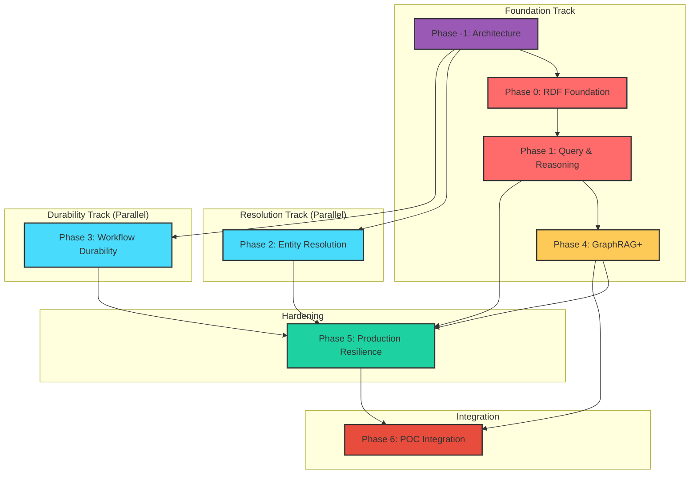

# Implementation Roadmap

## Executive Summary

This roadmap provides a phased strategy to close the capability gaps between the effect-ontology reference implementation and the beep-effect knowledge slice. The plan is organized around parallel work streams with carefully managed dependencies:

1. **Architectural Foundation** (Phase -1): Establish package allocation, RPC patterns, and layer boundaries
2. **RDF Foundation** (Phase 0): Build the semantic infrastructure (triple store, serialization) that enables query and reasoning capabilities
3. **Query & Reasoning** (Phase 1): Add SPARQL queries, RDFS reasoning, and SHACL validation on top of RDF foundation
4. **Entity Resolution & Evidence** (Phase 2): Enhance the two-tier mention/entity architecture and cross-batch resolution (parallel track)
5. **Workflow Durability** (Phase 3): Add @effect/workflow for durable execution and state machines (parallel track)
6. **GraphRAG Enhancements** (Phase 4): Add grounded answer generation leveraging reasoning infrastructure
7. **Production Resilience** (Phase 5): Add circuit breakers, rate limiting, and operational hardening
8. **POC Integration** (Phase 6): Wire up `apps/todox/src/app/knowledge-demo/` to production services

**Total Estimated Duration**: 18-23 weeks with 2-3 engineers
**Critical Path**: Phase -1 -> Phase 0 -> Phase 1 -> Phase 4 -> Phase 6

## Guiding Principles

1. **Foundation-first**: Build infrastructure before features - RDF store must exist before SPARQL
2. **Parallel tracks**: Workflow durability and Entity Resolution can proceed independently
3. **Incremental value**: Each phase delivers usable capability - no "big bang" integration
4. **Minimal disruption**: Additive changes with backward compatibility - existing ExtractionPipeline continues working
5. **Effect patterns**: All new code follows established @beep Effect patterns (namespace imports, tagged errors, Layer composition)
6. **Slice ownership**: Each vertical slice owns its domain RPCs - NOT in shared kernel

## Phase Overview

| Phase | Name                     | Focus                                              | Dependencies                          | Estimated Scope | Duration  |
|-------|--------------------------|----------------------------------------------------|---------------------------------------|-----------------|-----------|
| -1    | Architectural Foundation | Package allocation, RPC patterns, layer boundaries | None                                  | M               | 1 week    |
| 0     | RDF Foundation           | Triple store abstraction                           | Phase -1                              | L-XL            | 2-3 weeks |
| 1     | Query Layer              | SPARQL + Reasoning                                 | Phase 0                               | XL              | 3-4 weeks |
| 2     | Resolution               | Cross-batch + Evidence                             | Phase -1 (parallel)                   | L               | 2-3 weeks |
| 3     | Workflow                 | Durable execution                                  | Phase -1 (parallel)                   | XL              | 3-4 weeks |
| 4     | GraphRAG+                | Answer generation                                  | Phase 1                               | M               | 2 weeks   |
| 5     | Resilience               | Production hardening                               | Phases 1-4                            | M               | 2-3 weeks |
| 6     | POC Integration          | Wire knowledge-demo to services                    | Phase 0, 1, 4 (hard); 2, 3, 5 (soft)  | M               | 1-2 weeks |

---

## Detailed Phases

### Phase -1: Architectural Foundation

**Objective**: Establish package allocation, API patterns, and layer boundaries before implementation begins

**Priority**: P0 - Critical (blocks all other phases)

**Context**: The beep-effect codebase uses a hybrid RPC pattern where truly cross-cutting concerns live in the shared kernel, but **slice-specific RPCs live within each vertical slice**. This pattern must be followed for the knowledge slice to maintain architectural consistency.

#### A. Package Allocation Matrix

| Capability                          | Package                  | File Location                                                  | Rationale                        |
|-------------------------------------|--------------------------|----------------------------------------------------------------|----------------------------------|
| RDF value types (Quad, QuadPattern) | `@beep/knowledge-domain` | `packages/knowledge/domain/src/value-objects/rdf/`             | Domain values - no implementation |
| RDF service interface               | `@beep/knowledge-domain` | `packages/knowledge/domain/src/services/RdfStore.ts`           | Service contract only            |
| RdfStore implementation             | `@beep/knowledge-server` | `packages/knowledge/server/src/Rdf/RdfStoreService.ts`         | Server-side implementation       |
| SPARQL types (SparqlBindings)       | `@beep/knowledge-domain` | `packages/knowledge/domain/src/value-objects/sparql/`          | Query types - no implementation  |
| SparqlService                       | `@beep/knowledge-server` | `packages/knowledge/server/src/Sparql/SparqlService.ts`        | Server-side implementation       |
| Reasoner types (InferenceResult)    | `@beep/knowledge-domain` | `packages/knowledge/domain/src/value-objects/reasoning/`       | Inference types - no implementation |
| ReasonerService                     | `@beep/knowledge-server` | `packages/knowledge/server/src/Reasoning/ReasonerService.ts`   | Server-side implementation       |
| MentionRecord model                 | `@beep/knowledge-domain` | `packages/knowledge/domain/src/entities/MentionRecord/`        | Domain entity with schema        |
| Entity RPC contracts                | `@beep/knowledge-domain` | `packages/knowledge/domain/src/entities/Entity/Entity.rpc.ts`  | Slice-specific RPC definitions   |
| Relation RPC contracts              | `@beep/knowledge-domain` | `packages/knowledge/domain/src/entities/Relation/Relation.rpc.ts`| Slice-specific RPC definitions   |
| GraphRAG RPC contracts              | `@beep/knowledge-domain` | `packages/knowledge/domain/src/entities/GraphRAG/GraphRAG.rpc.ts`| Slice-specific RPC definitions   |
| Entity handlers                     | `@beep/knowledge-server` | `packages/knowledge/server/src/rpc/v1/entity/_rpcs.ts`         | RPC handler layer composition    |
| Relation handlers                   | `@beep/knowledge-server` | `packages/knowledge/server/src/rpc/v1/relation/_rpcs.ts`       | RPC handler layer composition    |
| GraphRAG handlers                   | `@beep/knowledge-server` | `packages/knowledge/server/src/rpc/v1/graph-rag/_rpcs.ts`      | RPC handler layer composition    |

#### B. RPC Pattern Decision

**Decision**: Use `@effect/rpc` with slice-specific RPCs (NOT HttpApi, NOT shared kernel)

**Pattern Reference**: Follow `packages/documents/domain/src/entities/Document/Document.rpc.ts`

**Domain Layer RPC Definition** (`packages/knowledge/domain/src/entities/Entity/Entity.rpc.ts`):

```typescript
import * as Rpc from "@effect/rpc/Rpc";
import * as RpcGroup from "@effect/rpc/RpcGroup";
import * as S from "effect/Schema";
import { KnowledgeEntityIds } from "../EntityIds.js";
import { SharedEntityIds } from "@beep/shared-domain";
import * as Model from "./Entity.model.js";
import * as Errors from "./Entity.errors.js";

export class Rpcs extends RpcGroup.make(
  Rpc.make("get", {
    payload: { id: KnowledgeEntityIds.EntityId },
    success: Model.json,
    error: Errors.EntityNotFoundError,
  }),
  Rpc.make("list", {
    payload: { organizationId: SharedEntityIds.OrganizationId },
    success: Model.json,
    stream: true,
  }),
  Rpc.make("create", {
    payload: Model.CreatePayload,
    success: Model.json,
    error: Errors.EntityCreationError,
  }),
  Rpc.make("update", {
    payload: Model.UpdatePayload,
    success: Model.json,
    error: S.Union(Errors.EntityNotFoundError, Errors.EntityUpdateError),
  }),
  Rpc.make("delete", {
    payload: { id: KnowledgeEntityIds.EntityId },
    success: S.Void,
    error: Errors.EntityNotFoundError,
  }),
).prefix("entity_") {}  // ADD PREFIX for namespace isolation
```

**Server Layer Handler Implementation** (`packages/knowledge/server/src/rpc/v1/entity/_rpcs.ts`):

```typescript
import * as Effect from "effect/Effect";
import { Policy } from "@beep/shared-domain";
import { Entity } from "@beep/knowledge-domain";
import { EntityRepo } from "../../repositories/EntityRepo.js";

// 1. Apply middleware FIRST - informs toLayer that AuthContext will be provided
const EntityRpcsWithMiddleware = Entity.Rpcs.middleware(Policy.AuthContextRpcMiddleware);

// 2. Create implementation object using .of()
const implementation = EntityRpcsWithMiddleware.of({
  entity_get: (payload) =>
    Effect.gen(function* () {
      const repo = yield* EntityRepo;
      return yield* repo.findByIdOrFail(payload.id);
    }).pipe(Effect.withSpan("Entity.handlers.get", { captureStackTrace: false })),

  entity_list: (payload) =>
    Effect.gen(function* () {
      const repo = yield* EntityRepo;
      return yield* repo.streamByOrganization(payload.organizationId);
    }).pipe(Effect.withSpan("Entity.handlers.list", { captureStackTrace: false })),

  entity_create: (payload) =>
    Effect.gen(function* () {
      const repo = yield* EntityRepo;
      return yield* repo.create(payload);
    }).pipe(Effect.withSpan("Entity.handlers.create", { captureStackTrace: false })),

  entity_update: (payload) =>
    Effect.gen(function* () {
      const repo = yield* EntityRepo;
      return yield* repo.update(payload);
    }).pipe(Effect.withSpan("Entity.handlers.update", { captureStackTrace: false })),

  entity_delete: (payload) =>
    Effect.gen(function* () {
      const repo = yield* EntityRepo;
      return yield* repo.delete(payload.id);
    }).pipe(Effect.withSpan("Entity.handlers.delete", { captureStackTrace: false })),
});

// 3. Create layer from implementation
export const layer = EntityRpcsWithMiddleware.toLayer(implementation);
```

**Key Pattern Notes**:
1. **Middleware FIRST**: `Rpcs.middleware(Policy.AuthContextRpcMiddleware)` MUST be applied before `.toLayer()` when handlers need `Policy.AuthContext`
2. **Use `.of()`**: Create implementation using `RpcsWithMiddleware.of({...})` - NOT by passing an Effect.gen to `.toLayer()`
3. **Prefixed handler names**: Handler keys include the prefix (e.g., `entity_get`, not `get`)
4. **Each handler is an Effect.gen**: Dependencies are resolved inside each handler, not shared at the top level

**Why NOT Shared Kernel**: Knowledge RPCs are domain-specific. Only truly cross-cutting concerns (health checks, file operations) belong in `@beep/shared-domain/server`.

#### C. Layer Boundary Rules

```
knowledge-domain:
  ALLOWED:
    - Value objects (Quad, QuadPattern, SparqlBindings, InferenceResult)
    - Entity models (Entity, Relation, MentionRecord, EntityCluster)
    - Tagged errors (EntityNotFoundError, SparqlError, etc.)
    - RPC contracts (Rpcs classes using RpcGroup.make)
    - EntityId definitions
    - Schema definitions

  FORBIDDEN:
    - Service implementations
    - Database access
    - External API calls
    - Layer definitions

knowledge-tables:
  ALLOWED:
    - Drizzle table definitions
    - Column type mappings with .$type<EntityId.Type>()
    - Index definitions
    - Foreign key relationships

  FORBIDDEN:
    - Query logic
    - Repository methods
    - Business logic

knowledge-server:
  ALLOWED:
    - Service implementations (RdfStore, SparqlService, etc.)
    - RPC handlers (using .toLayer())
    - Repository implementations
    - Layer composition
    - External service integration (N3.js, LLM calls)

  FORBIDDEN:
    - Domain type definitions (use knowledge-domain)
    - Table definitions (use knowledge-tables)
```

#### D. Dependency Direction Rules

```
ALLOWED DEPENDENCIES:

knowledge-server --> knowledge-domain     (implementation imports contracts)
knowledge-server --> knowledge-tables     (queries import table definitions)
knowledge-server --> @beep/shared-domain  (shared entity IDs, common types)
knowledge-server --> @beep/common-utils   (utility functions)

knowledge-tables --> knowledge-domain     (tables reference entity IDs)
knowledge-tables --> @beep/shared-domain  (shared entity IDs)

knowledge-domain --> @beep/shared-domain  (shared entity IDs only)

FORBIDDEN DEPENDENCIES:

knowledge-* --> iam-*                     (NO cross-slice imports)
knowledge-* --> documents-*              (NO cross-slice imports)
knowledge-* --> calendar-*               (NO cross-slice imports)

knowledge-domain --> knowledge-server    (NO reverse dependency)
knowledge-domain --> knowledge-tables    (NO reverse dependency)
knowledge-tables --> knowledge-server    (NO reverse dependency)

Any circular dependency path             (NO cycles)
```

#### E. RPC Exposure Decisions

| Capability          | Expose via RPC? | RPC Location        | Rationale                          |
|---------------------|-----------------|---------------------|------------------------------------|
| Entity CRUD         | YES             | `Entity.rpc.ts`     | Standard domain operations         |
| Relation CRUD       | YES             | `Relation.rpc.ts`   | Standard domain operations         |
| GraphRAG queries    | YES             | `GraphRAG.rpc.ts`   | Core product feature               |
| SPARQL queries      | YES             | `Sparql.rpc.ts`     | Power-user feature, needed for POC |
| Batch extraction    | YES             | `Extraction.rpc.ts` | Streaming RPC for progress         |
| Entity resolution   | YES             | `Resolution.rpc.ts` | Manual resolution UI support       |
| RDF store operations| NO              | Internal only       | Implementation detail              |
| Reasoning operations| NO              | Internal only       | Used by SPARQL/GraphRAG internally |

#### F. Deliverables

| Item                               | Priority | Complexity | Estimate | Dependencies |
|------------------------------------|----------|------------|----------|--------------|
| Package structure scaffold         | P0       | S          | 0.5 day  | None         |
| EntityId definitions               | P0       | S          | 0.5 day  | None         |
| Base error schemas                 | P0       | S          | 0.5 day  | EntityIds    |
| Value object schemas (Quad, etc.)  | P0       | M          | 1 day    | None         |
| RPC contract templates             | P0       | M          | 1 day    | Errors       |
| Layer composition documentation    | P0       | S          | 0.5 day  | None         |
| Architecture decision record       | P0       | S          | 0.5 day  | All above    |

**Dependencies**: None - this is foundational work

**Risks**:

| Risk                        | Likelihood | Impact | Mitigation                                  |
|-----------------------------|------------|--------|---------------------------------------------|
| RPC pattern misalignment    | Low        | High   | Study documents slice, follow exact pattern |
| Layer boundary violations   | Medium     | Medium | Enforce via TypeScript imports, CI checks   |
| Team alignment              | Low        | Medium | ADR review with all engineers               |

**Success Criteria**:
- [ ] Package structure matches allocation matrix
- [ ] All EntityIds defined in `@beep/knowledge-domain`
- [ ] RPC contracts compile without implementation
- [ ] Dependency rules enforced by TypeScript imports
- [ ] ADR documents RPC pattern decision
- [ ] Team aligned on layer boundaries

---

### Phase 0: RDF Foundation

*Addresses Gap #7 (No Triple Store) from GAP_ANALYSIS*

**Objective**: Establish triple store abstraction enabling all semantic features

**Priority**: P0 - Critical (blocks Phase 1 and Phase 4)

**Context**: The knowledge slice currently uses N3.js only for Turtle parsing in `OntologyParser.ts`. effect-ontology wraps N3.Store for in-memory triple operations and Oxigraph for SPARQL. We need a service abstraction that can start with N3.Store and potentially migrate to Oxigraph later.

**Deliverables**:

| Item                                       | Priority | Complexity | Estimate | Dependencies  |
|--------------------------------------------|----------|------------|----------|---------------|
| RdfStore service (N3.Store wrapper)        | P0       | L          | 4 days   | Phase -1      |
| QuadPattern query interface                | P0       | M          | 2 days   | RdfStore      |
| Named graph support                        | P0       | M          | 2 days   | RdfStore      |
| RDF serialization (Turtle, N-Triples)      | P0       | S          | 1 day    | RdfStore      |
| RdfBuilder service for fluent construction | P1       | M          | 2 days   | RdfStore      |
| RDF/JSON-LD import/export                  | P2       | S          | 1 day    | Serialization |

**Key Files to Create**:

```
packages/knowledge/domain/src/value-objects/rdf/
  index.ts                    # Public exports
  Quad.ts                     # Quad schema (subject, predicate, object, graph)
  QuadPattern.ts              # Pattern matching schema
  RdfFormat.ts                # Serialization format enum

packages/knowledge/server/src/Rdf/
  index.ts                    # Public exports
  RdfStoreService.ts          # Effect.Service wrapping N3.Store
  NamedGraph.ts               # Named graph support for provenance
  RdfBuilder.ts               # Fluent RDF construction API
  Serializer.ts               # Turtle/N-Triples/JSON-LD serialization
```

**Service Interface Design**:

```typescript
// RdfStoreService.ts - Core triple store abstraction
export class RdfStore extends Effect.Service<RdfStore>()("@beep/knowledge-server/RdfStore", {
  accessors: true,
  effect: Effect.gen(function* () {
    // Initialize N3.Store or other backend here
    const store = new N3.Store();

    return {
      // Core quad operations
      addQuad: (quad: Quad) =>
        Effect.gen(function* () {
          store.addQuad(quad);
        }).pipe(Effect.withSpan("RdfStore.addQuad", { captureStackTrace: false })),

      removeQuad: (quad: Quad) =>
        Effect.gen(function* () {
          store.removeQuad(quad);
        }).pipe(Effect.withSpan("RdfStore.removeQuad", { captureStackTrace: false })),

      hasQuad: (quad: Quad) =>
        Effect.gen(function* () {
          return store.has(quad);
        }).pipe(Effect.withSpan("RdfStore.hasQuad", { captureStackTrace: false })),

      // Pattern matching (foundation for SPARQL)
      match: (pattern: QuadPattern) =>
        Effect.gen(function* () {
          return store.getQuads(pattern.subject, pattern.predicate, pattern.object, pattern.graph);
        }).pipe(Effect.withSpan("RdfStore.match", { captureStackTrace: false })),

      // Named graphs
      createGraph: (iri: string) =>
        Effect.gen(function* () {
          // Named graph creation logic
        }).pipe(Effect.withSpan("RdfStore.createGraph", { captureStackTrace: false })),

      dropGraph: (iri: string) =>
        Effect.gen(function* () {
          store.deleteGraph(iri);
        }).pipe(Effect.withSpan("RdfStore.dropGraph", { captureStackTrace: false })),

      // Bulk operations
      loadTurtle: (content: string, graph?: string) =>
        Effect.gen(function* () {
          // Parse and load Turtle content
          return 0; // Return number of quads loaded
        }).pipe(Effect.withSpan("RdfStore.loadTurtle", { captureStackTrace: false })),

      serialize: (format: RdfFormat, graph?: string) =>
        Effect.gen(function* () {
          // Serialize graph to specified format
          return "";
        }).pipe(Effect.withSpan("RdfStore.serialize", { captureStackTrace: false })),
    };
  }),
}) {}
```

**Dependencies**: Phase -1 MUST be complete

**Risks**:

| Risk                              | Likelihood | Impact | Mitigation                                             |
|-----------------------------------|------------|--------|--------------------------------------------------------|
| N3.js API changes                 | Low        | Medium | Pin N3.js version, wrap all access through abstraction |
| Performance at scale              | Medium     | High   | Design for future Oxigraph migration, benchmark early  |
| Memory pressure from large graphs | Medium     | Medium | Add graph size limits, streaming APIs for large loads  |

**Success Criteria**:
- [ ] RdfStore can load Turtle ontologies from existing `OntologyParser`
- [ ] QuadPattern queries return correct results for subject/predicate/object patterns
- [ ] Named graphs properly isolate triples
- [ ] Serialization round-trips without data loss
- [ ] Unit tests cover all public APIs
- [ ] `OntologyService.load()` can optionally populate RdfStore

---

### Phase 1: Query & Reasoning Layer

**Objective**: Enable SPARQL queries and RDFS/OWL reasoning over the knowledge graph

**Priority**: P0-P1 - Critical for semantic features

**Context**: effect-ontology uses Oxigraph WASM for SPARQL execution and implements forward-chaining RDFS reasoning. The knowledge slice currently has no query language beyond SQL - GraphRAG does traversal in application code. Adding SPARQL enables declarative graph queries; reasoning enables inference of implicit knowledge.

**Deliverables**:

| Item                           | Priority | Complexity | Estimate | Dependencies     |
|--------------------------------|----------|------------|----------|------------------|
| SPARQL query service           | P0       | XL         | 5 days   | Phase 0 RdfStore |
| Basic SPARQL parser (subset)   | P0       | L          | 3 days   | None             |
| Query result formatting        | P0       | M          | 2 days   | SPARQL service   |
| RDFS forward-chaining reasoner | P1       | L          | 4 days   | RdfStore         |
| SHACL validation service       | P1       | L          | 4 days   | RdfStore         |
| Reasoning result caching       | P2       | M          | 2 days   | Reasoner         |
| N3 rules engine (optional)     | P3       | XL         | 5 days   | Reasoner         |

**Key Files to Create**:

```
packages/knowledge/domain/src/value-objects/sparql/
  index.ts
  SparqlBindings.ts           # Query result bindings schema
  SparqlQuery.ts              # Query string wrapper

packages/knowledge/server/src/Sparql/
  index.ts
  SparqlService.ts            # SPARQL query execution
  SparqlParser.ts             # Parse SPARQL to algebra (using sparqljs)
  ResultFormatter.ts          # Format SPARQL results (bindings, graph)

packages/knowledge/domain/src/value-objects/reasoning/
  index.ts
  InferenceResult.ts          # Inference output schema
  ReasoningProfile.ts         # RDFS, OWL-RL profiles

packages/knowledge/server/src/Reasoning/
  index.ts
  ReasonerService.ts          # Forward-chaining reasoner
  RdfsRules.ts                # RDFS entailment rules
  OwlRlRules.ts               # OWL RL subset rules
  InferenceCache.ts           # Cache inferred triples

packages/knowledge/server/src/Validation/
  index.ts
  ShaclService.ts             # SHACL shape validation
  ShaclParser.ts              # Parse SHACL shapes from RDF
  ValidationReport.ts         # SHACL validation report schema
```

**Service Interface Design**:

```typescript
// SparqlService.ts
export class SparqlService extends Effect.Service<SparqlService>()("@beep/knowledge-server/SparqlService", {
  accessors: true,
  effect: Effect.gen(function* () {
    const rdfStore = yield* RdfStore;

    return {
      // Execute SELECT query
      select: (query: string, defaultGraph?: string) =>
        Effect.gen(function* () {
          // Parse query, execute against store, return bindings
          yield* Effect.logDebug("SparqlService.select", { query, defaultGraph });
          // Implementation using sparqljs or Oxigraph
          return {} as SparqlBindings;
        }).pipe(Effect.withSpan("SparqlService.select", { captureStackTrace: false })),

      // Execute CONSTRUCT query
      construct: (query: string, defaultGraph?: string) =>
        Effect.gen(function* () {
          yield* Effect.logDebug("SparqlService.construct", { query, defaultGraph });
          // Implementation returning constructed quads
          return [] as ReadonlyArray<Quad>;
        }).pipe(Effect.withSpan("SparqlService.construct", { captureStackTrace: false })),

      // Execute ASK query
      ask: (query: string, defaultGraph?: string) =>
        Effect.gen(function* () {
          yield* Effect.logDebug("SparqlService.ask", { query, defaultGraph });
          // Implementation returning boolean
          return false;
        }).pipe(Effect.withSpan("SparqlService.ask", { captureStackTrace: false })),
    };
  }),
}) {}

// ReasonerService.ts
export class ReasonerService extends Effect.Service<ReasonerService>()("@beep/knowledge-server/ReasonerService", {
  accessors: true,
  effect: Effect.gen(function* () {
    const rdfStore = yield* RdfStore;

    return {
      // Compute closure (all inferred triples)
      computeClosure: (profile: ReasoningProfile) =>
        Effect.gen(function* () {
          yield* Effect.logDebug("ReasonerService.computeClosure", { profile });
          // Forward-chaining inference implementation
          return {} as InferenceResult;
        }).pipe(Effect.withSpan("ReasonerService.computeClosure", { captureStackTrace: false })),

      // Check entailment
      entails: (pattern: QuadPattern) =>
        Effect.gen(function* () {
          yield* Effect.logDebug("ReasonerService.entails", { pattern });
          // Check if pattern is entailed by current knowledge
          return false;
        }).pipe(Effect.withSpan("ReasonerService.entails", { captureStackTrace: false })),

      // Explain inference chain
      explain: (quad: Quad) =>
        Effect.gen(function* () {
          yield* Effect.logDebug("ReasonerService.explain", { quad });
          // Build explanation trace
          return {} as InferenceTrace;
        }).pipe(Effect.withSpan("ReasonerService.explain", { captureStackTrace: false })),
    };
  }),
}) {}
```

**Technology Decision - SPARQL Implementation**:

| Option                     | Pros                         | Cons                          | Recommendation          |
|----------------------------|------------------------------|-------------------------------|-------------------------|
| sparqljs + custom executor | Pure JS, no WASM             | Limited optimization          | Start here              |
| Oxigraph WASM              | Full SPARQL 1.1, fast        | Large bundle, WASM complexity | Migrate later           |
| Comunica                   | Federated queries, streaming | Complex setup                 | Consider for federation |

**Recommendation**: Start with sparqljs for parsing + custom executor over RdfStore. Design abstraction to allow Oxigraph migration when performance requires it.

**Dependencies**:
- Phase 0 (RdfStore) MUST be complete
- Reasoning depends on SPARQL for some rule applications

**Risks**:

| Risk                       | Likelihood | Impact | Mitigation                                        |
|----------------------------|------------|--------|---------------------------------------------------|
| SPARQL subset insufficient | Medium     | Medium | Document supported features, add incrementally    |
| Reasoning performance      | High       | Medium | Limit reasoning depth, use incremental algorithms |
| SHACL complexity           | Low        | Low    | Start with core constraints, expand as needed     |

**Success Criteria**:
- [ ] Basic SELECT/CONSTRUCT/ASK queries execute correctly
- [ ] RDFS subclass/subproperty reasoning produces correct inferences
- [ ] SHACL validation catches constraint violations
- [ ] Query performance acceptable for knowledge graphs < 100K triples
- [ ] Integration test: query entities extracted by ExtractionPipeline via SPARQL

---

### Phase 2: Entity Resolution Enhancements

**Objective**: Add immutable evidence layer and cross-batch entity resolution

**Priority**: P1 - Important for production use

**Context**: The knowledge slice has a good foundation with `MentionModel` and `EntityClusterer`, but lacks:
1. Immutable `MentionRecord` layer (effect-ontology pattern for preserving raw extractions)
2. Cross-batch resolution (currently resolution is per-extraction-run)
3. Global entity registry for organization-wide deduplication

**Deliverables**:

| Item                             | Priority | Complexity | Estimate | Dependencies     |
|----------------------------------|----------|------------|----------|------------------|
| MentionRecord immutable layer    | P1       | M          | 3 days   | Phase -1         |
| Cross-batch entity registry      | P1       | L          | 4 days   | MentionRecord    |
| Entity merge history tracking    | P1       | M          | 2 days   | Registry         |
| Incremental clustering algorithm | P2       | L          | 3 days   | Registry         |
| Entity split/unmerge capability  | P2       | M          | 2 days   | History tracking |

**Key Files to Create/Modify**:

```
packages/knowledge/domain/src/entities/MentionRecord/
  index.ts
  MentionRecord.model.ts      # Immutable extraction evidence
  MentionRecord.rpc.ts        # RPC contracts

packages/knowledge/server/src/EntityResolution/
  EntityRegistry.ts           # Cross-batch entity lookup
  MergeHistory.ts             # Track entity merge decisions
  IncrementalClusterer.ts     # Add new mentions to existing clusters

packages/knowledge/server/src/rpc/v1/
  mention-record/_rpcs.ts     # RPC handler layer composition
  resolution/_rpcs.ts         # Resolution RPC handler layer composition

packages/knowledge/tables/src/tables/
  mention-record.table.ts     # Immutable mention storage
  entity-merge-history.table.ts
```

**Data Model Enhancement**:

```
Current Flow:
  Text -> Mentions -> Entities (merged within batch)

Enhanced Flow:
  Text -> MentionRecords (immutable) -> Mentions -> Entities
                    |                        |
                    v                        v
              Evidence Layer          Resolution Layer
              (never modified)        (clusters evolve)
```

**MentionRecord Schema**:

```typescript
// MentionRecord.model.ts
export class Model extends M.Class<Model>($I`MentionRecordModel`)(
  makeFields(KnowledgeEntityIds.MentionRecordId, {
    organizationId: SharedEntityIds.OrganizationId,

    // Extraction provenance (immutable)
    extractionId: KnowledgeEntityIds.ExtractionId,
    documentId: DocumentsEntityIds.DocumentId,
    chunkIndex: S.NonNegativeInt,

    // Raw extraction output (immutable)
    rawText: S.String,
    startChar: S.NonNegativeInt,
    endChar: S.NonNegativeInt,
    extractorConfidence: Confidence,

    // LLM response preservation
    llmResponseHash: S.String,  // Hash of raw LLM output for audit

    // Link to resolved entity (mutable via resolution)
    resolvedEntityId: BS.FieldOptionOmittable(KnowledgeEntityIds.EntityId),
  }),
) {}
```

**Dependencies**: Phase -1 MUST be complete - can proceed in parallel with Phases 0-1

**Risks**:

| Risk                    | Likelihood | Impact | Mitigation                                             |
|-------------------------|------------|--------|--------------------------------------------------------|
| Migration complexity    | Medium     | Medium | Add MentionRecord alongside Mention, migrate gradually |
| Cross-batch performance | Medium     | High   | Index on normalized text, use bloom filters            |
| Merge conflicts         | Low        | Medium | Conflict resolution UI, human-in-the-loop              |

**Success Criteria**:
- [ ] MentionRecords created during extraction are never modified
- [ ] Cross-batch resolution finds existing entities for new extractions
- [ ] Merge history enables auditing of resolution decisions
- [ ] Existing ExtractionPipeline continues working during migration
- [ ] Test: same entity extracted from different documents merges correctly

---

### Phase 3: Workflow Durability

**Objective**: Add @effect/workflow for durable execution with SSE progress streaming

**Priority**: P0 - Critical for reliability

**Context**: The knowledge slice ExtractionPipeline runs as a single Effect - if it fails mid-extraction, all progress is lost. effect-ontology uses @effect/workflow for:
1. Durable activities that survive restarts
2. State machine for batch processing with SSE progress
3. PostgreSQL persistence for workflow state

**Deliverables**:

| Item                              | Priority | Complexity | Estimate | Dependencies       |
|-----------------------------------|----------|------------|----------|--------------------|
| @effect/workflow integration      | P0       | L          | 4 days   | Phase -1           |
| Workflow persistence tables       | P0       | M          | 2 days   | None               |
| ExtractionWorkflow definition     | P0       | L          | 3 days   | Integration        |
| Durable activities for each stage | P0       | L          | 4 days   | ExtractionWorkflow |
| SSE progress streaming            | P0       | M          | 3 days   | Workflow state     |
| Batch state machine               | P0       | L          | 3 days   | SSE                |
| Cross-batch orchestration         | P1       | M          | 2 days   | State machine      |

> **Note**: Batch state machine elevated to P0 to align with GAP_ANALYSIS Gap #4 priority.

**Key Files to Create**:

```
packages/knowledge/server/src/Workflow/
  index.ts
  ExtractionWorkflow.ts       # @effect/workflow definition
  DurableActivities.ts        # Activity implementations
  WorkflowPersistence.ts      # PostgreSQL persistence layer
  ProgressStream.ts           # SSE progress events
  BatchStateMachine.ts        # State machine for batch processing

packages/knowledge/tables/src/tables/
  workflow-execution.table.ts
  workflow-activity.table.ts
  workflow-signal.table.ts
```

**Workflow Architecture**:

```
ExtractionWorkflow
  |
  +-- Activity: ChunkText (durable)
  |     |
  |     +-- [checkpoint]
  |
  +-- Activity: ExtractMentions (durable, per-chunk)
  |     |
  |     +-- [checkpoint per chunk]
  |
  +-- Activity: ClassifyEntities (durable, batched)
  |     |
  |     +-- [checkpoint per batch]
  |
  +-- Activity: ExtractRelations (durable, per-chunk)
  |     |
  |     +-- [checkpoint per chunk]
  |
  +-- Activity: AssembleGraph (durable)
  |     |
  |     +-- [final checkpoint]
  |
  +-- Signal: Progress (SSE stream)
```

**Workflow Service Interface**:

```typescript
// ExtractionWorkflow.ts
export const ExtractionWorkflow = Workflow.workflow("extraction", {
  input: ExtractionWorkflowInput,
  output: ExtractionWorkflowOutput,

  run: Effect.gen(function* (input) {
    // Stage 1: Chunk
    const chunks = yield* Workflow.activity("chunk", ChunkActivity, {
      text: input.text,
      config: input.chunkingConfig,
    });

    yield* Workflow.signal("progress", { stage: "chunking", complete: true });

    // Stage 2: Extract mentions (parallel with checkpoints)
    const mentions = yield* Workflow.all(
      A.map(chunks, (chunk, i) =>
        Workflow.activity(`mentions-${i}`, MentionActivity, { chunk })
      ),
      { concurrency: 5 }
    );

    yield* Workflow.signal("progress", { stage: "mentions", complete: true });

    // ... remaining stages
  }),
});
```

**SSE Progress Protocol**:

```typescript
// ProgressStream.ts
export class ExtractionProgress extends S.Class<ExtractionProgress>("ExtractionProgress")({
  workflowId: KnowledgeEntityIds.WorkflowId,
  stage: S.Literal("chunking", "mentions", "entities", "relations", "assembly"),
  progress: S.Number.pipe(S.greaterThanOrEqualTo(0), S.lessThanOrEqualTo(1)),
  currentItem: S.optional(S.Number),
  totalItems: S.optional(S.Number),
  error: S.optional(S.String),
}) {}
```

**Dependencies**: Phase -1 MUST be complete - can proceed in parallel with Phases 0-2

**Risks**:

| Risk                            | Likelihood | Impact | Mitigation                                       |
|---------------------------------|------------|--------|--------------------------------------------------|
| @effect/workflow learning curve | Medium     | Medium | Study effect-ontology patterns, pair programming |
| Persistence schema evolution    | Low        | Medium | Use migrations, version workflow definitions     |
| SSE connection management       | Medium     | Low    | Implement reconnection, heartbeat                |

**Success Criteria**:
- [ ] Extraction survives server restart at any stage
- [ ] SSE stream shows real-time progress
- [ ] Failed activities retry automatically
- [ ] Workflow state persisted in PostgreSQL
- [ ] Test: kill server mid-extraction, restart, extraction completes

---

### Phase 4: GraphRAG Enhancements

**Objective**: Add grounded answer generation with reasoning traces and citation validation

**Priority**: P2 - Nice to have for production quality

**Context**: The knowledge slice has a solid GraphRAGService with k-NN + N-hop traversal and RRF scoring. Missing capabilities:
1. Grounded answer generation (answers cite specific entities/relations)
2. Reasoning trace generation (show inference path)
3. Citation validation (verify claims against graph)

**Deliverables**:

| Item                               | Priority | Complexity | Estimate | Dependencies     |
|------------------------------------|----------|------------|----------|------------------|
| Grounded answer schema             | P2       | S          | 1 day    | None             |
| Answer generation prompt templates | P2       | M          | 2 days   | Schema           |
| Reasoning trace formatter          | P2       | M          | 2 days   | Phase 1 Reasoner |
| Citation validation service        | P2       | M          | 3 days   | Phase 1 SPARQL   |
| Confidence propagation             | P3       | M          | 2 days   | Validation       |

**Key Files to Create/Modify**:

```
packages/knowledge/server/src/GraphRAG/
  GroundedAnswerGenerator.ts  # Generate answers with citations
  ReasoningTraceFormatter.ts  # Format inference paths
  CitationValidator.ts        # Validate claims against graph
  AnswerSchemas.ts            # Grounded answer output schemas
```

**Grounded Answer Schema**:

```typescript
// AnswerSchemas.ts
export class GroundedClaim extends S.Class<GroundedClaim>("GroundedClaim")({
  text: S.String,
  confidence: Confidence,

  // Citations
  entityRefs: S.Array(S.Struct({
    entityId: KnowledgeEntityIds.EntityId,
    entityName: S.String,
    relevance: S.Number,
  })),

  relationRefs: S.Array(S.Struct({
    relationId: KnowledgeEntityIds.RelationId,
    predicate: S.String,
    subjectName: S.String,
    objectName: S.String,
  })),

  // Reasoning trace (if inference was used)
  inferenceTrace: S.optional(S.Array(S.Struct({
    rule: S.String,
    premise: S.String,
    conclusion: S.String,
  }))),
}) {}

export class GroundedAnswer extends S.Class<GroundedAnswer>("GroundedAnswer")({
  claims: S.Array(GroundedClaim),
  overallConfidence: Confidence,
  unsupportedClaims: S.Array(S.String),  // Claims that couldn't be grounded
}) {}
```

**Citation Validation Flow**:

```
LLM Response -> Parse Claims -> For each claim:
  |
  +-- Extract entity mentions
  |     |
  |     +-- SPARQL: Find matching entities
  |     +-- Verify existence in retrieved subgraph
  |
  +-- Extract relation claims
  |     |
  |     +-- SPARQL: Verify relation exists
  |     +-- If not direct: check for inference path
  |
  +-- Score claim confidence
        |
        +-- Based on: entity match quality, relation verification, inference depth
```

**Dependencies**:
- Phase 1 (SPARQL + Reasoning) MUST be complete for citation validation
- Can start answer schema and prompts in parallel

**Risks**:

| Risk                                | Likelihood | Impact | Mitigation                                       |
|-------------------------------------|------------|--------|--------------------------------------------------|
| LLM hallucination despite grounding | High       | Medium | Strict validation, low confidence for ungrounded |
| Performance of validation           | Medium     | Low    | Cache SPARQL results, batch queries              |
| Complex inference traces            | Low        | Low    | Limit trace depth, simplify presentation         |

**Success Criteria**:
- [ ] Generated answers include entity/relation citations
- [ ] Citations link to actual graph nodes
- [ ] Ungrounded claims flagged with low confidence
- [ ] Inference traces show reasoning path when applicable
- [ ] Test: answer about inferred relationship includes reasoning trace

---

### Phase 5: Production Resilience

**Objective**: Add operational hardening for production deployment

**Priority**: P3 - Future (but important before production launch)

**Context**: effect-ontology includes resilience patterns that the knowledge slice lacks:
1. CircuitBreaker for external service calls (LLM, embedding)
2. Retry with exponential backoff
3. Rate limiting service
4. Service bundles for cleaner Layer composition

**Deliverables**:

| Item                   | Priority | Complexity | Estimate | Dependencies |
|------------------------|----------|------------|----------|--------------|
| CircuitBreaker service | P3       | M          | 2 days   | None         |
| Retry policies         | P3       | S          | 1 day    | None         |
| Rate limiting service  | P3       | M          | 2 days   | None         |
| Service bundles        | P3       | M          | 2 days   | None         |
| Health check endpoints | P3       | S          | 1 day    | None         |
| Metrics collection     | P3       | M          | 2 days   | None         |

**Key Files to Create**:

```
packages/knowledge/server/src/Resilience/
  index.ts
  CircuitBreaker.ts           # Circuit breaker pattern
  RetryPolicy.ts              # Configurable retry policies
  RateLimiter.ts              # Token bucket rate limiting

packages/knowledge/server/src/Runtime/
  ServiceBundles.ts           # Grouped Layer compositions
  HealthCheck.ts              # Service health endpoints
```

**Circuit Breaker Service**:

```typescript
// CircuitBreaker.ts
export class CircuitBreaker extends Effect.Service<CircuitBreaker>()("@beep/knowledge-server/CircuitBreaker", {
  accessors: true,
  effect: Effect.gen(function* () {
    // Initialize circuit state tracking
    const circuits = yield* Ref.make(new Map<string, CircuitState>());

    return {
      // Wrap an effect with circuit breaker
      protect: <A, E, R>(
        name: string,
        effect: Effect.Effect<A, E, R>,
        config?: CircuitBreakerConfig
      ) =>
        Effect.gen(function* () {
          const state = yield* Ref.get(circuits);
          const circuitState = state.get(name) ?? { status: "closed", failures: 0 };

          if (circuitState.status === "open") {
            return yield* Effect.fail(new CircuitOpenError({ circuit: name }));
          }

          return yield* effect;
        }).pipe(Effect.withSpan("CircuitBreaker.protect", { captureStackTrace: false })),

      // Get circuit state
      getState: (name: string) =>
        Effect.gen(function* () {
          const state = yield* Ref.get(circuits);
          return state.get(name) ?? { status: "closed", failures: 0 };
        }).pipe(Effect.withSpan("CircuitBreaker.getState", { captureStackTrace: false })),

      // Manual circuit control
      trip: (name: string) =>
        Effect.gen(function* () {
          yield* Ref.update(circuits, (state) => {
            state.set(name, { status: "open", failures: 0 });
            return state;
          });
        }).pipe(Effect.withSpan("CircuitBreaker.trip", { captureStackTrace: false })),

      reset: (name: string) =>
        Effect.gen(function* () {
          yield* Ref.update(circuits, (state) => {
            state.set(name, { status: "closed", failures: 0 });
            return state;
          });
        }).pipe(Effect.withSpan("CircuitBreaker.reset", { captureStackTrace: false })),
    };
  }),
}) {}
```

**Service Bundle Pattern**:

```typescript
// ServiceBundles.ts - Following effect-ontology pattern
export const LlmBundle = Layer.mergeAll(
  LlmLive,
  CircuitBreaker.Default,
  RateLimiter.Default,
);

export const ExtractionBundle = Layer.mergeAll(
  NlpService.Default,
  MentionExtractor.Default,
  EntityExtractor.Default,
  RelationExtractor.Default,
  GraphAssembler.Default,
);

export const KnowledgeServerLive = Layer.mergeAll(
  LlmBundle,
  ExtractionBundle,
  // ... other bundles
).pipe(
  Layer.provide(DatabaseLayer),
  Layer.provide(ConfigLayer),
);
```

**Dependencies**: Phases 1-4 should be stable before adding resilience wrappers

**Risks**:

| Risk                     | Likelihood | Impact | Mitigation                               |
|--------------------------|------------|--------|------------------------------------------|
| Over-engineering         | Medium     | Low    | Start with critical paths only           |
| Configuration complexity | Low        | Low    | Sensible defaults, environment overrides |

**Success Criteria**:
- [ ] LLM calls protected by circuit breaker
- [ ] Embedding calls rate-limited per organization
- [ ] Failed extractions retry with backoff
- [ ] Health check endpoint reports service status
- [ ] Test: circuit opens after N failures, half-opens after timeout

---

### Phase 6: POC Integration

**Objective**: Connect `apps/todox/src/app/knowledge-demo/` to production knowledge services

**Priority**: P1 - Validates entire pipeline end-to-end

**Dependencies**:
- **Hard requirements**: Phase 0 (RDF Foundation), Phase 1 (Query Layer), Phase 4 (GraphRAG+)
- **Soft requirements**: Phases 2, 3, 5 can proceed in parallel with Phase 6

> **Note**: The critical path (12 weeks) assumes Phase 6 starts after Phase 4.
> Full dependency on Phases 0-5 extends timeline to 18+ weeks.

**Context**: The knowledge-demo application contains 23 production-ready React components for knowledge graph visualization and interaction. Currently, it uses mock server actions with pattern matching and BFS traversal. This phase replaces mocks with real service calls while preserving the UI.

#### Current POC Components (23 total)

| Component               | Purpose                      | Mock Dependency       |
|-------------------------|------------------------------|-----------------------|
| EntityCardList          | Display extracted entities   | `extractFromText()`   |
| RelationTable           | Show entity relationships    | `extractFromText()`   |
| SourceTextPanel         | Highlight mentions in source | `extractFromText()`   |
| EntityDetailDrawer      | Entity details sidebar       | Mock data             |
| EntityResolutionPanel   | Manual entity merging        | `resolveEntities()`   |
| GraphRAGQueryPanel      | Natural language queries     | `queryGraphRAG()`     |
| QueryResultDisplay      | Show RAG answers             | `queryGraphRAG()`     |
| ClusterList             | Entity clusters visualization| `resolveEntities()`   |
| SameAsLinkTable         | owl:sameAs relationships     | Mock data             |
| EmailInputPanel         | Email-based extraction       | `extractFromText()`   |
| ErrorAlert              | Error display                | N/A                   |
| Various skeletons       | Loading states               | N/A                   |

#### Mock Server Actions to Replace

| Current Mock         | Mock Behavior                       | Production Service          | RPC                        |
|----------------------|-------------------------------------|-----------------------------|----------------------------|
| `extractFromText()`  | Pattern matching + random confidence| `ExtractionPipeline`        | `Extraction.Rpcs.extract`  |
| `queryGraphRAG()`    | BFS traversal + mock scores         | `GraphRAGService`           | `GraphRAG.Rpcs.query`      |
| `resolveEntities()`  | Name similarity heuristic           | `EntityResolutionService`   | `Resolution.Rpcs.resolve`  |

#### Deliverables

| Item                               | Priority | Complexity | Estimate | Dependencies  |
|------------------------------------|----------|------------|----------|---------------|
| Knowledge RPC client setup         | P0       | S          | 0.5 day  | Phases 0-5    |
| Replace `extractFromText()` action | P0       | M          | 2 days   | RPC client    |
| Replace `queryGraphRAG()` action   | P0       | M          | 2 days   | RPC client    |
| Replace `resolveEntities()` action | P0       | M          | 1 day    | RPC client    |
| Add authentication context         | P0       | S          | 1 day    | RPC client    |
| Add tagged error handling          | P1       | M          | 1 day    | All actions   |
| Add loading/streaming states       | P1       | S          | 0.5 day  | All actions   |
| Database persistence verification  | P0       | M          | 1 day    | All actions   |
| Integration tests                  | P1       | M          | 2 days   | All above     |

#### Key Files to Modify

```
apps/todox/src/app/knowledge-demo/
  actions.ts                  # Replace mock implementations
  page.tsx                    # Add RPC provider context

packages/knowledge/client/src/
  index.ts                    # Export RPC client
  KnowledgeRpcClient.ts       # RPC client setup
```

#### RPC Client Setup

**File**: `apps/todox/src/app/knowledge-demo/actions.ts`

```typescript
"use server";

import * as Effect from "effect/Effect";
import { KnowledgeRpcClient, KnowledgeRpcClientLive } from "@beep/knowledge-client";

// Replace mock with real extraction
export async function extractFromText(
  text: string,
  organizationId: string
): Promise<ExtractionResult> {
  return Effect.gen(function* () {
    const client = yield* KnowledgeRpcClient;

    const result = yield* client.extraction.extract({
      text,
      organizationId,
      config: {
        chunkSize: 1000,
        chunkOverlap: 100,
      },
    });

    return result;
  }).pipe(
    Effect.provide(KnowledgeRpcClientLive),
    Effect.runPromise
  );
}

// Replace mock with real GraphRAG
export async function queryGraphRAG(
  query: string,
  organizationId: string
): Promise<GraphRAGResult> {
  return Effect.gen(function* () {
    const client = yield* KnowledgeRpcClient;

    const result = yield* client.graphRag.query({
      query,
      organizationId,
      config: {
        topK: 10,
        maxHops: 2,
        includeReasoningTrace: true,
      },
    });

    return result;
  }).pipe(
    Effect.provide(KnowledgeRpcClientLive),
    Effect.runPromise
  );
}

// Replace mock with real resolution
export async function resolveEntities(
  entityIds: ReadonlyArray<string>,
  organizationId: string
): Promise<ResolutionResult> {
  return Effect.gen(function* () {
    const client = yield* KnowledgeRpcClient;

    const result = yield* client.resolution.resolve({
      entityIds,
      organizationId,
    });

    return result;
  }).pipe(
    Effect.provide(KnowledgeRpcClientLive),
    Effect.runPromise
  );
}
```

#### Error Handling Pattern

```typescript
import * as Match from "effect/Match";
import { Extraction } from "@beep/knowledge-domain";

export async function extractFromText(text: string): Promise<ExtractionResult | ErrorResult> {
  return Effect.gen(function* () {
    // ... extraction logic
  }).pipe(
    Effect.catchTag("ExtractionError", (error) =>
      Effect.succeed({
        _tag: "Error" as const,
        message: error.message,
        recoverable: true,
      })
    ),
    Effect.catchTag("RateLimitError", (error) =>
      Effect.succeed({
        _tag: "Error" as const,
        message: "Rate limit exceeded. Please try again later.",
        recoverable: true,
        retryAfter: error.retryAfter,
      })
    ),
    Effect.catchAll((error) =>
      Effect.succeed({
        _tag: "Error" as const,
        message: "An unexpected error occurred.",
        recoverable: false,
      })
    ),
    Effect.provide(KnowledgeRpcClientLive),
    Effect.runPromise
  );
}
```

#### Database Persistence Verification

| Table           | Verification Query                                              | Expected                   |
|-----------------|-----------------------------------------------------------------|----------------------------|
| `entity`        | `SELECT COUNT(*) FROM entity WHERE organization_id = ?`         | > 0 after extraction       |
| `relation`      | `SELECT COUNT(*) FROM relation WHERE organization_id = ?`       | > 0 after extraction       |
| `entity_cluster`| `SELECT COUNT(*) FROM entity_cluster WHERE organization_id = ?` | > 0 after resolution       |
| `same_as_link`  | `SELECT COUNT(*) FROM same_as_link WHERE organization_id = ?`   | >= 0 after resolution      |

**Dependencies**: Phases 0-5 MUST be substantially complete

**Risks**:

| Risk                     | Likelihood | Impact | Mitigation                                   |
|--------------------------|------------|--------|----------------------------------------------|
| Service API mismatch     | Medium     | Medium | Use shared schemas from knowledge-domain     |
| Performance regression   | Medium     | Medium | Add loading states, pagination               |
| Auth context missing     | Low        | High   | Test with real organization IDs              |
| UI component breakage    | Low        | Low    | Minimal changes to components                |

**Success Criteria**:
- [ ] `extractFromText()` calls `ExtractionPipeline` and persists to database
- [ ] `queryGraphRAG()` calls `GraphRAGService` with real embeddings
- [ ] `resolveEntities()` calls `EntityResolutionService`
- [ ] All 23 UI components render correctly with real data
- [ ] Errors display in `ErrorAlert` component with recovery options
- [ ] Entities persist across page refreshes
- [ ] Integration test: full extraction -> query -> resolution flow
- [ ] Performance: extraction < 30s for 5000 word document

---

## Critical Path Analysis



**Critical Path**: Phase -1 (1 week) -> Phase 0 (3 weeks) -> Phase 1 (4 weeks) -> Phase 4 (2 weeks) -> Phase 6 (2 weeks) = **12 weeks minimum**

**Parallel Opportunities**:
- Phase 2 can start after Phase -1 completes
- Phase 3 can start after Phase -1 completes
- Phase 5 should wait until core features stabilize
- Phase 6 requires Phases 0-5 substantially complete

**Resource Allocation Recommendation**:

| Week  | Engineer A | Engineer B | Engineer C (optional) |
|-------|------------|------------|-----------------------|
| 1     | Phase -1   | Phase -1   | Phase -1              |
| 2-4   | Phase 0    | Phase 3    | Phase 2               |
| 5-8   | Phase 1    | Phase 3    | Phase 2               |
| 9-10  | Phase 1    | Phase 4    | Phase 5               |
| 11-12 | Phase 4    | Phase 5    | Phase 6               |
| 13-14 | Phase 6    | Phase 6    | Buffer/Testing        |

---

## Resource Considerations

### Required Skills

| Skill            | Phases     | Proficiency Needed       |
|------------------|------------|--------------------------|
| Effect ecosystem | All        | Expert                   |
| RDF/SPARQL       | 0, 1, 4    | Intermediate             |
| @effect/workflow | 3          | Intermediate (can learn) |
| @effect/rpc      | -1, 6      | Intermediate             |
| PostgreSQL       | 2, 3       | Intermediate             |
| LLM prompting    | 4          | Intermediate             |
| React/Next.js    | 6          | Intermediate             |

### External Dependencies

| Dependency       | Version | Purpose             | Risk                  |
|------------------|---------|---------------------|-----------------------|
| N3.js            | ^1.17.0 | RDF parsing/storage | Low - stable          |
| sparqljs         | ^3.7.0  | SPARQL parsing      | Low - stable          |
| @effect/workflow | ^0.x    | Durable execution   | Medium - evolving API |
| @effect/rpc      | ^0.x    | RPC framework       | Low - already using   |
| @effect/ai       | ^0.x    | LLM integration     | Low - already using   |

### Infrastructure Requirements

| Requirement           | Phase | Notes                              |
|-----------------------|-------|------------------------------------|
| PostgreSQL extensions | 3     | May need pgcrypto for workflow IDs |
| Redis (optional)      | 5     | For rate limiting state            |
| Increased memory      | 1     | In-memory triple store             |

---

## Success Metrics

### Phase Completion Criteria

| Phase | Metric                        | Target                     |
|-------|-------------------------------|----------------------------|
| -1    | Package structure complete    | 100% files created         |
| 0     | Triple operations/sec         | > 10,000                   |
| 1     | SPARQL query latency p95      | < 100ms (10K triples)      |
| 2     | Cross-batch merge accuracy    | > 95%                      |
| 3     | Extraction recovery rate      | 100% (survives restart)    |
| 4     | Answer grounding rate         | > 90% claims cited         |
| 5     | Circuit breaker effectiveness | < 5% cascading failures    |
| 6     | POC feature parity            | 100% mock functions replaced|

### Overall Project Success

- [ ] All P0/P1 gaps from GAP_ANALYSIS.md closed
- [ ] Existing ExtractionPipeline works unchanged during migration
- [ ] Performance regression < 10% for current workloads
- [ ] Test coverage > 80% for new services
- [ ] Documentation updated for all new APIs
- [ ] POC demo fully functional with real data

---

## Open Questions

### Technical Questions

1. **SPARQL Implementation Strategy**
   - Question: Should we start with sparqljs + custom executor or jump to Oxigraph WASM?
   - Context: Oxigraph is faster but adds WASM complexity
   - Options: Start simple, migrate later vs. invest upfront
   - Decision needed by: Phase 0 completion
   - Recommendation: Start with sparqljs, design for migration

2. **Workflow Persistence Backend**
   - Question: PostgreSQL only or support Redis/DynamoDB?
   - Context: PostgreSQL simplifies but may limit scale
   - Options: PostgreSQL-only vs. pluggable backend
   - Decision needed by: Phase 3 start
   - Recommendation: PostgreSQL-only initially

3. **MentionRecord Migration**
   - Question: Backfill existing Mentions or start fresh?
   - Context: Backfill preserves history but adds complexity
   - Options: Backfill vs. forward-only
   - Decision needed by: Phase 2 start
   - Recommendation: Forward-only, document gap in older extractions

4. **POC Authentication**
   - Question: Use real auth or mock organization context?
   - Context: Real auth adds complexity but ensures integration
   - Options: Mock org ID vs. real better-auth integration
   - Decision needed by: Phase 6 start
   - Recommendation: Real auth to validate full stack

### Business Questions

1. **Priority of GraphRAG Grounding**
   - Question: Is citation validation a launch blocker?
   - Stakeholder: Product
   - Impact: Could defer Phase 4

2. **Cross-Batch Resolution Scope**
   - Question: Organization-wide or narrower scope (project/team)?
   - Stakeholder: Product
   - Impact: Affects Phase 2 complexity

3. **POC Demo Timeline**
   - Question: When is POC demo needed for stakeholders?
   - Stakeholder: Product
   - Impact: May need to prioritize Phase 6

---

## Appendix: Effect Pattern Reference

All new code MUST follow these patterns from the codebase:

### Service Definition

```typescript
export class MyService extends Effect.Service<MyService>()("@beep/knowledge-server/MyService", {
  accessors: true,
  effect: Effect.gen(function* () {
    const dep = yield* SomeDependency;
    return {
      method: (input: Input): Effect.Effect<Output, MyError> =>
        Effect.gen(function* () {
          // implementation
        }).pipe(
          Effect.withSpan("MyService.method", { captureStackTrace: false })
        ),
    };
  }),
}) {}
```

### Error Definition

```typescript
export class MyError extends S.TaggedError<MyError>()("MyError", {
  message: S.String,
  cause: S.optional(S.Unknown),
}) {}
```

### Layer Composition

```typescript
export const MyServiceLive = MyService.Default.pipe(
  Layer.provide(DependencyA.Default),
  Layer.provide(DependencyB.Default),
);
```

### RPC Definition (Slice-Specific Pattern)

```typescript
// In knowledge-domain: src/rpc/v1/entity/_rpcs.ts (contract composition)
import * as Rpc from "@effect/rpc/Rpc";
import * as RpcGroup from "@effect/rpc/RpcGroup";
import * as Get from "./get";
import * as List from "./list";

export class Rpcs extends RpcGroup.make(
  Get.Contract,
  List.Contract,
).prefix("entity_") {}  // ADD PREFIX for namespace isolation

// In knowledge-domain: src/rpc/v1/entity/get.ts (individual contract)
import * as Rpc from "@effect/rpc/Rpc";

export const Contract = Rpc.make("get", {
  payload: PayloadSchema,
  success: SuccessSchema,
  error: ErrorSchema,
});

// In knowledge-server: src/rpc/v1/entity/_rpcs.ts (handler layer)
import { Policy } from "@beep/shared-domain";
import { Entity } from "@beep/knowledge-domain";
import * as Get from "./get";
import * as List from "./list";

// 1. Apply middleware FIRST
const EntityRpcsWithMiddleware = Entity.Rpcs.middleware(Policy.AuthContextRpcMiddleware);

// 2. Create implementation using .of()
const implementation = EntityRpcsWithMiddleware.of({
  entity_get: Get.Handler,   // Note: prefixed key
  entity_list: List.Handler,
});

// 3. Create layer from implementation
export const layer = EntityRpcsWithMiddleware.toLayer(implementation);
```

---

## Document Metadata

| Field        | Value                         |
|--------------|-------------------------------|
| Status       | COMPLETE                      |
| Created      | 2026-02-03                    |
| Last Updated | 2026-02-03                    |
| Author       | Implementation Planning Agent |
| Reviewers    | Pending                       |
