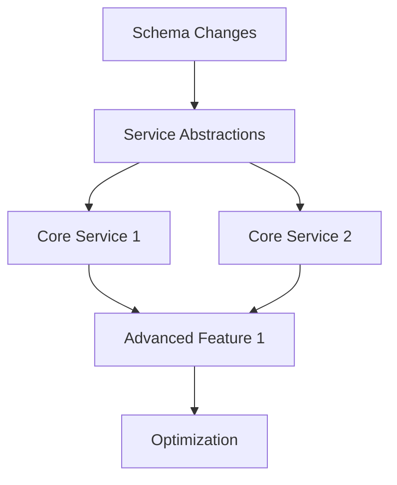

# Implementation Roadmap

> This document will be populated by the comparison agent.
> See AGENT_PROMPT.md for instructions.

## Status: PENDING

---

## Expected Contents

This document will contain a phased implementation plan:

1. **Timeline Overview**
   - Phase summary table
   - Total estimated duration
   - Critical path identification

2. **Phase A: Foundation**
   - Prerequisites and infrastructure
   - Goals, work items, risks, success criteria

3. **Phase B: Core Capabilities**
   - Must-have functionality
   - Goals, work items, risks, success criteria

4. **Phase C: Advanced Features**
   - Production-ready polish
   - Goals, work items, risks, success criteria

5. **Phase D: Optimization**
   - Scale and performance
   - Goals, work items, risks, success criteria

6. **Dependency Graph**
   - Visual representation of dependencies
   - Critical path analysis

---

## Template

When populated, this document will follow this structure:

```markdown
## Timeline Overview

| Phase | Name | Duration | Dependencies | Key Deliverables |
|-------|------|----------|--------------|------------------|
| A | Foundation | ? weeks | None | Infrastructure, schemas |
| B | Core Capabilities | ? weeks | Phase A | MVP functionality |
| C | Advanced Features | ? weeks | Phase B | Production features |
| D | Optimization | ? weeks | Phase C | Scale, performance |

**Total Estimated Duration**: ? weeks
**Critical Path**: A -> B -> [specific items]

---

## Phase A: Foundation

### Goals

1. Establish infrastructure needed for other phases
2. Create core abstractions and schemas
3. Set up testing infrastructure

### Work Items

| Item | Priority | Complexity | Estimate | Dependencies |
|------|----------|------------|----------|--------------|
| Schema changes for X | P0 | M | 3 days | None |
| Service abstraction Y | P0 | S | 2 days | Schema changes |
| ... | ... | ... | ... | ... |

### Risks

1. **Risk Name**: Description
   - Likelihood: High/Medium/Low
   - Impact: High/Medium/Low
   - Mitigation: How to address

### Success Criteria

- [ ] All schemas pass type checking
- [ ] Service abstractions have test coverage
- [ ] Infrastructure documented

---

## Phase B: Core Capabilities

[Same structure as Phase A]

---

## Phase C: Advanced Features

[Same structure as Phase A]

---

## Phase D: Optimization

[Same structure as Phase A]

---

## Dependency Graph



## Critical Path

The minimum time to completion is determined by:
1. [Item 1] (X weeks)
2. [Item 2] (Y weeks)
...

Total critical path: ? weeks
```

---

## Completion Criteria

This document is complete when:
- [ ] All gaps from GAP_ANALYSIS.md assigned to phases
- [ ] Each phase has goals, work items, risks, success criteria
- [ ] Dependencies mapped and no circular dependencies
- [ ] Estimates are realistic and consistent
- [ ] Critical path identified
