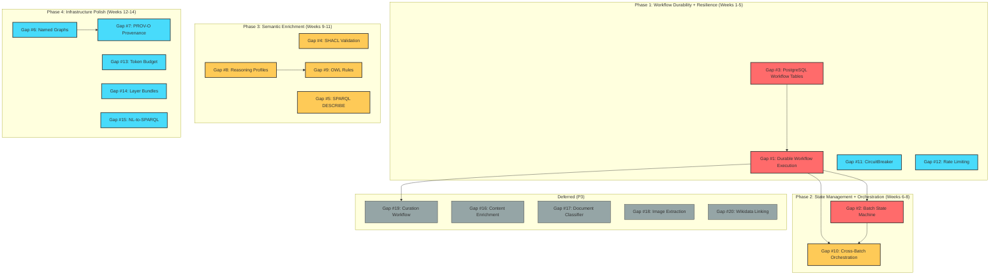

# Implementation Roadmap (Corrected)

## Executive Summary

This roadmap provides a phased strategy to close the **20 remaining capability gaps** between the effect-ontology reference implementation and the beep-effect knowledge slice. It supersedes the previous roadmap (2026-02-03) which was based on an outdated gap analysis that incorrectly listed SPARQL, RDF, Reasoning, GraphRAG, and Entity Resolution as missing. Those subsystems are fully implemented.

The knowledge slice has achieved substantial parity: **65 FULL + 19 PARTIAL** capabilities across semantic infrastructure, entity resolution, and GraphRAG. The remaining work concentrates in two areas:

1. **Workflow Durability** (P0): No crash recovery, no batch state machine, no cross-batch orchestration
2. **Semantic Enrichment** (P1-P2): No SHACL validation, incomplete reasoning profiles/OWL rules, no PROV-O provenance

### What Changed From Previous Roadmap

| Previous Roadmap (Outdated) | Corrected Roadmap |
|----------------------------|-------------------|
| 8 phases (Phase -1 through Phase 6) | 4 phases |
| 18-23 weeks estimated | 12-14 weeks estimated |
| Included RDF Foundation, SPARQL, Reasoning, GraphRAG as gaps | All implemented -- removed |
| Included Entity Resolution as gap | 19/23 parity -- removed |
| Included Architectural Foundation phase | Architecture established -- removed |
| Included POC Integration phase | Deferred to separate spec |

### Phase Summary

| Phase | Name | Focus | Duration |
|-------|------|-------|----------|
| 1 | Workflow Durability + Resilience | Crash recovery, LLM protection | Weeks 1-5 |
| 2 | State Management + Orchestration | Batch lifecycle, multi-document coordination | Weeks 6-8 |
| 3 | Semantic Enrichment | SHACL, reasoning profiles, OWL rules, DESCRIBE | Weeks 9-11 |
| 4 | Infrastructure Polish | Named graphs, provenance, token budget, bundles, NL-to-SPARQL | Weeks 12-14 |

**Total Estimated Duration**: 12-14 weeks with 2 engineers
**Critical Path**: Phase 1 -> Phase 2 -> Phase 3 (10.5 weeks)

---

## Guiding Principles

1. **Build on existing foundation**: SPARQL, Reasoning, RDF, GraphRAG, and Entity Resolution are implemented. New work extends these, not replaces them.
2. **Workflow-first**: Durable execution is the single largest production-readiness risk and must be addressed first.
3. **Incremental value**: Each phase delivers usable capability. No "big bang" integration.
4. **Minimal disruption**: Additive changes with backward compatibility. The existing ExtractionPipeline continues working throughout.
5. **Effect patterns**: All new code follows established @beep Effect patterns (namespace imports, tagged errors, Layer composition).
6. **Slice ownership**: New services stay within `packages/knowledge/*`. No shared kernel pollution.

---

## Implemented Baseline (No Work Required)

For reference, these capabilities are fully implemented and require no roadmap work:

| Subsystem | Key Files | Capability Count |
|-----------|-----------|-----------------|
| **SPARQL** | `server/src/Sparql/SparqlService.ts`, `QueryExecutor.ts`, `SparqlParser.ts`, `FilterEvaluator.ts` | 5/6 (DESCRIBE is Gap #5) |
| **Reasoning** | `server/src/Reasoning/ForwardChainer.ts`, `ReasonerService.ts`, `RdfsRules.ts` | 3/5 (Profiles, OWL are gaps) |
| **RDF** | `server/src/Rdf/RdfStoreService.ts`, `Serializer.ts`, `RdfBuilder.ts` | 3/4 (Named Graphs is Gap #6) |
| **GraphRAG** | `server/src/GraphRAG/` (8 files: GraphRAGService, GroundedAnswerGenerator, CitationParser, CitationValidator, ConfidenceScorer, ReasoningTraceFormatter, RrfScorer, PromptTemplates) | 12/12 FULL |
| **Entity Resolution** | `server/src/EntityResolution/` (8 files: EntityRegistry, EntityResolutionService, IncrementalClustererLive, EntityClusterer, SplitService, MergeHistoryLive, SameAsLinker, CanonicalSelector, BloomFilter) | 19/23 |
| **Extraction** | `server/src/Extraction/ExtractionPipeline.ts`, MentionExtractor, EntityExtractor, RelationExtractor, GraphAssembler | 6/6 FULL |
| **NLP** | `server/src/Nlp/NlpService.ts` | FULL |
| **Embedding** | `server/src/Embedding/EmbeddingService.ts` | FULL |
| **Ontology** | `server/src/Ontology/OntologyService.ts`, OntologyParser, OntologyCache | FULL |
| **Domain Models** | `domain/src/entities/` (Entity, Relation, MentionRecord, MergeHistory, SameAsLink, EntityCluster, Mention, etc.) | FULL |
| **Tables** | `tables/src/tables/` (entity, relation, mention-record, merge-history, same-as-link, entity-cluster, embedding, extraction, etc.) | FULL |
| **RPC Layer** | `server/src/rpc/v1/` (entity, relation, graphrag RPCs) | Established |

All file paths below are relative to `packages/knowledge/`.

---

## Detailed Phases

### Phase 1: Workflow Durability + Resilience (Weeks 1-5)

**Objective**: Establish crash-recoverable extraction workflows and protect LLM/embedding calls from cascade failures.

**Addresses**: Gap #3 (PostgreSQL Workflow Persistence), Gap #1 (Durable Workflow Execution), Gap #11 (CircuitBreaker), Gap #12 (Rate Limiting)

**Rationale**: Workflow durability is the single largest production-readiness risk. Without it, long-running extractions (large documents, slow LLM calls) cannot recover from failures. CircuitBreaker and rate limiting are small, high-value wins that protect LLM calls immediately while the larger workflow refactoring proceeds.

#### 1A. PostgreSQL Workflow Persistence (Gap #3) -- Days 1-4

**Priority**: P0 | **Complexity**: M | **Estimate**: 4 days

**Description**: Create Drizzle table definitions for @effect/workflow persistence: workflow execution state, activity journal, runner coordination, and signal delivery.

**Files to Create**:

```
tables/src/tables/
  workflow-execution.table.ts   # Workflow instance state (id, type, status, input, output, error)
  workflow-activity.table.ts    # Activity journal (execution_id, activity_name, status, result)
  workflow-signal.table.ts      # Signal delivery queue (execution_id, signal_name, payload)
```

**Files to Modify**:

```
tables/src/tables/index.ts     # Export new tables
tables/src/schema.ts           # Register in schema
tables/src/relations.ts        # FK: workflow_activity -> workflow_execution
```

**Key Design Decisions**:
- Workflow execution table stores serialized input/output as JSONB
- Activity journal enables replay from last completed activity
- Signal table supports SSE progress streaming via polling or LISTEN/NOTIFY
- All tables scoped by `organizationId` for multi-tenant isolation

**Success Criteria**:
- [ ] Drizzle schema compiles with `bun run check --filter @beep/knowledge-tables`
- [ ] Migration generates valid SQL
- [ ] `_check.ts` passes for domain model alignment
- [ ] Foreign key from `workflow_activity` to `workflow_execution` uses `.$type<>()` annotation

---

#### 1B. Durable Workflow Execution (Gap #1) -- Days 5-25

**Priority**: P0 | **Complexity**: XL | **Estimate**: 4 weeks

**Description**: Integrate @effect/workflow to make ExtractionPipeline crash-recoverable. Each extraction stage becomes a durable activity with automatic checkpointing and resume.

**Files to Create**:

```
server/src/Workflow/
  index.ts                      # Public exports
  ExtractionWorkflow.ts         # @effect/workflow definition with 6 durable activities
  DurableActivities.ts          # Activity wrappers for each extraction stage
  WorkflowPersistence.ts        # PostgreSQL persistence adapter using workflow tables
  ProgressStream.ts             # SSE progress event emission
```

```
domain/src/value-objects/
  WorkflowState.value.ts       # WorkflowExecutionState schema
  ExtractionProgress.value.ts  # Progress event schema for SSE
```

**Files to Modify**:

```
server/src/Extraction/ExtractionPipeline.ts  # Refactor stages into activity calls
server/src/Runtime/LlmLayers.ts              # Add workflow persistence layer
```

**Workflow Architecture**:

The ExtractionPipeline currently runs as a single Effect.gen block. This refactoring splits it into discrete durable activities:

```
ExtractionWorkflow
  |
  +-- Activity: ChunkText (durable)
  |     +-- [checkpoint]
  |
  +-- Activity: ExtractMentions (durable, per-chunk)
  |     +-- [checkpoint per chunk]
  |
  +-- Activity: ClassifyEntities (durable, batched)
  |     +-- [checkpoint per batch]
  |
  +-- Activity: ExtractRelations (durable, per-chunk)
  |     +-- [checkpoint per chunk]
  |
  +-- Activity: AssembleGraph (durable)
  |     +-- [checkpoint]
  |
  +-- Activity: ResolveEntities (durable, optional)
  |     +-- [final checkpoint]
  |
  +-- Signal: Progress (SSE stream at each checkpoint)
```

**Backward Compatibility**: The existing `ExtractionPipeline.run()` method signature is preserved. The workflow wraps the pipeline stages, not replaces them. Non-workflow mode continues to work for simple/test scenarios.

**Risks**:

| Risk | Likelihood | Impact | Mitigation |
|------|-----------|--------|------------|
| @effect/workflow API evolution | Medium | Medium | Pin version, abstract persistence adapter |
| Persistence schema evolution | Low | Medium | Use Drizzle migrations, version workflow definitions |
| ExtractionPipeline refactoring scope | Medium | High | Keep activity boundaries at existing stage boundaries |
| SSE connection management | Medium | Low | Implement reconnection with last-event-id |

**Success Criteria**:
- [ ] Extraction survives server restart at any stage
- [ ] Failed activities retry automatically with configurable policy
- [ ] Workflow state persisted in PostgreSQL
- [ ] Progress events emitted at each activity checkpoint
- [ ] Test: kill server mid-extraction, restart, extraction completes
- [ ] Existing `ExtractionPipeline.run()` continues working without workflow

---

#### 1C. CircuitBreaker for LLM Calls (Gap #11) -- Days 26-27

**Priority**: P2 | **Complexity**: S | **Estimate**: 2 days

**Description**: Wrap LLM and embedding service calls with circuit breaker pattern to prevent cascade failures during provider outages.

**Files to Create**:

```
server/src/Resilience/
  index.ts
  CircuitBreaker.ts             # Generic circuit breaker using Effect.retry + Ref state
```

**Files to Modify**:

```
server/src/Runtime/LlmLayers.ts                    # Wrap LLM layer with circuit breaker
server/src/Embedding/EmbeddingService.ts            # Wrap embedding calls with circuit breaker
server/src/GraphRAG/GroundedAnswerGenerator.ts      # Wrap LLM calls with circuit breaker
```

**Implementation Approach**: Use Effect's built-in `Effect.retry` with `Schedule` combinators plus `Ref<CircuitState>` for state tracking. Three states: closed (normal), open (failing fast), half-open (probing recovery).

**Success Criteria**:
- [ ] Circuit opens after N consecutive LLM failures
- [ ] Calls fail fast when circuit is open (no wasted API calls)
- [ ] Circuit half-opens after timeout, probes with single request
- [ ] Test: simulate provider outage, verify circuit opens and recovers

---

#### 1D. Rate Limiting for API Calls (Gap #12) -- Days 28-29

**Priority**: P2 | **Complexity**: S | **Estimate**: 1.5 days

**Description**: Add semaphore-based rate limiting for LLM and embedding API calls to prevent provider rate limit errors and cost overruns.

**Files to Create**:

```
server/src/Resilience/
  RateLimiter.ts                # Semaphore-based rate limiter with configurable concurrency
```

**Files to Modify**:

```
server/src/Runtime/LlmLayers.ts                    # Add rate limiter to LLM layer composition
server/src/Embedding/EmbeddingService.ts            # Add rate limiter to embedding calls
```

**Implementation Approach**: `Effect.Semaphore` with configurable permits per provider. Stacks with circuit breaker: request -> rate limit -> circuit breaker -> LLM call.

**Success Criteria**:
- [ ] Concurrent LLM calls limited to configured maximum
- [ ] Concurrent embedding calls limited to configured maximum
- [ ] Excess requests queue rather than fail
- [ ] Test: launch 20 concurrent extractions, verify rate limiting engages

---

### Phase 2: State Management + Orchestration (Weeks 6-8)

**Objective**: Add formal batch lifecycle tracking and multi-document coordination.

**Addresses**: Gap #2 (Batch State Machine), Gap #10 (Cross-Batch Orchestration)

**Rationale**: With durable workflows in place (Phase 1), this phase adds the state management layer that enables real-time progress visibility and batch-level coordination. These gaps are the second-highest priority for production readiness.

#### 2A. Batch State Machine (Gap #2) -- Days 1-8

**Priority**: P0 | **Complexity**: L | **Estimate**: 1.5 weeks

**Description**: Implement formal state transitions for extraction batches with event emission for SSE streaming to clients.

**State Machine Definition**:

```
PENDING -> CHUNKING -> EXTRACTING_MENTIONS -> EXTRACTING_ENTITIES
  -> EXTRACTING_RELATIONS -> ASSEMBLING -> RESOLVING -> COMPLETED
                                                    -> FAILED (from any state)
                                                    -> CANCELLED (from any state)
```

**Files to Create**:

```
domain/src/value-objects/
  BatchState.value.ts          # BatchState union type (S.Union of TaggedStructs)
  BatchEvent.value.ts          # BatchEvent schema for SSE emission

server/src/Workflow/
  BatchStateMachine.ts          # State machine with transition validation
  BatchEventEmitter.ts          # PubSub-based event emission for SSE
```

```
domain/src/rpc/Extraction/
  StreamProgress.ts             # SSE streaming RPC contract for progress events
```

**Files to Modify**:

```
server/src/Workflow/ExtractionWorkflow.ts   # Emit state transitions at each activity
server/src/Workflow/ProgressStream.ts       # Wire state machine to SSE stream
domain/src/rpc/Extraction/_rpcs.ts          # Add StreamProgress to RPC group
```

**Key Design Decisions**:
- State machine uses `S.Union` of `S.TaggedStruct` variants for exhaustive matching
- Transition validation prevents invalid state changes (e.g., COMPLETED -> EXTRACTING)
- Events emitted via Effect PubSub for decoupled SSE delivery
- In-memory PubSub initially; durable event log via workflow signal table (from Phase 1)

**Success Criteria**:
- [ ] All state transitions validated (invalid transitions rejected with tagged error)
- [ ] SSE endpoint streams real-time progress events
- [ ] State machine integrates with durable workflow activities
- [ ] Progress events include stage name, percentage, current/total items
- [ ] FAILED state captures error details for display
- [ ] CANCELLED state supports user-initiated cancellation

---

#### 2B. Cross-Batch Orchestration (Gap #10) -- Days 9-16

**Priority**: P1 | **Complexity**: L | **Estimate**: 1.5 weeks

**Description**: Coordinate multi-document batch processing as a single unit with aggregate progress tracking and configurable failure behavior.

**Files to Create**:

```
domain/src/entities/Batch/
  index.ts
  Agent.model.ts                # Batch definition (documents[], config, status)

domain/src/value-objects/
  BatchConfig.value.ts         # Batch-level config (concurrency, failure policy)
  batch-failure-policy.value.ts # continue-on-failure | abort-all | retry-failed

server/src/Workflow/
  BatchOrchestrator.ts          # Coordinates multiple ExtractionWorkflows
  BatchAggregator.ts            # Aggregates per-document progress into batch progress
```

```
tables/src/tables/
  batch.table.ts                # Batch definition and aggregate status
```

**Files to Modify**:

```
server/src/Workflow/ExtractionWorkflow.ts   # Accept batch context for cross-document resolution
domain/src/rpc/Extraction/_rpcs.ts          # Add batch-level RPCs
tables/src/tables/index.ts                  # Export batch table
tables/src/schema.ts                        # Register batch table
```

**Orchestration Architecture**:

```
BatchOrchestrator
  |
  +-- For each document in batch:
  |     +-- ExtractionWorkflow (durable, parallel with concurrency limit)
  |           +-- [per-document state machine]
  |
  +-- BatchAggregator
  |     +-- Aggregate individual progress -> batch progress
  |     +-- Apply failure policy (continue, abort, retry)
  |
  +-- Post-batch resolution
        +-- IncrementalClusterer across all batch documents
        +-- SameAsLinker for cross-document entity links
```

**Dependencies**: Phase 1 (durable workflows) must be complete.

**Success Criteria**:
- [ ] Submit batch of N documents, all processed with aggregate progress
- [ ] Configurable concurrency (process M documents in parallel)
- [ ] Failure policy: continue-on-failure processes remaining documents
- [ ] Failure policy: abort-all stops all documents on first failure
- [ ] Cross-document entity resolution runs after all extractions complete
- [ ] Test: batch of 5 documents with 1 failure, verify continue-on-failure behavior

---

### Phase 3: Semantic Enrichment (Weeks 9-11)

**Objective**: Add SHACL validation, complete reasoning capabilities, and fill SPARQL gaps.

**Addresses**: Gap #4 (SHACL Validation), Gap #8 (Reasoning Profiles), Gap #9 (OWL Rules), Gap #5 (SPARQL DESCRIBE)

**Rationale**: These gaps leverage the existing SPARQL and Reasoning infrastructure. SHACL is the highest-priority semantic gap (P1) as it enables data quality enforcement. Reasoning profiles and OWL rules are small additions with outsized impact on inference quality. SPARQL DESCRIBE is a trivial gap closure.

#### 3A. SHACL Validation (Gap #4) -- Days 1-8

**Priority**: P1 | **Complexity**: L | **Estimate**: 1.5 weeks

**Description**: Add SHACL (Shapes Constraint Language) validation for data quality enforcement, with policy-based control (warn, reject, ignore per violation severity).

**Files to Create**:

```
server/src/Validation/
  index.ts
  ShaclService.ts               # SHACL validation engine (wrapping shacl-engine or rdf-validate-shacl)
  ShaclParser.ts                # Parse SHACL shapes from Turtle/RDF
  ShapeGenerator.ts             # Auto-generate shapes from ontology property definitions
  ValidationReport.ts           # Validation report schema

domain/src/value-objects/
  shacl-policy.value.ts         # Policy configuration (warn/reject/ignore per shape)
  validation-report.value.ts    # Validation result schema
```

**Files to Modify**:

```
server/src/Extraction/GraphAssembler.ts     # Optional SHACL validation after graph assembly
server/src/Ontology/OntologyService.ts      # Generate SHACL shapes from loaded ontology
```

**Key Design Decisions**:
- Use `shacl-engine` npm package (pure JS, works with N3.Store)
- Re-SHACL pattern: apply only subclass inference (via ReasonerService with rdfs-subclass profile) before validation
- Shapes cached via content hashing for performance
- Auto-generate shapes from ontology `rdfs:domain`, `rdfs:range`, cardinality definitions
- Policy-based control: each shape maps to warn/reject/ignore based on severity configuration

**Dependencies**: RdfStoreService (exists), ReasonerService (exists), OntologyService (exists)

**Success Criteria**:
- [ ] SHACL shapes auto-generated from ontology property definitions
- [ ] Validation detects missing required properties, wrong cardinality, incorrect value types
- [ ] Policy-based control: warn for minor issues, reject for critical violations
- [ ] Validation report includes human-readable violation descriptions
- [ ] Integration: GraphAssembler optionally validates before persisting
- [ ] Test: entity with missing required property triggers configured policy action

---

#### 3B. Reasoning Profiles (Gap #8) -- Days 9-10

**Priority**: P1 | **Complexity**: S | **Estimate**: 1.5 days

**Description**: Make ForwardChainer respect the `profile` field in ReasoningConfig, mapping profile names to rule subsets rather than always applying all RDFS rules.

**Files to Modify**:

```
server/src/Reasoning/ForwardChainer.ts      # Add profile -> rule set mapping
server/src/Reasoning/ReasonerService.ts     # Pass profile to ForwardChainer
domain/src/value-objects/reasoning/ReasoningProfile.ts  # Define standard profile names
```

**Standard Profiles**:

| Profile | Rules Applied | Use Case |
|---------|--------------|----------|
| `rdfs-full` | rdfs2, rdfs3, rdfs5, rdfs7, rdfs9, rdfs11 | Full RDFS inference |
| `rdfs-subclass` | rdfs9, rdfs11 | Re-SHACL validation pre-processing |
| `rdfs-domain-range` | rdfs2, rdfs3 | Type inference from property usage |
| `owl-sameas` | OWL sameAs rules (from Gap #9) | Entity resolution inference |
| `owl-full` | All OWL rules (from Gap #9) | Full OWL RL inference |
| `custom` | User-specified rule array | Advanced scenarios |

**Success Criteria**:
- [ ] `profile: "rdfs-subclass"` applies only rdfs9 + rdfs11
- [ ] `profile: "rdfs-full"` applies all 6 RDFS rules (current behavior)
- [ ] Custom rule arrays accepted
- [ ] Performance test: rdfs-subclass is measurably faster than rdfs-full on large graphs

---

#### 3C. OWL Rules (Gap #9) -- Days 11-13

**Priority**: P1 | **Complexity**: S-M | **Estimate**: 2.5 days

**Description**: Add OWL reasoning rules beyond RDFS, enabling sameAs propagation, inverse property inference, and transitive property inference.

**Files to Create**:

```
server/src/Reasoning/
  OwlRules.ts                   # OWL RL rules (sameAs, inverseOf, transitive, symmetric)
```

**Files to Modify**:

```
server/src/Reasoning/ForwardChainer.ts      # Register OWL rules alongside RDFS rules
server/src/Reasoning/ReasonerService.ts     # Support OWL profiles
```

**OWL Rules to Implement**:

| Rule | Pattern | Inference |
|------|---------|-----------|
| sameAs-symmetry | `?x owl:sameAs ?y` | `?y owl:sameAs ?x` |
| sameAs-transitivity | `?x owl:sameAs ?y . ?y owl:sameAs ?z` | `?x owl:sameAs ?z` |
| sameAs-property-propagation | `?x owl:sameAs ?y . ?x ?p ?o` | `?y ?p ?o` |
| inverseOf | `?p owl:inverseOf ?q . ?s ?p ?o` | `?o ?q ?s` |
| transitiveProperty | `?p rdf:type owl:TransitiveProperty . ?x ?p ?y . ?y ?p ?z` | `?x ?p ?z` |
| symmetricProperty | `?p rdf:type owl:SymmetricProperty . ?x ?p ?y` | `?y ?p ?x` |

**Impact**: SameAsLinker already generates owl:sameAs links in the RDF store. With these rules, ForwardChainer can propagate sameAs implications (symmetric closure, transitive closure, property propagation), significantly improving entity resolution reasoning.

**Success Criteria**:
- [ ] owl:sameAs links produce symmetric + transitive closure
- [ ] owl:inverseOf generates inverse triples
- [ ] owl:TransitiveProperty generates transitive closure
- [ ] OWL rules registered under `owl-sameas` and `owl-full` profiles
- [ ] Test: sameAs chain A->B->C produces A->C inference

---

#### 3D. SPARQL DESCRIBE (Gap #5) -- Day 14

**Priority**: P1 | **Complexity**: S | **Estimate**: 1 day

**Description**: Add DESCRIBE query type support to SparqlService. DESCRIBE returns all triples where a given IRI appears as subject or object.

**Files to Modify**:

```
server/src/Sparql/QueryExecutor.ts          # Add executeDescribe method
server/src/Sparql/SparqlService.ts          # Add DESCRIBE dispatch in query() method
```

**Implementation**: DESCRIBE is equivalent to CONSTRUCT of all triples where the target IRI appears as subject or object. Since SparqlParser (sparqljs) already parses DESCRIBE queries, the only work is dispatching to a new `executeDescribe` method in QueryExecutor.

**Success Criteria**:
- [ ] `DESCRIBE <urn:entity:123>` returns all triples about that entity
- [ ] Multiple DESCRIBE targets supported
- [ ] Test: describe entity returns both outgoing and incoming relations

---

### Phase 4: Infrastructure Polish (Weeks 12-14)

**Objective**: Add named graph management, W3C provenance, token cost control, layer bundles, and NL-to-SPARQL translation.

**Addresses**: Gap #6 (Named Graphs), Gap #7 (PROV-O Provenance), Gap #13 (Token Budget), Gap #14 (Layer Bundles), Gap #15 (NL-to-SPARQL)

**Rationale**: These are enhancement-level gaps (P1-P2) that improve interoperability, cost control, developer experience, and end-user accessibility. They have no dependencies on each other and can be parallelized across engineers.

#### 4A. Named Graphs Management (Gap #6) -- Days 1-4

**Priority**: P1 | **Complexity**: M | **Estimate**: 4 days

**Description**: Add graph management API to RdfStoreService and GRAPH clause support in SPARQL queries.

**Files to Modify**:

```
server/src/Rdf/RdfStoreService.ts           # Add createGraph, listGraphs, dropGraph, getGraphSize
server/src/Sparql/QueryExecutor.ts           # Add GRAPH clause evaluation
server/src/Sparql/FilterEvaluator.ts         # Handle graph-scoped pattern matching
```

**Files to Create**:

```
domain/src/value-objects/rdf/
  NamedGraph.ts                 # Named graph metadata schema (IRI, created, quad count)
```

**Graph Naming Convention**:
- `urn:beep:document:<documentId>` -- per-document graph
- `urn:beep:extraction:<extractionId>` -- per-extraction graph
- `urn:beep:inference:<profile>` -- inferred triples by profile
- `urn:beep:provenance` -- PROV-O provenance triples (Phase 4B)

**Success Criteria**:
- [ ] Create, list, and drop named graphs
- [ ] SPARQL GRAPH clause scopes queries to specific graphs
- [ ] Extraction pipeline stores triples in per-extraction named graph
- [ ] Test: query only triples from a specific document's graph

---

#### 4B. PROV-O Provenance (Gap #7) -- Days 5-8

**Priority**: P1 | **Complexity**: M | **Estimate**: 4 days

**Description**: Generate W3C PROV-O provenance triples during extraction for full lineage tracking at the RDF level.

**Files to Create**:

```
server/src/Rdf/
  ProvOConstants.ts             # PROV-O namespace and predicate constants
  ProvenanceEmitter.ts          # Generate PROV-O triples during extraction

domain/src/value-objects/rdf/
  ProvenanceVocabulary.ts       # PROV-O type definitions (Activity, Entity, Agent)
```

**Files to Modify**:

```
server/src/Extraction/ExtractionPipeline.ts  # Emit PROV-O triples at extraction start/end
server/src/Extraction/GraphAssembler.ts      # Tag assembled triples with prov:wasGeneratedBy
server/src/Ontology/constants.ts             # Add PROV-O namespace alongside existing RDF/RDFS/OWL/SKOS
```

**PROV-O Triples Generated**:

```turtle
# Activity (extraction run)
<urn:beep:extraction:abc123> a prov:Activity ;
  prov:startedAtTime "2026-02-05T10:00:00Z"^^xsd:dateTime ;
  prov:endedAtTime "2026-02-05T10:05:00Z"^^xsd:dateTime ;
  prov:wasAssociatedWith <urn:beep:agent:gpt-4o> .

# Agent (LLM model)
<urn:beep:agent:gpt-4o> a prov:Agent ;
  rdfs:label "gpt-4o" .

# Entity provenance
<urn:beep:entity:xyz789> prov:wasGeneratedBy <urn:beep:extraction:abc123> ;
  prov:generatedAtTime "2026-02-05T10:03:00Z"^^xsd:dateTime .
```

**Integration**: Provenance triples stored in `urn:beep:provenance` named graph (from Phase 4A). Existing relational provenance (extractionId, documentId on MentionRecord) continues to work for application queries.

**Success Criteria**:
- [ ] Extraction generates PROV-O Activity, Agent, wasGeneratedBy triples
- [ ] Provenance triples stored in dedicated named graph
- [ ] SPARQL query can answer "what extraction produced this entity?"
- [ ] Test: extract text, query PROV-O graph, verify lineage chain

---

#### 4C. Token Budget Service (Gap #13) -- Days 9-12

**Priority**: P2 | **Complexity**: M | **Estimate**: 4 days

**Description**: Track and enforce per-stage token budgets to prevent runaway LLM costs during extraction.

**Files to Create**:

```
server/src/Resilience/
  TokenBudget.ts                # Per-stage token budget tracking and enforcement

domain/src/value-objects/
  token-budget.value.ts         # Budget configuration schema (per-stage limits)
```

**Files to Modify**:

```
server/src/Extraction/MentionExtractor.ts    # Report token usage to budget service
server/src/Extraction/EntityExtractor.ts     # Report token usage to budget service
server/src/Extraction/RelationExtractor.ts   # Report token usage to budget service
server/src/GraphRAG/GroundedAnswerGenerator.ts  # Report token usage to budget service
```

**Implementation Approach**:
- `Ref<Map<string, { used: number, limit: number }>>` tracks per-stage usage
- Each LLM call reports token count via `TokenBudget.recordUsage(stage, tokens)`
- Budget exceeded emits warning or fails based on policy (warn vs. hard limit)
- Token counting: use `@effect/ai` response metadata or tiktoken for pre-call estimation

**Success Criteria**:
- [ ] Token usage tracked per extraction stage
- [ ] Warning emitted when stage exceeds 80% of budget
- [ ] Hard limit prevents further LLM calls when budget exhausted
- [ ] Usage statistics available for operational monitoring

---

#### 4D. Layer Bundles (Gap #14) -- Days 13-14

**Priority**: P2 | **Complexity**: S | **Estimate**: 1.5 days

**Description**: Create pre-composed Layer bundles for common service groupings, reducing repetitive layer composition across consumers and test files.

**Files to Create**:

```
server/src/Runtime/
  ServiceBundles.ts             # Pre-composed Layer bundles
```

**Bundle Definitions**:

```typescript
// Semantic infrastructure
export const SemanticInfraBundle = Layer.mergeAll(
  RdfStoreServiceLive,
  SerializerLive,
  SparqlServiceLive,
  ReasonerServiceLive,
);

// Extraction pipeline
export const ExtractionBundle = Layer.mergeAll(
  NlpServiceLive,
  MentionExtractorLive,
  EntityExtractorLive,
  RelationExtractorLive,
  GraphAssemblerLive,
);

// GraphRAG
export const GraphRAGBundle = Layer.mergeAll(
  GraphRAGServiceLive,
  GroundedAnswerGeneratorLive,
  CitationValidatorLive,
  ReasoningTraceFormatterLive,
  RrfScorerLive,
  ConfidenceScorerLive,
);

// Entity resolution
export const ResolutionBundle = Layer.mergeAll(
  EntityResolutionServiceLive,
  EntityRegistryLive,
  IncrementalClustererLive,
  SplitServiceLive,
  MergeHistoryLive,
  SameAsLinkerLive,
);

// LLM control (Phase 1 additions)
export const LlmControlBundle = Layer.mergeAll(
  LlmLive,
  CircuitBreakerLive,
  RateLimiterLive,
);
```

**Success Criteria**:
- [ ] All bundles compose without layer conflicts
- [ ] Test files can use bundles instead of individual layer composition
- [ ] Bundle exports documented in module index

---

#### 4E. NL-to-SPARQL Generation (Gap #15) -- Days 15-18

**Priority**: P2 | **Complexity**: M | **Estimate**: 4 days

**Description**: Add LLM-powered natural language to SPARQL translation, enabling non-technical users to query the knowledge graph.

**Files to Create**:

```
server/src/Sparql/
  SparqlGenerator.ts            # NL-to-SPARQL translation service
  SparqlGeneratorPrompts.ts     # Prompt templates with ontology context
```

**Files to Modify**:

```
server/src/GraphRAG/GraphRAGService.ts      # Add SPARQL generation as alternative query path
domain/src/rpc/GraphRag/_rpcs.ts            # Optionally extend query RPC with SPARQL generation mode
```

**Implementation Approach**:
1. Load active ontology schema (classes, properties, domains, ranges) as prompt context
2. LLM generates SPARQL query from natural language
3. Parse generated SPARQL with SparqlParser for syntax validation
4. If parse fails, retry with error feedback (up to 3 attempts)
5. Execute validated SPARQL via SparqlService
6. Return results alongside generated query for transparency

**Success Criteria**:
- [ ] Natural language question generates syntactically valid SPARQL
- [ ] Generated SPARQL executes against RdfStore and returns correct results
- [ ] Parse errors trigger retry with feedback
- [ ] Generated SPARQL shown alongside results for user verification
- [ ] Test: "What entities are related to Company X?" generates working SPARQL

---

## P3 Gaps (Deferred)

The following gaps are P3 (Low priority) and are not scheduled in this roadmap. They should be addressed after P0-P2 gaps are closed.

| Gap # | Name | Complexity | Estimated Effort | Notes |
|-------|------|-----------|-----------------|-------|
| 16 | Content Enrichment Agent | M | 4 days | LLM-powered entity enrichment post-extraction |
| 17 | Document Classifier | M | 4 days | Adaptive chunking by document type |
| 18 | Image Extraction | L | 1.5 weeks | Multi-modal extraction from images/PDFs |
| 19 | Curation Workflow | XL | 3 weeks | Human-in-the-loop claim review; depends on Phase 1 |
| 20 | Wikidata Linking | M | 4 days | External KB integration for disambiguation |

---

## Dependency Graph



**Legend**: Red = P0 Critical | Yellow = P1 High | Blue = P2 Medium | Gray = P3 Deferred

---

## Critical Path Analysis

```
Phase 1 (5 weeks) -> Phase 2 (3 weeks) -> [Phase 3, Phase 4 parallel] (3 weeks)
                                            Total: 11 weeks minimum
```

**Critical Path**: Gap #3 -> Gap #1 -> Gap #2 -> Gap #10 = 8.5 weeks

**Parallel Opportunities**:
- Phase 1C/1D (CircuitBreaker, RateLimiter) are independent of Phase 1B and can proceed in parallel
- Phase 3 and Phase 4 have no inter-phase dependencies and can run in parallel with 2 engineers
- Within Phase 4, all items (4A-4E) are independent of each other

### Resource Allocation Recommendation (2 Engineers)

| Week | Engineer A | Engineer B |
|------|-----------|-----------|
| 1 | Gap #3: Workflow Tables | Gap #11: CircuitBreaker + Gap #12: Rate Limiting |
| 2-5 | Gap #1: Durable Workflow Execution | Gap #1: Durable Workflow Execution (pair) |
| 6-7 | Gap #2: Batch State Machine | Gap #8: Reasoning Profiles + Gap #9: OWL Rules + Gap #5: DESCRIBE |
| 8 | Gap #10: Cross-Batch Orchestration | Gap #4: SHACL Validation (start) |
| 9-10 | Gap #10: Cross-Batch Orchestration (finish) + Gap #6: Named Graphs | Gap #4: SHACL Validation (finish) + Gap #7: PROV-O |
| 11-12 | Gap #13: Token Budget + Gap #14: Layer Bundles | Gap #15: NL-to-SPARQL |
| 13-14 | Buffer / Testing / P3 gaps | Buffer / Testing / P3 gaps |

---

## Risk Assessment

### Phase-Level Risks

| Phase | Risk | Likelihood | Impact | Mitigation |
|-------|------|-----------|--------|------------|
| 1 | @effect/workflow API instability | Medium | High | Pin version, abstract persistence adapter, maintain non-workflow fallback |
| 1 | ExtractionPipeline refactoring breaks existing tests | Medium | Medium | Preserve existing `.run()` signature, run test suite continuously |
| 2 | State machine complexity exceeds estimates | Low | Medium | Start with in-memory state machine, persist later |
| 2 | Cross-batch orchestration interacts poorly with durable workflows | Medium | Medium | Design BatchOrchestrator as thin coordinator over ExtractionWorkflows |
| 3 | SHACL engine performance on large graphs | Medium | Medium | Shapes caching, Re-SHACL pattern (targeted inference) |
| 3 | OWL rules cause inference explosion | Medium | High | Configurable max inference depth, profile-based rule selection |
| 4 | NL-to-SPARQL generates invalid/unsafe queries | High | Low | Parse validation, execution timeout, read-only queries only |

### If Phases Are Delayed

| Scenario | Impact | Acceptable? |
|----------|--------|-------------|
| Phase 1 delayed | No crash recovery for extraction | Not acceptable for production |
| Phase 2 delayed | No batch processing, no progress UI | Acceptable for MVP (single-document works) |
| Phase 3 delayed | No SHACL validation, incomplete reasoning | Acceptable for MVP (existing RDFS works) |
| Phase 4 delayed | No PROV-O, no NL-to-SPARQL | Acceptable (enhancement-level gaps) |

---

## Success Metrics

### Phase Completion Criteria

| Phase | Metric | Target |
|-------|--------|--------|
| 1 | Extraction recovery rate | 100% (survives restart at any stage) |
| 1 | Circuit breaker effectiveness | < 5% cascading failures during LLM outage |
| 2 | Batch processing throughput | N documents processed with aggregate progress |
| 2 | State machine coverage | All extraction stages tracked with SSE events |
| 3 | SHACL validation coverage | Auto-generated shapes for all ontology properties |
| 3 | Reasoning profile performance | rdfs-subclass 3x faster than rdfs-full |
| 4 | Named graph query correctness | SPARQL GRAPH clause returns graph-scoped results |
| 4 | NL-to-SPARQL success rate | >70% of natural language queries produce valid SPARQL |

### Overall Project Success

- [ ] All P0 gaps from GAP_ANALYSIS.md closed (Gaps #1, #2, #3)
- [ ] All P1 gaps from GAP_ANALYSIS.md closed (Gaps #4, #5, #6, #7, #8, #9, #10)
- [ ] P2 gaps closed or deferred with documented rationale (Gaps #11-#15)
- [ ] Existing ExtractionPipeline works unchanged during migration
- [ ] Performance regression < 10% for current workloads
- [ ] Test coverage > 80% for new services
- [ ] All new code follows @beep Effect patterns (namespace imports, tagged errors, Layer composition)

---

## External Dependencies

| Dependency | Version | Purpose | Phase | Risk |
|-----------|---------|---------|-------|------|
| @effect/workflow | ^0.x | Durable execution | 1 | Medium - evolving API |
| shacl-engine | ^1.x | SHACL validation | 3 | Low - stable |
| N3.js | ^1.17.0 | RDF storage (existing) | 3-4 | Low - already in use |
| sparqljs | ^3.7.0 | SPARQL parsing (existing) | 3 | Low - already in use |
| @effect/ai | ^0.x | LLM integration (existing) | 4 | Low - already in use |

---

## Open Questions

### Technical Questions

1. **@effect/workflow Persistence Model**
   - Question: Does @effect/workflow provide a built-in PostgreSQL persistence adapter, or must we build one?
   - Impact: Phase 1B effort estimate
   - Decision needed by: Phase 1 start
   - Recommendation: Investigate @effect/workflow docs; build custom adapter if needed using workflow tables from Phase 1A

2. **SHACL Engine Selection**
   - Question: `shacl-engine` vs `rdf-validate-shacl` -- which integrates better with N3.Store?
   - Impact: Phase 3A implementation approach
   - Decision needed by: Phase 3 start
   - Recommendation: Prototype both during Phase 2, select based on N3.Store compatibility

3. **Named Graph Storage Strategy**
   - Question: Single N3.Store with graph-tagged quads vs. separate N3.Store per graph?
   - Impact: Phase 4A performance characteristics
   - Decision needed by: Phase 4 start
   - Recommendation: Single store with graph field (N3.Store already supports this via quad's graph component)

### Business Questions

1. **Cross-Batch Orchestration Priority**
   - Question: Is multi-document batch processing a launch requirement or post-launch enhancement?
   - Impact: Could defer Phase 2B
   - Stakeholder: Product

2. **PROV-O Interoperability Need**
   - Question: Are there external tools consuming provenance data that require W3C PROV-O?
   - Impact: Could defer Phase 4B if no external consumers
   - Stakeholder: Product/Integration team

---

## Appendix: File Reference Summary

### Existing Files (Implemented, No Work Required)

| Directory | File Count | Key Services |
|-----------|-----------|-------------|
| `server/src/Sparql/` | 5 | SparqlService, SparqlParser, QueryExecutor, FilterEvaluator, SparqlModels |
| `server/src/Reasoning/` | 3 | ForwardChainer, ReasonerService, RdfsRules |
| `server/src/Rdf/` | 3 | RdfStoreService, Serializer, RdfBuilder |
| `server/src/GraphRAG/` | 9 | GraphRAGService, GroundedAnswerGenerator, CitationParser, CitationValidator, ConfidenceScorer, ReasoningTraceFormatter, RrfScorer, PromptTemplates, AnswerSchemas |
| `server/src/EntityResolution/` | 9 | EntityRegistry, EntityResolutionService, IncrementalClustererLive, EntityClusterer, SplitService, MergeHistoryLive, SameAsLinker, CanonicalSelector, BloomFilter |
| `server/src/Extraction/` | 5 | ExtractionPipeline, MentionExtractor, EntityExtractor, RelationExtractor, GraphAssembler |
| `server/src/Embedding/` | 4 | EmbeddingService, EmbeddingProvider, MockProvider, OpenAiLayer |
| `server/src/Ontology/` | 4 | OntologyService, OntologyParser, OntologyCache, constants |
| `server/src/Nlp/` | 2 | NlpService, TextChunk |
| `server/src/Grounding/` | 2 | GroundingService, ConfidenceFilter |
| `server/src/db/repos/` | 10 | Entity, Relation, MentionRecord, MergeHistory, SameAsLink, EntityCluster, Embedding, Ontology, ClassDefinition, PropertyDefinition |
| `tables/src/tables/` | 12 | entity, relation, mention, mention-record, merge-history, same-as-link, entity-cluster, embedding, extraction, ontology, class-definition, property-definition |
| `domain/src/entities/` | 11 | Entity, Relation, Mention, MentionRecord, MergeHistory, SameAsLink, EntityCluster, Embedding, Extraction, Ontology, ClassDefinition, PropertyDefinition |

### New Files to Create (This Roadmap)

| Phase | Directory | Files | Purpose |
|-------|-----------|-------|---------|
| 1A | `tables/src/tables/` | workflow-execution.table.ts, workflow-activity.table.ts, workflow-signal.table.ts | Workflow persistence |
| 1B | `server/src/Workflow/` | ExtractionWorkflow.ts, DurableActivities.ts, WorkflowPersistence.ts, ProgressStream.ts, index.ts | Durable workflow execution |
| 1B | `domain/src/value-objects/` | WorkflowState.value.ts, ExtractionProgress.value.ts | Workflow domain types |
| 1C | `server/src/Resilience/` | CircuitBreaker.ts, index.ts | LLM failure protection |
| 1D | `server/src/Resilience/` | RateLimiter.ts | API rate limiting |
| 2A | `domain/src/value-objects/` | BatchState.value.ts, BatchEvent.value.ts | Batch state machine types |
| 2A | `server/src/Workflow/` | BatchStateMachine.ts, BatchEventEmitter.ts | State management |
| 2A | `domain/src/rpc/Extraction/` | StreamProgress.ts | SSE RPC contract |
| 2B | `domain/src/entities/Batch/` | Agent.model.ts, index.ts | Batch definition model |
| 2B | `domain/src/value-objects/` | BatchConfig.value.ts, batch-failure-policy.value.ts | Batch configuration |
| 2B | `server/src/Workflow/` | BatchOrchestrator.ts, BatchAggregator.ts | Batch coordination |
| 2B | `tables/src/tables/` | batch.table.ts | Batch persistence |
| 3A | `server/src/Validation/` | ShaclService.ts, ShaclParser.ts, ShapeGenerator.ts, ValidationReport.ts, index.ts | SHACL validation |
| 3A | `domain/src/value-objects/` | shacl-policy.value.ts, validation-report.value.ts | SHACL domain types |
| 3C | `server/src/Reasoning/` | OwlRules.ts | OWL reasoning rules |
| 4A | `domain/src/value-objects/rdf/` | NamedGraph.ts | Graph metadata |
| 4B | `server/src/Rdf/` | ProvOConstants.ts, ProvenanceEmitter.ts | PROV-O provenance |
| 4B | `domain/src/value-objects/rdf/` | ProvenanceVocabulary.ts | PROV-O types |
| 4C | `server/src/Resilience/` | TokenBudget.ts | Token cost control |
| 4C | `domain/src/value-objects/` | token-budget.value.ts | Budget configuration |
| 4D | `server/src/Runtime/` | ServiceBundles.ts | Layer bundles |
| 4E | `server/src/Sparql/` | SparqlGenerator.ts, SparqlGeneratorPrompts.ts | NL-to-SPARQL |

**Total new files**: ~40
**Total modified files**: ~20

---

## Document Metadata

| Field | Value |
|-------|-------|
| Status | COMPLETE |
| Created | 2026-02-03 |
| Last Updated | 2026-02-05 |
| Supersedes | IMPLEMENTATION_ROADMAP.md (2026-02-03, 1546 lines, 8 phases) |
| Author | Implementation Planning Agent |
| Key Correction | Removed 4 phases for already-implemented capabilities (RDF, SPARQL, Reasoning, GraphRAG, Entity Resolution) |
| Gap Source | GAP_ANALYSIS.md (Corrected, 2026-02-05) |
| Matrix Source | COMPARISON_MATRIX.md (Corrected, 2026-02-05) |
