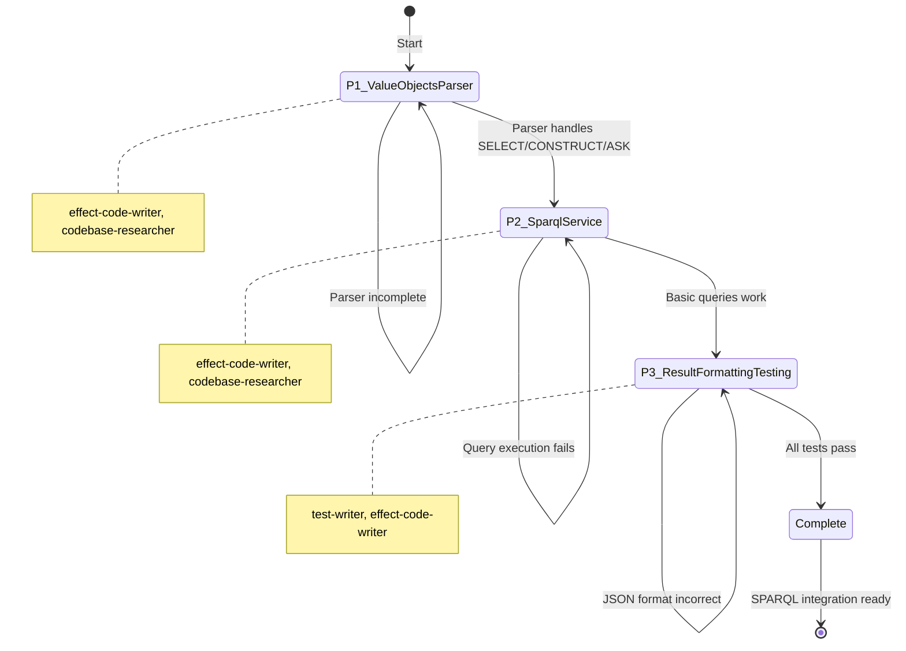
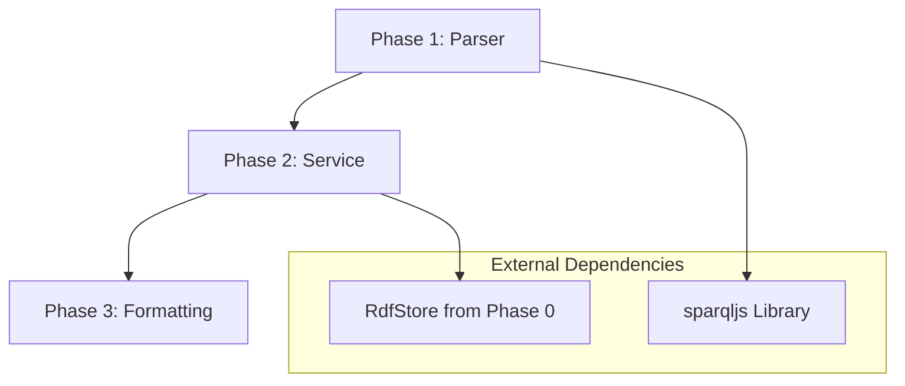

# Master Orchestration: Knowledge SPARQL Integration

> Complete phase workflows, agent delegation matrix, and verification protocols for implementing SPARQL query capability over the RDF knowledge graph.

---

## Overview

This specification orchestrates the development of SPARQL 1.1 query capability for the knowledge graph. The implementation wraps the sparqljs parser, executes queries against RdfStore, and formats results in W3C SPARQL JSON format. This enables semantic querying across entity relationships, ontology validation, and graph pattern matching.

### Workflow Diagram

```mermaid
flowchart TD
    subgraph Phase1["Phase 1: Value Objects & Parser"]
        P1A[SparqlQuery Value Object] --> P1B[SparqlBindings Value Object]
        P1B --> P1C[SparqlParser Service]
        P1C --> P1D[Parse Unit Tests]
    end

    subgraph Phase2["Phase 2: SPARQL Service"]
        P2A[SparqlService Interface] --> P2B[Query Executor]
        P2B --> P2C[Variable Binding Engine]
        P2C --> P2D[FILTER Evaluation]
        P2D --> P2E[RdfStore Integration]
    end

    subgraph Phase3["Phase 3: Result Formatting & Testing"]
        P3A[ResultFormatter Utility] --> P3B[JSON Bindings Format]
        P3B --> P3C[RDF Graph Format]
        P3C --> P3D[Integration Tests]
        P3D --> P3E[Performance Benchmarks]
    end

    Phase1 --> Phase2
    Phase2 --> Phase3

    subgraph Dependencies["Dependencies"]
        D1[RdfStore from Phase 0]
        D2[sparqljs Library]
        D3[@beep/testkit]
    end

    Phase1 -.->|uses| D2
    Phase2 -.->|uses| D1
    Phase3 -.->|uses| D3
```

### State Machine



---

## Agent Delegation Matrix

| Phase | Task | Primary Agent | Secondary Agent | Research Agent |
|-------|------|---------------|-----------------|----------------|
| **P1** | Domain value objects | `effect-code-writer` | - | - |
| **P1** | Parser integration | `codebase-researcher` | - | - |
| **P1** | Parser tests | `test-writer` | - | - |
| **P2** | Service implementation | `effect-code-writer` | - | - |
| **P2** | RdfStore integration | `codebase-researcher` | - | - |
| **P2** | Query executor | `effect-code-writer` | - | - |
| **P3** | Result formatter | `effect-code-writer` | - | - |
| **P3** | Integration tests | `test-writer` | - | - |
| **P3** | Performance benchmarks | `test-writer` | - | - |

### Agent Capabilities Reference

| Agent | Capability | Output |
|-------|------------|--------|
| `codebase-researcher` | read-only | Informs orchestrator |
| `effect-code-writer` | write-files | `.ts` source files |
| `test-writer` | write-files | `*.test.ts` files |
| `code-reviewer` | write-reports | `outputs/review.md` |

---

## Phase 1: Value Objects & Parser

**Duration**: 3.5 days
**Status**: Pending
**Agents**: `effect-code-writer`, `codebase-researcher`, `test-writer`

### Objectives

1. Define SPARQL query domain models (SparqlQuery, SparqlBindings)
2. Wrap sparqljs library in SparqlParser service
3. Create tagged errors for parse failures
4. Test parser with valid and invalid queries

### Tasks

#### Task 1.1: Install sparqljs

```bash
bun add sparqljs @types/sparqljs -w
```

#### Task 1.2: Create SparqlQuery Value Object

**Agent**: `effect-code-writer`

**File**: `packages/knowledge/domain/src/value-objects/sparql/SparqlQuery.ts`

```typescript
import * as S from "effect/Schema";

export class SparqlQuery extends S.Class<SparqlQuery>("SparqlQuery")({
  queryString: S.String,
  parsedAst: S.Unknown,  // sparqljs AST
  queryType: S.Literal("SELECT", "CONSTRUCT", "ASK"),
  prefixes: S.Record({ key: S.String, value: S.String }),
  variables: S.Array(S.String),
}) {}
```

#### Task 1.3: Verify SparqlBindings Exists

> **NOTE**: SparqlBindings ALREADY EXISTS at `packages/knowledge/domain/src/value-objects/rdf/SparqlBindings.ts`
> DO NOT recreate. Only verify it meets SPARQL integration needs.

**Agent**: `codebase-researcher`

**Verification**:
```bash
# Confirm SparqlBindings exists
cat packages/knowledge/domain/src/value-objects/rdf/SparqlBindings.ts
```

The existing implementation uses domain Term types (IRI, BlankNode, Literal) which is correct.

#### Task 1.4: Create SPARQL Errors (Domain Layer)

> **IMPORTANT**: Errors go in DOMAIN layer, not server layer. This matches RdfTermConversionError, SerializerError patterns.

**Agent**: `effect-code-writer`

**File**: `packages/knowledge/domain/src/errors/sparql.errors.ts`

```typescript
import * as S from "effect/Schema";

export class SparqlParseError extends S.TaggedError<SparqlParseError>()(
  "SparqlParseError",
  {
    message: S.String,
    queryString: S.String,
    location: S.optional(
      S.Struct({
        line: S.Number,
        column: S.Number,
      })
    ),
  }
) {}

export class SparqlUnsupportedFeatureError extends S.TaggedError<SparqlUnsupportedFeatureError>()(
  "SparqlUnsupportedFeatureError",
  {
    feature: S.String,
    queryString: S.String,
    message: S.String,
  }
) {}

export class SparqlExecutionError extends S.TaggedError<SparqlExecutionError>()(
  "SparqlExecutionError",
  {
    message: S.String,
    queryString: S.String,
  }
) {}
```

**Also update**: `packages/knowledge/domain/src/errors/index.ts` to export SPARQL errors.

#### Task 1.5: Create SparqlParser Service

> **IMPORTANT**: Use Effect.Service with `accessors: true`, NOT Context.Tag.
> This pattern enables `yield* SparqlParser.parse(query)` instead of `yield* SparqlParser` + service call.

**Agent**: `effect-code-writer`

**File**: `packages/knowledge/server/src/Sparql/SparqlParser.ts`

```typescript
import * as Effect from "effect/Effect";
import * as A from "effect/Array";
import { Parser } from "sparqljs";
import { SparqlQuery } from "@beep/knowledge-domain";
import { SparqlParseError, SparqlUnsupportedFeatureError } from "@beep/knowledge-domain/errors";

// Type conversion layer: sparqljs AST → domain SparqlQuery
const sparqljsAstToSparqlQuery = (
  ast: sparqljs.SparqlQuery,
  queryString: string
): SparqlQuery => {
  const queryType = ast.queryType as "SELECT" | "CONSTRUCT" | "ASK";
  const prefixes = ast.prefixes || {};
  const variables = queryType === "SELECT" && ast.variables
    ? A.map(ast.variables, (v) =>
        typeof v === "object" && "variable" in v ? v.variable.value : String(v)
      )
    : [];

  return new SparqlQuery({
    queryString,
    parsedAst: ast,
    queryType,
    prefixes,
    variables,
  });
};

export class SparqlParser extends Effect.Service<SparqlParser>()(
  "@beep/knowledge-server/SparqlParser",
  {
    accessors: true,
    effect: Effect.gen(function* () {
      const sparqljsParser = new Parser();

      return {
        parse: (queryString: string) =>
          Effect.gen(function* () {
            // Use Effect.try for synchronous library call
            const ast = yield* Effect.try({
              try: () => sparqljsParser.parse(queryString),
              catch: (error) =>
                new SparqlParseError({
                  message: String(error),
                  queryString,
                  location: undefined,
                }),
            });

            // Validate supported features
            if (ast.queryType === "DESCRIBE") {
              return yield* Effect.fail(
                new SparqlUnsupportedFeatureError({
                  feature: "DESCRIBE queries",
                  queryString,
                  message: "DESCRIBE queries not supported in Phase 1",
                })
              );
            }

            return sparqljsAstToSparqlQuery(ast, queryString);
          }).pipe(Effect.withSpan("SparqlParser.parse")),
      };
    }),
  }
) {}
```

#### Task 1.6: Create Parser Unit Tests

> **IMPORTANT**: Use SparqlParser.Default layer (from Effect.Service pattern).
> Use `yield* SparqlParser.parse()` with accessors (not `yield* SparqlParser` + service call).

**Agent**: `test-writer`

**File**: `packages/knowledge/server/test/Sparql/SparqlParser.test.ts`

```typescript
import { describe } from "@beep/testkit";
import { effect, strictEqual, assertTrue } from "@beep/testkit";
import * as Effect from "effect/Effect";
import * as A from "effect/Array";
import { SparqlParser } from "../../src/Sparql/SparqlParser.js";

const TestLayer = SparqlParser.Default;

describe("SparqlParser", () => {
  effect("parses basic SELECT query", () =>
    Effect.gen(function* () {
      const query = yield* SparqlParser.parse("SELECT ?s WHERE { ?s ?p ?o }");

      strictEqual(query.queryType, "SELECT");
      strictEqual(A.length(query.variables), 1);
      strictEqual(query.variables[0], "s");
    }).pipe(Effect.provide(TestLayer))
  );

  effect("parses SELECT with FILTER", () =>
    Effect.gen(function* () {
      const queryString = `
        SELECT ?name WHERE {
          ?person ex:name ?name .
          FILTER(?name = "John")
        }
      `;
      const query = yield* SparqlParser.parse(queryString);

      strictEqual(query.queryType, "SELECT");
      assertTrue(A.contains(query.variables, "name"));
    }).pipe(Effect.provide(TestLayer))
  );

  effect("parses CONSTRUCT query", () =>
    Effect.gen(function* () {
      const queryString = `
        CONSTRUCT { ?s ex:mapped ?o }
        WHERE { ?s ex:original ?o }
      `;
      const query = yield* SparqlParser.parse(queryString);

      strictEqual(query.queryType, "CONSTRUCT");
    }).pipe(Effect.provide(TestLayer))
  );

  effect("parses ASK query", () =>
    Effect.gen(function* () {
      const query = yield* SparqlParser.parse("ASK { ?s rdf:type ex:Person }");

      strictEqual(query.queryType, "ASK");
    }).pipe(Effect.provide(TestLayer))
  );

  effect("handles PREFIX declarations", () =>
    Effect.gen(function* () {
      const queryString = `
        PREFIX foaf: <http://xmlns.com/foaf/0.1/>
        SELECT ?person WHERE { ?person foaf:name "Alice" }
      `;
      const query = yield* SparqlParser.parse(queryString);

      strictEqual(query.prefixes["foaf"], "http://xmlns.com/foaf/0.1/");
    }).pipe(Effect.provide(TestLayer))
  );

  effect("fails on malformed query with SparqlParseError", () =>
    Effect.gen(function* () {
      const result = yield* Effect.either(
        SparqlParser.parse("SELECT ?s WHERE { ?s")
      );

      strictEqual(result._tag, "Left");
      if (result._tag === "Left") {
        strictEqual(result.left._tag, "SparqlParseError");
      }
    }).pipe(Effect.provide(TestLayer))
  );

  effect("rejects DESCRIBE queries with SparqlUnsupportedFeatureError", () =>
    Effect.gen(function* () {
      const result = yield* Effect.either(
        SparqlParser.parse("DESCRIBE <http://example.org/resource>")
      );

      strictEqual(result._tag, "Left");
      if (result._tag === "Left") {
        strictEqual(result.left._tag, "SparqlUnsupportedFeatureError");
      }
    }).pipe(Effect.provide(TestLayer))
  );
});
```

### Success Criteria

- [ ] SparqlQuery value object created
- [ ] SparqlBindings verified exists (DO NOT recreate)
- [ ] SPARQL errors defined in domain layer (SparqlParseError, SparqlUnsupportedFeatureError)
- [ ] SparqlParser uses Effect.Service with `accessors: true`
- [ ] Parser handles SELECT, CONSTRUCT, ASK queries
- [ ] Parser handles PREFIX declarations
- [ ] Parser rejects unsupported features (DESCRIBE)
- [ ] Unit tests pass using SparqlParser.Default layer
- [ ] `bun run check --filter @beep/knowledge-domain` passes
- [ ] `bun run check --filter @beep/knowledge-server` passes
- [ ] REFLECTION_LOG.md updated
- [ ] HANDOFF_P2.md created
- [ ] P2_ORCHESTRATOR_PROMPT.md created

### Checkpoint

Before proceeding to Phase 2:
- [ ] Parser test suite covers all query types
- [ ] Error messages are clear and actionable (include query location)
- [ ] Value objects use Schema.Class (not plain interfaces)
- [ ] Imports use namespace convention (`import * as Effect from "effect/Effect"`)
- [ ] Library type conversion layer exists (sparqljs AST ↔ domain types)

### Handoff

Create `handoffs/HANDOFF_P2.md` with:
- Parser implementation patterns
- sparqljs AST structure notes
- Unsupported features list
- Phase 2 task refinements

---

## Phase 2: SPARQL Service

**Duration**: 5 days
**Status**: Pending
**Agents**: `effect-code-writer`, `codebase-researcher`

### Objectives

1. Implement SparqlService interface
2. Execute parsed SPARQL queries against RdfStore
3. Build variable binding engine
4. Implement basic FILTER evaluation

### Tasks

#### Task 2.1: Create SparqlService Interface

> **IMPORTANT**: Use Effect.Service with `accessors: true`, NOT Context.Tag.

**Agent**: `effect-code-writer`

**File**: `packages/knowledge/server/src/Sparql/SparqlService.ts`

```typescript
import * as Effect from "effect/Effect";
import { SparqlQuery, SparqlBindings, Quad } from "@beep/knowledge-domain";
import { SparqlExecutionError } from "@beep/knowledge-domain/errors";
import { RdfStore } from "../Rdf/index.js";
import { SparqlParser } from "./SparqlParser.js";

export class SparqlService extends Effect.Service<SparqlService>()(
  "@beep/knowledge-server/SparqlService",
  {
    accessors: true,
    dependencies: [RdfStore.Default, SparqlParser.Default],
    effect: Effect.gen(function* () {
      const store = yield* RdfStore;

      return {
        executeSelect: (query: SparqlQuery) =>
          Effect.gen(function* () {
            // Implementation in Task 2.3
          }).pipe(Effect.withSpan("SparqlService.executeSelect")),

        executeConstruct: (query: SparqlQuery) =>
          Effect.gen(function* () {
            // Implementation in Task 2.3
          }).pipe(Effect.withSpan("SparqlService.executeConstruct")),

        executeAsk: (query: SparqlQuery) =>
          Effect.gen(function* () {
            // Implementation in Task 2.3
          }).pipe(Effect.withSpan("SparqlService.executeAsk")),
      };
    }),
  }
) {}
```

#### Task 2.2: Integrate RdfStore

> **IMPORTANT**: The actual RdfStore API is `match(QuadPattern)`, NOT `query(s, p, o)`.

**Agent**: `codebase-researcher`

Research RdfStore API from `knowledge-rdf-foundation` implementation:

```typescript
// ACTUAL RdfStore API (from Phase 0 implementation)
export class RdfStore extends Effect.Service<RdfStore>()(
  "@beep/knowledge-server/RdfStore",
  {
    accessors: true,
    effect: Effect.gen(function* () {
      // ... implementation
      return {
        // Match quads by pattern (wildcards via Option.none())
        match: (pattern: QuadPattern) =>
          Effect.Effect<ReadonlyArray<Quad>, never>;

        // Count matching quads
        countMatches: (pattern: QuadPattern) =>
          Effect.Effect<number, never>;

        // Check if quad exists
        hasQuad: (quad: Quad) =>
          Effect.Effect<boolean, never>;

        // Add quad to store
        addQuad: (quad: Quad) =>
          Effect.Effect<void, never>;
      };
    }),
  }
) {}
```

**QuadPattern Usage**:
```typescript
import { QuadPattern, IRI, Quad } from "@beep/knowledge-domain";
import * as O from "effect/Option";

// Match all quads with specific predicate
const pattern = new QuadPattern({
  subject: O.none(),
  predicate: O.some(IRI.make("http://www.w3.org/1999/02/22-rdf-syntax-ns#type")),
  object: O.none(),
  graph: O.none(),  // O.none() = wildcard, O.some(IRI) = specific graph
});

const quads = yield* store.match(pattern);  // Returns ReadonlyArray<Quad>
```

**Pattern**: Translate SPARQL basic graph patterns into QuadPattern objects, call `store.match()`, join results.

#### Task 2.3: Implement Query Executor

**Agent**: `effect-code-writer`

**File**: `packages/knowledge/server/src/Sparql/QueryExecutor.ts`

```typescript
import * as Effect from "effect/Effect";
import * as A from "effect/Array";
import * as O from "effect/Option";
import { Quad, QuadPattern, IRI } from "@beep/knowledge-domain";
import { RdfStore } from "../Rdf/index.js";

// Variable bindings map variable names to RDF terms
export type VariableBindings = Record<string, Quad["subject"] | Quad["object"]>;

export const executeBasicGraphPattern = (
  sparqlPattern: sparqljs.Pattern[],
  store: typeof RdfStore.Service
): Effect.Effect<ReadonlyArray<VariableBindings>, never> =>
  Effect.gen(function* () {
    // For each triple pattern in BGP:
    // 1. Convert sparqljs pattern to QuadPattern
    // 2. Call store.match(pattern)
    // 3. Bind variables from results
    // 4. Join bindings across patterns

    let bindings: ReadonlyArray<VariableBindings> = [{}];

    for (const triplePattern of sparqlPattern) {
      if (triplePattern.type === "bgp") {
        for (const triple of triplePattern.triples) {
          const pattern = tripleToQuadPattern(triple);
          const matchingQuads = yield* store.match(pattern);
          bindings = joinBindings(bindings, matchingQuads, triple);
        }
      }
    }

    return bindings;
  }).pipe(Effect.withSpan("QueryExecutor.executeBasicGraphPattern"));

// Convert sparqljs triple pattern to domain QuadPattern
const tripleToQuadPattern = (triple: sparqljs.Triple): QuadPattern => {
  return new QuadPattern({
    subject: isVariable(triple.subject) ? O.none() : O.some(termToIRI(triple.subject)),
    predicate: isVariable(triple.predicate) ? O.none() : O.some(termToIRI(triple.predicate)),
    object: isVariable(triple.object) ? O.none() : O.some(termToTerm(triple.object)),
    graph: O.none(),
  });
};

// Helper functions for type conversion
const isVariable = (term: sparqljs.Term): boolean =>
  typeof term === "object" && term.termType === "Variable";
```
```

#### Task 2.4: Implement FILTER Evaluation

**Agent**: `effect-code-writer`

**File**: `packages/knowledge/server/src/Sparql/FilterEvaluator.ts`

```typescript
import * as Effect from "effect/Effect";

export class FilterEvaluator {
  static evaluate(
    filterExpr: FilterExpression,
    bindings: VariableBindings
  ): Effect.Effect<boolean, FilterError> {
    return Effect.gen(function* () {
      // Support: equality, comparison, regex
      // Defer: aggregates, functions, property paths
    });
  }
}
```

#### Task 2.5: SparqlService Implementation Details

> **NOTE**: SparqlService is defined using Effect.Service pattern in Task 2.1.
> The `dependencies` array automatically composes required layers.
> Implementation goes inside the `effect` property.

**Agent**: `effect-code-writer`

**Complete Implementation Pattern**:
```typescript
import * as Effect from "effect/Effect";
import * as A from "effect/Array";
import { SparqlQuery, SparqlBindings, Quad } from "@beep/knowledge-domain";
import { RdfStore } from "../Rdf/index.js";
import { executeBasicGraphPattern } from "./QueryExecutor.js";
import { ResultFormatter } from "./ResultFormatter.js";

export class SparqlService extends Effect.Service<SparqlService>()(
  "@beep/knowledge-server/SparqlService",
  {
    accessors: true,
    effect: Effect.gen(function* () {
      const store = yield* RdfStore;

      return {
        executeSelect: (query: SparqlQuery) =>
          Effect.gen(function* () {
            const bindings = yield* executeBasicGraphPattern(
              query.parsedAst.where,
              store
            );
            return yield* ResultFormatter.formatSelectResults(
              bindings,
              query.variables
            );
          }).pipe(Effect.withSpan("SparqlService.executeSelect")),

        executeConstruct: (query: SparqlQuery) =>
          Effect.gen(function* () {
            const bindings = yield* executeBasicGraphPattern(
              query.parsedAst.where,
              store
            );
            // Apply CONSTRUCT template to bindings
            const quads = applyConstructTemplate(
              query.parsedAst.template,
              bindings
            );
            return quads;
          }).pipe(Effect.withSpan("SparqlService.executeConstruct")),

        executeAsk: (query: SparqlQuery) =>
          Effect.gen(function* () {
            const bindings = yield* executeBasicGraphPattern(
              query.parsedAst.where,
              store
            );
            return A.isNonEmptyReadonlyArray(bindings);
          }).pipe(Effect.withSpan("SparqlService.executeAsk")),
      };
    }),
  }
) {}

// Layer automatically provided via Effect.Service pattern
// Use: SparqlService.Default.pipe(Layer.provideMerge(RdfStore.Default))
```
```

### Success Criteria

- [ ] SparqlService interface created
- [ ] RdfStore integration working
- [ ] Query executor translates BGP to RdfStore calls
- [ ] Variable binding engine joins results
- [ ] FILTER evaluation handles equality, comparison, regex
- [ ] SELECT queries return bindings
- [ ] CONSTRUCT queries return triples
- [ ] ASK queries return boolean
- [ ] Performance: < 100ms for simple queries (< 10K triples)
- [ ] `bun run check --filter @beep/knowledge-server` passes
- [ ] REFLECTION_LOG.md updated
- [ ] HANDOFF_P3.md created
- [ ] P3_ORCHESTRATOR_PROMPT.md created

### Checkpoint

Before proceeding to Phase 3:
- [ ] Query: `SELECT ?entity WHERE { ?entity rdf:type ex:Person }` works
- [ ] Query: `SELECT ?s ?o WHERE { ?s ex:name ?o }` returns bindings
- [ ] FILTER expressions apply correctly
- [ ] Variable joins across multiple patterns work

### Handoff

Create `handoffs/HANDOFF_P3.md` with:
- Query execution flow
- RdfStore integration patterns
- Variable binding algorithm
- Known limitations (property paths, aggregates)

---

## Phase 3: Result Formatting & Testing

**Duration**: 3.5 days
**Status**: Pending
**Agents**: `test-writer`, `effect-code-writer`

### Objectives

1. Format query results into consumable structures
2. Validate E2E query flows
3. Benchmark query performance
4. Implement comprehensive error handling

### Tasks

#### Task 3.1: Create ResultFormatter

**Agent**: `effect-code-writer`

**File**: `packages/knowledge/server/src/Sparql/ResultFormatter.ts`

```typescript
import * as Effect from "effect/Effect";
import { SparqlBindings } from "@beep/knowledge-domain";

export class ResultFormatter {
  static formatSelectResults(
    bindings: ReadonlyArray<VariableBindings>,
    variables: ReadonlyArray<string>
  ): Effect.Effect<SparqlBindings, never> {
    return Effect.gen(function* () {
      return new SparqlBindings({
        head: { vars: variables },
        results: {
          bindings: A.map(bindings, (binding) => ({
            // Format each binding
          })),
        },
      });
    });
  }

  static formatConstructResults(
    triples: ReadonlyArray<Triple>
  ): Effect.Effect<string, never> {
    // Format as RDF (Turtle or N-Triples)
  }

  static formatAskResult(
    result: boolean
  ): Effect.Effect<{ boolean: boolean }, never> {
    return Effect.succeed({ boolean: result });
  }
}
```

#### Task 3.2: Create Integration Tests

> **IMPORTANT**: Use Layer.provideMerge to share RdfStore between services.
> Use Effect.Service accessors pattern.

**Agent**: `test-writer`

**File**: `packages/knowledge/server/test/Sparql/integration.test.ts`

```typescript
import { describe, layer, strictEqual } from "@beep/testkit";
import * as Effect from "effect/Effect";
import * as Layer from "effect/Layer";
import * as A from "effect/Array";
import * as Duration from "effect/Duration";
import { RdfStore } from "../../src/Rdf/index.js";
import { SparqlService, SparqlParser } from "../../src/Sparql/index.js";
import { makeIRI, makeLiteral, Quad } from "@beep/knowledge-domain";

// Layer composition: SparqlService depends on RdfStore and SparqlParser
// Use Layer.provideMerge to share RdfStore instance
const TestLayer = SparqlService.Default.pipe(
  Layer.provideMerge(SparqlParser.Default),
  Layer.provideMerge(RdfStore.Default)
);

describe("SPARQL Integration", () => {
  layer(TestLayer, { timeout: Duration.seconds(30) })("E2E Query Flows", (it) => {
    it.effect("populates store then queries via SPARQL", () =>
      Effect.gen(function* () {
        // 1. Populate store with sample data using RdfStore.addQuad
        const personType = makeIRI("http://www.w3.org/1999/02/22-rdf-syntax-ns#type");
        const personClass = makeIRI("http://example.org/Person");
        const nameProperty = makeIRI("http://example.org/name");
        const entity1 = makeIRI("http://example.org/entity1");

        yield* RdfStore.addQuad(
          new Quad({
            subject: entity1,
            predicate: personType,
            object: personClass,
            graph: undefined,
          })
        );
        yield* RdfStore.addQuad(
          new Quad({
            subject: entity1,
            predicate: nameProperty,
            object: makeLiteral("John Doe"),
            graph: undefined,
          })
        );

        // 2. Parse and execute SPARQL query
        const queryString = `
          PREFIX ex: <http://example.org/>
          SELECT ?name WHERE { ?s ex:name ?name }
        `;
        const query = yield* SparqlParser.parse(queryString);
        const result = yield* SparqlService.executeSelect(query);

        // 3. Verify results
        strictEqual(A.length(result.results.bindings), 1);
        strictEqual(result.results.bindings[0].name.value, "John Doe");
      })
    );

    it.effect("handles FILTER expressions", () =>
      Effect.gen(function* () {
        // Populate with multiple entities
        // Query with FILTER(?name = "Alice")
        // Verify only matching results returned
      })
    );

    it.effect("handles PREFIX declarations", () =>
      Effect.gen(function* () {
        // Test prefixed IRIs expand correctly
      })
    );

    it.effect("executes ASK query", () =>
      Effect.gen(function* () {
        // Populate store
        // Execute ASK { ?s rdf:type ex:Person }
        // Verify returns true
      })
    );
  });
});
```
```

#### Task 3.3: Create Performance Benchmarks

> **IMPORTANT**: Use `live()` helper for real clock access.
> Use `Effect.clockWith(c => c.currentTimeMillis)` NOT `Date.now()`.
> RDF foundation achieved 13ms for 1000 quads (target was 100ms).

**Agent**: `test-writer`

**File**: `packages/knowledge/server/test/Sparql/benchmark.test.ts`

```typescript
import { describe, live, assertTrue, strictEqual } from "@beep/testkit";
import * as Effect from "effect/Effect";
import * as Layer from "effect/Layer";
import * as A from "effect/Array";
import * as Duration from "effect/Duration";
import { RdfStore } from "../../src/Rdf/index.js";
import { SparqlService, SparqlParser } from "../../src/Sparql/index.js";
import { makeIRI, makeLiteral, Quad } from "@beep/knowledge-domain";

const TestLayer = SparqlService.Default.pipe(
  Layer.provideMerge(SparqlParser.Default),
  Layer.provideMerge(RdfStore.Default)
);

// Helper to populate store with N triples
const populateStore = (count: number) =>
  Effect.gen(function* () {
    const typeIRI = makeIRI("http://www.w3.org/1999/02/22-rdf-syntax-ns#type");
    const personClass = makeIRI("http://example.org/Person");
    const nameProperty = makeIRI("http://example.org/name");

    for (let i = 0; i < count; i++) {
      const entity = makeIRI(`http://example.org/entity${i}`);
      yield* RdfStore.addQuad(
        new Quad({ subject: entity, predicate: typeIRI, object: personClass })
      );
      yield* RdfStore.addQuad(
        new Quad({ subject: entity, predicate: nameProperty, object: makeLiteral(`Person ${i}`) })
      );
    }
  });

describe("SPARQL Performance Benchmarks", () => {
  // Use live() for real clock access
  live("simple query completes in < 100ms (10K triples)", () =>
    Effect.gen(function* () {
      // Populate with 10K triples (5K entities × 2 triples each)
      yield* populateStore(5000);

      const query = yield* SparqlParser.parse(
        "SELECT ?s WHERE { ?s <http://www.w3.org/1999/02/22-rdf-syntax-ns#type> <http://example.org/Person> }"
      );

      // Measure with Effect clock
      const start = yield* Effect.clockWith((c) => c.currentTimeMillis);
      const result = yield* SparqlService.executeSelect(query);
      const end = yield* Effect.clockWith((c) => c.currentTimeMillis);

      const elapsed = end - start;
      console.log(`Simple query over 10K triples: ${elapsed}ms`);

      assertTrue(elapsed < 100, `Query took ${elapsed}ms, expected < 100ms`);
      strictEqual(A.length(result.results.bindings), 5000);
    }).pipe(Effect.provide(TestLayer))
  );

  live("complex query completes in < 200ms (100K triples)", () =>
    Effect.gen(function* () {
      // Populate with 100K triples (50K entities × 2 triples each)
      yield* populateStore(50000);

      const query = yield* SparqlParser.parse(`
        SELECT ?s ?name WHERE {
          ?s <http://www.w3.org/1999/02/22-rdf-syntax-ns#type> <http://example.org/Person> .
          ?s <http://example.org/name> ?name
        }
      `);

      const start = yield* Effect.clockWith((c) => c.currentTimeMillis);
      const result = yield* SparqlService.executeSelect(query);
      const end = yield* Effect.clockWith((c) => c.currentTimeMillis);

      const elapsed = end - start;
      console.log(`Complex query over 100K triples: ${elapsed}ms`);

      assertTrue(elapsed < 200, `Query took ${elapsed}ms, expected < 200ms`);
      strictEqual(A.length(result.results.bindings), 50000);
    }).pipe(Effect.provide(TestLayer))
  );
});
```

### Success Criteria

- [ ] SELECT results formatted in W3C SPARQL JSON
- [ ] CONSTRUCT results formatted as RDF
- [ ] ASK results formatted as boolean
- [ ] Integration test: Extract entities → Query via SPARQL
- [ ] Integration test: FILTER expressions work
- [ ] Integration test: PREFIX declarations work
- [ ] Performance: Simple queries < 100ms
- [ ] Performance: Complex queries < 200ms
- [ ] Error handling comprehensive
- [ ] `bun run check --filter @beep/knowledge-server` passes
- [ ] `bun run test --filter @beep/knowledge-server` passes
- [ ] REFLECTION_LOG.md updated with final learnings

### Checkpoint

Integration is complete when:
- [ ] Full query workflow works end-to-end
- [ ] All query types (SELECT, CONSTRUCT, ASK) work
- [ ] Result formatting matches W3C spec
- [ ] Performance targets met
- [ ] Error messages are clear

---

## Inter-Phase Dependencies



### Dependency Matrix

| Phase | Depends On | Outputs Used By |
|-------|------------|-----------------|
| P1 | sparqljs | P2, P3 |
| P2 | P1 (SparqlQuery), RdfStore | P3 |
| P3 | P2 (SparqlService) | - |

---

## Risk Mitigation Strategies

| Risk | Mitigation |
|------|------------|
| Query performance insufficient | Benchmark early, design Oxigraph migration path |
| SPARQL feature gaps block use cases | Prioritize common queries, incremental features |
| sparqljs parsing errors | Extensive parser tests, fallback error handling |
| RdfStore query API limitations | Verify RdfStore capabilities in Phase 0 handoff |

---

## Verification Commands

### Per-Phase Verification

```bash
# Phase 1
bun run check --filter @beep/knowledge-domain
bun run check --filter @beep/knowledge-server
bun run test --filter @beep/knowledge-server -- SparqlParser.test.ts

# Phase 2
bun run check --filter @beep/knowledge-server
bun run test --filter @beep/knowledge-server -- SparqlService.test.ts

# Phase 3
bun run check --filter @beep/knowledge-server
bun run test --filter @beep/knowledge-server -- integration.test.ts
bun run test --filter @beep/knowledge-server -- performance.test.ts
```

### Final Verification

```bash
# Type check all knowledge packages
bun run check --filter @beep/knowledge-*

# Run all tests
bun run test --filter @beep/knowledge-server

# Lint
bun run lint:fix
```

---

## Estimated Timeline

| Phase | Duration | Sessions | Dependencies |
|-------|----------|----------|--------------|
| P1: Value Objects & Parser | 3.5 days | 2 | sparqljs installation |
| P2: SPARQL Service | 5 days | 2-3 | P1, RdfStore |
| P3: Result Formatting & Testing | 3.5 days | 2 | P2 |
| **Total** | **12 days** | **5-6** | - |

---

## Success Metrics

### Functional Requirements
- Parse SELECT, CONSTRUCT, ASK queries
- Execute basic graph pattern matching
- Support PREFIX declarations
- Evaluate FILTER expressions (equality, comparison, regex)
- Format results in W3C SPARQL JSON format

### Non-Functional Requirements
- Query performance: < 100ms for simple queries (< 10K triples)
- Query performance: < 200ms for complex queries (< 100K triples)
- Parser handles malformed queries gracefully
- Service layer uses Effect error handling
- 100% type safety (no `any`)

### Integration Requirements
- SparqlService depends on RdfStore via Layer
- Query results compatible with client layer
- Error messages include query location
