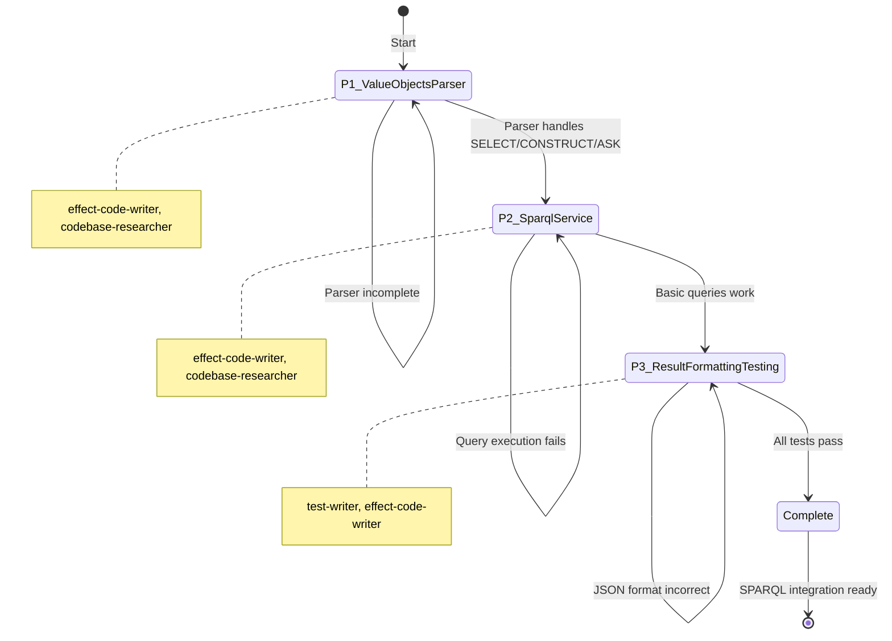
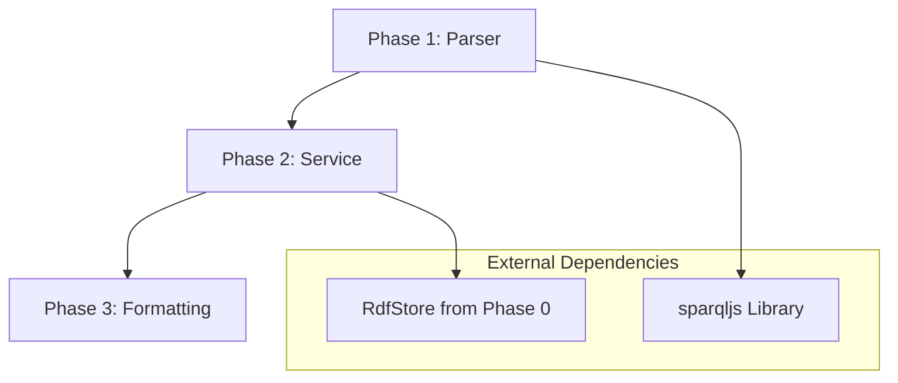

# Master Orchestration: Knowledge SPARQL Integration

> Complete phase workflows, agent delegation matrix, and verification protocols for implementing SPARQL query capability over the RDF knowledge graph.

---

## Overview

This specification orchestrates the development of SPARQL 1.1 query capability for the knowledge graph. The implementation wraps the sparqljs parser, executes queries against RdfStore, and formats results in W3C SPARQL JSON format. This enables semantic querying across entity relationships, ontology validation, and graph pattern matching.

### Workflow Diagram

```mermaid
flowchart TD
    subgraph Phase1["Phase 1: Value Objects & Parser"]
        P1A[SparqlQuery Value Object] --> P1B[SparqlBindings Value Object]
        P1B --> P1C[SparqlParser Service]
        P1C --> P1D[Parse Unit Tests]
    end

    subgraph Phase2["Phase 2: SPARQL Service"]
        P2A[SparqlService Interface] --> P2B[Query Executor]
        P2B --> P2C[Variable Binding Engine]
        P2C --> P2D[FILTER Evaluation]
        P2D --> P2E[RdfStore Integration]
    end

    subgraph Phase3["Phase 3: Result Formatting & Testing"]
        P3A[ResultFormatter Utility] --> P3B[JSON Bindings Format]
        P3B --> P3C[RDF Graph Format]
        P3C --> P3D[Integration Tests]
        P3D --> P3E[Performance Benchmarks]
    end

    Phase1 --> Phase2
    Phase2 --> Phase3

    subgraph Dependencies["Dependencies"]
        D1[RdfStore from Phase 0]
        D2[sparqljs Library]
        D3[@beep/testkit]
    end

    Phase1 -.->|uses| D2
    Phase2 -.->|uses| D1
    Phase3 -.->|uses| D3
```

### State Machine



---

## Agent Delegation Matrix

| Phase | Task | Primary Agent | Secondary Agent | Research Agent |
|-------|------|---------------|-----------------|----------------|
| **P1** | Domain value objects | `effect-code-writer` | - | - |
| **P1** | Parser integration | `codebase-researcher` | - | - |
| **P1** | Parser tests | `test-writer` | - | - |
| **P2** | Service implementation | `effect-code-writer` | - | - |
| **P2** | RdfStore integration | `codebase-researcher` | - | - |
| **P2** | Query executor | `effect-code-writer` | - | - |
| **P3** | Result formatter | `effect-code-writer` | - | - |
| **P3** | Integration tests | `test-writer` | - | - |
| **P3** | Performance benchmarks | `test-writer` | - | - |

### Agent Capabilities Reference

| Agent | Capability | Output |
|-------|------------|--------|
| `codebase-researcher` | read-only | Informs orchestrator |
| `effect-code-writer` | write-files | `.ts` source files |
| `test-writer` | write-files | `*.test.ts` files |
| `code-reviewer` | write-reports | `outputs/review.md` |

---

## Phase 1: Value Objects & Parser

**Duration**: 3.5 days
**Status**: Pending
**Agents**: `effect-code-writer`, `codebase-researcher`, `test-writer`

### Objectives

1. Define SPARQL query domain models (SparqlQuery, SparqlBindings)
2. Wrap sparqljs library in SparqlParser service
3. Create tagged errors for parse failures
4. Test parser with valid and invalid queries

### Tasks

#### Task 1.1: Install sparqljs

```bash
bun add sparqljs @types/sparqljs -w
```

#### Task 1.2: Create SparqlQuery Value Object

**Agent**: `effect-code-writer`

**File**: `packages/knowledge/domain/src/value-objects/sparql/SparqlQuery.ts`

```typescript
import * as S from "effect/Schema";

export class SparqlQuery extends S.Class<SparqlQuery>("SparqlQuery")({
  queryString: S.String,
  parsedAst: S.Unknown,  // sparqljs AST
  queryType: S.Literal("SELECT", "CONSTRUCT", "ASK"),
  prefixes: S.Record({ key: S.String, value: S.String }),
  variables: S.Array(S.String),
}) {}
```

#### Task 1.3: Create SparqlBindings Value Object

**Agent**: `effect-code-writer`

**File**: `packages/knowledge/domain/src/value-objects/sparql/SparqlBindings.ts`

```typescript
import * as S from "effect/Schema";

// W3C SPARQL Query Results JSON Format
export class SparqlBindings extends S.Class<SparqlBindings>("SparqlBindings")({
  head: S.Struct({
    vars: S.Array(S.String),
  }),
  results: S.Struct({
    bindings: S.Array(
      S.Record({
        key: S.String,
        value: S.Struct({
          type: S.Literal("uri", "literal", "bnode"),
          value: S.String,
          datatype: S.optional(S.String),
          "xml:lang": S.optional(S.String),
        }),
      })
    ),
  }),
}) {}
```

#### Task 1.4: Create SPARQL Errors

**Agent**: `effect-code-writer`

**File**: `packages/knowledge/server/src/Sparql/errors.ts`

```typescript
import * as S from "effect/Schema";

export class ParseError extends S.TaggedError<ParseError>()(
  "ParseError",
  {
    message: S.String,
    queryString: S.String,
    location: S.optional(
      S.Struct({
        line: S.Number,
        column: S.Number,
      })
    ),
  }
) {}

export class UnsupportedFeatureError extends S.TaggedError<UnsupportedFeatureError>()(
  "UnsupportedFeatureError",
  {
    feature: S.String,
    queryString: S.String,
    message: S.String,
  }
) {}
```

#### Task 1.5: Create SparqlParser Service

**Agent**: `codebase-researcher`

**File**: `packages/knowledge/server/src/Sparql/SparqlParser.ts`

```typescript
import * as Effect from "effect/Effect";
import * as Context from "effect/Context";
import * as Layer from "effect/Layer";
import { Parser } from "sparqljs";
import { SparqlQuery } from "@beep/knowledge-domain";
import { ParseError, UnsupportedFeatureError } from "./errors.js";

export class SparqlParser extends Context.Tag("SparqlParser")<
  SparqlParser,
  {
    readonly parse: (queryString: string) => Effect.Effect<
      SparqlQuery,
      ParseError | UnsupportedFeatureError
    >;
  }
>() {}

export const SparqlParserLive = Layer.succeed(
  SparqlParser,
  SparqlParser.of({
    parse: (queryString) =>
      Effect.gen(function* () {
        const parser = new Parser();

        try {
          const ast = parser.parse(queryString);

          // Extract query type
          const queryType = ast.queryType as "SELECT" | "CONSTRUCT" | "ASK";

          // Validate supported features
          if (queryType === "DESCRIBE") {
            return yield* Effect.fail(
              new UnsupportedFeatureError({
                feature: "DESCRIBE queries",
                queryString,
                message: "DESCRIBE queries not supported in Phase 1",
              })
            );
          }

          // Extract prefixes
          const prefixes = ast.prefixes || {};

          // Extract variables (SELECT only)
          const variables = queryType === "SELECT"
            ? ast.variables.map((v) => v.variable.value)
            : [];

          return new SparqlQuery({
            queryString,
            parsedAst: ast,
            queryType,
            prefixes,
            variables,
          });
        } catch (error) {
          return yield* Effect.fail(
            new ParseError({
              message: String(error),
              queryString,
              location: undefined,
            })
          );
        }
      }),
  })
);
```

#### Task 1.6: Create Parser Unit Tests

**Agent**: `test-writer`

**File**: `packages/knowledge/server/test/Sparql/SparqlParser.test.ts`

```typescript
import { effect, strictEqual } from "@beep/testkit";
import * as Effect from "effect/Effect";
import { SparqlParser, SparqlParserLive } from "../../src/Sparql/SparqlParser.js";

effect("parses basic SELECT query", () =>
  Effect.gen(function* () {
    const parser = yield* SparqlParser;
    const query = yield* parser.parse("SELECT ?s WHERE { ?s ?p ?o }");

    strictEqual(query.queryType, "SELECT");
    strictEqual(query.variables.length, 1);
    strictEqual(query.variables[0], "s");
  }).pipe(Effect.provide(SparqlParserLive))
);

effect("parses SELECT with FILTER", () =>
  Effect.gen(function* () {
    const parser = yield* SparqlParser;
    const queryString = `
      SELECT ?name WHERE {
        ?person ex:name ?name .
        FILTER(?name = "John")
      }
    `;
    const query = yield* parser.parse(queryString);

    strictEqual(query.queryType, "SELECT");
    strictEqual(query.variables.includes("name"), true);
  }).pipe(Effect.provide(SparqlParserLive))
);

effect("parses CONSTRUCT query", () =>
  Effect.gen(function* () {
    const parser = yield* SparqlParser;
    const queryString = `
      CONSTRUCT { ?s ex:mapped ?o }
      WHERE { ?s ex:original ?o }
    `;
    const query = yield* parser.parse(queryString);

    strictEqual(query.queryType, "CONSTRUCT");
  }).pipe(Effect.provide(SparqlParserLive))
);

effect("parses ASK query", () =>
  Effect.gen(function* () {
    const parser = yield* SparqlParser;
    const query = yield* parser.parse("ASK { ?s rdf:type ex:Person }");

    strictEqual(query.queryType, "ASK");
  }).pipe(Effect.provide(SparqlParserLive))
);

effect("handles PREFIX declarations", () =>
  Effect.gen(function* () {
    const parser = yield* SparqlParser;
    const queryString = `
      PREFIX foaf: <http://xmlns.com/foaf/0.1/>
      SELECT ?person WHERE { ?person foaf:name "Alice" }
    `;
    const query = yield* parser.parse(queryString);

    strictEqual(query.prefixes["foaf"], "http://xmlns.com/foaf/0.1/");
  }).pipe(Effect.provide(SparqlParserLive))
);

effect("fails on malformed query", () =>
  Effect.gen(function* () {
    const parser = yield* SparqlParser;
    const result = yield* Effect.either(parser.parse("SELECT ?s WHERE { ?s"));

    strictEqual(result._tag, "Left");
    if (result._tag === "Left") {
      strictEqual(result.left._tag, "ParseError");
    }
  }).pipe(Effect.provide(SparqlParserLive))
);
```

### Success Criteria

- [ ] SparqlQuery value object created
- [ ] SparqlBindings value object created
- [ ] SPARQL errors defined (ParseError, UnsupportedFeatureError)
- [ ] SparqlParser wraps sparqljs
- [ ] Parser handles SELECT, CONSTRUCT, ASK queries
- [ ] Parser handles PREFIX declarations
- [ ] Parser rejects unsupported features
- [ ] Unit tests pass
- [ ] `bun run check --filter @beep/knowledge-domain` passes
- [ ] `bun run check --filter @beep/knowledge-server` passes
- [ ] REFLECTION_LOG.md updated
- [ ] HANDOFF_P2.md created
- [ ] P2_ORCHESTRATOR_PROMPT.md created

### Checkpoint

Before proceeding to Phase 2:
- [ ] Parser test suite covers all query types
- [ ] Error messages are clear and actionable
- [ ] Value objects use Schema.Class (not plain interfaces)
- [ ] Imports use namespace convention

### Handoff

Create `handoffs/HANDOFF_P2.md` with:
- Parser implementation patterns
- sparqljs AST structure notes
- Unsupported features list
- Phase 2 task refinements

---

## Phase 2: SPARQL Service

**Duration**: 5 days
**Status**: Pending
**Agents**: `effect-code-writer`, `codebase-researcher`

### Objectives

1. Implement SparqlService interface
2. Execute parsed SPARQL queries against RdfStore
3. Build variable binding engine
4. Implement basic FILTER evaluation

### Tasks

#### Task 2.1: Create SparqlService Interface

**Agent**: `effect-code-writer`

**File**: `packages/knowledge/server/src/Sparql/SparqlService.ts`

```typescript
import * as Effect from "effect/Effect";
import * as Context from "effect/Context";
import { SparqlQuery, SparqlBindings } from "@beep/knowledge-domain";

export class SparqlService extends Context.Tag("SparqlService")<
  SparqlService,
  {
    readonly executeSelect: (
      query: SparqlQuery
    ) => Effect.Effect<SparqlBindings, ExecutionError>;

    readonly executeConstruct: (
      query: SparqlQuery
    ) => Effect.Effect<ReadonlyArray<Triple>, ExecutionError>;

    readonly executeAsk: (
      query: SparqlQuery
    ) => Effect.Effect<boolean, ExecutionError>;
  }
>() {}
```

#### Task 2.2: Integrate RdfStore

**Agent**: `codebase-researcher`

Research RdfStore API from `knowledge-rdf-foundation` spec:

```typescript
export interface RdfStore {
  readonly query: (
    subject: string | null,
    predicate: string | null,
    object: string | null
  ) => Effect.Effect<ReadonlyArray<Triple>, StoreError>;
}
```

Pattern: Translate SPARQL basic graph patterns into RdfStore.query() calls.

#### Task 2.3: Implement Query Executor

**Agent**: `effect-code-writer`

**File**: `packages/knowledge/server/src/Sparql/QueryExecutor.ts`

```typescript
import * as Effect from "effect/Effect";
import * as A from "effect/Array";
import { RdfStore, Triple } from "@beep/knowledge-server/RdfStore";

export class QueryExecutor {
  static executeBasicGraphPattern(
    pattern: BasicGraphPattern,
    store: RdfStore
  ): Effect.Effect<ReadonlyArray<VariableBindings>, ExecutionError> {
    return Effect.gen(function* () {
      // For each triple pattern in BGP
      // 1. Query RdfStore with pattern
      // 2. Bind variables from results
      // 3. Join bindings across patterns
      // 4. Return final binding set
    });
  }
}
```

#### Task 2.4: Implement FILTER Evaluation

**Agent**: `effect-code-writer`

**File**: `packages/knowledge/server/src/Sparql/FilterEvaluator.ts`

```typescript
import * as Effect from "effect/Effect";

export class FilterEvaluator {
  static evaluate(
    filterExpr: FilterExpression,
    bindings: VariableBindings
  ): Effect.Effect<boolean, FilterError> {
    return Effect.gen(function* () {
      // Support: equality, comparison, regex
      // Defer: aggregates, functions, property paths
    });
  }
}
```

#### Task 2.5: Create SparqlServiceLive Layer

**Agent**: `effect-code-writer`

```typescript
import * as Layer from "effect/Layer";

export const SparqlServiceLive = Layer.effect(
  SparqlService,
  Effect.gen(function* () {
    const store = yield* RdfStore;

    return SparqlService.of({
      executeSelect: (query) =>
        Effect.gen(function* () {
          const bindings = yield* QueryExecutor.executeBasicGraphPattern(
            query.parsedAst.where,
            store
          );
          return formatAsJson(bindings, query.variables);
        }),

      executeConstruct: (query) =>
        Effect.gen(function* () {
          // Execute WHERE clause, apply CONSTRUCT template
        }),

      executeAsk: (query) =>
        Effect.gen(function* () {
          const bindings = yield* QueryExecutor.executeBasicGraphPattern(
            query.parsedAst.where,
            store
          );
          return A.isNonEmptyReadonlyArray(bindings);
        }),
    });
  })
);
```

### Success Criteria

- [ ] SparqlService interface created
- [ ] RdfStore integration working
- [ ] Query executor translates BGP to RdfStore calls
- [ ] Variable binding engine joins results
- [ ] FILTER evaluation handles equality, comparison, regex
- [ ] SELECT queries return bindings
- [ ] CONSTRUCT queries return triples
- [ ] ASK queries return boolean
- [ ] Performance: < 100ms for simple queries (< 10K triples)
- [ ] `bun run check --filter @beep/knowledge-server` passes
- [ ] REFLECTION_LOG.md updated
- [ ] HANDOFF_P3.md created
- [ ] P3_ORCHESTRATOR_PROMPT.md created

### Checkpoint

Before proceeding to Phase 3:
- [ ] Query: `SELECT ?entity WHERE { ?entity rdf:type ex:Person }` works
- [ ] Query: `SELECT ?s ?o WHERE { ?s ex:name ?o }` returns bindings
- [ ] FILTER expressions apply correctly
- [ ] Variable joins across multiple patterns work

### Handoff

Create `handoffs/HANDOFF_P3.md` with:
- Query execution flow
- RdfStore integration patterns
- Variable binding algorithm
- Known limitations (property paths, aggregates)

---

## Phase 3: Result Formatting & Testing

**Duration**: 3.5 days
**Status**: Pending
**Agents**: `test-writer`, `effect-code-writer`

### Objectives

1. Format query results into consumable structures
2. Validate E2E query flows
3. Benchmark query performance
4. Implement comprehensive error handling

### Tasks

#### Task 3.1: Create ResultFormatter

**Agent**: `effect-code-writer`

**File**: `packages/knowledge/server/src/Sparql/ResultFormatter.ts`

```typescript
import * as Effect from "effect/Effect";
import { SparqlBindings } from "@beep/knowledge-domain";

export class ResultFormatter {
  static formatSelectResults(
    bindings: ReadonlyArray<VariableBindings>,
    variables: ReadonlyArray<string>
  ): Effect.Effect<SparqlBindings, never> {
    return Effect.gen(function* () {
      return new SparqlBindings({
        head: { vars: variables },
        results: {
          bindings: A.map(bindings, (binding) => ({
            // Format each binding
          })),
        },
      });
    });
  }

  static formatConstructResults(
    triples: ReadonlyArray<Triple>
  ): Effect.Effect<string, never> {
    // Format as RDF (Turtle or N-Triples)
  }

  static formatAskResult(
    result: boolean
  ): Effect.Effect<{ boolean: boolean }, never> {
    return Effect.succeed({ boolean: result });
  }
}
```

#### Task 3.2: Create Integration Tests

**Agent**: `test-writer`

**File**: `packages/knowledge/server/test/Sparql/integration.test.ts`

```typescript
import { layer, strictEqual } from "@beep/testkit";
import * as Effect from "effect/Effect";
import * as Layer from "effect/Layer";
import { RdfStore } from "../../src/RdfStore/index.js";
import { SparqlService, SparqlServiceLive } from "../../src/Sparql/index.js";

const TestLayer = Layer.mergeAll(
  RdfStoreLive,
  SparqlParserLive,
  SparqlServiceLive
);

layer(TestLayer)("SPARQL Integration", (it) => {
  it.effect("extracts entities then queries via SPARQL", () =>
    Effect.gen(function* () {
      const store = yield* RdfStore;
      const service = yield* SparqlService;

      // 1. Populate store with sample data
      yield* store.addTriple({
        subject: "ex:entity1",
        predicate: "rdf:type",
        object: "ex:Person",
      });
      yield* store.addTriple({
        subject: "ex:entity1",
        predicate: "ex:name",
        object: "John Doe",
      });

      // 2. Query via SPARQL
      const queryString = "SELECT ?name WHERE { ?s ex:name ?name }";
      const parser = yield* SparqlParser;
      const query = yield* parser.parse(queryString);
      const result = yield* service.executeSelect(query);

      // 3. Verify results
      strictEqual(result.results.bindings.length, 1);
      strictEqual(result.results.bindings[0].name.value, "John Doe");
    })
  );

  it.effect("handles FILTER expressions", () =>
    Effect.gen(function* () {
      // Test FILTER(?var = "value")
    })
  );

  it.effect("handles PREFIX declarations", () =>
    Effect.gen(function* () {
      // Test prefixed IRIs
    })
  );
});
```

#### Task 3.3: Create Performance Benchmarks

**Agent**: `test-writer`

**File**: `packages/knowledge/server/test/Sparql/performance.test.ts`

```typescript
import { effect, strictEqual } from "@beep/testkit";
import * as Effect from "effect/Effect";
import * as Duration from "effect/Duration";

effect("simple query completes in < 100ms", () =>
  Effect.gen(function* () {
    const start = Date.now();

    // Execute query over 10K triples
    yield* service.executeSelect(simpleQuery);

    const elapsed = Date.now() - start;
    strictEqual(elapsed < 100, true);
  })
);

effect("complex query completes in < 200ms", () =>
  Effect.gen(function* () {
    const start = Date.now();

    // Execute multi-pattern query over 100K triples
    yield* service.executeSelect(complexQuery);

    const elapsed = Date.now() - start;
    strictEqual(elapsed < 200, true);
  })
);
```

### Success Criteria

- [ ] SELECT results formatted in W3C SPARQL JSON
- [ ] CONSTRUCT results formatted as RDF
- [ ] ASK results formatted as boolean
- [ ] Integration test: Extract entities → Query via SPARQL
- [ ] Integration test: FILTER expressions work
- [ ] Integration test: PREFIX declarations work
- [ ] Performance: Simple queries < 100ms
- [ ] Performance: Complex queries < 200ms
- [ ] Error handling comprehensive
- [ ] `bun run check --filter @beep/knowledge-server` passes
- [ ] `bun run test --filter @beep/knowledge-server` passes
- [ ] REFLECTION_LOG.md updated with final learnings

### Checkpoint

Integration is complete when:
- [ ] Full query workflow works end-to-end
- [ ] All query types (SELECT, CONSTRUCT, ASK) work
- [ ] Result formatting matches W3C spec
- [ ] Performance targets met
- [ ] Error messages are clear

---

## Inter-Phase Dependencies



### Dependency Matrix

| Phase | Depends On | Outputs Used By |
|-------|------------|-----------------|
| P1 | sparqljs | P2, P3 |
| P2 | P1 (SparqlQuery), RdfStore | P3 |
| P3 | P2 (SparqlService) | - |

---

## Risk Mitigation Strategies

| Risk | Mitigation |
|------|------------|
| Query performance insufficient | Benchmark early, design Oxigraph migration path |
| SPARQL feature gaps block use cases | Prioritize common queries, incremental features |
| sparqljs parsing errors | Extensive parser tests, fallback error handling |
| RdfStore query API limitations | Verify RdfStore capabilities in Phase 0 handoff |

---

## Verification Commands

### Per-Phase Verification

```bash
# Phase 1
bun run check --filter @beep/knowledge-domain
bun run check --filter @beep/knowledge-server
bun run test --filter @beep/knowledge-server -- SparqlParser.test.ts

# Phase 2
bun run check --filter @beep/knowledge-server
bun run test --filter @beep/knowledge-server -- SparqlService.test.ts

# Phase 3
bun run check --filter @beep/knowledge-server
bun run test --filter @beep/knowledge-server -- integration.test.ts
bun run test --filter @beep/knowledge-server -- performance.test.ts
```

### Final Verification

```bash
# Type check all knowledge packages
bun run check --filter @beep/knowledge-*

# Run all tests
bun run test --filter @beep/knowledge-server

# Lint
bun run lint:fix
```

---

## Estimated Timeline

| Phase | Duration | Sessions | Dependencies |
|-------|----------|----------|--------------|
| P1: Value Objects & Parser | 3.5 days | 2 | sparqljs installation |
| P2: SPARQL Service | 5 days | 2-3 | P1, RdfStore |
| P3: Result Formatting & Testing | 3.5 days | 2 | P2 |
| **Total** | **12 days** | **5-6** | - |

---

## Success Metrics

### Functional Requirements
- Parse SELECT, CONSTRUCT, ASK queries
- Execute basic graph pattern matching
- Support PREFIX declarations
- Evaluate FILTER expressions (equality, comparison, regex)
- Format results in W3C SPARQL JSON format

### Non-Functional Requirements
- Query performance: < 100ms for simple queries (< 10K triples)
- Query performance: < 200ms for complex queries (< 100K triples)
- Parser handles malformed queries gracefully
- Service layer uses Effect error handling
- 100% type safety (no `any`)

### Integration Requirements
- SparqlService depends on RdfStore via Layer
- Query results compatible with client layer
- Error messages include query location
