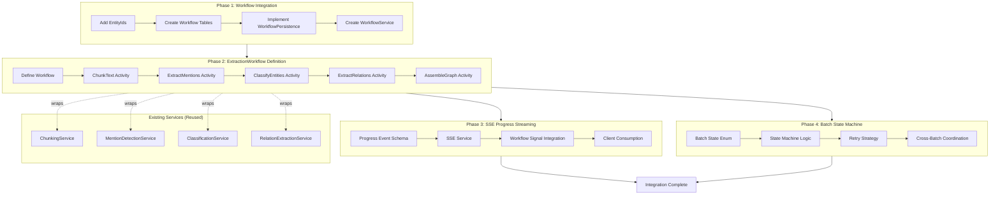
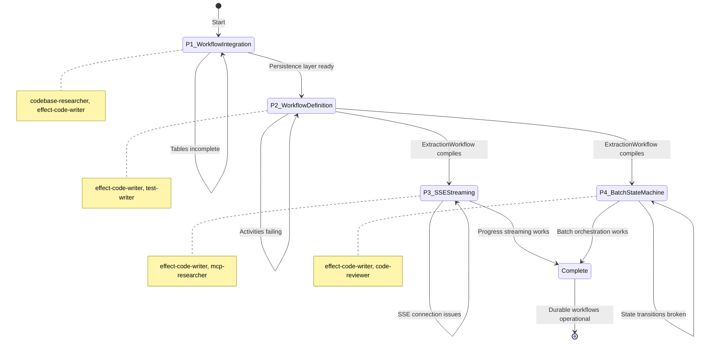
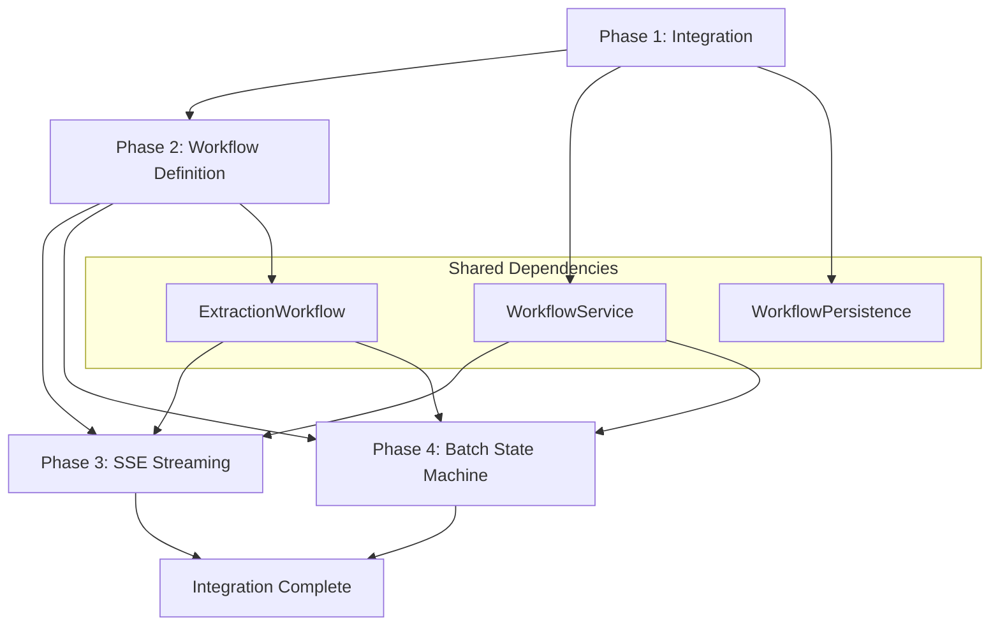

# Master Orchestration: Knowledge Workflow Durability

> Complete phase workflows, checkpoints, agent delegation matrix, and recovery procedures for implementing @effect/workflow in the knowledge extraction pipeline.

---

## Overview

This specification orchestrates the integration of @effect/workflow runtime into the knowledge slice, transforming the current single-Effect ExtractionPipeline into a durable, resumable workflow that survives server restarts and provides real-time progress streaming.

### Workflow Diagram



### State Machine



---

## Agent Delegation Matrix

| Phase | Primary Agent | Secondary Agent | Research Agent | Reviewer |
|-------|---------------|-----------------|----------------|----------|
| **P1: Workflow Integration** | `effect-code-writer` | `test-writer` | `codebase-researcher` | - |
| **P2: Workflow Definition** | `effect-code-writer` | `test-writer` | `mcp-researcher` | - |
| **P3: SSE Streaming** | `effect-code-writer` | `test-writer` | `mcp-researcher` | - |
| **P4: Batch State Machine** | `effect-code-writer` | `test-writer` | - | `code-reviewer` |

### Agent Capabilities Reference

| Agent | Capability | Output | When to Use |
|-------|------------|--------|-------------|
| `codebase-researcher` | read-only | Informs orchestrator | Research existing patterns, locate reference implementations |
| `mcp-researcher` | read-only | Effect documentation | Verify @effect/workflow API, find canonical patterns |
| `effect-code-writer` | write-files | `.ts` source files | Implement services, activities, workflows |
| `test-writer` | write-files | `*.test.ts` files | Create test coverage for new code |
| `code-reviewer` | write-reports | `outputs/review.md` | Final phase review before integration |
| `doc-writer` | write-files | Documentation files | Create implementation guides (end of spec) |

---

## Phase 1: Workflow Integration & Persistence

**Duration**: 4-6 sessions (1 week)
**Status**: Pending
**Agents**: `codebase-researcher`, `effect-code-writer`, `test-writer`

### Objectives

1. Add WorkflowExecutionId, WorkflowActivityId, WorkflowSignalId to knowledge-domain
2. Create workflow persistence tables in knowledge-tables
3. Implement WorkflowPersistence adapter for @effect/workflow
4. Create WorkflowService abstraction
5. Verify database migration generation

### Tasks

#### Task 1.1: Research @effect/workflow Patterns

**Agent**: `codebase-researcher`

Research existing workflow patterns in the codebase and @effect/workflow API.

**Research Questions**:
1. Are there existing workflow implementations in the codebase? (`grep -r "@effect/workflow"`)
2. What is the @effect/workflow persistence interface?
3. How do other packages structure service layers?
4. What are the table patterns for state persistence?

**Files to Examine**:
- `node_modules/@effect/workflow/` - API reference
- `packages/*/server/src/services/` - Service patterns
- `packages/*/tables/src/tables/` - Table patterns
- `documentation/patterns/database-patterns.md` - Database conventions

**Output**: Summary of findings for WorkflowService and table design.

#### Task 1.2: Add EntityIds to Knowledge Domain

**Agent**: `effect-code-writer`

**Files to Modify**:
1. `packages/knowledge/domain/src/entities/EntityIds.ts`

**Add**:
```typescript
export const WorkflowExecutionId = EntityId.make("knowledge_workflow_execution");
export const WorkflowActivityId = EntityId.make("knowledge_workflow_activity");
export const WorkflowSignalId = EntityId.make("knowledge_workflow_signal");
```

**Files to Modify**:
2. `packages/knowledge/domain/src/entities/index.ts`

**Add exports**:
```typescript
export * from "./EntityIds.js";
```

**Verification**:
```bash
bun run check --filter @beep/knowledge-domain
```

#### Task 1.3: Create Workflow Persistence Tables

**Agent**: `effect-code-writer`

**Files to Create**:
1. `packages/knowledge/tables/src/tables/workflow-execution.table.ts`
2. `packages/knowledge/tables/src/tables/workflow-activity.table.ts`
3. `packages/knowledge/tables/src/tables/workflow-signal.table.ts`

**Table Schemas** (see HANDOFF_P1.md for detailed schemas):
- workflow-execution: id, organizationId, workflowType, workflowVersion, status, currentActivity, input, output, error, checkpoint, startedAt, completedAt, updatedAt
- workflow-activity: id, workflowExecutionId, organizationId, activityName, activityType, status, attemptNumber, input, output, error, startedAt, completedAt
- workflow-signal: id, workflowExecutionId, organizationId, signalName, payload, createdAt

**Files to Modify**:
4. `packages/knowledge/tables/src/tables/index.ts` - Add exports

**Verification**:
```bash
bun run check --filter @beep/knowledge-tables
bun run db:generate
ls packages/knowledge/tables/drizzle/
```

#### Task 1.4: Implement WorkflowPersistence Adapter

**Agent**: `effect-code-writer`

**Files to Create**:
1. `packages/knowledge/server/src/Workflow/WorkflowPersistence.ts`

Implement PostgreSQL persistence adapter implementing @effect/workflow persistence interface.

**Critical Pattern**:
```typescript
import * as Effect from "effect/Effect";
import * as Layer from "effect/Layer";
import { Sql } from "@effect/sql";

export class WorkflowPersistence extends Effect.Service<WorkflowPersistence>()(
  "@beep/knowledge-server/WorkflowPersistence",
  {
    accessors: true,
    effect: Effect.gen(function* () {
      const sql = yield* Sql.Sql;

      return {
        saveExecution: (execution: WorkflowExecution) =>
          Effect.gen(function* () {
            // INSERT INTO workflow_execution ...
          }),

        loadExecution: (executionId: WorkflowExecutionId) =>
          Effect.gen(function* () {
            // SELECT FROM workflow_execution WHERE id = ...
          }),

        saveActivity: (activity: WorkflowActivity) =>
          Effect.gen(function* () {
            // INSERT INTO workflow_activity ...
          }),

        loadActivities: (executionId: WorkflowExecutionId) =>
          Effect.gen(function* () {
            // SELECT FROM workflow_activity WHERE workflow_execution_id = ...
          }),

        saveSignal: (signal: WorkflowSignal) =>
          Effect.gen(function* () {
            // INSERT INTO workflow_signal ...
          }),

        loadSignals: (executionId: WorkflowExecutionId) =>
          Effect.gen(function* () {
            // SELECT FROM workflow_signal WHERE workflow_execution_id = ...
          }),
      };
    }),
  }
) {}
```

**Verification**:
```bash
bun run check --filter @beep/knowledge-server
```

#### Task 1.5: Create WorkflowService

**Agent**: `effect-code-writer`

**Files to Create**:
1. `packages/knowledge/server/src/Workflow/WorkflowService.ts`

Wrap @effect/workflow runtime with persistence layer.

**Service Interface** (see HANDOFF_P1.md for detailed interface):
- `start<I, O>(workflowType, input)` - Start workflow execution
- `getStatus(executionId)` - Get workflow status
- `signal<T>(executionId, signalName, payload)` - Send signal to workflow
- `cancel(executionId)` - Cancel workflow execution

**Files to Create**:
2. `packages/knowledge/server/src/Workflow/index.ts` - Barrel exports

**Verification**:
```bash
bun run check --filter @beep/knowledge-server
```

#### Task 1.6: Create Tests

**Agent**: `test-writer`

**Files to Create**:
1. `packages/knowledge/server/test/Workflow/WorkflowPersistence.test.ts`
2. `packages/knowledge/server/test/Workflow/WorkflowService.test.ts`

**Test Patterns**:
```typescript
import { effect, layer, strictEqual } from "@beep/testkit";
import * as Effect from "effect/Effect";

layer(TestLayer)("WorkflowPersistence", (it) => {
  it.effect("saves and loads execution", () =>
    Effect.gen(function* () {
      const persistence = yield* WorkflowPersistence;
      const execution = yield* persistence.saveExecution(mockExecution);
      const loaded = yield* persistence.loadExecution(execution.id);
      strictEqual(loaded.id, execution.id);
    })
  );
});
```

**Verification**:
```bash
bun run test --filter @beep/knowledge-server
```

### Success Criteria

Phase 1 is complete when:
- [ ] WorkflowExecutionId, WorkflowActivityId, WorkflowSignalId added to knowledge-domain
- [ ] All 3 workflow tables created with correct schemas
- [ ] WorkflowPersistence and WorkflowService implemented
- [ ] TypeScript compilation passes for knowledge-domain, knowledge-tables, knowledge-server
- [ ] Database migration generated successfully
- [ ] Tests pass for WorkflowPersistence and WorkflowService
- [ ] REFLECTION_LOG.md updated with Phase 1 learnings
- [ ] HANDOFF_P2.md created for next phase
- [ ] P2_ORCHESTRATOR_PROMPT.md created for next phase

### Checkpoint

Before proceeding to Phase 2:
- [ ] `bun run check --filter @beep/knowledge-*` passes
- [ ] `bun run test --filter @beep/knowledge-server` passes
- [ ] Database migration file exists in `packages/knowledge/tables/drizzle/`
- [ ] WorkflowService compiles and exports correctly

### Handoff

Create `handoffs/HANDOFF_P2.md` with:
- WorkflowService API design decisions
- Persistence layer patterns
- Any @effect/workflow API discoveries
- Phase 2 task refinements

---

## Phase 2: ExtractionWorkflow Definition & Durable Activities

**Duration**: 6-8 sessions (1.5 weeks)
**Status**: Pending
**Agents**: `effect-code-writer`, `mcp-researcher`, `test-writer`

### Objectives

1. Define ExtractionWorkflow using @effect/workflow
2. Implement durable activities for each extraction stage
3. Add checkpoint logic at stage boundaries
4. Integrate with existing ExtractionPipeline services
5. Test workflow resumption after failure

### Tasks

#### Task 2.1: Research @effect/workflow Workflow Definition

**Agent**: `mcp-researcher`

Research @effect/workflow workflow definition patterns.

**Topics to Research**:
1. Workflow.make API signature
2. Activity.make API signature
3. Checkpoint/persistence hooks
4. Error handling and retry logic
5. Workflow execution lifecycle

**Output**: API reference document for workflow implementation.

#### Task 2.2: Define ExtractionWorkflow

**Agent**: `effect-code-writer`

**Files to Create**:
1. `packages/knowledge/server/src/Workflow/ExtractionWorkflow.ts`

**Workflow Structure**:
```typescript
import * as Effect from "effect/Effect";
import { Workflow } from "@effect/workflow";

export const ExtractionWorkflow = Workflow.make({
  name: "ExtractionWorkflow",
  version: 1,
  execute: (input: ExtractionInput) =>
    Effect.gen(function* () {
      // Stage 1: Chunk text
      const chunks = yield* ChunkTextActivity.execute(input);
      yield* Workflow.checkpoint({ stage: "chunked", chunks });

      // Stage 2: Extract mentions (parallel)
      const mentions = yield* ExtractMentionsActivity.execute(chunks);
      yield* Workflow.checkpoint({ stage: "mentions", mentions });

      // Stage 3: Classify entities (batched)
      const entities = yield* ClassifyEntitiesActivity.execute(mentions);
      yield* Workflow.checkpoint({ stage: "entities", entities });

      // Stage 4: Extract relations (parallel)
      const relations = yield* ExtractRelationsActivity.execute(chunks, entities);
      yield* Workflow.checkpoint({ stage: "relations", relations });

      // Stage 5: Assemble graph
      const graph = yield* AssembleGraphActivity.execute(entities, relations);
      return graph;
    }),
});
```

#### Task 2.3: Implement ChunkText Activity

**Agent**: `effect-code-writer`

**Files to Create**:
1. `packages/knowledge/server/src/Workflow/activities/ChunkTextActivity.ts`

**Activity Pattern**:
```typescript
import * as Effect from "effect/Effect";
import { Activity } from "@effect/workflow";
import { ChunkingService } from "../../services/ChunkingService.js";

export const ChunkTextActivity = Activity.make({
  name: "chunk-text",
  execute: (input: DocumentInput) =>
    Effect.gen(function* () {
      const chunker = yield* ChunkingService;
      const chunks = yield* chunker.chunk(input.text);

      // Persist chunks to database (checkpoint)
      const chunkRepo = yield* ChunkRepo;
      yield* chunkRepo.insertAll(chunks);

      return chunks;
    }),
});
```

#### Task 2.4: Implement ExtractMentions Activity

**Agent**: `effect-code-writer`

**Files to Create**:
1. `packages/knowledge/server/src/Workflow/activities/ExtractMentionsActivity.ts`

**Parallel Execution**:
```typescript
export const ExtractMentionsActivity = Activity.make({
  name: "extract-mentions",
  execute: (chunks: readonly Chunk[]) =>
    Effect.gen(function* () {
      const detector = yield* MentionDetectionService;

      // Process chunks in parallel
      const mentions = yield* Effect.all(
        A.map(chunks, (chunk) =>
          Effect.gen(function* () {
            const detected = yield* detector.detect(chunk.text);

            // Checkpoint per chunk
            const mentionRepo = yield* MentionRepo;
            yield* mentionRepo.insertAll(detected);

            return detected;
          })
        ),
        { concurrency: "unbounded" }
      );

      return A.flatten(mentions);
    }),
});
```

#### Task 2.5: Implement ClassifyEntities Activity

**Agent**: `effect-code-writer`

**Files to Create**:
1. `packages/knowledge/server/src/Workflow/activities/ClassifyEntitiesActivity.ts`

**Batched Execution**:
```typescript
export const ClassifyEntitiesActivity = Activity.make({
  name: "classify-entities",
  execute: (mentions: readonly Mention[]) =>
    Effect.gen(function* () {
      const classifier = yield* ClassificationService;

      // Batch mentions for LLM efficiency
      const batches = A.chunksOf(mentions, 50);

      const entities = yield* Effect.all(
        A.map(batches, (batch) =>
          Effect.gen(function* () {
            const classified = yield* classifier.classify(batch);

            // Checkpoint per batch
            const entityRepo = yield* EntityRepo;
            yield* entityRepo.insertAll(classified);

            return classified;
          })
        ),
        { concurrency: 2 } // Limit LLM concurrency
      );

      return A.flatten(entities);
    }),
});
```

#### Task 2.6: Implement ExtractRelations Activity

**Agent**: `effect-code-writer`

**Files to Create**:
1. `packages/knowledge/server/src/Workflow/activities/ExtractRelationsActivity.ts`

(Similar parallel pattern to ExtractMentions, processing chunks with entities context)

#### Task 2.7: Implement AssembleGraph Activity

**Agent**: `effect-code-writer`

**Files to Create**:
1. `packages/knowledge/server/src/Workflow/activities/AssembleGraphActivity.ts`

**Graph Assembly**:
```typescript
export const AssembleGraphActivity = Activity.make({
  name: "assemble-graph",
  execute: (input: { entities: readonly Entity[]; relations: readonly Relation[] }) =>
    Effect.gen(function* () {
      const graphBuilder = yield* GraphBuilderService;
      const graph = yield* graphBuilder.assemble(input.entities, input.relations);

      // Final checkpoint
      const extractionRepo = yield* ExtractionRepo;
      yield* extractionRepo.insert(graph);

      return graph;
    }),
});
```

#### Task 2.8: Create Tests

**Agent**: `test-writer`

**Files to Create**:
1. `packages/knowledge/server/test/Workflow/ExtractionWorkflow.test.ts`
2. `packages/knowledge/server/test/Workflow/activities/*.test.ts`

**Resumption Test**:
```typescript
import { effect, strictEqual } from "@beep/testkit";
import * as Effect from "effect/Effect";

effect("workflow resumes after failure", () =>
  Effect.gen(function* () {
    const workflowService = yield* WorkflowService;

    // Start workflow
    const executionId = yield* workflowService.start("extraction", input);

    // Simulate failure after Stage 2
    yield* simulateServerCrash(executionId, afterStage: 2);

    // Verify checkpoint persisted
    const status = yield* workflowService.getStatus(executionId);
    strictEqual(status.currentActivity, "classify-entities");

    // Resume workflow
    yield* workflowService.resume(executionId);

    // Verify completion
    const finalStatus = yield* workflowService.getStatus(executionId);
    strictEqual(finalStatus.status, "completed");
  })
);
```

### Success Criteria

Phase 2 is complete when:
- [ ] ExtractionWorkflow defined with all 5 activities
- [ ] All activities implemented with checkpoint logic
- [ ] Workflow compiles and passes type checks
- [ ] Test: workflow executes successfully end-to-end
- [ ] Test: workflow resumes from checkpoint after simulated failure
- [ ] Test: parallel activities execute concurrently
- [ ] REFLECTION_LOG.md updated with Phase 2 learnings
- [ ] HANDOFF_P3.md created for next phase
- [ ] P3_ORCHESTRATOR_PROMPT.md created for next phase

### Checkpoint

Before proceeding to Phase 3:
- [ ] ExtractionWorkflow executes without errors
- [ ] Checkpoints persist to database
- [ ] Workflow resumes from last checkpoint after restart
- [ ] Performance overhead <10% vs direct pipeline

---

## Phase 3: SSE Progress Streaming

**Duration**: 3-4 sessions (1 week)
**Status**: Pending
**Agents**: `effect-code-writer`, `mcp-researcher`, `test-writer`

### Objectives

1. Define progress event schema
2. Implement SSE service for real-time updates
3. Connect workflow signals to SSE events
4. Create client consumption pattern

### Tasks

#### Task 3.1: Define Progress Event Schema

**Agent**: `effect-code-writer`

**Files to Create**:
1. `packages/knowledge/domain/src/value-objects/workflow/ProgressEvent.ts`

**Schema**:
```typescript
import * as S from "effect/Schema";

export class ProgressEvent extends S.Class<ProgressEvent>("ProgressEvent")({
  workflowExecutionId: S.String,
  stage: S.Literal("chunk", "mentions", "entities", "relations", "assemble"),
  status: S.Literal("started", "in_progress", "completed", "failed"),
  progress: S.Number, // 0-100
  entityCount: S.optional(S.Number),
  relationCount: S.optional(S.Number),
  timestamp: S.DateFromString,
}) {}
```

#### Task 3.2: Implement SSE Service

**Agent**: `effect-code-writer`

**Files to Create**:
1. `packages/knowledge/server/src/services/SSEService.ts`

**Service Pattern**:
```typescript
import * as Effect from "effect/Effect";
import * as Stream from "effect/Stream";

export class SSEService extends Effect.Service<SSEService>()(
  "@beep/knowledge-server/SSEService",
  {
    accessors: true,
    effect: Effect.gen(function* () {
      const connections = new Map<string, Stream.Stream<ProgressEvent>>();

      return {
        subscribe: (executionId: WorkflowExecutionId) =>
          Effect.gen(function* () {
            const stream = yield* Stream.make<ProgressEvent>();
            connections.set(executionId, stream);
            return stream;
          }),

        send: (executionId: WorkflowExecutionId, event: ProgressEvent) =>
          Effect.gen(function* () {
            const stream = connections.get(executionId);
            if (stream) {
              yield* Stream.emit(stream, event);
            }
          }),

        unsubscribe: (executionId: WorkflowExecutionId) =>
          Effect.sync(() => {
            connections.delete(executionId);
          }),
      };
    }),
  }
) {}
```

#### Task 3.3: Integrate Workflow Signals

**Agent**: `effect-code-writer`

**Files to Modify**:
1. `packages/knowledge/server/src/Workflow/ExtractionWorkflow.ts`

**Add Progress Signal**:
```typescript
const progressSignal = Workflow.signal({
  name: "progress",
  handler: (event: ProgressEvent) =>
    Effect.gen(function* () {
      const sse = yield* SSEService;
      yield* sse.send(event.workflowExecutionId, event);
    }),
});

// Emit progress in activities
yield* progressSignal.send({
  workflowExecutionId: executionId,
  stage: "chunk",
  status: "started",
  progress: 0,
  timestamp: new Date(),
});
```

#### Task 3.4: Create Client Consumption Pattern

**Agent**: `effect-code-writer`

**Files to Create**:
1. `packages/knowledge/client/src/hooks/useWorkflowProgress.ts`

**Hook Pattern**:
```typescript
import * as React from "react";

export function useWorkflowProgress(executionId: string) {
  const [progress, setProgress] = React.useState<ProgressEvent | null>(null);

  React.useEffect(() => {
    const eventSource = new EventSource(`/api/workflows/${executionId}/progress`);

    eventSource.onmessage = (event) => {
      const progressEvent = JSON.parse(event.data);
      setProgress(progressEvent);
    };

    return () => {
      eventSource.close();
    };
  }, [executionId]);

  return progress;
}
```

#### Task 3.5: Create Tests

**Agent**: `test-writer`

**Files to Create**:
1. `packages/knowledge/server/test/services/SSEService.test.ts`

### Success Criteria

Phase 3 is complete when:
- [ ] ProgressEvent schema defined
- [ ] SSEService implemented
- [ ] Workflow emits progress signals
- [ ] Client hook receives SSE events
- [ ] Test: SSE connection remains stable during workflow
- [ ] Test: Progress events arrive in correct order
- [ ] REFLECTION_LOG.md updated with Phase 3 learnings
- [ ] HANDOFF_P4.md created for next phase
- [ ] P4_ORCHESTRATOR_PROMPT.md created for next phase

---

## Phase 4: Batch State Machine & Cross-Batch Orchestration

**Duration**: 3-4 sessions (1 week)
**Status**: Pending
**Agents**: `effect-code-writer`, `test-writer`, `code-reviewer`

### Objectives

1. Define batch processing states
2. Implement state machine logic
3. Handle batch lifecycle (queued → processing → completed → failed)
4. Coordinate entity resolution across batches

### Tasks

#### Task 4.1: Define Batch State Schema

**Agent**: `effect-code-writer`

**Files to Create**:
1. `packages/knowledge/domain/src/value-objects/workflow/BatchState.ts`

**Schema**:
```typescript
import * as S from "effect/Schema";

export const BatchState = S.Literal(
  "queued",
  "processing",
  "completed",
  "failed",
  "retry",
  "abandoned"
);
```

#### Task 4.2: Implement Batch State Machine

**Agent**: `effect-code-writer`

**Files to Create**:
1. `packages/knowledge/server/src/Workflow/BatchStateMachine.ts`

**State Machine**:
```typescript
import * as Effect from "effect/Effect";
import * as Match from "effect/Match";

export class BatchStateMachine extends Effect.Service<BatchStateMachine>()(
  "@beep/knowledge-server/BatchStateMachine",
  {
    accessors: true,
    effect: Effect.gen(function* () {
      return {
        transition: (currentState: BatchState, event: BatchEvent) =>
          Match.value(currentState).pipe(
            Match.when("queued", () =>
              event.type === "start" ? "processing" : currentState
            ),
            Match.when("processing", () =>
              Match.value(event.type).pipe(
                Match.when("complete", () => "completed"),
                Match.when("fail", () => "failed"),
                Match.orElse(() => currentState)
              )
            ),
            Match.when("failed", () =>
              event.type === "retry" ? "retry" : "abandoned"
            ),
            Match.when("retry", () =>
              event.type === "start" ? "processing" : currentState
            ),
            Match.orElse(() => currentState)
          ),
      };
    }),
  }
) {}
```

#### Task 4.3: Implement Batch Orchestrator

**Agent**: `effect-code-writer`

**Files to Create**:
1. `packages/knowledge/server/src/Workflow/BatchOrchestrator.ts`

**Orchestrator Logic**:
```typescript
export class BatchOrchestrator extends Effect.Service<BatchOrchestrator>()(
  "@beep/knowledge-server/BatchOrchestrator",
  {
    accessors: true,
    effect: Effect.gen(function* () {
      const workflowService = yield* WorkflowService;
      const stateMachine = yield* BatchStateMachine;

      return {
        queueBatch: (documents: readonly Document[]) =>
          Effect.gen(function* () {
            // Create batch entry
            const batchId = yield* createBatchId();

            // Queue workflows for each document
            yield* Effect.all(
              A.map(documents, (doc) =>
                workflowService.start("extraction", { documentId: doc.id, batchId })
              ),
              { concurrency: 5 } // Limit concurrent workflows
            );

            return batchId;
          }),

        monitorBatch: (batchId: BatchId) =>
          Effect.gen(function* () {
            // Poll workflow statuses
            // Transition batch state based on workflow results
          }),

        retryFailed: (batchId: BatchId) =>
          Effect.gen(function* () {
            // Find failed workflows in batch
            // Restart with retry state
          }),
      };
    }),
  }
) {}
```

#### Task 4.4: Create Final Review

**Agent**: `code-reviewer`

Review all Phase 4 code for:
- [ ] Effect patterns compliance
- [ ] Error handling completeness
- [ ] State machine correctness
- [ ] Batch coordination safety

**Output**: `outputs/p4-code-review.md`

### Success Criteria

Phase 4 is complete when:
- [ ] BatchState schema defined
- [ ] BatchStateMachine transitions correctly
- [ ] BatchOrchestrator queues and monitors batches
- [ ] Test: batch processes multiple documents
- [ ] Test: failed workflows trigger retry
- [ ] Test: batch state transitions correctly
- [ ] Code review passes
- [ ] REFLECTION_LOG.md updated with Phase 4 learnings

---

## Inter-Phase Dependencies



### Dependency Matrix

| Phase | Depends On | Outputs Used By |
|-------|------------|-----------------|
| P1 | - | P2, P3, P4 |
| P2 | P1 (WorkflowService, persistence) | P3, P4 |
| P3 | P2 (ExtractionWorkflow) | - |
| P4 | P2 (ExtractionWorkflow) | - |

---

## Error Recovery Procedures

### If Workflow Execution Fails

1. Check workflow status: `workflowService.getStatus(executionId)`
2. Verify last checkpoint in database: `SELECT checkpoint FROM workflow_execution WHERE id = ...`
3. Check activity history: `SELECT * FROM workflow_activity WHERE workflow_execution_id = ...`
4. Identify failed activity and error
5. Resume workflow: `workflowService.resume(executionId)`

### If SSE Connection Drops

1. Reconnect EventSource on client
2. Request current status: `workflowService.getStatus(executionId)`
3. Resume streaming from current position
4. Implement exponential backoff for reconnection

### If Batch Processing Stalls

1. Check batch state: `batchOrchestrator.monitorBatch(batchId)`
2. Identify stuck workflows
3. Cancel and retry: `batchOrchestrator.retryFailed(batchId)`
4. Check for resource exhaustion (DB connections, memory)

---

## Complexity Assessment

Using the spec guide complexity calculator:

```
Phase Count:       4 phases    x 2 = 8
Agent Diversity:   3 agents    x 3 = 9
Cross-Package:     3 (@beep/knowledge-*) x 4 = 12
External Deps:     1 (@effect/workflow) x 3 = 3
Uncertainty:       3 (medium-high) x 5 = 15
Research Required: 2 (moderate) x 2 = 4
────────────────────────────────────────
Total Score:                       51 -> High Complexity
```

**Recommendation**: Use full orchestration structure with per-task checkpoints and rigorous handoff documentation.

---

## Timeline

**Total Duration**: 3-4 weeks (12-16 sessions)

| Week | Phase | Focus |
|------|-------|-------|
| 1 | P1 | @effect/workflow integration + persistence tables |
| 2 | P2 | ExtractionWorkflow definition + durable activities |
| 3 | P3 | SSE progress streaming |
| 4 | P4 | Batch state machine + cross-batch orchestration |

---

## Risk Mitigation

| Risk | Likelihood | Impact | Mitigation |
|------|------------|--------|------------|
| @effect/workflow API changes | Low | High | Verify API against library source, pin version |
| Persistence schema evolution | Medium | Medium | Use migrations, version workflow definitions |
| SSE connection instability | Medium | Low | Implement reconnection, heartbeat, fallback polling |
| Activity timeout tuning | Medium | Medium | Make timeouts configurable, add telemetry |
| Database connection exhaustion | Low | High | Connection pooling, activity concurrency limits |

---

## Iteration Protocol

After each phase:

1. **Verify** - Run `bun run check --filter @beep/knowledge-*`
2. **Test** - Run `bun run test --filter @beep/knowledge-server`
3. **Manual Test** - Start workflow, kill server, verify resumption
4. **Reflect** - Update REFLECTION_LOG.md
5. **Handoff** - Create HANDOFF_P[N+1].md AND P[N+1]_ORCHESTRATOR_PROMPT.md
6. **Review** - Run code-reviewer if structure changed

---

## Success Metrics

### Functional Requirements

| Requirement | Verification |
|-------------|--------------|
| Workflow state persisted | Database row exists after start |
| Extraction resumes after restart | Kill server at stage 3, restart, completes stages 4-5 |
| Progress events streamed | Client receives SSE events in order |
| Batch orchestration works | 10 documents queued, all complete |

### Non-Functional Requirements

| Requirement | Target | Verification |
|-------------|--------|--------------|
| Workflow overhead | <10% vs direct pipeline | Benchmark comparison |
| Checkpoint latency | <500ms per stage | Activity timing logs |
| SSE connection stability | >99% uptime | Connection monitoring |
| Batch throughput | >10 docs/min | Batch processing benchmarks |

---

## File Manifest

### New Files Created

| Phase | File | Purpose |
|-------|------|---------|
| P1 | `packages/knowledge/domain/src/entities/EntityIds.ts` | Add WorkflowExecutionId, WorkflowActivityId, WorkflowSignalId |
| P1 | `packages/knowledge/tables/src/tables/workflow-execution.table.ts` | Workflow execution state table |
| P1 | `packages/knowledge/tables/src/tables/workflow-activity.table.ts` | Activity execution history table |
| P1 | `packages/knowledge/tables/src/tables/workflow-signal.table.ts` | Signal event log table |
| P1 | `packages/knowledge/server/src/Workflow/WorkflowPersistence.ts` | PostgreSQL persistence adapter |
| P1 | `packages/knowledge/server/src/Workflow/WorkflowService.ts` | Workflow service abstraction |
| P1 | `packages/knowledge/server/src/Workflow/index.ts` | Barrel exports |
| P2 | `packages/knowledge/server/src/Workflow/ExtractionWorkflow.ts` | Main workflow definition |
| P2 | `packages/knowledge/server/src/Workflow/activities/ChunkTextActivity.ts` | Chunking activity |
| P2 | `packages/knowledge/server/src/Workflow/activities/ExtractMentionsActivity.ts` | Mention detection activity |
| P2 | `packages/knowledge/server/src/Workflow/activities/ClassifyEntitiesActivity.ts` | Entity classification activity |
| P2 | `packages/knowledge/server/src/Workflow/activities/ExtractRelationsActivity.ts` | Relation extraction activity |
| P2 | `packages/knowledge/server/src/Workflow/activities/AssembleGraphActivity.ts` | Graph assembly activity |
| P3 | `packages/knowledge/domain/src/value-objects/workflow/ProgressEvent.ts` | Progress event schema |
| P3 | `packages/knowledge/server/src/services/SSEService.ts` | SSE streaming service |
| P3 | `packages/knowledge/client/src/hooks/useWorkflowProgress.ts` | Client progress hook |
| P4 | `packages/knowledge/domain/src/value-objects/workflow/BatchState.ts` | Batch state enum |
| P4 | `packages/knowledge/server/src/Workflow/BatchStateMachine.ts` | State machine logic |
| P4 | `packages/knowledge/server/src/Workflow/BatchOrchestrator.ts` | Batch orchestration |

### Existing Files Modified

| Phase | File | Modification |
|-------|------|--------------|
| P1 | `packages/knowledge/tables/src/tables/index.ts` | Export workflow tables |
| P2 | `packages/knowledge/server/src/Workflow/ExtractionWorkflow.ts` | Add progress signals (P3) |
