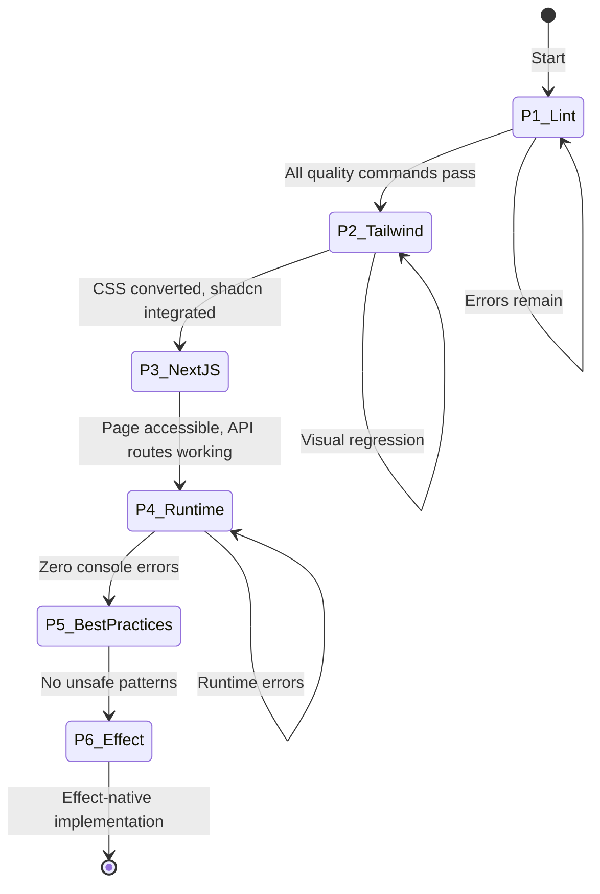

# Master Orchestration Guide

> Complete workflow for orchestrating the Lexical Playground port across all 6 phases.

---

## Orchestration Overview



---

## Phase Execution Protocol

### Pre-Phase Checklist (Every Phase)

- [ ] Read `QUICK_START.md` for current status
- [ ] Read `handoffs/HANDOFF_P[N].md` for full context
- [ ] Run quality commands to establish baseline
- [ ] Review `REFLECTION_LOG.md` for accumulated learnings

### Post-Phase Checklist (Every Phase)

- [ ] Run quality commands to verify success
- [ ] Update `REFLECTION_LOG.md` with learnings
- [ ] Create `handoffs/HANDOFF_P[N+1].md`
- [ ] Create `handoffs/P[N+1]_ORCHESTRATOR_PROMPT.md`
- [ ] Update `QUICK_START.md` status fields

---

## Phase 1: Fix Lint/Build/Check Errors

### Transition Guard

```
Entry: Spec initialized, codebase copied
Exit: lint.errors == 0 && check.errors == 0 && build.success == true
```

### Work Items (5)

| # | Task | Agent | Est. Effort |
|---|------|-------|-------------|
| 1.1 | Fix corrupted `InsertLayoutDialog.tsx` | Manual | Small |
| 1.2 | Run `lint:fix` for auto-fixable issues | `package-error-fixer` | Small |
| 1.3 | Fix button types (~10 files) | `package-error-fixer` | Medium |
| 1.4 | Remove unused imports | `package-error-fixer` | Small |
| 1.5 | Fix remaining lint issues | `package-error-fixer` | Medium |

### Verification Commands

```bash
bun run lint --filter=@beep/todox    # Target: 0 errors
bun run check --filter=@beep/todox   # Target: 0 errors
bun run build --filter=@beep/todox   # Target: Success
```

### Agent Delegation

**Primary**: `package-error-fixer`

```
Fix all type errors, build errors, and lint issues for @beep/todox.
Focus on apps/todox/src/app/lexical/ directory.

Priority order:
1. Fix corrupted InsertLayoutDialog.tsx license header
2. Run lint:fix for auto-fixable issues
3. Add type="button" to all <button> elements without type
4. Remove unused imports
5. Fix remaining lint errors (isNaN, iframe titles, etc.)
```

---

## Phase 2: Tailwind + shadcn Conversion

### Transition Guard

```
Entry: P1 complete (all quality commands pass)
Exit: css_files_remaining <= 5 && shadcn_components_integrated == true
```

### Work Items (6)

| # | Task | Agent | Est. Effort |
|---|------|-------|-------------|
| 2.1 | Analyze existing CSS patterns | `codebase-researcher` | Small |
| 2.2 | Convert `themes/` CSS (3 files) | `effect-code-writer` | Medium |
| 2.3 | Convert `ui/` CSS (12 files) | `effect-code-writer` | Large |
| 2.4 | Replace Modal with Dialog | `effect-code-writer` | Medium |
| 2.5 | Replace DropDown with DropdownMenu | `effect-code-writer` | Medium |
| 2.6 | Replace remaining UI components | `effect-code-writer` | Medium |

### Critical Constraint

**shadcn uses `@base-ui/react`**, NOT `@radix-ui`:

```typescript
// This repo's pattern
import { Dialog, DialogTrigger } from "@base-ui/react";

// Standard shadcn (NOT used here)
import { Dialog } from "@radix-ui/react-dialog";
```

### Verification

1. Visual inspection at `/lexical` route
2. No CSS files imported in converted components
3. All quality commands pass

---

## Phase 3: Next.js Page + API Routes

### Transition Guard

```
Entry: P2 complete (Tailwind/shadcn integrated)
Exit: page_accessible == true && api_routes_functional == true
```

### Work Items (4)

| # | Task | Agent | Est. Effort |
|---|------|-------|-------------|
| 3.1 | Create `/app/lexical/page.tsx` | `effect-code-writer` | Small |
| 3.2 | Create `/api/lexical/validate/route.ts` | `effect-code-writer` | Medium |
| 3.3 | Create `/api/lexical/set-state/route.ts` | `effect-code-writer` | Medium |
| 3.4 | Update client to use new API endpoints | `effect-code-writer` | Small |

### API Route Specifications

**POST /api/lexical/validate**
- Input: `{ editorState: string }`
- Output: `{ valid: boolean, errors?: string[] }`
- Auth: Required

**POST /api/lexical/set-state**
- Input: `{ editorState: string }`
- Output: `{ success: boolean }`
- Auth: Required

### Verification

```bash
# Start dev server
bun run dev --filter=@beep/todox

# Navigate to: http://localhost:3000/auth/sign-in
# Login: beep@hole.com / F55kb3iy!
# Navigate to: http://localhost:3000/lexical
```

---

## Phase 4: Runtime Error Fixes

### Transition Guard

```
Entry: P3 complete (page accessible, API working)
Exit: console_errors == 0 && runtime_exceptions == 0
```

### Work Items (5)

| # | Task | Agent | Est. Effort |
|---|------|-------|-------------|
| 4.1 | Start dev server and login | Manual | Small |
| 4.2 | Capture console errors | Browser DevTools | Small |
| 4.3 | Fix React hydration errors | Manual | Variable |
| 4.4 | Fix plugin loading errors | Manual | Variable |
| 4.5 | Test core editor functionality | Manual | Medium |

### Debugging Protocol

1. Open Chrome DevTools Console
2. Clear console
3. Navigate to `/lexical`
4. Document all errors/warnings
5. Prioritize: Exceptions > Errors > Warnings
6. Fix in priority order, re-test after each fix

### Verification

- Zero console errors
- Editor loads and accepts input
- At least 3 plugins functional (bold, italic, links)

---

## Phase 5: Repository Best Practices

### Transition Guard

```
Entry: P4 complete (zero runtime errors)
Exit: any_types == 0 && type_assertions == 0 && non_null_assertions == 0
```

### Work Items (5)

| # | Task | Agent | Est. Effort |
|---|------|-------|-------------|
| 5.1 | Remove `as Type` assertions | `code-reviewer` + `effect-code-writer` | Medium |
| 5.2 | Remove `!` non-null assertions | `code-reviewer` + `effect-code-writer` | Medium |
| 5.3 | Replace `any` with proper types | `code-reviewer` + `effect-code-writer` | Large |
| 5.4 | Use Effect Array utilities | `effect-code-writer` | Medium |
| 5.5 | Use Effect String utilities | `effect-code-writer` | Small |

### Pattern Reference

```typescript
// Before (forbidden)
const items = array.map(x => x.id);
const name = value!.name;
const data = result as MyType;

// After (required)
import * as A from "effect/Array";
import * as O from "effect/Option";

const items = A.map(array, x => x.id);
const name = O.map(O.fromNullable(value), v => v.name);
const data = yield* S.decodeUnknown(MyType)(result);
```

---

## Phase 6: Effect Pattern Migration

### Transition Guard

```
Entry: P5 complete (no unsafe patterns)
Exit: json_parse == 0 && try_catch == 0 && raw_promises == 0
```

### Work Items (5)

| # | Task | Agent | Est. Effort |
|---|------|-------|-------------|
| 6.1 | Replace `JSON.parse` with Schema | `mcp-researcher` + `effect-code-writer` | Medium |
| 6.2 | Replace `try/catch` with Effect | `effect-code-writer` | Large |
| 6.3 | Replace Promises with Effects | `effect-code-writer` | Large |
| 6.4 | Convert API routes to Effect handlers | `effect-code-writer` | Medium |
| 6.5 | Add tagged errors | `effect-code-writer` | Medium |

### Effect Pattern Reference

```typescript
// Before
try {
  const data = JSON.parse(input);
  return data;
} catch (e) {
  console.error(e);
  return null;
}

// After
import * as S from "effect/Schema";
import * as Effect from "effect/Effect";

const parseData = S.decodeUnknown(MySchema);
const program = Effect.gen(function* () {
  const data = yield* parseData(input);
  return data;
}).pipe(
  Effect.catchTag("ParseError", (e) =>
    Effect.logError("Parse failed", e)
  )
);
```

### Verification

```bash
# Search for remaining violations
grep -r "JSON.parse" apps/todox/src/app/lexical/
grep -r "try {" apps/todox/src/app/lexical/
grep -r "new Promise" apps/todox/src/app/lexical/
```

---

## Handoff Protocol

### At Each Phase End

1. **Verify success criteria met**
2. **Update REFLECTION_LOG.md**:
   - What worked?
   - What didn't work?
   - Key discoveries
   - Patterns to reuse
3. **Create HANDOFF_P[N+1].md**:
   - Previous phase summary
   - Detailed task specifications
   - Implementation order
   - Success criteria
4. **Create P[N+1]_ORCHESTRATOR_PROMPT.md**:
   - Copy-paste ready
   - Concise context
   - Clear mission
   - Verification commands

### Handoff Document Token Budgets

| Section | Max Tokens |
|---------|------------|
| Working (current tasks) | 2,000 |
| Episodic (history) | 1,000 |
| Semantic (constants) | 500 |
| **Total per handoff** | **4,000** |

---

## Rollback Procedures

### If Phase Fails

1. Document failure in `REFLECTION_LOG.md`
2. Run `git status` to assess changes
3. If recoverable: fix issues and retry
4. If unrecoverable: `git checkout -- apps/todox/src/app/lexical/`
5. Re-read handoff and attempt alternative approach

### Phase-Specific Rollback

| Phase | Rollback Strategy |
|-------|-------------------|
| P1 | Re-run lint:fix, manual fixes |
| P2 | Restore CSS files from git |
| P3 | Delete created page/routes |
| P4 | Document errors for next attempt |
| P5 | Use `git diff` to review changes |
| P6 | Partial Effect migration acceptable |

---

## Success Metrics

### Overall Completion

- [ ] All 6 phases complete
- [ ] Zero lint errors
- [ ] Zero type errors
- [ ] Zero console errors
- [ ] Effect patterns used throughout
- [ ] Documented in `REFLECTION_LOG.md`

### Per-Phase Metrics

| Phase | Primary Metric |
|-------|----------------|
| P1 | `lint.errors + check.errors = 0` |
| P2 | `css_files <= 5 && shadcn_used = true` |
| P3 | `page_loads = true && api_works = true` |
| P4 | `console.errors = 0` |
| P5 | `unsafe_patterns = 0` |
| P6 | `effect_violations = 0` |
