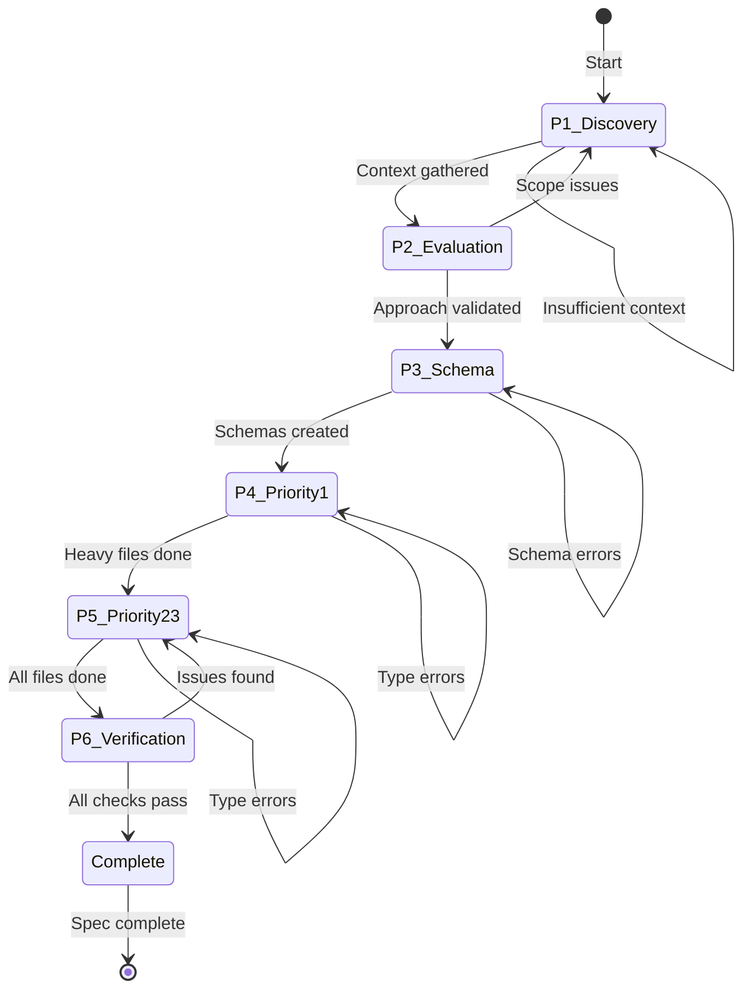

# Master Orchestration

> Complete workflow for refactoring Lexical Utils to Effect patterns.

---

## State Machine



---

## Phase 1: Discovery

### Purpose

Gather comprehensive context on current file implementations and Effect API requirements.

### Sub-Agent Tasks

#### Task 1.1: Codebase Analysis (codebase-researcher)

```
Analyze all files in apps/todox/src/app/lexical/utils/

For each file, document:
1. Current patterns used (native String, Array, Set, etc.)
2. Async/Promise usage
3. Null/undefined handling approach
4. Error handling patterns
5. Dependencies on external APIs (lexical, DOM)

Output: outputs/codebase-analysis.md
```

#### Task 1.2: Effect API Research (mcp-researcher)

```
Research Effect documentation for:
1. effect/Stream - streaming patterns to replace async generators
2. effect/HashSet - replacing native Set
3. effect/Option - null/undefined handling
4. effect/Schema - S.pattern() for regex, S.decodeUnknownSync for JSON
5. effect/String - all string manipulation methods
6. effect/Array - all array manipulation methods

Focus on:
- Stream.fromAsyncIterable for async generator replacement
- HashSet.fromIterable for Set conversion
- S.pattern() syntax for regex schemas

Output: outputs/effect-api-research.md
```

### Transition Criteria

- [ ] `outputs/codebase-analysis.md` generated
- [ ] `outputs/effect-api-research.md` generated
- [ ] All 10 files analyzed
- [ ] Effect API patterns documented for each refactoring need
- [ ] `REFLECTION_LOG.md` updated

---

## Phase 2: Evaluation

### Purpose

Validate the refactoring approach and identify potential risks.

### Sub-Agent Tasks

#### Task 2.1: Architecture Review (architecture-pattern-enforcer)

```
Validate proposed changes against repository patterns:

1. Check Effect import conventions match .claude/rules/effect-patterns.md
2. Verify schema placement in apps/todox/src/app/lexical/schema/
3. Confirm no cross-boundary imports will be created
4. Review dependency order implications

Output: outputs/architecture-review.md
```

#### Task 2.2: Code Quality Review (code-reviewer)

```
Review proposed transformation patterns:

1. Verify Effect.gen usage patterns are correct
2. Check Stream patterns for async code
3. Validate Option/Predicate usage for null checks
4. Ensure no native methods slip through

Output: outputs/code-quality-review.md
```

### Transition Criteria

- [ ] `outputs/architecture-review.md` generated
- [ ] `outputs/code-quality-review.md` generated
- [ ] No blocking architectural issues identified
- [ ] Transformation patterns approved
- [ ] `REFLECTION_LOG.md` updated

---

## Phase 3: Schema Creation

### Purpose

Create Effect schemas for data validation, replacing raw regex and JSON.parse.

### Sub-Agent Tasks

#### Task 3.1: URL Schemas (effect-code-writer)

```
Create apps/todox/src/app/lexical/schema/url.schema.ts

Requirements:
1. UrlPattern schema with S.pattern() for URL regex
2. SupportedProtocol literal union
3. SanitizedUrl schema combining validation
4. Use $TodoxId for annotations

Reference regex from url.ts:
/((([A-Za-z]{3,9}:(?:\/\/)?)(?:[-;:&=+$,\w]+@)?[A-Za-z0-9.-]+|(?:www.|[-;:&=+$,\w]+@)[A-Za-z0-9.-]+)((?:\/[+~%/.\w-_]*)?\??(?:[-+=&;%@.\w_]*)#?(?:[\w]*))?)/
```

#### Task 3.2: Document Hash Schemas (effect-code-writer)

```
Create apps/todox/src/app/lexical/schema/docHash.schema.ts

Requirements:
1. DocHashPattern schema with S.pattern(/^#doc=(.*)$/)
2. Base64UrlSafe schema for the encoded content
3. SerializedDocument schema (reference existing SerializedLexicalNode)
4. Use $TodoxId for annotations
```

#### Task 3.3: Update Schema Index (effect-code-writer)

```
Update apps/todox/src/app/lexical/schema/index.ts

Add exports:
export * from "./url.schema";
export * from "./docHash.schema";
```

### Transition Criteria

- [ ] `url.schema.ts` created with valid schemas
- [ ] `docHash.schema.ts` created with valid schemas
- [ ] `index.ts` updated with exports
- [ ] Type check passes: `bun run check --filter todox`
- [ ] `REFLECTION_LOG.md` updated

---

## Phase 4: Priority 1 Refactor (Heavy Files)

### Purpose

Refactor the three most complex files requiring async/Stream and collection changes.

### Sub-Agent Tasks

#### Task 4.1: Refactor docSerialization.ts (effect-code-writer)

```
Refactor apps/todox/src/app/lexical/utils/docSerialization.ts

Transformations:
1. Replace async generator with Stream.fromAsyncIterable or Stream.unfold
2. Replace Promise.all with Effect.all
3. Replace JSON.stringify/parse with S.encode/S.decodeUnknownSync
4. Replace native array operations with A.*
5. Replace string operations with Str.*

Key patterns:
- generateReader -> Stream.unfold
- readBytestoString -> Stream.runCollect + A.join
- docToHash -> Effect.gen with Stream
- docFromHash -> Effect.gen with Stream + schema decode

Return type changes:
- async function -> Effect.Effect<T, E, never>
```

#### Task 4.2: Refactor swipe.ts (effect-code-writer)

```
Refactor apps/todox/src/app/lexical/utils/swipe.ts

Transformations:
1. Replace Set<Listener> with HashSet.HashSet<Listener>
2. Replace WeakMap with MutableRef or Context (evaluate best approach)
3. Replace undefined checks with O.fromNullable
4. Replace null checks with O.fromNullable

Key patterns:
- new Set() -> HashSet.empty()
- set.add(x) -> HashSet.add(set, x)
- set.delete(x) -> HashSet.remove(set, x)
- set.size === 0 -> HashSet.size(set) === 0
- elements.get(element) -> O.fromNullable(...)

Note: WeakMap may need special handling - could use global MutableRef or
restructure to avoid global state.
```

#### Task 4.3: Refactor url.ts (effect-code-writer)

```
Refactor apps/todox/src/app/lexical/utils/url.ts

Transformations:
1. Replace Set with HashSet
2. Replace try/catch with Effect.try or Effect.gen
3. Use UrlPattern schema for validation instead of raw regex
4. Use SupportedProtocol schema for protocol check

Key patterns:
- SUPPORTED_URL_PROTOCOLS Set -> HashSet.fromIterable
- try { new URL } catch -> Effect.try
- urlRegExp.test(url) -> S.is(UrlPattern)(url)
```

### Transition Criteria

- [ ] `docSerialization.ts` fully refactored
- [ ] `swipe.ts` fully refactored
- [ ] `url.ts` fully refactored
- [ ] No native String/Array/Set methods remain
- [ ] Type check passes: `bun run check --filter todox`
- [ ] `REFLECTION_LOG.md` updated

---

## Phase 5: Priority 2-3 Refactor (Remaining Files)

### Purpose

Refactor the remaining 7 files with moderate to light changes.

### Sub-Agent Tasks

#### Task 5.1: Moderate Files (effect-code-writer)

```
Refactor these files:

1. getThemeSelector.ts:
   - string.split(/\s+/g) -> Str.split with regex or A.filter + Str.split
   - array.map -> A.map
   - array.join() -> A.join
   - typeof check -> P.isString

2. joinClasses.ts:
   - array.filter(Boolean) -> A.filter(P.isTruthy)
   - array.join(' ') -> A.join(' ')

3. setFloatingElemPosition.ts:
   - null checks -> O.fromNullable or P.isNotNull guards
   - Preserve DOM interaction logic
```

#### Task 5.2: Light Files (effect-code-writer)

```
Refactor these files:

1. focusUtils.ts:
   - null return -> O.Option<HTMLElement>
   - Optional chaining -> O.map / O.flatMap

2. getDOMRangeRect.ts:
   - while loop with null check -> use recursion or keep imperative
   - null check -> O.fromNullable where appropriate

3. getSelectedNode.ts:
   - Conditional logic -> Match.value or if/else (evaluate best approach)

4. setFloatingElemPositionForLinkEditor.ts:
   - null checks -> O.fromNullable or P.isNotNull guards
```

#### Task 5.3: Update index.ts (effect-code-writer)

```
Update apps/todox/src/app/lexical/utils/index.ts

Export all refactored utilities with proper Effect types.
```

### Transition Criteria

- [ ] All 7 files refactored
- [ ] No native String/Array methods remain in any file
- [ ] All null checks use Option or Predicate
- [ ] Type check passes: `bun run check --filter todox`
- [ ] `REFLECTION_LOG.md` updated

---

## Phase 6: Verification

### Purpose

Final verification, testing, and cleanup.

### Sub-Agent Tasks

#### Task 6.1: Type Check (package-error-fixer)

```
Fix any remaining type errors in todox package:

bun run check --filter todox

Address all TypeScript errors related to:
- Effect return types
- Option unwrapping
- Schema type mismatches
```

#### Task 6.2: Lint Fix (package-error-fixer)

```
Run lint and fix issues:

bun run lint:fix --filter todox

Ensure Biome formatting is correct.
```

#### Task 6.3: Integration Tests (test-writer)

```
Create test file: apps/todox/src/app/lexical/utils/test/utils.test.ts

Test coverage for:
1. sanitizeUrl - valid/invalid protocols, malformed URLs
2. validateUrl - regex pattern matching
3. docToHash/docFromHash - round-trip encoding (if feasible)
4. joinClasses - various input combinations
5. getThemeSelector - theme class parsing

Use @beep/testkit patterns.
```

### Transition Criteria

- [ ] `bun run check --filter todox` passes
- [ ] `bun run lint:fix --filter todox` passes
- [ ] Test file created with key test cases
- [ ] Tests pass: `bun run test --filter todox`
- [ ] `REFLECTION_LOG.md` updated with final learnings
- [ ] Spec marked complete

---

## Context Budget Tracking

| Phase | Direct Tool Calls | Large File Reads | Sub-Agent Delegations |
|-------|-------------------|------------------|----------------------|
| P1 | 0 | 0 | 2 |
| P2 | 0 | 0 | 2 |
| P3 | 0 | 0 | 3 |
| P4 | 0 | 0 | 3 |
| P5 | 0 | 0 | 3 |
| P6 | 0 | 0 | 3 |

**Budget per phase**: Orchestrator should stay in Green Zone (< 10 direct tool calls, < 2 large file reads, < 5 sub-agent delegations per phase).

---

## Rollback Strategy

If refactoring causes integration issues:

1. Git provides full history of original files
2. Each file can be reverted independently
3. Schemas can be deleted without affecting other code
4. barrel files (index.ts) can be updated to exclude problem exports

**Emergency rollback**:
```bash
git checkout HEAD~1 -- apps/todox/src/app/lexical/utils/
```
