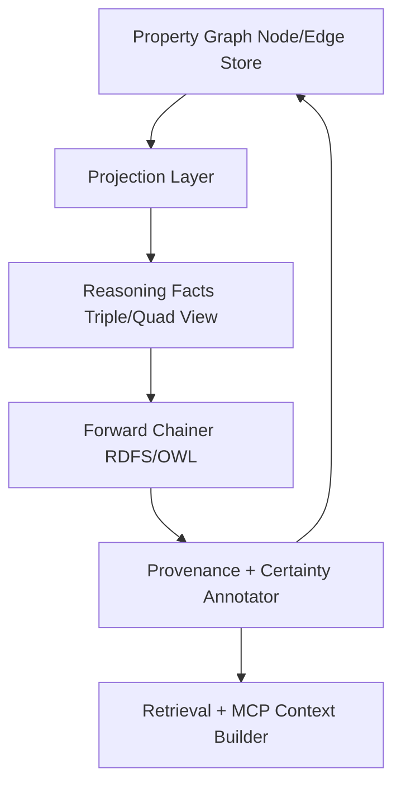
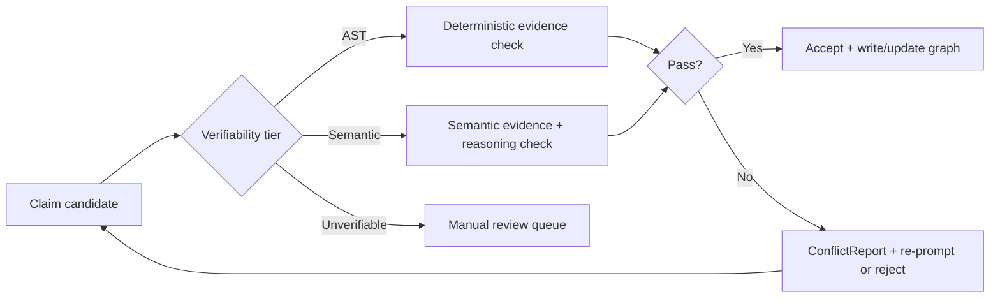

# OVERVIEW: Repo Codegraph + JSDoc + NLP + Reasoning

## 1. Purpose and Reader Contract
### State Split
- `Implemented`: Canonical architecture, phase gates, and quality rubrics already exist in `specs/pending/repo-codegraph-canonical` and provide the normative baseline.
- `Specified`: JSDoc fibration and agent-pipeline design is documented in `specs/pending/repo-codegraph-jsdoc/outputs/JSDOC_FIBRATION_ARCHITECTURE.md`.
- `Conceptual (Greenfield)`: NLP and RDFS/OWL forward-chaining reasoning are integrated here as design-ready augmentation layers for the next concrete spec.

This document is an **LLM bootstrap spec**. It is intended to be sufficient input for an LLM or engineer to draft a concrete, implementation-ready greenfield spec without re-gathering context.

Reader contract:
- Treat locked defaults in canonical docs as authoritative unless explicitly marked as future ADR candidates.
- Distinguish current repository reality from planned and conceptual architecture.
- Use this document to seed the next design artifact, not as an instruction to ship code immediately.

---

## 2. Source Corpus and Confidence Model
### State Split
- `Implemented`: In-repo source files and current `tooling/repo-utils/src/JSDoc` implementation are directly verifiable.
- `Specified`: Pending architecture docs and orchestration plans are high-confidence design intent.
- `Conceptual (Greenfield)`: User-provided Reasoning Service code snippet is treated as a trusted design input but not a repo-locked implementation.

### Source Groups
| Source Group | Primary Paths | Confidence | Notes |
|---|---|---|---|
| Canonical architecture + gates | `specs/pending/repo-codegraph-canonical/README.md`, `MASTER_ORCHESTRATION.md`, `RUBRICS.md` | High | Normative defaults and phase contracts |
| JSDoc fibration architecture | `specs/pending/repo-codegraph-jsdoc/outputs/JSDOC_FIBRATION_ARCHITECTURE.md` | High | Core schema strategy and agent pipeline |
| JSDoc implementation state | `tooling/repo-utils/src/JSDoc/**` | High | Actual code currently present |
| JSDoc implementation plan notes | `specs/pending/repo-codegraph-jsdoc/prompt.md` | Medium-High | Detailed migration strategy; may drift from code |
| NLP subsystem design | `specs/pending/repo-codegraph-jsdoc/outputs/Building a code-aware NLP service in TypeScript.md` | Medium-High | Design and algorithm choices |
| Research corpus | `specs/pending/repo-codegraph-jsdoc/outputs/compiled_sources/**` | Medium | Evidence and patterns; not direct implementation |
| Reasoning layer input | User-provided `Reasoning/*` snippet (`ForwardChainer`, `OwlRules`, `RdfsRules`, `ReasonerService`) | Medium-High | Strong conceptual blueprint, not in repo tree |

### Confidence Labels Used in This Document
- `Implemented`: exists in repo code or enforceable canonical lock docs.
- `Specified`: documented and decisioned, not fully landed in production code.
- `Conceptual (Greenfield)`: proposed synthesis needed for next spec/implementation phase.

---

## 3. Current Reality Snapshot
### State Split
- `Implemented`: `tooling/repo-utils/src/JSDoc` contains a large canonical tag definition surface and model exports including annotation and tag-value layers.
- `Specified`: Exhaustiveness audits and taxonomy/routing artifacts exist under pending outputs.
- `Conceptual (Greenfield)`: Full operational taxonomy/routing runtime and reasoning-backed validation loops are not yet implemented end-to-end.

### What Exists Today
- `tooling/repo-utils/src/JSDoc/JSDoc.ts` contains extensive canonical tag declarations and unions.
- `tooling/repo-utils/src/JSDoc/models/index.ts` exports `JSDocTagAnnotation` and `TagValue` along with `ApplicableTo`, `ASTDerivability`, `TSCategory`, and related schemas.
- `tooling/repo-utils/src/JSDoc/models/JSDocTagDefinition.model.ts` uses `annotate({ jsDocTagMetadata: def })` in `make`, aligning with fibrational metadata strategy.

### What Is Documented but Not Fully Operationalized
- Full `TSCategory` taxonomy instantiation, precedence, and routing utility layer described in pending audit artifacts.
- End-to-end integration between deterministic extraction, narrowed structured output generation, validation loops, and write-back services.
- Reasoner-backed inference/materialization and contradiction-management workflows.

---

## 4. Core Vision
### State Split
- `Implemented`: Deterministic-first orientation and certainty tiers are locked in canonical docs.
- `Specified`: JSDoc fibrational architecture defines schema-as-single-source for metadata + payload validation.
- `Conceptual (Greenfield)`: Ontology reasoning and advanced NLP decomposition become first-class components in the same architecture.

Build a **deterministic-first repository intelligence system** for TypeScript monorepos with these pillars:
- Layered certainty: AST deterministic facts, type-checker refinements, bounded LLM enrichment.
- JSDoc as structured semantic surface, not plain free text.
- Hybrid retrieval (graph + vectors) for agent context.
- Validation loops that aggressively reduce hallucinations.
- Optional reasoning overlay to infer additional safe facts with provenance and bounded cost.

North-star outcome:
- Higher agent accuracy.
- Lower hallucination rate.
- Better documentation freshness.
- Queryable, explainable repository truth.

---

## 5. Canonical Architecture (P0-P7)
### State Split
- `Implemented`: Phase model, lock tables, and pass/fail rubrics are already documented.
- `Specified`: Canonical P0-P7 deliverables and quantitative targets are defined.
- `Conceptual (Greenfield)`: NLP and Reasoning insertions are remapped here to avoid phase ambiguity.

### Canonical Phase Baseline
The canonical package defines P0-P7 with hard entry/exit gates. Locked defaults include:
- FalkorDB + falkordblite for graph store.
- ts-morph + tree-sitter for extraction and incremental parse.
- Voyage Code 3 for embeddings.
- Claude Sonnet/Opus for enrichment/deep review.
- 3-tier certainty model.
- MCP tools/resources and drift pipeline constraints.

### Phase Remap: NLP + Reasoning Placement
| Phase | Canonical Focus | NLP Insertion | Reasoning Insertion | State |
|---|---|---|---|---|
| P0 | Locks + launch packet | Define NLP module boundaries and non-goals | Define reasoning scope boundary and safety envelope | `Specified` |
| P1 | Schema freeze | Add `Claim`, `VerificationEvidence`, `EntityAlias` schemas | Add `InferenceFact`, `InferenceProvenance`, `ReasoningProfile` schemas | `Conceptual (Greenfield)` |
| P2 | AST extraction + deterministic enrichment | Add sentence protection zones, identifier normalization, claim evidence extraction hooks | None mandatory; consume deterministic facts as input only | `Conceptual (Greenfield)` |
| P3 | Graph storage + incremental indexing | Store normalized identifiers and optional claim artifacts | Add inferred-fact storage model and idempotent upsert policy | `Conceptual (Greenfield)` |
| P4 | LLM enrichment + classification | Run claim decomposition and verifiability tiering; align evidence granularity | Use reasoner optionally for post-enrichment consistency checks | `Conceptual (Greenfield)` |
| P5 | Embeddings + MCP + query | Add context budget manager and tiered serialization packer | Primary home for `ReasoningAdapter` (on-demand infer + optional materialize) | `Conceptual (Greenfield)` |
| P6 | Freshness + CI/CD | Validate claim drift and decomposition quality checks | Contradiction alerts and inferred-fact drift checks | `Conceptual (Greenfield)` |
| P7 | Deployment + validation + observability | Track NLP quality metrics in validation report | Track inference precision/latency/contradictions in validation report | `Conceptual (Greenfield)` |

---

## 6. JSDoc Fibration Model
### State Split
- `Implemented`: `JSDocTagDefinition.make` annotates schemas with `jsDocTagMetadata` and tag payload structures are represented in models.
- `Specified`: Fibration architecture formalizes metadata-in-annotation and lean fiber payload with three schema roles.
- `Conceptual (Greenfield)`: Extended annotation composition and schema export strategy across providers remain open design space.

### Core Model
The fibration split is:
- **Base/fiber payload**: per-occurrence data (`_tag`, `value`).
- **Annotation metadata**: constant per-tag semantics (`overview`, applicability, derivability, specs, relationships).

### Three Schema Roles
1. Agent context synthesis from annotations.
2. Agent output validation from payload schema.
3. `ts-morph` write source from validated structured output.

### Structured Output Narrowing
The documented strategy avoids array-of-discriminated-union instability by using a product-of-optionals shape keyed by applicable tags for each target node.

---

## 7. NLP Service Architecture
### State Split
- `Implemented`: No dedicated NLP service module is currently landed in this repo path.
- `Specified`: Detailed NLP module design exists in `Building a code-aware NLP service in TypeScript.md`.
- `Conceptual (Greenfield)`: Service wiring, contracts, and production rollout remain to be specified and built.

### Six NLP Modules
1. Code-aware sentence splitting with protection zones.
2. Multi-provider token estimation (OpenAI exact, Claude proxy + optional API count).
3. Claim decomposition into verifiable atomic statements.
4. AST-aware chunking for embeddings.
5. Context budget management for 2-hop graph serialization.
6. Identifier normalization and link resolution.

### Proposed NLP Service Boundary
| Submodule | Primary Input | Primary Output | Failure Modes | State |
|---|---|---|---|---|
| SentenceSplitter | JSDoc/markdown/code text | Atomic sentences with source spans | Bad masking, false splits | `Specified` |
| TokenEstimator | Prompt/context blocks | token counts + budget hints | tokenizer mismatch, API latency | `Specified` |
| ClaimDecomposer | Sentences + node context | typed claims + verifiability | malformed structured output | `Specified` |
| CodeChunker | AST + docs | embedding-ready contextual chunks | parse failures, oversized chunks | `Specified` |
| ContextBudgeter | 2-hop subgraph + query | tiered packed context | overflow or low relevance | `Specified` |
| IdentifierNormalizer | identifiers + links | normalized aliases + resolved references | ambiguous symbol resolution | `Specified` |

---

## 8. Reasoning Service Augmentation
### State Split
- `Implemented`: Reasoning service files are not present in this repository path as of this synthesis.
- `Specified`: User-provided Reasoning Service snippet defines concrete patterns for forward chaining, rulesets, and materialization behavior.
- `Conceptual (Greenfield)`: Integration into the canonical repo-codegraph stack is designed here for the next spec.

### Imported Concepts from Reasoning Snippet
- Forward chainer with `maxDepth` and `maxInferences` guardrails.
- Provenance tracking: inferred fact -> rule id + source fact ids.
- Rule families:
  - RDFS: domain/range/subclass/subproperty entailment.
  - OWL: `sameAs` symmetry/transitivity/propagation, `inverseOf`, transitive property, symmetric property.
- Service API shape with infer-only and infer+materialize modes.

### Integration Value
- Verify and augment graph context with inferred safe relationships.
- Resolve alias/equivalence chains across symbol naming forms.
- Improve context packing completeness without requiring LLM calls.
- Provide explainable inference provenance for audits and drift checks.

### Materialization Policy
- Default to non-materialized on request-path queries.
- Materialize only bounded, high-confidence inferred facts in controlled background jobs.
- Never allow inferred facts to overwrite deterministic Tier-1 assertions.

---

## 9. Unified End-to-End Dataflow
### State Split
- `Implemented`: Canonical architecture and current JSDoc model pieces support partial pipeline segments.
- `Specified`: Full multi-stage pipeline is documented across canonical + fibration + NLP docs.
- `Conceptual (Greenfield)`: Reasoner-coupled and claim-coupled integrated pipeline is proposed for next spec.


### Pipeline Notes
- Deterministic extraction remains first-order source of truth.
- LLM output must pass validation and contradiction checks.
- Reasoning sits downstream of verified facts and upstream of final retrieval packing.

---

## 10. Knowledge Representation Strategy
### State Split
- `Implemented`: Property graph model is the canonical representation strategy.
- `Specified`: Node/edge schemas, certainty metadata, and MCP query contracts are documented.
- `Conceptual (Greenfield)`: Reasoning overlay introduces RDF-like triple/quad projection without replacing property graph core.

### Strategy
- Keep **property graph in FalkorDB** as primary persistence and query substrate.
- Add **reasoning overlay projection** for entailment operations.
- Keep a bidirectional mapping between property graph edges and reasoning facts.



### Mapping Principles
- `Node` -> subject entity + typed attributes.
- `Edge` -> predicate relation with source/target.
- `certaintyTier`, `provenance`, and conflict flags are carried alongside inferred facts.

---

## 11. Validation and De-Hallucinator Loop
### State Split
- `Implemented`: Canonical docs lock De-Hallucinator style validation requirements and pass-rate targets.
- `Specified`: Fibration docs define validation schema generation and constrained output patterns.
- `Conceptual (Greenfield)`: Claim-level evidence matching and reasoner-assisted contradiction diagnosis extend the loop.

### Verification Tiers
- `ast_verifiable`: direct AST/type-checker evidence available.
- `semantic`: requires deeper analysis or inferred support.
- `unverifiable`: escalate for human review; never auto-assert as deterministic fact.



### Contradiction Handling
- Deterministic contradictions: reject inferred/LLM claim and emit high-severity `ConflictReport`.
- Non-deterministic contradictions: retain both with explicit uncertainty and remediation queue.

---

## 12. Retrieval and Context Budgeting
### State Split
- `Implemented`: Canonical docs define 2-hop subgraph extraction and MCP query surfaces.
- `Specified`: NLP doc defines tiered serialization and category budgets with token accounting strategy.
- `Conceptual (Greenfield)`: Combined graph + inferred fact prioritization policy is proposed for next spec.

### Serialization Tiers
- Level 0: full source + JSDoc + rich metadata.
- Level 1: signature + concise docs + key constraints.
- Level 2: signature + one-line role.
- Level 3: minimal typed signature facts.
- Level 4: batched module-level summaries.

### Budgeting Policy
- Reserve response/system overhead first.
- Allocate fixed budget slices to focal node, 1-hop, 2-hop, graph structure.
- Use priority score combining relevance, hop distance penalty, node type importance, and graph centrality.

### Retrieval Output Contract Requirement
Every retrieval packet should encode:
- included nodes + edges,
- selected serialization tier per node,
- token usage summary,
- truncation/omission rationale.

---

## 13. Public Interfaces and Type Contracts for Next Spec
### State Split
- `Implemented`: Canonical contracts exist for MCP tools/resources and graph entities at high level.
- `Specified`: JSDoc and NLP docs imply additional typed contracts.
- `Conceptual (Greenfield)`: This section defines concrete interface inventory for the next implementation spec.

### Contract Inventory

```ts
export type ReasoningProfile =
  | "rdfs-subclass"
  | "rdfs-domain-range"
  | "owl-sameas"
  | "owl-full"
  | "custom";

export interface ReasoningAdapter {
  inferSubgraph(input: {
    nodeIds: ReadonlyArray<string>;
    maxDepth: number;
    maxInferences: number;
    profile: ReasoningProfile;
  }): Promise<ReadonlyArray<InferenceFact>>;

  inferAndMaterialize(input: {
    nodeIds: ReadonlyArray<string>;
    maxDepth: number;
    maxInferences: number;
    profile: ReasoningProfile;
    materialize: boolean;
  }): Promise<ReadonlyArray<InferenceFact>>;
}

export interface InferenceProvenance {
  ruleId: string;
  sourceFactIds: ReadonlyArray<string>;
}

export interface InferenceFact {
  factId: string;
  subjectId: string;
  predicate: string;
  objectIdOrLiteral: string;
  certaintyTier: 2 | 3;
  provenance: InferenceProvenance;
  conflictStatus: "none" | "warning" | "contradiction";
}

export interface Claim {
  claimId: string;
  targetNodeId: string;
  claim: string;
  claimType: string;
  verifiability: "ast_verifiable" | "semantic" | "unverifiable";
  sourceSpan: string;
}

export interface VerificationEvidence {
  claimId: string;
  astEvidencePointers: ReadonlyArray<string>;
  semanticEvidencePointers: ReadonlyArray<string>;
  verdict: "pass" | "fail" | "needs_review";
}

export type GraphSerializationTier =
  | { level: 0; label: "full" }
  | { level: 1; label: "signature_plus_summary" }
  | { level: 2; label: "signature_plus_purpose" }
  | { level: 3; label: "minimal_signature" }
  | { level: 4; label: "batched_module_summary" };

export interface EntityAlias {
  entityId: string;
  original: string;
  normalizedTokens: ReadonlyArray<string>;
  sameAsEntityIds: ReadonlyArray<string>;
}

export interface ConflictReport {
  conflictId: string;
  subjectEntityId: string;
  deterministicFactId: string;
  inferredOrGeneratedFactId: string;
  severity: "high" | "medium" | "low";
  resolution: "reject_new" | "retain_both" | "manual_review";
}
```

### Interface Behavior Contracts
| Contract | Purpose | Inputs | Outputs | Failure Behavior | State |
|---|---|---|---|---|---|
| `ReasoningAdapter` | Run bounded inference over selected graph region | node ids + profile + limits | inferred facts with provenance | `maxDepth`/`maxInferences` exceeded -> typed failure | `Conceptual (Greenfield)` |
| `InferenceFact` | Represent entailed graph facts | projected graph facts + rule results | normalized inferred fact record | conflict with deterministic fact -> contradiction flag | `Conceptual (Greenfield)` |
| `Claim` | Represent decomposition unit for validation | sentence span + target node context | typed claim record | malformed output -> drop/retry/dead-letter | `Conceptual (Greenfield)` |
| `VerificationEvidence` | Bind claims to AST/semantic proof | claim + evidence resolver | verdict + pointers | missing evidence -> `needs_review` | `Conceptual (Greenfield)` |
| `GraphSerializationTier` | Control context compression for LLM prompts | node class + budget pressure | selected tier level | budget overflow -> downgrade tier | `Conceptual (Greenfield)` |
| `EntityAlias` | Align identifier variants across systems | symbol/id text | normalized alias map | ambiguous link -> unresolved alias marker | `Conceptual (Greenfield)` |
| `ConflictReport` | Surface deterministic vs inferred contradictions | fact pairs + provenance | remediation directive | unresolved critical conflict -> block write | `Conceptual (Greenfield)` |

---

## 14. Operational Guardrails and SLOs
### State Split
- `Implemented`: Canonical docs define baseline latency, determinism, and drift quality targets.
- `Specified`: Phase rubrics define pass/fail operational thresholds.
- `Conceptual (Greenfield)`: Additional guardrails are needed for claim decomposition and inference execution.

### Guardrails
| Domain | Guardrail | Default | State |
|---|---|---|---|
| Query latency | 2-hop retrieval p95 | `<= 200ms` | `Specified` |
| Reasoning runtime | per-request bound | `maxDepth <= 3`, `maxInferences <= 1000` | `Conceptual (Greenfield)` |
| Deterministic precedence | overwrite policy | deterministic facts cannot be overwritten | `Conceptual (Greenfield)` |
| LLM enrichment quality | De-Hallucinator first-pass | `>= 90%` | `Specified` |
| Drift precision | documentation drift detection precision | `>= 95%` | `Specified` |
| Embedding refresh | incremental update cadence | changed entities + 2-hop dependents | `Specified` |
| Failure mode | enrichment instability | auto-disable Layer 3 when failures exceed fallback threshold | `Specified` |

### Failure Policies
- If reasoning exceeds configured bounds, return partial results with explicit truncation markers.
- If contradiction severity is high, block materialization and route to review.
- If NLP claim decomposition fails schema checks repeatedly, fallback to sentence-level validation without decomposition.

---

## 15. Metrics and Evaluation Framework
### State Split
- `Implemented`: Canonical target tables and rubric thresholds exist.
- `Specified`: Quality dimensions are well-defined across coverage, performance, and drift.
- `Conceptual (Greenfield)`: Add dedicated NLP and reasoning metrics to close blind spots.

### Metric Families
| Family | Metric | Target | State |
|---|---|---|---|
| Graph coverage | exported symbol node coverage | `>= 98%` | `Specified` |
| Determinism | stable re-index identity | `100%` | `Specified` |
| Enrichment quality | first-pass validation rate | `>= 90%` | `Specified` |
| Query performance | p95 2-hop extraction | `<= 200ms` | `Specified` |
| Drift quality | precision of drift alerts | `>= 95%` | `Specified` |
| Agent outcome | hallucination delta vs baseline | `<= -30%` | `Specified` |
| NLP decomposition | claim parse success | `>= 98% schema-valid claims` | `Conceptual (Greenfield)` |
| NLP evidence alignment | claim-evidence match rate | `>= 90% for ast_verifiable claims` | `Conceptual (Greenfield)` |
| Reasoning precision | inferred fact precision after audit | `>= 95%` | `Conceptual (Greenfield)` |
| Reasoning latency | p95 `inferSubgraph` latency | `<= 150ms` at default bounds | `Conceptual (Greenfield)` |
| Contradiction handling | unresolved high severity conflicts | `0` at release gate | `Conceptual (Greenfield)` |

### Evaluation Cadence
- PR-level: deterministic checks + drift checks + contract validation.
- Nightly/weekly: enrichment and reasoning audit suites.
- Release gates: full P7 validation report with all metric families.

---

## 16. Risk Register and Mitigations
### State Split
- `Implemented`: Canonical docs already include fallback triggers for core infrastructure and enrichment quality.
- `Specified`: Rubrics define failure thresholds and fail-closed behavior for phases.
- `Conceptual (Greenfield)`: New NLP and reasoning risks are enumerated for the next spec.

| Risk | Impact | Likelihood | Mitigation | State |
|---|---|---|---|---|
| Drift between schema metadata and generated docs | high | medium | keep schema annotation as source-of-truth and validate writes against schema | `Specified` |
| Over-reliance on LLM enrichment | high | medium | deterministic-first layering + failover to Layer 1/2 only | `Specified` |
| Token budget overflow for large 2-hop contexts | medium | high | tiered serialization + scoring + strict budgeting | `Specified` |
| Claim decomposition introduces false confidence | high | medium | require evidence pointers and verifiability tags | `Conceptual (Greenfield)` |
| Reasoning blow-up (combinatorial inference) | high | medium | enforce maxDepth/maxInferences and profile restrictions | `Conceptual (Greenfield)` |
| Inferred fact contradicts deterministic truth | high | medium | deterministic precedence + `ConflictReport` + blocked materialization | `Conceptual (Greenfield)` |
| Alias/sameAs over-linking unrelated entities | medium | medium | provenance-based confidence thresholds and manual review for low-confidence links | `Conceptual (Greenfield)` |
| Multi-layer complexity slows adoption | medium | medium | staged rollout with phase remap and incremental gates | `Specified` |

---

## 17. Open Decisions for Next Spec
### State Split
- `Implemented`: Baseline lock surfaces are known and should remain stable.
- `Specified`: Several architecture decisions are documented but not frozen into concrete module APIs.
- `Conceptual (Greenfield)`: This backlog lists remaining high-impact decisions with recommended defaults.

| Decision | Why It Matters | Recommended Default | State |
|---|---|---|---|
| Reasoning execution mode | impacts latency and cost | on-demand inference for query path; background materialization for approved profiles | `Conceptual (Greenfield)` |
| Allowed reasoning profiles in production | controls risk surface | start with `rdfs-subclass` + `rdfs-domain-range`, gate `owl-full` behind feature flag | `Conceptual (Greenfield)` |
| Conflict resolution policy | prevents silent corruption | deterministic fact wins; new fact rejected unless explicitly reviewed | `Conceptual (Greenfield)` |
| Claim storage strategy | affects DB footprint and traceability | persist claims only for enriched/changed exported symbols | `Conceptual (Greenfield)` |
| Evidence granularity standard | affects validation quality | enforce claim-level AST pointer granularity, not file-level blobs | `Conceptual (Greenfield)` |
| Context packer scoring coefficients | affects relevance quality | initialize from NLP spec priors, calibrate in P5 benchmark harness | `Conceptual (Greenfield)` |
| Provider abstraction for token estimation | affects portability | define provider-agnostic token estimator with pluggable exact/proxy modes | `Conceptual (Greenfield)` |
| Extension policy for custom JSDoc tags | affects long-term maintainability | support registry with versioned metadata and compatibility checks | `Conceptual (Greenfield)` |

---

## 18. Greenfield Spec Starter Pack
### State Split
- `Implemented`: Canonical phase machine and rubric model already provide delivery scaffolding.
- `Specified`: This section packages execution order and ADR seeds for immediate next-spec drafting.
- `Conceptual (Greenfield)`: Finalized module boundaries and implementation details are deferred to the next concrete spec.

### Suggested Implementation Order
1. Freeze contracts (`ReasoningAdapter`, `Claim`, `VerificationEvidence`, `ConflictReport`, alias model).
2. Implement deterministic evidence API to support claim-level validation.
3. Implement NLP splitter/normalizer and schema-valid claim decomposition pipeline.
4. Integrate claim validation into De-Hallucinator loop.
5. Implement bounded reasoner adapter with provenance-only outputs.
6. Add optional materialization with deterministic precedence guardrails.
7. Integrate retrieval tier packer and token budgeter with inferred fact support.
8. Wire CI/CD metrics and contradiction audits.

### ADR Starter List
- ADR-001: Property graph primary + reasoning overlay projection.
- ADR-002: Deterministic precedence over inferred and LLM facts.
- ADR-003: Allowed reasoning profiles and rollout flags.
- ADR-004: Claim decomposition schema and evidence granularity policy.
- ADR-005: Context budgeting algorithm and serialization tier defaults.
- ADR-006: Materialization policy for inferred facts.

### Acceptance Checklist for Next Spec
- [ ] Every section labels assertions as `Implemented`, `Specified`, or `Conceptual (Greenfield)`.
- [ ] All eight public contracts in Section 13 are concretely bound to modules and ownership.
- [ ] Phase remap is translated into explicit deliverables and gate criteria.
- [ ] Reasoning guardrails are encoded in runtime config and tests.
- [ ] Contradiction policy is fail-closed for high-severity conflicts.
- [ ] NLP claim-evidence alignment is measured and reported.
- [ ] Release criteria include both canonical and new subsystem metrics.

### Document Quality Test Cases
- Coverage test: each source cluster appears in at least one dedicated section.
- Traceability test: each major architectural claim has a source path or is marked conceptual.
- Consistency test: no contradiction against canonical locks and rubrics.
- State labeling test: major components are state-labeled.
- Interface completeness test: each contract has purpose, inputs, outputs, failures.
- Operational realism test: latency/throughput/fallback constraints are measurable.
- LLM usability test: an LLM can derive a complete implementation spec without additional context.

---

## 19. Glossary
### State Split
- `Implemented`: Canonical and JSDoc system terms are already in active use.
- `Specified`: Terms for pending architecture are documented in source artifacts.
- `Conceptual (Greenfield)`: New NLP + reasoning integration terms are standardized here.

| Term | Definition | State |
|---|---|---|
| Deterministic-first | Prefer computable AST/type facts before LLM inference | `Specified` |
| Certainty tier | Confidence class (Layer 1/2/3) for nodes/edges/facts | `Specified` |
| Fibration (JSDoc) | Split of constant metadata on schema annotations and per-instance payload in fiber | `Specified` |
| De-Hallucinator loop | Iterative generation/validation process to reduce hallucinated references | `Specified` |
| Claim decomposition | Splitting prose into verifiable atomic statements | `Specified` |
| Verification evidence | Structured pointers that justify claim verdicts | `Conceptual (Greenfield)` |
| Reasoning profile | Rule set selection for forward chaining | `Conceptual (Greenfield)` |
| Materialization | Persisting inferred facts into primary graph storage | `Conceptual (Greenfield)` |
| Conflict report | Structured record of deterministic vs inferred/generated contradiction | `Conceptual (Greenfield)` |
| Serialization tier | Compression level for graph context packets | `Specified` |
| 2-hop ego network | focal node plus direct and transitive neighbor band used for context | `Specified` |
| Alias normalization | Canonicalization of identifier variants for matching and retrieval | `Specified` |

---

## 20. Appendix
### State Split
- `Implemented`: Source map references existing files in this repository.
- `Specified`: Traceability expectations are aligned to canonical source-trace rules.
- `Conceptual (Greenfield)`: Reasoning rows include conceptual references from user-provided design input.

### A. Source File Map
| Domain | Paths |
|---|---|
| Canonical lock docs | `specs/pending/repo-codegraph-canonical/README.md`, `MASTER_ORCHESTRATION.md`, `RUBRICS.md`, `QUICK_START.md` |
| JSDoc architecture docs | `specs/pending/repo-codegraph-jsdoc/outputs/JSDOC_FIBRATION_ARCHITECTURE.md`, `specs/pending/repo-codegraph-jsdoc/prompt.md` |
| JSDoc implementation | `tooling/repo-utils/src/JSDoc/JSDoc.ts`, `tooling/repo-utils/src/JSDoc/models/**` |
| NLP architecture doc | `specs/pending/repo-codegraph-jsdoc/outputs/Building a code-aware NLP service in TypeScript.md` |
| Research corpus | `specs/pending/repo-codegraph-jsdoc/outputs/compiled_sources/**` |
| Reasoning input | User-provided conceptual `Reasoning/*` snippet (ForwardChainer/OwlRules/RdfsRules/ReasonerService) |

### B. Traceability Matrix
| Subsystem | Core Assertions | Primary Sources | State |
|---|---|---|---|
| Canonical | P0-P7 phases, locks, gates, SLO baselines | `specs/pending/repo-codegraph-canonical/README.md`, `MASTER_ORCHESTRATION.md`, `RUBRICS.md` | `Specified` |
| Fibration | Schema annotation + payload split, narrowed outputs, pipeline roles | `specs/pending/repo-codegraph-jsdoc/outputs/JSDOC_FIBRATION_ARCHITECTURE.md` | `Specified` |
| NLP | six-module architecture, claim decomposition and budgeting | `specs/pending/repo-codegraph-jsdoc/outputs/Building a code-aware NLP service in TypeScript.md` | `Specified` |
| Reasoning | forward chaining, provenance, profile-based infer/materialize | User-provided `Reasoning/*` conceptual snippet | `Conceptual (Greenfield)` |
| MCP | tool/resource contracts and 2-hop retrieval model | canonical README MCP section + fibration integration section | `Specified` |
| Freshness | drift detection, health score, CI enforcement model | canonical README + RUBRICS P6 | `Specified` |

### C. Final Assumptions and Defaults
- Reasoning layer is design input for greenfield planning, not current repo implementation.
- Canonical lock tables remain normative until changed via ADR.
- No external non-repo sources are required for this synthesis.
- This overview is intentionally decision-rich and implementation-biased for next-spec generation.

