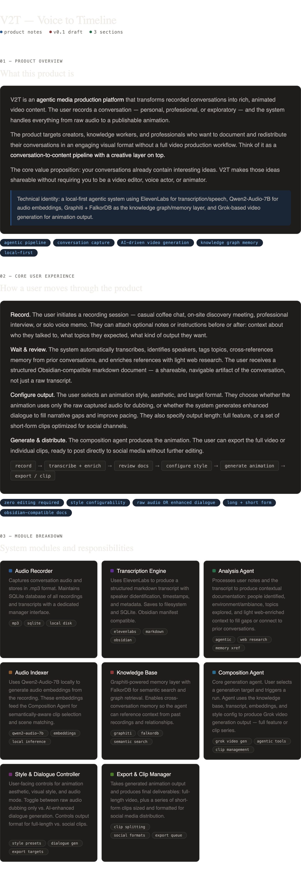

# V2 animination V2T

An agentic application which takes a recording of a convesation and generates & clips the video and produces animate conversations based on what the conversations domain was.

## Required Capabilities:

### Audio Recording

- stores audio in .mp3 format on disk.
- maintains a SQLite database of all of the audio recordings and audio transcripts with a accompanying manager

### Audio Transcription

- Uses [elevanlabs.io](http://elevanlabs.io)
- save audio transcription to disk along with accompanying metadata in the local sqlite database
- obsidian compatible [https://docs.obsidian.md/Reference/Manifest](https://docs.obsidian.md/Reference/Manifest) stores of the audio transacript

## Audio Indexing

- uses  [Qwen2-Audio-7B](https://huggingface.co/Qwen/Qwen2-Audio-7B) locally to generate an embedding. This will be used later by the Composition Agent
- Stores that audio on disk

uses [Elevan Labs](https://elevenlabs.io/docs/eleven-agents/overview/llms.txt) Audio Transactription to produce a `markdown` document () containing the audio transcript. saves it to file system in a dedicated folder. Locally it run'  

### Composition Agent

- When the user selects a generation target (accompanying set of tools, context and data) and clicks a run button An Agent uses tools and knowledge base to generate a grok [video generation](https://docs.x.ai/llms.txt) of a portion or clips of the audio transcription

### Composition Tools

- [graphiti](https://help.getzep.com/llms.txt) (same as graphiti-memory tool), aka knowledge base with semantic search. with [falkordb](https://docs.falkordb.com/llms)

