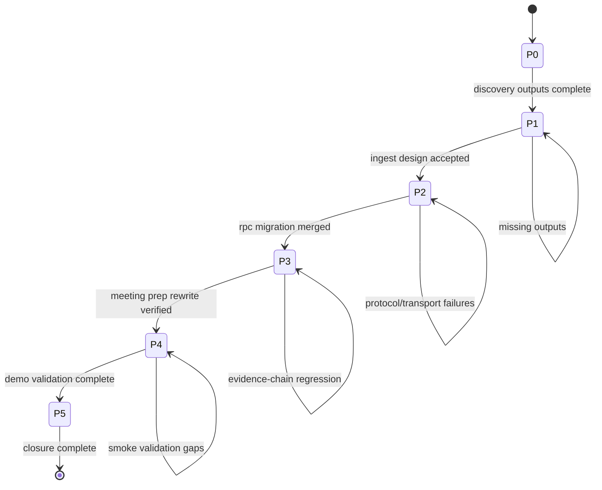

# Master Orchestration: Enron Knowledge Demo Integration

> Full execution workflow, transition guards, quality gates, and recovery paths for replacing `knowledge-demo` mocks with real Enron-backed data.

---

## Spec Complexity

### Complexity Formula

`(Phases × 2) + (Agents × 3) + (CrossPkg × 4) + (ExtDeps × 3) + (Uncertainty × 5) + (Research × 2)`

### Inputs

- Phases: `6`
- Agents: `5` (`codebase-researcher`, `spec-reviewer`, `doc-writer`, `test-writer`, `package-error-fixer`)
- CrossPkg: `4` (`@beep/todox`, `@beep/server`, `@beep/runtime-server`, `@beep/knowledge-server`)
- ExtDeps: `2` (LLM provider + curated S3 dataset)
- Uncertainty: `3`
- Research: `3`

### Score

`(6×2) + (5×3) + (4×4) + (2×3) + (3×5) + (3×2) = 70`

**Classification**: `Critical`

### Structural Requirements For This Spec

- Required docs:
  - `README.md`
  - `REFLECTION_LOG.md`
  - `QUICK_START.md`
  - `MASTER_ORCHESTRATION.md`
  - `AGENT_PROMPTS.md`
  - `RUBRICS.md`
- Required directories:
  - `outputs/`
  - `handoffs/`
  - `templates/`
- Required dual handoff chain:
  - `HANDOFF_P1.md` + `P1_ORCHESTRATOR_PROMPT.md`
  - `HANDOFF_P2.md` + `P2_ORCHESTRATOR_PROMPT.md`
  - `HANDOFF_P3.md` + `P3_ORCHESTRATOR_PROMPT.md`
  - `HANDOFF_P4.md` + `P4_ORCHESTRATOR_PROMPT.md`
  - `HANDOFF_P5.md` + `P5_ORCHESTRATOR_PROMPT.md`

---

## Locked Product Decisions

1. Curated Enron scenarios only
2. Multi-scenario support in demo
3. Explicit ingest action per scenario (`Ingest Scenario`)
4. Extraction scope is full thread with deterministic cap (`maxDocumentsPerScenario = 25`)
5. Org-scoped persistence by default (RLS alignment)
6. Meeting prep handler rewritten to LLM synthesis
7. Internal feature gate: `ENABLE_ENRON_KNOWLEDGE_DEMO`
8. Transport path/serialization: `/v1/knowledge/rpc` + NDJSON

Any change to these decisions requires updating:

- `README.md`
- `outputs/current-vs-target-matrix.md`
- active handoff for current phase

---

## State Machine



---

## Phase Plan

## P0: Scaffolding

### Objective

Create and align spec skeleton to critical-spec standards.

### Required Outputs

- `README.md`
- `QUICK_START.md`
- `MASTER_ORCHESTRATION.md`
- `AGENT_PROMPTS.md`
- `RUBRICS.md`
- `REFLECTION_LOG.md`
- `handoffs/HANDOFF_P1.md`
- `handoffs/P1_ORCHESTRATOR_PROMPT.md`

### Exit Guard

- Spec-review pass exists and all structural files present.

## P1: Discovery & Design

### Objective

Map current mock paths to real RPC paths and define deterministic scenario + ingest flow.

### Required Outputs

- `outputs/codebase-context.md`
- `outputs/current-vs-target-matrix.md`
- `outputs/scenario-catalog.md`
- `outputs/ingestion-flow.md`

### Exit Guard

- Mock replacement points are explicit.
- Runtime RPC mapping includes protocol details.
- Scenario ordering and cap rules documented.

## P2: RPC Client Migration

### Objective

Replace mock action/data path with Atom RPC client calls and ingestion lifecycle state.

### Required Outputs

- `outputs/rpc-client-migration.md`
- `outputs/ingest-status-contract.md`

### Exit Guard

- `knowledge-demo` default path is no longer mock-driven.
- Batch start/status path works from UI.

## P3: Meeting Prep Rewrite

### Objective

Rewrite `meetingprep_generate` to synthesize meaningful LLM bullets while preserving evidence persistence.

### Required Outputs

- `outputs/meeting-prep-rewrite-notes.md`
- `outputs/evidence-chain-regression-check.md`

### Exit Guard

- Bullets are not relation-ID template strings.
- Evidence links remain resolvable by `Evidence.List`.

## P4: Demo Validation

### Objective

Validate complete internal demo flow over multiple curated scenarios.

### Required Outputs

- `outputs/demo-validation.md`
- `outputs/demo-risks.md`

### Exit Guard

- Deterministic smoke flow passed.
- Gating behavior validated (`ENABLE_ENRON_KNOWLEDGE_DEMO`).

## P5: Closure

### Objective

Produce closure handoff, final reflections, and ready status check.

### Required Outputs

- `handoffs/HANDOFF_COMPLETE.md`
- `handoffs/COMPLETE_ORCHESTRATOR_PROMPT.md`

### Exit Guard

- Required package checks/tests pass.
- Reflection sections complete and concrete.

---

## Transition Guards (Detailed)

### P0 -> P1

- All required top-level spec files present
- `handoffs/` contains P1 pair
- Initial reflection entry added

### P1 -> P2

- `outputs/codebase-context.md` includes protocol + endpoint details
- `outputs/current-vs-target-matrix.md` includes explicit mock removal map
- `outputs/scenario-catalog.md` has deterministic ordering and rationale
- `outputs/ingestion-flow.md` includes retry/idempotency rules

### P2 -> P3

- Atom RPC client uses NDJSON serialization with `/v1/knowledge/rpc`
- Ingest action transitions through visible batch states
- Scenario switching does not reset persisted org data unexpectedly

### P3 -> P4

- `meetingprep_generate` uses LLM-backed synthesis path
- Handler has deterministic fallback for recoverable failures
- Evidence persistence and retrieval invariants pass

### P4 -> P5

- Multi-scenario demo run documented
- Feature flag internal-gate tested on and off
- Known risks documented with prioritized remediation

### P5 -> COMPLETE

- Verification command log captured
- Remaining deferred items separated from core done scope
- Spec status transition prepared (`pending -> completed`)

---

## Delegation Plan

### Orchestrator Responsibilities

- Keep phase boundaries strict
- Validate outputs and guards
- Run verification commands
- Maintain reflection and handoff continuity

### Sub-agent Responsibilities

- `codebase-researcher`: discovery scans and dependency maps
- `spec-reviewer`: rubric scoring and structural quality checks
- `doc-writer`: orchestration docs/handoffs/rubrics
- `test-writer`: missing deterministic tests
- `package-error-fixer`: package-scoped type/build/test fixes

### Delegation Evidence Requirement

Every phase with delegated work must append an entry to:

- `outputs/delegation-log.md`

Entry fields:

- date
- agent
- task
- files analyzed
- artifact output
- acceptance status

---

## Context Budget Controls

### Per-Handoff Budget

- Working: `<= 2000` tokens
- Episodic: `<= 1000` tokens
- Semantic: `<= 500` tokens
- Procedural: links only
- Total target: `<= 4000` tokens

### Enforcement

- Each `HANDOFF_P*.md` must include a context budget audit table.
- If any handoff exceeds budget, split into checkpoint handoff and carry forward minimal deltas.

---

## Quality Gates

Run for all touched packages in each implementation phase:

```bash
bun run check --filter @beep/todox
bun run test --filter @beep/todox
bun run check --filter @beep/server
bun run test --filter @beep/server
bun run check --filter @beep/runtime-server
bun run test --filter @beep/runtime-server
bun run check --filter @beep/knowledge-server
bun run test --filter @beep/knowledge-server
```

Also execute deterministic smoke validation and capture output in:

- `outputs/demo-validation.md`

---

## Risk Register

| Risk | Impact | Mitigation | Owner |
|---|---|---|---|
| RPC path mismatch | Non-functional demo | enforce `/v1/knowledge/rpc` in client constructor tests | P2 |
| Serialization mismatch | silent request failure | enforce NDJSON config and connection smoke | P2 |
| meeting prep regression | unusable bullet output | add evidence-backed synthesis assertions | P3 |
| ingestion duplication | noisy data + confusion | disallow duplicate active batch per scenario | P2 |
| long extraction UX | perceived failure | explicit lifecycle states + retry | P2/P4 |
| missing feature gate | accidental exposure | route-level gate check + test | P4 |

---

## Recovery Procedures

## Recovery A: Failed Check/Test

1. Capture failing command and first actionable error
2. Delegate package-local fixes
3. Re-run only failing package first
4. Re-run full touched-package gate set

## Recovery B: RPC Integration Failure

1. Validate websocket path
2. Validate serialization layer
3. Validate auth/org context in request payload
4. Validate server layer merge in `runtime/server`

## Recovery C: Meeting Prep Quality Regression

1. Check synthesis prompt + evidence selection logic
2. Check bullet persistence still writes linked evidence rows
3. Run evidence-resolution regression checks
4. Capture mismatch modes and patch deterministically

---

## Definition of Done

All conditions must be true:

- Success criteria in `README.md` are checked off with evidence
- `RUBRICS.md` phase-level rubrics pass threshold
- Latest spec review report is `>= 5.0/5`
- Reflection entries are concrete for completed phases
- Dual handoff chain exists through active phase
- Verification gate commands pass for touched packages

---

## Artifacts Index

### Core

- `README.md`
- `QUICK_START.md`
- `MASTER_ORCHESTRATION.md`
- `AGENT_PROMPTS.md`
- `RUBRICS.md`
- `REFLECTION_LOG.md`

### Outputs

- `outputs/codebase-context.md`
- `outputs/current-vs-target-matrix.md`
- `outputs/scenario-catalog.md`
- `outputs/ingestion-flow.md`
- `outputs/delegation-log.md`
- `outputs/spec-review-pass-1.md`
- `outputs/spec-review.md` (latest)

### Handoffs

- P1-P5 dual handoff files
- closure pair at end
