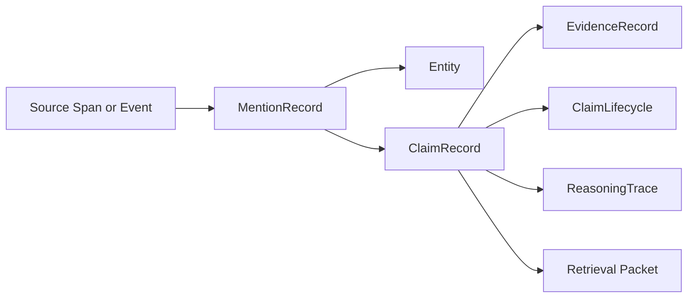

# Claims and Evidence

## Thesis
If the expert-memory vision needs one central durable abstraction, it is probably not the raw node, edge, or embedding. It is the `claim` plus its `evidence`. That pair is what allows the system to preserve disagreement, explain answers, survive temporal change, and stay useful outside code.

## Current Repo Reality
The current repo-codegraph documents already lean toward claim-oriented architecture in the semantic integration work. The older `knowledge` slice makes this much more concrete:
- [MentionRecord.model.ts](../../../.repos/beep-effect/packages/knowledge/domain/src/entities/MentionRecord/MentionRecord.model.ts)
- [RelationEvidence.model.ts](../../../.repos/beep-effect/packages/knowledge/domain/src/entities/RelationEvidence/RelationEvidence.model.ts)
- [CitationValidator.ts](../../../.repos/beep-effect/packages/knowledge/server/src/GraphRAG/CitationValidator.ts)
- [ReasoningTraceFormatter.ts](../../../.repos/beep-effect/packages/knowledge/server/src/GraphRAG/ReasoningTraceFormatter.ts)
- [ProvenanceEmitter.ts](../../../.repos/beep-effect/packages/knowledge/server/src/Rdf/ProvenanceEmitter.ts)
- [Architectural Decisions MVP](../../../.repos/beep-effect/packages/knowledge/_docs/mvp/ARCHITECTURAL_DECISIONS_MVP.md)

Those artifacts show an important direction:
- preserve mention records, not just resolved entities
- preserve evidence spans, not just extracted relations
- attach provenance and validation traces to answer-time reasoning
- favor claim-style modeling over flattening everything into direct triples

## Strongly Supported Pattern
A healthy expert-memory system distinguishes at least these objects:
- `MentionRecord`: what the extraction system saw in a source span
- `Entity`: a normalized or canonicalized thing the system believes exists
- `ClaimRecord`: an assertion about state, relation, or norm
- `EvidenceRecord`: the support attached to a claim
- `InferenceTrace`: optional derivation trail when a claim or answer depends on reasoning

## Exploratory Direction
The future system should likely center on `ClaimRecord` as the bridge between deterministic structure and retrieval packets.

That would let the system represent:
- direct extractions
- human curation
- inferred facts
- contested claims
- superseded claims
- answer-time validations

without pretending they all have the same epistemic status.

## Why Raw Edges Are Not Enough
A plain edge says:
- `A -> depends_on -> B`

A claim says:
- this relation was asserted by extraction run `R`
- from source `S`
- using evidence span `E`
- at confidence `C`
- with current lifecycle state `accepted`
- and was later superseded by claim `R2`

That extra structure is what makes expert memory possible.

## A Practical Record Family
| Record | Purpose |
|---|---|
| `MentionRecord` | preserve the original extraction surface and context |
| `ClaimRecord` | preserve the normalized assertion the system is making |
| `EvidenceRecord` | preserve where the support came from and how exact it is |
| `ReasoningTrace` | preserve why a non-direct conclusion was allowed |
| `ClaimLifecycle` | preserve whether the claim is candidate, accepted, contested, or superseded |

## A Simple Relationship Model

## What The Older Knowledge Slice Got Right
### Mention records as durable evidence ingress
The older mention model stored:
- extraction ID
- document ID
- chunk index
- raw extracted text
- mention type
- confidence
- response hash
- extraction timestamp
- optional resolved entity ID

That is a strong pattern because it preserves the original extraction surface even after entity resolution changes.

### Relation evidence as evidence-of-record
The relation evidence model stored:
- relation ID
- document ID and document version ID
- start and end offsets
- display text
- confidence
- extraction linkage

That is exactly the kind of evidence pinning expert systems need.

### Citation validation as answer-time claim checking
The older GraphRAG path did not stop at retrieval. It attempted to validate citations and reasoning before presenting an answer. That is a much stronger direction than typical RAG patterns.

### Reasoning traces as evidence of reasoning
The older slice also treated reasoning traces as structured output rather than debug text.

That matters because an inferred answer should be able to show:
- which rule or policy profile was used
- which supporting premises were involved
- how deep the inference chain was
- why inferred confidence is lower than directly observed evidence

## Claim Nodes Versus Flat Triples
The older MVP decision doc explicitly chose claim-style modeling over RDF-star for a conflict-heavy news domain.

That is an important idea to keep alive.

Claim-style modeling is stronger when you need:
- multiple competing assertions about the same subject and predicate
- rank or preferred-state semantics
- supersession chains
- source-specific disagreement
- rich temporal metadata

It is heavier than flat triples, but the extra weight often buys exactly the properties expert memory needs.

## Ranking And Conflict
Claims should be allowed to coexist even when they disagree.

Useful fields include:
- `rank` or priority
- `confidence`
- `sourceAuthority`
- `statedIn`
- `assertedAt`
- `derivedAt`
- `supersedes`
- `supersededBy`

This allows the system to say:
- these two claims conflict
- this one is currently preferred
- here is the evidence for each
- here is the correction chain

## Why This Transfers Beyond Code
### Code
- direct call edges are not enough for design intent or architectural meaning
- doc claims can be stale or contested
- AI answers need the evidence path back to symbols and files

### Law
- courts and sources often disagree or refine each other
- claims need authority, effective dates, and supersession semantics
- evidence spans and citations are mandatory

### Wealth
- alerts and rule breaches need exact supporting records
- calculated claims should expose derivation and assumptions
- entity identity can shift over time, but claims should remain auditable

## Retrieval Implications
A retrieval packet should usually include:
- the claim itself
- evidence summary
- provenance summary
- temporal posture
- current lifecycle state
- reasoning trace if the answer depends on inference
- validation posture if the answer depends on citation or graph checks

That makes the claim record a much more useful retrieval unit than a bare graph edge.

## Questions Worth Keeping Open
- Should claim records be first-class nodes, typed documents, or a hybrid over edges plus metadata?
- How much evidence detail should be required for a claim to enter the trusted retrieval surface?
- When should reasoning traces be attached to the claim versus only to the retrieval packet?
- Which domains most strongly justify ranked and superseding claims from day one?
