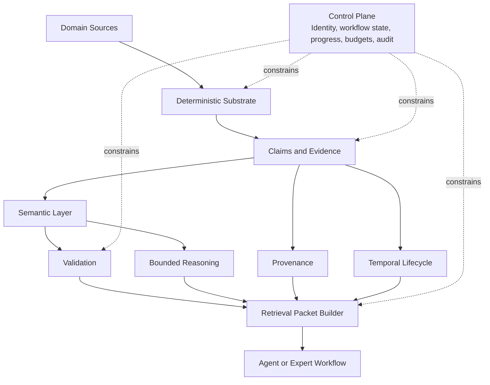

# Expert Memory Kernel

## Thesis
The reusable asset behind the repo-codegraph exploration is an `expert-memory kernel`: a layered architecture that turns raw source material into bounded, evidence-bearing, temporally aware retrieval packets. The kernel matters more than any single parser, database, or domain ontology, but the kernel is only half the story. A serious expert-memory system also needs a control plane that keeps that kernel trustworthy in execution.

## Current Repo Reality
The current repo already points at most of the kernel shape:
- deterministic extraction and certainty tiers in [Repo Codegraph Overview](../repo-codegraph-jsdoc/OVERVIEW.md)
- semantic overlay, validation, provenance, and temporal concerns in [Semantic KG Integration Explained](../repo-codegraph-jsdoc/OVERVIEW_SEMANTIC_KG_INTEGRATION_EXPLAINED.md)
- domain transfer pressure in [IP Law Knowledge Graph](../ip-law-knowledge-graph/README.md)

The older `knowledge` slice adds the missing operational lesson:
- [Knowledge System Architecture](../../../.repos/beep-effect/packages/knowledge/_docs/architecture/system-architecture.md)
- [Progress Streaming Summary](../../../.repos/beep-effect/packages/knowledge/_docs/PROGRESS_STREAMING_SUMMARY.md)
- [LLM Control Strategy Summary](../../../.repos/beep-effect/packages/knowledge/_docs/LLM_CONTROL_STRATEGY_SUMMARY.md)
- [Idempotency Overview](../../../.repos/beep-effect/packages/knowledge/_docs/README-IDEMPOTENCY.md)
- [GraphRAGService.ts](../../../.repos/beep-effect/packages/knowledge/server/src/GraphRAG/GraphRAGService.ts)
- [CitationValidator.ts](../../../.repos/beep-effect/packages/knowledge/server/src/GraphRAG/CitationValidator.ts)
- [ReasoningTraceFormatter.ts](../../../.repos/beep-effect/packages/knowledge/server/src/GraphRAG/ReasoningTraceFormatter.ts)

What is not yet fully unified is the language for describing these pieces as one portable system rather than separate experiments.

## Strongly Supported Pattern
A useful expert-memory system is best understood as two interacting layers:
- `semantic kernel`
- `operational control plane`, sometimes better described as an `epistemic runtime`

### Semantic Kernel
| Component | Purpose | Output |
|---|---|---|
| `Deterministic substrate` | Establish the most mechanically grounded facts available in a domain | entities, links, events, structural references |
| `Claims and evidence` | Normalize assertions and attach support | claims, evidence spans, confidence, source references |
| `Semantic layer` | Interpret claims with controlled vocabulary | types, roles, semantic relations, policy vocabulary |
| `Validation layer` | Bound trust and reject broken or incoherent material | violations, warnings, admissibility state |
| `Reasoning layer` | Derive a safe amount of additional meaning | inferred facts with provenance |
| `Provenance layer` | Preserve lineage and causal traceability | activity, input, derivation, actor, dependency chain |
| `Temporal lifecycle layer` | Model what changed and when | asserted time, observed time, effective time, superseded time |
| `Retrieval packet layer` | Prepare bounded context for use by agents or humans | small, evidence-bearing, query-shaped packets |

### Operational Control Plane
| Component | Purpose | Output |
|---|---|---|
| `Execution identity` | Keep repeated work idempotent and deduplicated | stable run identity, repeat-safe behavior |
| `Workflow state` | Track durable execution state separately from semantic content | status, resumability, external visibility |
| `Progress and partial results` | Expose long-running work safely to users and clients | event streams, partial artifacts, backpressure policy |
| `Budget and resilience` | Control model cost, latency, retries, and failure posture | token budgets, timeouts, breaker state, retry policy |
| `Audit and replay` | Preserve what the system did, not just what it concluded | run logs, event histories, replayable diagnostics |

The name matters less than the role. This part of the architecture is what makes the kernel reproducible, inspectable, and safe to consume under real execution pressure.

## Exploratory Direction
The likely durable platform boundary is:
- one semantic kernel
- one operational control plane
- many deterministic front doors
- many domain ontologies
- many product-facing retrieval workflows

In that model, code, law, wealth, and compliance are different adapters over a shared trust architecture.

That trust architecture should be able to surface both:
- durable semantic state
- run-specific answer quality signals such as citation validation, partial-result posture, and reasoning traces

## Kernel Diagram

## Component Notes
### 1. Deterministic Substrate
This is the base trust surface.

In code it includes:
- AST structure
- symbols
- imports and references
- type-checker results
- JSDoc structure

In law it might include:
- document sections
- citations
- court, party, and statute references
- filing metadata

In wealth it might include:
- account records
- instrument identifiers
- position snapshots
- transaction events
- policy and mandate documents

The substrate is not the whole truth. It is the best mechanically grounded starting point.

### 2. Claims and Evidence
This layer matters more outside code, but it is useful in code too.

A claim is the unit that says:
- `X depends on Y`
- `Module A handles authentication`
- `Provision P governs Right R`
- `Account K exceeded policy threshold T`

A claim is only useful if it carries evidence. Evidence may be:
- a code span
- a doc citation
- a filing event
- a transaction record
- a reasoning derivation

This is the layer most likely to become the central durable abstraction of the system.

### 3. Semantic Layer
This is where raw graph structure becomes consistent meaning.

The ontology layer should answer:
- what kinds of things exist?
- what kinds of relationships are valid?
- which roles or norms matter in this domain?
- what vocabulary should retrieval and reasoning share?

### 4. Validation Layer
Validation is the trust governor.

Its job is not merely schema correctness. It should also catch:
- unsupported inferences
- impossible combinations
- missing required evidence
- broken domain rules
- stale or superseded assertions being treated as current

### 5. Reasoning Layer
Reasoning is useful when it is bounded and explainable.

Good uses:
- subclass closure
- inverse property support
- domain and range implications
- carefully guarded alias resolution
- policy inferences with explicit provenance

Bad uses:
- unbounded closure
- identity explosion
- opaque materialization
- replacing deterministic facts with inferred ones

### 6. Provenance Layer
Provenance answers `why is this here?`

This is essential for AI-facing systems because the system must be able to explain:
- which source introduced a claim
- which model or rule produced an interpretation
- which inputs were used
- which prior claims a derived claim depends on

### 7. Temporal Lifecycle Layer
The system should not act as though there is one timeless graph.

Most expert domains require the ability to ask:
- what was true then?
- what do we currently believe?
- when did this claim become effective?
- when was it corrected or superseded?

### 8. Retrieval Packet Layer
The kernel does not end at storage. It ends at consumption.

The main deliverable for AI systems is usually not a raw graph query result. It is a retrieval packet with:
- the right granularity
- the right certainty mix
- the right evidence attached
- the right token budget
- the right temporal scope

### 9. Why The Control Plane Belongs In The Architecture
The older `knowledge` slice is useful because it shows that semantic quality alone is not enough. The system also needed:
- durable workflow state
- progress event contracts
- LLM timeouts, budgets, and rate limits
- idempotent execution identity
- grounded-answer verification and inspectable reasoning traces
- audit trails and partial-result semantics

That is why the control plane deserves first-class treatment instead of being treated as mere plumbing.

## Domain-Invariant Versus Domain-Specific
| Layer | Domain-Invariant | Domain-Specific |
|---|---|---|
| Deterministic substrate | need for mechanically grounded extraction | parser, schema, record system, event model |
| Claims and evidence | need for normalized assertions and support | claim shapes and evidence types |
| Semantic layer | controlled vocabulary and relation semantics | ontology content and policy vocabulary |
| Validation | bounded admissibility checks | domain constraints and trust thresholds |
| Reasoning | bounded inference with provenance | profiles, allowed rules, materialization policy |
| Provenance | activity, source, derivation lineage | agent types, workflow steps, audit obligations |
| Temporal lifecycle | multi-time semantics | legal effective dates, market timestamps, code revision semantics |
| Retrieval packets | bounded context for downstream use | packet templates, user personas, product workflows |
| Control plane | identity, progress, budgets, audit discipline | provider limits, workflow shape, transport, product SLOs |

## Running Example Across Domains
| Domain | Deterministic fact | Claim | Evidence | Retrieval need |
|---|---|---|---|---|
| Code | function `foo` imports `bar` | `foo` depends on external service logic | import line, call site, file path | explain impact of changing `bar` |
| Law | judgment cites statute section | a court interpretation narrows a right | citation span, court metadata, date | explain current legal position and precedent chain |
| Wealth | portfolio holds instrument `X` | account violates concentration policy | position snapshot, policy doc, calculation trace | explain why an alert fired and whether it is still current |

## Design Posture
The system should be designed with these biases:
- deterministic-first
- provenance-always
- temporal-by-default
- reasoning-bounded
- retrieval-oriented
- control-plane-aware
- grounded-answer aware
- domain-adaptable

## Questions Worth Keeping Open
- Should `ClaimRecord` be the primary durable abstraction above deterministic nodes and edges?
- Which parts of the semantic kernel should remain pure data model and which should depend on runtime policy?
- How much of the temporal model should be mandatory for every claim versus optional by domain?
- Which inferred facts should remain ephemeral and which, if any, should be materialized?
- What is the smallest retrieval packet that still preserves expert trust?
