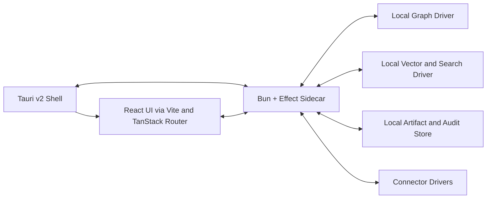

# Local-First V0 Architecture

## Thesis
The best `v0` product shape for this work is a `local-first native application` built as a `thin Tauri shell` around a `Bun + Effect sidecar runtime`.

This is not a cosmetic packaging decision. It is the cleanest way to preserve the architecture already established in this folder:
- deterministic-first extraction
- claim/evidence/provenance/time as first-class concerns
- a control plane or `epistemic runtime`
- a stable semantic kernel above storage
- a driver boundary around graph and retrieval infrastructure

The sidecar is the real application. The native shell is there to provide OS integration, process lifecycle, packaging, and user-facing ergonomics.

## Current Repo Reality
Three lines of work now point in the same direction:
- the expert-memory docs in this folder argue for a stable semantic kernel plus control plane instead of a graph-only product
- the repo-codegraph work is converging on a deterministic proving ground for that architecture
- the saved Claude discussion at `/home/elpresidank/Downloads/What is Tauri _ Claude.html` explicitly explored a desktop client/server pattern and later proposed `Tauri v2 shell + Bun sidecar process`

That alignment matters. It means the local-first sidecar path is not a random stack preference. It fits both the product direction and the architectural discipline already established.

## Strongly Supported Pattern
The preferred `v0` stack is:
- `Tauri v2` for the native shell
- `Bun` for the local sidecar executable
- `Effect` for the runtime, orchestration, and service boundaries
- `React + Vite + TanStack Router` for the frontend
- a `graph driver boundary` so graph-store choice stays below the semantic kernel
- a `local-first` deployment posture with a future path to hosted/server execution

This choice deliberately avoids three traps:
- making Rust the center of the product
- making Next.js server semantics the center of the product
- binding the architecture too tightly to one graph database too early

## Exploratory Direction
The long-term system may eventually support:
- a hosted server mode
- browser and mobile clients
- synchronized expert memory across devices or teams
- domain adapters beyond code, such as law or wealth

But `v0` should not optimize for all of that at once.

`v0` should optimize for one thing: proving that a local-first expert-memory runtime can ingest, reason over, and serve grounded answers from a user's machine with acceptable trust, latency, and operational simplicity.

## Why Local-First Comes First
This product direction is a better fit for local-first than cloud-first for several reasons.

### 1. Data gravity
The eventual applications are likely to deal with:
- sensitive files
- private notes
- local repos
- proprietary documents
- agent state that users do not want to immediately ship to a hosted service

A local sidecar respects that data gravity.

### 2. Trust posture
For code, legal, and wealth-style domains, users care about:
- where the data lives
- what was indexed
- what evidence supported an answer
- what changed over time
- whether the system can still work when connectivity is degraded

A local runtime gives a stronger story here than a thin remote wrapper.

### 3. Runtime control
The control plane described elsewhere in this folder needs real ownership over:
- process lifecycle
- retries
- side effects
- progress streaming
- local caches
- indexing pipelines
- connector health
- audit artifacts

That work belongs in a sidecar runtime more naturally than in a browser tab.

### 4. Future optionality
A local-first runtime with a clean protocol boundary can later be moved or mirrored into a remote deployment. A cloud-first design often makes it harder to recover true local semantics later.

## Core Decision
Use this shape for `v0`:

Interpretation:
- `Tauri v2 Shell`: OS integration, packaging, app windows, native menus, permissions, sidecar launch
- `Bun + Effect Sidecar`: the actual application runtime and orchestration boundary
- `React UI`: a client of the sidecar, not an independent backend
- `Graph / vector / artifacts / connectors`: all infrastructure behind typed runtime services and drivers

## Shell Versus Sidecar Boundary
This boundary should stay crisp.

### Tauri shell responsibilities
The shell should own:
- window creation and native menus
- application install/update lifecycle
- launching and stopping the sidecar
- OS capability configuration
- minimal native glue for file dialogs, notifications, tray, deep links, and similar concerns
- transport bootstrapping between UI and sidecar

The shell should not own:
- business logic
- graph semantics
- retrieval logic
- indexing logic
- claim/evidence modeling
- agent orchestration
- connector state machines

### Bun sidecar responsibilities
The sidecar should own:
- expert-memory semantic kernel
- control plane / epistemic runtime
- deterministic extraction pipelines
- indexing and invalidation
- claim/evidence/provenance/temporal modeling
- retrieval packet construction
- grounded-answer validation posture
- connector lifecycle
- graph, vector, and artifact driver orchestration
- sync later, if it exists

The sidecar is where the architecture in this folder actually lives.

## Frontend Choice
For `v0`, the frontend default should be:
- `React`
- `Vite`
- `TanStack Router`

### Why this is the right default
- It is simple and fast.
- It does not force fake server semantics into a desktop app.
- It lets the sidecar remain the one real backend.
- It keeps the UI layer focused on routing, state, views, and streamed responses.

### Why not full-stack Next.js for v0
If the Bun sidecar is already the real backend, full-stack Next.js introduces the wrong abstraction center.

There are only two honest ways to use Next.js here:
- `static export`, where Next is mostly acting as a frontend build/routing layer
- `real local server`, where Next itself becomes another backend runtime

The first is acceptable but not especially compelling if Vite already solves the problem.
The second duplicates the role that the Bun sidecar should own.

That is why `v0` should not be centered on full-stack Next.js.

### Why not TanStack Start for v0
TanStack Start is closer to the right worldview than Next.js, but for `v0` it is still more framework than is strictly necessary.

The project already has enough complexity in:
- the sidecar runtime
- storage drivers
- expert-memory semantics
- local-first operational behavior

Using `Vite + TanStack Router` keeps the frontend honest and lightweight while preserving a good routing and state model.

## Rust Posture
Minimal Rust is realistic. Zero Rust is not.

That is an important distinction.

The goal is not to avoid Rust absolutely. The goal is to keep Rust confined to:
- Tauri setup
- sidecar packaging and launch
- capabilities and permissions
- a thin OS glue layer

All domain and runtime complexity should stay in TypeScript.

## Transport Strategy
The transport between UI and sidecar should be chosen for operational clarity, not novelty.

Recommended `v0` posture:
- the shell launches the sidecar
- the frontend talks to the sidecar through one stable local transport
- the transport protocol is fully owned by the sidecar boundary

There are several viable transport choices:
- local HTTP on an ephemeral localhost port
- local WebSocket for streaming-heavy paths
- stdio or process IPC for tighter process coupling
- Tauri event/command bridging for narrow shell-level interactions

The most important rule is not which transport wins first.
The most important rule is that the sidecar is the stable service boundary and the shell is not allowed to absorb application semantics.

## Graph And Storage Boundary
The expert-memory architecture should sit above storage.

That means the sidecar should depend on interfaces such as:
- `GraphStoreDriver`
- `SearchDriver`
- `VectorDriver`
- `ArtifactStore`
- `ConnectorRuntime`

The semantic kernel should not know whether the graph driver is backed by:
- FalkorDB
- Neo4j
- a simpler local-first graph substrate
- some hybrid local store

For `v0`, storage should be treated as replaceable below the runtime boundary.

## Recommended V0 Deployment Shape
The cleanest initial deployment model is:
- `desktop shell`: Tauri app users install
- `sidecar runtime`: packaged Bun executable launched by the shell
- `local storage`: graph/search/artifact stores on the user's machine
- `LLM access`: configurable provider clients called by the sidecar
- `sync`: absent or optional in `v0`

This is local-first, but not local-only forever.

## Future Expansion Path
If `v0` works, the next shape should not require semantic reinvention.

The same runtime boundary should later support:
- `apps/desktop`: Tauri shell + sidecar
- `apps/server`: hosted version of the sidecar runtime
- `apps/web`: browser client talking to hosted runtime
- `apps/mobile`: mobile shell or companion talking to hosted or synced runtime

That is the real value of keeping the sidecar as the product core.

## Concrete V0 Spec
The concrete greenfield implementation spec for this direction now lives at:
- [Repo Expert-Memory Local-First V0](/home/elpresidank/YeeBois/projects/beep-effect3/specs/pending/repo-expert-memory-local-first-v0/README.md)

Use that folder when the discussion shifts from architecture thesis to implementation planning for the first runnable prototype.

## V0 Package Direction
A plausible future package split in this repo would be:
- `apps/desktop`: Tauri shell
- `packages/runtime-expert-memory`: sidecar runtime composition root
- `packages/runtime-protocol`: request/response and streaming contracts
- `packages/expert-memory-domain`: claims, evidence, provenance, temporal lifecycle, retrieval packet types
- `packages/expert-memory-server`: ingestion, retrieval, orchestration services
- `packages/expert-memory-drivers-*`: graph/search/vector/artifact adapters
- `packages/expert-memory-ui`: UI-specific client bindings if needed

This is a direction, not a locked implementation plan.
The important part is the boundary shape, not the exact package names.

## What V0 Should Prove
`v0` should prove all of the following:
- a native shell can package and run the sidecar reliably
- the sidecar can index local sources deterministically
- claim/evidence/provenance/time can be preserved in local storage
- retrieval packets can be built locally and support grounded answers
- the frontend can stay thin without losing usability
- the system can evolve toward hosted or synchronized modes later without semantic breakage

## What V0 Should Explicitly Not Try To Prove
`v0` should not try to prove:
- full cloud collaboration
- multi-device sync perfection
- multi-domain ontology completeness
- broad semantic-web sophistication
- full browser/server parity
- every graph-store option at once

Those are later concerns.

## Recommended Defaults
Unless new evidence changes them, the default `v0` choices should be:
- shell: `Tauri v2`
- runtime: `Bun + Effect`
- frontend: `React + Vite + TanStack Router`
- backend center of gravity: `sidecar`, not frontend framework
- graph posture: `driver boundary`
- product posture: `local-first`
- Rust posture: `minimal and contained`

## Questions Worth Keeping Open
- Which local transport is the cleanest first protocol between the UI and the sidecar?
- Which local graph/search combination offers the best v0 simplicity without boxing in later growth?
- How should updates and migrations be handled when local stores evolve across desktop releases?
- Which parts of the sidecar should remain pure local concerns versus eventual sync concerns?
- How much of the runtime protocol should be shared verbatim with a future hosted mode?
