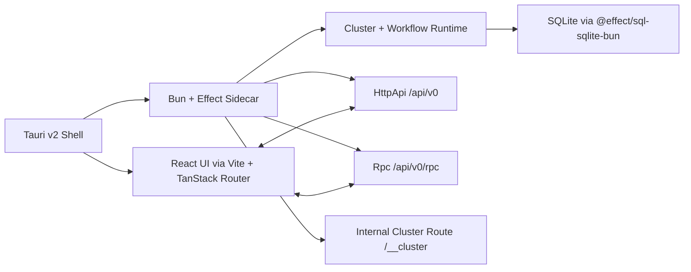

# Local-First V0 Architecture

## Thesis
The best `v0` product shape for this work remains a `local-first native application` built as a `thin Tauri shell` around a `Bun + Effect sidecar runtime`.
This document preserves the rationale for that shape. Normative repo-specific `v0` runtime, protocol, package, and deliverable details live in [Repo Expert-Memory Local-First V0](../repo-expert-memory-local-first-v0/README.md).

The important refinement is now explicit:
- the sidecar runtime should be `cluster-first`
- `workflow` is the semantic execution model
- `cluster` is the durable runtime substrate
- `HttpApi` is the control plane
- `Rpc` is the execution and streaming plane
- `EventJournal` is the product-level run audit and projection input
- `@effect/sql-sqlite-bun` is the `v0` local SQL provider

## Current Repo Reality
The repo now has a dedicated local-first v0 spec folder:
- [Repo Expert-Memory Local-First V0 README](../repo-expert-memory-local-first-v0/README.md)
- [Cluster-First Substrate Decision](../repo-expert-memory-local-first-v0/CLUSTER_FIRST_SUBSTRATE_DECISION.md)
- [Cluster-First Plan](../repo-expert-memory-local-first-v0/CLUSTER_FIRST_REPO_EXPERT_MEMORY_PLAN.md)
- [HttpApi / Rpc Pivot Note](../repo-expert-memory-local-first-v0/HTTPAPI_RPC_PIVOT.md)

That folder is now the concrete authority for the repo expert-memory `v0` runtime shape.

## Strongly Supported Pattern
The current `v0` stack, summarized from the downstream authority, is:
- `Tauri v2` for the native shell
- `Bun` for the local sidecar executable
- `Effect` for the runtime, orchestration, and service boundaries
- `React + Vite + TanStack Router` for the frontend
- `effect/unstable/cluster` for durable runtime substrate
- `ClusterWorkflowEngine` for run lifecycle
- `HttpApi` for control-plane routes
- `Rpc` for workflow execution and streaming
- `EventJournal` for product-level run audit and projections
- `@effect/sql-sqlite-bun` for local SQL persistence
- driver boundaries around graph/search/vector/artifact infrastructure

Current public execution summary:
- custom start RPCs return `runId` immediately
- explicit run-command RPCs handle interrupt/resume on the stable `runId`
- generated workflow discard RPCs remain internal/supporting because they do not return `runId`

## Why This Is The Right Shape
This architecture preserves the original local-first reasoning while tightening the runtime story:
- local data gravity still matters
- the shell still stays thin
- the sidecar still owns the actual application semantics
- but lifecycle correctness is no longer left to custom ad hoc supervision

That matters because the product thesis depends on:
- durable runs
- clean interruption/resume semantics
- explicit finalizers and shutdown ordering
- inspectable run history
- grounded answers that survive reconnect/restart

## Refined Runtime Diagram

## What This Supersedes
This architecture supersedes:
- the idea of a custom local workflow engine as the preferred `v0` substrate
- the idea that `cluster` is future-only
- the idea that a reduced `HttpApi` rewrite should happen before the substrate redesign
- the idea that `HTTP + SSE` should remain the long-term run execution model

## Exploratory Direction
The long-term system may still expand toward:
- hosted/server mode
- browser and mobile clients
- synchronized expert memory
- domain adapters beyond code

But the `v0` proving ground is now more concrete:
- repo expert memory
- local-first desktop shell
- cluster-backed sidecar
- grounded answer runtime

## Questions Worth Keeping Open
- How much compatibility code should remain while the cluster-first path replaces the temporary handwritten transport?
- When does CPU-bound parsing justify introducing `workers` under the cluster/workflow runtime?
