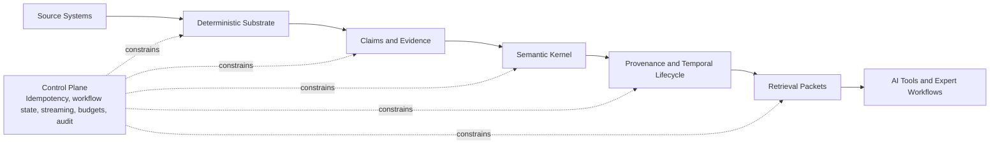

# Expert Memory Big Picture

## Thesis
The repo-codegraph work in this repository is best understood as a proving ground for a broader `expert-memory` architecture. Code is the easiest domain to start with because it offers syntax, references, and feedback loops, but the more durable asset is the trust stack behind the graph: deterministic extraction, claims, evidence, ontology, validation, provenance, temporal lifecycle, bounded retrieval, and the control plane that keeps the whole system reliable.

This folder is a reading set, not a phased implementation spec. Its purpose is to make the larger shape legible before any new package or domain commitment is made.
When repo-specific `v0` runtime, protocol, package, or deliverable details are needed, [Repo Expert-Memory Local-First V0](../repo-expert-memory-local-first-v0/README.md) is the downstream authority and this folder should be treated as rationale only.

## Current Repo Reality
The strongest current anchors live in three places:
- [Repo Codegraph Overview](../repo-codegraph-jsdoc/OVERVIEW.md)
- [Semantic KG Integration Explained](../repo-codegraph-jsdoc/OVERVIEW_SEMANTIC_KG_INTEGRATION_EXPLAINED.md)
- [IP Law Knowledge Graph](../ip-law-knowledge-graph/README.md)

There is also an important historical reference point in the older `knowledge` slice:
- [Knowledge Docs Index](../../../.repos/beep-effect/packages/knowledge/_docs/INDEX.md)
- [Knowledge System Architecture](../../../.repos/beep-effect/packages/knowledge/_docs/architecture/system-architecture.md)

Taken together, those materials already establish several important ideas:
- repo intelligence should be deterministic-first
- JSDoc can act as a structured semantic surface rather than plain text
- ontology, reasoning, validation, and provenance are useful when they are bounded and explainable
- claim and evidence records matter more than raw triples in conflict-heavy domains
- grounded answers, citation validation, and reasoning traces were already being explored in the older slice
- time and contradiction handling are architecture concerns, not polish
- execution control, idempotency, progress, and LLM budgets are part of the product, not implementation noise

## Strongly Supported Pattern
A useful expert-memory system has six durable properties:
- it separates mechanically grounded facts from interpreted claims
- it keeps evidence and provenance attached to what it knows
- it treats time and contradiction as first-class, not cleanup details
- it uses a bounded semantic overlay instead of ontology maximalism
- it produces retrieval packets for AI and expert use rather than exposing raw graph state as the main interface
- it has an operational control plane that keeps extraction, enrichment, and retrieval trustworthy under retries, failures, and budgets

## Exploratory Direction
The likely long-term platform is not `a repo graph` or `a legal graph`. It is a domain-adaptable expert-memory system with three major parts:
- a deterministic and semantic kernel
- a control plane or `epistemic runtime` for execution and trust
- domain adapters for code, law, wealth, compliance, and adjacent expert domains

That system would let you ask the same meta-question in different worlds:
- what do we currently believe?
- why do we believe it?
- what supports it?
- what changed?
- what was true at a given time?
- what is safe to show an AI system right now?

## One-Page Mental Model

Read the diagram from left to right:
- `Source Systems`: code, legal texts, policies, CRM records, market feeds, research notes
- `Deterministic Substrate`: the most mechanically grounded structure available in that domain
- `Claims and Evidence`: normalized assertions attached to spans, references, documents, or events
- `Semantic Kernel`: ontology, validation, bounded reasoning, and claim interpretation
- `Provenance and Temporal Lifecycle`: how facts entered, changed, conflicted, and were superseded
- `Retrieval Packets`: the final consumable context for agents, search, and expert workflows
- `Control Plane`: the execution and trust systems that keep the pipeline sane in production

## Reading Order
1. [EXPERT_MEMORY_KERNEL.md](./EXPERT_MEMORY_KERNEL.md) for the core reusable architecture
2. [CLAIMS_AND_EVIDENCE.md](./CLAIMS_AND_EVIDENCE.md) for the likely central abstraction
3. [EXPERT_MEMORY_CONTROL_PLANE.md](./EXPERT_MEMORY_CONTROL_PLANE.md) for the execution and trust runtime
4. [REPRESENTATION_LAYERS.md](./REPRESENTATION_LAYERS.md) for the graph boundaries
5. [TRUST_TIME_AND_CONFLICT.md](./TRUST_TIME_AND_CONFLICT.md) for the hardest modeling problem
6. [DOMAIN_TRANSFER_MAP.md](./DOMAIN_TRANSFER_MAP.md) for how the model generalizes from code to law and wealth
7. [ONTOLOGY_REASONING_PRAGMATICS.md](./ONTOLOGY_REASONING_PRAGMATICS.md) for the semantic discipline
8. [DATABASE_AND_RUNTIME_CHOICES.md](./DATABASE_AND_RUNTIME_CHOICES.md) for store and runtime implications
9. [LOCAL_FIRST_V0_ARCHITECTURE.md](./LOCAL_FIRST_V0_ARCHITECTURE.md) for the local-first rationale and hand-off to the downstream `v0` authority
10. [RESEARCH_LANES_AND_OPEN_QUESTIONS.md](./RESEARCH_LANES_AND_OPEN_QUESTIONS.md) for practical forward paths

## Folder Guide
| Document | Purpose |
|---|---|
| [EXPERT_MEMORY_KERNEL.md](./EXPERT_MEMORY_KERNEL.md) | Defines the reusable expert-memory kernel and its boundaries |
| [CLAIMS_AND_EVIDENCE.md](./CLAIMS_AND_EVIDENCE.md) | Explains why claim and evidence records are likely the central durable abstraction |
| [EXPERT_MEMORY_CONTROL_PLANE.md](./EXPERT_MEMORY_CONTROL_PLANE.md) | Frames idempotency, workflow state, progress, budgets, and audit as part of the architecture |
| [DOMAIN_TRANSFER_MAP.md](./DOMAIN_TRANSFER_MAP.md) | Shows what transfers from repo intelligence into law, wealth, and compliance |
| [REPRESENTATION_LAYERS.md](./REPRESENTATION_LAYERS.md) | Separates deterministic, semantic, claim, and provenance layers |
| [ONTOLOGY_REASONING_PRAGMATICS.md](./ONTOLOGY_REASONING_PRAGMATICS.md) | Explains a pragmatic semantic-web posture for engineering use |
| [TRUST_TIME_AND_CONFLICT.md](./TRUST_TIME_AND_CONFLICT.md) | Frames time, revision, and contradiction as central system concerns |
| [DATABASE_AND_RUNTIME_CHOICES.md](./DATABASE_AND_RUNTIME_CHOICES.md) | Compares graph store and runtime choices without conflating them with modeling |
| [LOCAL_FIRST_V0_ARCHITECTURE.md](./LOCAL_FIRST_V0_ARCHITECTURE.md) | Explains why local-first native remains the preferred `v0` product shape and points to the downstream repo-specific authority |
| [RESEARCH_LANES_AND_OPEN_QUESTIONS.md](./RESEARCH_LANES_AND_OPEN_QUESTIONS.md) | Organizes the most credible directions for future exploration |

## Working Vocabulary
| Term | Meaning in this folder |
|---|---|
| `Deterministic substrate` | Facts extracted from a source using mechanical rules or strongly bounded parsers |
| `Claim` | A normalized assertion about an entity, relationship, state, or norm |
| `Evidence` | The concrete support attached to a claim: spans, references, records, events, or derivations |
| `Provenance` | The lineage of how a claim entered the system, who or what produced it, and what it depended on |
| `Temporal lifecycle` | The time model for when a claim was observed, asserted, derived, effective, or superseded |
| `Ontology` | The controlled vocabulary and semantic relations used to interpret claims consistently |
| `Retrieval packet` | A bounded, evidence-bearing context bundle prepared for agents or expert workflows |
| `Control plane` | The runtime layer that handles identity, workflow state, progress, resilience, budgets, and audit |
| `Epistemic runtime` | Another name for the control plane when the emphasis is on grounded answers, reproducible runs, and inspectable execution |

## Why Code Comes First
Code is the right first proving ground because it gives you:
- stable identifiers
- explicit references
- syntax trees
- test/build feedback loops
- lower ambiguity than law or finance

That makes it easier to learn the harder reusable lessons:
- evidence normalization
- temporal correctness
- contradiction handling
- retrieval discipline
- ontology scoping
- provenance fidelity
- operational trust boundaries for AI-assisted systems

## How This Folder Relates To Existing Specs
This folder does not replace the repo-codegraph or IP-law materials.

Instead it sits above them as a synthesis layer:
- repo-codegraph provides the strongest current architecture pressure
- IP-law proves that ontology-backed domain transfer is already a live direction
- the older `knowledge` slice shows that execution control, validation, and provenance were already converging into a broader architecture
- this folder explains why those efforts are really parts of the same larger system
- `repo-expert-memory-local-first-v0` owns the concrete repo-specific `v0` runtime and protocol truth, and this folder should not re-lock those details

## Questions Worth Keeping Open
- How much of the future system should be centered on `ClaimRecord` rather than plain node and edge records?
- Where should the boundary sit between the semantic kernel and the operational control plane?
- Which parts of the expert-memory system should be common infrastructure versus domain adapters?
- When does a local-first graph become limiting enough that a service-grade graph should take over?
