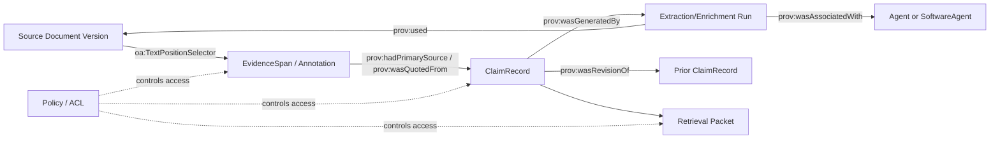

# Assessment of W3C PROV-O for Provenance in an Expert-Memory System

## Executive summary

W3C PROV-O is best understood as the **default “lingua franca” for interoperable provenance on the Web**, not as a complete, domain-specific provenance solution for every problem. PROV-O is a W3C Recommendation and is explicitly positioned as a **lightweight OWL2 ontology** intended to represent, exchange, and integrate provenance across domains, and to be specialized for application needs. citeturn0search1turn7search2

For an “expert-memory” system—where trust depends on **claims + evidence**, where **time and contradiction** are first-class, and where you need **auditable run histories and explainable retrieval packets**—PROV-O is a strong *backbone* for the lineage questions “what generated this?”, “what inputs were used?”, “who/what ran it?”, and “what changed?” because it provides a standard vocabulary around **Entity, Activity, Agent**, and common derivation patterns (e.g., revision, quotation, primary source). citeturn7search2turn10search1

However, PROV-O alone is **not sufficient** to cover the full expert-memory brief:

- It does not natively model **fine-grained evidence spans** (e.g., document offsets) for click-through and highlight; practical systems typically pair PROV with an evidence anchoring model such as the W3C Web Annotation family (e.g., TextPositionSelector), or keep spans in an operational store and link them. citeturn17search2turn17search7  
- It does not provide a complete story for **privacy/access-control policy modeling**; W3C PROV-AQ emphasizes that provenance can leak sensitive information and expects **separate access control mechanisms** (e.g., HTTP auth), and more generally you will want a dedicated policy vocabulary (e.g., ODRL) or resource ACL model (e.g., Web Access Control in the Solid ecosystem) alongside PROV. citeturn14view0turn15search8turn15search4  
- It can be *verbose* at large scale (especially with qualified relations), so for “large-scale event logs” you typically store a compact operational event stream and generate PROV views **per run / per packet / per audit query**, using bundles/named graphs to bound scope. citeturn3search0turn7search2

Bottom line: **PROV-O is a very good default choice** for the provenance *interchange/semantic layer* of expert-memory—especially given your repo’s existing direction—but the “best” architecture is **PROV-O + dedicated evidence anchoring + explicit temporal/lifecycle fields + an access-control layer + bounded projections**.

## Expert-memory requirements and current repo signals

Your expert-memory specs emphasize several requirements that map cleanly to PROV concepts, and several that require augmentation beyond PROV.

**Claims + evidence as the durable unit.** The specs argue that the central durable abstraction is likely a **ClaimRecord plus Evidence**, enabling disagreement, temporal change, and explainable answers. fileciteturn12file16L1-L1

**Layer separation to avoid “edge soup.”** The architecture calls for explicit representation layers: deterministic structure, claim graph, semantic overlay, and provenance/temporal graph—possibly sharing a store but remaining conceptually distinct. fileciteturn12file12L1-L1

**Time and contradiction are first-class.** The system must answer “what did we believe when?” and represent multiple time meanings (observed/published/ingested/asserted/derived/effective/superseded), and avoid destructive overwrite. fileciteturn12file9L1-L1

**Pragmatic semantic-web posture.** The direction is “property graph primary, semantic projection as overlay, validation explicit, reasoning bounded, provenance always attached,” with PROV-O treated as the provenance model—not as academic garnish. fileciteturn12file13L1-L1

**Existing implementation evidence in the repo.** The repo already has a PROV-O-oriented emitter that models extraction activity, agent, document usage, and attaches `prov:wasGeneratedBy` to emitted quads—i.e., a concrete “activity generated these facts” pattern. fileciteturn20file0L1-L1  
It also has an RDF store implemented as an in-process N3.Store, which is operationally convenient but not durable by default. fileciteturn29file1L1-L1  
A repo audit/spec explicitly notes the durability gap (in-memory RDF), plus an evidence-click-through gap (PROV quads link to document/activity, but not to spans/mention IDs). fileciteturn20file3L1-L1

These signals align strongly with the “PROV-O as interchange provenance layer, with bounded projections and stronger evidence/time modeling in the operational layer” approach.

## PROV-O scope, strengths, weaknesses, and ecosystem

PROV is a **family**: PROV-DM (conceptual model), PROV-O (RDF/OWL mapping), PROV-N (human-readable notation), PROV-Constraints (validity/consistency), plus supporting notes (PROV-AQ, PROV-Links, PROV-Dictionary, PROV-DC, PROV-SEM, etc.). citeturn3search0turn5search6turn2search1

### Scope and expressivity

PROV-DM is explicitly **domain-agnostic** and organized around entities, activities, agents, derivations, bundles (provenance-of-provenance), identity links, and collections—designed with extensibility points for domain-specific modeling. citeturn16search3turn3search0

PROV-O is a **lightweight OWL2 ontology** intended for Linked Data and Semantic Web applications, and is designed to be both directly usable and specialized for domain-specific provenance ontologies. It largely conforms to the OWL2 RL profile to support scalable reasoning (with five axioms outside RL due to union-domain/range design choices). citeturn0search1turn7search2

In addition to the basic triad **Entity / Activity / Agent**, PROV-O provides both:
- “starting point” shortcut relations (e.g., `prov:wasGeneratedBy`, `prov:used`, `prov:wasAttributedTo`, `prov:wasDerivedFrom`), and  
- a **qualification pattern** that reifies relations for richer metadata (e.g., qualified usage/generation/derivation/association), allowing roles, times, plans, and other attributes to be attached to “influence” edges. citeturn7search2turn10search8turn10search2

PROV-O also includes named derivation refinements such as `prov:wasRevisionOf`, `prov:wasQuotedFrom`, and `prov:hadPrimarySource`, which are unusually relevant to expert-memory’s needs for corrections, quotations, and primary evidence. citeturn10search1turn7search2

### Tooling, serializations, and ecosystem

PROV defines multiple standard serializations: PROV-O (RDF/OWL), PROV-N (text notation), PROV-XML (XML schema), with additional widely used submissions like PROV-JSON and the more recent PROV-JSONLD. citeturn1search4turn1search0turn4search1turn1search1turn1search6

The W3C PROV Implementation Report documents substantial uptake: PROV-O implemented by “over 40 implementations” and reports multiple validators implementing PROV-Constraints, demonstrating implementability and interchange. citeturn5search6

Practical developer tooling exists in multiple ecosystems:
- ProvToolbox (Java) supports creating and converting PROV between RDF, PROV-XML, PROV-N, and PROV-JSONLD. citeturn11search0  
- The `prov` Python library supports PROV-O (RDF), PROV-XML, PROV-JSON import/export, and graph conversion utilities. citeturn11search1turn11search3

### Interoperability with RDF, OWL, and JSON-LD

PROV-O is explicitly intended for RDF/OWL interoperability and Linked Data publication. citeturn0search1turn7search2

For JSON-LD, two practical routes exist:

- **Direct JSON-LD using PROV context(s)** (common in the wild; not one official “single” context historically).  
- **PROV-JSONLD** (W3C Member Submission 2024) that defines a JSON-LD 1.1 serialization and a semantic mapping to linked data, designed to be “suitable” for interchange and “efficient processing.” citeturn1search6turn7search0

### Scalability and performance considerations

PROV-O was intentionally designed to be minimal and to align with OWL2 RL as a baseline because OWL2 RL targets scalable reasoning over RDF graphs. citeturn7search2  
But PROV’s graph shape can still become large: modeling each event as an activity with qualified relations multiplies nodes/edges.

In practice, the scalability pattern is:

- Keep an **operational event log** compact (append-only, partitioned, indexed by run and entity IDs).  
- Emit PROV views as **bounded bundles** per extraction/enrichment run, per retrieval packet, or per audit query, rather than as a single ever-growing global provenance graph. PROV’s use of bundles and PROV-AQ’s emphasis on selective access align with this posture. citeturn3search0turn14view0turn7search2

### Privacy, security, and access control

PROV-AQ is unusually explicit about provenance security: provenance may be corrupted, and provenance can leak privacy-sensitive information even when the primary resource is public; it recommends considering sensitivity, applying access controls, and it notes that standard HTTP authorization mechanisms may be used. citeturn14view0

This is consistent with a broader architectural point: **PROV models lineage**, not a complete policy-and-enforcement regime. For expert-memory, you will likely pair PROV with:
- **ODRL** for expressing permissions/obligations/constraints in a structured way. citeturn15search8turn15search0  
- **Web Access Control (WAC)** (Solid ecosystem) or a comparable ACL scheme for RDF resources, if you need Linked-Data-native ACLs at the resource level. citeturn15search4turn15search3

## Comparable models and a decision comparison table

A realistic comparison is not “PROV-O vs everything,” but “PROV-O as the core interchange model, with extensions or complements depending on features.”

Key comparisons:

- **OPM (Open Provenance Model)** predates PROV and aimed to enable provenance exchange with a technology-agnostic graph model; PROV is widely treated as the successor standardization line on the Web. citeturn0search5turn3search0  
- **P-Plan** explicitly extends PROV-O to represent *plans* that guided execution (prospective provenance), addressing a known gap in “execution trace only” provenance for scientific workflows. citeturn6search9turn3search0  
- **ProvONE** (DataONE) extends PROV to represent scientific workflow structure, execution traces, and workflow evolution, motivated by the fact that PROV alone does not capture workflow/dataflow structure adequately. citeturn8search4turn8search0  
- **Dublin Core Terms** provide provenance-related fields (including a specific custodial-history definition for `dcterms:provenance`), but they are not a full lineage model and are better treated as “metadata hints” or as inputs mappable into PROV (via PROV-DC). citeturn6search2turn3search3  
- **schema.org** provides lightweight “derived from / based on / citation / structured data publisher” properties useful for Web publishing, but it is far less expressive than PROV for detailed lineage. citeturn12search1turn12search0turn12search4  
- “Authoring/versioning” vocabularies like **PAV** exist specifically because PROV is generic and does not distinguish roles like author/curator/contributor without specialization; PAV also illustrates practical mapping patterns. citeturn10search0turn10search4

### Comparison table

The table below is intentionally pragmatic: it reflects *what engineers typically need to decide* for an expert-memory system.

| Candidate | Primary purpose | Expressivity for lineage | Maturity/standardization | Tooling/ecosystem | RDF / OWL | JSON-LD support | Scalability posture | Privacy/access-control modeling | Adoption signal |
|---|---|---|---|---|---|---|---|---|---|
| **W3C PROV-O** | Interchangeable provenance on the Web | High (Entity/Activity/Agent + derivation + qualification) citeturn0search1turn10search2 | **W3C Recommendation** citeturn0search1 | Strong (W3C implementations; Java/Python libs) citeturn5search6turn11search0turn11search1 | Native | Via JSON-LD encodings; PROV-JSONLD submission citeturn1search6turn7search0 | Requires bounded bundles/projections for large logs citeturn3search0turn7search2 | Not a policy model; relies on external access controls citeturn14view0 | Broad: >40 implementations for PROV-O reported citeturn5search6 |
| **W3C PROV-DM** | Conceptual model behind PROV | High (conceptual) citeturn16search3 | **W3C Recommendation** citeturn16search0 | Indirect (implemented via PROV toolchains) citeturn5search6 | Mapped via PROV-O | Encoded via serializations | Conceptual; depends on storage choices | Conceptual; depends on deployment | Core reference model |
| **OPM** | Early provenance interoperability model | Medium–High (graph-style provenance) citeturn0search5 | Research-era standardization | Legacy tools; less current | Varies; not natively W3C RDF standard | Varies | Similar “graph size” issues | Not a policy model | Historical importance |
| **P-Plan** | Prospective provenance (plans) + execution alignment | Medium as extension; high in its niche citeturn6search9 | Community ontology | Used in workflow provenance ecosystem citeturn8search6 | Extends PROV-O | Can be used in JSON-LD (as RDF) | Adds structure, but still needs bounding | Not a policy model | Adopted in scientific workflow/linked science |
| **ProvONE** | Workflow structure + traces + evolution | High for workflows (prospective + retrospective) citeturn8search4turn8search42 | Community spec (DataONE) | Used in workflow provenance contexts citeturn8search0turn8search2 | Extends PROV | Possible via RDF→JSON-LD | Workflow graphs can be large; needs partitioning | Not a policy model | Strong in scientific workflows |
| **Dublin Core Terms** | General metadata, incl. custodial provenance statement | Low for lineage; high for “basic metadata” citeturn6search2 | Widely used spec | Huge ecosystem | RDF-native | Yes | Scales because it’s shallow | Not a policy model | Very widely adopted |
| **schema.org** | Web publishing metadata | Low for lineage; good for “isBasedOn/citation/sdPublisher” citeturn12search1turn12search0 | Community standard | Huge publishing ecosystem | Often in RDFa/JSON-LD | Native (JSON-LD common) | Scales due to low detail | Not a policy model (mostly text conditions) citeturn12search4 | Extremely widespread on the Web |

## Suitability of PROV-O for expert-memory and concrete mapping patterns

This section translates PROV-O into an expert-memory data model that matches your repo’s “claims/evidence + temporal lifecycle + control plane + bounded retrieval packet” framing.

### What PROV-O is a good fit for

**Run/extraction lineage (“epistemic runtime” provenance).** Your repo’s existing emitter already treats an extraction as an activity, with an associated agent and a used document, and attaches generation relations (`prov:wasGeneratedBy`) to emitted facts. This is exactly the core PROV loop: Activity uses Entities, generates Entities, associated with Agents. fileciteturn20file0L1-L1

**Revision/correction chains.** Expert-memory’s correction-chain requirements map naturally to `prov:wasRevisionOf` (and optionally to qualified revision). citeturn10search1turn7search2

**Primary source / quotation semantics.** Expert-memory’s “evidence posture” is well served by PROV’s explicit derivation refinements: `prov:hadPrimarySource` and `prov:wasQuotedFrom` are directly aligned with “this claim is grounded in this primary evidence” vs “this claim repeats text.” citeturn10search1turn10search0

### Where PROV-O needs augmentation in expert-memory

**Evidence spans & click-through.** Repo guidance notes that the current provenance emission links facts to extraction activity and a document, but does not attach spans/mention IDs needed for UI highlighting and deterministic click-through. fileciteturn20file3L1-L1  
The W3C Web Annotation model provides a standard RDF/JSON-LD way to represent text ranges with start/end offsets (TextPositionSelector). citeturn17search2turn17search7

**Bitemporal/multi-time semantics.** PROV supports activity start/end times and various qualified events, but expert-memory wants a richer set of timestamps (observedAt/publishedAt/ingestedAt/assertedAt/derivedAt/effectiveAt/supersededAt). You should model these explicitly as domain properties on ClaimRecords / EvidenceRecords and on Activities, rather than trying to force everything into a single PROV time field. fileciteturn12file9L1-L1

**Policy/access-control modeling.** PROV-AQ explicitly warns that provenance can leak sensitive info and recommends access controls; it does not provide an ontology for policy semantics. Pair PROV identifiers with a policy vocabulary (ODRL) or an ACL mechanism (WAC/Solid) when you need machine-enforceable permissions over provenance graphs, evidence spans, and retrieval packets. citeturn14view0turn15search8turn15search4

### A recommended expert-memory provenance shape

The design goal is: the system should answer “why do we believe this?” by assembling a **retrieval packet** that contains a claim, its evidence, and a provenance summary, without forcing the operational store to be “RDF everywhere.”

A high-leverage approach is:

- Treat **ClaimRecord** as a first-class *prov:Entity* (“a claim artifact”).  
- Treat **EvidenceSpan** as a *prov:Entity* that is also a Web Annotation (or that links to an Annotation) when evidence is a text range.  
- Treat each execution step (extract, enrich, validate, infer, merge, packetize) as a *prov:Activity* with a stable run ID and with explicit time fields.  
- Treat “who/what did the step” as a *prov:Agent*, and for automation/LLM components as *prov:SoftwareAgent* when appropriate. citeturn10search3turn7search2

#### Diagram



(Alignment to your repo’s “claims + evidence + provenance + temporal lifecycle + retrieval packet” framing.) fileciteturn12file16L1-L1 citeturn7search2turn17search2turn14view0

### Sample RDF pattern for expert-memory

Below is a **minimal** pattern (Turtle) showing one claim derived from an evidence span in a document, generated by an extraction activity, associated with an agent. This keeps PROV usage focused and push domain-specific fields into an `em:` namespace.

```turtle
@prefix prov: <http://www.w3.org/ns/prov#> .
@prefix oa:   <http://www.w3.org/ns/oa#> .
@prefix xsd:  <http://www.w3.org/2001/XMLSchema#> .
@prefix em:   <urn:expert-memory:> .

# Source document (versioned)
em:doc_v42 a prov:Entity ;
  em:documentId "doc-123" ;
  em:documentVersionId "v42" .

# Evidence span as a Web Annotation target selector
em:evidence_abc a prov:Entity, oa:Annotation ;
  oa:hasTarget [
    oa:hasSource em:doc_v42 ;
    oa:hasSelector [
      a oa:TextPositionSelector ;
      oa:start 1203 ;
      oa:end   1368
    ]
  ] ;
  em:extractedTextHash "sha256:..." .

# Extraction activity
em:run_2026_03_07T15_22Z a prov:Activity ;
  prov:startedAtTime "2026-03-07T15:22:10Z"^^xsd:dateTime ;
  prov:endedAtTime   "2026-03-07T15:22:32Z"^^xsd:dateTime ;
  prov:used em:doc_v42 ;
  prov:wasAssociatedWith em:agent_extractor .

em:agent_extractor a prov:SoftwareAgent ;
  em:component "deterministic-extractor" ;
  em:version "0.1.0" .

# ClaimRecord as a provenance-traceable artifact
em:claim_xyz a prov:Entity ;
  em:claimType "depends_on" ;
  em:subjectRef "urn:beep:entity:..." ;
  em:objectRef  "urn:beep:entity:..." ;
  em:confidence 0.83 ;
  em:assertedAt "2026-03-07T15:22:35Z"^^xsd:dateTime ;
  prov:wasGeneratedBy em:run_2026_03_07T15_22Z ;
  prov:hadPrimarySource em:evidence_abc .
```

Why this pattern fits expert-memory:

- The ClaimRecord remains a durable object you can rank, supersede, and attach lifecycle state to—matching your “claim-oriented” design posture. fileciteturn12file16L1-L1  
- Evidence is modeled explicitly as a first-class object, and the annotation selector supports deterministic UI highlighting. citeturn17search2turn17search7  
- PROV is used for what it excels at (lineage between artifacts, runs, and agents) without forcing every semantic relation to be reified. citeturn0search1turn7search2

### Sample JSON-LD sketch for a retrieval packet export

A pragmatic export for agents/clients is often “packet-level JSON-LD” rather than “full graph dump.” PROV-JSONLD exists specifically to make PROV encodable as linked data JSON while preserving efficient processing, but you can also use simple JSON-LD with PROV terms. citeturn1search6turn7search0

```json
{
  "@context": [
    "https://www.w3.org/ns/prov#",
    "https://www.w3.org/ns/oa.jsonld",
    { "em": "urn:expert-memory:" }
  ],
  "@id": "em:packet_001",
  "@type": "em:RetrievalPacket",
  "em:asOfTime": "2026-03-07T15:30:00Z",
  "em:claims": [{
    "@id": "em:claim_xyz",
    "@type": "Entity",
    "em:claimType": "depends_on",
    "wasGeneratedBy": { "@id": "em:run_2026_03_07T15_22Z" },
    "hadPrimarySource": { "@id": "em:evidence_abc" }
  }],
  "em:provenanceSummary": {
    "@id": "em:run_2026_03_07T15_22Z",
    "@type": "Activity",
    "startedAtTime": "2026-03-07T15:22:10Z",
    "endedAtTime": "2026-03-07T15:22:32Z",
    "used": [{ "@id": "em:doc_v42" }],
    "wasAssociatedWith": [{ "@id": "em:agent_extractor" }]
  }
}
```

## Adoption plan, implementation checklist, risks, and mitigations

### Integration checklist

The most reliable path is to define a **small, stable PROV profile** for expert-memory and integrate it at the seams your repo already highlights: extraction, evidence normalization, bounded semantic overlay, and packet assembly. fileciteturn12file8L1-L1

Checklist:

- Define stable identifiers for **Activities (runs)**, **Entities (docs, claims, evidence)**, **Agents (human/software/LLM)**; keep them stable across retries to align with idempotency and audit needs. fileciteturn12file8L1-L1  
- Choose a **bounded provenance granularity** (per extraction run + per derived claim) rather than “every micro-event becomes PROV.” citeturn7search2turn3search0  
- Decide where provenance is stored durably:
  - If you keep an RDF store, make it durable (not process-memory). Your current N3.Store-based approach is in-process; the repo already flags durability issues for provenance persistence. fileciteturn29file1L1-L1 fileciteturn20file3L1-L1  
  - Alternatively, treat PROV as a **projection** generated from SQL/event logs on demand—often the best scaling posture for expert-memory.
- Add an evidence anchoring standard (recommendation: W3C Web Annotation selectors) or a strict internal evidence span model, and link evidence entities into PROV derivations. citeturn17search2turn17search7  
- Define a **temporal contract** (multiple timestamps) and a **claim lifecycle** (candidate/accepted/contested/superseded/etc.); store these as explicit fields on claims and assertions. fileciteturn12file9L1-L1  
- Define an access-control strategy for provenance + evidence + packets (ODRL/WAC/etc.) and implement enforcement and auditing; PROV-AQ explicitly calls out provenance sensitivity and leakage risks. citeturn14view0turn15search8turn15search4

### Step-by-step plan to adopt PROV-O in expert-memory

**Phase framing below assumes your repo’s “property graph primary + projection overlay” approach**. fileciteturn12file13L1-L1

1) **Define the expert-memory PROV profile (minimal core)**
   - Required: `prov:Entity`, `prov:Activity`, `prov:Agent`, `prov:used`, `prov:wasGeneratedBy`, `prov:wasAssociatedWith`, `prov:startedAtTime`, `prov:endedAtTime`. citeturn7search2turn10search3  
   - Optional extensions you will likely need early: `prov:hadPrimarySource`, `prov:wasQuotedFrom`, `prov:wasRevisionOf`, and `prov:Plan` if you model “procedures/runbooks/prompts” as first-class plan entities. citeturn10search1turn10search3

2) **Align PROV Entities to your record family**
   - Map `ClaimRecord` → prov:Entity (“claim artifact”). fileciteturn12file16L1-L1  
   - Map `EvidenceRecord` / “span pointer” → prov:Entity, and represent the span using Web Annotation selectors (or keep in SQL and reference by ID).
   - Map `MentionRecord` / extraction surface objects → prov:Entity when they matter for rebuttals/debugging.

3) **Model your control plane as PROV Activities**
   - Extraction/enrichment/validation/reasoning/packetization are Activities.
   - Agents are humans and software components; automation can be `prov:SoftwareAgent`. citeturn7search2turn10search3

4) **Decide persistence and query strategy**
   - If you keep RDF, ensure persistence and indexing; don’t rely on in-memory-only stores for system-critical auditability. fileciteturn29file1L1-L1  
   - Strong expert-memory pattern: store operational facts/events in a transactional store (SQL/property graph), generate PROV bundles via deterministic projections for audits, exports, and explainability packets.

5) **Implement bounded exports**
   - Export PROV for: “why is this claim here?”, “what inputs did this run use?”, “what changed between revisions?”, “what did we know as-of time T?”
   - Use bundle/named-graph partitioning semantics to keep exports bounded. citeturn3search0turn7search2

6) **Add policy controls**
   - Enforce that evidence spans and provenance graphs are not automatically exposed; PROV-AQ warns that provenance can be more sensitive than the resource itself. citeturn14view0  
   - Encode and enforce access policies separately (ODRL/WAC or your internal policy layer). citeturn15search8turn15search4

### Common risks and mitigations

**Risk: “PROV everywhere” leads to runaway graph size and slow queries.**  
Mitigation: keep the operational graph primary; generate PROV per run/packet/audit; use PROV-O shortcuts by default and use qualified relations only when you need extra metadata. citeturn7search2turn3search0

**Risk: provenance without precise evidence spans breaks expert trust (no click-through).**  
Mitigation: require evidence anchors for non-deterministic claims; represent spans with Web Annotation selectors or a strict span model; your repo already flags the gap where PROV quads alone don’t support UI highlighting. fileciteturn20file3L1-L1 citeturn17search2turn17search7

**Risk: privacy leakage via provenance graphs and query services.**  
Mitigation: treat provenance as sensitive by default; add review/redaction gates; implement policy enforcement and auditing. PROV-AQ explicitly recommends considering sensitivity and using access controls. citeturn14view0

**Risk: temporal ambiguity (“one timestamp”) creates incorrect answers.**  
Mitigation: adopt multi-time semantics at the claim/assertion layer (observed/ingested/asserted/derived/effective/superseded) and make packet time posture explicit. fileciteturn12file9L1-L1

**Risk: provenance exists but is not durable (lost across restarts).**  
Mitigation: avoid in-memory-only provenance stores for core auditability; either persist RDF graphs or generate PROV bundles deterministically from your durable operational store. fileciteturn29file1L1-L1

## References and URLs

```text
Repo (selected, from kriegcloud/beep-effect)
- https://github.com/kriegcloud/beep-effect/blob/29f4e146f8e3e983b0d8375e93667106c20be154/specs/pending/expert-memory-big-picture/EXPERT_MEMORY_KERNEL.md
- https://github.com/kriegcloud/beep-effect/blob/29f4e146f8e3e983b0d8375e93667106c20be154/specs/pending/expert-memory-big-picture/CLAIMS_AND_EVIDENCE.md
- https://github.com/kriegcloud/beep-effect/blob/29f4e146f8e3e983b0d8375e93667106c20be154/specs/pending/expert-memory-big-picture/REPRESENTATION_LAYERS.md
- https://github.com/kriegcloud/beep-effect/blob/29f4e146f8e3e983b0d8375e93667106c20be154/specs/pending/expert-memory-big-picture/TRUST_TIME_AND_CONFLICT.md
- https://github.com/kriegcloud/beep-effect/blob/29f4e146f8e3e983b0d8375e93667106c20be154/specs/pending/expert-memory-big-picture/ONTOLOGY_REASONING_PRAGMATICS.md
- https://github.com/kriegcloud/beep-effect/blob/29f4e146f8e3e983b0d8375e93667106c20be154/specs/pending/repo-codegraph-jsdoc/OVERVIEW_SEMANTIC_KG_INTEGRATION_EXPLAINED.md
- https://github.com/kriegcloud/beep-effect/blob/29f4e146f8e3e983b0d8375e93667106c20be154/.repos/beep-effect/packages/knowledge/server/src/Rdf/ProvenanceEmitter.ts
- https://github.com/kriegcloud/beep-effect/blob/29f4e146f8e3e983b0d8375e93667106c20be154/.repos/beep-effect/packages/knowledge/server/src/Rdf/RdfStoreService.ts
- https://github.com/kriegcloud/beep-effect/blob/29f4e146f8e3e983b0d8375e93667106c20be154/.repos/beep-effect/specs/pending/todox-wealth-mgmt-knowledge-mvp/outputs/R8_PROVENANCE_PERSISTENCE_AND_API.md

W3C PROV and related specs
- https://www.w3.org/TR/prov-o/
- https://www.w3.org/TR/2013/REC-prov-o-20130430/
- https://www.w3.org/TR/prov-n/
- https://www.w3.org/TR/prov-xml/
- https://www.w3.org/TR/2013/NOTE-prov-overview-20130430/
- https://www.w3.org/TR/2013/NOTE-prov-aq-20130430/
- https://www.w3.org/TR/2013/REC-prov-constraints-20130430/
- https://www.w3.org/TR/2013/NOTE-prov-implementations-20130430/
- https://www.w3.org/submissions/prov-json/
- https://www.w3.org/submissions/prov-jsonld/
- https://www.w3.org/TR/2013/WD-prov-dc-20130312/

Comparable provenance models / extensions
- https://www.pnnl.gov/publications/open-provenance-model-overview
- https://www.opmw.org/model/p-plan/
- https://jenkins-1.dataone.org/jenkins/view/Documentation%20Projects/job/ProvONE-Documentation-trunk/ws/provenance/ProvONE/v1/provone.html
- https://ontologies.dataone.org/

Metadata complements
- https://www.dublincore.org/specifications/dublin-core/dcmi-terms/2020-01-20/
- https://schema.org/isBasedOn
- https://schema.org/sdPublisher

Tooling
- https://lucmoreau.github.io/ProvToolbox/
- https://github.com/trungdong/prov
- https://pypi.org/project/prov/

Privacy/access-control complements
- https://www.w3.org/TR/odrl-model/
- https://solidproject.org/TR/wac

Evidence span anchoring (Web Annotation)
- https://www.w3.org/TR/annotation-model/
- https://www.w3.org/TR/annotation-vocab/
```