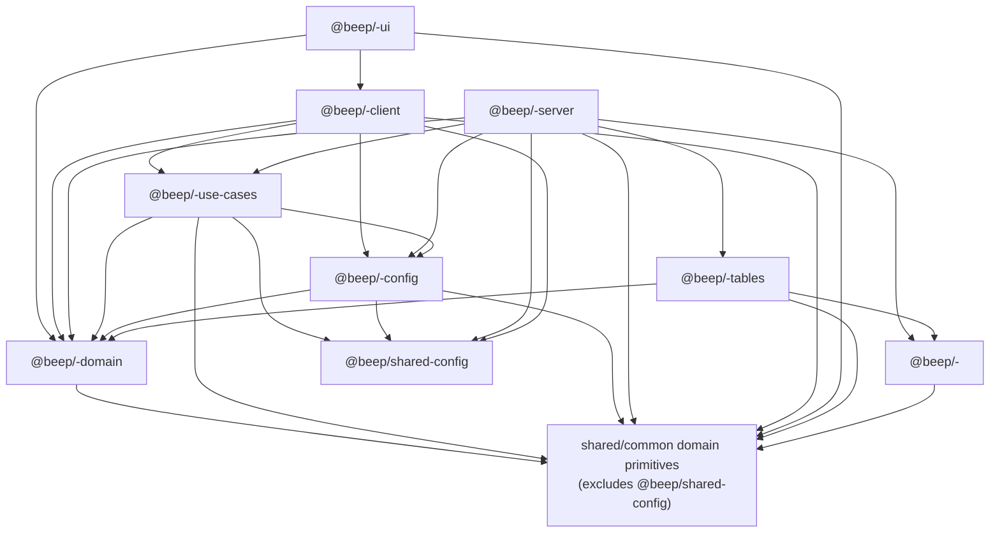
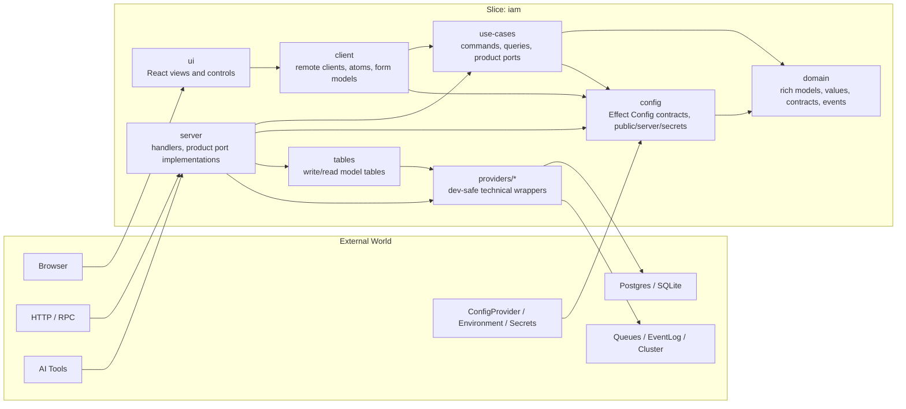
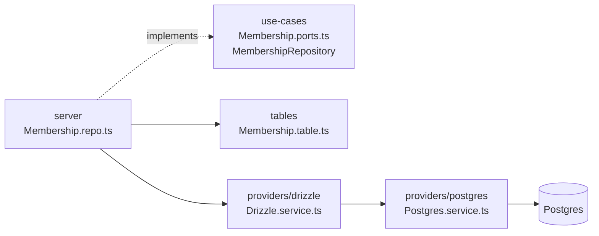
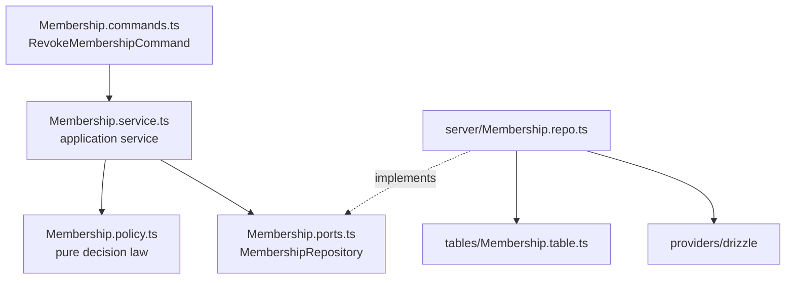
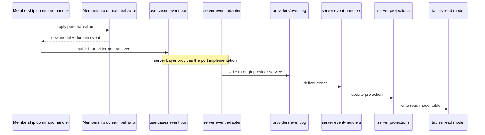
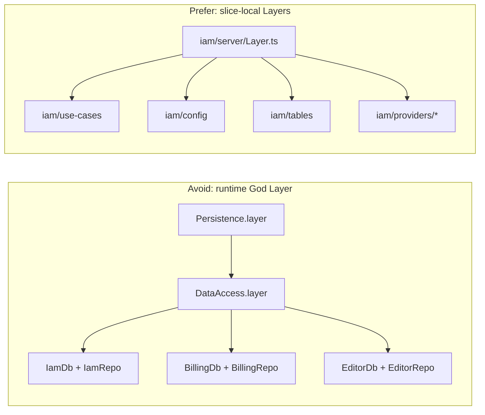

# beep-effect Architecture Standard

This document is the binding architecture constitution for beep-effect. It
defines how packages are shaped, where responsibilities live, and how agents and
humans should infer intent from topology. If a proposed slice, package, adapter,
or dependency contradicts this document, the proposal must change or this
document must be amended.

The companion rationale packet lives in
[`standards/architecture/`](architecture/README.md). The companion packet
explains why these rules exist. This file states the rules and teaches the
default way to apply them.

## North Star

beep-effect uses a hexagonal vertical slice architecture.

A slice is a domain-bounded module family with its own domain language,
application use-cases, typed configuration contracts when those exist, server
adapters, client adapters, tables, UI, and technical providers. The goal is high
modularity without copy-paste drift:
experiments should be easy to create, easy to delete, and still shaped like
production-quality code.

The architecture optimizes for four things:

1. Fast domain experiments that do not create long-term topology debt.
2. Clear provider boundaries so Drizzle, Postgres, browser APIs, queues, and
   other infrastructure do not leak into domain language.
3. Reusable rich domain concepts without turning the repo into one giant shared
   horizontal layer.
4. Agent-readable topology where file paths and role suffixes carry enough
   context to keep work consistent.

## Core Principles

### 1. Slice First

Default to putting product behavior inside the slice that owns the domain
language. Do not create horizontal runtime packages just to gather all similar
layers from every slice.

Effect v4 Layers are memoized by default, so slices can provide their own local
dependencies without building a global "God Layer" that knows every database,
repository, handler, and provider in the system.

### 2. Ports Point Inward, Adapters Point Outward

Domain concepts must not know about providers. Use-cases define product ports.
Server packages implement product ports using tables and providers. Provider
packages expose technical capabilities and dev-safe wrappers around third-party
libraries.

### 3. Shared Is A Shared Kernel

`packages/shared` is the DDD shared kernel. It contains cross-cutting language
that multiple slices deliberately share. It is not a dumping ground for code
that did not fit elsewhere.

### 4. Rich Domain, Pure Behavior

Domain models should be richer than value bags. They should model shape,
validation, and pure behavior. Domain behavior may return Effect values for
typed validation and domain failure, but it must not perform infrastructure side
effects.

### 5. Schemas Are Executable Contracts

For pure data models, `Schema` is the source of truth. Rich annotations, codecs,
constructors, defaults, guards, equivalence, documentation metadata, and runtime
decoders should come from the same schema value. Plain `type` aliases and
`interface` declarations may describe compile-time intent, but they cannot prove
unknown runtime data is valid.

Service contracts and type-level-only utility surfaces may stay as TypeScript
types. Domain payloads, wire payloads, persisted rows, and config payloads
should be schema-first whenever `Schema` can represent the shape.

### 6. Topology Is Compressed Context

Humans get the map from mirrored package paths. Agents get instruction from role
suffixes. This is why the repo uses concept-qualified role module names such as
`Membership.policy.ts`, `Membership.event-handlers.ts`, and
`Membership.command-client.ts`.

Role suffixes are canonical when the role exists. The full vocabulary is not
required for every concept.

## Package Dependency Graph

The legal dependency flow is inward toward domain and outward only through
adapters. Arrows point from the importing package to the imported package.
`domain` is the pure core: its only outbound dependencies are shared/common
domain primitives.



Forbidden by default:

- `domain` depending on anything except shared/common domain primitives. This
  excludes slice `config`, `@beep/shared-config`, `Config`, `ConfigProvider`,
  server, client, tables, UI, providers, and use-cases.
- `use-cases` depending on `server`, `client`, `ui`, `tables`, or concrete
  provider packages.
- `config` depending on `use-cases`, `server`, `client`, `ui`, `tables`, or
  concrete provider packages.
- `providers/*` depending on product concepts from `domain` or `use-cases`.
- `ui`, `tables`, or `providers/*` importing slice `config` directly by default.
- `shared` depending on product slices.
- Runtime packages merging all slice layers into one global dependency object.

Client/UI dependency caveats:

- `config --> domain` is one-way. Config may reuse domain schemas, brands, and
  value objects; domain must never import config or read runtime configuration.
- `client` may import `use-cases` only for client-safe command/query language,
  boundary contracts, actionable application errors, and client facade contracts.
  It must not import product ports, server-only workflows, process managers, or
  Layer implementations.
- `client` may import `config` only through public/browser-safe exports. It must
  not import server config, secret config, or live server-only config Layers.
- `client` may import `@beep/shared-config` only through public/browser-safe
  exports. It must not import shared server config, secret helpers that expose
  secret contracts, live server Layers, or test `ConfigProvider` utilities.
- `use-cases` may import `config` contracts or services for application tunables.
  Live config resolution belongs in server, client, or app/runtime composition.
- `ui` may import `domain` only for provider-neutral schemas, value objects,
  display contracts, and form validation. UI behavior should go through
  `client` services/state instead of calling use-case orchestration directly.
- If a `use-cases` module is not safe to import in the browser, expose the
  browser-safe language through a narrower role file or package subpath.

## Slice Package Topology

Every product slice uses the same package family unless a package genuinely has
no role in that slice.

```txt
packages/<slice>/
  domain/
  use-cases/
  config/
  server/
  client/
  tables/
  ui/
  providers/
    drizzle/
    postgres/
    sqlite/
    memory/
```

The package names follow the public package convention:

```txt
@beep/<slice>-domain
@beep/<slice>-use-cases
@beep/<slice>-config
@beep/<slice>-server
@beep/<slice>-client
@beep/<slice>-tables
@beep/<slice>-ui
@beep/<slice>-<provider>
@beep/<provider>
```

Slice-local provider packages use `@beep/<slice>-<provider>`, for example
`@beep/iam-drizzle`. Shared providers promoted out of a slice use
`@beep/<provider>`, for example `@beep/firecrawl`. Provider package naming may
vary when package manager constraints require it, but the architecture role does
not vary: providers expose technical capability, not business behavior.

`config` is canonical but optional. Create it only when a slice has meaningful
configuration contracts. The canonical shared package name is
`@beep/shared-config`; `env` package naming is legacy source-specific vocabulary,
not a slice package kind. Environment variables are one possible
`ConfigProvider` source for config declarations.

## Hexagonal Slice

Each slice has a domain core, an application ring, and adapter packages around
the outside.

This diagram shows runtime request/data flow, not import direction. The package
dependency graph above is the source of truth for legal imports.



## Canonical Concept Topology

The default concept topology mirrors the domain spine across packages.

```txt
packages/iam/
  domain/src/
    aggregates/
      Enrollment/
        Enrollment.model.ts
        Enrollment.events.ts
        Enrollment.policy.ts
    entities/
      Membership/
        index.ts
        Membership.model.ts
        Membership.values.ts
        Membership.errors.ts
        Membership.behavior.ts
        Membership.policy.ts
        Membership.access.ts
        Membership.contracts.ts
        Membership.events.ts
        Membership.machine.ts
        Membership.http.ts
        Membership.rpc.ts
        Membership.tools.ts
        Membership.cluster.ts
    values/
      LocalDate/
        LocalDate.model.ts
        LocalDate.behavior.ts
    Api.ts
    Rpc.ts
    Tools.ts
    Events.ts
    Cluster.ts

  use-cases/src/
    entities/
      Membership/
        Membership.commands.ts
        Membership.queries.ts
        Membership.access.ts
        Membership.ports.ts
        Membership.service.ts
        Membership.errors.ts
        Membership.workflows.ts
        Membership.processes.ts

  config/src/
    entities/
      Membership/
        Membership.config.ts
    Config.ts
    PublicConfig.ts
    ServerConfig.ts
    Secrets.ts
    Layer.ts
    TestLayer.ts

  server/src/
    entities/
      Membership/
        Membership.repo.ts
        Membership.http-handlers.ts
        Membership.rpc-handlers.ts
        Membership.tool-handlers.ts
        Membership.event-handlers.ts
        Membership.cluster-handlers.ts
        Membership.workflow-handlers.ts
        Membership.projections.ts
        Membership.layer.ts
    Api.ts
    Rpc.ts
    Tools.ts
    Events.ts
    Cluster.ts
    Layer.ts

  tables/src/
    entities/
      Membership/
        Membership.table.ts
        Membership.read-model-table.ts
    Tables.ts
    ReadModels.ts

  client/src/
    entities/
      Membership/
        Membership.command-client.ts
        Membership.query-client.ts
        Membership.service.ts
        Membership.atoms.ts
        Membership.form-model.ts
        Membership.machine.ts
        Membership.layer.ts

  ui/src/
    entities/
      Membership/
        Membership.form.tsx
        Membership.fields.tsx
        Membership.table.tsx
        Membership.list.tsx
        Membership.detail.tsx
        Membership.admin.tsx

  providers/
    postgres/src/
      Postgres.service.ts
      Postgres.layer.ts
      Postgres.errors.ts
      Postgres.config.ts
      Postgres.test-layer.ts
    drizzle/src/
      Drizzle.service.ts
      Drizzle.layer.ts
      Drizzle.errors.ts
      Drizzle.config.ts
      Drizzle.test-layer.ts
```

This topology is a vocabulary, not a requirement to create empty files. A
concept only owns the role files that its behavior actually needs.

## Domain-Kind Folders

Domain package folders classify the kind of domain concept:

| Folder        | Meaning                                                                                                                      |
|---------------|------------------------------------------------------------------------------------------------------------------------------|
| `aggregates/` | Aggregate roots and consistency boundaries. Use when lifecycle and invariants span multiple child entities or values.        |
| `entities/`   | Identity-bearing concepts that are not aggregate roots, or simple aggregate-like concepts whose boundary is only themselves. |
| `values/`     | Value objects with no identity. Prefer local concept values first; promote to `values/` only when reused.                    |
| `policies/`   | Escape hatch for slice-wide or cross-concept pure policies. Not the default.                                                 |
| `services/`   | Rare pure DDD domain services. Not application services, not Effect service ports.                                           |

Aggregates are first-class. Do not hide aggregate roots in `entities/` when the
concept is really a consistency boundary.

## Role Suffixes

Role suffixes are the filename vocabulary that tells humans and agents what a
module is allowed to do.

The grammar is:

```txt
<package>/src/<domain-kind>/<Concept>/<Concept>.<role>.ts
```

For React UI files:

```txt
<package>/src/<domain-kind>/<Concept>/<Concept>.<role>.tsx
```

Multi-word roles use hyphenated suffixes:

```txt
Membership.event-handlers.ts
Membership.command-client.ts
Membership.read-model-table.ts
```

Package-level composers use PascalCase:

```txt
Api.ts
Rpc.ts
Tools.ts
Events.ts
Cluster.ts
Layer.ts
Tables.ts
ReadModels.ts
Config.ts
PublicConfig.ts
ServerConfig.ts
Secrets.ts
TestLayer.ts
```

### Domain Role Vocabulary

| Role            | Meaning                                                          |
|-----------------|------------------------------------------------------------------|
| `.model.ts`     | Schema-first model, identity, constructors, simple rich methods. |
| `.values.ts`    | Concept-local value objects.                                     |
| `.errors.ts`    | Actionable domain failures callers may branch on.                |
| `.behavior.ts`  | Pure behavior too large or visible for the model file.           |
| `.policy.ts`    | Pure domain decision law.                                        |
| `.access.ts`    | Pure permission/action/resource vocabulary.                      |
| `.contracts.ts` | Provider-neutral DTOs shared by protocols and use-cases.         |
| `.events.ts`    | Domain events and event groups.                                  |
| `.machine.ts`   | Pure lifecycle state machine.                                    |
| `.http.ts`      | Provider-neutral HttpApi endpoint/group declarations.            |
| `.rpc.ts`       | Provider-neutral Rpc/RpcGroup declarations.                      |
| `.tools.ts`     | Provider-neutral AI tool/toolkit declarations.                   |
| `.cluster.ts`   | Provider-neutral cluster entity protocol definitions.            |

Domain protocol role files declare boundary language only. They may define
HttpApi, Rpc, AI tool, or cluster protocol contracts, but they must not define
handlers, clients, transports, runtimes, persistence, or provider access.

### Use-Case Role Vocabulary

| Role            | Meaning                                                                             |
|-----------------|-------------------------------------------------------------------------------------|
| `.commands.ts`  | Application command envelopes and command language.                                 |
| `.queries.ts`   | Application query envelopes and query language.                                     |
| `.access.ts`    | Effectful authorization over domain access vocabulary.                              |
| `.ports.ts`     | Product ports needed by use-cases.                                                  |
| `.service.ts`   | Application service contract/orchestration facade.                                  |
| `.errors.ts`    | Actionable application failures.                                                    |
| `.workflows.ts` | Durable workflow declarations or application workflow contracts.                    |
| `.processes.ts` | Process managers/sagas coordinating multiple commands, events, ports, or workflows. |

### Config Role Vocabulary

| Role              | Meaning                                                                                 |
|-------------------|-----------------------------------------------------------------------------------------|
| `.config.ts`      | Concept-owned Effect `Config` declarations, typed config models, and config vocabulary. |
| `Config.ts`       | Package-level config composer for shared slice config contracts.                        |
| `PublicConfig.ts` | Browser-safe config contracts and services that client packages may import.             |
| `ServerConfig.ts` | Server-only config contracts and services.                                              |
| `Secrets.ts`      | Secret config declarations using redacted values.                                       |
| `Layer.ts`        | Live config Layer reading from the ambient `ConfigProvider`.                            |
| `TestLayer.ts`    | Static/test config Layers and fixtures tied to config declarations.                     |

### Server Role Vocabulary

| Role                    | Meaning                                                                                       |
|-------------------------|-----------------------------------------------------------------------------------------------|
| `.repo.ts`              | Product repository port implementation.                                                       |
| `.<port-name>.ts`       | Product port implementation named after the port, such as `.mailer.ts` or `.token-signer.ts`. |
| `.http-handlers.ts`     | HttpApi handlers.                                                                             |
| `.rpc-handlers.ts`      | Rpc server handlers.                                                                          |
| `.tool-handlers.ts`     | AI tool handlers.                                                                             |
| `.event-handlers.ts`    | Side-effectful domain event reactions.                                                        |
| `.cluster-handlers.ts`  | Cluster entity runtime handlers.                                                              |
| `.workflow-handlers.ts` | Workflow runtime handlers.                                                                    |
| `.projections.ts`       | Projection/read-model writers.                                                                |
| `.layer.ts`             | Concept-level server Layer composition.                                                       |

### Client Role Vocabulary

| Role                 | Meaning                                              |
|----------------------|------------------------------------------------------|
| `.command-client.ts` | Remote command adapter.                              |
| `.query-client.ts`   | Remote query adapter.                                |
| `.service.ts`        | Ergonomic client-facing `Context.Service` facade.    |
| `.atoms.ts`          | Effect Reactivity atoms, refs, and client state.     |
| `.form-model.ts`     | Form schemas, metadata, and client validation model. |
| `.machine.ts`        | Browser/client interaction state machine.            |
| `.layer.ts`          | Concept-level client Layer composition.              |

### Tables, UI, And Provider Role Vocabulary

| Package       | Roles                                                                              |
|---------------|------------------------------------------------------------------------------------|
| `tables`      | `.table.ts`, `.read-model-table.ts`, `Tables.ts`, `ReadModels.ts`                  |
| `ui`          | `.form.tsx`, `.fields.tsx`, `.table.tsx`, `.list.tsx`, `.detail.tsx`, `.admin.tsx` |
| `providers/*` | `.service.ts`, `.layer.ts`, `.errors.ts`, `.config.ts`, `.test-layer.ts`           |

## Responsibility Boundaries

### `domain`

Domain owns provider-neutral semantic language and pure transition law:

- rich models, value objects, entities, aggregates
- domain contracts, events, policies, access vocabulary
- pure lifecycle state machines
- provider-neutral protocol declarations

Domain does not own product ports, repository interfaces, provider wrappers,
handlers, tables, browser state, or runtime Layers that connect to external
systems.

### `use-cases`

Use-cases own imperative application intent:

- commands and queries
- effectful application authorization
- product ports
- orchestration services
- workflows and process managers
- actionable application errors

Product ports live here by default because they describe what the application
needs in product language. They do not describe how Drizzle, Postgres, EventLog,
or an HTTP client works.

### `config`

Config owns typed runtime/application configuration contracts:

- Effect `Config` declarations and key namespaces
- typed config schemas, models, and services
- public/browser-safe config contracts
- server-only config contracts
- redacted secret config
- config defaults and literal domains tied directly to config declarations
- live Layers that read from the ambient `ConfigProvider`
- static/test config Layers and fixtures

Config may depend inward on `domain` and `shared` for provider-neutral schemas,
brands, value objects, and validation. That dependency is one-way: domain must
not import config, `@beep/shared-config`, `Config`, `ConfigProvider`, or any
runtime configuration helper. Config must not import use-cases, server, client,
UI, tables, or concrete providers.

Config is not a general constants package. Business invariants belong in
`domain`; application behavior belongs in `use-cases`; provider defaults belong
in `providers/*`; presentation constants belong in `client` or `ui`.

### `server`

Server owns runtime adapters and product port implementations:

- HTTP, RPC, AI tool, cluster, event, and workflow handlers
- repository and product port implementations
- projections and read-model writers
- concept-level and package-level server Layers

Server may depend on use-cases, config, domain, tables, and providers.

### `providers/*`

Providers own technical engines and dev-safe wrappers:

- Drizzle, Postgres, SQLite, EventLog, message storage, workflow engines,
  sharding, queues, locks, transactions, retries, and low-level config
- technical errors and test layers
- provider service facades that hide unsafe third-party shape

Provider packages do not define product/business ports by default.

Slice-local provider packages use `@beep/<slice>-<provider>`. Promote a provider
to `@beep/<provider>` only when the provider contract is genuinely product-neutral
and stable across multiple slices. If the shared provider name would be too
generic or misleading, choose a more capability-specific provider name instead of
adding product vocabulary.

Provider `.config.ts` files own technical provider knobs. Slice `config` owns
application-facing configuration contracts. Server or app Layers may compose
slice config with provider config at adapter boundaries, but slice config should
not absorb provider internals.

Providers may start slice-local when that keeps experiments removable. Promote a
provider to `shared` only when it is genuinely product-neutral, stable across
multiple slices, and worth coupling those slices to the same technical contract.

### `tables`

Tables own product-specific persistence shape:

- write-model tables
- read-model/projection tables
- table-level mapping helpers when they are unavoidable

Tables may depend on domain for schema/value identity and provider-safe table
kits, but tables are not domain.

### `client`

Client owns browser/client adapters and domain-facing client state:

- command/query clients
- client service facades
- atoms, form models, optimistic state, and client state machines

Client may depend on public/browser-safe config exports and client config Layers.
It must not import server config, secret config, or server-only live Layers.

UI code should consume this package instead of implementing domain CRUD and
remote orchestration directly inside React components.

### `ui`

UI owns React composition:

- forms, fields, tables, detail views, admin views, and lists
- presentation behavior
- interaction wiring to client services/state

UI does not implement product use-cases, server handlers, or provider adapters.
UI should consume client services/state instead of importing config directly.

## Access, Policy, And Error Kinds

`access` and `policy` are not synonyms.

```txt
access = who may attempt which action on which resource
policy = what the domain permits to be true
```

Domain `*.access.ts` defines pure permission/action/resource vocabulary. It
must not query users, grants, sessions, tenancy, or feature flags.

Use-case `*.access.ts` performs effectful authorization over that vocabulary. It
may consult product ports such as grants, org membership, ownership lookup, or
feature flags.

Domain `*.policy.ts` defines pure domain decision law, such as whether a
membership may be revoked or whether a membership role may be changed.

Errors are split by actionability:

| Error kind                          | Location                                             |
|-------------------------------------|------------------------------------------------------|
| Actionable domain failure           | `domain/<Concept>.errors.ts`                         |
| Actionable application failure      | `use-cases/<Concept>.errors.ts`                      |
| Technical/internal provider failure | `providers/<Provider>.errors.ts`                     |
| Boundary translation failure        | server handlers translate to protocol response shape |

Do not create `*.errors.ts` files just to wrap every possible failure. Create
them when callers can make product decisions from the error tag.

## Provider Boundary

Provider packages wrap third-party and infrastructure shape. Server packages
adapt those technical capabilities to product ports.

In this diagram, solid arrows are import/use dependencies. The dotted arrow is an
implementation relationship.



In this shape, a use-case can ask for `MembershipRepository` without knowing
whether the implementation uses Drizzle, Postgres, SQLite, a test store, or an
event-sourced projection.

Provider services use Effect v4 `Context.Service` and expose technical
capability, not product verbs:

```ts
import { $IamDrizzleId } from "@beep/identity/packages"
import { TaggedErrorClass } from "@beep/schema"
import { Context, Effect, Layer } from "effect"
import * as O from "effect/Option"
import * as S from "effect/Schema"

const $I = $IamDrizzleId.create("Drizzle.service")

export class DrizzleError extends TaggedErrorClass<DrizzleError>(
  $I`DrizzleError`,
)(
  "DrizzleError",
  {
    operation: S.String,
    cause: S.OptionFromOptionalKey(S.Defect),
  },
  $I.annote("DrizzleError", {
    description: "Technical Drizzle provider failure.",
  }),
) {}

const toDrizzleError = (operation: string, cause?: unknown): DrizzleError =>
  new DrizzleError({
    operation,
    cause: O.fromUndefinedOr(cause),
  })

export interface DrizzleClient {
  readonly execute: (
    statement: string,
    parameters: ReadonlyArray<unknown>,
  ) => Promise<ReadonlyArray<unknown>>
}

export class Drizzle extends Context.Service<
  Drizzle,
  {
    readonly execute: (
      statement: string,
      parameters: ReadonlyArray<unknown>,
    ) => Effect.Effect<ReadonlyArray<unknown>, DrizzleError>
  }
>()($I`Drizzle`) {}

export const makeDrizzleLayer = (client: DrizzleClient): Layer.Layer<Drizzle> =>
  Layer.effect(
    Drizzle,
    Effect.succeed({
      execute: (statement, parameters) =>
        Effect.tryPromise({
          try: () => client.execute(statement, parameters),
          catch: (cause) => toDrizzleError("execute", cause),
        }),
    }),
)
```

Product ports use product language. Actionable port failures live in
`Membership.errors.ts`; the port file imports those errors instead of defining
technical/provider failures inline:

```ts
import { $IamUseCasesId } from "@beep/identity/packages"
import { Context, type Effect } from "effect"
import type * as O from "effect/Option"
import type {
  Membership,
  MembershipId,
} from "@beep/iam-domain/entities/Membership"
import type { MembershipRepositoryError } from "./Membership.errors.js"

const $I = $IamUseCasesId.create("entities/Membership/Membership.ports")

export class MembershipRepository extends Context.Service<
  MembershipRepository,
  {
    readonly save: (
      model: Membership,
    ) => Effect.Effect<void, MembershipRepositoryError>
    readonly findById: (
      id: MembershipId,
    ) => Effect.Effect<O.Option<Membership>, MembershipRepositoryError>
  }
>()($I`MembershipRepository`) {}
```

The implementation belongs in server:

```ts
import { Effect, Layer } from "effect"
import * as A from "effect/Array"
import * as O from "effect/Option"
import * as S from "effect/Schema"
import { Drizzle } from "@beep/iam-drizzle"
import {
  MembershipRepository,
  toMembershipRepositoryError,
} from "@beep/iam-use-cases/entities/Membership"
import {
  MembershipRow,
  MembershipTable,
} from "@beep/iam-tables/entities/Membership"

export const MembershipRepositoryLive = Layer.effect(
  MembershipRepository,
  Effect.gen(function* () {
    const drizzle = yield* Drizzle

    return {
      save: Effect.fn("MembershipRepository.save")((model) =>
        drizzle
          .execute(`upsert into ${MembershipTable.name}`, [
            MembershipTable.toRow(model),
          ])
          .pipe(
            Effect.asVoid,
            Effect.mapError((error) =>
              toMembershipRepositoryError("save", error),
            ),
          )),
      findById: Effect.fn("MembershipRepository.findById")(
        (id) =>
          drizzle
            .execute(
              `select * from ${MembershipTable.name} where id = $1 limit 1`,
              [id],
            )
            .pipe(
              Effect.flatMap((rows) =>
                A.head(rows).pipe(
                  O.match({
                    onNone: () => Effect.succeed(O.none()),
                    onSome: (row) =>
                      S.decodeUnknownEffect(MembershipRow)(row).pipe(
                        Effect.map(MembershipTable.fromRow),
                        Effect.map(O.some),
                      ),
                  }),
                ),
              ),
              Effect.mapError((error) =>
                toMembershipRepositoryError("findById", error),
              ),
            ),
      ),
    }
  }),
)
```

## CQRS, Events, Workflows, Cluster, And Read Models

CQRS and distributed-system roles stay concept-local by default.

In this diagram, solid arrows are application flow. The dotted arrow is an
implementation relationship.



Domain owns events and pure lifecycle machines:

```txt
domain/src/entities/Membership/Membership.events.ts
domain/src/entities/Membership/Membership.machine.ts
domain/src/Events.ts
```

Use-cases own commands, queries, workflows, process managers, and product ports:

```txt
use-cases/src/entities/Membership/Membership.commands.ts
use-cases/src/entities/Membership/Membership.queries.ts
use-cases/src/entities/Membership/Membership.workflows.ts
use-cases/src/entities/Membership/Membership.processes.ts
use-cases/src/entities/Membership/Membership.ports.ts
```

Server owns handlers, projections, and runtime layers:

```txt
server/src/entities/Membership/Membership.event-handlers.ts
server/src/entities/Membership/Membership.projections.ts
server/src/entities/Membership/Membership.cluster-handlers.ts
server/src/entities/Membership/Membership.workflow-handlers.ts
```

Providers own technical engines:

```txt
providers/eventlog/src/EventLog.service.ts
providers/message-storage/src/MessageStorage.service.ts
providers/workflow/src/WorkflowEngine.service.ts
providers/sharding/src/Sharding.service.ts
```

Event and projection flow:



State machine placement:

| Machine                          | Location                               |
|----------------------------------|----------------------------------------|
| Pure lifecycle transition law    | `domain/<Concept>.machine.ts`          |
| Process manager / saga           | `use-cases/<Concept>.processes.ts`     |
| Cluster runtime mailbox behavior | `server/<Concept>.cluster-handlers.ts` |
| Client interaction state         | `client/<Concept>.machine.ts`          |

## Layer Composition Without God Layers

Avoid central runtime packages that merge every slice's repositories, database
access, handlers, and providers into one global layer.



Package-level Layer composers are still useful. The rule is that they should
compose a slice or adapter boundary, not become the place where unrelated slices
are welded together.

## Worked `iam/Membership` Example

Domain errors are actionable, and domain model behavior is pure:

```ts
import { $IamDomainId } from "@beep/identity/packages"
import { TaggedErrorClass } from "@beep/schema"

const $I = $IamDomainId.create("entities/Membership/Membership.errors")

export class MembershipAlreadyRevoked extends TaggedErrorClass<MembershipAlreadyRevoked>(
  $I`MembershipAlreadyRevoked`,
)(
  "MembershipAlreadyRevoked",
  {},
  $I.annote("MembershipAlreadyRevoked", {
    description: "Membership revocation failed because it is already revoked.",
  }),
) {}
```

```ts
import { $IamDomainId } from "@beep/identity/packages"
import { LiteralKit } from "@beep/schema"
import * as Model from "@beep/schema/Model"
import { Effect } from "effect"
import * as S from "effect/Schema"
import { AccountId } from "@beep/iam-domain/entities/Account"
import { OrganizationId } from "@beep/iam-domain/entities/Organization"
import { MembershipAlreadyRevoked } from "./Membership.errors.js"

const $I = $IamDomainId.create("entities/Membership/Membership.model")

export const MembershipId = S.String.pipe(
  S.brand("MembershipId"),
  $I.annoteSchema("MembershipId", {
    description: "Unique identifier for an organization membership.",
  }),
)
export type MembershipId = typeof MembershipId.Type

export const MembershipRole = LiteralKit(["owner", "admin", "member"]).pipe(
  $I.annoteSchema("MembershipRole", {
    description: "Role granted by an organization membership.",
  }),
)
export type MembershipRole = typeof MembershipRole.Type

export const MembershipStatus = LiteralKit([
  "active",
  "invited",
  "revoked",
]).pipe(
  $I.annoteSchema("MembershipStatus", {
    description: "Lifecycle status of an organization membership.",
  }),
)
export type MembershipStatus = typeof MembershipStatus.Type

export class Membership extends Model.Class<Membership>($I`Membership`)(
  {
    id: MembershipId,
    organizationId: OrganizationId,
    accountId: AccountId,
    role: MembershipRole,
    status: MembershipStatus,
  },
  $I.annote("Membership", {
    description: "Account participation in an organization.",
  }),
) {
  readonly canRevoke = (): boolean => !MembershipStatus.is.revoked(this.status)

  readonly revoke = Effect.fn("Membership.revoke")(() =>
    this.canRevoke()
      ? Effect.succeed(
          Membership.make({
            id: this.id,
            organizationId: this.organizationId,
            accountId: this.accountId,
            role: this.role,
            status: MembershipStatus.Enum.revoked,
          }),
        )
      : Effect.fail(new MembershipAlreadyRevoked()),
  )
}
```

Use-case service orchestrates ports and domain behavior:

```ts
import { $IamUseCasesId } from "@beep/identity/packages"
import { Context, Effect, Layer } from "effect"
import * as O from "effect/Option"
import type { MembershipAlreadyRevoked } from "@beep/iam-domain/entities/Membership"
import { MembershipAccess } from "./Membership.access.js"
import type { RevokeMembershipCommand } from "./Membership.commands.js"
import {
  MembershipAccessDenied,
  MembershipNotFound,
  MembershipRepositoryError,
} from "./Membership.errors.js"
import { MembershipRepository } from "./Membership.ports.js"

const $I = $IamUseCasesId.create("entities/Membership/Membership.service")

export class MembershipService extends Context.Service<
  MembershipService,
  {
    readonly revoke: (
      command: RevokeMembershipCommand,
    ) => Effect.Effect<
      void,
      | MembershipAccessDenied
      | MembershipAlreadyRevoked
      | MembershipNotFound
      | MembershipRepositoryError
    >
  }
>()($I`MembershipService`) {}

export const MembershipServiceLive = Layer.effect(
  MembershipService,
  Effect.gen(function* () {
    const access = yield* MembershipAccess
    const repo = yield* MembershipRepository

    return {
      revoke: Effect.fn("MembershipService.revoke")(function* (
        command: RevokeMembershipCommand,
      ) {
        yield* access.assertCanRevoke(command)
        const model = yield* repo.findById(command.membershipId).pipe(
          Effect.flatMap(
            O.match({
              onNone: () => Effect.fail(new MembershipNotFound()),
              onSome: Effect.succeed,
            }),
          ),
        )

        yield* model.revoke().pipe(Effect.flatMap(repo.save))
      }),
    }
  }),
)
```

Server handlers consume use-case services:

```ts
import { Effect } from "effect"
import type { RevokeMembershipCommand } from "@beep/iam-use-cases/entities/Membership"
import { MembershipService } from "@beep/iam-use-cases/entities/Membership"

export const revokeMembershipHandler = Effect.fn("revokeMembershipHandler")(
  function* (command: RevokeMembershipCommand) {
    const membership = yield* MembershipService
    return yield* membership.revoke(command)
  },
)
```

The important part is not the exact method names. The important part is the
dependency direction:

```txt
domain model behavior
  <- use-case service
  <- server handler
  <- protocol/runtime
```

## Enforcement Later

This document defines the architecture. Repo checks, lint rules, package
constraints, codemods, and repo-cli commands may later enforce it, but they are
downstream mechanisms.

Do not treat this standard as a generator design. Treat it as the map that
generators, lint rules, reviewers, and agents must obey.
