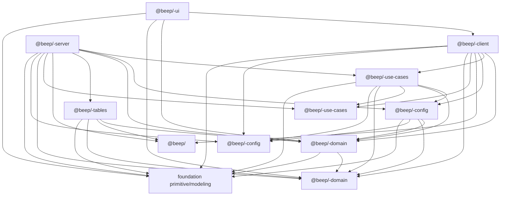
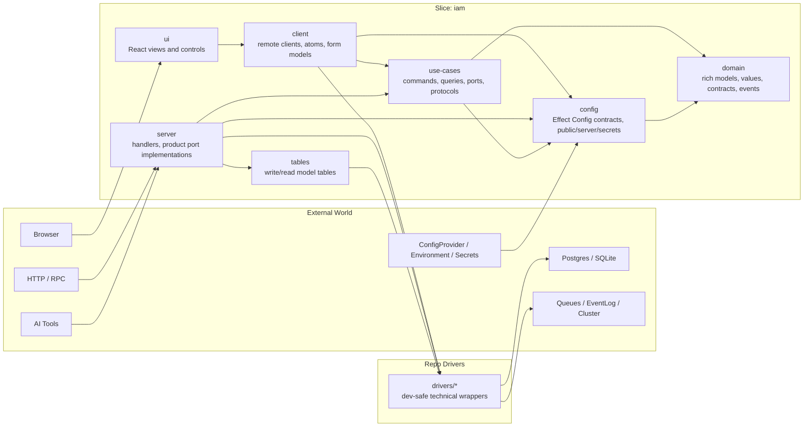
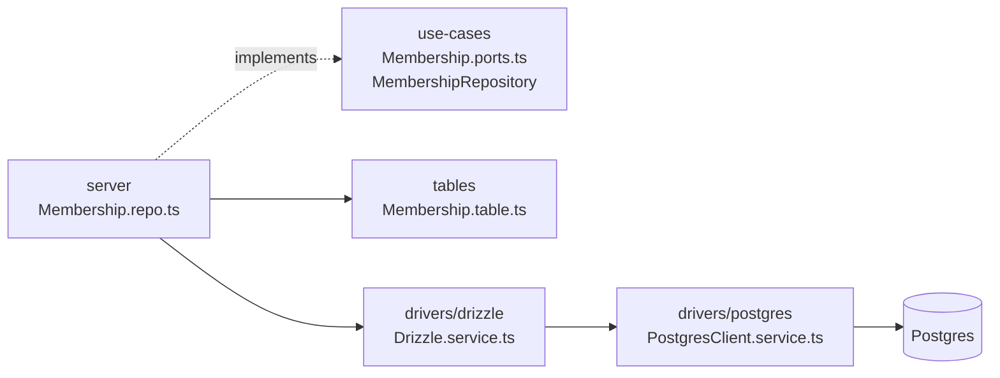
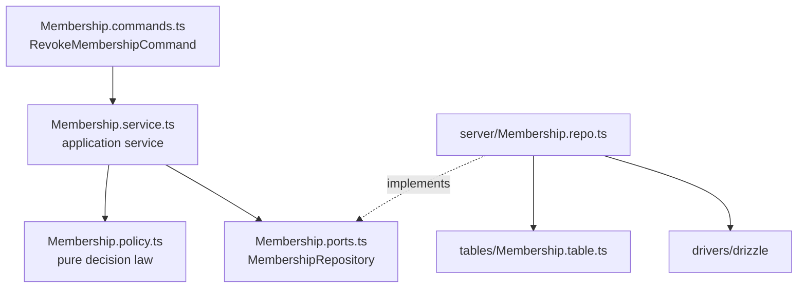
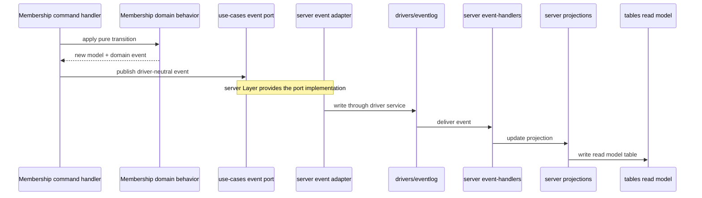
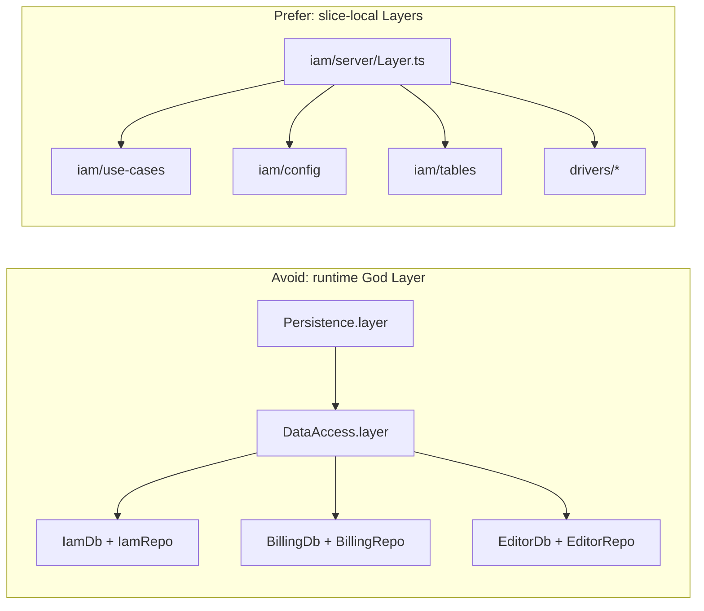

# beep-effect Architecture Standard

This document is the binding architecture constitution for beep-effect. It
defines how slice packages and non-slice families are shaped, where
responsibilities live, and how readers should infer intent from topology. If a
proposed slice, package, adapter, or dependency contradicts this document, the
proposal must change or this document must be amended.

The companion rationale packet lives in
[`standards/architecture/`](architecture/README.md). The companion packet
explains why these rules exist. This file states the rules and teaches the
default way to apply them.

Canonical executable examples live in `packages/architecture-lab/*` with the
`apps/architecture-lab-proof` harness and are covered by tests. Longer
membership snippets in this document are architectural sketches unless they
explicitly reference the architecture lab packages.

## North Star

beep-effect uses a hexagonal vertical slice architecture for product code.

Domain-agnostic reusable substrate, developer-operational packages, and
technical boundary wrappers use explicit non-slice family/kind grammar so they
are as legible as slices instead of becoming generic `common` buckets.

A slice is a domain-bounded module family with its own domain language,
application use-cases, typed configuration contracts when those exist, server
adapters, client adapters, tables, and UI. Technical wrappers live in the
repo-level `drivers` family. The goal is high modularity without copy-paste
drift:
experiments should be easy to create, easy to delete, and still shaped like
production-quality code.

The architecture optimizes for four things:

1. Fast domain experiments that do not create long-term topology debt.
2. Clear driver boundaries so Drizzle, Postgres, browser APIs, queues, and
   other infrastructure do not leak into domain language.
3. Reusable rich domain concepts without turning the repo into one giant shared
   horizontal layer.
4. Reviewable topology where file paths and role suffixes carry enough
   context to keep work consistent.

## How To Use This Standard

Start with the smallest boundary that owns the meaning:

| Task | Default home |
|------|--------------|
| Product behavior or product language | The owning slice. |
| Product language deliberately shared by multiple slices | `shared/*`, after the shared-kernel promotion gate. |
| External engines, SDKs, services, frameworks, or browser platform wrappers | `drivers/*`. |
| Domain-agnostic reusable substrate owned by this repo | `foundation/*`, after the specific-home-first routing test. |
| Typed application/runtime configuration contracts | The slice or shared `config` package. |
| Product-agnostic UI primitives, themes, tokens, hooks, or composition helpers | `foundation/ui-system`. |
| Browser/client product state, adapters, or interaction behavior | The slice `client` or `ui` package. |
| App runtime wiring | The app entrypoint or an app-local `src/runtime/Layer.ts` helper. |

Apps are executable workspaces, not reusable package surfaces by default.
Framework apps such as Next.js and Tauri should keep their runtime modules
app-local through `@/*` and should not publish a public `@beep/<app>` TypeScript
API, root `src/index.ts`, package exports, docgen, dtslint, or type-test
surface. Runtime proof apps are the explicit exception: they may stay
package-like when the app exists to prove a runtime contract from a public
workspace API.

The core vocabulary is deliberately small at the entry point: slice, domain,
use-cases, adapter, driver, shared kernel, foundation, config contract, Layer,
and canonical subpath name. More specialized terms remain canonical, but use the
[glossary](architecture/GLOSSARY.md) when they first matter instead of loading
the whole vocabulary at once.

## Core Principles

### 1. Slice First

Default to putting product behavior inside the slice that owns the domain
language. Do not create horizontal runtime packages just to gather all similar
layers from every slice.

Effect v4 Layers are memoized by default, so slices can provide their own local
dependencies without building a global "God Layer" that knows every database,
repository, handler, and driver in the system.

### 2. Ports Point Inward, Adapters Point Outward

Domain concepts must not know about drivers. Use-cases define product ports and
boundary contracts. Server packages implement product ports using tables and
drivers. Driver packages expose technical capabilities and dev-safe wrappers
around third-party
libraries.

### 3. Shared Is A Shared Kernel

The `shared` package family is the DDD shared kernel. It contains cross-cutting
language that multiple slices deliberately share. It is not a dumping ground for
code that did not fit elsewhere. Domain-agnostic reusable substrate belongs in
`packages/foundation`, not in `shared`.

### 4. Rich Domain, Pure Behavior

Domain models should be richer than value bags. They should model shape,
validation, and pure behavior. Domain behavior may return Effect values for
typed validation and domain failure, but it must not perform infrastructure side
effects.

### 5. Schemas Are Executable Contracts

For pure data models, `Schema` is the source of truth. Rich annotations, codecs,
constructors, defaults, guards, equivalence, documentation metadata, and runtime
decoders should come from the same schema value. Plain `type` aliases and
`interface` declarations may describe compile-time intent, but they cannot prove
unknown runtime data is valid.

Service contracts and type-level-only utility surfaces may stay as TypeScript
types. Domain payloads, wire payloads, persisted rows, and config payloads
should be schema-first whenever `Schema` can represent the shape.

When a schema-modeled shape represents a finite set of variants, lifecycle
states, status/result cases, or case-specific payloads, model it as a
discriminated union. Do not model finite cases as one object with optional or
nullish fields unless an external wire contract requires that shape; in those
cases, decode or normalize the boundary value into an internal tagged model
before case-specific behavior branches.

Persisted entities follow the same law. `@beep/schema/EntitySchema` is the
generic source-of-truth kernel: entity models are schema classes, their decoded
side is domain language, and their encoded side is the persistence row shape.
Entity fields use normal Effect Schema optional/nullish codecs
(`S.OptionFromNullOr`, `S.OptionFromOptionalKey`, `S.optionalKey`, and related
variants) instead of bespoke nullable wrappers. Table projection code reads the
Schema AST and rejects persisted selected-row fields whose encoded absence is
optional, `undefined`, or ambiguous; SQL row absence must encode as `null`.

Product entity invariants belong in class factories. Shared product entities
use the `BaseEntity.Class` export from
`@beep/shared-domain/entity/BaseEntity` to compose
invariant fields such as entity identity, organization scope, provenance, schema
version, and row version into the schema class. Entity-specific `.model.ts`
files inline their own rich fields plus `persisted` descriptors next to the
schema so domain shape and persistence shape drift together at compile time.

Drizzle tables are projected, not hand-mapped. `@beep/drizzle` exposes the `EntityTable`
owns the generic Drizzle projection and exposes `pgTableFrom(entity)`.
Slice/shared `tables` packages may own concrete table metadata for their product
language, but they do not own a second SQL DSL, live database execution,
transactions, repositories, or migrations.

### 6. Topology Is Compressed Context

Readers get the map from mirrored package paths and role suffixes. This is why
the repo uses concept-qualified role module names such as
`Membership.policy.ts`, `Membership.event-handlers.ts`, and
`Membership.command-client.ts`.

Role suffixes are canonical when the role exists. The full vocabulary is not
required for every concept.

### 7. Non-Slice Families Are Explicit

Non-slice artifacts are never `misc`.

- `foundation` owns domain-agnostic reusable substrate
- `drivers` owns flat repo-level technical boundary wrappers
- `tooling` owns developer-operational code packages

Every non-slice artifact declares exactly one family so readers, reviewers, and
tooling can infer the intended boundary before opening the first file. `kind`
is required only for families that intentionally declare a kind segment;
`drivers` remains the flat family exception.

`packages/_internal/db-admin` is a narrow durable internal exception for
repository-owned database migration aggregation and generated migration SQL.
Product apps and product slice packages must not depend on it; see
[07-non-slice-families.md](architecture/07-non-slice-families.md).

## Package Dependency Graph

The legal dependency flow is inward toward domain and outward only through
adapters. Arrows point from the importing package to the imported package.
`domain` is the pure core: its only outbound dependencies are shared-kernel
language and allowed foundation packages that stay driver-neutral.

This graph focuses on slice boundaries plus direct driver imports. Driver-to-
driver and driver-to-foundation rules are defined in
[07-non-slice-families.md](architecture/07-non-slice-families.md).



Forbidden by default:

- `domain` depending on anything except shared-kernel language and
  `foundation/primitive` or `foundation/modeling` packages. This excludes slice
  `config`, `@beep/<kernel>-config`, `foundation/capability`,
  `foundation/ui-system`, `Config`, `ConfigProvider`, server, client, tables,
  UI, drivers, and use-cases.
- `use-cases` depending on `server`, `client`, `ui`, `tables`, or concrete
  drivers.
- `config` depending on `use-cases`, `server`, `client`, `ui`, `tables`, or
  concrete drivers.
- `drivers/*` depending on product concepts from any slice or `shared/*`.
- `ui`, `tables`, or `drivers/*` importing slice `config` directly.
- `shared/*` depending on product slices or drivers.
- slice packages importing `packages/tooling/*/*` packages.
- Runtime packages merging all slice layers into one global dependency object.

Client/UI dependency caveats:

- `config --> domain` is one-way. Config may reuse domain schemas, brands, and
  value objects; domain must never import config or read runtime configuration.
- `client` may import `use-cases` only through required client-safe contract
  subpaths such as `@beep/<slice>-use-cases/public` and
  `@beep/<kernel>-use-cases/public`. Those exports may include command/query
  language, driver-neutral boundary contracts, driver-neutral DTOs, actionable
  application errors, and client-safe facade contracts. They must not include
  product ports, server-only service/facade contracts, workflows, process
  managers, schedulers, or live Layer values.
- `client` may import config only through `@beep/<slice>-config/public` and
  `@beep/<kernel>-config/public`. It must not import `/server`, `/secrets`,
  `/layer`, or `/test`.
- `client` may import drivers only through the required browser-safe subpath
  `@beep/<driver>/browser`. Driver package roots are never browser-safe by
  default.
- `use-cases` may import config contracts or services for application tunables.
  Live config resolution helpers belong under config `/layer`; live application
  Layer composition belongs in `server`, `client`, or top-level application
  entrypoint composition that assembles those adapter boundaries.
- `ui` may import `domain` only for driver-neutral schemas, value objects,
  display contracts, and form validation. UI behavior should go through
  `client` services/state instead of calling use-case orchestration directly.
- `shared/domain` and any future `shared/config` package follow the same inward
  rules as slice `domain` and `config`. High-bar shared packages never own
  drivers.
- `shared/tables` may import `@beep/drizzle` only for metadata-only table
  projection from shared-kernel entity schemas. This exception does not permit
  live driver capability, query execution, migrations, repositories, seeders, or
  database transactions in shared packages.

## Slice Package Topology

Every product slice uses the same package family unless a package genuinely has
no role in that slice.

```txt
packages/<slice>/
  domain/
  use-cases/
  config/
  server/
  client/
  tables/
  ui/
```

The package names follow the public package convention:

```txt
@beep/<slice>-domain
@beep/<slice>-use-cases
@beep/<slice>-config
@beep/<slice>-server
@beep/<slice>-client
@beep/<slice>-tables
@beep/<slice>-ui
```

The canonical spine is vocabulary, not a scaffold mandate. Create the smallest
real package set that carries current behavior. A new package needs both:

- a concrete architecture role
- meaningful exported behavior, contract, adapter, config surface, or test
  fixture

Do not create packages only for symmetry. Future generators should default to
minimal packages and add optional packages only through explicit flags or
prompts.

`config` is optional canonical-shape. Create it only when a slice has meaningful
configuration contracts. The canonical shared package names are names for roles
when those packages exist: `@beep/<kernel>-domain`, `@beep/<kernel>-config`, and
high-bar `@beep/<kernel>-use-cases`. `env` package naming is legacy
source-specific vocabulary, not a slice package kind. Environment variables are
one possible `ConfigProvider` source for config declarations.

`shared` is the canonical cross-slice slice with a reduced spine:

```txt
packages/<kernel>/
  domain/
  config/   # create only after real shared config contracts exist
  use-cases/ # create only after high-bar contract promotion
  client/   # create only after high-bar contract promotion
  server/   # create only after high-bar contract promotion
  tables/   # high bar only
  ui/       # create only after high-bar contract promotion
```

`shared/domain` is the active normal home today; `shared/config` is a reserved
normal role for real cross-slice config contracts. `shared/use-cases`,
`shared/client`, `shared/server`, and `shared/ui` do not exist yet. They are
reserved high-bar exceptions, created only when real exported behavior clears the
promotion bar. `shared/use-cases` in particular has no package directory today
because nothing has met that bar.

A future `shared/use-cases` package would be contract-only: deliberate
cross-slice commands, queries, driver-neutral DTOs, driver-neutral boundary
contracts, client-safe application errors, facade interfaces, and ultra-high-bar
product ports are allowed. A shared product port must prove why a shared
command, query, event, or facade contract is insufficient. It never owns
workflows, process managers, schedulers, handlers, concrete adapters, driver
imports, or live Layer values. `shared` never owns drivers or generic substrate.

Meaningful exports in high-bar `shared/*` packages require a promotion record in
that package's README before or alongside the export. The record must include:

- the shared product semantics being accepted
- the current consumers or explicit cross-slice rationale
- the exported surface being promoted
- rejected homes, especially the owning slice and `foundation`
- runtime, adapter, driver, and Layer limits
- contract-only proof for future `shared/use-cases`
- review evidence for the deliberate coupling

`standards/architecture/DECISIONS.md` records architecture-wide policy changes.
It does not replace package-level promotion records.

Technical wrappers live in the flat repo-level drivers family:

```txt
packages/drivers/<name> -> @beep/<name>
```

New packages should follow this target layout immediately.

## Boundary-Sensitive Export Contracts

This standard is target-first. Boundary-sensitive package roots and `./*`
wildcard exports may remain during migration for compatibility, but explicit
subpaths are the only canonical boundary contract in new examples and new
package guidance.

`use-cases` publishes explicit boundary subpaths:

```txt
@beep/<slice>-use-cases/public
@beep/<slice>-use-cases/server
@beep/<slice>-use-cases/test
```

When it exists, `@beep/<kernel>-use-cases` follows the same contract.

- `/public` is client-safe: commands, queries, driver-neutral DTOs, boundary
  contracts, public action errors, and client-safe facade interfaces.
- `/server` is the server-only application contract surface, including product
  ports, server-only service or facade contracts, and slice-local
  workflow/process/scheduler contracts when that slice uses them.
- `/test` is for use-case test helpers and fixtures.

`config` publishes explicit boundary subpaths:

```txt
@beep/<slice>-config/public
@beep/<slice>-config/server
@beep/<slice>-config/secrets
@beep/<slice>-config/layer
@beep/<slice>-config/test
```

`@beep/<kernel>-config` follows the same contract.

- `/public` is the only browser/client-safe config surface.
- `/server`, `/secrets`, and `/test` are server/test-only.
- `/layer` remains canonical, but it is server/runtime-only config resolution
  surface rather than a browser-safe API.

Driver browser safety is also explicit: if a driver exposes a browser-safe
surface, it must do so from `@beep/<driver>/browser`. The package root is never
browser-safe by default.

Canonical subpath names are required names when that role exists. They are not a
requirement to publish placeholder exports from packages that do not need that
role.

## Non-Slice Family Grammar

Not every important artifact is a product slice. Non-slice artifacts use
explicit family and, when applicable, kind grammar so topology still compresses
context.

The canonical non-slice families are:

| Family       | Canonical kinds                                         | Purpose                                           |
|--------------|---------------------------------------------------------|---------------------------------------------------|
| `foundation` | `primitive`, `modeling`, `capability`, `ui-system`      | Repo-owned domain-agnostic reusable substrate.    |
| `drivers`    | flat family; no extra kind segment                      | External engines, SDKs, services, and frameworks. |
| `tooling`    | `library`, `tool`, `policy-pack`, `test-kit`            | Developer-operational code packages.              |

The `shared` package family is not part of this table. `shared` remains the DDD
shared kernel and canonical cross-slice slice. `foundation` is not a rename of
the shared kernel. `drivers` are not candidates for `shared`.

Route specific homes before reaching for `foundation/capability`:

1. Product semantics go to the owning slice or `shared/*`.
2. External engines, SDKs, services, frameworks, and browser platform wrappers
   go to `drivers`.
3. Repo operations, generators, policy packs, and automation go to `tooling`.
4. Product-agnostic UI primitives, themes, tokens, hooks, and composition
   helpers go to `foundation/ui-system`.
5. Only remaining repo-owned, domain-agnostic technical services may go to
   `foundation/capability`.

`foundation/capability` is accepted only after a negative gate plus proof:

- it carries no product semantics
- it does not wrap an external engine, third-party SDK, service, framework, or
  browser platform API
- it is not repo-operational tooling
- it is not a UI primitive, design-system role, or React ergonomics layer
- it has multiple real consumers or an explicit platform-capability rationale

Reusable shape alone is not enough. A service or Layer does not belong in
`foundation/capability` merely because it is technical.

Browser/runtime capability routing is platform-first:

| Concern | Home |
|---------|------|
| Low-level browser platform wrapper | `drivers/*` with `@beep/<driver>/browser` |
| Product-agnostic React hook or component over a browser capability | `foundation/ui-system` |
| Product-specific browser behavior or state | Slice `client` or `ui` |
| Rare runtime-neutral repo-owned technical service | `foundation/capability`, only after the capability gate |

Driver package roots are not browser-safe by default. Foundation package roots
must be runtime-neutral or browser-safe by contract; any environment-specific
foundation surface needs an explicit environment entrypoint.

### Canonical Roots And Names

The canonical roots are:

```txt
packages/foundation/<kind>/<name>
packages/drivers/<name>
packages/tooling/<kind>/<name>
```

These roots sit beside slice roots such as `packages/iam/*` and the shared
cross-slice root `packages/<kernel>/*`.

Public package names follow the family role:

```txt
foundation -> @beep/<purpose>
drivers    -> @beep/<driver>
tooling    -> @beep/repo-<purpose>
```

Examples:

```txt
packages/foundation/modeling/schema       -> @beep/schema
packages/foundation/modeling/identity     -> @beep/identity
packages/foundation/ui-system/ui          -> @beep/ui
packages/drivers/drizzle                  -> @beep/drizzle
packages/drivers/postgres                 -> @beep/postgres
packages/tooling/tool/cli                 -> @beep/repo-cli
packages/tooling/library/repo-utils       -> @beep/repo-utils
packages/tooling/policy-pack/repo-configs -> @beep/repo-configs
packages/tooling/test-kit/test-utils      -> @beep/test-utils
```

A shared UI primitives library such as `@beep/ui` is a
`foundation/ui-system` package. It is not a product slice and not shared-kernel
domain language. A Drizzle wrapper such as `@beep/drizzle` is a `drivers`
package. It is not a slice kind and not shared-kernel language.

### Required Metadata

Every non-slice artifact declares machine-readable family metadata. `kind` is
required for `foundation` and `tooling`. `drivers` is the explicit flat-family
exception and omits `kind`.

Code packages record it in `package.json`:

```json
{
  "name": "@beep/schema",
  "beep": {
    "family": "foundation",
    "kind": "modeling"
  }
}
```

```json
{
  "name": "@beep/drizzle",
  "beep": {
    "family": "drivers"
  }
}
```

Path and metadata must agree. Repo tooling, doc generation, and future boundary
checks treat this metadata as the source of truth instead of guessing from
directory names alone.

### Family And Kind Dependency Rules

`foundation` is layered:

| Kind           | May depend on                                    |
|----------------|--------------------------------------------------|
| `primitive`    | `foundation/primitive`                           |
| `modeling`     | `foundation/primitive`, `foundation/modeling`    |
| `capability`   | `primitive`, `modeling`, `capability`            |
| `ui-system`    | `primitive`, `modeling`, `ui-system`             |

`ui-system` is a side branch, not a top layer. It does not depend on
`foundation/capability` by default.

`drivers` is intentionally flat:

- drivers may depend on `foundation/primitive`, `foundation/modeling`, and
  `foundation/capability`
- drivers may depend on other drivers when the dependency stays acyclic and the
  boundary remains product-neutral
- drivers do not depend on `shared/*`, product slices, or `packages/tooling/*/*`
- if the repo increasingly owns the implementation as reusable substrate, move
  it to `foundation` instead of keeping it in `drivers`

These rules are dependency ceilings, not permission for cycles.

`tooling` is operational code:

| Kind          | May depend on                                                                  |
|---------------|--------------------------------------------------------------------------------|
| `library`     | any `foundation` kind, `tooling/library`                                       |
| `policy-pack` | any `foundation` kind, `tooling/library`                                       |
| `tool`        | any `foundation` kind, `tooling/library`, `tooling/policy-pack`                |
| `test-kit`    | any `foundation` kind, `tooling/library`, `tooling/policy-pack`, `test-kit`    |

Repo-wide orchestration is behavior inside `tool`. It is not a separate
canonical kind.

Tooling packages may depend on a driver only for a narrowly scoped operational
adapter: repository analytics, code generation, migration, fixture, or CLI work
that needs a product-neutral external engine. The tooling package must declare
the driver dependency and project reference directly, keep product semantics out
of the driver, and keep reusable runtime substrate in `foundation` instead of
using tooling as a backdoor dependency root.

### Slice Consumption Rules

Slices and the shared kernel may consume `foundation`, but only in boundary-
appropriate ways:

- `domain` and `shared/domain` may import only `foundation/primitive` and
  `foundation/modeling`.
- `use-cases`, `config`, `server`, and `tables` may also import
  `foundation/capability` when needed.
- `client`, `ui`, and high-bar shared adapters may import browser-safe
  `foundation/ui-system` packages and browser-safe `primitive`/`modeling`
  packages.
- `server` and `tables` may import drivers directly.
- `client` may import only browser-safe driver entrypoints exposed from the
  canonical subpath name `@beep/<driver>/browser`.
- `domain`, `use-cases`, `config`, `ui`, and all `shared/*` packages do not
  import drivers.
- Slice-to-slice direct imports across `domain`, `use-cases`, `server`,
  `tables`, `client`, or `ui` packages of *different* slices are forbidden.
  Cross-slice integration goes through emitted events or, if a real contract has
  been promoted, the future `shared/use-cases` package. This is the same family
  of acyclic ceiling that drivers respect among themselves, applied to slices.
- Product slices and shared-kernel packages do not depend on
  `packages/tooling/*/*`.
- `foundation`, `drivers`, and `tooling` do not depend on product slices or the
  shared kernel.

### Canonical File-Role Anchors

Non-slice file roles are smaller than slice role vocabularies but still
canonical:

| Family/kind                | Canonical anchors                                                                 |
|----------------------------|-----------------------------------------------------------------------------------|
| `foundation/primitive`     | flat modules plus `index.ts`; optional environment entrypoints such as `*.browser.ts` |
| `foundation/modeling`      | concept modules with `*.schema.ts`, `*.brand.ts`, `*.codec.ts`, `index.ts`; package-specific role files when canonized |
| `foundation/capability`    | `*.service.ts`, `*.layer.ts`, `*.schema.ts`, `*.errors.ts`, optional `*.client.ts` |
| `foundation/ui-system`     | `components/`, `themes/`, `styles/`, `hooks/`, `index.ts`                        |
| `drivers`                  | `*.service.ts`, `*.layer.ts`, `*.errors.ts`, `*.config.ts`, optional `*.browser.ts`, `*.test-layer.ts` |
| `tooling/library`          | library modules plus `index.ts`                                                   |
| `tooling/tool`             | `src/bin.ts`, `commands/`, `*.command.ts`, `*.service.ts`, `*.schemas.ts`, `index.ts` |
| `tooling/policy-pack`      | `*.config.ts`, `*.policy.ts`, `index.ts`                                          |
| `tooling/test-kit`         | `*.test-kit.ts`, optional `fixtures/`, `layers/`, `index.ts`                     |

Repo CLI commands use thresholded role topology. Single-file leaf commands may
stay flat while they have no schemas, service, renderers, or subcommands.
Command groups and role-bearing commands live in `commands/<Group>/` with
`<Group>.command.ts` for flags and the `Command` tree, `<Group>.schemas.ts`
for command data, `<Group>.errors.ts` for the command-boundary tagged error,
`<Group>.service.ts` for the `Context.Service` contract and default live layer,
and `index.ts` as the curated public facade. Use earned semantic roles such as
`<Group>.render.ts`, `<Group>.progress.ts`, `<Group>.media.ts`, or
`<Group>.plan.ts`; reserve `<Group>.config.ts` for runtime/config-provider
backed settings and `<Group>.layer.ts` for non-trivial layer variants.
`@beep/repo-cli` exposes package root and explicit
`@beep/repo-cli/commands/<Group>` facades only; deep role files are private, and
package-local tests use source-only `@beep/repo-cli/test/<Group>` aliases rather
than package exports.

`@beep/schema` uses namespace-first schema concept modules. Reusable schema
concepts publish flat public subpaths such as `@beep/schema/Duration`,
`@beep/schema/Glob`, `@beep/schema/Color`, and `@beep/schema/HttpStatus`.
Consumers import the concept namespace and use concise role members:

```ts
import * as Duration from "@beep/schema/Duration"
import * as Glob from "@beep/schema/Glob"

Duration.Input
Duration.FromInput
Glob.Schema
```

The package root `@beep/schema` remains a curated flat facade for convenience
and migration compatibility. It is not the canonical home for full concept
namespaces. Concept role files live under `src/<Concept>/` and use small,
reviewable role suffixes:

```txt
src/Duration/
  Duration.schema.ts
  Duration.input.ts
  Duration.transforms.ts
  index.ts
```

Only `@beep/schema/<Concept>` is public for concept modules. Role files are
source topology, not public import paths. Former topical suites are represented
by PascalCase leaf concept modules and flat exact public subpaths. Lowercase
topical source and public paths such as `src/color/`, `src/http/`,
`@beep/schema/color`, and `@beep/schema/http/headers` are retired topology, not
compatibility surfaces. Suite aggregate modules such as
`@beep/schema/Blockchain`, `@beep/schema/Dom`, `@beep/schema/Http`,
`@beep/schema/Location`, and `@beep/schema/Person` are retired; import leaf
concept modules such as `@beep/schema/EvmAddress`,
`@beep/schema/DomReactNode`, and `@beep/schema/HttpStatus` instead. `Csv` is a
same-concept schema module and does not re-export sibling CSV parser,
formatter, option, or error modules. Retired acronym casing aliases such as
`@beep/schema/ExpectCT` and `@beep/schema/XSSProtection` are not public exports;
use the canonical concept casing (`ExpectCt`, `XssProtection`). `SchemaUtils`
and similar utility namespaces may expose helper leaves when the helper itself
is the public concept, for example `@beep/schema/SchemaUtils/pluck`.

Core schema role suffixes are `.schema.ts`, `.input.ts`, `.transforms.ts`,
`.constructors.ts`, `.guards.ts`, `.errors.ts`, and `.types.ts`. Earned
semantic roles are allowed when they are clearer than forcing the core set,
such as parser, formatter, SQL projection, or color-conversion roles.

Inside a concept namespace, concise role names are canonical: `Schema`,
`Input`, `FromInput`, `Object`, and `Unit`. Legacy full names such as
`DurationInput` and `DurationFromInput` may remain as aliases during migration.
Prefer promoted source concepts over per-symbol modules: `HttpStatus` is one
concept module even though it exports many status literal schemas.
Package-local tests may use source-only test seams such as
`@beep/schema/test/Markdown` and `@beep/schema/test/Yaml`; parser internals
under `src/internal/` are not public package subpaths. `bun run beep lint
schema-topology` enforces the retired lowercase topology, retired suite
aggregators, private role-file exports, promoted concept folder exports,
private parser seams, and generated root alias drift.

Script-only pseudo-packages are not canonical. If an artifact matters enough to
name in the architecture, it should have a real family/kind contract and a real
entrypoint surface.

## Hexagonal Slice

Each slice has a domain core, an application ring, and adapter packages around
the outside.

This diagram shows runtime request/data flow, not import direction. The package
dependency graph above is the source of truth for legal imports.



## Canonical Concept Topology

The default concept topology mirrors the domain spine across packages.

```txt
packages/iam/
  domain/src/
    aggregates/
      Enrollment/
        Enrollment.model.ts
        Enrollment.events.ts
        Enrollment.policy.ts
    entities/
      Membership/
        index.ts
        Membership.model.ts
        Membership.values.ts
        Membership.errors.ts
        Membership.behavior.ts
        Membership.policy.ts
        Membership.access.ts
        Membership.contracts.ts
        Membership.events.ts
        Membership.machine.ts
    values/
      LocalDate/
        LocalDate.model.ts
        LocalDate.behavior.ts
    Events.ts

  use-cases/src/
    entities/
      Membership/
        Membership.commands.ts
        Membership.queries.ts
        Membership.access.ts
        Membership.ports.ts
        Membership.service.ts
        Membership.errors.ts
        Membership.http.ts
        Membership.rpc.ts
        Membership.tools.ts
        Membership.cluster.ts
        Membership.workflows.ts
        Membership.processes.ts
    Api.ts
    Rpc.ts
    Tools.ts
    Cluster.ts

  config/src/
    entities/
      Membership/
        Membership.config.ts
    Config.ts
    PublicConfig.ts
    ServerConfig.ts
    Secrets.ts
    Layer.ts
    TestLayer.ts

  server/src/
    entities/
      Membership/
        Membership.repo.ts
        Membership.http-handlers.ts
        Membership.rpc-handlers.ts
        Membership.tool-handlers.ts
        Membership.event-handlers.ts
        Membership.cluster-handlers.ts
        Membership.workflow-handlers.ts
        Membership.projections.ts
        Membership.layer.ts
    Api.ts
    Rpc.ts
    Tools.ts
    Events.ts
    Cluster.ts
    Layer.ts

  tables/src/
    entities/
      Membership/
        Membership.table.ts
        Membership.read-model-table.ts
    Tables.ts
    ReadModels.ts

  client/src/
    entities/
      Membership/
        Membership.command-client.ts
        Membership.query-client.ts
        Membership.service.ts
        Membership.atoms.ts
        Membership.form-model.ts
        Membership.machine.ts
        Membership.layer.ts

  ui/src/
    entities/
      Membership/
        Membership.form.tsx
        Membership.fields.tsx
        Membership.table.tsx
        Membership.list.tsx
        Membership.detail.tsx
        Membership.admin.tsx

packages/drivers/
  postgres/src/
    PostgresClient.service.ts
    PostgresClient.layer.ts
    Postgres.errors.ts
    Postgres.config.ts
    PostgresClient.test-layer.ts
  drizzle/src/
    Drizzle.service.ts
    Drizzle.layer.ts
    Drizzle.errors.ts
    Drizzle.config.ts
    Drizzle.test-layer.ts
```

This topology is a vocabulary, not a requirement to create empty files. A
concept only owns the role files that its behavior actually needs.

## Domain-Kind Folders

Domain package folders classify the kind of domain concept:

| Folder        | Meaning                                                                                                                      |
|---------------|------------------------------------------------------------------------------------------------------------------------------|
| `aggregates/` | Aggregate roots and consistency boundaries. Use when lifecycle and invariants span multiple child entities or values.        |
| `entities/`   | Identity-bearing concepts that are not aggregate roots, or simple aggregate-like concepts whose boundary is only themselves. |
| `values/`     | Value objects with no identity. Prefer local concept values first; promote to `values/` only when reused.                    |
| `policies/`   | Escape hatch for slice-wide or cross-concept pure policies. Not the default.                                                 |
| `services/`   | Rare pure DDD domain services. Not application services, not Effect service ports.                                           |

Aggregates are first-class. Do not hide aggregate roots in `entities/` when the
concept is really a consistency boundary.

## Role Suffixes

Role suffixes are the filename vocabulary that tells readers what a
module is allowed to do.

The grammar is:

```txt
<package>/src/<domain-kind>/<Concept>/<Concept>.<role>.ts
```

For React UI files:

```txt
<package>/src/<domain-kind>/<Concept>/<Concept>.<role>.tsx
```

Multi-word roles use hyphenated suffixes:

```txt
Membership.event-handlers.ts
Membership.command-client.ts
Membership.read-model-table.ts
```

Package-level composers use PascalCase:

```txt
Api.ts
Rpc.ts
Tools.ts
Events.ts
Cluster.ts
Layer.ts
Tables.ts
ReadModels.ts
Config.ts
PublicConfig.ts
ServerConfig.ts
Secrets.ts
TestLayer.ts
```

### Domain Role Vocabulary

| Role            | Meaning                                                          |
|-----------------|------------------------------------------------------------------|
| `.model.ts`     | Schema-first model, identity, constructors, simple rich methods. |
| `.values.ts`    | Concept-local value objects.                                     |
| `.errors.ts`    | Actionable domain failures callers may branch on.                |
| `.behavior.ts`  | Pure behavior too large or visible for the model file.           |
| `.policy.ts`    | Pure domain decision law.                                        |
| `.access.ts`    | Pure permission/action/resource vocabulary.                      |
| `.contracts.ts` | Driver-neutral DTOs shared by domain and use-cases.              |
| `.events.ts`    | Domain events and event groups.                                  |
| `.machine.ts`   | Pure lifecycle state machine.                                    |

Domain role files never define handlers, clients, transports, runtimes,
persistence, or driver access.

### Use-Case Role Vocabulary

| Role            | Meaning                                                                             |
|-----------------|-------------------------------------------------------------------------------------|
| `.commands.ts`  | Application command envelopes and command language.                                 |
| `.queries.ts`   | Application query envelopes and query language.                                     |
| `.access.ts`    | Effectful authorization over domain access vocabulary.                              |
| `.ports.ts`     | Product ports needed by use-cases.                                                  |
| `.service.ts`   | Application service contract/orchestration facade.                                  |
| `.errors.ts`    | Actionable application failures.                                                    |
| `.http.ts`      | Driver-neutral HttpApi endpoint/group declarations.                                 |
| `.rpc.ts`       | Driver-neutral Rpc/RpcGroup declarations.                                           |
| `.tools.ts`     | Driver-neutral AI tool/toolkit declarations.                                        |
| `.cluster.ts`   | Driver-neutral cluster entity protocol definitions.                                 |
| `.workflows.ts` | Durable workflow declarations or application workflow contracts.                    |
| `.processes.ts` | Process managers/sagas coordinating multiple commands, events, ports, or workflows. |
| `.schedulers.ts` | Scheduler contracts or schedule declarations coordinating time-based work.          |

Use-cases publish explicit boundary subpaths:

- `@beep/<slice>-use-cases/public` for client-safe commands, queries,
  driver-neutral DTOs, driver-neutral boundary contracts, actionable
  application errors, and client-safe facade interfaces
- `@beep/<slice>-use-cases/server` for server-only application contracts,
  including product ports, server-only service/facade contracts, and slice-local
  workflow/process/scheduler contracts when present
- `@beep/<slice>-use-cases/test` for test helpers and fixtures

Canonical subpath names are required names when that role exists, not a requirement
to add placeholder exports. Package roots and `./*` exports may remain during
migration, but they are not the canonical boundary contract.

If a future high-bar `shared/use-cases` package is created, it follows the same
`/public`, `/server`, and `/test` contract. It is narrower than slice
`use-cases`: only commands, queries, driver-neutral DTOs, driver-neutral boundary
contracts, client-safe application errors, facade interfaces, and ultra-high-bar
product ports are allowed. Product ports require proof that a
command/query/event/facade contract would not preserve the intended boundary. It
never owns workflows, process managers, schedulers, handlers, concrete adapters,
driver imports, or live Layer values.

### Config Role Vocabulary

| Role              | Meaning                                                                                 |
|-------------------|-----------------------------------------------------------------------------------------|
| `.config.ts`      | Concept-owned Effect `Config` declarations, typed config models, and config vocabulary. |
| `Config.ts`       | Package-level config composer for shared slice config contracts.                        |
| `PublicConfig.ts` | Browser-safe config contracts and services that client packages may import.             |
| `ServerConfig.ts` | Server-only config contracts and services.                                              |
| `Secrets.ts`      | Secret config declarations using redacted values.                                       |
| `Layer.ts`        | Server/runtime-only config resolution helpers, including live Layers that read from the ambient `ConfigProvider`. |
| `TestLayer.ts`    | Static/test config Layers and fixtures tied to config declarations.                     |

These roles map to explicit export subpaths:

- `@beep/<slice>-config/public` for browser-safe config contracts
- `@beep/<slice>-config/server` for server-only config contracts
- `@beep/<slice>-config/secrets` for redacted secret config
- `@beep/<slice>-config/layer` for server/runtime-only config resolution
  helpers
- `@beep/<slice>-config/test` for test helpers and fixtures

`@beep/<kernel>-config` follows the same contract. Canonical subpath names are required
names when that role exists. Package roots and `./*` exports may remain during
migration, but they are not the canonical boundary contract.

### Server Role Vocabulary

| Role                    | Meaning                                                                                       |
|-------------------------|-----------------------------------------------------------------------------------------------|
| `.repo.ts`              | Product repository port implementation.                                                       |
| `.<port-name>.ts`       | Product port implementation named after the port, such as `.mailer.ts` or `.token-signer.ts`. |
| `.http-handlers.ts`     | HttpApi handlers.                                                                             |
| `.rpc-handlers.ts`      | Rpc server handlers.                                                                          |
| `.tool-handlers.ts`     | AI tool handlers.                                                                             |
| `.event-handlers.ts`    | Side-effectful domain event reactions.                                                        |
| `.cluster-handlers.ts`  | Cluster entity runtime handlers.                                                              |
| `.workflow-handlers.ts` | Workflow runtime handlers.                                                                    |
| `.projections.ts`       | Projection/read-model writers.                                                                |
| `.layer.ts`             | Concept-level server Layer composition.                                                       |

### Client Role Vocabulary

| Role                 | Meaning                                              |
|----------------------|------------------------------------------------------|
| `.command-client.ts` | Remote command adapter.                              |
| `.query-client.ts`   | Remote query adapter.                                |
| `.service.ts`        | Ergonomic client-facing `Context.Service` facade.    |
| `.atoms.ts`          | Effect Reactivity atoms, refs, and client state.     |
| `.form-model.ts`     | Form schemas, metadata, and client validation model. |
| `.machine.ts`        | Browser/client interaction state machine.            |
| `.layer.ts`          | Concept-level client Layer composition.              |

### Tables And UI Role Vocabulary

| Package       | Roles                                                                              |
|---------------|------------------------------------------------------------------------------------|
| `tables`      | `.table.ts`, `.read-model-table.ts`, `Tables.ts`, `ReadModels.ts`                  |
| `ui`          | `.form.tsx`, `.fields.tsx`, `.table.tsx`, `.list.tsx`, `.detail.tsx`, `.admin.tsx` |

## Responsibility Boundaries

### `domain`

Domain owns driver-neutral semantic language and pure transition law:

- rich models, value objects, entities, aggregates
- domain contracts, events, policies, access vocabulary
- pure lifecycle state machines

Domain does not own protocol declarations, product ports, repository
interfaces, driver wrappers, handlers, tables, browser state, or runtime Layers
that connect to external systems.

### `use-cases`

Use-cases own imperative application intent and boundary language:

- commands and queries
- driver-neutral protocol declarations
- effectful application authorization
- product ports
- service/facade contracts
- slice-local workflow/process orchestration contracts when the slice needs them
- actionable application errors

Product ports live here by default because they describe what the application
needs in product language. Protocol declarations also live here by default.
Slice `use-cases` may also declare workflow/process/scheduler contracts. A
future high-bar `shared/use-cases` package does not: it is contract-only and
limited to deliberate cross-slice commands, queries, driver-neutral DTOs,
driver-neutral boundary contracts, client-safe application errors, facade
interfaces, and ultra-high-bar product ports. Product ports in that future
package are exceptional even inside the high-bar exception and require explicit
proof that a less coupled shared contract is insufficient.

Use-cases may import config contracts and services, but neither slice
`use-cases` nor any future `shared/use-cases` package owns live Layers that read
the runtime environment or participate in package-local or top-level application
entrypoint Layer composition.

### `config`

Config owns typed runtime/application configuration contracts:

- Effect `Config` declarations and key namespaces
- typed config schemas, models, and services
- public/browser-safe config contracts
- server-only config contracts
- redacted secret config
- config defaults and literal domains tied directly to config declarations
- server/runtime-only config resolution helpers, including live Layers that read
  from the ambient `ConfigProvider`
- static/test config Layers and fixtures

Config may depend inward on `domain` and `shared` for driver-neutral schemas,
brands, value objects, and validation. That dependency is one-way: domain must
not import config, `@beep/<kernel>-config`, `Config`, `ConfigProvider`, or any
runtime configuration helper. Config must not import use-cases, server, client,
UI, tables, or concrete drivers.

Config is not a general constants package. Business invariants belong in
`domain`; application behavior belongs in `use-cases`; driver defaults belong
in `drivers/*`; presentation constants belong in `client` or `ui`.

### `server`

Server owns runtime adapters, product port implementations, and live Layer
composition:

- HTTP, RPC, AI tool, cluster, event, and workflow handlers
- repository and product port implementations
- projections and read-model writers
- concept-level and package-level server Layers

Server may depend on use-cases, config, domain, tables, and drivers.

### `shared/*`

`shared` is the cross-slice slice. Its active normal home today is:

- `shared/domain`

Reserved roles are:

- `shared/config`
- `shared/use-cases`
- `shared/client`
- `shared/server`
- `shared/tables`
- `shared/ui`

`shared/tables` currently exists as a narrow metadata-only package. The others
above are role names, not package directories today. `shared/use-cases` does not
exist yet because no cross-slice contract has met the promotion bar.

A future `shared/use-cases` package is contract-only. It may own cross-slice
commands, queries, driver-neutral DTOs, driver-neutral boundary contracts,
client-safe application errors, facade interfaces, and ultra-high-bar product
ports. Product ports must prove why a command/query/event/facade contract is
insufficient. It never owns workflows, process managers, schedulers, handlers,
concrete adapters, driver imports, or live Layer values.

Shared packages encode deliberate cross-slice product semantics. They do not
own generic substrate, technical wrappers, or drivers.

### `drivers/*`

Drivers own technical engines and dev-safe wrappers:

- Drizzle, Postgres, SQLite, EventLog, message storage, workflow engines,
  sharding, queues, locks, browser APIs, retries, and low-level config
- technical errors, boundary-local layer constructors, and test layers
- service facades that hide unsafe third-party shape

Driver packages do not define product/business ports, shared-kernel language,
or slice-local application behavior.

Driver packages live under `packages/drivers/<name>` and use short public names
such as `@beep/drizzle`. If a technical package becomes repo-owned substrate
instead of an external boundary wrapper, it belongs in `foundation`, not
`drivers`.

If a driver exposes browser-safe functionality, it must publish that surface
from `@beep/<driver>/browser`. The driver package root is never browser-safe by
default.

### `tables`

Tables own the slice-local persistence adapter surface for product-specific
schema and mapping:

- write-model tables
- read-model/projection tables
- table-level mapping helpers when they are unavoidable

Tables may depend on domain for schema/value identity, foundation helpers, and
drivers, but tables are not domain and they are not repo-level generic drivers.

### `client`

Client owns browser/client adapters, domain-facing client state, and live client
Layer composition:

- command/query clients
- client service facades
- atoms, form models, optimistic state, and client state machines

Client may depend on `@beep/<slice>-use-cases/public`,
`@beep/<kernel>-use-cases/public` when that package exists,
`@beep/<slice>-config/public`, `@beep/<kernel>-config/public`, and browser-safe
driver entrypoints exposed from `@beep/<driver>/browser`. It must not import
server config, secret config, config `/layer`, server-only live Layers, driver
package roots, or non-browser driver surfaces.

UI code should consume this package instead of implementing domain CRUD and
remote orchestration directly inside React components.

### `ui`

UI owns React composition:

- forms, fields, tables, detail views, admin views, and lists
- presentation behavior
- interaction wiring to client services/state

UI does not implement product use-cases, server handlers, or driver adapters.
UI should consume client services/state instead of importing config or drivers
directly.

## Access, Policy, And Error Kinds

`access` and `policy` are not synonyms.

```txt
access = who may attempt which action on which resource
policy = what the domain permits to be true
```

Domain `*.access.ts` defines pure permission/action/resource vocabulary. It
must not query users, grants, sessions, tenancy, or feature flags.

Use-case `*.access.ts` performs effectful authorization over that vocabulary. It
may consult product ports such as grants, org membership, ownership lookup, or
feature flags.

Domain `*.policy.ts` defines pure domain decision law, such as whether a
membership may be revoked or whether a membership role may be changed.

Errors are split by actionability:

| Error kind                          | Location                                             |
|-------------------------------------|------------------------------------------------------|
| Actionable domain failure           | `domain/<Concept>.errors.ts`                         |
| Actionable application failure      | `use-cases/<Concept>.errors.ts`                      |
| Technical/internal driver failure   | `drivers/<Driver>.errors.ts`                         |
| Boundary translation failure        | server handlers translate to protocol response shape |

Do not create `*.errors.ts` files just to wrap every possible failure. Create
them when callers can make product decisions from the error tag.

## Driver Boundary

Driver packages wrap third-party and infrastructure shape. Server packages adapt
those technical capabilities to product ports.

In this diagram, solid arrows are import/use dependencies. The dotted arrow is an
implementation relationship.



In this shape, a use-case can ask for `MembershipRepository` without knowing
whether the implementation uses Drizzle, Postgres, SQLite, a test store, or an
event-sourced projection.

Driver services use Effect v4 `Context.Service` and expose technical
capability, not product verbs:

````ts
import { $DrizzleId } from "@beep/identity";
import { TaggedErrorClass } from "@beep/schema";
import { Context, type Effect, Layer } from "effect";
import * as S from "effect/Schema";

const $I = $DrizzleId.create("Drizzle.service");

/**
 * Technical Drizzle driver failure scoped to a driver operation.
 *
 * @category errors
 * @since 0.0.0
 */
export class DrizzleError extends TaggedErrorClass<DrizzleError>($I`DrizzleError`)(
  "DrizzleError",
  {
    operation: S.String,
    cause: S.OptionFromOptionalKey(S.Defect({ includeStack: true })),
  },
  $I.annote("DrizzleError", {
    description: "Technical Drizzle driver failure scoped to a driver operation.",
  })
) {}

/**
 * Narrow product-neutral Drizzle adapter consumed by `Drizzle.makeLayer`.
 *
 * @category models
 * @since 0.0.0
 */
export interface DrizzleClient {
  readonly execute: (
    statement: string,
    parameters: ReadonlyArray<unknown>
  ) => Effect.Effect<ReadonlyArray<unknown>, DrizzleError>;
  readonly withTransaction: <A, R>(
    use: (transaction: DrizzleClient) => Effect.Effect<A, DrizzleError, R>
  ) => Effect.Effect<A, DrizzleError, R>;
}

/**
 * Runtime shape exposed by the {@link Drizzle} service.
 *
 * @category services
 * @since 0.0.0
 */
export interface DrizzleShape {
  readonly execute: (
    statement: string,
    parameters: ReadonlyArray<unknown>
  ) => Effect.Effect<ReadonlyArray<unknown>, DrizzleError>;
  readonly withTransaction: <A, R>(
    use: (transaction: DrizzleShape) => Effect.Effect<A, DrizzleError, R>
  ) => Effect.Effect<A, DrizzleError, R>;
}

const makeService = (client: DrizzleClient): DrizzleShape => ({
  execute: client.execute,
  withTransaction: (use) => client.withTransaction((transaction) => use(makeService(transaction))),
});

/**
 * Effect service for product-neutral Drizzle execution.
 *
 * @category services
 * @since 0.0.0
 */
export class Drizzle extends Context.Service<Drizzle, DrizzleShape>()($I`Drizzle`) {
  /**
   * Build a Layer from a narrow product-neutral Drizzle adapter.
   *
   * @category layers
   * @since 0.0.0
   */
  static readonly makeLayer = (client: DrizzleClient): Layer.Layer<Drizzle> =>
    Layer.succeed(Drizzle, Drizzle.of(makeService(client)));
}
````

Product ports use product language. Server-only port failures live in
`Membership.errors.ts`; the port file imports those errors instead of defining
technical/driver failures inline or leaking them through the public use-case
API:

````ts
import { $IamUseCasesId } from "@beep/identity/packages";
import { Context, type Effect } from "effect";
import type * as O from "effect/Option";
import type { Membership, MembershipId } from "@beep/iam-domain/entities/Membership";
import type { MembershipRepositoryUnavailable } from "./Membership.errors.js";

const $I = $IamUseCasesId.create("entities/Membership/Membership.ports");

/**
 * Port describing the persistence surface required by Membership use cases.
 *
 * @category services
 * @since 0.0.0
 */
export class MembershipRepository extends Context.Service<
  MembershipRepository,
  {
    readonly save: (model: Membership) => Effect.Effect<void, MembershipRepositoryUnavailable>;
    readonly findById: (id: MembershipId) => Effect.Effect<O.Option<Membership>, MembershipRepositoryUnavailable>;
  }
>()($I`MembershipRepository`) {}
````

The implementation belongs in server:

````ts
import { Effect, Layer } from "effect";
import * as A from "effect/Array";
import * as O from "effect/Option";
import * as S from "effect/Schema";
import { Drizzle } from "@beep/drizzle";
import { MembershipRepository } from "@beep/iam-use-cases/server";
import { toMembershipRepositoryUnavailable } from "@beep/iam-use-cases/server/Membership.errors";
import { MembershipRow, MembershipTable } from "@beep/iam-tables/entities/Membership";
import type { Membership, MembershipId } from "@beep/iam-domain/entities/Membership";

/**
 * Server-side Drizzle adapter implementing the Membership repository port.
 *
 * @category layers
 * @since 0.0.0
 */
export const MembershipRepositoryLive = Layer.effect(
  MembershipRepository,
  Effect.gen(function* () {
    const drizzle = yield* Drizzle;

    return {
      save: Effect.fn("MembershipRepository.save")(function* (model: Membership) {
        yield* drizzle
          .execute(`upsert into ${MembershipTable.name}`, [MembershipTable.toRow(model)])
          .pipe(
            Effect.asVoid,
            Effect.mapError((error) => toMembershipRepositoryUnavailable("save", error))
          );
      }),
      findById: Effect.fn("MembershipRepository.findById")(function* (id: MembershipId) {
        return yield* drizzle
          .execute(`select * from ${MembershipTable.name} where id = $1 limit 1`, [id])
          .pipe(
            Effect.flatMap((rows) =>
              O.match(A.head(rows), {
                onNone: () => Effect.succeed(O.none<Membership>()),
                onSome: (row) =>
                  S.decodeUnknownEffect(MembershipRow)(row).pipe(
                    Effect.map(MembershipTable.fromRow),
                    Effect.map(O.some)
                  ),
              })
            ),
            Effect.mapError((error) => toMembershipRepositoryUnavailable("findById", error))
          );
      }),
    };
  })
);
````

## CQRS, Events, Workflows, Cluster, And Read Models

CQRS and distributed-system roles stay concept-local by default.

In this diagram, solid arrows are application flow. The dotted arrow is an
implementation relationship.



Domain owns events and pure lifecycle machines:

```txt
domain/src/entities/Membership/Membership.events.ts
domain/src/entities/Membership/Membership.machine.ts
domain/src/Events.ts
```

Use-cases own commands, queries, workflows, process managers, schedulers,
product ports, and protocol declarations:

```txt
use-cases/src/entities/Membership/Membership.commands.ts
use-cases/src/entities/Membership/Membership.queries.ts
use-cases/src/entities/Membership/Membership.http.ts
use-cases/src/entities/Membership/Membership.rpc.ts
use-cases/src/entities/Membership/Membership.tools.ts
use-cases/src/entities/Membership/Membership.cluster.ts
use-cases/src/entities/Membership/Membership.workflows.ts
use-cases/src/entities/Membership/Membership.processes.ts
use-cases/src/entities/Membership/Membership.schedulers.ts
use-cases/src/entities/Membership/Membership.ports.ts
```

Server owns handlers, projections, and runtime layers:

```txt
server/src/entities/Membership/Membership.event-handlers.ts
server/src/entities/Membership/Membership.projections.ts
server/src/entities/Membership/Membership.cluster-handlers.ts
server/src/entities/Membership/Membership.workflow-handlers.ts
```

Drivers own technical engines:

```txt
packages/drivers/eventlog/src/EventLog.service.ts
packages/drivers/message-storage/src/MessageStorage.service.ts
packages/drivers/workflow/src/WorkflowEngine.service.ts
packages/drivers/sharding/src/Sharding.service.ts
```

Event and projection flow:



State machine placement:

| Machine                          | Location                               |
|----------------------------------|----------------------------------------|
| Pure lifecycle transition law    | `domain/<Concept>.machine.ts`          |
| Process manager / saga           | `use-cases/<Concept>.processes.ts`     |
| Cluster runtime mailbox behavior | `server/<Concept>.cluster-handlers.ts` |
| Client interaction state         | `client/<Concept>.machine.ts`          |

## Layer Composition Without God Layers

Avoid central runtime packages that merge every slice's repositories, database
access, handlers, and drivers into one global layer.



Package-level Layer composers are still useful. The rule is that they should
compose a slice or adapter boundary, not become the place where unrelated slices
are welded together.

App-level composition is also allowed when it stays app-local and boring. Use an
entrypoint or an app-local helper such as:

```txt
apps/<app>/src/runtime/Layer.ts
```

That helper may import public slice/package Layers, runtime providers required
by the app boundary, and config/driver boundaries through approved public
subpaths. It may export only app-specific live Layers and app-specific test
Layers or fixtures.

The God Layer rejection test is Boundary + Ownership. An app Layer helper is
forbidden when it:

- reaches into private concept-level slice internals
- re-exports slice Layers as a convenience barrel
- owns product policy, handlers, repositories, schedules, workflows, or
  cross-slice orchestration
- aggregates unrelated slice internals into a shared runtime package
- hides server-only config or driver roots behind a browser/client-safe surface

## Worked `iam/Membership` Example

Domain errors are actionable, and domain model behavior is pure:

````ts
import { $IamDomainId } from "@beep/identity/packages";
import { TaggedErrorClass } from "@beep/schema";

const $I = $IamDomainId.create("entities/Membership/Membership.errors");

/**
 * Domain failure raised when revoking a Membership that is already revoked.
 *
 * @category errors
 * @since 0.0.0
 */
export class MembershipAlreadyRevoked extends TaggedErrorClass<MembershipAlreadyRevoked>(
  $I`MembershipAlreadyRevoked`
)(
  "MembershipAlreadyRevoked",
  {},
  $I.annote("MembershipAlreadyRevoked", {
    description: "Membership revocation failed because it is already revoked.",
  })
) {}
````

````ts
import { $IamDomainId } from "@beep/identity/packages";
import { LiteralKit } from "@beep/schema";
import * as Model from "@beep/schema/Model";
import { Effect } from "effect";
import * as S from "effect/Schema";
import { AccountId } from "@beep/iam-domain/entities/Account";
import { OrganizationId } from "@beep/iam-domain/entities/Organization";
import { MembershipAlreadyRevoked } from "./Membership.errors.js";

const $I = $IamDomainId.create("entities/Membership/Membership.model");

/**
 * Branded identifier for an organization membership.
 *
 * @category schemas
 * @since 0.0.0
 */
export const MembershipId = S.String.pipe(
  S.brand("MembershipId"),
  $I.annoteSchema("MembershipId", {
    description: "Unique identifier for an organization membership.",
  })
);
/**
 * @category schemas
 * @since 0.0.0
 */
export type MembershipId = typeof MembershipId.Type;

/**
 * Role granted by an organization membership.
 *
 * @category schemas
 * @since 0.0.0
 */
export const MembershipRole = LiteralKit(["owner", "admin", "member"]).pipe(
  $I.annoteSchema("MembershipRole", {
    description: "Role granted by an organization membership.",
  })
);
/**
 * @category schemas
 * @since 0.0.0
 */
export type MembershipRole = typeof MembershipRole.Type;

/**
 * Lifecycle status of an organization membership.
 *
 * @category schemas
 * @since 0.0.0
 */
export const MembershipStatus = LiteralKit(["active", "invited", "revoked"]).pipe(
  $I.annoteSchema("MembershipStatus", {
    description: "Lifecycle status of an organization membership.",
  })
);
/**
 * @category schemas
 * @since 0.0.0
 */
export type MembershipStatus = typeof MembershipStatus.Type;

/**
 * Account participation in an organization with pure lifecycle behavior.
 *
 * @category models
 * @since 0.0.0
 */
export class Membership extends Model.Class<Membership>($I`Membership`)(
  {
    id: MembershipId,
    organizationId: OrganizationId,
    accountId: AccountId,
    role: MembershipRole,
    status: MembershipStatus,
  },
  $I.annote("Membership", {
    description: "Account participation in an organization.",
  })
) {
  readonly canRevoke = (): boolean => !MembershipStatus.is.revoked(this.status);

  readonly revoke = (): Effect.Effect<Membership, MembershipAlreadyRevoked> =>
    this.canRevoke()
      ? Effect.succeed(
          Membership.make({
            id: this.id,
            organizationId: this.organizationId,
            accountId: this.accountId,
            role: this.role,
            status: MembershipStatus.Enum.revoked,
          })
        )
      : Effect.fail(new MembershipAlreadyRevoked());
}
````

Use-case service defines the contract in product language:

````ts
import { $IamUseCasesId } from "@beep/identity/packages";
import { Context, type Effect } from "effect";
import type { RevokeMembershipCommand } from "./Membership.commands.js";
import type {
  MembershipNotFound,
  MembershipRevocationDenied,
  MembershipRevocationFailed,
} from "./Membership.errors.js";

const $I = $IamUseCasesId.create("entities/Membership/Membership.service");

/**
 * Use-case service that defines the Membership product contract.
 *
 * @category services
 * @since 0.0.0
 */
export class MembershipService extends Context.Service<
  MembershipService,
  {
    readonly revoke: (
      command: RevokeMembershipCommand
    ) => Effect.Effect<void, MembershipNotFound | MembershipRevocationDenied | MembershipRevocationFailed>;
  }
>()($I`MembershipService`) {}
````

Server layer wires that contract to the runtime boundary:

````ts
import { Effect, Layer } from "effect";
import * as O from "effect/Option";
import { MembershipNotFound, type RevokeMembershipCommand } from "@beep/iam-use-cases/public";
import { MembershipAccess, MembershipRepository, MembershipService } from "@beep/iam-use-cases/server";

/**
 * Live composition wiring the Membership service to its ports.
 *
 * @category layers
 * @since 0.0.0
 */
export const MembershipLayer = Layer.effect(
  MembershipService,
  Effect.gen(function* () {
    const access = yield* MembershipAccess;
    const repo = yield* MembershipRepository;

    return {
      revoke: Effect.fn("MembershipLayer.revoke")(function* (command: RevokeMembershipCommand) {
        yield* access.assertCanRevoke(command);
        const model = yield* repo.findById(command.membershipId).pipe(
          Effect.flatMap(
            O.match({
              onNone: () => Effect.fail(new MembershipNotFound()),
              onSome: Effect.succeed,
            })
          )
        );

        yield* model.revoke().pipe(Effect.flatMap(repo.save));
      }),
    };
  })
);
````

The service contract exposes public action failures only. Repository, driver,
and domain failures are translated before the use-case returns; the
compile-ready `architecture-lab/WorkItem` slice is the executable proof for
that boundary rule.

Server handlers consume use-case services:

````ts
import { Effect } from "effect";
import type { RevokeMembershipCommand } from "@beep/iam-use-cases/public";
import { MembershipService } from "@beep/iam-use-cases/server";

/**
 * HTTP handler that delegates revoke commands to the Membership use-case service.
 *
 * @category combinators
 * @since 0.0.0
 */
export const revokeMembershipHandler = Effect.fn("revokeMembershipHandler")(function* (
  command: RevokeMembershipCommand
) {
  const membership = yield* MembershipService;
  return yield* membership.revoke(command);
});
````

The important part is not the exact method names. The important part is the
dependency direction:

```txt
domain model behavior
  <- use-case service
  <- server handler
  <- protocol/entrypoint adapter
```

## Enforcement And Migration Posture

This document defines the architecture. Repo checks, lint rules, package
constraints, codemods, repo-cli commands, and generators are downstream
mechanisms that must obey it.

Architecture rules use four enforcement lanes:

| Lane | Meaning |
|------|---------|
| `Doctrine` | Binding architecture rule or concept. |
| `Generated Default` | Future generators/scaffolds should make this the default. |
| `Review Gate` | Requires review evidence because the rule is contextual or exception-based. |
| `Hard Check` | Should be enforced by lint, package metadata, import-boundary checks, fixture checks, or similar automation. |

High-risk rules get an explicit lane and current status:

| Rule area | Target lane | Current status | Future automation target |
|-----------|-------------|----------------|--------------------------|
| Shared promotion records | `Review Gate` | Docs-only package README requirement | Promotion metadata or README template checks |
| `foundation/capability` routing | `Doctrine` + `Review Gate` | Docs-only negative gate and proof | Package metadata and dependency-boundary checks |
| Package creation gates | `Doctrine` + `Generated Default` | Docs-only rule | Generator prompts and package metadata checks |
| Canonical subpath names and browser roots | `Hard Check` | Target doctrine with transitional roots allowed | Export-map and import-boundary checks |
| App Layer boundaries | `Doctrine` + `Review Gate` | Docs-only ownership test | No private reach-through imports from app runtime helpers |
| Migration posture | `Doctrine` | Docs-only taxonomy | Repo-check reporting by bucket |
| Browser capability routing | `Doctrine` + future `Hard Check` | Docs-only routing table | Browser-root and driver-root import checks |

The migration posture has five buckets:

| Bucket | Meaning |
|--------|---------|
| `Target Doctrine` | The architecture shape new work should follow. |
| `Transitional Compatibility` | Existing shapes tolerated only to keep migration moving. |
| `Cleanup-On-Touch` | Shapes that need not trigger a sweep, but must be cleaned when their boundary is edited. |
| `Forbidden In New Work` | Shapes architecture-sensitive new work must not introduce. |
| `Pending Automation/Generator Support` | Target shapes that should not trigger broad manual sweeps until tooling makes them repeatable. |

New architecture-sensitive work must not introduce legacy labels as homes,
package-root or `./*` wildcard exports as the canonical boundary contract,
global runtime/config aggregation, direct env reads in slice code, or
symmetry-only packages.

Cleanup-on-touch is triggered by boundary edits: package manifests, exports,
boundary-sensitive imports, ownership docs, config/shared/Layer surfaces, and
architecture examples. Clean the touched boundary and adjacent docs/tests needed
to keep that boundary honest; do not require whole-package or whole-family
migration by default.
